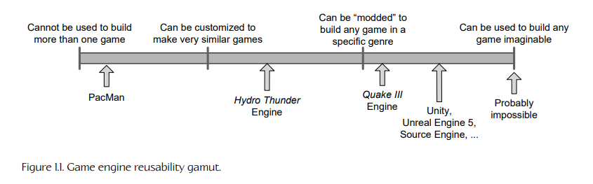

## 1.2 What Is a Game Engine?

“游戏引擎”（game engine）这一术语出现于 20 世纪 90 年代中期，最初用于指代第一人称射击游戏（FPS），例如 id Software 那款极其流行的 *Doom*。*Doom* 的架构在其核心软件组件（例如三维图形渲染系统、碰撞检测系统或音频系统）与构成玩家游戏体验的美术资源、游戏世界和玩法规则之间，做出了相当清晰的分离。随着开发者开始授权游戏，并仅通过最小程度地修改“引擎”软件，就能创建新的美术、世界布局、武器、角色、载具和游戏规则，将其改造成新产品，这种分离的价值变得十分明显。这标志着“mod 社区”（mod community）的诞生：这一群体由个人玩家和小型独立工作室组成，他们使用原开发者提供的免费工具包，通过修改已有游戏来构建新游戏。

到 20 世纪 90 年代末，一些游戏已经在设计时就考虑到了复用和“modding”，例如 *Quake III Arena* 和 *Unreal*。引擎通过 id 的 Quake C 这样的脚本语言变得高度可定制，而引擎授权也开始成为创建这些引擎的开发者可行的次要收入来源。今天，游戏开发者可以授权使用某个游戏引擎，并复用其中相当一部分关键软件组件来构建游戏。虽然这种做法仍然需要在自定义软件工程方面投入大量资源，但它可能比在内部开发所有核心引擎组件要经济得多。

游戏与其引擎之间的界线通常是模糊的。有些引擎会做出相对清晰的区分，而另一些引擎则几乎不会尝试将二者分开。在一个游戏中，渲染代码可能会明确“知道”如何绘制一个兽人。而在另一个游戏中，渲染引擎可能只提供通用的材质和着色设施，而“兽人性”（orc-ness）则完全在数据中定义。没有哪家工作室能够在游戏与引擎之间做出完全清晰的分离；考虑到这两个组成部分的定义往往会随着游戏设计逐渐成形而发生变化，这一点也可以理解。

可以说，数据驱动架构（data-driven architecture）正是游戏引擎区别于“是游戏但不是引擎的软件”的关键所在。当一款游戏包含硬编码逻辑或游戏规则，或者使用特殊情况代码来渲染特定类型的游戏对象时，要复用这套软件来制作另一款不同的游戏就会变得困难，甚至不可能。我们或许应该将“游戏引擎”这个术语保留给那些具有可扩展性，并且能够在不进行重大修改的情况下作为许多不同游戏基础的软件。

当然，这并不是一个非黑即白的区分。我们可以设想一个可复用性连续谱，每个引擎都位于这个连续谱上的某个位置。图 1.1 尝试标示了一些知名游戏/引擎在这一连续谱上的位置。

人们可能会认为，游戏引擎可以像 Apple QuickTime 或 Microsoft Windows Media Player 那样，成为一种能够播放几乎任何可想象游戏内容的通用软件。然而，这种理想尚未实现（也可能永远不会实现）。大多数游戏引擎都是经过精心打造和细致调校，用于在特定硬件平台上运行某个特定游戏的。即使是最通用的多平台引擎，实际上通常也只适合构建某一特定类型的游戏，例如第一人称射击游戏或竞速游戏。可以说，游戏引擎或中间件组件越通用，它在特定平台上运行特定游戏时就越不容易达到最优效果。

这种现象之所以出现，是因为设计任何高效软件都不可避免地要做出权衡，而这些权衡又基于关于软件如何被使用以及/或者目标硬件如何运行的假设。例如，一个为处理紧凑室内环境而设计的渲染引擎，很可能并不擅长渲染广阔的室外环境。室内引擎可能会使用二叉空间划分（BSP）树或传送门系统，以确保不会绘制被墙体或更靠近摄像机的物体遮挡的几何体。另一方面，室外引擎可能会使用较不精确的遮挡机制，或者根本不使用遮挡机制；但它很可能会大量使用细节层次（LOD）技术，确保远处物体用最少数量的三角形渲染，而靠近摄像机的几何体则使用高分辨率三角网格。

随着越来越快的计算机硬件和专用显卡出现，再加上越来越高效的渲染算法与数据结构，不同类型图形引擎之间的差异开始逐渐缩小。例如，现在已经可以使用第一人称射击游戏引擎来构建策略游戏。然而，通用性与最优性之间的权衡仍然存在。通过针对特定游戏以及/或者硬件平台的具体需求与约束对引擎进行细致调校，游戏总是可以变得更加出色。