## 1.3 不同类型中的引擎差异

游戏引擎通常在一定程度上具有类型针对性。一个为双人拳击格斗游戏设计的引擎，会与大型多人在线游戏（MMOG）引擎、第一人称射击游戏（FPS）引擎，或即时战略游戏（RTS）引擎非常不同。不过，不同类型之间也存在大量重叠——所有 3D 游戏，无论类型如何，都需要某种形式的底层用户输入，来自手柄、键盘和/或鼠标；需要某种形式的 3D 网格渲染；需要某种形式的抬头显示（HUD），包括使用不同字体进行文本渲染；需要强大的音频系统，等等。因此，虽然 Unreal Engine 最初是为第一人称射击游戏设计的，但它也成功用于构建许多其他类型的游戏，包括 Epic Games 广受欢迎的第三人称射击系列 *Gears of War*、Rocksteady Studios 的热门动作冒险游戏 *Batman: Arkham* 系列、Bandai Namco Studios 的知名格斗游戏 *Tekken 7*，以及 BioWare 的 *Mass Effect* 系列前三部角色扮演式第三人称射击游戏。

下面我们将看看一些最常见的游戏类型，并探索每种类型中特有的一些技术需求示例。

### 1.3.1 第一人称射击游戏（FPS）

第一人称射击游戏（FPS）类型的典型代表包括 *Quake*、*Unreal Tournament*、*Half-Life*、*Battlefield*、*Destiny*、*Titanfall* 和 *Overwatch*（见图 1.2）。从历史上看，这类游戏通常涉及玩家在一个可能较大但主要由走廊构成的世界中，以相对缓慢的步行方式移动。然而，现代第一人称射击游戏可以发生在各种各样的虚拟环境中，包括广阔的开放室外区域和狭窄的室内区域。现代 FPS 的移动机制可以包括步行移动、受轨道限制或自由移动的地面载具、气垫船、船只和飞行器。

第一人称游戏通常是技术上最具挑战性的游戏类型之一，其复杂度大概只会被第三人称射击游戏、动作平台游戏和大型多人游戏所匹敌。这是因为第一人称射击游戏的目标，是让玩家产生沉浸在一个细节丰富、高度真实世界中的错觉。因此，游戏行业中的许多重大技术创新都诞生于这一类型，也就并不令人意外。

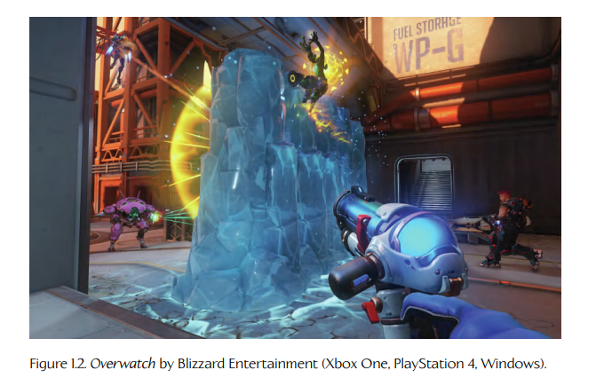

**Figure 1.2.** Blizzard Entertainment 的 *Overwatch*。

第一人称射击游戏通常重点关注如下技术：

- 大型 3D 虚拟世界的高效渲染；

- 响应迅速的摄像机控制/瞄准机制；

- 玩家虚拟手臂和武器的高保真动画；

- 种类丰富且威力强大的手持武器系统；

- 宽容的玩家角色运动与碰撞模型，这通常会让这类游戏具有一种“漂浮感”；

- 非玩家角色（NPC）——也就是玩家的敌人与盟友——的高保真动画和人工智能；

- 小规模在线多人能力（通常支持 10 到 100 名玩家同时游戏），以及无处不在的“死亡竞赛”（death match）游戏模式。

第一人称射击游戏所采用的渲染技术几乎总是经过高度优化，并且会针对被渲染的特定环境类型进行精细调校。例如，室内“地下城探索”类游戏通常会使用二叉空间划分树，或者基于传送门的渲染系统。室外 FPS 游戏则会使用其他类型的渲染优化，例如遮挡剔除，或者对游戏世界进行离线分区，并通过人工或自动方式指定从每个源分区可以看到哪些目标分区。

当然，要让玩家沉浸在一个高度真实的游戏世界中，所需的不仅仅是经过优化的高质量图形技术。在第一人称射击游戏中，角色动画、音频与音乐、刚体物理、游戏内过场动画，以及无数其他技术都必须达到前沿水平。因此，这一类型具有游戏行业中最严格、最广泛的技术需求之一。

### 1.3.2 平台游戏及其他第三人称游戏

“平台游戏”（platformer）这个术语用于指代一种基于第三人称角色的动作游戏，其核心玩法机制是从一个平台跳到另一个平台。2D 时代的典型游戏包括 *Space Panic*、*Donkey Kong*、*Pitfall!* 和 *Super Mario Brothers*。3D 时代则包括 *Super Mario 64*、*Crash Bandicoot*、*Rayman 2*、*Sonic the Hedgehog*、*Jak and Daxter* 系列（图 1.3）、*Ratchet & Clank* 系列，以及 *Super Mario Galaxy*。

从技术需求来看，平台游戏通常可以与第三人称射击游戏，以及像 *Just Cause 2*、*Gears of War 4*（图 1.4）、*Uncharted* 系列、*Resident Evil* 系列、*The Last of Us* 系列、*Red Dead Redemption 2* 等第三人称动作/冒险游戏归为一类。

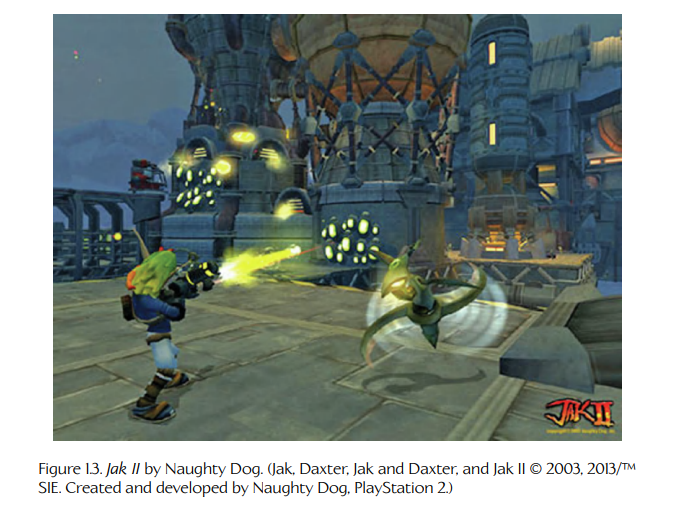

**Figure 1.3.** Naughty Dog 的 *Jak II*。

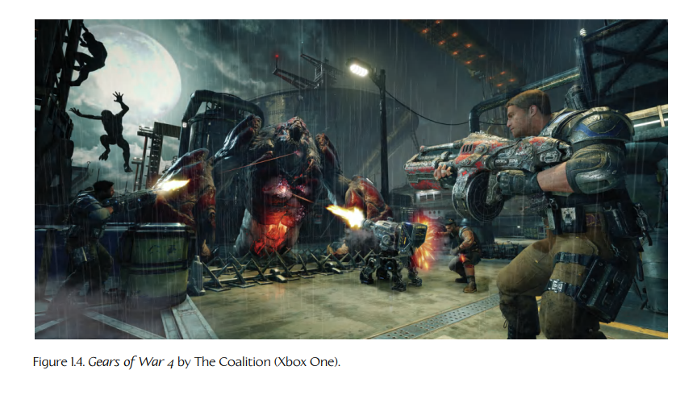

**Figure 1.4.** The Coalition 的 *Gears of War 4*。

基于第三人称角色的游戏与第一人称射击游戏有很多共同点，但它们会更加强调主角的能力和运动方式。此外，玩家虚拟形象需要高保真的全身角色动画，而不像典型 FPS 游戏中“漂浮手臂”那样，对动画的要求相对较低。这里需要注意的是，几乎所有第一人称射击游戏都有在线多人组件，因此除了第一人称手臂之外，还必须渲染一个完整身体的玩家虚拟形象。然而，这些 FPS 玩家虚拟形象的保真度通常无法与同一游戏中的非玩家角色相比，也无法与第三人称游戏中的玩家虚拟形象相比。

在平台游戏中，主角往往更接近卡通风格，并不特别真实或高分辨率。然而，第三人称射击游戏通常会采用高度写实的类人玩家角色。在这两种情况下，玩家角色通常都拥有非常丰富的动作和动画集合。

这一类型游戏特别关注的一些技术包括：

- 移动平台、梯子、绳索、格架以及其他有趣的移动方式；

- 类似谜题的环境元素；

- 第三人称“跟随摄像机”（follow camera），它会始终聚焦在玩家角色上，其旋转通常由人类玩家通过右摇杆（在主机上）或鼠标（在 PC 上）控制——需要注意的是，虽然 PC 上有许多流行的第三人称射击游戏，但平台游戏这一类型几乎完全存在于主机平台上；

- 复杂的摄像机碰撞系统，用于确保视点永远不会“穿过”背景几何体或动态前景物体。

### 1.3.3 格斗游戏

格斗游戏通常是双人游戏，涉及类人角色在某种竞技场中互相击打。这一类型的典型代表包括 *Soul Calibur* 和 *Tekken 3*（见图 1.5）。

传统上，格斗游戏类型的技术重点包括：

- 丰富的格斗动画集合；

- 精确的命中检测；

- 能够检测复杂按钮与摇杆组合的用户输入系统；

- 人群，以及其他相对静态的背景。

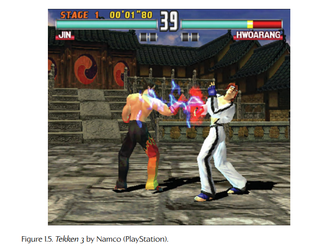

**Figure 1.5.** Namco 的 *Tekken 3*。

由于这类游戏中的 3D 世界较小，并且摄像机始终聚焦在动作发生处，因此从历史上看，它们几乎不需要世界细分或遮挡剔除。例如，它们通常也不会被期望采用高级的三维音频传播模型。

现代格斗游戏，例如 EA 的 *Fight Night Round 4* 和 NetherRealm Studios 的 *Injustice 2*（图 1.6），则通过以下特性提高了技术门槛：

- 高清角色图形；

- 带有次表面散射和汗水效果的真实皮肤着色器；

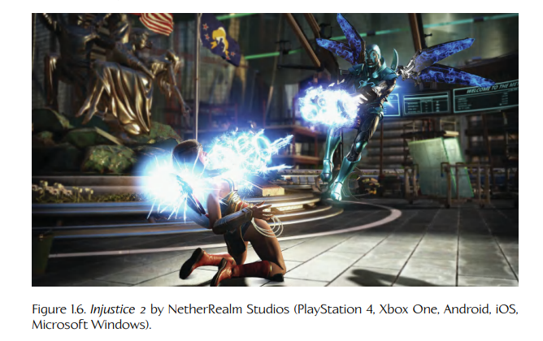

**Figure 1.6.** NetherRealm Studios 的 *Injustice 2*。

- 照片级真实光照和粒子效果；

- 高保真角色动画；

- 基于物理的角色布料与头发仿真。

需要注意的是，一些格斗游戏，例如 Ninja Theory 的 *Heavenly Sword* 和 Ubisoft Montreal 的 *For Honor*，发生在大规模虚拟世界中，而不是受限竞技场中。事实上，许多人会将其视为一个单独类型，有时称为清版动作游戏（brawler）。这种格斗游戏的技术需求可能更接近第三人称射击游戏或策略游戏。

### 1.3.4 竞速游戏

竞速游戏类型包括所有以驾驶汽车或其他某种载具在赛道上行驶为主要任务的游戏。该类型有许多子类别。偏重模拟的竞速游戏（“sims”）旨在提供尽可能真实的驾驶体验（例如 *Gran Turismo*）。街机竞速游戏则更偏好夸张的娱乐性，而不是现实主义（例如 *San Francisco Rush*、*Cruis’n USA*、*Hydro Thunder*）。有一种子类型探索街头赛车亚文化，使用经过改装的民用车辆（例如 *Need for Speed*、*Juiced*）。卡丁车竞速则是一种子类型，它会让平台游戏中的流行角色或电视卡通角色重新扮演古怪车辆的驾驶者（例如 *Mario Kart*、*Jak X*、*Freaky Flyers*）。竞速游戏也并不总是涉及基于时间的比赛。例如，一些卡丁车竞速游戏会提供玩家互相射击、收集战利品，或参与各种计时与非计时任务的模式。

竞速游戏通常非常线性，很像早期的 FPS 游戏。然而，其移动速度通常远快于 FPS。因此，这类游戏会更关注非常长的基于走廊的赛道，或环形赛道，有时还带有各种替代路线和秘密捷径。竞速游戏通常会把全部图形细节集中在车辆、赛道和近处环境上。作为示例，图 1.7 展示了知名 *Gran Turismo* 竞速游戏系列最新作品 *Gran Turismo Sport* 的截图，该游戏由 Polyphony Digital 开发，并由 Sony Interactive Entertainment 发行。不过，卡丁车竞速游戏也会把大量渲染和动画资源投入到驾驶车辆的角色身上。

典型竞速游戏的一些技术属性包括如下技术：

- 在渲染远处背景元素时会使用各种“技巧”，例如使用二维卡片来表示树木、丘陵和山脉。

- 赛道通常会被划分为相对简单的二维区域，称为“分区”（sectors）。这些数据结构用于优化渲染和可见性判定，辅助非玩家控制车辆的人工智能与寻路，并解决许多其他技术问题。

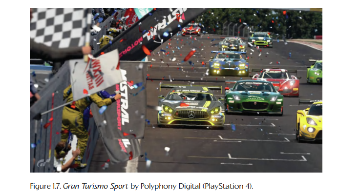

**Figure 1.7.** Polyphony Digital 的 *Gran Turismo Sport*。

- 摄像机通常会以第三人称视角跟随在车辆后方，或者有时位于驾驶舱内，以第一人称方式呈现。

- 当赛道包含隧道和其他“狭窄”空间时，通常需要投入大量精力来确保摄像机不会与背景几何体发生碰撞。

### 1.3.5 策略游戏

现代策略游戏类型可以说是由 *Dune II: The Building of a Dynasty*（1992）定义的。该类型中的其他游戏包括 *Warcraft*、*Command & Conquer*、*Age of Empires* 和 *Starcraft*。在这一类型中，玩家会将自己掌握的战斗单位部署到大型战场上，试图压倒对手。游戏世界通常以倾斜的俯视视角显示。人们通常会区分回合制策略游戏和即时战略游戏（RTS）。

策略游戏玩家通常会被限制在观察角度变化不大的状态下，以便跨越很大的距离进行观察。这种限制允许开发者在策略游戏的渲染引擎中采用各种优化手段。

该类型的早期游戏采用基于网格（基于单元格）的世界构造，并使用正交投影来极大简化渲染器。例如，图 1.8 展示了经典策略游戏 *Age of Empires* 的截图。

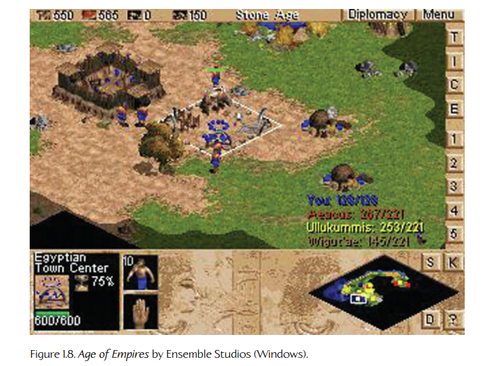

**Figure 1.8.** Ensemble Studios 的 *Age of Empires*。

现代策略游戏有时会使用透视投影和真正的 3D 世界，但它们仍然可能使用网格布局系统，以确保单位和建筑等背景元素能够彼此正确对齐。一个流行示例 *Total War: Warhammer 2* 如图 1.9 所示。

其他一些策略游戏中的常见做法包括如下技术：

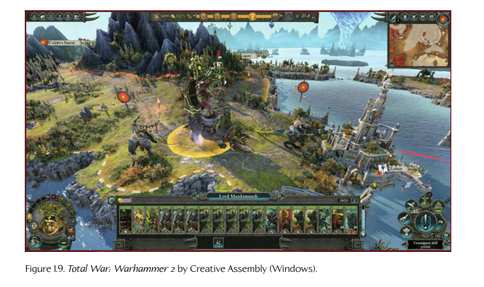

**Figure 1.9.** Creative Assembly 的 *Total War: Warhammer 2*。

- 每个单位的分辨率相对较低，这样游戏就可以同时在屏幕上支持大量单位。

- 高度场地形通常是游戏被设计和游玩的画布。

- 除了部署自己的部队之外，玩家通常还可以在地形上建造新的结构。

- 用户交互通常通过单击和基于区域的单位选择实现，并辅以包含命令、装备、单位类型、建筑类型等内容的菜单或工具栏。

### 1.3.6 大型多人在线游戏

大型多人在线游戏（MMOG，或简称 MMO）类型的典型代表包括 *Guild Wars 2*（ArenaNet/NCsoft）、*EverQuest*（989 Studios/SOE）、*World of Warcraft*（Blizzard）和 *Star Wars Galaxies*（SOE/Lucas Arts）等。MMO 被定义为任何支持大量同时在线玩家的游戏（从数千到数十万），这些玩家通常都在同一个非常庞大、持久的虚拟世界中游玩。所谓持久世界，指的是这个世界的内部状态会持续很长时间，远远超过任何单个玩家的一次游戏会话。除此之外，MMO 的游戏体验通常类似于其小规模多人游戏对应类型。该类型的子类别包括 MMO 角色扮演游戏（MMORPG）、MMO 即时战略游戏（MMORTS）和 MMO 第一人称射击游戏（MMOFPS）。图 1.10 展示了极其流行的 MMORPG *World of Warcraft* 的截图。

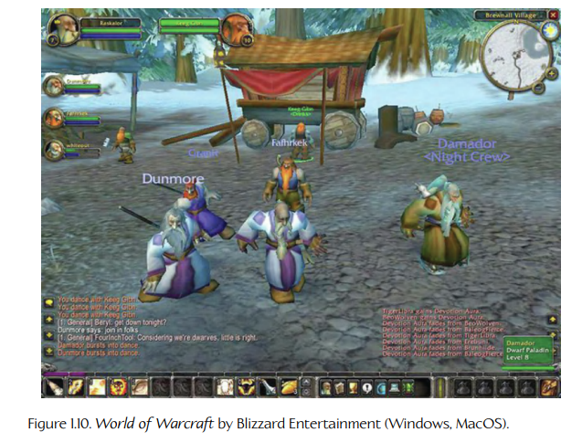

**Figure 1.10.** Blizzard Entertainment 的 *World of Warcraft*。

所有 MMOG 的核心，都是一组非常强大的服务器。这些服务器维护游戏世界的权威状态，管理用户登录和退出游戏，提供用户之间的聊天或基于 IP 的语音（VoIP）服务，以及更多功能。几乎所有 MMOG 都要求用户支付某种定期订阅费用才能游玩，并且它们还可能在游戏内或游戏外提供微交易。因此，中央服务器最重要的职责之一，可能就是处理计费和微交易，而这些内容通常是游戏开发者的主要收入来源。

MMO 中的图形保真度几乎总是低于非大型多人游戏对应类型，这是由这类游戏巨大的世界尺寸和极大的用户承载量造成的。

图 1.11 展示了 Bungie 最新 FPS 游戏 *Destiny 2* 中的一个画面。这款游戏被称为 MMOFPS，因为它融合了 MMO 类型的某些方面。不过，Bungie 更愿意称其为“共享世界”（shared world）游戏，因为与传统 MMO 不同，在传统 MMO 中，玩家可以看到并与特定服务器上的几乎任何其他玩家互动，而 *Destiny* 提供的是“即时匹配”（on-the-fly match-making）。这使玩家只能与服务器为其匹配到的其他玩家互动；而这一匹配系统在 *Destiny 2* 中已经得到了显著改进。此外，与传统 MMO 不同，*Destiny 2* 的图形保真度可与第一人称和第三人称射击游戏相媲美。

游戏 *PUBG: Battlegrounds* 推广了一种称为大逃杀（battle royale）的子类型。这类游戏模糊了普通多人射击游戏与大型多人在线游戏之间的界线，因为它们通常会让大约 100 名玩家在同一个在线世界中相互对抗，并采用基于生存的“最后一人站立”（last person standing）玩法风格。

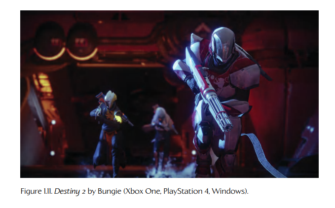

**Figure 1.11.** Bungie 的 *Destiny 2*。

### 1.3.7 玩家创作内容

随着社交媒体的发展，游戏在本质上正变得越来越具有协作性。游戏设计中的一个近期趋势是转向玩家创作内容（player-authored content）。例如，Media Molecule 的 *LittleBigPlanet*、*LittleBigPlanet™ 2*（图 1.12）和 *LittleBigPlanet™ 3: The Journey Home* 在技术上都是解谜平台游戏，但它们最显著、最独特的特征在于，它们鼓励玩家创建、发布和分享自己的游戏世界。Media Molecule 在这一富有吸引力的类型中的最新作品是面向 PlayStation 4 的 *Dreams*（图 1.13）。

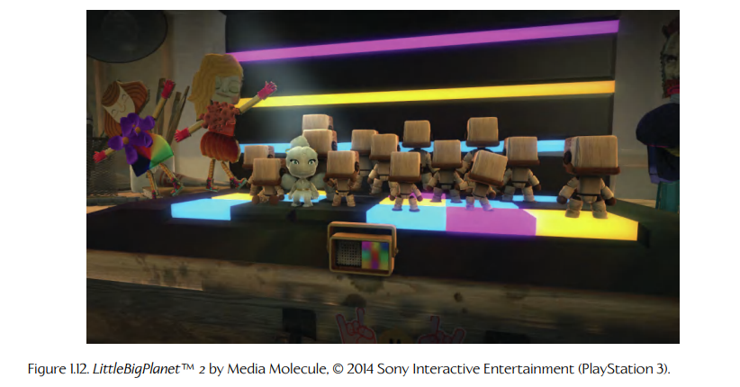

**Figure 1.12.** Media Molecule 的 *LittleBigPlanet 2*。

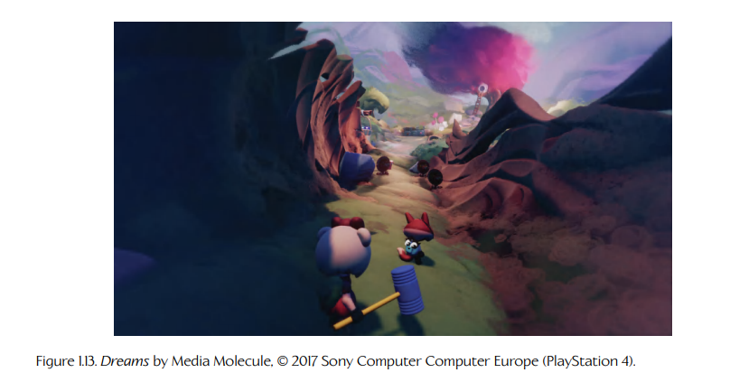

**Figure 1.13.** Media Molecule 的 *Dreams*。

也许当今玩家创作内容类型中最受欢迎的游戏是 *Minecraft*（图 1.14）。这款游戏的精彩之处在于它的简单性：*Minecraft* 的游戏世界由简单的立方体类体素元素构建而成，这些元素映射了低分辨率纹理，用于模拟各种材料。方块可以是实心的，也可以包含火把、铁砧、标牌、栅栏和玻璃板等物品。游戏世界中会出现一个或多个玩家角色、鸡和猪等动物，以及各种“怪物”（mobs）——例如村民这样的好人，僵尸这样的坏人，以及无处不在的 creepers，它们会悄悄靠近毫无戒备的玩家并爆炸（通常在用燃烧引信的“嘶嘶声”提醒玩家之后片刻发生）。

玩家可以在 *Minecraft* 中创建一个随机生成的世界，然后挖掘生成的地形来创建隧道和洞穴。他们也可以建造自己的结构，从简单的地形与植被，到庞大复杂的建筑和机械。也许 *Minecraft* 中最天才的一笔是红石（redstone）。这种材料可以作为“线路”，使玩家能够铺设控制活塞、漏斗、矿车和游戏中其他动态元素的电路。于是，玩家实际上可以创造出他们能够想象的几乎任何东西，然后通过托管服务器并邀请朋友在线游玩，来分享自己的世界。

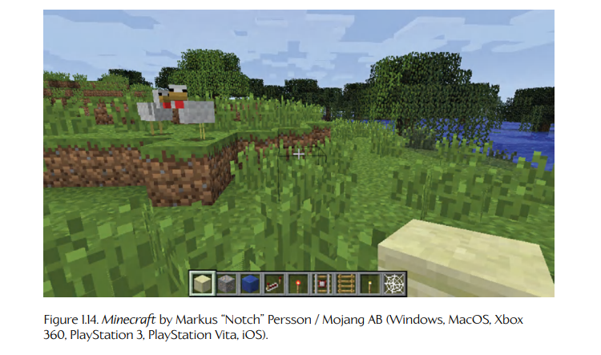

**Figure 1.14.** Markus “Notch” Persson / Mojang AB 的 *Minecraft*。

### 1.3.8 虚拟现实、增强现实与混合现实

虚拟现实、增强现实和混合现实是令人兴奋的新技术，它们旨在让观看者沉浸在一个 3D 世界中。这个世界要么完全由计算机生成，要么由计算机生成的图像进行增强。这些技术在游戏行业之外有许多应用，但它们也已经成为承载各种游戏内容的可行平台。

#### 1.3.8.1 虚拟现实

虚拟现实（virtual reality，VR）可以定义为一种沉浸式多媒体或计算机模拟现实，它会模拟用户置身于某个环境中的感觉，而这个环境既可以是真实世界中的某个地方，也可以是一个想象世界。计算机生成 VR（CG VR）是其中的一个子集，其虚拟世界完全通过计算机图形生成。用户通过佩戴 HTC Vive、Oculus Rift、Sony PlayStation VR、Samsung Gear VR 或 Google Daydream View 这样的头显来观看这个虚拟环境。头显会将内容直接显示在用户眼前；系统还会跟踪头显在真实世界中的运动，从而让虚拟摄像机的运动能够与佩戴头显者的运动完美匹配。用户通常还会手持设备，使系统能够跟踪双手的运动。这允许用户与虚拟世界交互：例如，物体可以被推动、拾起或投掷。

#### 1.3.8.2 增强现实与混合现实

增强现实（augmented reality，AR）和混合现实（mixed reality，MR）这两个术语常常被混淆，或者被交替使用。两种技术都会向用户呈现真实世界的视图，但使用计算机图形来增强体验。在这两种技术中，智能手机、平板电脑或带有技术增强功能的眼镜等观看设备，会显示真实世界场景的实时或静态视图，并将计算机图形叠加在该图像之上。在实时 AR 和 MR 系统中，观看设备中的加速度计允许虚拟摄像机的运动跟踪设备的运动，从而产生一种错觉：这个设备只是我们观看真实世界的一扇窗口，因此让叠加的计算机图形具有强烈的真实感。

有些人会这样区分这两种技术：使用“增强现实”来描述那些将计算机图形叠加在真实世界的实时、直接或间接视图之上，但不将其锚定到真实世界中的技术。另一方面，“混合现实”这一术语则更常用于使用计算机图形渲染想象对象，并将这些对象锚定到真实世界、使其看起来存在于真实世界中的情况。然而，这一区分并没有被普遍接受。

下面是一些 AR 技术实际应用的例子：

- 美国陆军为士兵提供了一种名为“战术增强现实”（tactical augmented reality，TAR）的系统，用于提升战术态势感知能力——它会把类似电子游戏的抬头显示（HUD）叠加到士兵对真实世界的视野中，其中包括小地图和对象标记 [61]。

- 2015 年，Disney 展示了一项很酷的 AR 技术：在一张真实世界纸张上，用户用蜡笔给某个 2D 角色上色后，系统会在纸张上方渲染该角色的 3D 卡通形象 [62]。

- PepsiCo 也曾用一个支持 AR 的公交站恶作剧通勤的伦敦市民。坐在公交站候车亭里的人会看到 AR 图像，例如潜行的老虎、坠落的陨石，以及从街上抓住毫无戒备路人的外星触手 [63]。

下面是一些 MR 的例子：

- 从 Android 8.1 开始，Pixel 1 和 Pixel 2 上的相机应用支持 AR Stickers。这是一项有趣的功能，允许用户把动画 3D 对象和角色放入视频和照片中。

- Microsoft 的 HoloLens 是混合现实的另一个例子。它会将锚定于现实世界的图形叠加到实时视频图像之上，并且可以用于包括教育与培训、工程、医疗保健和娱乐在内的广泛应用。

#### 1.3.8.3 VR/AR/MR 游戏

游戏行业目前正在试验 VR 和 AR/MR 技术，并试图在这些新媒介中找到自己的立足点。一些传统 3D 游戏已经被“移植”（ported）到 VR 上，产生了非常有趣但不一定特别创新的体验。不过，也许更令人兴奋的是，一些全新的游戏类型正在开始出现，它们提供了如果没有 VR 或 AR/MR 就无法实现的游戏体验。

例如，Owlchemy Labs 的 *Job Simulator* 会将用户带入一个由机器人运营的虚拟职业博物馆，并要求用户以调侃式方式近似执行各种真实世界工作，使用一些在非 VR 平台上根本无法成立的游戏机制。Owlchemy 的下一部作品 *Vacation Simulator*，则将同样异想天开式的幽默感和艺术风格应用到这样一个世界中：*Job Simulator* 中的机器人邀请玩家放松并完成各种任务。图 1.15 展示了 HTC Vive 上另一款创新且有些令人不安的游戏 *Accounting* 的截图；这款游戏来自 “Rick & Morty” 和 *The Stanley Parable* 的创作者。

#### 1.3.8.4 VR 游戏引擎

VR 游戏引擎在许多方面与第一人称射击游戏引擎在技术上相似，事实上许多支持 FPS 的引擎，例如 Unity 和 Unreal Engine，都“开箱即用”地支持 VR。不过，VR 游戏在若干重要方面不同于 FPS 游戏：

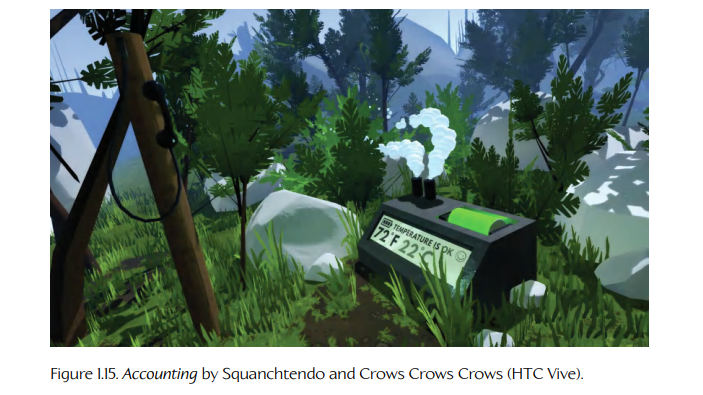

**Figure 1.15.** Squanchtendo 和 Crows Crows Crows 的 *Accounting*。

- **立体渲染（stereoscopic rendering）。** VR 游戏需要将场景渲染两次，每只眼睛一次。这会使必须渲染的图形图元数量翻倍，不过图形管线的其他方面，例如可见性剔除，可以每帧只执行一次，因为两只眼睛彼此相当接近。因此，VR 游戏的渲染成本并不完全等同于以分屏多人模式渲染同一款游戏的成本，但其基本原则是一样的：从两个略有不同的虚拟摄像机各渲染一次场景。

- **非常高的帧率。** 研究表明，VR 在低于每秒 90 帧运行时，很可能会导致方向感丧失、恶心以及其他负面用户效果。这意味着 VR 系统不仅需要每帧渲染场景两次，而且还需要以 90 FPS 以上的速度完成。因此，VR 游戏和应用通常必须运行在高性能 CPU 和 GPU 硬件上。

- **导航问题。** 在 FPS 游戏中，玩家可以直接使用手柄或 WASD 键在游戏世界中四处行走。在 VR 游戏中，用户可以通过在真实世界中实际走动来实现少量移动，但安全的物理游玩区域通常非常小（大约只有一个小浴室或衣柜大小）。通过“飞行”方式移动也容易引起恶心，因此大多数游戏会选择点击式传送机制，让虚拟玩家/摄像机跨越较大距离。也有人构想了各种真实世界设备，使 VR 用户能够用自己的脚“原地行走”，从而在 VR 世界中移动。

当然，VR 也在一定程度上通过提供传统电子游戏中不可能实现的新型用户交互范式，弥补了这些限制。例如：

- 用户可以在真实世界中伸手触碰、拾起并投掷虚拟世界中的物体；

- 玩家可以通过在真实世界中实际躲闪，来躲避虚拟世界中的攻击；

- 新的用户界面机会成为可能，例如把浮动菜单附着到用户的虚拟手上，或者看到游戏制作人员名单写在虚拟世界中的白板上；

- 玩家甚至可以拿起一副虚拟 VR 眼镜并戴到自己头上，从而被传送到一个“嵌套”的 VR 世界中——这种效果或许最适合称为“VR-ception”。

#### 1.3.8.5 基于位置的娱乐

像 *Pokémon Go* 这样的游戏，既不会把图形叠加到真实世界图像之上，也不会生成一个完全沉浸式的虚拟世界。然而，用户对 *Pokémon Go* 中计算机生成世界的视图，确实会响应用户手机或平板电脑的运动，这很像 360 度视频。同时，游戏也知道你在真实世界中的实际位置，并会提示你去附近的公园、商场和餐厅寻找宝可梦。这类游戏并不真正属于 AR/MR，但也不完全属于 VR 类型。这样的游戏或许更适合被描述为一种基于位置的娱乐（location-based entertainment），尽管有些人确实会用 AR 这一称呼来指代这类游戏。

### 1.3.9 其他类型

当然，还有许多其他游戏类型，我们不会在这里深入讨论。一些例子包括：

- 体育游戏，并且每一种主要体育项目都有其子类型（橄榄球、棒球、足球、高尔夫等）；

- 角色扮演游戏（RPG）；

- 上帝游戏，例如 *Populous* 和 *Black & White*；

- 环境/社会模拟游戏，例如 *SimCity* 或 *The Sims*；

- 类似 *Tetris* 的解谜游戏；

- 非电子游戏的转换版本，例如国际象棋、纸牌游戏、围棋等；

- 网页游戏，例如 Electronic Arts 的 Pogo 网站所提供的游戏；

这个列表还可以继续延伸。

我们已经看到，每一种游戏类型都有自己特定的技术需求。这解释了为什么游戏引擎在传统上会因类型不同而存在相当大的差异。然而，不同类型之间也存在大量技术重叠，尤其是在同一硬件平台的语境下。随着硬件变得越来越强大，由优化问题导致的不同类型之间的差异也开始逐渐消失。因此，在不同类型之间，甚至在不同硬件平台之间复用同一种引擎技术，正在变得越来越可行。
