## 1.5 运行时引擎架构

游戏引擎通常由一套工具集和一个运行时组件组成。我们会先探索运行时部分的架构，然后在下一节中进入工具架构。

图 1.16 展示了构成典型 3D 游戏引擎的所有主要运行时组件。没错，它很大！而且这张图甚至还没有包含所有工具。游戏引擎无疑是大型软件系统。

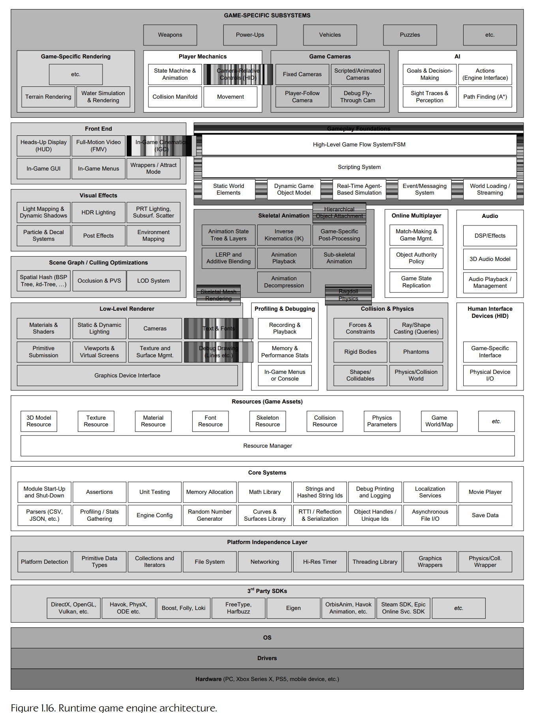

**Figure 1.16.** 运行时游戏引擎架构。

和所有软件系统一样，游戏引擎也是分层构建的。通常，上层依赖下层，但反过来不成立。当某个下层依赖更高层时，我们称之为循环依赖（circular dependency）。在任何软件系统中都应该避免依赖循环，因为它们会导致系统之间产生不良耦合，使软件难以测试，并阻碍代码复用。对于像游戏引擎这样的大型系统来说，这一点尤其重要。

接下来，我们会简要概览图 1.16 中所示的组件。本书其余部分将花大量篇幅更深入地研究这些组件，并学习这些组件通常如何集成为一个可工作的整体。

### 1.5.1 目标硬件

目标硬件层表示游戏运行所在的计算机系统或主机。典型平台包括基于 Microsoft Windows、Linux 和 MacOS 的 PC；移动平台，例如 Apple iPhone 和 iPad、Android 智能手机和平板电脑、Sony 的 PlayStation Vita，以及 Amazon 的 Kindle Fire 等；还包括游戏主机，例如 Microsoft 的 Xbox、Xbox 360、Xbox One 和 Xbox Series X/S，Sony 的 PlayStation、PlayStation 2、PlayStation 3、PlayStation 4 和 PlayStation 5，以及 Nintendo 的 DS、GameCube、Wii、Wii U 和 Switch。本书中的大多数主题都与平台无关，但在相关差异重要时，我们也会涉及一些 PC 或主机开发特有的设计考虑。

### 1.5.2 设备驱动程序

设备驱动程序是由操作系统或硬件厂商提供的底层软件组件。驱动程序负责管理硬件资源，并屏蔽操作系统和上层引擎层，使其不必直接处理与各种硬件设备变体通信的细节。

### 1.5.3 操作系统

在 PC 上，操作系统（OS）始终处于运行状态。它负责协调一台计算机上多个程序的执行，而你的游戏只是其中之一。像 Microsoft Windows 这样的操作系统使用分时方法，让硬件在多个运行中的程序之间共享，这称为抢占式多任务（preemptive multitasking）。这意味着 PC 游戏永远不能假定自己完全控制硬件——它必须与系统中的其他程序“友好相处”。

在早期主机上，如果操作系统存在，它通常也只是一个直接编译进游戏可执行文件中的很薄的库层。在这些早期系统中，游戏运行时“拥有”整台机器。然而，在现代主机上情况已经不再如此。Xbox 360、Xbox One、Xbox Series X/S、PlayStation 3、PlayStation 4 和 PlayStation 5 上的操作系统，都可以中断游戏执行，或者接管某些系统资源，例如显示在线消息，或者允许玩家暂停游戏并调出 PS5 的用户界面或 Xbox 的 dashboard。在 PS5 和 Xbox Series X/S 上，操作系统会持续运行后台任务，例如录制你的游戏过程视频，以便你决定通过 PS5 手柄上的 Share 按钮分享，或者下载游戏、补丁和 DLC，让你可以一边等待一边玩游戏。因此，主机开发与 PC 开发之间的差距正在逐渐缩小（无论好坏）。

### 1.5.4 第三方 SDK 与中间件

如图 1.17 所示，大多数游戏引擎都会利用若干第三方软件开发工具包（SDK）和中间件。SDK 提供的函数式或基于类的接口，通常称为应用程序编程接口（API）。下面我们来看几个例子。

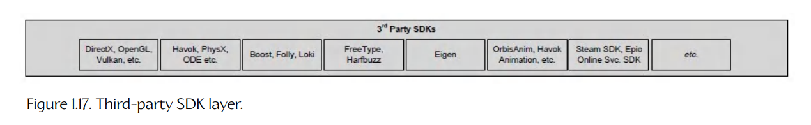

**Figure 1.17.** 第三方 SDK 层。

#### 1.5.4.1 数据结构与算法

像任何软件系统一样，游戏高度依赖容器（container）数据结构，以及用于操作这些数据结构的算法。下面是一些提供这类服务的第三方库示例：

- *Boost*。Boost 是一个强大的数据结构与算法库，其设计风格类似于标准 C++ 库及其前身标准模板库（STL）。（Boost 的在线文档也是学习计算机科学通用知识的好地方！）

- *Folly*。Folly 是 Facebook 使用的一个库，目标是扩展标准 C++ 库和 Boost，提供各种有用设施，并强调最大化代码性能。

- *Loki*。Loki 是一个强大的泛型编程模板库，它尤其擅长让你的大脑感到疼痛！

**C++ 标准库与 STL。**

C++ 标准库也提供了许多与 Boost 等第三方库相同类型的设施。标准库中实现泛型容器类的子集，例如 `std::vector` 和 `std::list`，通常被称为标准模板库（standard template library，STL），虽然从技术上说这有些用词不当：标准模板库最初由 Alexander Stepanov 和 David Musser 在 C++ 语言标准化之前编写。这个库的许多功能后来被吸收进如今的 C++ 标准库。在本书中，当我们使用 STL 这个术语时，它通常指的是 C++ 标准库中提供泛型容器类的子集，而不是最初的 STL。

#### 1.5.4.2 图形

大多数游戏渲染引擎都构建在某种硬件接口库之上，例如：

- *Simple MediaDirect Layer*（SDL）是一个跨平台硬件抽象库，旨在支持多媒体应用和游戏的开发。SDL 让程序员能够访问音频、人机接口设备、网络、计时器、图形等内容。

- *Glide* 是旧 Voodoo 显卡的 3D 图形 SDK。这个 SDK 在硬件变换与光照（hardware T&L）时代之前很流行，而硬件 T&L 始于 DirectX 7。

- *OpenGL* 是一个被广泛使用的可移植 3D 图形 SDK。

- *DirectX* 是 Microsoft 的 3D 图形 SDK，也是 OpenGL 的主要竞争者。

- *libgcm* 是面向 PlayStation 3 的 RSX 图形硬件的底层直接接口，由 Sony 提供，作为 OpenGL 的更高效替代方案。

- *Gnm* 是面向 PlayStation 5 的 AMD RDNA-2 图形硬件的底层直接接口。

- *Vulkan* 是 Khronos™ Group 创建的底层库，它允许游戏程序员以命令列表的形式，将渲染批次和 GPGPU 计算任务直接提交给 GPU，并且让他们能够对内存、同步原语以及 CPU 与 GPU 共享的其他资源进行细粒度控制。（更多关于 GPGPU 编程的内容见第 4.11 节。）

- *Metal* 是 Apple 在 iOS 8 中引入的底层 3D 图形库。它的功能可与 Vulkan 和 DirectX 12 相媲美。

#### 1.5.4.3 碰撞与物理

碰撞检测和刚体动力学（在游戏开发社区中通常简称为“物理”）由以下知名 SDK 提供：

- *Havok* 是一个流行的工业级物理与碰撞引擎。

- *PhysX* 是另一个流行的工业级物理与碰撞引擎，可以从 NVIDIA 免费下载。

- *Open Dynamics Engine*（ODE）是一个知名的开源物理/碰撞包。

#### 1.5.4.4 角色动画

存在许多商业动画包，包括但当然不限于以下几种：

- *Granny*。RAD Game Tools 的 Granny 工具包（已不再支持）包含稳健的 3D 模型和动画导出器，支持 Maya、3D Studio MAX 等所有主要 3D 建模和动画软件包；还包含一个运行时库，用于读取和操作导出的模型与动画数据；以及一个强大的运行时动画系统。在我看来，Granny SDK 拥有我见过的所有商业或专有动画 API 中设计最好、逻辑最清晰的接口，尤其是它对时间的出色处理。

- *Havok Animation*。随着角色越来越真实，物理和动画之间的界线正在变得越来越模糊。开发流行 Havok 物理 SDK 的公司决定创建一个互补的动画 SDK，这使得弥合物理—动画之间的鸿沟比以往容易得多。

- *OrbisAnim*。OrbisAnim 库是一个强大而高效的动画引擎。它由 SN Systems 与 Naughty Dog 的 ICE 和游戏团队、Sony Interactive Entertainment 的 Tools and Technology 小组，以及 Sony 欧洲 Advanced Technology Group 共同为 PS4 生产。它今天仍在 PS5 上使用。

#### 1.5.4.5 其他第三方库

其他一些常用第三方库包括：

- *FreeType*。FreeType 是一个自由软件库，允许开发者加载各种格式的字体文件，例如 TrueType（TTF）和 OpenType（OTF），并使用它们以任意所需尺寸光栅化字形。这个库经常被用作游戏引擎屏幕文本渲染方案的基础。

- *HarfBuzz*。HarfBuzz 文本整形引擎通常与 FreeType 结合使用。文本整形（text shaping）是沿基线布局字形以构建可渲染文本字符串的过程。HarfBuzz 会处理整形过程中的所有细节，包括字距调整、与语言相关的重音和元音格式规则，以及支持阿拉伯语和希伯来语等语言所需的从右到左布局。

- *Eigen*。Eigen 是一个用于执行线性代数和矩阵数学的 C++ 模板库。

- *Steamworks SDK*。这个库帮助游戏开发者将游戏发布到 Steam。上传游戏内容到 Steam 需要该 SDK，但它也提供大量有用工具，包括支持 Steam Overlay 用户界面、Steam Achievements 成就、Steam Leaderboards 排行榜，以及允许用户邀请朋友在线游玩的工具。

- *Epic Online Services SDK*。Epic Online Services（EOS）SDK 与 Steamworks SDK 类似，但它旨在帮助开发者将游戏部署到 Epic Game Store（EGS），并在 Epic 生态系统中支持玩家。

### 1.5.5 平台无关层

大多数游戏引擎都需要能够在多个硬件平台上运行。例如，Electronic Arts 和 ActivisionBlizzard Inc. 这样的公司，总是把游戏目标设定在大量不同平台上，因为这样可以让游戏触达尽可能大的市场。通常，唯一不以至少两个不同平台为目标的游戏工作室，是第一方工作室，例如 Sony 的 Naughty Dog 和 Insomniac。因此，大多数游戏引擎都会像图 1.18 所示那样，架构出一个平台无关层。这个层位于硬件、驱动程序、操作系统和其他第三方软件之上，通过把某些接口函数“包装”（wrapping）进自定义函数中，使引擎其余部分不必了解底层平台的大部分细节；而这些自定义函数则可以由你这个游戏开发者在每个目标平台上控制。

将函数“包装”进游戏引擎的平台无关层，主要有两个原因。第一，一些应用程序编程接口（API），例如操作系统提供的接口，甚至旧“标准”库（如 C 标准库）中的一些函数，在不同平台之间差异很大；包装这些函数可以让引擎其余部分在所有目标平台上拥有一致的 API。第二，即使使用完全跨平台的库，例如 Havok，你也可能希望让自己免受未来变化影响，例如将来把引擎切换到另一个碰撞/物理库。

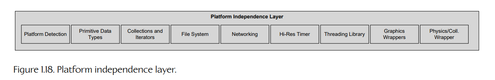

**Figure 1.18.** 平台无关层。

### 1.5.6 核心系统

每一个游戏引擎，实际上也包括每一个大型复杂 C++ 软件应用，都需要一整套有用的软件工具。我们会把它们归类为“核心系统”（core systems）。图 1.19 展示了一个典型核心系统层。下面是核心层通常提供的一些功能示例：

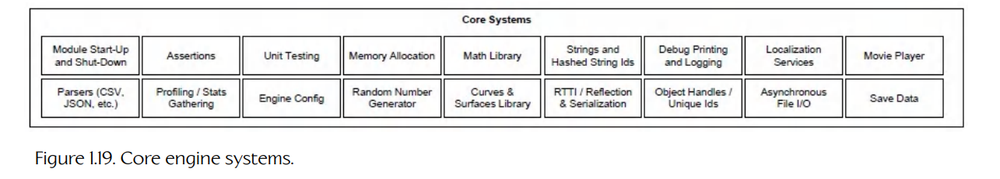

**Figure 1.19.** 核心引擎系统。

- *断言（assertions）* 是插入到程序中的错误检查代码行，用于捕捉逻辑错误和违反程序员原始假设的情况。断言检查通常会从游戏最终生产版本中剔除。（断言将在第 3.2.3.3 节中介绍。）

- *内存管理（memory management）*。几乎每个游戏引擎都会实现自己的自定义内存分配系统，以确保高速分配和释放，并限制内存碎片带来的负面影响（见第 6.2.1 节）。

- *数学库（math library）*。游戏在本质上高度依赖数学。因此，每个游戏引擎至少都会有一个数学库，如果不是多个的话。这些库提供向量和矩阵数学、四元数旋转、三角学、直线/射线/球体/视锥体等几何运算、样条曲线操作、数值积分、方程组求解，以及游戏程序员所需的其他各种功能。

- *自定义数据结构和算法（custom data structures and algorithms）*。除非引擎设计者决定完全依赖 Boost 和 Folly 等第三方包，否则通常需要一套用于管理基础数据结构（链表、动态数组、二叉树、哈希映射等）和算法（搜索、排序等）的工具。这些工具通常是手写的，目的是最小化或消除动态内存分配，并确保在目标平台上获得最佳运行时性能。

关于最常见核心引擎系统的详细讨论，可见第 6 章到第 10 章。

### 1.5.7 资源管理器

资源管理器以某种形式存在于每个游戏引擎中，它提供一个统一接口（或一组接口），用于访问所有类型的游戏资源和其他引擎输入数据。有些引擎会以高度集中且一致的方式完成这件事（例如 Unreal 的 packages、OGRE 的 `ResourceManager` 类）。其他引擎则采用临时方式，通常把直接访问磁盘上的原始文件，或访问压缩归档中的文件（如 Quake 的 PAK 文件）的工作留给游戏程序员。图 1.20 描绘了一个典型资源管理器层。

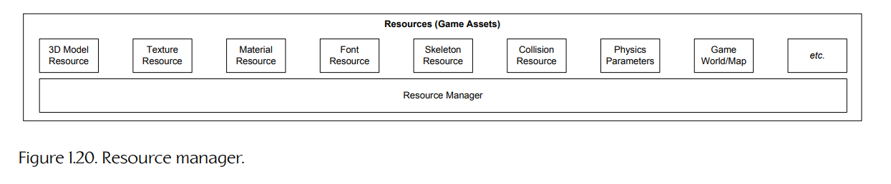

**Figure 1.20.** 资源管理器。

### 1.5.8 渲染引擎

渲染引擎是任何游戏引擎中最大、最复杂的组件之一。渲染器可以用许多不同方式架构。没有一种被普遍接受的唯一做法，尽管正如我们将看到的，大多数现代渲染引擎确实共享一些基本设计理念，而这些理念在很大程度上由其所依赖的 3D 图形硬件设计所驱动。

一种常见且有效的渲染引擎设计方式，是采用如下分层架构。

#### 1.5.8.1 底层渲染器

图 1.21 所示的底层渲染器（low-level renderer）包含引擎的所有原始渲染设施。在这一层，设计重点是在不太关心场景中哪些部分可能可见的情况下，尽可能快速而丰富地渲染一组几何图元。

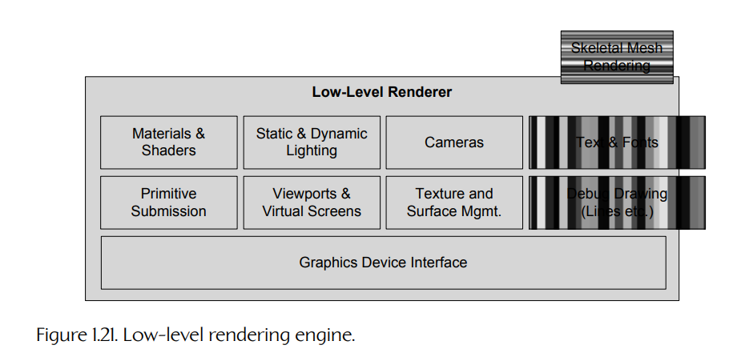

**Figure 1.21.** 底层渲染引擎。

**图形设备接口。**

像 DirectX、OpenGL、Vulkan 或 Metal 这样的图形 API，仅仅为了枚举可用图形设备、初始化它们、设置渲染表面（后缓冲、模板缓冲等）等等，就需要编写相当数量的代码。对于 PC 游戏引擎，你还需要编写代码，将渲染器与 Windows 消息循环集成起来。你通常会编写一个“消息泵”（message pump），在有待处理的 Windows 消息时处理它们，否则就让渲染循环尽可能快速地反复运行。所有这些通常都会由一个组件处理，我称其为图形设备接口（graphics device interface）或图形 API（graphics API），尽管每个引擎都会使用自己的术语。

#### 1.5.8.2 场景图与剔除优化

底层渲染器会绘制所有提交给它的几何体，而不会太关心这些几何体是否实际可见（除了背面剔除，以及将三角形裁剪到摄像机视锥体之外）。通常还需要一个更高层组件，根据某种形式的可见性判定，限制提交用于渲染的图元数量。图 1.22 展示了这一层。

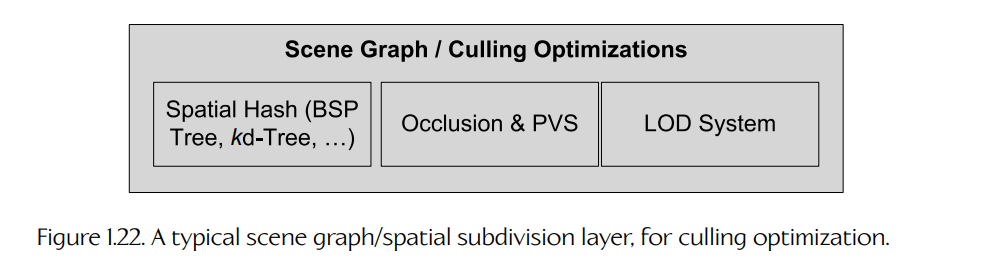

**Figure 1.22.** 一个典型的场景图/空间细分层，用于剔除优化。

对于非常小的游戏世界，一个简单的视锥体剔除（frustum cull，即移除摄像机无法“看到”的对象）可能就足够了。对于更大的游戏世界，可能会使用更高级的空间细分（spatial subdivision）数据结构来提高渲染效率，使潜在可见集合（PVS）的对象可以被非常快速地确定。空间细分可以采用多种形式，包括二叉空间划分树、四叉树、八叉树、kd-tree 或球体层次结构。空间细分有时也称为场景图（scene graph），尽管从技术上说，后者是一种特定的数据结构，并不包含前者。传送门或遮挡剔除方法也可以应用在渲染引擎的这一层。

理想情况下，底层渲染器应该完全不关心所使用的空间细分或场景图类型。这允许不同游戏团队复用图元提交代码，但又可以构建一个专门满足各自游戏需求的 PVS 判定系统。OGRE 开源渲染引擎 [79] 的设计很好地体现了这一原则。OGRE 提供了一种即插即用式场景图架构。游戏开发者既可以从若干预先实现的场景图设计中选择，也可以提供自定义场景图实现。

#### 1.5.8.3 视觉效果

如图 1.23 所示，现代游戏引擎支持范围广泛的视觉效果，包括：

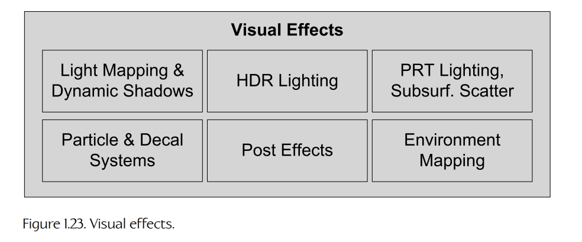

**Figure 1.23.** 视觉效果。

- 粒子系统（用于烟雾、火焰、水花等）；

- 贴花系统（用于弹孔、脚印等）；

- 光照贴图和环境贴图；

- 动态阴影；

- 全屏后处理效果，在 3D 场景被渲染到离屏缓冲区之后应用。

全屏后处理效果的一些示例包括：

- 高动态范围（HDR）色调映射和 bloom；

- 全屏抗锯齿（FSAA）；

- 色彩校正和色彩偏移效果，包括漂白旁路、饱和度和去饱和度效果等。

游戏引擎通常会有一个效果系统（effects system）组件，用于管理粒子、贴花和其他视觉效果的专门渲染需求。粒子和贴花系统通常是渲染引擎中独立的组件，并作为底层渲染器的输入。另一方面，光照贴图、环境贴图和阴影通常在渲染引擎内部处理。全屏后处理效果要么作为渲染器的组成部分实现，要么作为一个独立组件，对渲染器的输出缓冲区进行操作。

#### 1.5.8.4 前端

大多数游戏都会在 3D 场景之上叠加某种 2D 图形，用于各种目的。这些内容包括：

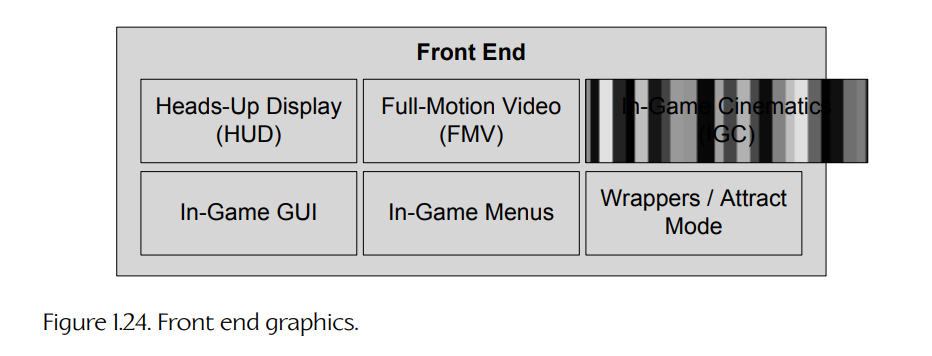

**Figure 1.24.** 前端图形。

- 游戏的抬头显示（heads-up display，HUD）；

- 面向用户的菜单系统（menu system），允许玩家配置游戏、图形、音频、无障碍和其他选项；

- 控制台、面向开发者的菜单系统，以及/或者其他开发工具，这些内容可能会随最终产品发布，也可能不会。

图 1.24 展示了这一层。这类二维图形通常通过绘制带纹理的四边形（成对三角形）并使用正交投影来实现。或者，它们也可以完全在 3D 中渲染，并让四边形作为公告板始终面向摄像机。

我们也把全动态视频（full-motion video，FMV）系统包括在这一层中。这个系统负责播放此前录制好的全屏影片（要么用游戏的渲染引擎渲染，要么使用其他渲染包渲染，通常编码为 MP4 或 Bink Video 格式）。

相关系统是游戏内过场动画（in-game cinematics，IGC）系统。这个组件通常允许在游戏本身内部以完整 3D 方式编排电影式序列。例如，当玩家穿过城市时，两个关键角色之间的对话可能会实现为游戏内过场动画。IGC 可能包含玩家角色，也可能不包含。它们可以作为玩家没有控制权的刻意切离镜头来完成，也可以被微妙地集成进游戏中，以至于人类玩家甚至没有意识到正在发生 IGC。一些游戏，例如 Naughty Dog 的 *Uncharted 4: A Thief’s End* 和 *The Last of Us* 系列，已经完全放弃预渲染影片，而是把游戏中的所有电影式时刻都以实时 IGC 的形式呈现。

### 1.5.9 性能分析与调试工具

游戏是实时系统，因此游戏工程师常常需要分析游戏性能，以便优化性能。此外，内存资源通常很稀缺，因此开发者也会大量使用内存分析工具。图 1.25 所示的性能分析与调试层包含这些工具，同时也包括游戏内调试设施，例如调试绘制、游戏内菜单系统或控制台，以及为了测试和调试目的记录并回放游戏过程的能力。

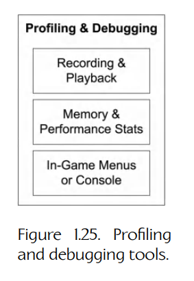

**Figure 1.25.** 性能分析与调试工具。

有许多优秀的通用软件性能分析工具可用，包括：

- Intel 的 *VTune*；

- IBM 的 *Quantify* 和 *Purify*（属于 *PurifyPlus* 工具套件的一部分）；

- Parasoft 的 *Insure++*；

- Julian Seward 和 Valgrind 开发团队的 *Valgrind*；

- Microsoft 的 *PIX*（用于在 PC 和 Xbox 主机上分析与调试 GPU）；

- Sony 的 *Razor CPU*（用于分析 PlayStation 4 和 PlayStation 5 平台）；

- Sony 的 *Razor GPU*（用于在 PlayStation 主机上分析和调试 GPU）。

不过，大多数游戏引擎也会整合一套自定义性能分析与调试工具。例如，它们可能包括以下一种或多种功能：

- 一种手动插桩代码的机制，使特定代码段可以被计时；

- 一种在游戏运行时把性能分析统计数据显示在屏幕上的设施；

- 一种将性能统计信息转储到文本文件或 Excel 电子表格中的设施；

- 一种判断引擎以及各个子系统正在使用多少内存的设施，包括各种屏幕显示；

- 在游戏结束以及/或者游戏过程中转储内存使用量、高水位线和泄漏统计信息的能力；

- 允许在代码中到处加入调试打印语句，并能够开启或关闭不同类别的调试输出，以及控制输出详细程度的工具；

- 记录游戏事件并随后回放它们的能力。这一点很难做好，但如果实现得当，会成为追踪 bug 的非常有价值的工具。

PlayStation 4 和 PlayStation 5 都提供了强大的核心转储功能，用于帮助程序员调试崩溃。PS5 始终在录制游戏视频，以允许玩家通过手柄上的 Share 按钮分享体验。因此，PS4 和 PS5 的核心转储功能不仅会自动向程序员提供程序崩溃时正在做什么的完整调用栈，还会提供崩溃瞬间的截图，以及显示崩溃之前发生了什么的一些视频片段。即使游戏已经发布，只要游戏崩溃，核心转储也可以自动上传到游戏开发者的服务器。这些设施彻底改变了崩溃分析与修复任务。

### 1.5.10 碰撞与物理

碰撞检测对每个游戏都很重要。没有它，物体会彼此穿透，也无法以任何合理方式与虚拟世界交互。有些游戏还包含真实或半真实的动力学仿真。在游戏行业中，我们称之为“物理系统”（physics system），尽管刚体动力学（rigid body dynamics）这个术语实际上更准确，因为我们通常只关心刚体的运动（运动学）以及导致该运动发生的力和力矩（动力学）。图 1.26 描绘了这一层。

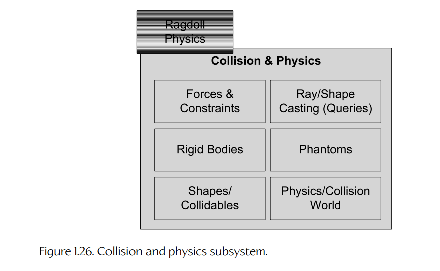

**Figure 1.26.** 碰撞与物理子系统。

碰撞和物理通常耦合得相当紧密。这是因为一旦检测到碰撞，它们几乎总是作为物理积分和约束满足逻辑的一部分被解决。如今，很少有游戏公司会编写自己的碰撞/物理引擎。相反，通常会把第三方 SDK 集成进引擎中。

- *Havok* 是当今行业中的黄金标准。它功能丰富，并且在各个平台上表现良好。

- NVIDIA 的 *PhysX* 是另一个优秀的碰撞和动力学引擎。PhysX 最初被设计为 Ageia 物理加速芯片的接口，但现在该 SDK 由 NVIDIA 拥有和分发，并且公司已经将 PhysX 适配为可以在最新 GPU 上作为计算任务运行。PhysX 曾被集成进 Unreal Engine 4，但从该引擎 4.26 版本起，对它的支持被弃用。它仍然以独立产品形式在 BSD-3 许可证下提供 [80]。

开源物理和碰撞引擎也可用。其中最知名的也许是 Open Dynamics Engine（ODE）。更多信息见 [81]。I-Collide、V-Collide 和 RAPID 是其他流行的非商业碰撞检测引擎。这三个项目都由北卡罗来纳大学（UNC）开发。更多信息见 [82] 和 [83]。

### 1.5.11 动画

任何拥有有机或半有机角色（人类、动物、卡通角色，甚至机器人）的游戏都需要动画系统。游戏中使用的动画有五种基本类型：

- 精灵/纹理动画；

- 刚体层次动画；

- 骨骼动画；

- 顶点动画；

- 变形目标。

骨骼动画允许动画师使用相对简单的骨骼系统，为一个详细的 3D 角色网格摆出姿势。随着骨骼移动，3D 网格的顶点也随之移动。虽然变形目标和顶点动画在一些引擎中也会使用，但骨骼动画是当今游戏中最普遍的动画方法；因此，它将成为本书的主要关注点。图 1.27 展示了一个典型骨骼动画系统。

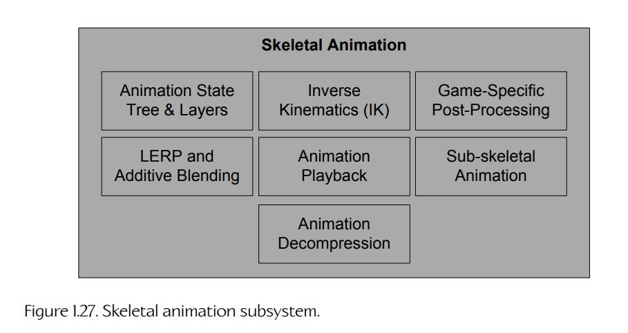

**Figure 1.27.** 骨骼动画子系统。

你会在图 1.16 中注意到，骨骼网格渲染组件跨越了渲染器与动画系统之间的间隙。这里存在紧密合作，但接口定义得非常清楚。动画系统为骨架中的每根骨骼生成一个姿势，然后这些姿势会以矩阵调色板的形式传递给渲染引擎。渲染器通过该调色板中的一个或多个矩阵变换每个顶点，从而生成最终的混合顶点位置。这个过程称为蒙皮（skinning）。

当使用布娃娃（rag dolls）时，动画系统和物理系统之间也存在紧密耦合。布娃娃是一个松软的（通常已经死亡的）动画角色，其身体运动由物理系统仿真。物理系统会把身体各部位视为一个受约束的刚体系统，并确定它们的位置和朝向。动画系统则计算渲染引擎所需的矩阵调色板，以便在屏幕上绘制该角色。

### 1.5.12 人机接口设备（HID）

每个游戏都需要处理来自玩家的输入，这些输入通过各种人机接口设备（human interface devices，HID）获得，包括：

- 键盘和鼠标；

- 手柄；

- 其他专用游戏控制器，例如方向盘、钓鱼竿、跳舞毯、Wii 遥控器等。

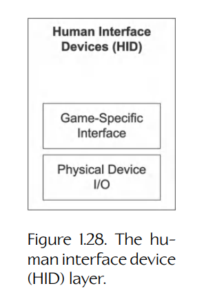

**Figure 1.28.** 人机接口设备（HID）层。

我们有时会把这个组件称为玩家 I/O 组件，因为我们也可能通过 HID 向玩家提供输出，例如手柄上的力反馈/震动，或者 Wii 遥控器产生的音频。图 1.28 展示了一个典型 HID 层。

HID 引擎组件有时会被设计为把特定硬件平台上游戏控制器的底层细节与高层游戏控制分离开来。它会处理来自硬件的原始数据，例如在每个摇杆中心点周围引入死区、去抖动按钮按下输入、检测按钮按下和按钮释放事件、解释并平滑加速度计输入（例如来自 PlayStation Dualshock 手柄）等等。它通常会提供一种机制，允许玩家自定义物理控制与逻辑游戏功能之间的映射。有时，它也包括用于检测和弦输入（多个按钮同时按下）、序列输入（在特定时间限制内按顺序按下多个按钮）和手势（来自按钮、摇杆、加速度计等的输入序列）的系统。

### 1.5.13 音频

音频在任何游戏引擎中都和图形一样重要。遗憾的是，与渲染、物理、动画、AI 和游戏玩法相比，音频经常得到更少关注。举个例子：程序员经常在扬声器关闭的情况下开发代码！（事实上，我还认识几个游戏程序员甚至没有扬声器或耳机。）尽管如此，没有出色音频引擎的游戏不可能称得上伟大。图 1.29 描绘了音频层。

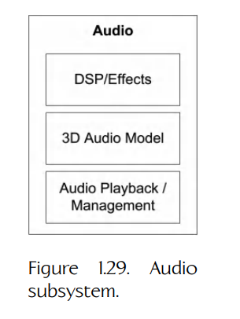

**Figure 1.29.** 音频子系统。

音频引擎的复杂程度差异很大。Quake 的音频引擎非常基础，游戏团队通常会用自定义功能扩展它，或者用内部解决方案替换它。Unreal Engine 4 提供了一个稳健的 3D 音频渲染引擎（在 [50] 中有详细讨论），尽管其功能集有限，许多游戏团队会对其进行扩展和定制，以提供高级游戏特定功能。对于 DirectX 平台（PC、Xbox Series S、Xbox Series X），Microsoft 提供了一个优秀的运行时音频引擎 XAudio2。Electronic Arts 在内部开发了一个高级、高性能音频引擎，称为 SoundR!OT。Sony Interactive Entertainment（SIE）与 Naughty Dog 等第一方工作室合作，提供了一个强大的 3D 音频引擎 Scream，它已被用于许多 PS3、PS4 和 PS5 游戏，包括 Naughty Dog 的 *Uncharted 4: A Thief’s End* 和 *The Last of Us Part II*。然而，即使游戏团队使用现成音频引擎，每个游戏仍然需要大量自定义软件开发、集成工作、微调和对细节的关注，才能在最终产品中产生高质量音频。

### 1.5.14 在线多人游戏与网络

许多游戏允许多名人类玩家在同一个虚拟世界中游玩。多人游戏至少有四种基本形式：

- *同屏多人（single-screen multiplayer）*。两个或更多人机接口设备（手柄、键盘、鼠标等）连接到同一台街机、PC 或主机上。多个玩家角色存在于同一个虚拟世界中，一个摄像机同时把所有玩家角色保持在画面中。这种多人游戏风格的例子包括 *Smash Brothers*、*Lego Star Wars* 和 *Gauntlet*。

- *分屏多人（split-screen multiplayer）*。多个玩家角色存在于同一个虚拟世界中，多个 HID 连接到同一台游戏机器上，但每个玩家都有自己的摄像机，屏幕被划分为多个区域，使每个玩家都可以看到自己的角色。

- *联网多人（networked multiplayer）*。多台计算机或主机连接在一起，每台机器承载其中一名玩家。

- *大型多人在线游戏（MMOG）*。数十万用户可以同时在一个巨大的、持久的在线虚拟世界中游玩，该世界由一组强大的中央服务器托管。

图 1.30 展示了多人联网层。

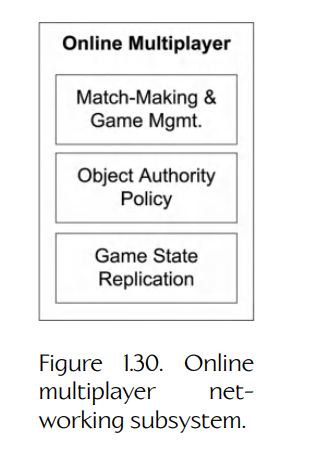

**Figure 1.30.** 在线多人联网子系统。

多人游戏在许多方面与单人游戏非常相似。然而，支持多名玩家可能会对某些游戏引擎组件的设计产生深远影响。游戏世界对象模型、渲染器、人类输入设备系统、玩家控制系统和动画系统都会受到影响。把多人功能改装进一个已有的单人引擎当然不是不可能，但这可能是一项艰巨任务。尽管如此，许多游戏团队已经成功完成了这项工作。也就是说，如果条件允许，通常最好从第一天起就设计多人功能。

有趣的是，反过来——把多人游戏转换成单人游戏——通常非常简单。事实上，许多游戏引擎把单人模式当作多人游戏的一个特殊情况来处理，其中恰好只有一个玩家。Quake 引擎以其 client-on-top-of-server 模式闻名：在单人战役中，运行在单台 PC 上的同一个可执行文件既充当客户端，也充当服务器。

### 1.5.15 游戏玩法基础系统

术语 gameplay 指的是游戏中发生的动作，支配游戏所发生的虚拟世界的规则，玩家角色的能力（称为玩家机制，player mechanics），以及世界中其他角色和对象的能力，还有玩家的目标和目的。游戏玩法通常要么用引擎其余部分所使用的原生语言实现，要么用高级脚本语言实现，或者两者兼用。为了弥合游戏玩法代码与我们目前讨论过的底层引擎系统之间的鸿沟，大多数游戏引擎都会引入一个层，我称之为游戏玩法基础层（gameplay foundations layer）（由于缺少标准化名称）。如图 1.31 所示，这一层提供了一组核心设施，使游戏特定逻辑能够方便地实现。

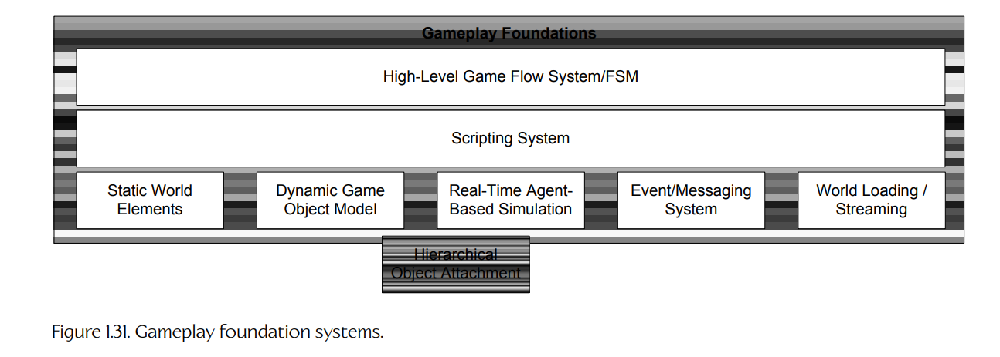

**Figure 1.31.** 游戏玩法基础系统。

#### 1.5.15.1 游戏世界与对象模型

游戏玩法基础层引入了游戏世界（game world）的概念，其中包含静态元素和动态元素。世界内容通常以面向对象的方式建模（经常但并不总是使用面向对象编程语言）。在本书中，构成一款游戏的对象类型集合称为游戏对象模型（game object model）。游戏对象模型提供了对虚拟游戏世界中异构对象集合的实时仿真。

典型游戏对象类型包括：

- 静态背景几何体，例如建筑、道路、地形（通常是一种特殊情况）等；

- 动态刚体，例如石头、汽水罐、椅子等；

- 玩家角色（PC）；

- 非玩家角色（NPC）；

- 武器；

- 投射物；

- 载具；

- 灯光（它们可能存在于运行时动态场景中，或者只用于离线静态光照）；

- 摄像机；

等等。

游戏世界模型与软件对象模型（software object model）紧密相关，而这个模型可能最终遍布整个引擎。软件对象模型指的是用于实现一段面向对象软件的一组语言特性、策略和约定。在游戏引擎语境中，软件对象模型回答如下问题：

- 你的游戏引擎是否以面向对象方式设计？

- 你会使用什么语言？C？C++？Java？OCaml？

- 静态类层次结构将如何组织？一个巨大的单体层次结构？大量松耦合组件？

- 你会使用模板和基于策略的设计，还是传统多态？

- 对象如何被引用？普通旧指针？智能指针？句柄？

- 对象如何被唯一标识？仅通过内存地址？通过名称？通过全局唯一标识符（GUID）？

- 游戏对象的生命周期如何管理？

- 游戏对象的状态如何随时间仿真？

我们将在第 17.2 节中相当深入地探索软件对象模型和游戏对象模型。

#### 1.5.15.2 事件系统

游戏对象总是需要彼此通信。这可以通过各种方式实现。例如，发送消息的对象可以直接调用接收对象的成员函数。事件驱动架构也常用于对象之间通信，它很像典型图形用户界面中会看到的方式。在事件驱动系统中，发送者会创建一个小型数据结构，称为事件（event）或消息（message），其中包含消息类型以及需要发送的任何参数数据。事件会通过调用接收对象的事件处理函数（event handler function）传递给接收对象。事件也可以存储在队列中，以便在未来某个时间处理。

#### 1.5.15.3 脚本系统

许多游戏引擎使用脚本语言，以便让游戏特定玩法规则和内容的开发更加容易且快速。如果没有脚本语言，每当引擎中使用的逻辑或数据结构发生变化时，你都必须重新编译并重新链接游戏可执行文件。但当脚本语言被集成进引擎后，只需要修改并重新加载脚本代码，就可以改变游戏逻辑和数据。有些引擎允许在游戏继续运行时重新加载脚本。其他引擎则要求先关闭游戏，再重新编译脚本。但无论哪种方式，其周转时间都仍然远快于重新编译并重新链接游戏可执行文件。

#### 1.5.15.4 人工智能基础

传统上，人工智能完全属于游戏特定软件的范畴——它通常不被认为是游戏引擎本身的一部分。不过，近年来，游戏公司已经识别出几乎所有 AI 系统中都会出现的模式，而这些基础部分也开始慢慢进入引擎本身的管辖范围。

例如，一家名为 Kynogon 的公司开发了一个名为 *Kynapse* 的中间件 SDK，它提供了构建商业可行游戏 AI 所需的许多底层技术。这项技术后来被 Autodesk 收购，并被一个完全重新设计的 AI 中间件包 Gameware Navigation 取代。Gameware Navigation 由发明 Kynapse 的同一工程团队设计。这个 SDK 提供底层 AI 构建块，例如导航网格生成、寻路、静态和动态对象避让、识别游戏空间中的脆弱位置（例如可用于伏击的开放窗口），以及 AI 与动画之间定义良好的接口。

Havok 也推出了一个 NPC 导航 SDK，名字非常贴切，叫作 *Havok Navigation*。它支持生成高质量导航网格，并支持运行时寻路和导航网格查询。Havok Navigation 支持地面寻路，可用于行走 NPC；也支持体积寻路，可用于飞行 NPC。它还很好地支持动态环境，例如门打开和关闭时使用的导航阻挡体，或者动态物体阻挡 NPC 路径的情况。

### 1.5.16 游戏特定子系统

在游戏玩法基础层和其他底层引擎组件之上，游戏玩法程序员与设计师会合作实现游戏本身的功能。游戏玩法系统通常数量众多、高度多样，并且专门面向正在开发的游戏。如图 1.32 所示，这些系统包括但当然不限于：玩家角色机制、各种游戏内摄像机系统、用于控制非玩家角色的人工智能、武器系统、载具，等等。如果要在引擎和游戏之间画出一条清晰的界线，那么它会位于游戏特定子系统与游戏玩法基础层之间。实际来说，这条界线永远不会完全清晰。至少有一部分游戏特定知识总会向下渗透到游戏玩法基础层中，有时甚至会延伸到引擎核心本身。

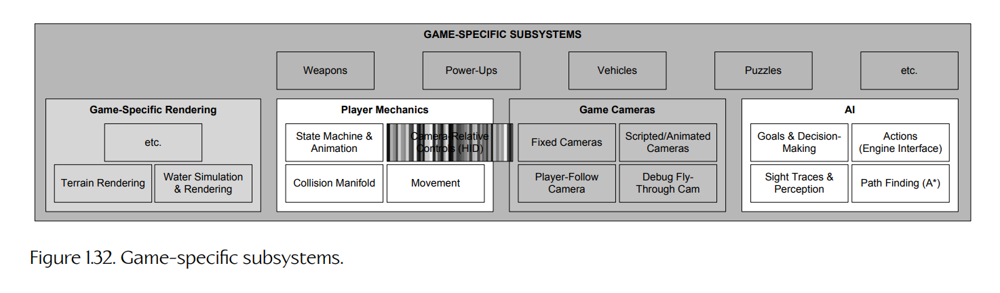

**Figure 1.32.** 游戏特定子系统。
