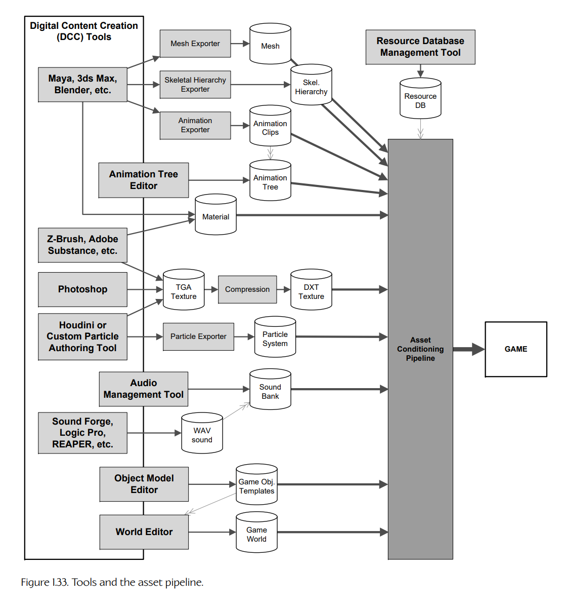
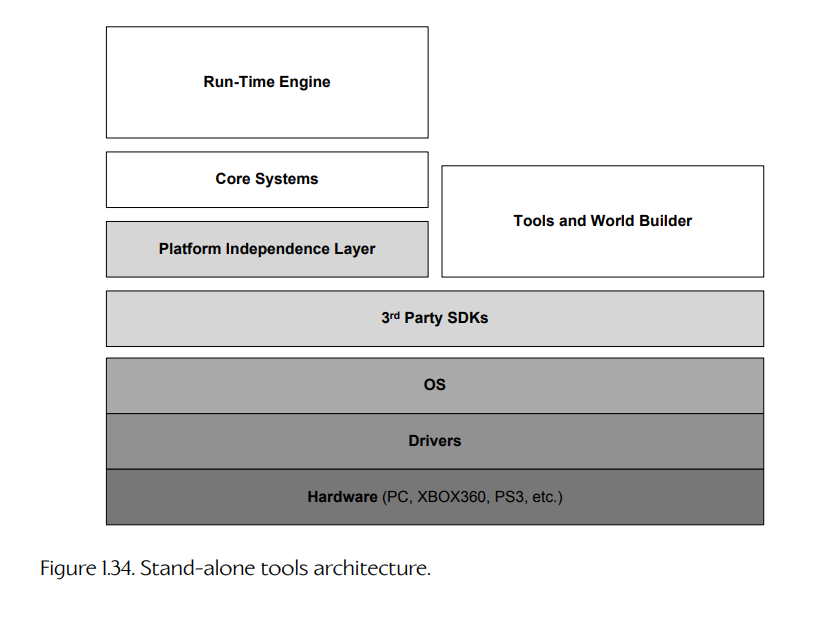
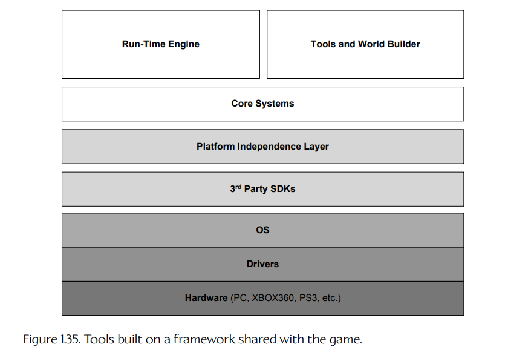
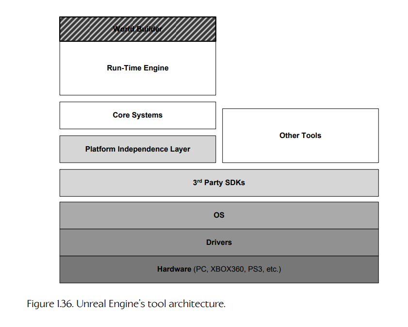

## 1.6 工具与资源管线

任何游戏引擎都必须被输入大量数据，这些数据以游戏资源、配置文件、脚本等形式存在。图 1.33 展示了现代游戏引擎中通常会出现的一些游戏资源类型。较粗的深灰色箭头表示数据如何从用于创建原始源资源的工具一路流向游戏引擎本身。较细的浅灰色箭头表示各种资源类型如何引用或使用其他资源。

**Figure 1.33.** 工具与资源管线。

### 1.6.1 数字内容创作工具

游戏本质上是多媒体应用。游戏引擎的输入数据形式多种多样，从 3D 网格数据，到纹理位图，到动画数据，再到音频文件。所有这些源数据都必须由美术人员创建和操作。美术人员使用的这些工具称为数字内容创作（digital content creation，DCC）应用程序。

DCC 应用通常面向某一种特定类型的数据创建，不过有些工具可以生成多种数据类型。例如，Autodesk 的 Maya 和 3ds Max，以及 Pixologic 的 ZBrush，都广泛用于创建 3D 网格和动画数据。Adobe 的 Photoshop 及类似工具，则用于创建和编辑位图（纹理）。SoundForge 是一种流行的音频片段创建工具。有些类型的游戏数据无法使用现成 DCC 应用创建。例如，大多数游戏引擎都会提供一个自定义编辑器，用于布置游戏世界。不过，有些引擎确实会使用已有工具来进行游戏世界布局。我见过一些游戏团队把 3ds Max 或 Maya 用作世界布局工具，有时带有自定义插件来辅助用户。问问大多数游戏开发者，他们都会告诉你，他们还记得曾经用一个简单的位图编辑器来布置地形高度场，或者手工把世界布局直接输入到文本文件中的时候。工具不一定要漂亮——游戏团队会使用任何可用工具，只要它能完成工作即可。话虽如此，如果一个游戏团队想要及时开发出高度打磨的产品，那么工具必须相对易用，而且绝对必须可靠。

### 1.6.2 资源处理管线

数字内容创作（DCC）应用所使用的数据格式，很少适合直接在游戏中使用。主要有两个原因。

1. DCC 应用在内存中使用的数据模型，通常比游戏引擎所需要的复杂得多。例如，Maya 会存储由场景节点构成的有向无环图（directed acyclic graph，DAG），并带有复杂的互联关系网络。它会存储对文件执行过的所有编辑历史。它会把场景中每个对象的位置、朝向和缩放表示为完整的 3D 变换层次结构，并分解为平移、旋转、缩放和剪切组件。游戏引擎通常只需要其中极小一部分信息，就可以在游戏中渲染模型。

2. DCC 应用程序的文件格式在运行时读取通常太慢，并且在某些情况下还是封闭的专有格式。因此，DCC 应用生成的数据通常会被导出为一种更易访问的标准化格式，或者自定义文件格式，以便在游戏中使用。

从 DCC 应用中导出数据之后，在发送给游戏引擎之前通常还需要进一步处理。如果游戏工作室要在多个平台上发布游戏，那么中间文件可能还需要针对每个目标平台进行不同处理。例如，3D 网格数据可能会被导出为一种中间格式，例如 XML、JSON 或简单二进制格式。随后，它可能会被处理为合并使用相同材质的网格，或者拆分过大、引擎难以消化的网格。之后，网格数据可能会被组织并打包为一种适合在特定硬件平台上加载的内存映像。

从 DCC 应用到游戏引擎的这条管线有时称为资源处理管线（asset conditioning pipeline，ACP）。每个游戏引擎都会以某种形式拥有它。

#### 1.6.2.1 3D 模型/网格数据

你在游戏中看到的可见几何体通常由三角形网格构成。下面我们会简要讨论每种几何数据类型。关于描述和渲染 3D 几何体所用技术的深入讨论，请参见第 11 章。

网格（mesh）是由三角形和顶点组成的复杂形状。可渲染几何体也可以由四边形或更高阶细分曲面构成。但在当今图形硬件上，由于硬件几乎完全面向光栅化三角形渲染，所有形状最终都必须在渲染之前被转换为三角形。

为了定义视觉表面属性（颜色、反射率、凹凸感、漫反射纹理等），一个网格通常会应用一个或多个材质。在本书中，我会用“mesh”这个术语指代单个可渲染形状，而用“model”指代一个复合对象，它可能包含多个网格，以及供游戏使用的动画数据和其他元数据。

网格通常在 3D 建模软件包中创建，例如 3ds Max、Maya 或 SoftImage。Pixologic 的 ZBrush 是一款强大且流行的工具，它允许以非常直观的方式构建超高分辨率网格，然后将其下转换为低分辨率模型，并使用法线贴图来近似高频细节。

必须编写导出器，从数字内容创作（DCC）工具（Maya、Max 等）中提取数据，并以引擎能够消化的形式存储到磁盘上。DCC 应用提供大量标准或半标准导出格式，包括 Wavefront OBJ、COLLADA 和 Universal Scene Description（USD），但没有一种格式完全适合游戏开发（COLLADA 可能是例外）。因此，游戏团队通常会创建自定义文件格式，并配套创建自定义导出器。

#### 1.6.2.2 骨骼动画数据

骨骼网格（skeletal mesh）是一种特殊网格，它绑定到骨骼层次结构上，用于关节动画。这种网格有时称为皮肤（skin），因为它形成了包裹不可见底层骨架的外皮。骨骼网格的每个顶点都包含一个索引列表，用来指明它绑定到了骨架中的哪些关节。顶点通常还包含一组关节权重，用于指定每个关节对该顶点的影响程度。

为了渲染骨骼网格，游戏引擎需要三种不同类型的数据：

1. 网格本身；

2. 骨骼层次结构（关节名称、父子关系，以及骨架最初绑定到网格时所处的基础姿势）；

3. 一个或多个动画片段，用于指定关节应当如何随时间运动。

网格和骨架经常会从 DCC 应用中作为单个数据文件导出。然而，如果多个网格绑定到同一个骨架，那么最好将骨架作为独立文件导出。动画通常会单独导出，这样在任意给定时间内，只有正在使用的动画才需要被加载到内存中。不过，有些游戏引擎允许将一组动画作为单个文件导出，有些甚至会把网格、骨架和动画合并进一个整体式文件中。

未经优化的骨骼动画由一系列 4×3 矩阵样本流定义。对于骨架中的每个关节，这些样本至少以每秒 30 帧的频率采样；而一个写实类人角色的骨架可能包含 500 个或更多关节。因此，动画数据天然非常占用内存。出于这个原因，动画数据几乎总是以高度压缩格式存储。压缩方案因引擎而异，其中一些还是专有方案。游戏就绪动画数据并不存在统一的标准格式。

#### 1.6.2.3 音频数据

音频片段通常从 Sound Forge、Logic Pro、REAPER 或其他音频制作工具中导出，格式多种多样，数据采样率也各不相同。音频文件可以是单声道、立体声、5.1、7.1 或其他多声道配置。Wave 文件（`.wav`）很常见，但其他文件格式，例如 PlayStation ADPCM 文件（`.vag`），也很常见。为了便于组织、方便加载到引擎中以及进行流式播放，音频片段通常会被组织成音频库（banks）。

#### 1.6.2.4 粒子系统数据

现代游戏会使用复杂的粒子效果。这些效果由专门创建视觉效果的美术人员制作。Houdini 等第三方工具允许制作电影级效果；然而，大多数游戏引擎无法渲染 Houdini 能够创建的全部效果范围。因此，许多游戏公司会创建自定义粒子效果编辑工具，只暴露引擎实际支持的效果。自定义工具还可以让美术人员精确看到该效果在游戏中将如何呈现。

### 1.6.3 世界编辑器

游戏世界是游戏引擎中所有内容汇聚到一起的地方。据我所知，市面上并没有商业化的独立游戏世界编辑器（也就是说，没有相当于游戏世界版 Maya 或 Max 的工具）。不过，一些商业游戏引擎确实提供了优秀的世界编辑器：

- 基于 Quake 技术的大多数游戏引擎都会使用某种 Radiant 游戏编辑器变体。

- *Half-Life 2* 的 Source 引擎提供了一个名为 *Hammer* 的世界编辑器。

- *UnrealEd* 是 Unreal Engine 的世界编辑器。这个强大的工具还充当资源管理器，用于管理引擎能够消费的所有数据类型。

- *Sandbox* 是 CRYENGINE 中的世界编辑器。

编写一个优秀的世界编辑器非常困难，但它是任何优秀游戏引擎中极其重要的一部分。

### 1.6.4 资源数据库

游戏引擎需要处理范围广泛的资源类型，从可渲染几何体，到材质和纹理，到动画数据，再到音频。这些资源的一部分由美术人员使用 Maya、Photoshop 或 SoundForge 等工具生成的原始数据来定义。然而，每个资源还携带大量元数据。例如，当动画师在 Maya 中创作一个动画片段时，元数据会向资源处理管线以及最终的游戏引擎提供如下信息：

- 一个唯一 ID，用于在运行时识别该动画片段。

- 源 Maya（`.ma` 或 `.mb`）文件的名称和目录路径。

- 帧范围（frame range）——该动画从哪一帧开始，到哪一帧结束。

- 该动画是否打算循环播放。

- 动画师所选择的压缩技术和压缩级别。（有些资源可以被高度压缩而不会明显降低质量，而另一些资源则需要较少压缩或不压缩，才能在游戏中看起来正确。）

每个游戏引擎都需要某种数据库来管理与游戏资源相关的所有元数据。这个数据库可以使用真正的关系数据库实现，例如 MySQL 或 Oracle；也可以实现为一组文本文件，并由 Subversion、Perforce 或 Git 等版本控制系统管理。在本书中，我们将这种元数据称为资源数据库（resource database）。

无论资源数据库以何种格式存储和管理，都必须提供某种用户界面，使用户能够创作和编辑数据。在 Naughty Dog，我们为此编写了一个名为 Builder 的 C# 自定义 GUI。关于 Builder 以及其他一些资源数据库用户界面的更多信息，见第 7.2.1.3 节。

### 1.6.5 工具架构的一些方法

游戏引擎的工具套件可以用任意多种方式进行架构。有些工具可能是独立软件，如图 1.34 所示。有些工具可能构建在运行时引擎所使用的一些低层之上，如图 1.35 所示。有些工具可能内置到游戏本身中。例如，基于 Quake 和 Unreal 的游戏都拥有游戏内控制台，允许开发者和“modder”在游戏运行时输入调试和配置命令。最后，基于 Web 的用户界面也正在某些类型的工具中变得越来越流行。

**Figure 1.34.** 独立工具架构。

**Figure 1.35.** 构建在与游戏共享的框架之上的工具。

作为一个有趣且独特的例子，Unreal 的世界编辑器和资源管理器 UnrealEd 是直接内置在运行时游戏引擎中的。要运行编辑器，你需要用命令行参数 “editor” 启动游戏。这种独特的架构风格如图 1.36 所示。它允许工具完全访问引擎使用的全部数据结构，并避免一个常见问题：每种数据结构都必须拥有两套表示，一套用于运行时引擎，一套用于工具。它也意味着从编辑器内部运行游戏非常快（因为游戏实际上已经在运行了）。实时游戏内编辑通常很难实现，但当编辑器是游戏的一部分时，这个功能可以相对容易地开发出来。不过，像这种引擎内编辑器设计也有它自身的问题。例如，当引擎崩溃时，工具也会变得不可用。因此，引擎与资源创建工具之间的紧密耦合可能会拖慢生产过程。

**Figure 1.36.** Unreal Engine 的工具架构。

#### 1.6.5.1 基于 Web 的用户界面

基于 Web 的用户界面正在迅速成为某些游戏开发工具的常态。在 Naughty Dog，我们使用了许多基于 Web 的 UI。Naughty Dog 的本地化工具 *Cipher* 充当本地化数据库的前端入口。*Jira* 是 Atlassian 的基于 Web 的 bug 和任务跟踪软件，所有 Naughty Dog 员工都会用它来在生产过程中创建、管理、排期、沟通和协作处理游戏开发任务。一个名为 *Connector* 的基于 Web 的界面，也作为我们查看运行时游戏引擎发出的各种调试信息流的窗口。游戏会把调试文本输出到多个命名通道中，每个通道都与不同的引擎系统相关联（动画、渲染、AI、声音等）。这些数据流由一个轻量级 Redis 数据库收集。基于浏览器的 Connector 界面允许用户以方便的方式查看和过滤这些信息。

与独立 GUI 应用相比，基于 Web 的 UI 具有许多优势。首先，与用 Java、C# 或 C++ 等语言编写的独立应用相比，Web 应用通常更容易、更快速地开发和维护。Web 应用不需要特殊安装——用户所需要的只是一个兼容的 Web 浏览器。基于 Web 的界面更新可以直接推送给用户，不需要安装步骤——用户只需要刷新或重启浏览器即可接收更新。Web 界面还迫使我们以客户端—服务器架构来设计工具。这为把工具分发给更广泛的受众打开了可能性。例如，Naughty Dog 的 Cipher 本地化工具可以直接提供给全球外包合作伙伴使用，而这些合作伙伴为我们提供语言翻译服务。当然，独立工具仍然有其位置，尤其是在需要专门 GUI（例如 3D 可视化）时。但如果你的工具只需要向用户呈现可编辑表单和表格数据，那么基于 Web 的工具可能是最佳选择。
