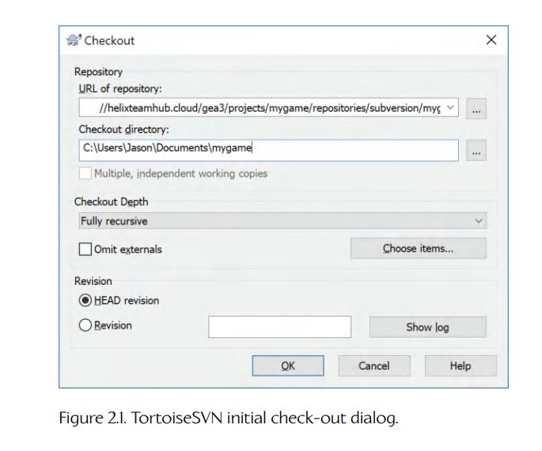
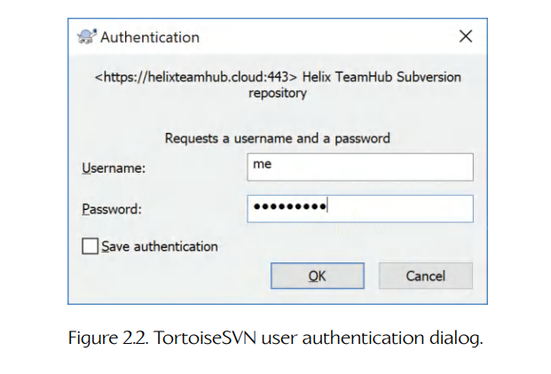
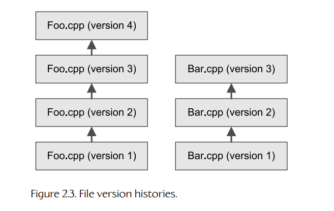
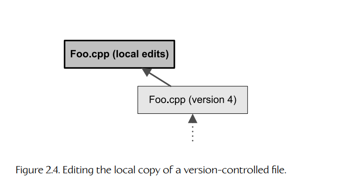
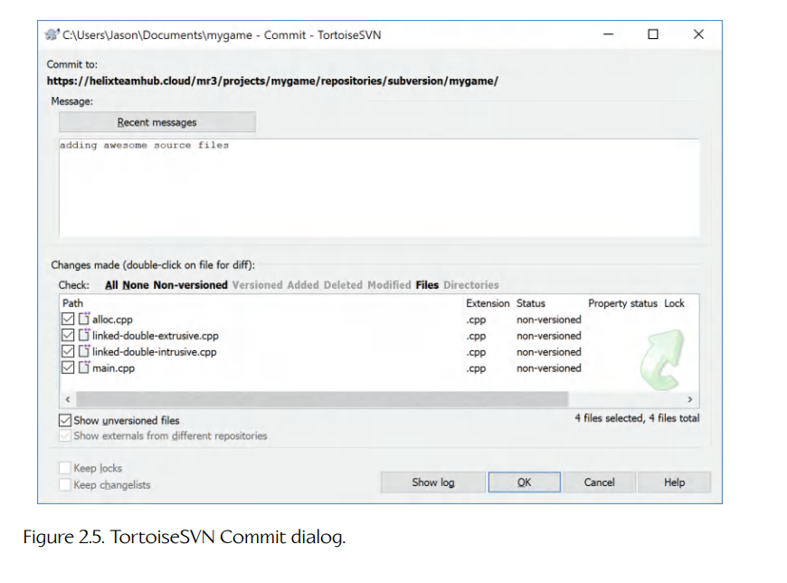
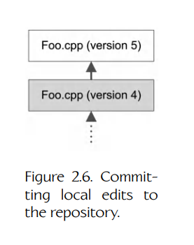
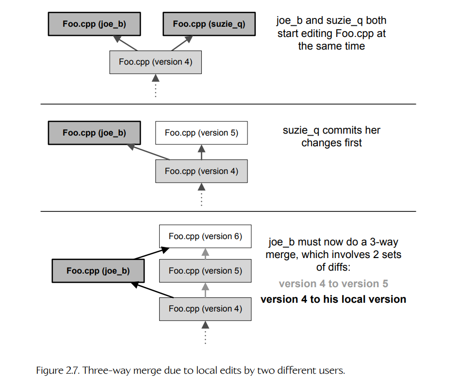

## 2.1 Version Control

版本控制系统（version control system）是一种工具，允许多个用户共同处理一组文件。它会维护每个文件的历史记录，使变更可以被跟踪，并在必要时回退。它允许多个用户同时修改文件——甚至是同一个文件——而不会让所有人的工作互相覆盖。版本控制之所以得名，是因为它能够跟踪文件的版本历史。它有时也被称为源代码控制（source control），因为它主要由计算机程序员用于管理源代码。不过，版本控制也可以用于其他类型的文件。出于我们稍后会看到的原因，版本控制系统通常最擅长管理文本文件。不过，许多游戏工作室会使用同一个版本控制系统来同时管理源代码文件（它们是文本）和游戏资源，例如纹理、3D 网格、动画和音频文件（它们通常是二进制）。

### 2.1.1 Why Use Version Control?

只要软件是由多名工程师组成的团队开发的，版本控制就至关重要。版本控制：

- 提供一个中央仓库，工程师可以从中共享源代码；

- 记录每个源文件发生过的变更历史；

- 提供机制，允许给代码库中的特定版本打标签，并在之后取回；

- 允许从主开发线分出代码版本，也就是创建分支。这一特性经常用于制作演示版本，或者为旧版本软件制作补丁。

即使在单人工程师项目中，源代码控制系统也可能很有用。虽然它的多用户能力不再相关，但其他能力，例如维护变更历史、标记版本、为演示和补丁创建分支、跟踪 bug 等，仍然非常有价值。

### 2.1.2 Common Version Control Systems

下面是你在游戏工程师职业生涯中很可能遇到的最常见源代码控制系统。

- *SCCS and RCS*。Source Code Control System（SCCS）和 Revision Control System（RCS）是两个最古老的版本控制系统。二者都使用命令行界面。它们主要流行于 UNIX 平台。

- *CVS*。Concurrent Version System（CVS）是一个重量级、专业级、基于命令行的源代码控制系统，最初构建在 RCS 之上（但现在已作为独立工具实现）。CVS 在 UNIX 系统上很常见，但也可用于其他开发平台，例如 Microsoft Windows。它是开源的，并使用 GNU General Public License（GPL）授权。CVSNT（也称为 WinCVS）是一个原生 Windows 实现，基于 CVS 并与 CVS 兼容。

- *Subversion*。Subversion 是一个开源版本控制系统，目标是替代并改进 CVS。因为它是开源的，因此免费，所以它非常适合个人项目、学生项目和小型工作室。

- *Git*。这是一个开源修订控制系统，已经被许多历史悠久的项目使用，其中包括 Linux 内核。在 git 开发模型中，程序员修改文件，并将这些修改提交到一个分支。随后，程序员可以快速而轻松地把自己的修改合并到任何其他代码分支中，因为 git “知道”如何倒回一系列差异，并把它们重新应用到一个新的基础版本上——git 将这个过程称为变基（rebasing）。最终结果是，当处理多个代码分支时，这个修订控制系统非常高效且快速。Git 是一个分布式版本控制系统；单个程序员可以在大多数时间里在本地工作，同时仍然可以轻松地把自己的修改合并到共享代码库中。它也非常适合单人软件项目，因为完全不需要担心服务器设置。关于 git 的更多信息见 [84]。

- *Perforce*。Perforce 是一个专业级源代码控制系统，同时提供基于文本和 GUI 的界面。Perforce 的知名特点之一是变更列表（change lists）概念。变更列表是一组被作为逻辑单元修改的源文件集合。变更列表会以原子方式提交到仓库中——要么整个变更列表被提交，要么完全不提交。许多游戏公司都使用 Perforce，包括 *Naughty Dog* 和 *Electronic Arts*。

- *NxN Alienbrain*。Alienbrain 是一个强大且功能丰富的源代码控制系统，专门为游戏行业设计。它最大的知名特点是支持非常庞大的数据库，其中既包含文本源代码文件，也包含二进制游戏美术资源；并且它拥有可定制的用户界面，可以面向美术、制作人或程序员等特定岗位。

- *ClearCase*。IBM DevOps Code ClearCase 是一个专业级源代码控制系统，面向超大规模软件项目。它功能强大，并采用一种独特的用户界面，扩展了 Windows Explorer 的功能。我在游戏行业中不太常看到 ClearCase，也许是因为它属于较昂贵的版本控制系统之一。

### 2.1.3 Overview of Subversion and TortoiseSVN

我选择在本书中重点介绍 Subversion，有几个原因。首先，它是免费的，这总是好事。根据我的经验，它运行良好且可靠。Subversion 中央仓库很容易搭建；而且正如我们将看到的，如果你不想自己费心搭建服务器，现在已经有许多免费的仓库服务器可用。也有许多优秀的 Windows 和 Mac Subversion 客户端，例如 Windows 上免费可用的 TortoiseSVN。因此，虽然 Subversion 对大型商业项目来说未必是最佳选择（我个人更偏好为这种用途使用 Perforce 或 git），但我认为它非常适合小型个人项目和教育项目。下面我们来看看如何在 Microsoft Windows PC 开发平台上设置和使用 Subversion。在这个过程中，我们也会回顾几乎适用于任何版本控制系统的核心概念。

Subversion 和大多数其他版本控制系统一样，采用客户端—服务器架构。服务器管理一个中央仓库，其中存储了受版本控制的目录层次结构。客户端连接到服务器并请求执行操作，例如检出目录树的最新版本、向一个或多个文件提交新变更、为修订版本打标签、为仓库创建分支，等等。我们不会在这里讨论如何搭建服务器；我们假定你已经有一个服务器，而我们会专注于设置和使用客户端。你可以通过阅读 [47] 的第 6 章来学习如何搭建 Subversion 服务器。不过，你很可能永远不需要这么做，因为总能找到免费的 Subversion 服务器。例如，HelixTeamHub 在 [85] 提供 Subversion 代码托管，对于 5 名或更少用户、最多 1 GB 存储空间的项目是免费的。Beanstalk 是另一个不错的托管服务，但它会收取象征性的月费。

### 2.1.4 Setting up a Code Repository

开始使用 Subversion 最简单的方式，是访问 HelixTeamHub 或类似 SVN 托管服务的网站，并设置一个 Subversion 仓库。创建一个账户，你就可以开始了。大多数托管网站都会提供易于遵循的说明。

创建仓库之后，通常可以在托管服务的网站上管理它。你可以添加和移除用户、控制选项，并执行许多高级任务。但接下来你真正需要做的，只是设置一个 Subversion 客户端，然后开始使用你的仓库。

### 2.1.5 Installing TortoiseSVN

TortoiseSVN 是 Subversion 的一个流行前端。它通过方便的右键菜单和叠加图标扩展 Microsoft Windows Explorer 的功能，让你能够看到受版本控制文件和文件夹的状态。

要获取 TortoiseSVN，请访问 [86]。从下载页面下载最新版本。双击你下载的 `.msi` 文件，并按照安装向导的说明进行安装。

安装 TortoiseSVN 后，你可以进入 Windows Explorer 中的任意文件夹并右键单击——此时应该可以看到 TortoiseSVN 的菜单扩展。要连接到一个已有代码仓库（例如你在 HelixTeamHub 上创建的仓库），请在本地硬盘上创建一个文件夹，然后右键单击并选择 “SVN Checkout…”。这时会出现图 2.1 所示的对话框。在 “URL of repository” 字段中输入仓库 URL。如果你使用 HelixTeamHub，它会是 `https://helixteamhub.cloud/mr3/projects/myprojectname/repositories/subversion/myrepository`，其中 `myprojectname` 是你最初创建项目时命名的项目名，`myrepository` 是你的 SVN 代码仓库名称。

你现在应该会看到图 2.2 所示的对话框。输入你的用户名和密码；勾选 “Save authentication” 选项。这个选项允许你之后使用仓库时不必再次登录。只有在你使用自己的个人机器时才应该选择这个选项——绝不要在多人共享的机器上选择它。

一旦你的用户名通过认证，TortoiseSVN 就会把仓库的全部内容下载（“check out”）到你的本地磁盘。如果你刚刚才设置好仓库，那么下载下来的内容会是……什么都没有！你创建的文件夹仍然会是空的。但现在，它已经连接到了 HelixTeamHub 上的 Subversion 仓库（或者你的服务器所在的任何位置）。如果你刷新 Windows Explorer 窗口（按 F5），现在应该可以在文件夹上看到一个绿色和白色的小对勾。这个图标表示该文件夹已经通过 TortoiseSVN 连接到一个 Subversion 仓库，并且该仓库的本地副本是最新的。

### 2.1.6 File Versions, Updating and Committing

正如我们已经看到的，像 Subversion 这样的源代码控制系统，其关键目的之一是通过在服务器上维护所有源代码的中央仓库或“主”版本，让多个程序员能够在同一个软件代码库上工作。服务器会为每个文件维护版本历史，如图 2.3 所示。这个特性对于大规模、多程序员的软件开发至关重要。例如，如果有人犯了错误并提交了会“破坏构建”的代码，你可以很容易地回到过去撤销这些更改（并查看日志，看看罪魁祸首是谁！）。你也可以抓取代码在任意时间点上的快照，从而使用、演示或修补软件的旧版本。

每个程序员都会在自己的机器上获得一份代码的本地副本。对于 TortoiseSVN，你通过如上所述“检出”仓库来获得最初的工作副本。你应该定期更新自己的本地副本，以反映其他程序员可能做出的任何更改。具体做法是右键单击某个文件夹，并从弹出菜单中选择 “SVN Update”。

你可以在自己的本地代码库副本上工作，而不会影响团队中的其他程序员（图 2.4）。当你准备好与其他人共享自己的更改时，就把这些更改提交（commit）到仓库中（也称为 submitting 或 checking in）。具体做法是右键单击你想提交的文件夹，并从弹出菜单中选择 “SVN Commit…”。随后会出现一个类似图 2.5 的对话框，要求你确认这些更改。

在提交操作期间，Subversion 会在你本地每个文件的版本和仓库中同一文件的最新版本之间生成一个差异（diff）。“diff” 一词表示差别，通常通过对文件的两个版本逐行比较来生成。你可以在 TortoiseSVN Commit 对话框中双击任意文件（图 2.5），查看你的版本与服务器上最新版本之间的差异（也就是你做出的更改）。发生变化的文件（也就是任何“有 diff”的文件）会被提交。这会用你的本地版本替换仓库中的最新版本，并向该文件的版本历史中添加一个新条目。任何没有发生变化的文件（也就是你的本地副本与仓库中的最新版本完全相同）都会在提交时被默认忽略。图 2.6 展示了一个提交操作示例。

如果你在提交之前创建了任何新文件，它们会在 Commit 对话框中列为 “non-versioned”。你可以勾选它们旁边的小复选框，将它们添加到仓库中。你在本地删除的任何文件同样会显示为 “missing”——如果你勾选它们的复选框，它们就会从仓库中删除。你还可以在 Commit 对话框中输入注释。这个注释会被添加到仓库的历史日志中，这样你和团队中的其他人就会知道这些文件为什么被提交。

### 2.1.7 Multiple Check-Out, Branching and Merging

有些版本控制系统要求独占检出（exclusive check-out）。这意味着你必须先通过检出并锁定（checking it out and locking it）某个文件，来表明你打算修改它。检出给你的文件在本地磁盘上是可写的，并且不能再被其他任何人检出。仓库中的所有其他文件在你的本地磁盘上都是只读的。当你完成该文件的编辑后，就可以将其签入，这会释放锁，并把更改提交到仓库中，让其他人都能看到。独占锁定文件进行编辑这一过程，可以确保不会有两个人同时编辑同一个文件。

Subversion、CVS、Perforce 以及许多其他高质量版本控制系统也允许多重检出（multiple check-out），也就是说，你可以在别人也在编辑同一个文件时编辑它。谁的更改先提交，谁的更改就会成为仓库中该文件的最新版本。其他用户随后再提交时，就需要把自己的更改与此前提交者所做的更改合并起来。

由于同一个文件发生了不止一组变更（diffs），版本控制系统必须合并这些更改，生成该文件的最终版本。这通常并不是什么大问题，事实上许多冲突都可以由版本控制系统自动解决。例如，如果你修改了函数 `f()`，而另一个程序员修改了函数 `g()`，那么你们编辑的是同一个文件中不同范围的代码行。在这种情况下，你的更改和对方更改之间的合并通常会自动完成，不会产生任何冲突。然而，如果你们两人都在修改同一个函数 `f()`，那么第二个提交更改的程序员就需要执行三路合并（three-way merge）（见图 2.7）。

为了让三路合并能够工作，版本控制服务器必须足够智能，能够跟踪你当前本地磁盘上每个文件的版本。这样，当你合并文件时，系统就会知道哪个版本是基础版本（base version），也就是共同祖先版本，例如图 2.7 中的版本 4。

Subversion 允许多重检出，事实上它根本不要求你显式检出文件。你只需要直接开始在本地编辑文件——所有文件在你的本地磁盘上始终都是可写的。（顺便说一句，在我看来，这也是 Subversion 难以很好扩展到大型项目的原因之一。为了确定你修改了哪些文件，Subversion 必须搜索整个源文件树，这可能很慢。像 Perforce 这样的版本控制系统会显式跟踪你修改了哪些文件，因此在处理大量代码时通常更容易使用。不过，对于小项目来说，Subversion 的做法完全可行。）

当你通过右键单击任意文件夹并从弹出菜单中选择 “SVN Commit…” 来执行提交操作时，系统可能会提示你将自己的更改与别人做出的更改合并。不过，如果自从你上次更新本地副本以来，没有人修改过该文件，那么你的更改会直接提交，不需要你进一步操作。这是一个非常方便的特性，但它也可能很危险。最好总是仔细检查自己的提交，确保没有提交任何你并不打算修改的文件。当 TortoiseSVN 显示 Commit Files 对话框时，你可以双击单个文件，查看在点击 “OK” 按钮之前你做出的差异。

### 2.1.8 Deleting Files

当一个文件从仓库中删除时，它并不是真的消失了。该文件仍然存在于仓库中，只是它的最新版本被标记为“已删除”，因此用户不会再在自己的本地目录树中看到该文件。你仍然可以通过右键单击该文件原本所在的文件夹，并从 TortoiseSVN 菜单中选择 “Show log”，来查看并访问已删除文件的旧版本。

你可以通过把本地目录更新到文件被标记为删除之前的那个版本，来恢复已删除文件。然后只需要再次提交该文件。这会用删除之前的那个版本替换该文件的最新已删除版本，从而有效地恢复这个文件。