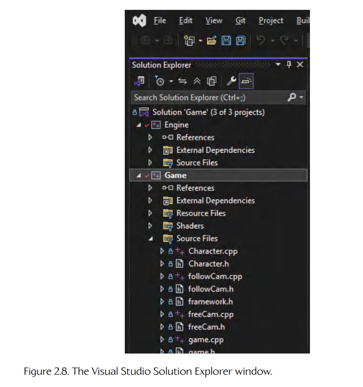
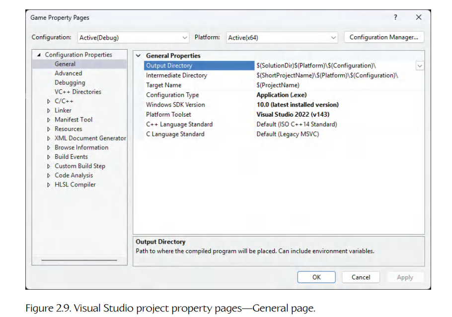
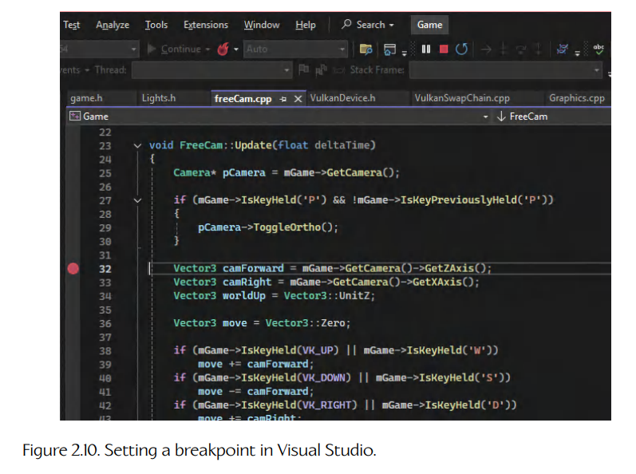
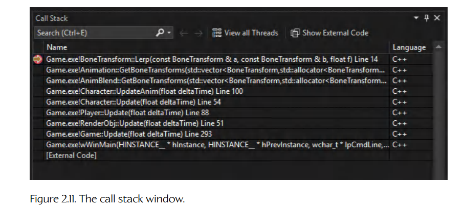
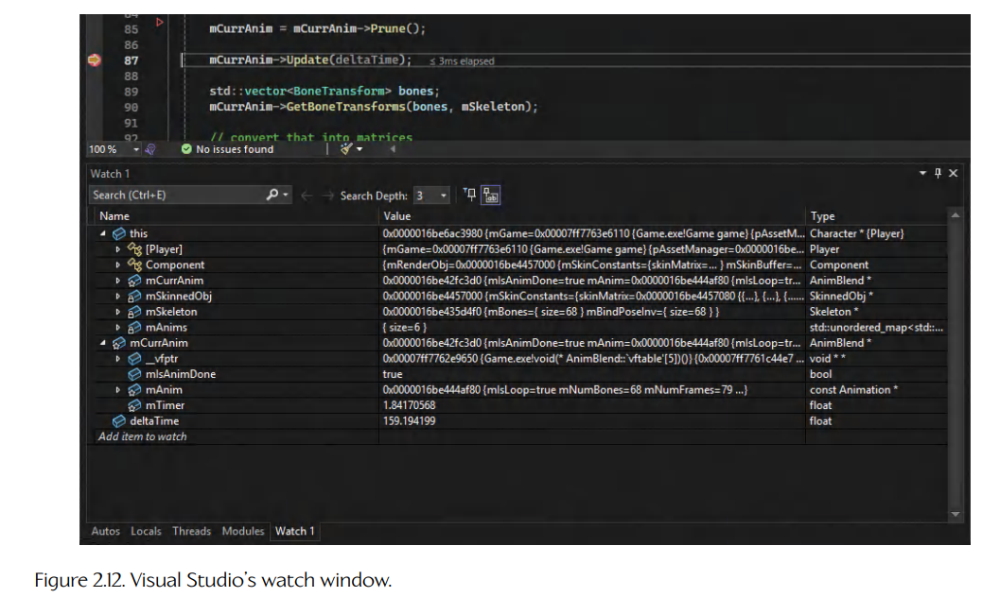
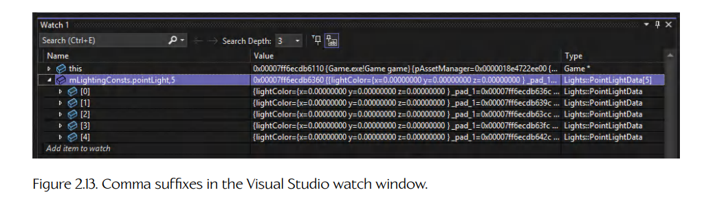
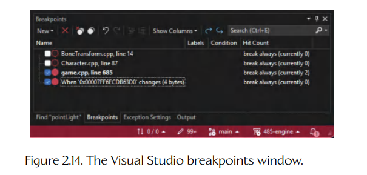
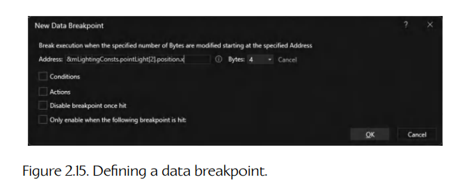

## 2.2 编译器、链接器与 IDE

C++ 这样的编译型语言需要编译器（compiler）和链接器（linker），才能把源代码转换成可执行程序。C++ 有许多可用的编译器/链接器，但在 Microsoft Windows 平台上，最常用的软件包大概是 Microsoft Visual Studio。该产品功能完整的 Professional 和 Enterprise 版本可以从 Microsoft 商店在线购买，而它的轻量级同类产品 Visual Studio Community Edition（以前称为 Visual Studio Express）可以在 [87] 免费下载。标准 C 和 C++ 库的文档可以在 [88] 在线获得。

Visual Studio 不只是一个编译器和链接器。它是一个集成开发环境（integrated development environment，IDE），包括一个流畅且功能完整的源代码文本编辑器，以及一个强大的源码级和机器级调试器。在本书中，我们主要关注 Windows 平台，因此会较为深入地研究 Visual Studio。下面你学到的大部分内容，也适用于其他编译器、链接器和调试器，例如 LLVM/Clang、gcc/gdb，以及 Intel C/C++ 编译器。因此，即使你并不打算使用 Visual Studio，我也建议你仔细阅读本节。你会发现许多关于一般性使用编译器、链接器和调试器的有用技巧。

### 2.2.1 源文件、头文件与翻译单元

用 C++ 编写的程序由源文件（source files）组成。这些文件通常具有 `.c`、`.cc`、`.cxx` 或 `.cpp` 扩展名，并且包含程序源代码的主体部分。从技术上讲，源文件被称为翻译单元（translation units），因为编译器一次会把一个源文件从 C++ 翻译成机器代码。

一种特殊的源文件称为头文件（header file），它常用于在翻译单元之间共享信息，例如类型声明和函数原型。编译器并不会直接看到头文件。相反，C++ 预处理器会在把翻译单元发送给编译器之前，用相应头文件的内容替换每条 `#include` 语句。这是一个微妙但非常重要的区别。从程序员的角度看，头文件是独立存在的文件；但由于预处理器会展开头文件，编译器最终看到的始终只是翻译单元。

### 2.2.2 库、可执行文件与动态链接库

当一个翻译单元被编译后，生成的机器代码会被放入一个目标文件（object file）中（Windows 下扩展名为 `.obj`，基于 UNIX 的操作系统下扩展名为 `.o`）。目标文件中的机器代码具有以下特点：

- 可重定位（relocatable），也就是说代码所在的内存地址尚未确定；

- 未链接（unlinked），也就是说，对于那些定义在该翻译单元之外的函数和全局数据的外部引用，尚未被解析。

目标文件可以被收集到称为库（libraries）的分组中。库本质上只是一个归档文件，很像 ZIP 或 tar 文件，其中包含零个或多个目标文件。库只是为了方便而存在，使大量目标文件能够被收集到一个易于使用的单一文件中。

目标文件和库由链接器链接（linked）成可执行文件。可执行文件包含完全解析后的机器代码，可以由操作系统加载并运行。链接器的工作是：

- 计算所有机器代码最终的相对地址，也就是程序运行时这些代码在内存中出现的位置；

- 确保每个翻译单元（目标文件）对函数和全局数据所做的所有外部引用都被正确解析。

需要记住的是，可执行文件中的机器代码仍然是可重定位的，这意味着文件中所有指令和数据的地址仍然是相对于某个任意基地址的，而不是绝对地址。程序最终的绝对基地址直到程序真正被加载到内存中、即将运行之前才会被确定。

动态链接库（dynamic link library，DLL）是一种特殊类型的库，它的行为像普通静态库和可执行文件的混合体。DLL 像库一样，因为它包含可以被任意数量不同可执行文件调用的函数。不过，DLL 也像可执行文件一样，因为它可以由操作系统独立加载，并且包含一些启动和关闭代码，其运行方式非常类似于 C++ 可执行文件中的 `main()` 函数。

使用 DLL 的可执行文件包含部分链接（partially linked）的机器代码。大多数函数和数据引用会在最终可执行文件中完全解析，但任何指向 DLL 中外部函数或数据的引用都会保持未链接状态。当可执行文件运行时，操作系统通过定位相应的 DLL、在尚未加载时将其加载进内存，并补入必要的内存地址，来解析所有未链接函数的地址。动态链接库是一个非常有用的操作系统特性，因为单独的 DLL 可以被更新，而不需要修改使用它们的可执行文件。

### 2.2.3 项目与解决方案

现在我们已经理解了库、可执行文件和动态链接库（DLL）之间的区别，接下来看看如何创建它们。在 Visual Studio 中，一个项目（project）是一组源文件的集合，这些源文件被编译后会生成一个库、一个可执行文件或一个 DLL。在 VS 2013 之后的所有 Visual Studio 版本中，项目都存储在扩展名为 `.vcxproj` 的项目文件中。这些文件采用 XML 格式，因此人类比较容易阅读，必要时甚至可以手动编辑。

从版本 7（Visual Studio 2003）开始，所有 Visual Studio 版本都使用解决方案文件（solution files，扩展名为 `.sln`）来容纳和管理项目集合。一个解决方案是一组相关和/或独立项目的集合，用于构建一个或多个库、可执行文件和/或 DLL。在 Visual Studio 图形用户界面中，Solution Explorer 通常显示在主窗口的右侧或左侧，如图 2.8 所示。

Solution Explorer 是一个树状视图。解决方案本身位于根节点，项目是它的直接子节点。源文件和头文件显示为每个项目的子节点。一个项目可以包含任意数量的用户自定义文件夹，并且可以嵌套到任意深度。文件夹只用于组织目的，与文件在磁盘上的实际文件夹结构没有关系。不过，在设置项目文件夹时，通常的做法是模拟磁盘上的文件夹结构。

<a id="figure-28"></a>


**Figure 2.8.** Visual Studio 的解决方案资源管理器窗口。

### 2.2.4 构建配置

C/C++ 预处理器、编译器和链接器提供了大量选项，用于控制代码将如何被构建。这些选项通常在运行编译器时通过命令行指定。例如，使用 Microsoft 编译器构建单个翻译单元的典型命令可能如下：

```text
> cl /c foo.cpp /Fo foo.obj /Wall /Od /Zi
```

这会告诉编译器/链接器：编译但不链接（`/c`）名为 `foo.cpp` 的翻译单元，将结果输出到名为 `foo.obj` 的目标文件（`/Fo foo.obj`），开启所有警告（`/Wall`），关闭所有优化（`/Od`），并生成调试信息（`/Zi`）。LLVM/Clang 中大致等价的命令行可能如下：

```text
> clang --std=c++20 foo.cpp -o foo.o --Wall -O0 -g
```

现代编译器提供了如此多的选项，以至于每次构建代码时都手动指定它们既不现实，也容易出错。这就是构建配置（build configurations）的作用所在。构建配置本质上就是与解决方案中某个特定项目关联的一组预处理器、编译器和链接器选项。你可以定义任意数量的构建配置，随意为它们命名，并在每个配置中以不同方式配置预处理器、编译器和链接器选项。默认情况下，同一个项目中的每个翻译单元都会应用相同选项，不过你也可以按单个翻译单元覆盖全局项目设置。（我建议尽可能避免这样做，因为这样会很难判断哪些 `.cpp` 文件有自定义设置，哪些没有。）

当你在 Visual Studio 中创建新的项目/解决方案时，默认会创建两个名为 “Debug” 和 “Release” 的构建配置。release 构建用于最终要交付（release）给客户的软件版本，而 debug 构建用于开发目的。debug 构建运行速度比非 debug 构建更慢，但它为程序员开发和调试程序提供了非常宝贵的信息。

专业软件开发者通常会为软件设置两个以上的构建配置。要理解原因，我们需要理解局部（编译时）优化和全局（链接时）优化如何工作——我们会在第 2.2.4.2 节讨论这些优化。现在，我们先暂时放下容易混淆的 “release build” 这个术语，而使用 “debug build”（表示局部和全局优化均被禁用）以及 “non-debug build”（表示启用了局部和/或全局优化）这两个术语。

#### 2.2.4.1 常见构建选项

本节列出一些最常见的选项。在游戏引擎项目中，你通常会希望通过构建配置来控制这些选项。

**预处理器设置。**

C++ 预处理器负责展开被 `#include` 包含的文件，以及定义和替换由 `#define` 定义的宏。所有现代 C++ 预处理器的一个极其强大的特性，是能够通过命令行选项（因此也可以通过构建配置）定义预处理器宏。以这种方式定义的宏，其行为就像已经通过 `#define` 语句写入到源代码中一样。对于大多数编译器而言，该命令行选项是 `-D` 或 `/D`，并且可以使用任意数量的这类指令。

这个特性允许你把各种构建选项传达给代码，而不必修改源代码本身。一个无处不在的例子是，符号 `_DEBUG` 总是在 debug 构建中定义；而在 non-debug 构建中，则会定义符号 `NDEBUG`。源代码可以检查这些标志，并实际上“知道”自己是在 debug 模式还是 non-debug 模式下构建的。这称为条件编译（conditional compilation）。例如：

```cpp
void f()
{
#ifdef _DEBUG
    printf("Calling function f()\n");
#endif
    // ...
}
```

编译器也可以根据它对编译环境和目标平台的了解，在代码中引入“魔法”预处理器宏。例如，大多数 C/C++ 编译器在编译 C++ 文件时都会定义宏 `__cplusplus`。这使代码能够被写成自动适配 C 或 C++ 编译的形式。

再举一个例子，每个编译器都会通过一个“魔法”预处理器宏向源代码标识自己。当在 Microsoft 编译器下编译代码时，会定义宏 `_MSC_VER`；当在 GNU 编译器（gcc）下编译时，则会定义宏 `__GNUC__`，其他编译器也依此类推。代码将要运行的目标平台同样会通过宏来标识。例如，当为 32 位 Windows 机器构建时，符号 `_WIN32` 总是被定义。这些关键特性使跨平台代码能够被编写出来，因为它们允许代码“知道”当前由哪个编译器进行编译，以及它要运行在哪个目标平台上。

**编译器设置。**

最常见的编译器选项之一，是控制编译器是否应当把调试信息（debugging information）包含在它生成的目标文件中。这些信息由调试器使用，用于单步执行代码、显示变量值，等等。调试信息会使可执行文件在磁盘上变得更大，也会为黑客逆向工程你的代码打开大门，因此它总是会从最终发布版本的可执行文件中剥离出去。不过，在开发过程中，调试信息非常宝贵，应当始终包含在构建中。

编译器还可以被告知是否展开内联函数（inline functions）。当内联函数展开被关闭时，每个内联函数在内存中只会出现一次，并拥有一个独立地址。这会让在调试器中跟踪代码的任务简单得多，但显然会牺牲内联通常带来的执行速度提升。

内联函数展开只是广义代码变换的一种例子，这些代码变换称为优化（optimizations）。编译器尝试优化代码的激进程度，以及它使用的优化类型，都可以通过编译器选项进行控制。优化往往会重新排列代码中的语句，也会导致变量被完全从代码中剥离、被移动位置，并可能导致 CPU 寄存器在同一个函数后续部分被重新用于其他目的。优化后的代码通常会让大多数调试器感到困惑，使它们以各种方式对你“说谎”，并让你很难甚至不可能看到真实发生的事情。因此，在 debug 构建中通常会关闭所有优化。这允许你按照代码最初写下的样子检查每个变量和每一行代码。当然，这样的代码运行速度会比完全优化后的对应版本慢得多。

**链接器设置。**

链接器也暴露出许多选项。你可以控制要生成哪种类型的输出文件——可执行文件或 DLL。你也可以指定哪些外部库应被链接进你的可执行文件，以及为了找到它们应搜索哪些目录路径。常见做法是在构建 debug 可执行文件时链接 debug 库，而在 non-debug 模式下构建时链接优化后的库。

链接器选项还控制诸如栈大小、程序在内存中的首选基地址、代码将运行在哪种机器上（用于特定机器的优化）、是否启用全局（链接时）优化，以及其他一些我们在这里不关心的细节。

#### 2.2.4.2 局部优化与全局优化

优化编译器（optimizing compiler）是指能够自动优化其生成机器代码的编译器。今天常用的所有 C/C++ 编译器都是优化编译器，包括 Microsoft Visual Studio、gcc、LLVM/Clang 和 Intel C/C++ 编译器。

优化可以分为两种基本形式：

- 局部优化（local optimizations）；

- 全局优化（global optimizations）；

不过也可能存在其他类型的优化，例如窥孔优化（peephole optimizations），它使优化器能够进行平台或 CPU 特定的优化。

局部优化只作用于称为基本块（basic blocks）的小段代码。粗略地说，基本块是一串不包含分支的汇编语言指令。局部优化包括如下内容：

- 代数化简（algebraic simplification）；

- 运算符强度削减（operator strength reduction），例如把 `x / 2` 转换为 `x >> 1`，因为移位运算符“强度更低”，因此比整数除法运算符开销更小；

- 代码内联（code inlining）；

- 常量折叠（constant folding），即识别编译时为常量的表达式，并用已知值替换这些表达式；

- 常量传播（constant propagation），即把某个最终发现为常量的变量的所有出现位置，替换为字面常量本身；

- 循环展开（loop unrolling），例如将一个总是恰好迭代四次的循环转换成循环体代码的四份副本，以消除条件分支；

- 死代码消除（dead code elimination），即移除没有效果的代码，例如如果赋值表达式 `x = 5;` 后面紧跟着另一个对 `x` 的赋值，例如 `x = y + 1;`，那么前一个赋值可以被移除；

- 指令重排序（instruction reordering），以尽量减少 CPU 流水线停顿。

全局优化超出了基本代码块的范围——它们会考虑程序的整个控制流图。这类优化的一个例子是公共子表达式消除（common sub-expression elimination）。理想情况下，全局优化会跨越翻译单元边界进行，因此由链接器而不是编译器执行。恰当地说，由链接器执行的优化称为链接时优化（link-time optimizations，LTO）。

一些现代编译器，例如 LLVM/Clang，支持基于性能剖析的优化（profile-guided optimizations，PGO）。顾名思义，这些优化使用从软件先前运行中获得的性能剖析信息，以迭代方式识别并优化最关键的性能代码路径。PGO 和 LTO 优化可以带来令人印象深刻的性能提升，但它们也有代价。LTO 优化会大大增加链接可执行文件所需的时间。而 PGO 优化由于具有迭代性质，需要软件运行起来（通过 QA 团队或自动化测试套件），以生成驱动进一步优化的性能剖析信息。

大多数编译器提供各种选项来控制优化工作的激进程度。优化可以完全禁用（这对于 debug 构建很有用，因为可调试性比性能更重要），也可以应用逐渐增加的优化“级别”，直到某个预设最大值。例如，gcc、Clang 和 Visual C++ 的优化级别都从 `-O0`（表示不执行优化）到 `-O3`（启用所有优化）。单个优化也可以通过其他命令行选项单独开启或关闭。

#### 2.2.4.3 典型构建配置

游戏项目通常不止有两个构建配置。下面是我在游戏开发中见过的一些常见配置。

- *Debug*。debug 构建是程序的一个非常慢的版本，所有优化都被关闭，所有函数内联都被禁用，并包含完整调试信息。当测试全新代码，以及调试开发过程中出现的除最琐碎问题以外的所有问题时，会使用这种构建。

- *Development*。development 构建（或称 “dev build”）是程序的一个更快版本，其中启用了大多数或全部局部优化，但调试信息和断言仍然开启。（关于断言的讨论见第 3.2.3.3 节。）这让你可以看到游戏以接近最终产品的速度运行，但仍然给你一些调试问题的机会。

- *Ship*。ship 配置用于构建最终交付给客户的游戏。它有时也称为 “final” 构建或 “disk” 构建。与 development 构建不同，ship 构建会剥离所有调试信息，编译掉大多数或全部断言，并将优化开到最大，包括全局优化（LTO 和 PGO）。ship 构建非常难调试，但它是所有构建类型中最快、最精简的。

**混合构建。**

hybrid 构建是一种构建配置，其中大多数翻译单元以 development 模式构建，但其中一小部分以 debug 模式构建。这样可以让当前正在检查的代码片段易于调试，而其余代码则继续以接近全速运行。

对于像 make 这样的基于文本的构建系统，设置 hybrid 构建相当容易，用户可以按翻译单元指定是否使用 debug 模式。简而言之，我们定义一个类似 `$HYBRID_SOURCES` 的 make 变量，列出在 hybrid 构建中应以 debug 模式编译的所有翻译单元（`.cpp` 文件）名称。我们设置构建规则，为每个翻译单元同时编译 debug 和 development 两个版本，并安排生成的目标文件（`.obj/.o`）被放入两个不同文件夹，一个用于 debug，一个用于 development。最终链接规则会链接 `$HYBRID_SOURCES` 中列出的目标文件的 debug 版本，以及所有其他目标文件的 non-debug 版本。如果设置正确，make 的依赖规则会处理其余工作。

不幸的是，在 Visual Studio 中这并不容易做到，因为它的构建配置被设计为按项目应用，而不是按翻译单元应用。问题的关键在于，我们无法轻松定义一个想要以 debug 模式构建的翻译单元列表。解决这个问题的一种方式是编写脚本（使用 Python 或其他合适语言），根据你希望在 hybrid 配置中以 debug 模式构建的 `.cpp` 文件列表，自动生成 Visual Studio `.vcxproj` 文件。另一种可行替代方案是，如果源代码已经组织成库，就可以在解决方案级别设置一个 “Hybrid” 构建配置，在按项目（因此也就是按库）粒度上选择 debug 和 development 构建。它不如按翻译单元控制灵活，但如果你的库足够细粒度，它也能很好地工作。

**构建配置与可测试性。**

项目支持的构建配置越多，测试就越困难。尽管各种配置之间的差异可能很小，但一个关键 bug 有一定概率存在于其中某个配置中，而不存在于其他配置中。因此，每个构建配置都必须被同样彻底地测试。大多数游戏工作室不会正式测试 debug 构建，因为 debug 配置主要用于某个功能初始开发期间的内部使用，以及调试在其他配置中发现的问题。不过，如果测试人员大部分时间都在测试 development 构建配置，那么你就不能简单地在 Gold Master 前一晚制作一个游戏的 ship 构建，并期待它具有与 development 构建相同的 bug 分布。实际来说，测试团队必须在 alpha 和 beta 阶段同等测试 development 与 ship 构建，以确保 ship 构建中没有隐藏的讨厌意外。从可测试性的角度看，把构建配置保持在最少数量有明显优势。事实上，有些工作室因此根本没有单独的 ship 构建——他们只是彻底测试 development 构建后就发布它（但会剥离调试信息）。

#### 2.2.4.4 项目配置教程

在 Solution Explorer 中右键单击任何项目，并从菜单中选择 “Properties...”，会打开该项目的 “Property Pages” 对话框。左侧的树状视图显示了各种设置类别。其中，我们最常用的四类是：

- Configuration Properties/General；

- Configuration Properties/Debugging；

- Configuration Properties/C++；

- Configuration Properties/Linker。

**配置下拉组合框。**

注意窗口左上角标有 “Configuration:” 的下拉组合框。这些属性页上显示的所有属性都会分别应用于每个构建配置。如果你为 debug 配置设置了某个属性，这并不一定意味着其他配置中也存在相同设置。

如果你单击组合框展开列表，会发现你可以选择单个配置或多个配置，包括 “All configurations”。作为经验法则，尽量在选择 “All configurations” 的情况下完成大部分构建配置编辑。这样你就不必为每个配置重复进行相同编辑，也不会冒着意外在某个配置中设置错误的风险。不过，也要注意，有些设置确实需要在 debug 和 development 配置之间不同。例如，函数内联和代码优化设置当然就应该在 debug 与 development 构建之间不同。

**General 属性页。**

在图 2.9 所示的 General 属性页中，最有用的字段如下：

- *Output directory*。它定义构建的最终产物会放到哪里，也就是编译器/链接器最终输出的可执行文件、库或 DLL。

- *Intermediate directory*。它定义构建期间中间文件的位置，主要是目标文件（`.obj` 扩展名）。中间文件永远不会随最终程序发布——它们只在构建可执行文件、库或 DLL 的过程中需要。因此，将中间文件放在与最终产物（`.exe`、`.lib` 或 `.dll` 文件）不同的目录中是个好主意。

请注意，Visual Studio 提供宏功能，可在 “Project Property Pages” 对话框中指定目录和其他设置时使用。宏本质上是一个带名称的变量，其中包含一个全局值，并且可以在项目配置设置中引用。

宏通过写出宏名称、用圆括号括起来，并在前面加上美元符号来调用，例如 `$(ConfigurationName)`。下面列出一些常用宏。

<a id="figure-29"></a>


**Figure 2.9.** Visual Studio 项目属性页：General 页面。

- `$(TargetFileName)`。本项目正在构建的最终可执行文件、库或 DLL 文件的名称。

- `$(TargetPath)`。包含最终可执行文件、库或 DLL 的文件夹完整路径。

- `$(ConfigurationName)`。构建配置的名称，在 Visual Studio 中默认会是 “Debug” 或 “Release”。不过正如我们已经说过的，真实游戏项目很可能会有多个配置，例如 “Debug”、“Hybrid”、“Development” 和 “Ship”。

- `$(OutDir)`。该对话框中 “Output Directory” 字段的值。

- `$(IntDir)`。该对话框中 “Intermediate Directory” 字段的值。

- `$(VCInstallDir)`。Visual Studio 的 C++ 标准库当前安装所在的目录。

使用宏而不是把配置设置硬编码的好处在于，对全局宏值的一次简单修改，会自动影响所有使用该宏的配置设置。此外，像 `$(ConfigurationName)` 这样的宏会根据构建配置自动改变自己的值，因此使用它们可以让你在所有配置中使用相同设置。

要查看所有可用宏的完整列表，可以在 “General” 属性页的 “Output Directory” 或 “Intermediate Directory” 字段中单击，点击文本字段右侧的小箭头，选择 “Edit...”，然后在弹出的对话框中点击 “Macros” 按钮。

**Debugging 属性页。**

“Debugging” 属性页用于指定要调试的可执行文件的名称和位置。在这个页面上，你还可以指定程序运行时应传递给它的命令行参数。下面我们会更深入地讨论如何调试程序。

**C/C++ 属性页。**

C/C++ 属性页控制编译时语言设置——也就是影响源文件如何被编译成目标文件（`.obj` 扩展名）的内容。该页上的设置不会影响你的目标文件如何被链接成最终可执行文件或 DLL。

建议你探索 C/C++ 页面的各个子页面，看看有哪些设置可用。一些最常用的设置包括：

- *General Property Page/Additional Include Directories*。这个字段列出在查找由 `#include` 包含的头文件时，会搜索的磁盘目录。

  **Important:** 最好始终使用相对路径和/或 Visual Studio 宏（例如 `$(OutDir)` 或 `$(IntDir)`）来指定这些目录。这样，如果你把构建树移动到磁盘上的不同位置，或者移动到另一台根文件夹不同的计算机上，一切仍然能够正常工作。

- *General Property Page/Debug Information Format*。这个字段控制是否生成调试信息，以及以何种格式生成。通常 debug 和 development 配置都会包含调试信息，以便你在游戏开发过程中追踪问题。ship 构建会剥离所有调试信息，以防止黑客逆向。

- *Preprocessor Property Page/Preprocessor Definitions*。这个非常方便的字段列出在代码编译时应定义的任意数量 C/C++ 预处理器符号。关于预处理器定义符号的讨论，见第 2.2.4.1 节中的 *Preprocessor Settings*。

**Linker 属性页。**

“Linker” 属性页列出的属性会影响目标代码文件如何被链接成可执行文件或 DLL。再次建议你探索各个子页面。一些常用设置如下：

- *General Property Page/Output File*。这个设置列出构建最终产物的名称和位置，通常是可执行文件或 DLL。

- *General Property Page/Additional Library Directories*。与 C/C++ 的 Additional Include Directories 字段非常类似，这个字段列出零个或多个目录；在查找要链接进最终可执行文件的库和目标文件时，会搜索这些目录。

- *Input Property Page/Additional Dependencies*。这个字段列出你希望链接进可执行文件或 DLL 的外部库。例如，如果你正在构建一个启用了 OGRE 的应用，那么 OGRE 库会列在这里。

请注意，Visual Studio 会使用各种“魔法咒语”来指定应链接进可执行文件的库。例如，源代码中的特殊 `#pragma` 指令可以用于指示链接器自动链接某个特定库。因此，你可能无法在 “Additional Dependencies” 字段中看到实际正在链接的所有库。（事实上，这正是它们被称为 additional dependencies 的原因。）例如，你可能已经注意到，DirectX 应用并不会在它们的 “Additional Dependencies” 字段中手动列出所有 DirectX 库。现在你知道原因了。

### 2.2.5 调试你的代码

任何程序员都能学习的最重要技能之一，就是如何有效调试代码。本节提供一些有用的调试技巧和窍门。其中一些适用于任何调试器，另一些则特定于 Microsoft Visual Studio。不过，在其他调试器中通常也能找到与 Visual Studio 调试功能等价的功能，因此即使你不使用 Visual Studio 调试代码，本节也应该很有用。

#### 2.2.5.1 启动项目

一个 Visual Studio 解决方案可以包含多个项目。其中有些项目构建可执行文件，而另一些项目构建库或 DLL。在单个解决方案中，也可以有多个构建可执行文件的项目。Visual Studio 提供一个称为 “Start-Up Project” 的设置。对于调试器而言，这个项目被视为“当前”项目。通常，程序员一次会通过设置一个启动项目来调试一个项目。不过，也可以同时调试多个项目（详情见 [89]）。

启动项目会在 Solution Explorer 中以粗体突出显示。默认情况下，按下 F5 会运行由启动项目构建的 `.exe`，前提是该启动项目会构建一个可执行文件。（严格来说，F5 会运行你在 Debugging 属性页的 Command 字段中输入的任何命令，因此并不限于运行项目构建的 `.exe`。）

#### 2.2.5.2 断点

断点（breakpoints）是代码调试中的基本工具。断点会指示程序在源代码中的特定行停止执行，这样你就可以检查正在发生什么。

在 Visual Studio 中，选中一行并按 F9 可以切换断点。当你运行程序，并且包含断点的代码行即将被执行时，调试器会停止程序。我们说这个断点被“命中”（hit）。一个小箭头会显示 CPU 的程序计数器当前位于哪一行代码。如图 2.10 所示。

<a id="figure-210"></a>


**Figure 2.10.** 在 Visual Studio 中设置断点。

#### 2.2.5.3 单步执行代码

一旦断点被命中，你可以按 F10 对代码进行单步执行。黄色程序计数器箭头会移动，显示代码逐行执行。按 F11 会进入（step into）函数调用，也就是你接下来看到的代码行会是被调用函数的第一行；而 F10 会越过（step over）该函数调用，也就是调试器会以全速调用该函数，然后在调用之后的下一行再次中断。

#### 2.2.5.4 调用栈

调用栈（call stack）窗口如图 2.11 所示，它会显示代码执行期间，在任意给定时刻已经被调用的函数栈。（关于程序栈的更多细节，见第 3.3.5.2 节。）要显示调用栈（如果它尚未可见），请进入主菜单栏中的 “Debug” 菜单，选择 “Windows”，然后选择 “Call Stack”。

<a id="figure-211"></a>


**Figure 2.11.** 调用栈窗口。

一旦断点被命中（或者程序被手动暂停），你就可以通过双击 “Call Stack” 窗口中的条目，在调用栈中上下移动。这对于检查从 `main()` 到当前代码行之间的函数调用链非常有用。例如，你可能会沿着调用链向上追溯，找到一个父函数中的 bug 根因，而这个 bug 表现为某个深层嵌套子函数中的问题。

#### 2.2.5.5 监视窗口

当你单步执行代码并在调用栈中上下移动时，你会希望能够检查程序中变量的值。这正是监视窗口（watch windows）的用途。要打开监视窗口，请进入 “Debug” 菜单，选择 “Windows...”，然后选择 “Watch...”，最后从 “Watch 1” 到 “Watch 4” 中选择一个。（Visual Studio 允许你同时打开最多四个监视窗口。）打开监视窗口后，你可以在窗口中输入变量名，也可以直接从源代码中把表达式拖进去。

如图 2.12 所示，具有简单数据类型的变量会显示为它们的名称右侧直接列出对应值。复杂数据类型会显示为可以轻松展开的小型树状视图，从而“钻入”几乎任何嵌套结构。类的基类总是显示为派生类实例的第一个子节点。这使你不仅可以检查类自身的数据成员，也可以检查其基类的数据成员。

<a id="figure-212"></a>


**Figure 2.12.** Visual Studio 的监视窗口。

你几乎可以在监视窗口中输入任何有效的 C/C++ 表达式，Visual Studio 会计算该表达式并尝试显示结果值。例如，你可以输入 “`5 + 3`”，Visual Studio 会显示 “`8`”。你可以使用 C 或 C++ 强制类型转换语法，将变量从一种类型转换为另一种类型。例如，在监视窗口中输入 “`(float)intVar1/(float)intVar2`”，会把两个整数变量的比值显示为浮点值。

你甚至可以从监视窗口内部调用程序中的函数。Visual Studio 会自动重新计算输入到监视窗口中的表达式，因此如果你在监视窗口中调用函数，那么每次遇到断点或单步执行代码时，都会调用该函数。这样，在你试图解释调试器中正在检查的数据时，可以利用程序自身的功能来节省工作。例如，假设你的游戏引擎提供一个名为 `quatToAngleDeg()` 的函数，用于把四元数转换为以度为单位的旋转角度。你可以在监视窗口中调用这个函数，从而在调试器中轻松检查任何四元数的旋转角度。

你还可以在监视窗口中的表达式后使用各种后缀，以改变 Visual Studio 显示数据的方式，如图 2.13 所示。

<a id="figure-213"></a>


**Figure 2.13.** Visual Studio 监视窗口中的逗号后缀。

- “`,d`” 后缀强制以十进制表示法显示值。

- “`,x`” 后缀强制以十六进制表示法显示值。

- “`,!`” 后缀强制以数据项的“原始”底层格式显示它，从而有效禁用 Visual Studio 的 Natvis 框架。关于 Natvis 的更多信息，见 [90]。

- “`,n`” 后缀（其中 `n` 是任意正整数）强制 Visual Studio 将该值视为包含 `n` 个元素的数组。这允许你展开通过指针引用的数组数据。

- 你还可以在方括号中写入简单表达式，用来计算 “`,n`” 后缀中的 `n` 值。例如，你可以输入类似下面的内容：

```cpp
my_array,[my_array_count]
```

来要求调试器显示名为 `my_array` 的数组中的 `my_array_count` 个元素。

在监视窗口中展开非常大的数据结构时要小心，因为这有时会让调试器变慢，甚至慢到无法使用。

#### 2.2.5.6 数据断点

普通断点会在 CPU 的程序计数器到达某条特定机器指令或某行代码时触发。不过，现代调试器的另一个极其有用的功能，是能够设置一种断点：只要某个特定内存地址被写入（也就是发生改变），它就会触发。这些断点称为数据断点（data breakpoints），因为它们由数据变更触发；有时也称为硬件断点（hardware breakpoints），因为它们通过 CPU 硬件的一项特殊功能实现——也就是当预定义内存地址被写入时触发中断的能力。

下面是数据断点的典型使用方式。假设你正在追踪一个 bug，它表现为某个特定对象中名为 `m_angle` 的成员变量神秘地变成了零（`0.0f`），而这个变量本应始终包含一个非零角度。你完全不知道是哪个函数把这个零写进了你的变量。不过，你知道该变量的地址。（你只需在监视窗口中输入 “`&object.m_angle`” 就能找到它的地址。）为了追踪罪魁祸首，你可以在 `object.m_angle` 的地址上设置一个数据断点，然后直接让程序运行。当这个值发生变化时，调试器会自动停止。随后你就可以检查调用栈，当场抓住违规函数。

<a id="figure-214"></a>


**Figure 2.14.** Visual Studio 的断点窗口。

<a id="figure-215"></a>


**Figure 2.15.** 定义数据断点。

要在 Visual Studio 中设置数据断点，请执行以下步骤。

- 打开 “Breakpoints” 窗口，它位于 “Debug” 菜单下的 “Windows” 中，然后选择 “Breakpoints”（图 2.14）。

- 选择窗口左上角的 “New” 下拉按钮。

- 选择 “New Data Breakpoint”。

- 输入原始地址，或者一个值为地址的表达式，例如 “`&myVariable`”（图 2.15）。

#### 2.2.5.7 条件断点

你还会在 “Breakpoints” 窗口中注意到，可以为任何类型的断点设置条件和命中次数——包括数据断点和普通代码行断点。

条件断点（conditional breakpoint）会让调试器在断点每次被命中时，计算你提供的 C/C++ 表达式。如果表达式为真，调试器会停止程序，并给你机会查看发生了什么。如果表达式为假，断点会被忽略，程序继续运行。这对于设置只在函数被某个类的特定实例调用时才触发的断点非常有用。例如，假设某个游戏关卡中屏幕上有 20 辆坦克，而你希望当第三辆坦克运行时停止程序，并且你知道它的内存地址是 `0x12345678`。通过把断点条件表达式设置为类似 “`(uintptr_t)this == 0x12345678`” 的形式，你可以把断点限制为只有内存地址（`this` 指针）为 `0x12345678` 的类实例才触发。

为断点指定命中次数（hit count）会让调试器在断点每次命中时递减一个计数器，并且只有当该计数器到达零时才真正停止程序。这在断点位于循环内部，而你需要检查循环第 376 次迭代期间发生了什么时非常有用（例如数组中的第 376 个元素）。你总不能坐在那里按 F5 键 375 次！但你可以让 Visual Studio 的命中次数功能替你完成这件事。

需要提醒一点：条件断点会让调试器在断点每次命中时计算条件表达式，因此它们可能会拖慢调试器和游戏的性能。

#### 2.2.5.8 调试优化构建

我在上文提到过，使用 development 或 ship 构建调试问题可能非常棘手，主要原因在于编译器优化代码的方式。理想情况下，每个程序员都会更愿意在 debug 构建中完成所有调试。然而，这通常是不可能的。有时某个 bug 极其罕见，以至于只要有任何调试机会你都会抓住，即使它出现在别人机器上的 non-debug 构建中。还有一些 bug 只出现在你的 non-debug 构建中，但当你运行 debug 构建时，它们又会神奇地消失。这些可怕的 “non-debug-only bugs” 有时是由未初始化变量导致的，因为变量和动态分配的内存块在 debug 模式下通常会被置零，但在 non-debug 构建中则会保留垃圾值。其他常见的 non-debug-only bug 原因包括：代码被意外地从 non-debug 构建中省略（例如重要代码被错误地放进了断言语句中）、数据结构的大小或数据成员打包方式在 debug 与 development/ship 构建之间发生变化、只由内联或编译器引入的优化触发的 bug，以及（少数情况下）编译器优化器本身的 bug，导致它在完全优化构建中输出错误代码。

显然，每个程序员都应该能够在 non-debug 构建中调试问题，即使这件事可能并不愉快。减轻调试优化代码痛苦的最佳方式，就是练习去做，并在有机会时扩展你在这方面的技能。下面是一些技巧。

- *Learn to read and step through disassembly in the debugger.* 在 non-debug 构建中，调试器通常很难跟踪当前正在执行的是哪一行源代码。由于指令重排序，在源代码模式下查看时，你经常会看到程序计数器在函数内部不规则地跳来跳去。然而，当你在反汇编模式下处理代码时，事情又会变得合理起来，也就是逐条单步执行汇编语言指令。每个 C/C++ 程序员都至少应该对目标 CPU 的体系结构和汇编语言有一点熟悉。这样，即使调试器感到困惑，你也不会困惑。（关于汇编语言的介绍，见第 3.4.7.3 节。）

- *Use registers to deduce variables’ values or addresses.* 在 non-debug 构建中，调试器有时无法显示某个变量的值，或者某个对象的内容。然而，如果程序计数器离变量最初被使用的位置并不太远，那么它的地址或值很有可能仍然存放在 CPU 的某个寄存器中。如果你能通过反汇编回溯到该变量第一次被加载进寄存器的位置，通常就可以通过检查该寄存器来发现它的值或地址。使用寄存器窗口，或者在监视窗口中输入寄存器名称，即可查看其内容。

- *Inspect variables and object contents by address.* 给定变量或数据结构的地址后，你通常可以在监视窗口中把该地址强制转换为合适的类型，从而查看它的内容。例如，如果我们知道 `Foo` 类的一个实例位于地址 `0x1378A0C0`，那么可以在监视窗口中输入 “`(Foo*)0x1378A0C0`”，调试器就会把这个内存地址解释为指向 `Foo` 对象的指针。

- *Leverage static and global variables.* 即使在优化构建中，调试器通常也能检查全局变量和静态变量。如果你无法推断某个变量或对象的地址，就要留意可能直接或间接保存其地址的静态变量或全局变量。例如，如果我们想找到物理系统中某个内部对象的地址，可能会发现它实际上存储在全局 `PhysicsWorld` 对象的某个成员变量中。

- *Modify the code.* 如果你能比较容易地复现某个只在 non-debug 构建中出现的 bug，可以考虑修改源代码来帮助调试问题。添加打印语句，以便观察正在发生什么。引入一个全局变量，让你更容易在调试器中检查有问题的变量或对象。添加代码来检测问题条件，或者隔离某个类的特定实例。
