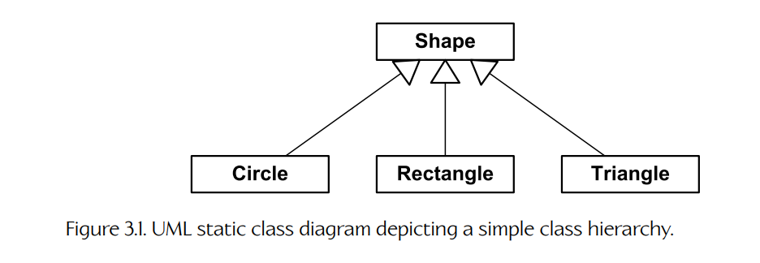
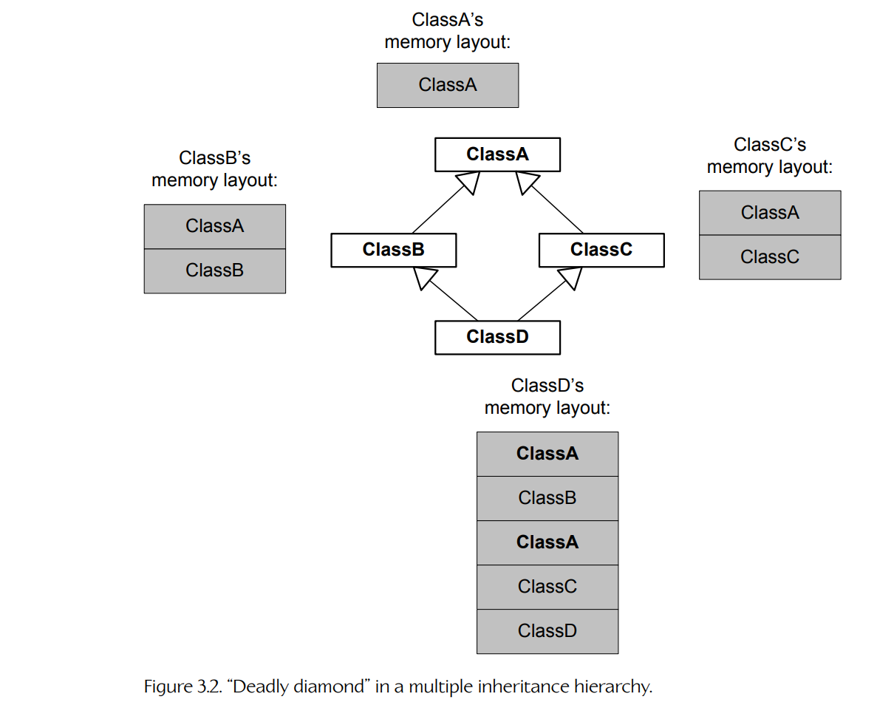
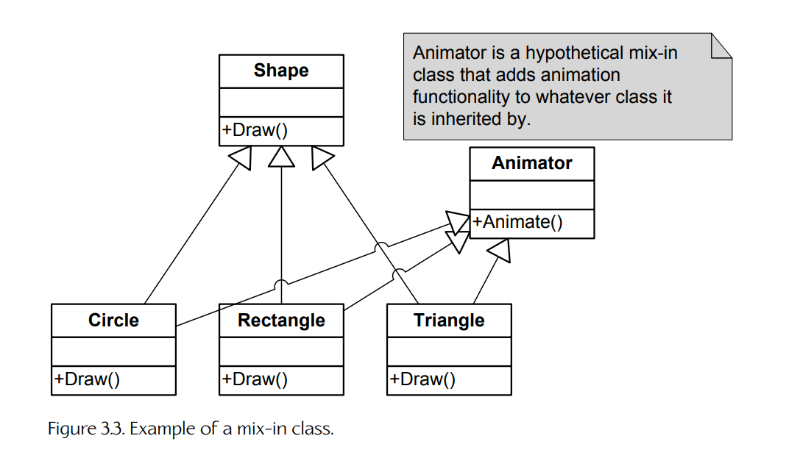

### 3.1 C++ 回顾与最佳实践

由于 C++ 可以说是游戏行业中最常用的语言，因此本书将主要关注 C++。不过，我们将要讨论的大多数概念同样适用于任何面向对象编程语言。当然，游戏行业中也使用许多其他语言——例如 C 这样的命令式语言；C# 和 Java 这样的面向对象语言；Python、Lua 和 Perl 这样的脚本语言；Lisp、Scheme 和 F# 这样的函数式语言，等等。我强烈建议每位程序员至少学习两种高级语言（越多越好），同时也至少学习一些汇编语言编程（见第 3.4.7.3 节）。你学习的每一门新语言都会进一步拓宽你的视野，并让你以更深入、更熟练的方式思考编程整体。话虽如此，现在让我们把注意力转向一般意义上的面向对象编程概念，尤其是 C++。

#### 3.1.1 面向对象编程简要回顾

本书中的许多内容都假定你已经扎实理解了面向对象设计的原则。如果你有些生疏，下面这一节可以作为一个愉快而快速的复习。如果你完全不知道我在这一节讲什么，我建议你在继续阅读之前，先找一两本关于面向对象编程的书（例如 [8]），尤其是关于 C++ 的书（例如 [51]、[52] 和 [40]）来读一读。

##### 3.1.1.1 类与对象

**类**是一组属性（数据）和行为（代码）的集合，它们共同构成一个有用且有意义的整体。类是一种**规格说明**，它描述了该类的各个**实例**应该如何被构造；这些实例被称为**对象**。例如，你的宠物 Rover 是 “dog” 类的一个实例。因此，类和它的实例之间存在一对多关系。

##### 3.1.1.2 封装

**封装**意味着一个对象只向外部世界呈现有限的接口；对象的内部状态和实现细节被隐藏起来。封装简化了类使用者的工作，因为他们只需要理解类的有限接口，而不需要理解其实现中可能相当复杂的细节。封装还允许编写该类的程序员确保其实例始终处于逻辑一致的状态。

##### 3.1.1.3 继承

**继承**允许我们把新类定义为已有类的**扩展**。新类会修改或扩展已有类的数据、接口和/或行为。如果类 `Child` 扩展了类 `Parent`，我们就说 `Child` **继承自** `Parent`，或者说 `Child` **派生自** `Parent`。在这种关系中，类 `Parent` 被称为**基类**或**超类**，类 `Child` 被称为**派生类**或**子类**。显然，继承会在类之间形成层次化的、树状结构的关系。

继承会在类之间创建一种 “is-a” 关系。例如，圆是一种形状。所以，如果我们正在编写一个 2D 绘图应用，那么让 `Circle` 类从名为 `Shape` 的基类派生出来，很可能是合理的。

我们可以使用统一建模语言（Unified Modeling Language，UML）所定义的约定来绘制类层次结构图。在这种表示法中，矩形代表类，带空心三角箭头的箭头代表继承。继承箭头从子类指向父类。图 3.1 展示了一个用 UML **静态类图**表示的简单类层次结构示例。



**Figure 3.1.** 描绘简单类层次结构的 UML 静态类图。

**多重继承。**

有些语言支持**多重继承**（multiple inheritance，MI），这意味着一个类可以拥有不止一个父类。从理论上说，多重继承可以相当优雅，但在实践中，这类设计通常会引发许多混乱和技术难题 [105]。这是因为多重继承会把一棵简单的类树转变为一个潜在复杂的**图**。类图可能出现各种简单树结构中不会出现的问题，例如**致命菱形**（deadly diamond）[106]，在这种情况下，一个派生类最终会包含祖父基类的**两份**副本（见图 3.2）。（在 C++ 中，**虚继承**允许我们避免祖父类数据被复制两份。）多重继承还会使类型转换变得复杂，因为指针的实际地址可能会根据它被转换到哪个基类而发生变化。这是由于对象中存在多个 **vtable 指针**。

大多数 C++ 软件开发者会完全避免多重继承，或者只以有限形式允许它。一个常见经验法则是：只允许简单的、没有父类的类被多重继承到一个原本严格单继承的层次结构中。这样的类有时被称为 **mix-in 类**，因为它们可以在类树中的任意位置引入新的功能。图 3.3 展示了一个有些人为构造的 mix-in 类示例。



**Figure 3.2.** 多重继承层次结构中的致命菱形。



**Figure 3.3.** mix-in 类示例。

##### 3.1.1.4 多态

**多态**是一种语言特性，它允许我们通过单一的**公共接口**来操作一组不同类型的对象。从使用该接口的代码角度看，这个公共接口会让一组异构对象**看起来**像是同构的。

例如，一个 2D 绘图程序可能会得到一个由各种形状组成的列表，并需要将它们绘制到屏幕上。绘制这组异构形状的一种方法，是使用 `switch` 语句，对每一种不同类型的形状执行不同的绘制命令。

```cpp
void drawShapes(std::list<Shape*>& shapes)
{
    std::list<Shape*>::iterator pShape = shapes.begin();
    std::list<Shape*>::iterator pEnd = shapes.end();

    for ( ; pShape != pEnd; pShape++)
    {
        switch (pShape->mType)
        {
        case CIRCLE:
            // draw shape as a circle
            break;

        case RECTANGLE:
            // draw shape as a rectangle
            break;

        case TRIANGLE:
            // draw shape as a triangle
            break;

        //...
        }
    }
}
```

这种方法的问题在于，`drawShapes()` 函数需要“知道”所有可以被绘制的形状类型。在一个简单例子中这没什么问题，但随着代码规模和复杂度增长，向系统中添加新的形状类型就会变得困难。每当新增一种形状类型时，我们都必须找到代码库中所有嵌入了形状类型集合知识的位置——例如这个 `switch` 语句——然后增加一个 `case` 来处理新类型。

解决方案是让我们的大部分代码都隔离于它可能处理的对象类型知识之外。为此，我们可以为每一种想要支持的形状类型定义类。所有这些类都从公共基类 `Shape` 继承。我们会定义一个名为 `Draw()` 的**虚函数**——这是 C++ 语言中主要的多态机制——然后每一种不同的形状类都以不同方式实现这个函数。这样，绘图函数不需要“知道”传入的具体形状类型，只需要依次调用每个形状的 `Draw()` 函数即可。

```cpp
struct Shape
{
    virtual void Draw() = 0; // pure virtual function
    virtual ~Shape() { } // ensure derived dtors are virtual
};

struct Circle : public Shape
{
    virtual void Draw()
    {
        // draw shape as a circle
    }
};

struct Rectangle : public Shape
{
    virtual void Draw()
    {
        // draw shape as a rectangle
    }
};

struct Triangle : public Shape
{
    virtual void Draw()
    {
        // draw shape as a triangle
    }
};

void drawShapes(std::list<Shape*>& shapes)
{
    std::list<Shape*>::iterator pShape = shapes.begin();
    std::list<Shape*>::iterator pEnd = shapes.end();

    for ( ; pShape != pEnd; pShape++)
    {
        pShape->Draw(); // call virtual function
    }
}
```

##### 3.1.1.5 组合与聚合

**组合**是指使用一组相互交互的对象来完成一个高层任务的做法。组合在类之间创建了一种 “has-a” 或 “uses-a” 关系。（严格来说，“has-a” 关系称为**组合**，而 “uses-a” 关系称为**聚合**。）例如，一艘宇宙飞船**有一个**引擎，而引擎又**有一个**燃料箱。组合/聚合通常会使各个类变得更简单、更聚焦。缺乏经验的面向对象程序员常常过度依赖继承，而没有充分利用聚合和组合。

举个例子，假设我们正在为游戏前端设计图形用户界面。我们有一个 `Window` 类，用于表示任何矩形 GUI 元素。我们还有一个名为 `Rectangle` 的类，用于封装矩形这一数学概念。一个天真的程序员可能会让 `Window` 类从 `Rectangle` 类派生（使用 “is-a” 关系）。但在更灵活、封装性更好的设计中，`Window` 类会**引用**或**包含**一个 `Rectangle`（使用 “has-a” 或 “uses-a” 关系）。这样会让两个类都更简单、更聚焦，也能让它们更容易测试、调试和复用。

##### 3.1.1.6 设计模式

当同一种问题反复出现，并且许多不同程序员都采用了非常相似的解决方案时，我们就说产生了一种**设计模式**。在面向对象编程中，许多常见设计模式已经被不同作者识别并描述出来。关于这一主题最著名的书，可能就是“四人帮”（Gang of Four）那本书 [20]。

下面是一些常见通用设计模式的例子。

- **单例（Singleton）。** 这个模式确保某个特定类只有一个实例（即单例实例），并提供对它的全局访问点。
- **迭代器（Iterator）。** 迭代器提供了一种高效访问集合中各个元素的方法，同时不暴露集合的底层实现。迭代器“知道”集合的实现细节，因此它的使用者不需要知道。
- **抽象工厂（Abstract factory）。** 抽象工厂提供一个接口，用于创建一族相关或相互依赖的类，而不需要指定它们的具体类。

游戏行业也有自己的一套设计模式，用来解决从渲染到碰撞、动画、音频等各个领域的问题。从某种意义上说，本书讨论的正是现代 3D 游戏引擎设计中普遍存在的高层设计模式。

**Janitor 与 RAII。**

作为一个非常有用的设计模式示例，我们简要看一下“资源获取即初始化”（resource acquisition is initialization，RAII）模式。在这个模式中，资源（例如文件、动态分配的内存块或互斥锁）的获取与释放分别绑定到类的构造函数和析构函数上。这样可以防止程序员意外忘记释放资源——你只需要构造该类的一个局部实例来获取资源，然后让它离开作用域即可自动释放资源。在 Naughty Dog，我们把这样的类称为 **janitors**，因为它们会在你之后“清理现场”。

例如，每当我们需要从某种特定类型的分配器中分配内存时，就会把该分配器 `push` 到一个**全局分配器栈**上；当分配完成后，我们必须始终记得把该分配器从栈中 `pop` 出来。为了让这件事更方便、更不易出错，我们使用一个 **allocation janitor**。这个小类的构造函数会压入分配器，析构函数会弹出分配器：

```cpp
class AllocJanitor
{
public:
    explicit AllocJanitor(mem::Context context)
    {
        mem::PushAllocator(context);
    }
    ~AllocJanitor()
    {
        mem::PopAllocator();
    }
};
```

要使用这个 janitor 类，我们只需构造它的一个局部实例。当这个实例离开作用域时，分配器会被自动弹出：

```cpp
void f()
{
    // do some work...

    // allocate temp buffers from single-frame allocator
    {
        AllocJanitor janitor(mem::Context::kSingleFrame);

        U8* pByteBuffer = new U8[SIZE];
        float* pFloatBuffer = new float[SIZE];

        // use buffers...

        // (NOTE: no need to free the memory because we
        // used a single-frame allocator)
    } // janitor pops allocator when it drops out of scope

    // do more work...
}
```

更多关于这个非常有用的 RAII 模式的信息，见 [107]。

#### 3.1.2 C++ 语言标准化

自 1979 年诞生以来，C++ 语言一直在不断演化。它的发明者 Bjarne Stroustrup 最初将这门语言命名为 “C with Classes”，但它在 1983 年被重新命名为 “C++”。国际标准化组织（ISO）[108] 于 1998 年首次将这门语言标准化——这个版本今天被称为 C++98。此后，ISO 周期性地发布 C++ 语言的更新标准，其目标是让这门语言更强大、更易用，并减少歧义。这些目标通过以下方式实现：细化语言的语义和规则，增加新的、更强大的语言特性，以及废弃或完全移除那些被证明有问题或不受欢迎的语言部分。

C++ 编程语言标准的最新变体称为 C++23，它发布于 2024 年 10 月。该标准的下一次迭代 C++26 在本书出版时仍处于开发阶段。下面按时间顺序总结了 C++ 标准的各个版本。

- C++98 是第一个正式的 C++ 标准，由 ISO 于 1998 年确立。
- C++03 于 2003 年引入，用于解决 C++98 标准中已经发现的各种问题。
- C++11 于 2011 年 8 月 12 日获得 ISO 批准。C++11 为语言增加了大量强大的新特性，包括：
  - 类型安全的 `nullptr` 字面量，用于替代从 C 语言继承而来的、容易出错的 `NULL` 宏；
  - 用于类型推导的 `auto` 和 `decltype` 关键字；
  - “尾置返回类型”（trailing return type）语法，允许使用函数输入参数的 `decltype` 来描述该函数的返回类型；
  - `override` 和 `final` 关键字，用于在定义和重写虚函数时提升表达能力；
  - 默认函数和删除函数（允许程序员显式请求使用编译器生成的默认实现，或者显式声明某个函数的实现不应被定义）；
  - 委托构造函数——一个构造函数调用同一类中另一个构造函数的能力；
  - 强类型枚举；
  - `constexpr` 关键字，用于通过在编译期求值表达式来定义编译期常量值；
  - 统一初始化语法，它将原本基于花括号的 POD 初始化器扩展到非 POD 类型；
  - 对 lambda 函数和变量捕获（闭包）的支持；
  - 引入右值引用和移动语义，以便更高效地处理临时对象；
  - 标准化的属性说明符，用于替代编译器特定的说明符，例如 `__attribute__((...))` 和 `__declspec()`。

C++11 还引入了一个经过改进和扩展的标准库，包括对线程（并发编程）的支持、改进的智能指针设施，以及更丰富的泛型算法集合。

- C++14 于 2014 年 8 月 18 日获得 ISO 批准，并于 2014 年 12 月 15 日发布。它对 C++11 的增加和改进包括：
  - 返回类型推导，在许多情况下允许函数返回类型使用简单的 `auto` 关键字声明，而不需要 C++11 中冗长的尾置 `decltype` 表达式；
  - 泛型 lambda，允许 lambda 通过使用 `auto` 声明输入参数而表现得像模板函数；
  - 在 lambda 中初始化“捕获”变量的能力；
  - 以 `0b` 为前缀的二进制字面量（例如 `0b10110110`）；
  - 支持数字字面量中的数字分隔符，以提升可读性（例如 `1'000'000` 而不是 `1000000`）；
  - 变量模板，允许在声明变量时使用模板语法；
  - 放宽对 `constexpr` 的一些限制，包括允许在常量表达式中使用 `if`、`switch` 和循环。

- C++17 于 2017 年 7 月 31 日由 ISO 发布。它在许多方面扩展并改进了 C++14，包括但不限于：
  - 移除了若干过时和/或危险的语言特性，包括三字符组（trigraphs）、`register` 关键字以及已经被废弃的 `auto_ptr` 智能指针类；
  - 保证复制消除（copy elision），即省略不必要的对象拷贝；
  - 异常说明现在成为类型系统的一部分，这意味着 `void f() noexcept(true);` 和 `void f() noexcept(false);` 现在是不同类型；
  - 为语言增加了两种新的字面量：UTF-8 字符字面量（例如 `u8'x'`），以及以十六进制为基数、十进制指数表示的浮点字面量（例如 `0xC.68p+2`）；
  - 向 C++ 引入结构化绑定（structured bindings），允许集合数据类型中的值被“解包”为单独变量（例如 `auto [a, b] = func_that_returns_a_pair();`）——这种语法与 Python 中通过元组从函数返回多个值非常相似；
  - 增加了一些有用的标准化属性，包括 `[[fallthrough]]`，它允许你显式记录 `switch` 中缺失 `break` 语句是有意为之，从而抑制原本会生成的警告。

- C++20 于 2020 年 12 月由 ISO 发布。它废弃了 C++ 旧版本中的一些特性，并增加了大量新特性和改进，包括但不限于：
  - **模块**（modules），它们是预编译头的替代方案，允许声明被导入，而不是通过 `#include` 被包含进使用它们的翻译单元；
  - 三向比较运算符 `<=>`，俗称“飞船”运算符（spaceship operator），它比较两个参数 `A` 和 `B`，并返回一种特殊对象，该对象会根据 `A < B`、`A = B` 或 `A > B` 分别表现得像 -1、0 或 1——重载飞船运算符是一种方便的方法，可以让 C++ 类一次性重载所有可能的比较运算符组合；
  - **概念**（concepts），它们是命名的布尔谓词，可应用于模板参数，并作为约束来限定该参数可接受的数据类型；
  - 对协程的原生支持，包括引入关键字 `co_await`、`co_return` 和 `co_yield`；
  - 通过新的 `consteval` 关键字支持立即函数（immediate functions）。

- C++23 于 2023 年 2 月由 ISO 最终确定。它废弃了一些较旧的 C++ 特性，并为语言增加了许多新特性，包括但不限于：
  - **deducing this**（也称为显式对象参数，explicit object parameter），即显式地将 `this` 声明为普通函数参数的能力（这有助于消除同时声明 `const` 和非 `const` 版本成员函数的需要）；
  - 用于在编译期判断支持哪些语言特性的内置宏；
  - 多维数组下标运算符，允许你写 `a[i,j,k]`，而不是 `a[i][j][k]`；
  - 形式为 `std::floatXX_t`（其中 `XX` 为 16、32、64 或 128）和 `std::bfloat16_t` 的可选扩展浮点类型。

##### 3.1.2.1 进一步阅读

有大量优秀的在线资源和书籍详细描述了 C++11 到 C++23 的特性，因此这里不再尝试覆盖它们。下面是一些有用的参考资料：

- 网站 [109] 提供了出色的 C++ 参考手册，其中包括 “since C++11” 或 “until C++23” 之类的提示，用于指出某些语言特性分别是在何时被加入或从标准中移除的。
- 关于 ISO 标准化工作的资料可见 [110]。
- 关于 C++17 标准与 C++14 的完整差异列表，见 [111]。
- Oleksandr Koval 的博客 [112] 通过示例讨论了所有 C++20 语言特性。
- Sy Brand 在 [113] 中可获取的演讲里讨论了新的 C++23 语言特性。

##### 3.1.2.2 我应该使用哪些语言特性？

当你阅读 C++ 中不断加入的各种酷炫新特性时，很容易认为你需要在自己的引擎或游戏中使用**所有**这些特性。然而，仅仅因为某个特性存在，并不意味着你的团队需要立刻开始使用它。

在 Naughty Dog，我们在将新的语言特性引入代码库时通常采取保守态度。作为工作室编码标准的一部分，我们有一份获准在运行时代码中使用的 C++ 语言特性列表，另有一份稍微宽松一些的列表，允许在离线工具代码中使用更多语言特性。采取这种谨慎态度有许多原因，我将在以下几节中概述。

**缺乏完整特性支持。**

“最前沿”（bleeding edge）的特性可能并未被你的编译器完全支持。例如，Sony PlayStation 5 上使用的 C++ 编译器 LLVM/Clang 目前支持整个 C++17 标准，并实现了 C++20 的大部分内容。但它对 C++23 的支持并不完整。详情见 [114]。

**切换标准的成本。**

将代码库从一个标准切换到另一个标准并非没有成本。因此，对游戏工作室来说，决定支持最先进的 C++ 标准，然后在一段合理时间内坚持使用它非常重要（例如在一个项目周期内）。在 Naughty Dog，我们通常很少采用新的 C++ 版本，而且通常只会在新项目开发的早期阶段采用。

**风险与收益。**

并非所有 C++ 语言特性都是同等的。有些特性很有用，并且几乎被普遍接受，例如 `nullptr`。另一些特性可能有好处，但也伴随负面影响。还有一些语言特性可能会被认为完全不适合用于运行时引擎代码。

举一个既有收益又有缺点的语言特性作为例子：考虑 C++11 中对 `auto` 关键字的新解释。这个关键字确实让变量和函数更方便书写。但 Naughty Dog 的程序员意识到，过度使用 `auto` 可能会导致代码晦涩难懂。举一个极端例子，想象你正在阅读别人写的 `.cpp` 文件，其中几乎每个变量、函数参数和返回值都被声明为 `auto`。这就像在阅读 Python 或 Lisp 这样的无类型语言一样。像 C++ 这样的强类型语言，其优点之一就是程序员能够快速、轻松地确定所有变量的类型。因此，我们决定采用一条简单规则：只有在声明迭代器、没有其他方法可行的场景（例如模板定义内部），或在使用 `auto` 能显著提升代码清晰度、可读性和可维护性的特殊情况下，才允许使用 `auto`。在所有其他情况下，我们要求使用显式类型声明。

再举一个可能被认为不适合用于商业产品（如游戏）的语言特性：考虑**模板元编程**。Andrei Alexandrescu 的 Loki 库 [4] 大量使用模板元编程，完成了一些相当有趣且惊人的事情。然而，由此产生的代码很难阅读，有时不可移植，并且给程序员理解代码设置了极高门槛。Naughty Dog 的程序负责人认为，任何程序员都应该能够在短时间内介入并调试问题，即使他们对相关代码并不非常熟悉。因此，Naughty Dog 禁止在运行时引擎代码中使用复杂的模板元编程，只有在逐案评估后认为收益超过成本时才允许例外。

总之，请记住：当你手里有一把锤子时，所有东西往往都会看起来像钉子。不要仅仅因为某些语言特性存在（或者因为它们很新）就急于使用。审慎而仔细考虑的做法，将带来一个尽可能容易理解、推理、调试和维护的稳定代码库。

#### 3.1.3 编码标准：为什么需要，以及需要多少？

工程师之间关于编码约定的讨论，常常会演变成激烈的“宗教式”争论。我无意在这里引发这样的争论，但我还是想说，至少遵循一组最小化的编码标准是一个好主意。编码标准存在有两个主要原因。

1. 有些标准会让代码更可读、更易理解、更可维护。
2. 其他约定有助于防止程序员“搬起石头砸自己的脚”。例如，一套编码标准可能会鼓励程序员只使用整个语言中更小、更可测试、更不容易出错的子集。C++ 语言中充满了可被滥用的可能性，因此在使用 C++ 时，这类编码标准尤其重要。

在我看来，你的编码约定中最重要的目标如下。

- **接口为王。** 保持你的接口（`.h` 文件）干净、简单、最小化、容易理解，并且有良好注释。
- **好的命名促进理解并避免混乱。** 坚持使用直观的名称，使其能直接对应相关类、函数或变量的用途。提前花时间确定一个好名字。避免使用那种需要程序员查表才能解读代码含义的命名方案。记住，像 C++ 这样的高级编程语言是写给**人类**阅读的。（如果你不同意，只要问问自己为什么不直接用机器语言来写所有软件。）
- **不要污染全局命名空间。** 使用 C++ 命名空间或公共命名前缀，确保你的符号不会与其他库中的符号冲突。（但要小心不要过度使用命名空间，也不要嵌套得太深。）命名 `#define` 符号时要格外谨慎；请记住，C++ 预处理器宏本质上只是文本替换，因此它们会穿透所有 C/C++ 作用域和命名空间边界。
- **遵循 C++ 最佳实践。** Scott Meyers 的 *Effective C++* 系列 [40, 41]、Meyers 的 *Effective STL* [42]，以及 John Lakos 的 *Large-Scale C++ Software Design* [33] 等书提供了出色的指南，可以帮助你避免陷入麻烦。
- **保持一致。** 我尽量遵循的规则是：如果你从零开始编写一套代码，可以自由发明任何你喜欢的约定——然后坚持使用它。当编辑已有代码时，尽量遵循已经确立的约定。
- **让错误显眼。** Joel Spolsky 写过一篇关于编码约定的优秀文章，见 [115]。Joel 认为，“最干净”的代码并不一定是表面上看起来整洁漂亮的代码，而是以一种让常见编程错误更容易被发现的方式编写的代码。Joel 的文章总是有趣且富有教育意义，我强烈推荐这一篇。
