## 3.3 数据、代码与内存布局

### 3.3.1 数值表示

数字是我们在游戏引擎开发中所做一切工作的核心，软件开发总体上也是如此。每一位软件工程师都应该理解数字在计算机中是如何表示和存储的。本节将介绍本书后续内容所需的基础知识。

#### 3.3.1.1 数制

人们最自然地以十进制进行思考，也就是所谓的 decimal notation。在这种记数法中，会使用十个不同的数字（0 到 9），并且从右到左，每一位数字都表示下一个更高的 10 的幂。例如，数字 7,803 = （7 × 10³）+（8 × 10²）+（0 × 10¹）+（3 × 10⁰）= 7,000 + 800 + 0 + 3。

在计算机科学中，整数和实数等数学量需要存储在计算机内存中。正如我们所知，计算机以二进制格式存储数字，这意味着只有 0 和 1 两个数字可用。我们称其为 base-two 表示法，因为从右到左，每一位数字都表示下一个更高的 2 的幂。计算机科学家有时会使用前缀 `0b` 来表示二进制数。例如，二进制数 `0b1101` 等价于十进制的 13，因为 `0b1101` =（1 × 2³）+（1 × 2²）+（0 × 2¹）+（1 × 2⁰）= 8 + 4 + 0 + 1 = 13。

另一种在计算领域中常见的表示法是十六进制，即 hexadecimal，也称为 base 16。在这种记数法中，会使用 0 到 9 这 10 个数字以及 A 到 F 这 6 个字母；字母 A 到 F 分别替代十进制值 10 到 15。在 C 和 C++ 编程语言中，前缀 `0x` 用于表示十六进制数。这种记数法很流行，因为计算机通常以 8 位为一组存储数据，这组 8 位称为字节（byte）。而一个十六进制数字恰好表示 4 位，因此一对十六进制数字就表示一个字节。例如，值 `0xFF` = `0b11111111` = 255，这是 8 位（1 字节）所能存储的最大数。十六进制数中的每一位数字，从右到左，都表示下一个 16 的幂。因此，例如，`0xB052` =（11 × 16³）+（0 × 16²）+（5 × 16¹）+（2 × 16⁰）=（11 × 4096）+（0 × 256）+（5 × 16）+（2 × 1）= 45,138。

数字也可以用八进制表示，即 octal notation，也称为 base 8。八进制的工作方式与其他数制一样，只是只使用数字 0 到 7。在 C++ 中，八进制字面量总是以前导 0 开头，因此十进制数字 8 在 C++ 八进制记数法中会被表示为 `010`。

#### 3.3.1.2 有符号整数与无符号整数

在计算机科学中，我们同时使用有符号整数和无符号整数。当然，“无符号整数”这个术语其实有些不太准确——在数学中，whole numbers 或 natural numbers 的范围是从 0（或 1）到正无穷，而 integers 的范围则是从负无穷到正无穷。尽管如此，本书仍将沿用计算机科学中的术语，使用“signed integer”和“unsigned integer”。

大多数现代个人计算机和游戏主机最容易处理 32 位或 64 位宽度的整数，尽管 8 位和 16 位整数在游戏编程中也经常使用。要表示一个 32 位无符号整数，我们只需使用二进制记数法编码该值即可（见上文）。一个 32 位无符号整数的取值范围是 `0x00000000`（0）到 `0xFFFFFFFF`（4,294,967,295）。

要用 32 位表示一个有符号整数，我们需要一种方法来区分正值和负值。一种简单方法称为 sign and magnitude encoding，它将最高有效位保留为符号位。当该位为 0 时，值为正；当该位为 1 时，值为负。这样就剩下 31 位用于表示数值的大小，实际上将可表示的数值大小范围减半了（但允许每一个不同的数值大小都同时具有正负两种形式，包括零）。

大多数微处理器使用一种稍微更高效的技术来编码负整数，称为 two’s complement notation（二进制补码表示法）。这种表示法中，零只有一种表示形式，而不像简单符号位表示法那样可能有两个零（正零和负零）。在 32 位补码表示中，值 `0xFFFFFFFF` 被解释为 -1，负值从这里开始向下计数。任何最高有效位被置位的值都被认为是负数。因此，从 `0x00000000`（0）到 `0x7FFFFFFF`（2,147,483,647）的值表示正整数，而从 `0x80000000`（-2,147,483,648）到 `0xFFFFFFFF`（-1）的值表示负整数。

#### 3.3.1.3 定点表示法

整数非常适合表示 whole numbers，但要表示分数和无理数，我们需要另一种能够表达小数点概念的格式。

计算机科学家早期采用的一种方法是使用 fixed-point notation（定点表示法）。在这种记数法中，我们可以任意选择用多少位表示数字的整数部分，其余位则用于表示小数部分。当我们从左向右移动时（也就是从最高有效位到最低有效位），数值位表示逐渐减小的 2 的幂（……，16、8、4、2、1），而小数位表示逐渐减小的 2 的负幂（1/2、1/4、1/8、1/16，……）。例如，要用 32 位定点表示法存储数字 -173.25，其中 1 位为符号位，16 位表示数值大小，15 位表示小数部分，我们首先分别将符号、整数部分和小数部分转换为它们的二进制等价形式（负数 = `0b1`，173 = `0b0000000010101101`，0.25 = 1/4 = `0b010000000000000`）。然后将这些值打包进一个 32 位整数中。最终结果是 `0x8056A000`。如图 3.4 所示。

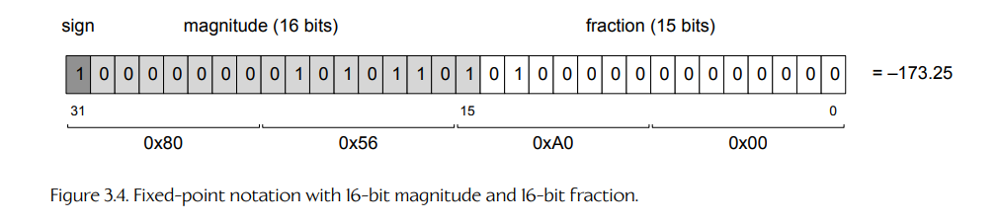

**Figure 3.4.** 使用 16 位数值部分和 16 位小数部分的定点表示法。

定点表示法的问题在于，它同时限制了可表示数值大小的范围，以及我们在小数部分能够获得的精度。考虑一个 32 位定点值，其中 16 位表示数值大小，15 位表示小数部分，并包含 1 个符号位。该格式只能表示最高 ±65,535 的数值大小，这并不是特别大。为了解决这个问题，我们采用浮点表示法。

#### 3.3.1.4 浮点表示法

在 floating-point notation（浮点表示法）中，小数点的位置是任意的，并借助指数来指定。一个浮点数被分成三个部分：mantissa（尾数），其中包含小数点两侧与数值相关的数字；exponent（指数），用于表示小数点位于这一串数字中的哪个位置；以及 sign bit（符号位），它当然表示该值是正数还是负数。在内存中布置这三个组成部分有许多不同方式，但最常见的标准是 IEEE-754。该标准规定，一个 32 位浮点数使用最高有效位表示符号，接下来 8 位表示指数，最后 23 位表示尾数。

数值 `v` 由符号位 `s`、指数 `e` 和尾数 `m` 表示：

```text
v = s × 2^(e−127) × (1 + m)
```

符号位 `s` 的取值为 +1 或 -1。指数 `e` 带有 127 的偏置，这样负指数就可以很容易地表示。尾数以一个隐式的 1 开头，但这个 1 实际上并不会存储在内存中，其余位则被解释为 2 的负幂。因此，实际表示的值是 `1 + m`，其中 `m` 是存储在尾数中的小数值。

例如，图 3.5 所示的位模式表示数值 0.15625，因为 `s = 0`（表示正数），`e = 0b01111100 = 124`，并且 `m = 0b0100... = 0 × 2⁻¹ + 1 × 2⁻² = 1/4`。

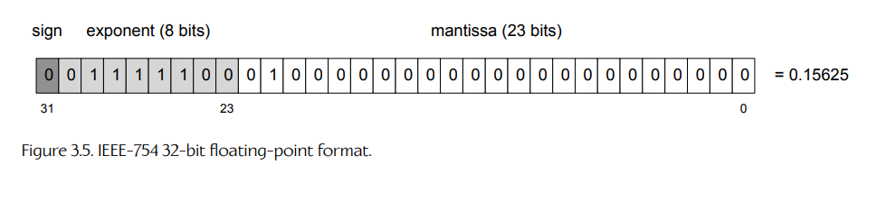

**Figure 3.5.** IEEE-754 32 位浮点格式。

因此：

```text
v = s × 2^(e−127) × (1 + m)
  = (+1) × 2^(124−127) × (1 + 1/4)
  = 2^−3 × 5/4
  = 1/8 × 5/4
  = 0.125 × 1.25 = 0.15625
```

**数值大小与精度之间的权衡。**

浮点数的 precision（精度）会随着 magnitude（数值大小）的减小而增加，反之亦然。这是因为尾数中的位数是固定的，而这些位必须在数字的整数部分和小数部分之间共享。如果大量位被用于表示较大的数值大小，那么可用于提供小数精度的位就会变少。在物理学中，术语 significant digits 通常用于描述这一概念。

为了理解数值大小与精度之间的权衡，我们来看一下最大的可能浮点值 `FLT_MAX ≈ 3.403 × 10³⁸`，它在 32 位 IEEE 浮点格式中的表示为 `0x7F7FFFFF`。我们来分解一下：

- 我们可以用 23 位尾数表示的最大绝对值是十六进制的 `0x00FFFFFF`，也就是连续 24 个二进制 1——这是尾数中的 23 个 1，再加上那个隐式的前导 1。
- 在 IEEE-754 格式中，指数 255 具有特殊含义——它用于表示 not-a-number（NaN）和 infinity 等值——因此不能用于普通数字。所以最大的 8 位指数实际上是 254，减去隐式偏置 127 后，它对应的指数是 127。

因此，`FLT_MAX` 是：

```text
0x00FFFFFF × 2^127 = 0xFFFFFF00000000000000000000000000
```

换句话说，我们的 24 个二进制 1 被向上移动了 127 个 bit 位置，在尾数的最低有效位之后留下了 127 − 23 = 104 个二进制零（或者 104/4 = 26 个十六进制零）。这些尾随的零并不对应我们 32 位浮点值中的任何实际位——它们只是由于指数而仿佛从空气中出现了。如果我们从 `FLT_MAX` 中减去一个小数（这里的“小”指任何由少于 26 个十六进制数字组成的数），结果仍然会是 `FLT_MAX`，因为这 26 个最低有效十六进制数字实际上并不存在！

对于数值大小远小于 1 的浮点值，会出现相反的效果。在这种情况下，指数很大但为负，有效数字会向相反方向移动。我们用表示大数值范围的能力换取了高精度。总而言之，浮点数中始终具有相同数量的 significant digits（或者更准确地说，significant bits），而指数可以用来将这些有效位移动到更高或更低的数值范围中。

**次正规值。**

另一个需要注意的细节是，在零和我们能够用目前所描述的浮点表示法表示的最小非零值之间，存在一个有限的间隙。我们能够表示的最小非零数值大小是 `FLT_MIN = 2⁻¹²⁶ ≈ 1.175 × 10⁻³⁸`，其二进制表示为 `0x00800000`（也就是说，指数是 `0x01`，减去偏置后为 -126，尾数除了隐式前导 1 外全为零）。下一个更小的有效值是零，因此在 `-FLT_MIN` 和 `+FLT_MIN` 之间存在一个有限间隙。这突显了这样一个事实：使用浮点表示时，实数数轴是被量化的。（注意，C++ 标准库将 `FLT_MIN` 暴露为更冗长的 `std::numeric_limits<float>::min()`。为了简洁起见，本书将继续使用 `FLT_MIN`。）

零附近的间隙可以通过使用一种称为 denormalized values 的浮点表示扩展来填补，这种值也称为 subnormal values。使用这种扩展时，任何偏置指数为 0 的浮点值都会被解释为一个次正规数。指数被当作 1 而不是 0 来处理，并且通常位于尾数位前面的隐式前导 1 会被改为 0。其效果是在 `-FLT_MIN` 与 `+FLT_MIN` 之间，用一系列线性排列、间距均匀的次正规值填补空隙。距离零最近的正次正规 `float` 由常量 `FLT_TRUE_MIN` 表示。

使用次正规值的好处是，它在零附近提供了更高的精度。例如，它确保下面两个表达式是等价的，即使 `a` 和 `b` 的值非常接近 `FLT_MIN`：

```cpp
if (a == b) { ... }
if (a - b == 0.0f) { ... }
```

如果没有次正规值，表达式 `a - b` 可能会求值为零，即使 `a != b`。

**机器 epsilon。**

对于特定的浮点表示，machine epsilon 被定义为满足方程 `1 + ε ≠ 1` 的最小浮点值 `ε`。对于 IEEE-754 浮点数而言，其精度为 23 位，`ε` 的值为 `2⁻²³`，约等于 `1.192 × 10⁻⁷`。`ε` 的最高有效位恰好落在数值 1.0 的有效数字范围内，因此向 1.0 添加任何小于 `ε` 的值都不会产生效果。换句话说，当我们试图将总和装入只有 23 位的尾数时，任何由添加小于 `ε` 的值所贡献的新 bit 都会被“截掉”。

**最后一位单位（ULP）。**

考虑两个浮点数，它们在所有方面都相同，唯一的区别是尾数中最低有效位的值不同。这两个值被称为相差一个 unit in the last place（1 ULP）。1 ULP 的实际值会随指数而变化。例如，浮点值 `1.0f` 的无偏指数为零，尾数中所有位都为零（除了隐式前导 1）。在这个指数下，1 ULP 等于机器 epsilon（`2⁻²³`）。如果我们将指数改为 1，得到值 `2.0f`，那么 1 ULP 的值就等于机器 epsilon 的两倍。如果指数为 2，得到值 `4.0f`，那么 1 ULP 的值就是机器 epsilon 的四倍。一般来说，如果一个浮点值的无偏指数为 `x`，那么：

```text
1 ULP = 2^x · ε
```

最后一位单位这个概念说明了浮点数的精度取决于其指数，并且对于量化任何浮点计算中的固有误差非常有用。它也可以用来寻找相对于某个已知值而言，下一个更大的可表示浮点值，或者反过来，下一个更小的可表示浮点值。这又可以用于将大于等于比较转换为大于比较。从数学上讲，条件 `a ≥ b` 等价于条件 `a + 1 ULP > b`。我们在 Naughty Dog 引擎中使用这个小“技巧”来简化角色对白系统中的一些逻辑。在该系统中，可以使用简单比较来为角色选择不同的对白行。我们并不支持所有可能的比较运算符，而只支持大于和小于检查；通过对被比较的值加上或减去 1 ULP，就可以处理大于等于和小于等于。

**浮点精度对软件的影响。**

有限精度和机器 epsilon 的概念会对游戏软件产生实际影响。例如，假设我们使用一个浮点变量来跟踪以秒为单位的绝对游戏时间。在时钟变量的数值大小变得过大，以至于向其添加 1/30 秒不再改变其值之前，我们的游戏能运行多久？答案是 12.14 天，也就是 2²⁰ 秒。这比大多数游戏会连续运行的时间都长，因此如果我们的游戏只关心精确到 1/30 秒，那么使用一个以秒为单位的 32 位浮点时钟或许可以应付。但如果我们需要亚帧精度（例如，如果我们想以毫秒为单位测量经过时间），那么使用浮点时钟很快就会遇到问题。显然，理解浮点格式的限制非常重要，这样我们才能预测潜在问题，并在必要时采取措施避免它们。

**IEEE 浮点位技巧。**

参见 [10, Section 2.1]，其中介绍了一些非常有用的 IEEE 浮点“位技巧”，可以让某些浮点计算变得极快。

### 3.3.2 基本数据类型

C 和 C++ 提供了许多基本数据类型。C 和 C++ 标准对这些数据类型的相对大小和有符号性提供了指导，但每个编译器都可以稍微不同地定义这些类型，以便在目标硬件上获得最大性能。

- `char`。`char` 通常为 8 位，一般足以保存一个 ASCII 或 UTF-8 字符（见 6.4.4.1 节）。一些编译器将 `char` 定义为有符号类型，而另一些编译器默认使用无符号 `char`。
- `int`、`short`、`long`。`int` 应该保存一个有符号整数值，其大小是目标平台上最高效的大小；在 32 位 CPU 架构（如 Pentium 4 或 Xeon）上，它通常被定义为 32 位宽，而在 64 位架构（如 Intel Core i7）上，它通常为 64 位宽，尽管 `int` 的大小还取决于编译器选项和目标操作系统等其他因素。`short` 应该小于 `int`，并且在许多机器上为 16 位。`long` 至少和 `int` 一样大，并且可以是 32 位或 64 位宽，甚至更宽，这同样取决于 CPU 架构、编译器选项和目标操作系统。
- `float`。在大多数现代编译器上，`float` 是一个 32 位 IEEE-754 浮点值。
- `double`。`double` 是一个双精度（即 64 位）IEEE-754 浮点值。
- `bool`。`bool` 是一个 true/false 值。`bool` 的大小在不同编译器和硬件架构之间差异很大。它从不会被实现为单个位，有些编译器将其定义为 8 位，而另一些则使用完整的 32 位。

**可移植的定长类型。**

C 和 C++ 中内置的基本数据类型被设计为可移植的，因此并不指定确切大小。然而，在许多软件工程工作中，包括游戏引擎编程，经常需要准确知道某个变量有多宽。

在 C++11 之前，程序员不得不依赖编译器提供的不可移植定长类型。例如，Visual Studio C/C++ 编译器定义了以下扩展关键字，用于声明具有明确位宽的变量：`__int8`、`__int16`、`__int32` 和 `__int64`。大多数其他编译器也有自己的“定长”数据类型，语义相似但语法略有不同。

由于编译器之间存在这些差异，大多数游戏引擎都会通过定义自己的自定义定长类型来实现源代码可移植性。例如，在 Naughty Dog，我们使用以下定长类型：

- `F32` 是一个 32 位 IEEE-754 浮点值。
- `U8`、`I8`、`U16`、`I16`、`U32`、`I32`、`U64` 和 `I64` 分别是无符号和有符号的 8 位、16 位、32 位和 64 位整数。

**`<cstdint>`。**

C++11 标准库引入了一组标准化的定长整数类型。它们声明在 `<cstdint>` 头文件中，包括有符号类型 `std::int8_t`、`std::int16_t`、`std::int32_t` 和 `std::int64_t`，以及无符号类型 `std::uint8_t`、`std::uint16_t`、`std::uint32_t` 和 `std::uint64_t`。这些类型让程序员不必为了实现可移植性而“包装”编译器特定类型。关于这些定长类型的完整列表，见 [121]。

#### 3.3.2.1 多字节值与字节序

宽度大于 8 位（一个字节）的值称为 multibyte quantities（多字节量）。在任何使用 16 位或更宽整数与浮点值的软件项目中，它们都很常见。例如，整数值 4,660 = `0x1234` 由两个字节 `0x12` 和 `0x34` 表示。我们称 `0x12` 为最高有效字节，`0x34` 为最低有效字节。在一个 32 位值中，例如 `0xABCD1234`，最高有效字节是 `0xAB`，最低有效字节是 `0x34`。相同概念同样适用于 64 位整数，以及 32 位和 64 位浮点值。

多字节整数可以用两种方式之一存储到内存中，不同微处理器可能会选择不同的存储方法（见图 3.6）。

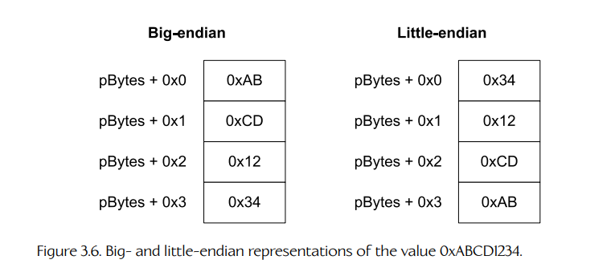

**Figure 3.6.** 数值 0xABCD1234 的大端与小端表示。

- Little-endian。如果一个微处理器将多字节值的最低有效字节存储在比最高有效字节更低的内存地址处，我们就说该处理器是 little-endian。在小端机器上，数字 `0xABCD1234` 会在内存中用连续字节 `0x34`、`0x12`、`0xCD`、`0xAB` 存储。
- Big-endian。如果一个微处理器将多字节值的最高有效字节存储在比最低有效字节更低的内存地址处，我们就说该处理器是 big-endian。在大端机器上，数字 `0xABCD1234` 会在内存中用字节 `0xAB`、`0xCD`、`0x12`、`0x34` 存储。

大多数程序员并不需要太多考虑字节序问题。然而，当你是游戏程序员时，字节序可能会成为一个令人头疼的问题。这是因为游戏通常是在运行 Intel Pentium 处理器的 Windows 或 Linux 机器上开发的（这是小端），但运行在 Wii、Xbox 360 或 PlayStation 3 这样的主机上——这三者都使用某种 PowerPC 处理器变体（它可以配置为任一字节序，但默认是大端）。现在想象一下，当你在 Intel 处理器上生成一个供游戏引擎使用的数据文件，然后试图在运行于 PowerPC 处理器上的引擎中加载该数据文件时会发生什么。你写入数据文件中的任何多字节值都会以小端格式存储。但当游戏引擎读取该文件时，它期望所有数据都是大端格式。结果是什么？你会写入 `0xABCD1234`，但读到的却是 `0x3412CDAB`，这显然不是你想要的！

这个问题至少有两种解决方案。

1. 你可以将所有数据文件都写成文本，并将所有多字节数字存储为十进制或十六进制数字序列，每个数字字符占一个字节。这会低效地使用磁盘空间，但它可以工作。
2. 你可以让工具在将数据写入二进制数据文件之前对数据进行 endian-swap。实际上，即使工具运行在使用相反字节序的机器上，你也要确保文件使用目标微处理器（游戏主机）的字节序。

**整数字节序交换。**

对整数进行 endian-swapping 在概念上并不困难。你只需从值的最高有效字节开始，将其与最低有效字节交换；然后继续这一过程，直到到达该值的中点。例如，`0xA7891023` 会变成 `0x231089A7`。

唯一棘手的地方在于知道应该交换哪些字节。假设你正在将一个 C `struct` 或 C++ `class` 的内容从内存写入文件。为了正确地对这些数据进行字节序交换，你需要跟踪该 `struct` 中每个数据成员的位置和大小，并根据其大小分别进行适当交换。例如，结构：

```cpp
struct Example
{
    U32     m_a;
    U16     m_b;
    U32     m_c;
};
```

可能会被写入数据文件如下：

```cpp
void writeExampleStruct(Example& ex, Stream& stream)
{
    stream.writeU32(swapU32(ex.m_a));
    stream.writeU16(swapU16(ex.m_b));
    stream.writeU32(swapU32(ex.m_c));
}
```

交换函数可能定义如下：

```cpp
inline U16 swapU16(U16 value)
{
    return ((value & 0x00FF) << 8)
         | ((value & 0xFF00) >> 8);
}

inline U32 swapU32(U32 value)
{
    return ((value & 0x000000FF) << 24)
         | ((value & 0x0000FF00) << 8)
         | ((value & 0x00FF0000) >> 8)
         | ((value & 0xFF000000) >> 24);
}
```

你不能简单地将 `Example` 对象强制转换为字节数组，然后用一个通用函数盲目交换字节。我们需要同时知道要交换哪些数据成员，以及每个成员有多宽，并且每个数据成员都必须单独交换。

一些编译器提供了内置的 endian-swapping 宏，让你不必自己编写。例如，gcc 提供了一组名为 `__builtin_bswapXX()` 的宏，用于执行 16 位、32 位和 64 位 endian swap。不过，这类编译器特定设施当然是不可移植的。

**浮点数字节序交换。**

正如我们已经看到的，IEEE-754 浮点值具有详细的内部结构，其中包含尾数位、指数位和符号位。不过，你可以像交换整数一样对它进行 endian-swap，因为字节就是字节。你只需将 `float` 的位模式重新解释为 `std::int32_t`，执行字节序交换操作，然后再将结果重新解释为 `float`。

你可以使用 C++ 的 `reinterpret_cast` 运算符在指向 `float` 的指针上将浮点数重新解释为整数，然后解引用类型转换后的指针；这称为 type punning。但类型双关可能导致在启用严格别名时出现优化 bug。（关于这一问题的优秀说明，见 [122]。）这类优化 bug 属于一个更大的问题类别，称为 undefined behavior（UB，未定义行为）。关于 UB 以及如何避免它，见 [123]。

你有时会看到有人使用 `union` 来尝试以安全方式进行类型双关：

```cpp
union U32F32
{
    U32     m_asU32;
    F32     m_asF32;
};

inline F32 swapF32(F32 value)
{
    U32F32 u;
    u.m_asF32 = value;

    // endian-swap as integer
    u.m_asU32 = swapU32(u.m_asU32);

    return u.m_asF32;
}
```

然而，即使基于 `union` 的方法也无法免受与 UB 相关的优化 bug 影响。根据 C++ 标准，唯一可靠的、不会触犯 UB 的类型双关方式，是将数据 `memcpy` 到一个全新的、数据类型不同于原始数据的内存地址中：

```cpp
inline F32 swapF32(F32 value)
{
    // type pun via memcpy
    U32 u;
    memcpy(&u, &value, sizeof(U32));

    // endian-swap as integer
    u = swapU32(u);

    // type pun via memcpy
    F32 result;
    memcpy(&result, &u, sizeof(F32));

    return result;
}
```

C++ 编译器中的优化器“足够聪明”，能够看出你只是在进行复制以便用一种新方式重新解释数据，因此它通常可以完全消除对 `memcpy` 的调用。从 C++20 开始，你也可以使用模板函数 `std::bit_cast` [124] 来安全地执行类型双关。

### 3.3.3 千字节与 Kibibytes

你可能已经使用过 kilobytes（kB）和 megabytes（MB）这样的 metric（SI）单位来描述内存数量。然而，用这些单位来描述以 2 的幂为单位度量的内存数量并不严格正确。当计算机程序员说一个 “kilobyte” 时，他们通常指的是 1024 字节。但 SI 单位将前缀 “kilo” 定义为 10³，即 1000，而不是 1024。

为了解决这种歧义，国际电工委员会（International Electrotechnical Commission，IEC）在 1998 年建立了一套新的、类似 SI 的前缀，用于计算机科学。这些前缀以 2 的幂而不是 10 的幂来定义，使计算机工程师能够精确且方便地指定 2 的幂数量。在这个新系统中，我们不说 kilobyte（1000 字节），而说 kibibyte（1024 字节），缩写为 KiB。类似地，不说 megabyte（1,000,000 字节），而说 mebibyte（1024 × 1024 = 1,048,576 字节），缩写为 MiB。表 3.1 总结了 SI 和 IEC 系统中最常用字节数量单位的大小、前缀和名称。本书将始终使用 IEC 单位。

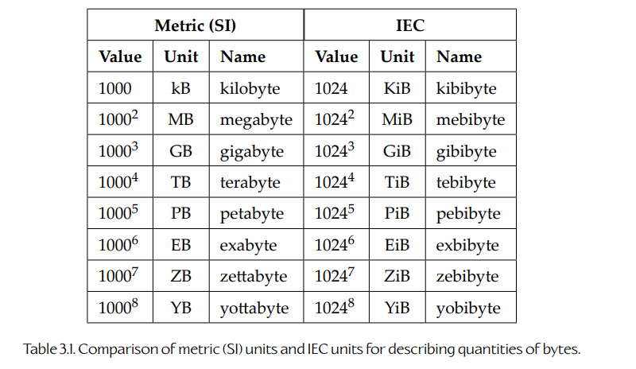

**Table 3.1.** 用于描述字节数量的公制（SI）单位与 IEC 单位对比。

### 3.3.4 声明、定义与链接

#### 3.3.4.1 再谈翻译单元

正如我们在第 2 章中看到的，一个 C 或 C++ 程序由 translation units（翻译单元）组成。编译器一次翻译一个 `.cpp` 文件，并为每个 `.cpp` 文件生成一个称为 object file（目标文件）的输出文件（`.o` 或 `.obj`）。`.cpp` 文件是编译器操作的最小翻译单位；因此得名“翻译单元”。一个目标文件不仅包含该 `.cpp` 文件中定义的所有函数的编译后机器码，也包含它的所有 global 和 static 变量。此外，目标文件可能包含 unresolved references，即指向其他 `.cpp` 文件中定义的函数和全局变量的未解析引用。

编译器一次只处理一个翻译单元，因此，每当它遇到对外部全局变量或函数的引用时，它都必须“凭信任”假设相关实体确实存在，如图 3.7 所示。链接器的工作就是将所有目标文件组合成最终的可执行映像。在这个过程中，链接器会读取所有目标文件，并尝试解析它们之间所有未解析的交叉引用。如果成功，就会生成一个可执行映像，其中包含所有函数、全局变量和静态变量，并且所有跨翻译单元引用都被正确解析。如图 3.8 所示。

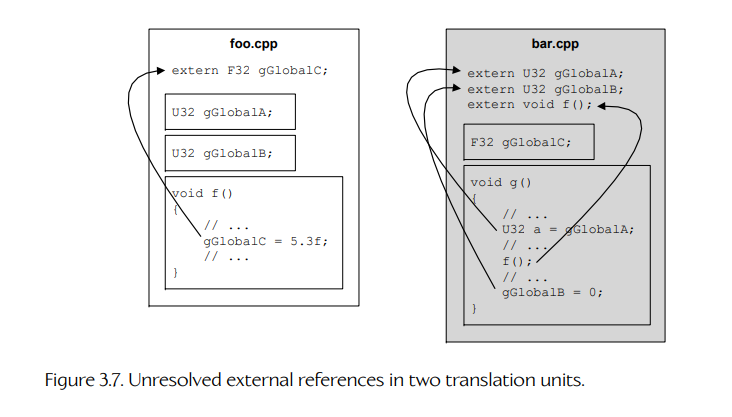

**Figure 3.7.** 两个翻译单元中的未解析外部引用。

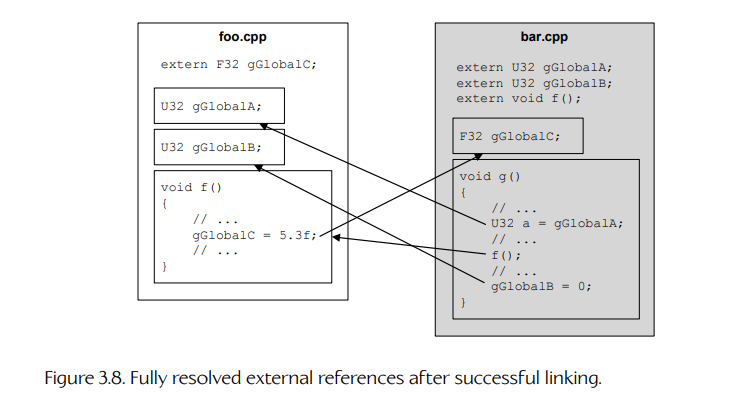

**Figure 3.8.** 成功链接后完全解析的外部引用。

链接器的主要工作是解析外部引用，在这一职责下，它只能生成两类错误：

1. 某个 `extern` 引用的目标可能找不到，在这种情况下，链接器会生成 “unresolved symbol” 错误。
2. 链接器可能会发现多个具有相同名称的变量或函数，在这种情况下，它会生成 “multiply defined symbol” 错误。

这两种情况如图 3.9 所示。

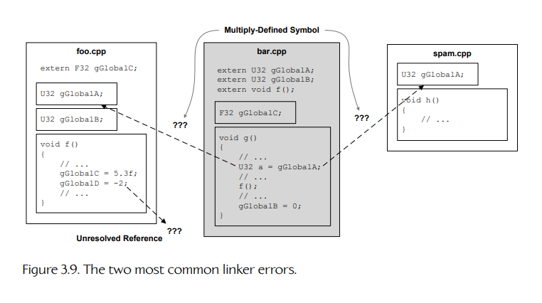

**Figure 3.9.** 两种最常见的链接器错误。

#### 3.3.4.2 声明与定义

在 C 和 C++ 语言中，变量和函数必须先声明和定义，之后才能使用。理解 C 和 C++ 中声明与定义之间的区别非常重要。

- declaration（声明）是对数据对象或函数的描述。它向编译器提供该实体的名称及其数据类型或函数签名（即返回类型和参数类型）。
- definition（定义）则描述程序中一块唯一的内存区域。这块内存可能包含一个变量、一个 `struct` 或 `class` 的实例，或者一个函数的机器码。

换句话说，声明是对一个实体的引用，而定义是实体本身。定义总是一个声明，但反过来并不总是成立——在 C 和 C++ 中可以写出不是定义的纯声明。

函数通过在函数签名之后立即写出函数体来定义，函数体包含在花括号中：

*foo.cpp*

```cpp
// definition of the max() function
int max(int a, int b)
{
    return (a > b) ? a : b;
}

// definition of the min() function
int min(int a, int b)
{
    return (a <= b) ? a : b;
}
```

可以为函数提供纯声明，使其能够在其他翻译单元中使用（或稍后在同一翻译单元中使用）。其做法是写出函数签名，后面跟一个分号，并可以选择加上 `extern` 前缀：

*foo.h*

```cpp
extern int max(int a, int b); // a function declaration

int min(int a, int b); // also a declaration (the extern
                       // is optional/assumed)
```

变量以及类和结构体的实例通过写出数据类型，随后写出变量或实例名称，并可选地在方括号中加入数组说明符来定义：

*foo.cpp*

```cpp
// All of these are variable definitions:
U32 gGlobalInteger = 5;
F32 gGlobalFloatArray[16];
MyClass gGlobalInstance;
```

在一个翻译单元中定义的全局变量，可以选择通过 `extern` 关键字声明出来，以便在其他翻译单元中使用：

*foo.h*

```cpp
// These are all pure declarations:
extern U32 gGlobalInteger;
extern F32 gGlobalFloatArray[16];
extern MyClass gGlobalInstance;
```

**声明和定义的多重性。**

毫不奇怪，C/C++ 程序中的任何特定数据对象或函数都可以有多个相同的声明，但只能有一个定义。如果两个或更多相同定义出现在同一个翻译单元中，编译器会发现多个实体具有相同名称并报告错误。如果两个或更多相同定义出现在不同翻译单元中，编译器无法识别这个问题，因为它一次只处理一个翻译单元。但在这种情况下，当链接器尝试解析交叉引用时，它会给出 “multiply defined symbol” 错误。

**头文件中的定义与内联。**

通常，把定义放在头文件中是危险的。原因应该很明显：如果一个包含定义的头文件被 `#included` 到多个 `.cpp` 文件中，就几乎一定会生成 “multiply defined symbol” 链接器错误。

内联函数定义是这一规则的例外，因为每次调用 inline 函数都会产生该函数机器码的一份全新副本，并直接嵌入调用函数中。事实上，如果 inline 函数定义要在多个翻译单元中使用，就必须放在头文件中。注意，仅仅在 `.h` 文件中给函数声明加上 `inline` 关键字，然后把该函数体放在 `.cpp` 文件中是不够的。编译器必须能够“看到”函数体，才能将其内联。例如：

*foo.h*

```cpp
// This function definition will be inlined properly.
inline int max(int a, int b)
{
    return (a > b) ? a : b;
}

// This declaration cannot be inlined because the
// compiler cannot "see" the body of the function.
inline int min(int a, int b);
```

*foo.cpp*

```cpp
// The body of min() is effectively "hidden" from the
// compiler, so it can ONLY be inlined within foo.cpp.
int min(int a, int b)
{
    return (a <= b) ? a : b;
}
```

`inline` 关键字实际上只是给编译器的一个提示。编译器会对每个 inline 函数进行成本/收益分析，权衡该函数代码大小与内联可能带来的性能收益，最终由编译器决定该函数是否真的会被内联。一些编译器提供类似 `__forceinline` 的语法，允许程序员绕过编译器的成本/收益分析，直接控制函数内联。

**模板与头文件。**

模板类或模板函数的定义必须在所有使用它的翻译单元中对编译器可见。因此，如果你希望一个模板能够在多个翻译单元中使用，就必须将该模板放入头文件中（正如 inline 函数定义必须这样做一样）。因此，模板的声明和定义是不可分割的：你不能在头文件中声明模板函数或模板类，却将它们的定义“隐藏”在 `.cpp` 文件中，因为这样会使这些定义在任何包含该头文件的其他 `.cpp` 文件中不可见。

#### 3.3.4.3 链接

C 和 C++ 中的每一个定义都有一个称为 linkage（链接属性）的属性。具有 external linkage 的定义对其所在翻译单元之外的其他翻译单元可见，并且可以被它们引用。具有 internal linkage 的定义只能在其出现的翻译单元内部被“看到”，不能被其他翻译单元引用。我们称这个属性为 linkage，是因为它决定了链接器是否被允许对相关实体进行交叉引用。因此，从某种意义上说，linkage 是翻译单元层面的 `public:` 和 `private:` 关键字等价物，它们类似于 C++ 类定义中的访问控制。

默认情况下，定义具有外部链接。`static` 关键字用于将定义的链接属性改为内部链接。注意，两个或更多相同的 `static` 定义如果出现在两个或更多不同的 `.cpp` 文件中，链接器会认为它们是不同实体（就像它们被赋予了不同名称一样），因此不会生成 “multiply defined symbol” 错误。下面是一些示例：

*foo.cpp*

```cpp
// This variable can be used by other .cpp files
// (external linkage).
U32 gExternalVariable;

// This variable is only usable within foo.cpp (internal
// linkage).
static U32 gInternalVariable;

// This function can be called from other .cpp files
// (external linkage).
void externalFunction()
{
    // ...
}

// This function can only be called from within foo.cpp
// (internal linkage).
static void internalFunction()
{
    // ...
}
```

*bar.cpp*

```cpp
// This declaration grants access to foo.cpp's variable.
extern U32 gExternalVariable;

// This 'gInternalVariable' is distinct from the one
// defined in foo.cpp -- no error. We could just as
// well have named it gInternalVariableForBarCpp -- the
// net effect is the same.
static U32 gInternalVariable;

// This function is distinct from foo.cpp's
// version -- no error. It acts as if we had named it
// internalFunctionForBarCpp().
static void internalFunction()
{
    // ...
}

// ERROR -- multiply defined symbol!
void externalFunction()
{
    // ...
}
```

从技术上讲，声明根本没有链接属性，因为它们不会在可执行映像中分配任何存储空间；因此，不存在链接器是否应被允许交叉引用该存储空间的问题。声明只是对其他地方定义的实体的引用。然而，有时为了方便，也会说声明具有内部链接，因为声明只适用于它出现的翻译单元。如果我们放宽术语，在这种意义上，声明总是具有内部链接——没有办法跨多个 `.cpp` 文件交叉引用单个声明。（如果我们将声明放入头文件中，那么多个 `.cpp` 文件都可以“看到”该声明，但实际上每个文件都会获得该声明的一份不同副本，并且每个副本在自己的翻译单元内都具有内部链接。）

这也引出了 inline 函数定义之所以允许出现在头文件中的真正原因：因为 inline 函数默认具有 internal linkage，就像它们被声明为 `static` 一样。如果多个 `.cpp` 文件 `#include` 了一个包含 inline 函数定义的头文件，那么每个翻译单元都会获得该函数体的一份私有副本，并且不会生成 “multiply defined symbol” 错误。链接器会将每一份副本视为不同实体。关于 linkage 以及 C++ 程序逻辑设计与物理设计之间区别的更多内容，可以参见 [33]。

### 3.3.5 C/C++ 程序的内存布局

用 C 或 C++ 编写的程序会将数据存储在内存中的若干不同位置。为了理解存储是如何分配的，以及 C/C++ 变量的各种类型如何工作，我们需要理解 C/C++ 程序的内存布局。

#### 3.3.5.1 可执行映像

当一个 C/C++ 程序被构建时，链接器会创建一个 executable file（可执行文件）。大多数类 UNIX 操作系统，包括许多游戏主机，都使用一种流行的可执行文件格式，称为 executable and linking format（ELF）。因此，这些系统上的可执行文件通常具有 `.elf` 扩展名。Windows 可执行格式类似于 ELF 格式；Windows 下的可执行文件具有 `.exe` 扩展名。无论格式如何，可执行文件总是包含程序运行时在内存中存在形式的一个 partial image（部分映像）。我说它是“部分”映像，是因为程序通常还会在运行时分配内存，除了可执行映像中已经布局好的内存之外。

可执行映像被划分为称为 segments 或 sections 的连续块。每个操作系统对这些内容的布局方式都略有不同，即使在同一个操作系统上，不同可执行文件之间的布局也可能略有差异。不过，一个映像通常至少由以下四个段组成：

1. **Text segment**。有时也称为 **code segment**，这个块包含程序所定义的所有函数的可执行机器码。

2. **Data segment**。该段包含所有已经初始化的全局变量和静态变量。每个全局变量所需的内存都会按照程序运行时的样子精确布局，并填入正确的初始值。因此，当可执行文件被加载到内存中时，已经初始化的全局变量和静态变量就已经准备就绪。

3. **BSS segment**。`BSS` 是一个较旧的名称，代表 “block started by symbol”。该段包含程序所定义的所有未初始化的全局变量和静态变量。C 和 C++ 语言明确规定，任何未初始化的全局变量或静态变量的初始值都是零。但是，链接器并不会在 BSS 段中存储一个可能非常庞大的零值块，而是只存储一个计数值，用来说明需要多少个零字节才能表示该段中所有未初始化的全局变量和静态变量。当可执行文件被加载到内存中时，操作系统会为 BSS 段保留所请求数量的字节，并在调用程序入口点（例如 `main()` 或 `WinMain()`）之前用零填充它。

4. **Read-only data segment**。有时也称为 **rodata segment**，该段包含程序定义的所有只读（常量）全局数据。例如，所有浮点常量（如 `const float kPi = 3.141592f;`）以及所有使用 `const` 关键字声明的全局对象实例（如 `const Foo gReadOnlyFoo;`）都位于该段中。注意，整型常量（如 `const int kMaxMonsters = 255;`）经常被编译器作为 manifest constants 使用，也就是说，它们会在使用处被直接插入到机器码中。这类常量占用的是 text segment 中的存储空间，而不会出现在 read-only data segment 中。

全局变量（即在任何函数或类声明之外、位于文件作用域中定义的变量）会根据它们是否已经初始化，被存储在 data 段或 BSS 段中。下面这个全局变量会被存储在 data 段中，因为它已经被初始化：

*foo.cpp*

```cpp
F32 gInitializedGlobal = -2.0f;
```

而下面这个全局变量将由操作系统根据 BSS 段中给出的说明来分配并初始化为零，因为程序员并没有对它进行初始化：

*foo.cpp*

```cpp
F32 gUninitializedGlobal;
```

我们已经看到，`static` 关键字可以用于赋予一个全局变量或函数定义 internal linkage，这意味着它会从其他翻译单元中“隐藏”起来。`static` 关键字也可以用于在函数内部声明一个全局变量。函数静态变量在词法上作用域限定于声明它的函数中（也就是说，该变量名只能在这个函数内部被“看到”）。它会在第一次调用该函数时初始化，而不是像文件作用域静态变量那样在 `main()` 被调用之前初始化。不过，从可执行映像中的内存布局来看，函数静态变量的行为与文件静态全局变量完全一样——它会根据是否已经初始化，被存储在 data 段或 BSS 段中。

```cpp
void readHitchhikersGuide(U32 book)
{
    static U32 sBooksInTheTrilogy = 5; // data segment
    static U32 sBooksRead;             // BSS segment
    // ...
}
```

#### 3.3.5.2 程序栈

当一个可执行程序被加载到内存中并运行时，操作系统会为 **program stack**（程序栈）保留一块内存区域。每当调用一个函数时，一块连续的栈内存区域就会被压入栈中——我们把这块内存称为 **stack frame**（栈帧）。如果函数 `a()` 调用另一个函数 `b()`，那么 `b()` 的新栈帧会被压到 `a()` 的栈帧之上。当 `b()` 返回时，它的栈帧会被弹出，执行会从 `a()` 中断的位置继续。

一个栈帧存储三类数据：

1. 它存储调用函数的 **return address**（返回地址），这样当被调用函数返回时，执行可以在调用函数中继续。

2. 所有相关 **CPU registers**（CPU 寄存器）的内容都会被保存在栈帧中。这允许新函数以任何它认为合适的方式使用这些寄存器，而不必担心覆盖调用函数所需要的数据。当返回到调用函数时，寄存器状态会被恢复，从而使调用函数的执行能够继续。被调用函数的返回值（如果有）通常会被留在某个特定寄存器中，以便调用函数可以取回它，但其他寄存器会恢复为原来的值。

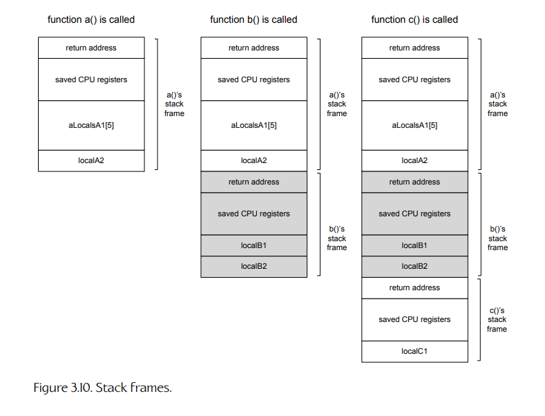

**Figure 3.10.** 栈帧。

3. 栈帧还包含函数声明的所有 **local variables**（局部变量）；这些变量也称为 **automatic variables**（自动变量）。这允许每一次不同的函数调用都维护其自己的每个局部变量的私有副本，即使函数递归调用自身也是如此。（在实践中，一些局部变量实际上会被分配到 CPU 寄存器中，而不是存储在栈帧中；但在大多数情况下，这些变量的行为就像它们被分配在函数栈帧中一样。）

压入和弹出栈帧通常通过调整 CPU 中一个称为 **stack pointer**（栈指针）的寄存器的值来实现。图 3.10 展示了执行下面这些函数时会发生什么：

```cpp
void c()
{
    U32 localC1;
    // ...
}

F32 b()
{
    F32 localB1;
    I32 localB2;

    // ...

    c();

    // ...

    return localB1;
}

void a()
{
    U32 aLocalsA1[5];

    // ...

    F32 localA2 = b();

    // ...
}
```

当一个包含自动变量的函数返回时，它的栈帧会被丢弃，并且该函数中的所有自动变量都应该被视为不再存在。从技术上讲，这些变量占用的内存仍然存在于已经被丢弃的栈帧中——但这块内存很可能会在另一个函数被调用后立即被覆盖。一个常见错误是返回局部变量的地址，例如：

```cpp
U32* getMeaningOfLife()
{
    U32 anInteger = 42;
    return &anInteger;
}
```

如果你立即使用返回的指针，并且在此期间没有调用任何其他函数，也许可以侥幸成功。但更多情况下，这类代码会崩溃——有时还会以难以调试的方式崩溃。

#### 3.3.5.3 动态分配堆

到目前为止，我们已经看到，程序的数据可以作为全局变量、静态变量或局部变量存储。全局变量和静态变量会根据可执行文件的 data 段和 BSS 段定义，被分配在可执行映像内部。局部变量则被分配在程序栈上。这两类存储都是 **statically defined**（静态定义）的，也就是说，内存的大小和布局在程序编译和链接时已经是已知的。然而，程序的内存需求通常在编译期并不完全可知。程序通常需要 **dynamically**（动态地）分配额外内存。

为了允许动态分配，操作系统会为每个正在运行的进程维护一块内存。可以通过调用 `malloc()`（或 Windows 下类似 `HeapAlloc()` 的操作系统特定函数）从这块内存中分配内存，并在未来某个时候通过调用 `free()`（或类似 `HeapFree()` 的操作系统特定函数）将内存归还给进程以供复用。这块内存称为 **heap memory**（堆内存），也称为 **free store**（自由存储区）。当我们动态分配内存时，有时会说这块内存位于 **the heap**（堆）上。

在 C++ 中，全局 `new` 和 `delete` 运算符用于在自由存储区中分配和释放内存。不过需要注意的是，单个类可能会重载这些运算符，以自定义方式分配内存；甚至全局 `new` 和 `delete` 运算符本身也可以被重载。因此，不能简单地假设 `new` 总是从全局堆中分配内存。

我们将在第 7 章中更深入地讨论动态内存分配。更多信息参见 [125]。

### 3.3.6 成员变量

C `structs` 和 C++ `classes` 允许变量被组织成逻辑单元。需要记住的一点是，`class` 或 `struct` 的 **declaration**（声明）并不会分配任何内存。它只是对数据布局的一种描述——就像一个 cookie cutter（饼干模具），可以在之后用来压出该 `struct` 或 `class` 的实例。例如：

```cpp
struct Foo // struct declaration
{
    U32  mUnsignedValue;
    F32  mFloatValue;
    bool mBooleanValue;
};
```

一旦一个 `struct` 或 `class` 被声明，它就可以像基本数据类型一样，以任何方式被分配（定义）；例如：

- 作为自动变量，分配在程序栈上：

```cpp
void someFunction()
{
    Foo localFoo;
    // ...
}
```

- 作为全局变量、文件静态变量或函数静态变量：

```cpp
Foo gFoo;
static Foo sFoo;

void someFunction()
{
    static Foo sLocalFoo;
    // ...
}
```

- 从堆中动态分配。在这种情况下，用于保存数据地址的指针或引用变量本身可以被分配为自动变量、全局变量、静态变量，甚至也可以动态分配：

```cpp
Foo* gpFoo = nullptr; // global pointer to a Foo

void someFunction()
{
    // allocate a Foo instance from the heap
    gpFoo = new Foo;

    // ...

    // allocate another Foo, assign to local pointer
    Foo* pAnotherFoo = new Foo;

    // ...

    // allocate a POINTER to a Foo from the heap
    Foo** ppFoo = new Foo*;
    (*ppFoo) = pAnotherFoo;
}
```

#### 3.3.6.1 类静态成员

正如我们已经看到的，`static` 关键字根据上下文不同具有许多不同含义：

- 当用于文件作用域时，`static` 的意思是：“限制该变量或函数的可见性，使其只能在这个 `.cpp` 文件内部被看到。”
- 当用于函数作用域时，`static` 的意思是：“这个变量是一个全局变量，而不是自动变量，但它只能在这个函数内部被看到。”
- 当用于 `struct` 或 `class` 声明内部时，`static` 的意思是：“这个变量不是普通的每实例成员变量，而是像全局变量一样起作用。”

注意，当 `static` 用于类声明内部时，它并不像在文件作用域中那样控制变量的 **visibility**（可见性）；相反，它区分的是普通的每实例成员变量与行为类似全局变量的每类变量。类静态变量的可见性由类声明中的 `public:`、`protected:` 或 `private:` 关键字决定。类静态变量会自动被包含在声明它的 `class` 或 `struct` 的命名空间中。因此，在该 `class` 或 `struct` 外部使用该变量时，必须使用类名或结构体名来消除歧义，例如 `Foo::sVarName`。

和普通全局变量的 `extern` 声明一样，在类内部声明类静态变量并不会分配内存。类静态变量的内存必须在 `.cpp` 文件中定义。例如：

*foo.h*

```cpp
class Foo
{
public:
    static F32 sClassStatic;  // allocates no
                              // memory!
};
```

*foo.cpp*

```cpp
F32 Foo::sClassStatic = -1.0f; // define memory and
                               // initialize
```

### 3.3.7 内存中的对象布局

能够可视化类和结构体的内存布局是很有用的。这通常相当直接——我们可以简单地为 `struct` 或 `class` 画一个盒子，并用水平线分隔数据成员。下面列出的 `struct Foo` 的一个示例图如图 3.11 所示。

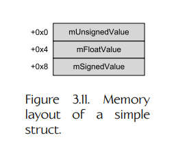

**Figure 3.11.** 一个简单结构体的内存布局。

```cpp
struct Foo
{
    U32 mUnsignedValue;
    F32 mFloatValue;
    I32 mSignedValue;
};
```

数据成员的大小很重要，也应该在图中表示出来。这很容易做到：使用每个数据成员的宽度来表示其 bit 大小——也就是说，一个 32 位整数的宽度大约应该是一个 8 位整数宽度的四倍（见图 3.12）。

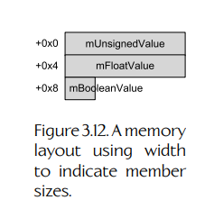

**Figure 3.12.** 使用宽度表示成员大小的内存布局。

```cpp
struct Bar
{
    U32  mUnsignedValue;
    F32  mFloatValue;
    bool mBooleanValue; // diagram assumes this is 8 bits
};
```

#### 3.3.7.1 对齐与填充

当我们开始更仔细地思考 `structs` 和 `classes` 在内存中的布局时，可能会开始疑惑：当较小的数据成员与较大的数据成员交错出现时，会发生什么？例如：

```cpp
struct InefficientPacking
{
    U32   mU1; // 32 bits
    F32   mF2; // 32 bits
    U8    mB3; // 8 bits
    I32   mI4; // 32 bits
    bool  mB5; // 8 bits
    char* mP6; // 32 bits
};
```

你可能会想象，编译器只是尽可能紧密地将数据成员打包到内存中。然而，通常并不是这样。相反，编译器通常会在布局中留下“空洞”，如图 3.13 所示。（有些编译器可以通过类似 `#pragma pack` 的预处理器指令，或通过命令行选项来请求不要留下这些空洞；但默认行为是按照图 3.13 的方式将成员隔开。）

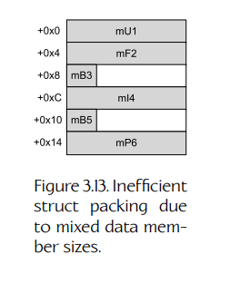

**Figure 3.13.** 由于混合不同大小的数据成员而导致的低效结构体打包。

为什么编译器会留下这些“空洞”？原因在于每种数据类型都有一种 **natural alignment**（自然对齐），为了让 CPU 能够高效地读写内存，必须遵守这种对齐要求。一个数据对象的 **alignment**（对齐）指的是它在内存中的地址是否是其大小的倍数（通常是 2 的幂）：

- 具有 1 字节对齐的对象可以位于任意内存地址。
- 具有 2 字节对齐的对象只能位于偶数地址上（也就是说，地址的最低有效半字节为 `0x0`、`0x2`、`0x4`、`0x8`、`0xA`、`0xC` 或 `0xE`）。
- 具有 4 字节对齐的对象只能位于 4 的倍数地址上（也就是说，地址的最低有效半字节为 `0x0`、`0x4`、`0x8` 或 `0xC`）。
- 具有 16 字节对齐的对象只能位于 16 的倍数地址上（也就是说，地址的最低有效半字节为 `0x0`）。

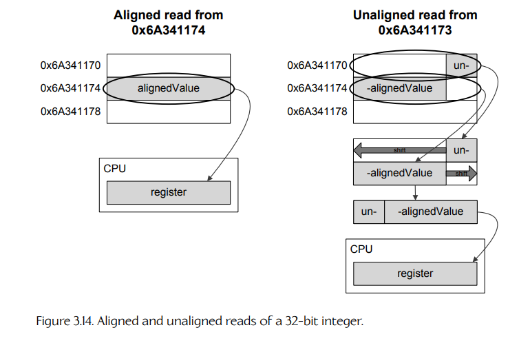

**Figure 3.14.** 对 32 位整数的对齐读取与非对齐读取。

对齐很重要，因为许多现代处理器实际上只能正确读取和写入已经适当对齐的数据块。例如，如果一个程序请求从地址 `0x6A341174` 读取一个 32 位（4 字节）整数，内存控制器会顺利加载数据，因为该地址是 4 字节对齐的（在这个例子中，它的最低有效半字节是 `0x4`）。然而，如果请求从地址 `0x6A341173` 加载一个 32 位整数，内存控制器现在必须读取两个 4 字节块：一个位于 `0x6A341170`，另一个位于 `0x6A341174`。然后它必须屏蔽并移位这两部分 32 位整数，并将它们逻辑 OR 到 CPU 的目标寄存器中。这如图 3.14 所示。

一些微处理器甚至连这一步都做不到。如果你请求读取或写入未对齐数据，可能只会得到垃圾数据。或者你的程序可能会直接崩溃！（PlayStation 2 就是这种不容忍未对齐数据的一个著名例子。）

不同数据类型具有不同的对齐要求。一个很好的经验法则是，数据类型应该对齐到与其宽度（以字节为单位）相等的边界。例如，32 位值通常具有 4 字节对齐要求，16 位值应该 2 字节对齐，而 8 位值可以存储在任意地址上（1 字节对齐）。在支持 SIMD 向量数学的 CPU 上，每个向量寄存器包含四个 32 位浮点数，总计 128 位或 16 字节。正如你可能猜到的，一个包含四个浮点数的 SIMD 向量通常具有 16 字节对齐要求。

这又让我们回到图 3.13 中 `struct InefficientPacking` 布局里的那些“空洞”。当 8 位布尔值这样的小数据类型与 32 位整数或 `floats` 这样的大类型在结构体或类中交错排列时，编译器会引入 padding（填充，也就是空洞），以确保所有内容都正确对齐。在声明数据结构时，考虑对齐和打包是一个好习惯。只要重新排列上面示例中 `struct InefficientPacking` 的成员，就可以消除一部分浪费的填充空间，如下所示并见图 3.15：

```cpp
struct MoreEfficientPacking
{
    U32   mU1; // 32 bits (4-byte aligned)
    F32   mF2; // 32 bits (4-byte aligned)
    I32   mI4; // 32 bits (4-byte aligned)
    char* mP6; // 32 bits (4-byte aligned)
    U8    mB3; // 8 bits  (1-byte aligned)
    bool  mB5; // 8 bits  (1-byte aligned)
};
```

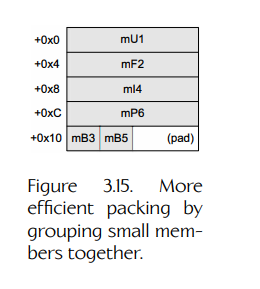

**Figure 3.15.** 通过将小成员分组在一起实现更高效的打包。

你会在图 3.15 中注意到，整个结构体的大小现在是 20 字节，而不是我们可能预期的 18 字节，因为末尾又添加了两个字节的填充。编译器添加这个填充，是为了确保结构体在数组上下文中正确对齐。也就是说，如果定义了一个这种结构体的数组，并且数组的第一个元素是对齐的，那么末尾的填充就能保证所有后续元素也都正确对齐。

一个结构体整体的对齐要求等于其成员中最大的对齐要求。在上面的例子中，最大的成员对齐要求是 4 字节，因此整个结构体应该 4 字节对齐。我通常喜欢在结构体末尾添加显式填充，使浪费的空间可见且明确，例如：

```cpp
struct BestPacking
{
    U32   mU1;     // 32 bits (4-byte aligned)
    F32   mF2;     // 32 bits (4-byte aligned)
    I32   mI4;     // 32 bits (4-byte aligned)
    char* mP6;     // 32 bits (4-byte aligned)
    U8    mB3;     // 8 bits  (1-byte aligned)
    bool  mB5;     // 8 bits  (1-byte aligned)
    U8    _pad[2]; // explicit padding
};
```

#### 3.3.7.2 C++ 类的内存布局

就内存布局而言，有两点让 C++ 类与 C 结构体略有不同：**inheritance**（继承）和 **virtual functions**（虚函数）。

当类 `B` 继承自类 `A` 时，`B` 的数据成员会简单地紧跟在 `A` 的数据成员后面出现在内存中，如图 3.16 所示。每一个新的派生类只是将自己的数据成员追加到末尾，不过对齐要求可能会在类之间引入填充。（多重继承会做出一些奇怪的事情，例如在派生类的内存布局中包含某个单一基类的多份副本。这里不讨论这些细节，因为游戏程序员通常更愿意完全避免多重继承。）

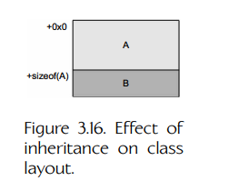

**Figure 3.16.** 继承对类布局的影响。

如果一个类包含或继承了一个或多个 **virtual functions**，那么类布局中会额外添加 4 个字节（如果目标硬件使用 64 位地址，则为 8 个字节），通常位于类布局的最开头。这 4 个或 8 个字节统称为 **virtual table pointer** 或 **vpointer**，因为它们包含一个指向数据结构的指针，该数据结构称为 **virtual function table** 或 **vtable**。某个特定类的 vtable 包含指向该类声明或继承的所有虚函数的指针。每个具体类都有自己的虚表，并且该类的每一个实例都在其 vpointer 中存储一个指向该虚表的指针。

虚函数表是多态的核心，因为它允许代码在不知道自己正在处理哪些具体类的情况下编写。回到常见的 `Shape` 基类示例，假设它有派生类 `Circle`、`Rectangle` 和 `Triangle`。我们设想 `Shape` 定义了一个名为 `Draw()` 的虚函数。所有派生类都会重写这个函数，提供名为 `Circle::Draw()`、`Rectangle::Draw()` 和 `Triangle::Draw()` 的不同实现。任何派生自 `Shape` 的类的虚表都会包含一个 `Draw()` 函数条目，但该条目会根据具体类指向不同的函数实现。`Circle` 的 vtable 会包含一个指向 `Circle::Draw()` 的指针，`Rectangle` 的虚表会指向 `Rectangle::Draw()`，而 `Triangle` 的虚表会指向 `Triangle::Draw()`。给定一个任意指向 `Shape` 的指针 `Shape* pShape`，代码只需解引用 vtable 指针，在 vtable 中查找 `Draw()` 函数的条目，然后调用它。结果是：当 `pShape` 指向 `Circle` 实例时，会调用 `Circle::Draw()`；当 `pShape` 指向 `Rectangle` 时，会调用 `Rectangle::Draw()`；当 `pShape` 指向 `Triangle` 时，会调用 `Triangle::Draw()`。

这些思想由下面的代码片段说明。注意，基类 `Shape` 定义了两个虚函数 `SetId()` 和 `Draw()`，其中后者被声明为 **pure virtual**（纯虚函数）。（这意味着 `Shape` 不提供 `Draw()` 函数的默认实现，派生类如果想被实例化，就必须重写它。）类 `Circle` 派生自 `Shape`，添加了一些数据成员和函数来管理其圆心和半径，并重写了 `Draw()` 函数；这如图 3.17 所示。类 `Triangle` 也派生自 `Shape`。它添加了一个 `Vector3` 对象数组来存储三个顶点，并添加了一些函数来获取和设置各个顶点。类 `Triangle` 按照预期重写了 `Draw()`，并且为了说明目的，它也重写了 `SetId()`。`Triangle` 类生成的内存映像如图 3.18 所示。

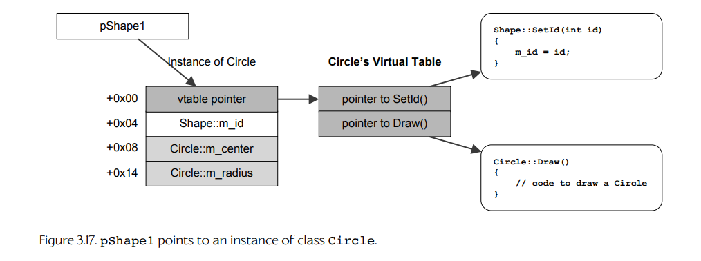

**Figure 3.17.** `pShape1` 指向 `Circle` 类的一个实例。

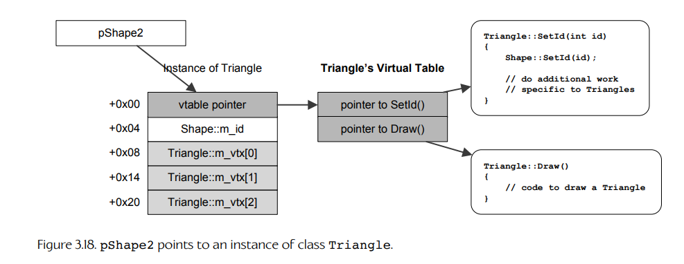

**Figure 3.18.** `pShape2` 指向 `Triangle` 类的一个实例。

```cpp
class Shape
{
public:
    virtual void SetId(int id) { m_id = id; }
    int          GetId() const { return m_id; }

    virtual void Draw() = 0; // pure virtual -- no impl.

private:
    int m_id;
};

class Circle : public Shape
{
public:
    void    SetCenter(const Vector3& c) { m_center = c; }
    Vector3 GetCenter() const { return m_center; }

    void  SetRadius(float r) { m_radius = r; }
    float GetRadius() const { return m_radius; }

    virtual void Draw()
    {
        // code to draw a circle
    }

private:
    Vector3 m_center;
    float   m_radius;
};

class Triangle : public Shape
{
public:
    void    SetVertex(int i, const Vector3& v);
    Vector3 GetVertex(int i) const { return m_vtx[i]; }

    virtual void Draw()
    {
        // code to draw a triangle
    }

    virtual void SetId(int id)
    {
        // call base class' implementation
        Shape::SetId(id);

        // do additional work specific to Triangles...
    }

private:
    Vector3 m_vtx[3];
};

// ------------------------------

int main(int, char**)
{
    Shape* pShape1 = new Circle;
    Shape* pShape2 = new Triangle;

    pShape1->Draw();
    pShape2->Draw();

    // ...
}
```
