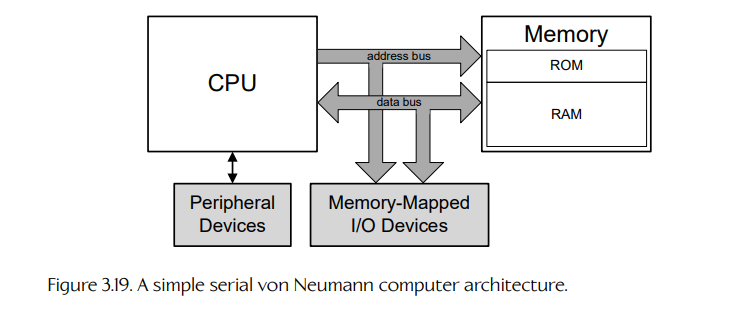
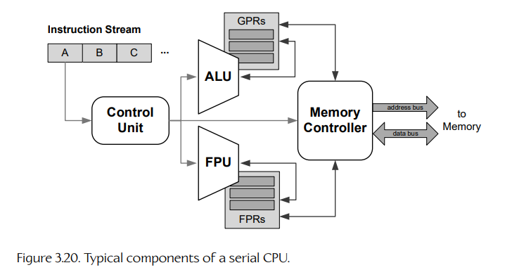
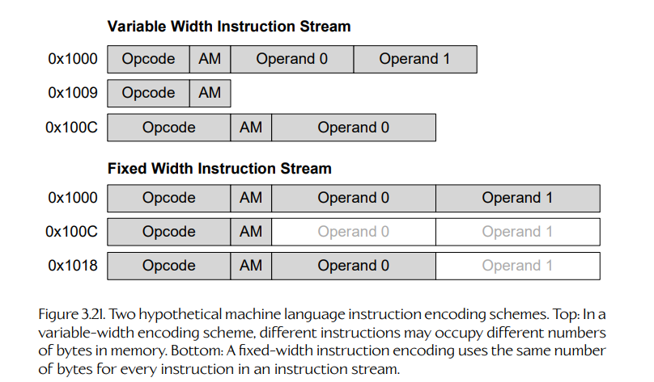

## 3.4 计算机硬件基础

使用 C++、C# 或 Python 这样的高级语言进行编程，是构建软件的一种高效方式。但是，语言层次越高，它就越会把代码所运行硬件的底层细节隐藏起来。要成为真正熟练的程序员，理解目标硬件的体系结构非常重要。这些知识可以帮助你优化代码。它对于并发编程也同样关键——如果程序员希望充分利用现代计算硬件中不断提高的并行能力，就必须理解并发。

### 3.4.1 从昔日更简单的计算机中学习

在接下来的几页中，我们将讨论一种简单、通用 CPU 的设计，而不是深入某一种特定处理器的具体细节。不过，有些读者可能会觉得，如果能通过了解真实 CPU 的细节来支撑我们稍显理论化的讨论，会更容易理解。我自己在青少年时期就是通过给 Apple II 计算机和 Commodore 64 编程来学习计算机工作原理的。这两台机器都使用一种名为 6502 的简单 CPU，它由 MOS Technology Inc. 设计和制造。我也通过阅读并使用 Intel 整个 x86 CPU 系列共同祖先 8086（以及它的近亲 8088）学到了不少东西。由于这些处理器足够简单，它们都非常适合作为学习对象。6502 尤其如此，它是我接触过的最简单的 CPU。一旦你理解了 6502 和 / 或 8086 的工作方式，现代 CPU 就会容易理解得多。

为此，下面列出了一些关于 6502 和 8086 体系结构与编程细节的优秀资源：

- Gary B. Little 所著 *Inside the Apple IIe* 一书的第 1 章和第 2 章 [37]，很好地概述了 6502 汇编语言编程。该书也可以在线获取 [126]。
- [128] 对 x86 指令集架构进行了很好的概述。
- 你也绝对应该看看 Michael Abrash 的 *Graphics Programming Black Book* [1]，其中包含大量关于 8086 汇编编程的有用信息，并且还提供了许多早期游戏时代软件优化和图形编程方面的精彩技巧。



### 3.4.2 计算机的解剖结构

最简单的计算机由一个 central processing unit（中央处理器，CPU）和一组 memory（存储器）构成。二者通过电路板上的一个或多个 buses（总线）彼此连接，这块电路板称为 motherboard（主板）；同时，计算机还通过一组 I/O ports（I/O 端口）和 / 或 expansion slots（扩展槽）连接到外部 peripheral devices（外围设备）。这种基本设计被称为 von Neumann architecture（冯·诺依曼架构），因为它最早由数学家、物理学家 John von Neumann 及其同事在 1945 年从事保密的 ENIAC 项目时描述。图 3.19 展示了一种简单的串行计算机架构。

### 3.4.3 CPU

CPU 是计算机的“大脑”。它由以下组件构成：

- 一个 arithmetic/logic unit（算术 / 逻辑单元，ALU），用于执行整数算术运算和位移操作；
- 一个 floating-point unit（浮点单元，FPU），用于执行浮点算术运算（通常使用 IEEE 754 浮点标准表示）；
- 几乎所有现代 CPU 也都包含一个 vector processing unit（向量处理单元，VPU），它能够对多个数据项并行执行浮点和整数运算；
- 一个 memory controller（内存控制器，MC）或 memory management unit（内存管理单元，MMU），用于与片上和片外存储设备交互；
- 一组 registers（寄存器），它们在计算期间充当临时存储；
- 一个 control unit（控制单元，CU），用于解码机器语言指令、将其分派给芯片上的其他组件，并在这些组件之间路由数据。

所有这些组件都由一个周期性的方波信号驱动，这个信号称为 clock（时钟）。时钟的频率决定了 CPU 执行操作的速率，例如执行指令或进行算术运算。串行 CPU 的典型组件如图 3.20 所示。



#### 3.4.3.1 ALU

ALU 执行一元和二元算术运算，例如取负、加法、减法、乘法和除法；它也执行逻辑运算，例如 AND、OR、exclusive OR（异或，缩写为 XOR 或 EOR）、按位取反和位移操作。在某些 CPU 设计中，ALU 在物理上会被拆分为 arithmetic unit（算术单元，AU）和 logic unit（逻辑单元，LU）。

ALU 通常只执行整数运算。浮点计算需要非常不同的电路，通常由一个物理上独立的 floating-point unit（FPU）执行。早期 CPU，如 Intel 8088/8086，并没有片上 FPU；如果需要浮点数学支持，就必须额外配备一个独立的 FPU 协处理器芯片，例如 Intel 8087。在后来的 CPU 设计中，FPU 通常被集成到主 CPU 芯片中。

#### 3.4.3.2 VPU

vector processing unit（向量处理单元，VPU）有点像 ALU/FPU 的组合，因为它通常既能执行整数运算，也能执行浮点运算。VPU 的区别在于，它能够把算术运算符应用到一组 input data 的 vectors（向量）上，而不是只应用到标量输入上。这些向量通常包含 2 到 16 个浮点值，或最多 64 个不同宽度的整数值。向量处理也称为 single instruction multiple data（单指令多数据，SIMD），因为一个算术运算符（例如乘法）会同时应用到多对输入上。更多细节见第 4.10 节。

今天的 CPU 实际上并不一定包含传统意义上的 FPU。相反，所有浮点计算，甚至包括涉及标量 `float` 值的计算，通常都是由 VPU 执行的。去掉 FPU 可以减少 CPU 芯片上的晶体管数量，从而让这些晶体管用于实现更大的缓存、更复杂的乱序执行逻辑等内容。正如我们将在第 4.10.6 节中看到的，优化编译器通常无论如何都会把对 `float` 变量执行的数学运算转换为使用 VPU 的 vectorized code（向量化代码）。

#### 3.4.3.3 寄存器

为了最大化性能，ALU 或 FPU 通常只能对存在于特殊高速存储单元中的数据执行计算，这些高速存储单元称为 registers（寄存器）。寄存器通常在物理上独立于计算机主存，位于芯片内部，并且非常靠近访问它们的组件。它们通常使用速度快、成本高、支持多端口访问的 static RAM（静态 RAM，SRAM）实现。（关于存储器技术的更多信息，见第 3.4.5 节。）CPU 内部的一组寄存器称为 register file（寄存器堆）。

因为寄存器不是主存的一部分，¹ 所以它们通常没有地址，但它们有名称。这些名称可以像 R0、R1、R2 等一样简单，不过早期 CPU 往往使用字母或简短助记符作为寄存器名。例如，Intel 8088/8086 有四个 16 位通用寄存器，分别名为 AX、BX、CX 和 DX。MOS Technology, Inc. 的 6502 使用一个称为 accumulator（累加器，A）的寄存器执行所有算术运算，² 并使用两个辅助寄存器 X 和 Y 来完成其他操作，例如数组索引。

> ¹ 有些早期计算机确实使用主 RAM 来实现寄存器。例如，IBM 7030 Stretch（IBM 第一台基于晶体管的超级计算机）中的 32 个寄存器被“覆盖”在主 RAM 的前 32 个地址上。在某些早期 ALU 设计中，一个输入来自寄存器，而另一个输入来自主 RAM。由于当时 RAM 访问延迟相对于 CPU 整体性能较低，这些设计是可行的。

> ² “accumulator”（累加器）这个术语的由来，是因为早期 ALU 一次处理一个比特，因此会通过掩码和移位把各个比特逐步累积到结果寄存器中。

CPU 中有些寄存器被设计用于通用计算，因此被恰当地称为 general-purpose registers（通用寄存器，GPR）。每个 CPU 还包含若干 special-purpose registers（专用寄存器，SPR）。它们包括：

- instruction pointer（指令指针，IP）；
- stack pointer（栈指针，SP）；
- base pointer（基址指针，BP）；
- status register（状态寄存器）。

##### Instruction Pointer

instruction pointer（指令指针，IP）包含机器语言程序中当前正在执行的指令的地址（关于机器语言的更多内容见第 3.4.7.2 节）。

##### Stack Pointer

在第 3.3.5.2 节中，我们看到，程序的 call stack（调用栈）既是函数相互调用的主要机制，也是为局部变量分配内存的手段。stack pointer（栈指针，SP）包含程序调用栈顶部的地址。栈可以在内存地址上向上增长，也可以向下增长；但为了便于本节讨论，我们假设它向下增长。在这种情况下，可以通过从栈指针的值中减去数据项的大小，再把该数据项写入 SP 所指向的新地址，将数据项 pushed（压入）栈中。同样，也可以通过从 SP 所指向的地址读取数据项，然后把它的大小加回 SP，将一个数据项 popped（弹出）栈。

##### Base Pointer

base pointer（基址指针，BP）包含调用栈中当前函数 stack frame（栈帧）的基地址。函数的许多局部变量都分配在它的栈帧中，尽管优化器可能会把其他局部变量在整个函数执行期间专门分配到寄存器中。分配在栈上的变量位于相对于基址指针的唯一偏移处。只要从 BP 中存储的地址减去该变量的唯一偏移，就可以在内存中找到这个变量（假设栈向下增长）。

##### Status Register

一种称为 status register（状态寄存器）、condition code register（条件码寄存器）或 flags register（标志寄存器）的专用寄存器，包含若干位，用于反映最近一次 ALU 操作的结果。例如，如果一次减法的结果为零，那么 status register 中的 zero bit（零标志位，通常命名为 “Z”）会被置位；否则该位会被清除。同样，如果一次加法操作产生了 overflow（溢出），也就是在多字加法中必须把一个二进制 1 “carry”（进位）到下一个字，那么 carry bit（进位标志位，通常命名为 “C”）会被置位；否则它会被清除。

status register 中的标志位可用于通过 conditional branching（条件分支）控制程序流程，也可以用于后续计算，例如在多字加法中把 carry bit 加入下一个字。

##### Register Formats

需要理解的一点是，FPU 和 VPU 通常操作各自私有的一组寄存器，而不是使用 ALU 的通用整数寄存器。这样做的一个原因是速度——寄存器越靠近使用它们的计算单元，访问其中数据所需的时间就越少。另一个原因是，FPU 和 VPU 的寄存器通常比 ALU 的 GPR 更宽。

例如，一个 32 位 CPU 的 GPR 每个都是 32 位宽，但 FPU 可能会操作 64 位双精度浮点数，甚至 80 位“扩展”双精度值，这意味着它的寄存器必须分别为 64 位或 80 位宽。同样，VPU 使用的每个寄存器都需要包含一个输入数据向量，这些寄存器必须比典型 GPR 宽得多。例如，Intel 的 SSE2（streaming SIMD extensions，流式 SIMD 扩展）向量处理器可以配置为对包含四个单精度（32 位）浮点值的向量进行计算，也可以对包含两个双精度（64 位）浮点值的向量进行计算。因此，SSE2 向量寄存器每个都是 128 位宽。

ALU 与 FPU 之间寄存器的物理分离，是早年 FPU 普遍存在时 `int` 和 `float` 之间转换非常昂贵的原因之一。不仅每个值的位模式都必须在二进制补码整数格式和 IEEE 754 浮点表示之间来回转换，数据本身还必须在通用整数寄存器和 FPU 寄存器之间进行物理传输。不过，今天的 CPU 通常不再包含传统意义上的 FPU——所有浮点数学运算通常都由向量处理单元执行。VPU 可以同时处理整数和浮点数学运算，因此二者之间的转换成本要低得多，即使需要把数据从整数 GPR 移入向量寄存器，或反向移动也是如此。话虽如此，在可能的情况下，仍然应该避免在 `int` 和 `float` 格式之间转换数据，因为低成本转换仍然比不转换要昂贵。

#### 3.4.3.4 控制单元

如果说 CPU 是计算机的“大脑”，那么 control unit（控制单元，CU）就是 CPU 的“大脑”。它的任务是管理 CPU 内部的数据流，并协调 CPU 其他所有组件的运行。

CU 通过读取一串 machine language instructions（机器语言指令）来运行程序。它会把每条指令拆分为 opcode（操作码）和 operands（操作数），从而解码指令；然后根据当前指令的 opcode，向 ALU、FPU、VPU、寄存器和 / 或内存控制器发出工作请求，或者在它们之间路由数据。在流水线和超标量 CPU 中，CU 还包含复杂电路，用于处理 branch prediction（分支预测）和乱序执行中的指令调度。我们将在第 3.4.7 节更详细地讨论 CU 的工作方式。

### 3.4.4 时钟

每个数字电子电路本质上都是一个 state machine（状态机）。为了让它改变状态，必须由某种数字信号来驱动它。这种信号可以通过把电路中某条线上的电压从 0 伏改变到 3.3 伏，或反过来改变来提供。

CPU 内部的状态变化通常由一种称为 system clock（系统时钟）的周期性方波信号驱动。该信号的每个上升沿或下降沿都称为一个 clock cycle（时钟周期），CPU 可以在每个周期中至少执行一个原语操作。从 CPU 的角度看，时间因此表现为 quantized（量化的）。³

> ³ 可以将其与 analog electronic circuit（模拟电子电路）进行对比，在模拟电路中，时间被视为 continuous（连续的）。例如，老式信号发生器可以产生一个真正的正弦波，它会随时间在比如 -5 伏和 5 伏之间平滑变化。

CPU 执行操作的速率由 system clock 的 frequency（频率）决定。在过去几十年里，时钟速度显著提高。20 世纪 70 年代开发的早期 CPU，例如 MOS Technology 的 6502 和 Intel 的 8086/8088，时钟频率处于 1–2 MHz 范围（每秒数百万个周期）。今天的 CPU，例如 Intel Core i7，通常运行在 2–4 GHz 范围（每秒数十亿个周期）。

需要注意的是，一条 CPU 指令并不一定只需要一个时钟周期才能执行。并非所有指令都是一样的——有些指令非常简单，而另一些更复杂。有些指令在底层会以一组更简单的 micro-operations（微操作，μ-ops）实现，因此比简单指令需要更多周期才能执行。

此外，虽然早期 CPU 确实可以在单个时钟周期中执行某些指令，但今天的流水线 CPU 即使是最简单的指令，也会把它拆分为多个 stages（阶段）。流水线 CPU 中的每个阶段需要一个时钟周期来执行，这意味着一个拥有 N 阶流水线的 CPU，其最小 instruction latency（指令延迟）为 N 个时钟周期。一个简单的流水线 CPU 可以实现每个时钟周期一条指令的 rate of instruction（指令吞吐率），因为每个时钟滴答都会有一条新指令进入流水线。但如果你追踪某一条特定指令通过流水线的过程，它需要 N 个周期才能从开始走到结束。我们将在第 4.2 节更深入地讨论流水线 CPU。

#### 3.4.4.1 时钟速度与处理能力

CPU 或计算机的 “processing power”（处理能力）可以用多种方式定义。一种常见度量是机器的 throughput（吞吐量）——即它在给定时间间隔内能够执行的操作数量。吞吐量可以用 millions of instructions per second（每秒百万条指令，MIPS）或 floating-point operations per second（每秒浮点运算次数，FLOPS）来表示。

由于指令或浮点运算通常并不会刚好在一个周期内完成，而且不同指令需要不同数量的周期运行，因此 CPU 的 MIPS 或 FLOPS 指标只是平均值。因此，不能简单地查看 CPU 的时钟频率，就判断它以 MIPS 或 FLOPS 表示的处理能力。例如，一个运行在 3 GHz 的串行 CPU，如果一次浮点乘法平均需要 6 个周期完成，那么理论上它可以达到 0.5 GFLOPS。但是，包括流水线、超标量设计、向量处理、多核 CPU 以及其他形式的并行机制在内的许多因素，都会模糊时钟速度与处理能力之间的关系。因此，确定 CPU 或计算机真实性能的唯一方式就是测量它——通常通过运行标准化 benchmark（基准测试）来完成。

### 3.4.5 内存

计算机中的 memory（内存）就像邮局里的一排邮箱，每个盒子或 “cell”（单元）通常包含一个 byte（字节）的数据，即一个 8 位值。⁴ 每个一字节的内存单元都由其 address（地址）标识——这是一个从 0 到 N - 1 的简单编号方案，其中 N 是以字节为单位的可寻址内存大小。

> ⁴ 实际上，早期计算机常常以大于 8 位的 “words”（字）为单位访问内存。例如，IBM 701（1952 年生产）以 36 位字为单位寻址内存，而 PDP-1（1959 年生产）最多可以访问 4096 个 18 位内存字。8 位字节是在 1972 年由 Intel 8008 普及的。编码大小写英文字母都需要 7 位；把它扩展到 8 位后，也就可以支持更多特殊字符。

内存有两种基本类型：

- read-only memory（只读存储器，ROM）；
- read/write memory（读写存储器），历史上称为 random access memory（随机访问存储器，RAM）。⁵

> ⁵ 随机访问存储器之所以得名，是因为更早的存储技术使用 delay loops（延迟环）存储数据，这意味着数据只能按照写入顺序读取。RAM 技术通过允许随机访问数据，即以任意顺序访问数据，改善了这种情况。

ROM 模块即使在断电时也能保留数据。有些类型的 ROM 只能编程一次。另一些 ROM，称为 electronically erasable programmable ROM（电可擦可编程 ROM，EEPROM），则可以被反复重新编程。（闪存盘就是 EEPROM 存储器的一个例子。）

RAM 可以进一步分为 static RAM（静态 RAM，SRAM）和 dynamic RAM（动态 RAM，DRAM）。只要持续供电，静态 RAM 和动态 RAM 都会保留数据。但与静态 RAM 不同，动态 RAM 需要被周期性地 “refreshed”（刷新），也就是通过读取再重新写入的方式，防止其中内容消失。这是因为 DRAM 存储单元由 MOS 电容构成，这些电容会逐渐失去电荷，而且读取这类存储单元会破坏其中的数据。

RAM 还可以根据其他设计特性分类，例如：

- 是否是 multi-ported（多端口的），即它能否被 CPU 内部多个组件同时访问；
- 是否通过与 clock（时钟）同步来工作，即 SDRAM，还是异步工作；
- 是否支持 double data rate（双倍数据速率，DDR）访问，也就是 RAM 是否能在时钟上升沿和下降沿都进行读写。

### 3.4.6 总线

数据通过称为 buses（总线）的连接在 CPU 与内存之间传输。总线只是一束并行的数字 “wires”（导线），称为 lines（线），每条线都可以表示一个数据位。当某条线承载电压信号时，⁶ 它表示二进制 1；当该线没有施加电压（0 伏）时，它表示二进制 0。由 n 条单比特线并行排列而成的一束线，可以传输一个 n 位数（也就是范围从 0 到 2^n - 1 的任意数字）。

> ⁶ 早期 transistor-transistor logic（晶体管-晶体管逻辑，TTL）器件使用 5 伏供电电压，因此 5 伏信号代表二进制 1。今天大多数数字电子器件使用 complementary metal oxide semiconductor logic（互补金属氧化物半导体逻辑，CMOS），它可以在更低的供电电压下工作，通常介于 1.2 到 3.3 伏之间。

典型计算机包含两种总线：address bus（地址总线）和 data bus（数据总线）。CPU 通过地址总线向内存控制器提供一个地址，从而把数据从某个内存单元加载到自己的一个寄存器中。内存控制器随后把相应单元中存储的数据位呈现在数据总线上，CPU 就能“看到”它们。同样，CPU 通过在地址总线上广播目标地址，并把要写入的数据项的位模式放到数据总线上，把数据写入内存。内存控制器随后把给定数据写入对应的内存单元。需要注意的是，地址总线和数据总线有时被实现为两组物理上分离的导线，有时则实现为同一组导线，只是在内存访问周期的不同阶段在地址总线和数据总线功能之间复用。

#### 3.4.6.1 总线宽度

address bus（地址总线）的 width（宽度），以位为单位，控制 CPU 可以访问的可能地址范围，也就是机器中 addressable memory（可寻址内存）的大小。例如，一台拥有 16 位地址总线的计算机最多可以访问 64 KiB 内存，地址范围为 0x0000 到 0xFFFF。一台拥有 32 位地址总线的计算机可以访问 4 GiB 内存，地址范围为 0x00000000 到 0xFFFFFFFF。而拥有 64 位地址总线的机器可以访问惊人的 16 EiB（exbibytes）内存。这就是 2^64 = 16 × 1024^6 ≈ 1.8 × 10^19 字节！

data bus（数据总线）的宽度决定了 CPU 寄存器和内存之间一次可以传输多少数据。（数据总线的宽度通常与 CPU 中通用寄存器的宽度相同，尽管并非总是如此。）8 位数据总线意味着一次只能传输一个字节——从内存加载一个 16 位值需要两个独立的内存周期，一个获取低有效字节，另一个获取高有效字节。另一方面，64 位数据总线可以在一次内存操作中，在内存和 64 位寄存器之间传输数据。

可以访问宽度小于机器数据总线宽度的数据项，但通常比访问与数据总线宽度匹配的数据项成本更高。例如，在 64 位机器上读取一个 16 位值时，仍然必须从内存读取完整的 64 位数据。然后，目标 16 位字段必须在目标寄存器中被 mask（掩码）掉其他位，并可能需要 shift（移位）到正确位置。这也是 C 语言没有把 `int` 定义为固定比特数的原因之一——它被有意定义为与目标机器上 “natural”（自然）word（字）大小匹配，以尝试让源代码更具可移植性。（讽刺的是，这一策略实际上常常因为程序对 `int` 宽度的隐式假设而导致源代码更不易移植。）

#### 3.4.6.2 字

“word”（字）这个术语通常用于描述一个多字节值。然而，构成一个 word 的字节数并没有统一定义。它在一定程度上取决于上下文。

有时，“word” 指的是最小的多字节值，即 16 位或两个字节。在这种上下文中，double word（双字）是 32 位（四个字节），quad word（四字）是 64 位（八个字节）。这就是 Windows API 中 “word” 一词的用法。

另一方面，“word” 也用于指特定机器上某个数据项的 “natural”（自然）大小。例如，一台拥有 32 位寄存器和 32 位数据总线的机器，最自然地操作 32 位（四字节）值，程序员和硬件工程师有时会说这样的机器具有 32 位 word size（字长）。这里要记住的关键是：每当听到 “word” 一词用于描述某个数据项大小时，都要注意上下文。

#### 3.4.6.3 n 位计算机

你可能见过 “n-bit computer”（n 位计算机）这个术语。它通常指拥有 n 位数据总线和 / 或寄存器的机器。但这个术语有些模糊，因为它也可能指地址总线宽度为 n 位的计算机。此外，在某些 CPU 上，数据总线和寄存器宽度并不匹配。例如，8088 拥有 16 位寄存器和 16 位地址总线，但它只有 8 位数据总线。因此，它在内部表现得像一台 16 位机器，但由于 8 位数据总线的存在，在内存访问方面表现得像一台 8 位机器。所以，在讨论 n 位机器时，同样要注意上下文。

### 3.4.7 机器语言与汇编语言

就 CPU 而言，一个 “program”（程序）不过是一串相对简单的 instructions（指令）的顺序流。每条指令告诉 control unit（控制单元，CU），并最终告诉 CPU 内部其他组件，如内存控制器、ALU、FPU 或 VPU，去执行某个操作。一条指令可能在计算机内部或 CPU 内部移动数据，也可能以某种方式转换这些数据（例如，对数据执行算术或逻辑运算）。通常，程序中的指令会按顺序执行，不过某些指令可以通过“跳转”到程序整体指令流中的新位置，改变这种顺序控制流。

#### 3.4.7.1 指令集架构（ISA）

不同制造商的 CPU 设计差异很大。某个 CPU 支持的全部指令集合，以及该 CPU 设计中的其他细节，如 addressing modes（寻址模式）和 in-memory instruction format（内存中的指令格式），称为它的 instruction set architecture（指令集架构，ISA）。（不要把它与编程语言的 application binary interface（应用二进制接口，ABI）混淆，ABI 定义的是调用约定等更高层协议。）我们不会在这里尝试讲解某一种 CPU ISA 的细节，但下面这些指令类型几乎在所有 ISA 中都很常见：

- **Move（移动）**。这些指令在寄存器之间，或在内存和寄存器之间移动数据。有些 ISA 会把 “move” 指令拆分为独立的 “load”（加载）和 “store”（存储）指令。
- **Arithmetic operations（算术运算）**。这些当然包括加法、减法、乘法和除法，但也可能包括其他操作，如一元取负、求倒数、平方根等。
- **Bitwise operators（按位运算符）**。这些包括 AND、OR、exclusive OR（异或，缩写为 XOR 或 EOR）以及按位取反。
- **Shift/rotate operators（移位 / 旋转运算符）**。这些指令允许数据字中的位向左或向右移动，可以影响也可以不影响状态寄存器中的 carry bit（进位位）；也可以进行 rotate（旋转），即从字的一端滚出的位会 “wrap around”（绕回）到另一端。
- **Comparison（比较）**。这些指令允许比较两个值，以判断一个值是否小于、大于或等于另一个值。在大多数 CPU 中，比较指令使用 ALU 对两个输入值做减法，从而设置 status register（状态寄存器）中的相应位，但减法结果会被直接丢弃。
- **Jump and branch（跳转和分支）**。这些指令通过把新地址写入 instruction pointer（指令指针）来改变程序流。这可以无条件完成（此时称为 “jump” 指令），也可以基于 status register 中各种标志位的状态有条件地完成（此时通常称为 “branch”）。例如，“branch if zero”（若为零则分支）指令只有在 status register 中的 “Z” 位被置位时，才会改变 IP 的内容。
- **Push and pop（压栈和出栈）**。大多数 CPU 提供特殊指令，用于把寄存器内容压入程序栈，以及把栈顶当前值弹出到寄存器中。
- **Function call and return（函数调用与返回）**。有些 ISA 提供显式指令来调用函数（也称为 procedure 或 subroutine）并从中返回。不过，函数调用和返回语义也可以由 push、pop 和 jump 指令组合实现。
- **Interrupts（中断）**。“interrupt”（中断）指令会在 CPU 内部触发一个数字信号，使 CPU 临时跳转到一个预先安装的 interrupt service routine（中断服务例程）。该例程通常不是当前运行程序的一部分。中断用于通知操作系统或用户程序某些事件，例如外围设备上有输入可用。用户程序也可以触发中断，以便“调用”操作系统内核例程。更多细节见第 4.4.2 节。
- **Other instruction types（其他指令类型）**。大多数 ISA 支持多种不属于上述类别的指令类型。例如，“no-op”（空操作，通常称为 NOP）指令除了引入一个短暂延迟外没有其他效果。NOP 指令也会占用内存，并且在某些 ISA 中，它们被用于让后续指令在内存中正确对齐。

我们不可能在这里列出所有指令类型，但如果你感兴趣，可以阅读真实处理器的 ISA 文档，例如 Intel x86 的文档（可在 [130] 获取）。

#### 3.4.7.2 机器语言

计算机只能处理数字。因此，程序指令流中的每条指令都必须以数字方式编码。当程序以这种方式编码时，我们称它是用 machine language（机器语言）编写的，简称 ML。当然，机器语言并不是一种单一语言——它实际上是许多语言的集合，每一种不同的 CPU/ISA 都有自己的机器语言。

每条机器语言指令由三个基本部分组成：

- 一个 opcode（操作码），它告诉 CPU 要执行哪个操作（加、减、移动、跳转等）；
- 零个或多个 operands（操作数），它们指定指令的输入和 / 或输出；
- 某种 options field（选项字段），用于指定诸如指令的 addressing mode（寻址模式）以及其他可能的标志。

操作数有许多不同形式。有些指令可能以一个或多个寄存器的名称（编码为数字 ID）作为操作数。其他指令可能需要一个 literal value（字面值）作为操作数（例如，“把值 5 加载到寄存器 R2”，或“跳转到地址 0x0102ED5C”）。CPU 解释和使用一条指令操作数的方式称为该指令的 addressing mode（寻址模式）。我们将在第 3.4.7.4 节更详细地讨论寻址模式。

ML 指令的 opcode 和 operands（如果有）会被打包成一段连续的比特序列，称为 instruction word（指令字）。一个假想 CPU 可能会像图 3.21 所示那样编码指令：也许第一个字节包含 opcode、addressing mode 和各种 option flags，后面跟随若干字节作为操作数。每种 ISA 对 instruction word 的宽度（即每条指令占用的位数）都有不同定义。在某些 ISA 中，所有指令都占用固定数量的位；这通常见于 reduced instruction set computers（精简指令集计算机，RISC）。在其他 ISA 中，不同类型的指令可能被编码为不同大小的指令字；这常见于 complex instruction set computers（复杂指令集计算机，CISC）。

在某些微控制器中，指令字可以小到 4 位；也可以大到许多字节。指令字通常是 32 位或 64 位的整数倍，因为这与 CPU 寄存器和 / 或数据总线的宽度相匹配。在 very long instruction word（超长指令字，VLIW）CPU 设计中，通过允许多个操作被编码到一个非常宽的 instruction word 中来实现并行性。因此，VLIW ISA 中的指令宽度可以达到数百字节。



关于 Intel x86 ISA 上机器语言指令编码的具体例子，见 [131]。

#### 3.4.7.3 汇编语言

直接用机器语言编写程序既繁琐又容易出错。为了让程序员的生活更轻松，人们开发了一种基于文本的简单机器语言版本，称为 assembly language（汇编语言）。在汇编语言中，给定 CPU ISA 中的每条指令都会被赋予一个 mnemonic（助记符）——一个简短的英文单词或缩写，它比相应的数字 opcode 更容易记住。指令操作数也可以方便地指定：寄存器可以通过名称引用（例如 R0 或 EAX），内存地址可以用十六进制书写，也可以像高级语言中的全局变量一样分配符号名称。汇编程序中的位置可以用人类可读的 labels（标签）标记，jump/branch 指令引用这些标签，而不是直接引用原始内存地址。

汇编语言程序由一系列指令组成，每条指令由一个 mnemonic 和零个或多个 operands 构成，并以每行一条指令的形式列在文本文件中。一种称为 assembler（汇编器）的工具会读取程序源文件，并把它转换为 CPU 能够理解的数字 ML 表示。例如，一个实现如下 C 代码片段的汇编语言程序：

```c
if (a > b)
    return a + b;
else
    return 0;
```

可以写成类似下面这样的汇编语言程序：

```asm
; if (a > b)
cmp     eax, ebx    ; compare the values
jle     ReturnZero  ; jump if less than or equal

; return a + b;
add     eax, ebx    ; add & store result in EAX
ret                 ; (EAX is the return value)

ReturnZero:
    ; else return 0;
xor     eax, eax    ; set EAX to zero
ret                 ; (EAX is the return value)
```

我们来拆解一下这段代码。`cmp` 指令比较寄存器 EAX 和 EBX 中的值（这里假设它们分别包含 C 代码片段中的 `a` 和 `b`）。接着，`jle` 指令跳转到标签 `ReturnZero`，但它只有在 EAX 中的值小于或等于 EBX 时才会这么做。否则，程序会继续向下执行。

如果 EAX 大于 EBX（`a > b`），程序会继续执行到 `add` 指令，该指令计算 `a + b`，并把结果存回 EAX；我们假设 EAX 作为返回值使用。随后发出 `ret` 指令，控制流返回到调用函数。

如果 EAX 小于或等于 EBX（`a <= b`），分支被采用，程序会立即从标签 `ReturnZero` 后继续执行。这里我们使用一个小技巧，通过把 EAX 与自身进行 XOR 运算，将 EAX 置零。然后发出 `ret` 指令，把这个零返回给调用者。

关于 Intel 汇编语言编程的更多细节，见 [132]。

#### 3.4.7.4 寻址模式

像 “move”（在寄存器和内存之间传输数据）这样看似简单的指令，其实有许多不同变体。我们是在把值从一个寄存器移动到另一个寄存器吗？是在把字面值 5 加载到寄存器吗？是在从内存加载一个值到寄存器吗？还是把寄存器中的值存储到内存中？所有这些变体都称为 addressing modes（寻址模式）。这里我们不会讲完所有可能的寻址模式，但下面的列表应该能让你对真实 CPU 中会遇到的寻址模式有一个基本认识：

- **Register addressing（寄存器寻址）**。这种模式允许值从一个寄存器传输到另一个寄存器。在这种情况下，指令的操作数会指定参与该操作的寄存器。
- **Immediate addressing（立即数寻址）**。这种模式允许把一个 literal（字面量）或 “immediate”（立即数）值加载到寄存器中。在这种情况下，操作数是目标寄存器和要加载的立即数值。
- **Direct addressing（直接寻址）**。这种模式允许数据移入或移出内存。在这种情况下，操作数会指定移动方向（到内存或从内存）以及相关内存地址。
- **Register indirect addressing（寄存器间接寻址）**。在这种模式中，目标内存地址来自一个寄存器，而不是作为字面值编码在指令操作数中。这就是 C 和 C++ 等语言中 pointer dereference（指针解引用）的实现方式。指针的值（即一个地址）被加载到寄存器中，然后使用一条寄存器间接 “move” 指令解引用该指针，把它指向的值加载到目标寄存器中，或者把源寄存器中的值存储到该内存地址。
- **Relative addressing（相对寻址）**。在这种模式中，目标内存地址作为一个操作数指定，而存储在某个指定寄存器中的值会被用作相对于目标内存地址的 offset（偏移）。这就是 C 或 C++ 等语言中 indexed array accesses（带索引数组访问）的实现方式。
- **Other addressing modes（其他寻址模式）**。还存在许多其他变体和组合，其中一些几乎所有 CPU 都共有，另一些则是某些 CPU 所特有的。

#### 3.4.7.5 汇编语言的进一步阅读

在前面的几节中，我们只是非常简要地接触了一点汇编语言。关于 x86 汇编编程的易懂介绍，见 [128]。关于 calling conventions（调用约定）和 ABI 的更多内容，见 [133]。