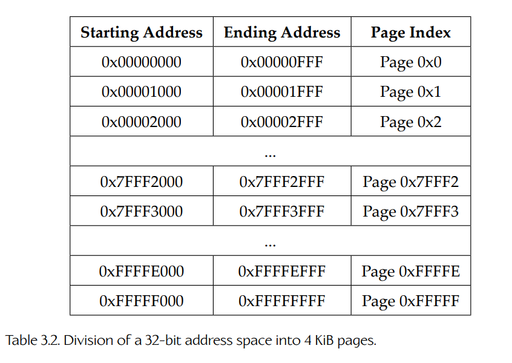
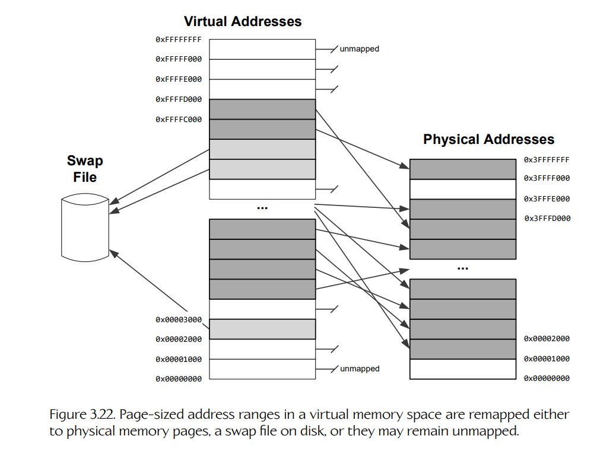
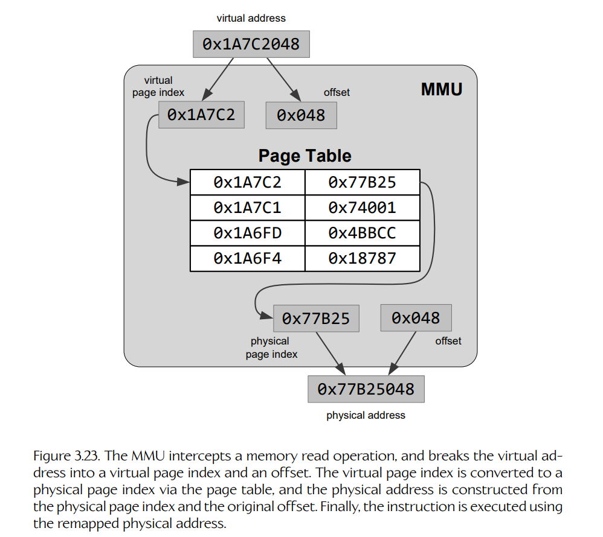
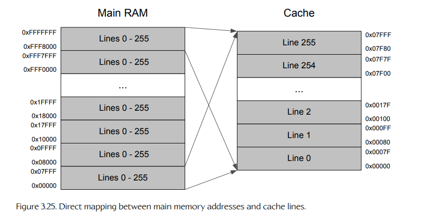
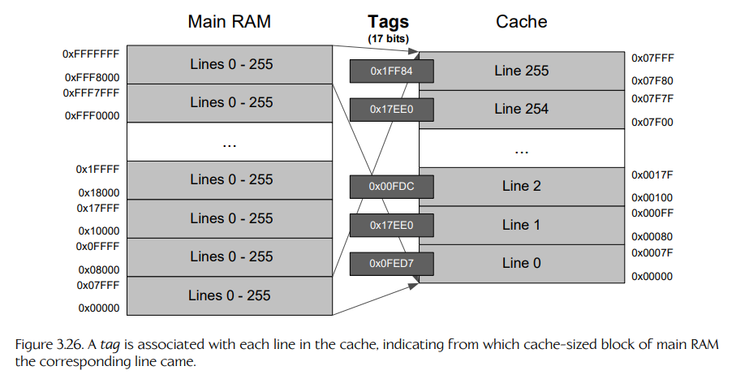
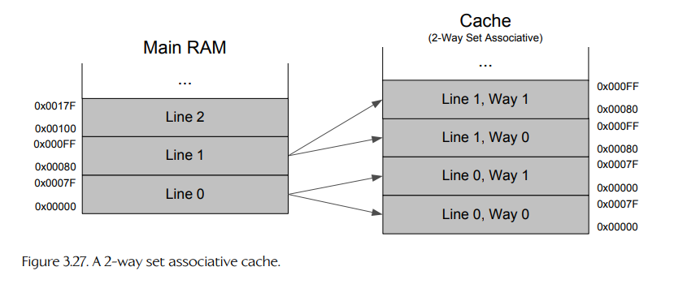
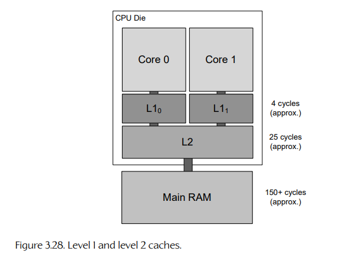
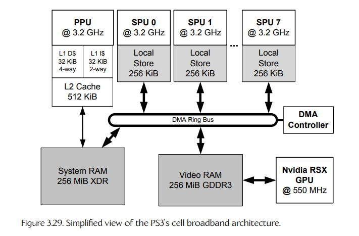
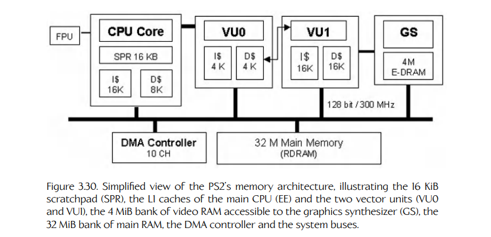

## 3.5 内存架构

在简单的冯·诺依曼计算机架构中，内存被视为一个单一、同质的块，其中所有内存都可以被 CPU 同等访问。但在现实中，计算机内存几乎从来不会以这种过于简化的方式来设计。首先，CPU 的寄存器本身就是一种内存，但在汇编语言程序中，寄存器通常通过名称来引用，而不是像普通 ROM 或 RAM 那样通过地址访问。此外，即使是“常规”内存，通常也会根据不同特性和不同用途被划分为若干块。进行这种划分有多种原因，包括成本控制以及整体系统性能优化。本节将考察当今个人计算机和游戏主机中常见的一些内存架构，并探讨它们为何会被设计成这样的几个关键原因。

### 3.5.1 内存映射

一条 *n* 位地址总线可以让 CPU 访问理论大小为 2^n 字节的 address space（地址空间）。单个内存设备（ROM 或 RAM）总是作为一段连续的内存单元来寻址。因此，一台计算机的地址空间通常会被划分为多个连续段。其中一个或多个段对应 ROM 内存模块，其他段对应 RAM 模块。例如，在 Apple II 上，0xC100 到 0xFFFF 范围内的 16 位地址被分配给 ROM 芯片（其中包含计算机的 firmware，固件），而 0x0000 到 0xBFFF 范围内的地址则被分配给 RAM。只要某个物理内存设备被分配到计算机地址空间中的一段地址范围，我们就说这段地址范围已经被 mapped（映射）到了该内存设备。

当然，一台计算机实际安装的内存不一定有它的地址总线理论上能够寻址的那么多。64 位地址总线可以访问 16 EiB 的内存，因此我们几乎不可能真正把这么大的地址空间全部填满！（即使是 HP 名为 “The Machine” 的原型超级计算机，其 160 TiB 的物理内存也远远达不到这个数量。）因此，计算机地址空间中的某些段没有被分配，是很常见的。

#### 3.5.1.1 内存映射 I/O

地址范围不一定都要映射到内存设备——某段地址范围也可以映射到其他 peripheral devices（外围设备），例如手柄或网络接口卡（NIC）。这种方法称为 memory-mapped I/O（内存映射 I/O），因为 CPU 可以通过读取或写入地址来对外围设备执行 I/O 操作，就好像这些地址是普通 RAM 一样。在底层，特殊电路会检测 CPU 正在读取或写入一段已经映射到非内存设备的地址范围，并把该读写请求转换为针对相应设备的 I/O 操作。举一个具体例子，Apple II 将 I/O 设备映射到 0xC000 到 0xC0FF 的地址范围中，这使程序仅通过读取和写入该范围内的地址，就能完成诸如控制 bank-switched RAM（分体切换 RAM）、读取并控制主板上游戏控制器插座引脚电压，以及执行其他 I/O 操作等任务。

另一种方式是，CPU 可以通过称为 ports（端口）的特殊寄存器与非内存设备通信。在这种情况下，每当 CPU 请求从某个端口寄存器读取数据或向其写入数据时，硬件都会把该请求转换为目标设备上的 I/O 操作。这种方法称为 port-mapped I/O（端口映射 I/O）。在 Arduino 系列微控制器中，端口映射 I/O 让程序能够直接控制芯片某些引脚上的数字输入和输出。

#### 3.5.1.2 视频 RAM

基于 raster（光栅）的显示设备通常会读取一段硬连线指定的物理内存地址范围，以确定屏幕上每个像素的亮度 / 颜色。同样，早期基于字符的显示器会通过从一块内存中读取 ASCII 码，来决定屏幕上每个位置应显示哪个字符字形。被分配给视频控制器使用的一段内存地址范围称为 video RAM（视频 RAM，VRAM）。

在 Apple II 和早期 IBM PC 这样的早期计算机中，视频 RAM 曾经对应主板上的内存芯片，VRAM 中的内存地址可以由 CPU 像读写其他任何内存位置一样进行读写。PlayStation 4 和 Xbox One 这样的游戏主机也是如此，在这些机器上，CPU 和 GPU 共享同一大块 unified memory（统一内存）。

在个人计算机中，GPU 通常位于一块独立电路板上，并插入主板的扩展槽。视频 RAM 通常位于显卡上，这样 GPU 就可以尽可能快速地访问它。PCI、AGP 或 PCI Express（PCIe）等总线协议用于通过扩展槽总线，在 “main RAM”（主 RAM）和 VRAM 之间来回传输数据。主 RAM 与 VRAM 之间的这种物理分离可能成为显著的性能瓶颈，也是 OpenGL 和 DirectX 11 等渲染引擎与图形 API 复杂性的主要来源之一。

#### 3.5.1.3 案例研究：Apple II 内存映射

为了说明内存映射的概念，我们来看一个简单的真实例子。Apple II 拥有 16 位地址总线，这意味着它的地址空间只有 64 KiB。这个地址空间被映射到 ROM、RAM、内存映射 I/O 设备以及视频 RAM 区域，如下所示：

```text
0xC100 - 0xFFFF   ROM（固件）
0xC000 - 0xC0FF   内存映射 I/O
0x6000 - 0xBFFF   通用 RAM
0x4000 - 0x5FFF   高分辨率视频 RAM（第 2 页）
0x2000 - 0x3FFF   高分辨率视频 RAM（第 1 页）
0x0C00 - 0x1FFF   通用 RAM
0x0800 - 0x0BFF   文本 / 低分辨率视频 RAM（第 2 页）
0x0400 - 0x07FF   文本 / 低分辨率视频 RAM（第 1 页）
0x0200 - 0x03FF   通用与保留 RAM
0x0100 - 0x01FF   程序栈
0x0000 - 0x00FF   零页（主要为 DOS 保留）
```

需要注意的是，Apple II 内存映射中的地址直接对应主板上的内存芯片。在今天的操作系统中，程序使用 virtual addresses（虚拟地址）而不是 physical addresses（物理地址）来工作。我们将在下一节中讨论虚拟内存。

### 3.5.2 虚拟内存

大多数现代 CPU 和操作系统都支持一种称为 virtual memory system（虚拟内存系统）的内存重映射功能。在这些系统中，程序使用的内存地址并不直接映射到计算机中安装的内存模块。相反，每当程序从某个地址读取或向某个地址写入时，该地址首先会由 CPU 通过操作系统维护的一张查找表进行 remapped（重映射）。重映射后的地址可能最终指向内存中的实际单元（但数值地址完全不同）。它也可能最终指向磁盘上的一块数据。或者，它也可能根本没有被映射到任何物理存储。在虚拟内存系统中，程序使用的地址称为 virtual addresses（虚拟地址），而内存控制器为了访问 RAM 或 ROM 模块而实际通过地址总线传输的位模式称为 physical addresses（物理地址）。

虚拟内存是一个强大的概念。它允许程序使用比计算机实际安装内存更多的内存，因为数据可以从物理 RAM 溢出到磁盘上。虚拟内存也提高了操作系统的稳定性和安全性，因为每个程序都有自己私有的内存“视图”，并且会被阻止去踩踏其他程序或操作系统本身拥有的内存块。我们将在第 4.4.5 节进一步讨论操作系统如何管理运行中程序的虚拟内存空间。

#### 3.5.2.1 虚拟内存页

为了理解这种重映射如何发生，我们需要想象整个可寻址内存空间（如果地址总线为 *n* 位，那么就是 2^n 个字节大小的单元）在概念上被划分为大小相等的连续块，这些块称为 pages（页）。不同操作系统的页大小不同，但页大小总是 2 的幂——典型页大小为 4 KiB 或 8 KiB。假设页大小为 4 KiB，那么一个 32 位地址空间会被划分为 1,048,576 个不同的页，编号从 0x0 到 0xFFFFF，如表 3.2 所示。

虚拟地址与物理地址之间的映射总是以 page（页）为粒度进行。图 3.22 展示了一种虚拟地址和物理地址之间的假想映射关系。





#### 3.5.2.2 虚拟地址到物理地址的转换

每当 CPU 检测到一次内存读写操作时，地址会被拆分为两部分：page index（页索引）和该页内的 offset（偏移，以字节为单位）。对于 4 KiB 的页大小，偏移就是地址的低 12 位，而页索引则是高 20 位，即先进行掩码处理，再右移 12 位。例如，虚拟地址 0x1A7C6310 对应的偏移为 0x310，页索引为 0x1A7C6。

然后，CPU 的 memory management unit（内存管理单元，MMU）会在 page table（页表）中查找该页索引。页表用于把虚拟页索引映射到物理页索引。（页表存储在 RAM 中，并由操作系统管理。）如果相关页恰好被映射到了某个物理内存页，那么虚拟页索引会被转换为对应的物理页索引；这个物理页索引的位会根据需要左移，并与原始页偏移的位进行 OR 操作。这样，一个物理地址就得到了。继续上面的例子，如果虚拟页 0x1A7C6 恰好映射到物理页 0x73BB9，那么转换后的物理地址最终会是 0x73BB9310。这就是实际会通过地址总线传输的地址。图 3.23 展示了 MMU 的工作过程。



如果页表显示某个页没有映射到物理 RAM（可能是因为它从未被分配，或者因为该页已经被 swapped out 到磁盘文件中），MMU 就会触发一个 interrupt（中断），告诉操作系统该内存请求无法被满足。这称为 page fault（缺页异常）。（关于中断的更多内容见第 4.4.2 节。）

#### 3.5.2.3 处理缺页异常

对于访问未分配页的情况，操作系统通常会通过让程序崩溃并生成 core dump（核心转储）来响应缺页异常。对于访问已经被换出到磁盘的页的情况，操作系统会临时挂起当前正在运行的程序，从交换文件中读取该页，将其放入 RAM 的某个物理页中，然后像往常一样把虚拟地址转换为物理地址。最后，它会把控制权返回给被挂起的程序。从程序的角度看，这个操作完全是无缝的——它甚至“并不知道”某个页原本已经在内存中，还是必须从磁盘换入。

通常，只有在内存系统负载较高、物理页短缺时，页面才会被 swapped out（换出）到磁盘。操作系统会尝试只换出最少使用的内存页，以避免程序在基于内存的页和基于磁盘的页之间不断 “thrashing”（颠簸 / 抖动）。

#### 3.5.2.4 转换后备缓冲区（TLB）

由于相对于可寻址内存的总大小而言，页大小往往很小（通常为 4 KiB 或 8 KiB），因此页表可能变得非常大。如果每次程序访问内存时都必须扫描整张页表来查找物理地址，那么这个过程会非常耗时。

为了加快访问速度，人们使用了一种缓存机制，其基础假设是：普通程序往往会在相对较少的页中重复使用地址，而不是在整个地址范围中随机读写。CPU 芯片上 MMU 内部维护着一张小表，称为 translation lookaside buffer（转换后备缓冲区，TLB），其中缓存了最近使用过的地址的虚拟到物理地址映射。由于该缓冲区距离 MMU 很近，因此访问速度非常快。

TLB 的作用很像通用的 memory cache hierarchy（内存缓存层级），只不过它只用于缓存页表项。关于缓存层级如何工作的讨论，见第 3.5.4 节。

#### 3.5.2.5 虚拟内存的进一步阅读

关于虚拟内存实现细节的良好讨论，见 [134]。

Ulrich Drepper 的论文 “What Every Programmer Should Know About Memory” 也是所有程序员都应该阅读的经典材料 [135]。

### 3.5.3 用于降低延迟的内存架构

从内存设备访问数据的速度是一项重要特性。我们经常谈到 memory access latency（内存访问延迟），它被定义为：从 CPU 向内存系统请求数据，到 CPU 实际接收到该数据之间的时间长度。内存访问延迟主要取决于三个因素：

1. 用于实现单个内存单元的技术；
2. 内存支持的读端口和 / 或写端口数量；
3. 这些内存单元与使用它们的 CPU 核心之间的物理距离。

static RAM（静态 RAM，SRAM）的访问延迟通常远低于 dynamic RAM（动态 RAM，DRAM）。SRAM 通过使用更复杂的设计来实现较低延迟，但这种设计比 DRAM 需要更多晶体管来存储每一位。这反过来会让 SRAM 比 DRAM 更昂贵，不仅体现在每位的财务成本上，也体现在芯片上每位所消耗的面积上。

最简单的内存单元只有一个 port（端口），这意味着在任意给定时刻只能执行一次读操作或写操作。Multi-ported RAM（多端口 RAM）允许多个读操作和 / 或写操作同时执行，从而减少多个核心，或单个核心内部多个组件同时尝试访问同一组内存时由竞争造成的延迟。正如你所预期的，多端口 RAM 每位所需的晶体管数量多于单端口设计，因此它比单端口内存成本更高，也会占用芯片上更多面积。

CPU 与一组 RAM 之间的物理距离也会影响该内存的访问延迟。这是因为电子信号在计算机内部以有限速度传播。理论上，电子信号由电磁波构成，因此传播速度接近光速。⁷ 但内存访问信号在系统中传输时，还会经过各种开关电路和逻辑电路，这些电路会引入额外延迟。因此，某个内存单元越靠近使用它的 CPU 核心，其访问延迟往往越低。

> ⁷ 电子信号在铜线或光纤这样的传输介质中的传播速度总是略低于真空中的光速。每种互连材料都有自己的 characteristic velocity factor（特征速度因子，VF），范围可以从低于真空光速的 50% 到 99%。

#### 3.5.3.1 内存鸿沟

在计算早期，内存访问延迟和指令执行延迟大致处于同一水平。例如，在 Intel 8086 上，基于寄存器的指令可以在 2 到 4 个周期内执行完成，而一次主存访问也大约需要 4 个周期。然而，在过去几十年里，CPU 的原始时钟速度和有效指令吞吐率都以远快于内存访问速度的速度提升。今天，主存访问延迟相对于执行单条指令的延迟来说极高：基于寄存器的指令在 Intel Core i7 上仍然只需要 1 到 10 个周期即可完成，而一次主 RAM 访问可能需要大约 500 个周期才能完成！CPU 速度和内存访问延迟之间这种不断扩大的差距通常称为 memory gap（内存鸿沟）。图 3.24 展示了内存鸿沟随时间不断扩大的趋势。

程序员和硬件设计者共同开发了多种技术，用于绕开高内存访问延迟带来的问题。这些技术通常关注以下一项或多项：

1. 通过把更小、更快的内存 bank（存储体）放置在更靠近 CPU 核心的位置，降低平均内存延迟，使频繁使用的数据能够被更快访问；
2. 通过安排 CPU 在等待内存操作完成时执行其他有用工作，来“隐藏”内存访问延迟；和 / 或
3. 通过以尽可能高效的方式组织程序数据，使其适合接下来要对这些数据执行的工作，从而最小化对主存的访问次数。

在本节中，我们将更仔细地考察用于降低平均延迟的内存架构。我们将在第 4 章讨论并行硬件设计和并发编程技术时，再讨论另外两种技术：延迟“隐藏”和通过合理数据布局最小化内存访问。

![图 3.24 CPU 性能与内存性能之间不断扩大的差距称为内存鸿沟。（改编自 [24] John L. Hennessy 与 David A. Patterson 所著 *Computer Architecture: A Quantitative Approach*。）](../../assets/images/volume-01/chapter-03/figure-3-24-ever-increasing-difference-between-cpu-performance-and-memory-performance.png)

#### 3.5.3.2 寄存器堆

CPU 的 register file（寄存器堆）也许是为了最小化访问延迟而设计的内存架构中最极端的例子。寄存器通常使用多端口 static RAM（SRAM）实现，一般为读操作和写操作配备专用端口，使这些操作可以并行发生，而不是串行发生。更重要的是，寄存器堆通常紧邻使用它的 ALU 电路。此外，寄存器几乎都由 ALU 直接访问；而对主 RAM 的访问通常必须经过虚拟地址转换系统、内存缓存层级和 cache coherence protocol（缓存一致性协议，见第 3.5.4 节）、地址总线和数据总线，甚至还可能经过 crossbar switching logic（交叉开关逻辑）。这些事实解释了为什么寄存器可以被如此快速地访问，也解释了为什么寄存器 RAM 的成本相对于通用 RAM 要高得多。这种更高成本是合理的，因为寄存器是任何计算机中使用频率最高的内存，而且寄存器堆的总大小与主 RAM 相比非常小。

### 3.5.4 内存缓存层级

memory cache hierarchy（内存缓存层级）是当今个人计算机和游戏主机中缓解高内存访问延迟影响的主要机制之一。在缓存层级中，一个小而快的 RAM 存储体称为 level 1（L1）cache（一级缓存），它被放置在非常靠近 CPU 核心的位置（位于同一芯片上）。由于它离 CPU 核心如此之近，它的访问延迟几乎和 CPU 的寄存器堆一样低。有些系统会提供更大但稍慢的 level 2（L2）cache（二级缓存），它离核心更远一些（通常也在芯片上，并且经常在多核 CPU 的两个或多个核心之间共享）。有些机器甚至拥有更大但距离更远的 L3 或 L4 缓存。这些缓存协同工作，自动保留最常用数据的副本，从而把对系统主板上那块非常大但非常慢的主 RAM 的访问次数降到最低。

缓存系统通过在缓存中保留程序最频繁访问的数据块的 local copies（本地副本）来提升内存访问性能。如果 CPU 请求的数据已经在缓存中，那么它可以非常快地提供给 CPU——大约只需要几十个周期。这称为 cache hit（缓存命中）。如果数据尚未出现在缓存中，就必须从主 RAM 取入缓存。这称为 cache miss（缓存未命中）。从主 RAM 读取数据可能需要数百个周期，因此 cache miss 的代价确实非常高。

#### 3.5.4.1 缓存行

内存缓存利用了这样一个事实：真实软件中的内存访问模式往往表现出两种 locality of reference（引用局部性）：

1. **Spatial locality（空间局部性）。** 如果程序访问了内存地址 *N*，那么它很可能也会访问附近的地址，例如 *N + 1*、*N + 2* 等。顺序遍历数组中存储的数据，就是一种具有高度空间局部性的内存访问模式。

2. **Temporal locality（时间局部性）。** 如果程序访问了内存地址 *N*，那么它很可能会在不久的将来再次访问同一个地址。读取某个变量或数据结构中的数据，对其进行变换，然后把更新后的结果写回同一个变量或数据结构，就是一种具有高度时间局部性的内存访问模式。

为了利用引用局部性，内存缓存系统会把数据以连续块的形式移入缓存，而不是单独缓存一个个数据项。这些连续块称为 cache lines（缓存行）。

举例来说，假设程序正在访问某个 `class` 或 `struct` 实例的数据成员。当第一个成员被读取时，内存控制器可能需要花费数百个周期才能访问主 RAM 并取回数据。然而，缓存控制器并不会只读取这一个成员——它实际上会把一大块连续的 RAM 读入缓存。这样，后续读取该实例其他数据成员时，就很可能产生低成本的缓存命中。

#### 3.5.4.2 将缓存行映射到主 RAM 地址

缓存中的内存地址与主 RAM 中的内存地址之间存在一种简单的一对多对应关系。我们可以把缓存地址空间理解为以重复模式“映射”到主 RAM 地址空间上：从主 RAM 地址 0 开始，不断重复，直到所有主 RAM 地址都被缓存“覆盖”。

举一个具体例子，假设我们的缓存大小为 32 KiB，缓存行大小为 128 字节。那么该缓存可以容纳 256 条缓存行（256 × 128 = 32,768 B = 32 KiB）。再假设主 RAM 大小为 256 MiB。因此，主 RAM 是缓存大小的 8192 倍，因为 (256 × 1024) / 32 = 8192。这意味着我们需要把缓存地址空间覆盖到主 RAM 地址空间上 8192 次，才能覆盖所有可能的物理内存位置。换句话说，缓存中的单个 line（行）会映射到主 RAM 中 8192 个不同的、大小等于缓存行的块。



给定主 RAM 中的任意地址，我们可以通过对主 RAM 地址取缓存大小的模，来找到它在缓存中的地址。因此，对于一个 32 KiB 的缓存和 256 MiB 的主 RAM，缓存地址 0x0000 到 0x7FFF（也就是 32 KiB）会映射到主 RAM 地址 0x0000 到 0x7FFF。但这一段缓存地址也会映射到主 RAM 地址 0x8000 到 0xFFFF、0x10000 到 0x17FFF、0x18000 到 0x1FFFF，依此类推，一直到最后一段主 RAM 块，即地址 0xFFF8000 到 0xFFFFFFF。图 3.25 展示了主 RAM 与缓存 RAM 之间的映射关系。

#### 3.5.4.3 缓存寻址

我们来看看 CPU 从内存中读取一个字节时会发生什么。目标字节在主 RAM 中的地址首先会被转换为缓存中的地址。随后，缓存控制器会检查包含该字节的缓存行是否已经存在于缓存中。如果存在，就是 cache hit（缓存命中），该字节会从缓存中读取，而不是从主 RAM 中读取。如果不存在，就是 cache miss（缓存未命中），此时会从主 RAM 中读取一个缓存行大小的数据块，并将其加载到缓存中，这样之后读取附近地址时就会很快。

缓存只能处理与缓存行大小的整数倍对齐的内存地址（关于内存对齐，见第 3.3.7.1 节）。换句话说，缓存真正能寻址的单位是 line（行），而不是 byte（字节）。因此，我们需要把字节地址转换为 cache line index（缓存行索引）。

考虑一个总大小为 2^M 字节、缓存行大小为 2^n 字节的缓存。主 RAM 地址中最低的 n 位表示该字节在缓存行内部的 offset（偏移）。我们去掉这 n 个最低有效位，从而把单位从字节转换为行（也就是用地址除以缓存行大小 2^n）。最后，将所得地址拆分成两部分：最低的 (M − n) 位成为 cache line index（缓存行索引），其余所有位则告诉我们该缓存行来自主 RAM 中哪一个缓存大小的块。这个块索引称为 tag（标签）。



在发生缓存未命中时，缓存控制器会从主 RAM 中加载一个行大小的数据块到缓存中对应的 line。缓存还会维护一张小的 tag 表，每条缓存行对应一个 tag。这使得缓存系统可以追踪缓存中的每条行来自主 RAM 中的哪个块。这是必要的，因为缓存中的内存地址与主 RAM 中的内存地址之间是一对多关系。图 3.26 展示了缓存如何为其中每条有效行关联一个 tag。

回到从主 RAM 读取一个字节的例子，完整的事件序列如下：CPU 发出读操作。主 RAM 地址被转换成 offset、line index 和 tag。缓存中对应的 tag 会被检查，line index 用来定位它。如果缓存中的 tag 与请求的 tag 匹配，就是 cache hit。在这种情况下，line index 用于取出缓存中的行大小数据块，offset 用于定位该行中的目标字节。如果 tag 不匹配，就是 cache miss。在这种情况下，主 RAM 中合适的行大小数据块会被读入缓存，并且相应 tag 会被存入缓存的 tag 表。之后读取附近地址（也就是位于同一个缓存行内的地址）时，就会产生快得多的缓存命中。

#### 3.5.4.4 组相联与替换策略

上面描述的缓存行与主 RAM 地址之间的简单映射称为 direct-mapped cache（直接映射缓存）。它意味着主 RAM 中的每个地址只能映射到缓存中的一条 line。仍以前面 32 KiB 缓存、128 字节缓存行为例，主 RAM 地址 0x203 会映射到缓存行 4（因为 0x203 是 515，而 ⌊515 / 128⌋ = 4）。然而，在我们的例子中，有 8192 个唯一的、大小等于缓存行的主 RAM 块都会映射到缓存行 4。具体来说，缓存行 4 对应主 RAM 地址 0x200 到 0x27F，也对应地址 0x8200 到 0x827F、0x10200 到 0x1027F，以及另外 8189 个缓存行大小的地址范围。

当发生缓存未命中时，CPU 必须从主存中加载相应的缓存行到缓存。如果缓存中的该行不包含有效数据，我们只需要把数据复制进去即可。但如果该行已经包含数据（来自另一个主存块），我们就必须覆盖它。这称为 evicting the cache line（驱逐缓存行）。

直接映射缓存的问题在于，它可能导致一些 pathological cases（病态情况）。例如，两个不相关的主存块可能会以“乒乓”的方式不断互相驱逐。如果主 RAM 中的每个地址可以映射到缓存中的两条或更多不同的 line，我们就可以获得更好的平均性能。在 2-way set associative cache（二路组相联缓存）中，每个主 RAM 地址会映射到两条缓存行。图 3.27 展示了这一点。显然，4 路组相联缓存的性能甚至可能优于 2 路，8 路或 16 路组相联缓存又可能优于 4 路，以此类推。

一旦存在不止一个 cache way（缓存路），缓存控制器就会面临一个两难问题：当发生缓存未命中时，我们应该驱逐哪个 “way”，又应该让哪些 “way” 留在缓存中？这个问题的答案因 CPU 设计而异，称为 CPU 的 replacement policy（替换策略）。一种常见策略是 not most-recently used（NMRU，非最近使用）。在这种方案中，会追踪最近使用的 “way”，而驱逐总是作用于不是最近使用的那个 “way” 或那些 “way”。其他策略包括 first in first out（FIFO，先进先出；这是直接映射缓存中的唯一选择）、least-recently used（LRU，最近最少使用）、least-frequently used（LFU，最不经常使用）以及伪随机。关于缓存替换策略的更多内容，见 [136]。



#### 3.5.4.5 多级缓存

hit rate（命中率）衡量的是程序命中缓存的频率，与发生代价高昂的 cache miss 相对。命中率越高，程序性能越好（在其他条件相同的情况下）。缓存延迟与命中率之间存在一个基本权衡。缓存越大，命中率越高；但较大的缓存无法放在离 CPU 那么近的位置，因此它们往往比小缓存更慢。

大多数游戏主机至少使用两级缓存。CPU 首先尝试在 level 1（L1）cache 中查找所需数据。这个缓存很小，但访问延迟非常低。如果数据不在其中，它会尝试访问更大但延迟更高的 level 2（L2）cache。只有当数据也无法在 L2 缓存中找到时，才会产生一次完整的主内存访问成本。由于主 RAM 的延迟相对于 CPU 时钟频率可能非常高，有些 PC 甚至包含 level 3（L3）和 level 4（L4）缓存。

#### 3.5.4.6 指令缓存与数据缓存

在为游戏引擎或其他性能关键系统编写高性能代码时，必须意识到数据和代码都会被缓存。instruction cache（指令缓存，I-cache，常记作 I$）用于在可执行机器代码运行之前预加载它；而 data cache（数据缓存，D-cache，或 D$）用于加速该机器代码执行的读写操作。在 level 1（L1）缓存中，这两种缓存总是物理上分离的，因为一次指令读取不应该把有效数据挤出缓存，反之亦然。因此，在优化代码时，我们必须同时考虑 D-cache 和 I-cache 的性能（不过正如我们将看到的，优化其中一个往往会对另一个产生积极影响）。更高级别的缓存（L2、L3、L4）通常不会区分代码和数据，因为它们更大的容量往往可以缓解代码驱逐数据或数据驱逐代码的问题。

#### 3.5.4.7 写入策略

我们还没有讨论 CPU 向 RAM 写入数据时会发生什么。缓存控制器处理写入的方式称为 write policy（写入策略）。最简单的一种缓存称为 write-through cache（直写缓存）；在这种相对简单的缓存设计中，对缓存的所有写入都会立即镜像到主 RAM。在 write-back（写回）或 copy-back（回写）缓存设计中，数据会先被写入缓存，而缓存行只会在某些情况下被刷新到主 RAM，例如当一个脏缓存行需要被驱逐以便从主 RAM 读入新的缓存行时，或者当程序显式请求执行 flush（刷新）时。



#### 3.5.4.8 缓存一致性：MESI、MOESI 和 MESIF

当多个 CPU 核心共享同一个主内存存储区时，事情会变得更加复杂。通常，每个核心都会拥有自己的 L1 缓存，但多个核心可能会共享一个 L2 缓存，并且共享主 RAM。图 3.28 展示了一个具有两个 CPU 核心、共享一个主内存存储区和一个 L2 缓存的双级缓存架构。

在多核心存在的情况下，系统必须维护 cache coherency（缓存一致性）。这意味着要确保多个核心各自缓存中的数据彼此匹配，并且与主 RAM 的内容一致。缓存一致性不需要在每一个瞬间都维持——重要的是，运行中的程序永远不能察觉到缓存内容不同步。

最常见的缓存一致性协议称为 MESI（modified、exclusive、shared、invalid，即修改、独占、共享、无效）、MOESI（modified、owned、exclusive、shared、invalid，即修改、拥有、独占、共享、无效）和 MESIF（modified、exclusive、shared、invalid、forward，即修改、独占、共享、无效、转发）。当我们在第 4.9.4.2 节讨论多核计算架构时，将更深入地讨论 MESI 协议。

#### 3.5.4.9 避免缓存未命中

显然，缓存未命中不可能被完全避免，因为数据最终总要在主 RAM 和缓存之间来回移动。在存在内存缓存层级的情况下，编写高性能软件的诀窍在于：合理安排 RAM 中的数据，并设计数据操作算法，使缓存未命中的次数尽可能少。

避免 D-cache 未命中的最佳方式，是把数据组织为尽可能小的 contiguous blocks（连续块），然后 sequentially（顺序）访问它们。当数据是连续的（也就是说，你不会在内存中频繁“跳来跳去”）时，一次缓存未命中就会一次性加载最大数量的相关数据。当数据较小时，它更可能适配到单个缓存行中（或者至少适配到最少数量的缓存行中）。而当你顺序访问数据时，就可以避免多次驱逐和重新加载缓存行。

避免 I-cache 未命中遵循与避免 D-cache 未命中相同的基本原则，但实现方式有所不同。最简单的做法是让高性能循环的代码大小尽可能小，并避免在最内层循环中调用函数。如果确实选择调用函数，也要尽量让它们的代码大小保持较小。这有助于确保循环体的全部内容（包括所有被调用函数）在循环运行的整个过程中都留在 I-cache 中。

谨慎地使用 inline functions（内联函数）。内联小函数可以带来很大的性能提升。然而，过多内联会使代码体积膨胀，导致性能关键代码段不再适配缓存。

### 3.5.5 非统一内存访问（NUMA）

在设计多处理器游戏主机或个人计算机时，系统架构师必须在两种根本不同的内存架构之间做选择：uniform memory access（统一内存访问，UMA）和 nonuniform memory access（非统一内存访问，NUMA）。

在 UMA 设计中，计算机包含一大块对系统中所有 CPU 核心可见的主 RAM。物理地址空间在每个核心看来都是相同的，任意核心都可以读取和写入主 RAM 中的所有内存位置。UMA 架构通常会使用缓存层级来缓解内存访问延迟问题。

UMA 架构的一个问题在于，核心之间经常会争用对主 RAM 和任何共享缓存的访问。例如，PS4 包含 8 个核心，排列成两个 cluster（簇）。每个核心都有自己的私有 L1 缓存，但每个由 4 个核心组成的簇共享一个 L2 缓存，并且所有核心共享主 RAM。因此，这些核心经常会互相争用对 L2 缓存和主 RAM 的访问。

解决核心争用问题的一种方式，是采用 nonuniform memory access（NUMA）设计。在 NUMA 系统中，每个核心都会配备一块相对较小的高速专用 RAM，称为 local store（本地存储）。与 L1 缓存一样，local store 通常位于核心本身所在的同一芯片上，并且只能由该核心访问。但与 L1 缓存不同的是，对 local store 的访问是显式的。local store 可能被映射到某个核心地址空间的一部分，而主 RAM 被映射到另一段地址范围。或者，某些核心可能只能看到其 local store 内部的物理地址，并且可能依赖 direct memory access controller（直接内存访问控制器，DMAC）在 local store 和主 RAM 之间传输数据。

#### 3.5.5.1 PS3 上的 SPU 本地存储

PlayStation 3 是 NUMA 架构的经典例子。PS3 包含一个主 CPU，称为 Power processing unit（PPU），8 个称为 synergistic processing units（SPU）的协处理器，⁸ 以及一个 NVIDIA RSX 图形处理单元（GPU）。PPU 可以独占访问 256 MiB 的主系统 RAM（带有 L1 和 L2 缓存）；GPU 可以独占访问 256 MiB 的视频 RAM（VRAM）；每个 SPU 则拥有自己私有的 256 KiB local store。

> ⁸ 只有 6 个 SPU 可供游戏应用程序使用——其中 1 个 SPU 保留给操作系统使用，另一个完全禁用，以规避制造过程中不可避免的缺陷。

主 RAM、视频 RAM 和 SPU local store 的物理地址空间彼此完全隔离。这意味着，例如，PPU 不能直接寻址 VRAM 或任何 SPU local store 中的内存；任意一个 SPU 也不能直接寻址主 RAM、视频 RAM 或其他 SPU 的 local store，而只能直接寻址自己的 local store。PS3 的内存架构如图 3.29 所示。



#### 3.5.5.2 PS2 暂存区（SPR）

再往前看 PlayStation 2，我们可以了解另一种用于提升整体系统性能的内存架构。PS2 上的主 CPU 称为 emotion engine（EE），除了 16 KiB 的 L1 instruction cache（I-cache）和 8 KiB 的 L1 data cache（D-cache）之外，它还拥有一块特殊的 16 KiB 内存区域，称为 scratchpad（暂存区，缩写为 SPR）。PS2 还包含两个向量协处理器 VU0 和 VU1，它们各自拥有自己的 L1 I-cache 和 D-cache；以及一个称为 graphics synthesizer（GS，图形合成器）的 GPU，连接到 4 MiB 的视频 RAM。PS2 的内存架构如图 3.30 所示。



scratchpad 位于 CPU 芯片上，因此享有与 L1 缓存内存相同的低延迟。但与 L1 缓存不同，scratchpad 是 memory-mapped（内存映射）的，因此在程序员看来，它表现为一段普通的主 RAM 地址范围。PS2 上的 scratchpad 本身是 uncached（非缓存）的，这意味着对它的读写是直接的；它们会完全绕过 EE 的 L1 缓存。

scratchpad 的主要收益实际上并不是它的低访问延迟，而是 CPU 可以在不使用系统总线的情况下访问 scratchpad 内存。因此，在系统的地址总线和数据总线被用于其他目的时，对 scratchpad 的读写仍然可以发生。例如，游戏可能会建立一串 DMA 请求，用于在主 RAM 和 PS2 的两个向量处理单元（VU）之间传输数据。当这些 DMA 正由 DMAC 处理时，和 / 或当 VU 正忙于执行计算时（这两者都会大量使用系统总线），EE 可以对 scratchpad 中的数据执行计算，而不会干扰 DMA 或 VU 的操作。数据移入和移出 scratchpad 可以通过常规内存移动指令（或 C/C++ 中的 `memcpy()`）完成，但也可以通过 DMA 请求完成。因此，PS2 的 scratchpad 为程序员提供了很大的灵活性和能力，用于最大化游戏引擎的数据吞吐量。