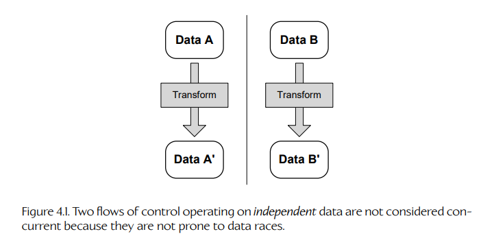
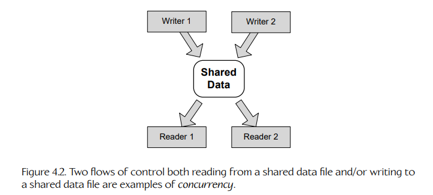
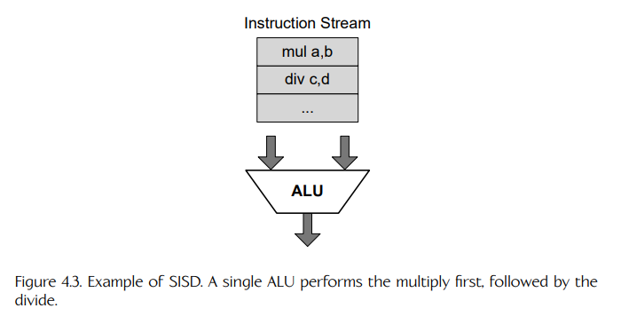
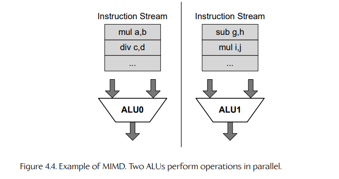
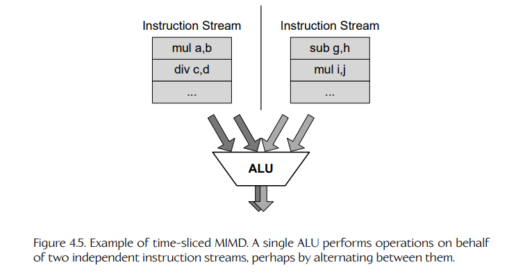
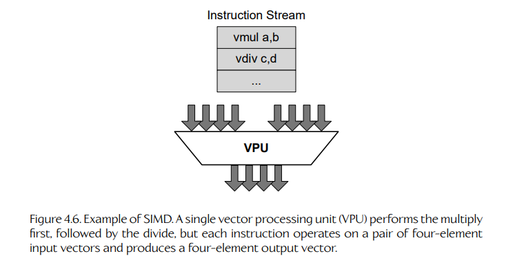
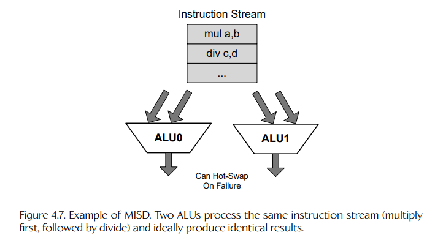

## 4.1 定义并发与并行

### 4.1.1 并发

一段 concurrent（并发）软件会利用 multiple flows of control（多个控制流）来解决一个问题。这些控制流可以实现为运行在同一个进程上下文中的多个 threads（线程），也可以实现为运行在一台或多台计算机上的多个协作进程。多个控制流还可以在同一个进程内部通过 fibers（纤程）或 coroutines（协程）等技术来实现。

concurrent programming（并发编程）与 sequential programming（顺序编程）最主要的区别在于：是否会读取和/或写入 shared data（共享数据）。如图 4.1 所示，如果我们有两个或更多控制流，并且每个控制流都操作一块完全独立的数据，那么从技术上说，这并不是并发的例子——它只是“同时计算”。

并发编程的核心问题是：如何协调多个 reader（读者）和/或多个 writer（写者）对共享数据文件的访问，从而保证结果是可预测且正确的。这个问题的核心是一种特殊的 race condition（竞态条件），称为 data race（数据竞争）。在数据竞争中，两个或更多控制流会“竞争”谁先读取、修改并写入某块共享数据。并发问题的关键，就是识别并消除数据竞争。图 4.2 展示了两个并发示例。

从第 4.5 节开始，我们会探讨程序员用于避免数据竞争、从而编写可靠并发程序的技术。不过在此之前，我们先来看并行计算硬件如何既为运行并发软件提供有效平台，又能提升顺序程序的执行速度。

### 4.1.2 并行

在计算机工程中，parallelism（并行）一词指两个或更多不同硬件组件同时工作的任何情形。换句话说，parallel computer hardware（并行计算机硬件）能够一次执行不止一项任务。相比之下，serial computer hardware（串行计算机硬件）一次只能做一件事。

1989 年以前，消费级计算设备完全是串行机器。例如 MOS Technology 6502 CPU，它被用于 Apple II 和 Commodore 64 个人计算机；还有 Intel 8086、80286 和 80386 CPU，它们是早期 IBM PC 及其兼容机的核心。

如今，并行计算硬件已经无处不在。硬件并行的一个显而易见的例子是 multicore CPU（多核 CPU），例如 Intel Core™ i9 或 AMD Ryzen™ 9。但并行性可以在很广的粒度范围内使用。例如，一个 CPU 可能包含多个 ALU，因此能够并行执行多个独立计算。另一方面，由一组计算机协同工作来解决一个共同问题的计算机集群，也是硬件并行的例子。

#### 4.1.2.1 隐式并行与显式并行

对计算机硬件设计中的各种并行形式进行分类的一种方式，是考察每种并行的 purpose（目的）。换句话说，在某种设计中，并行性要解决什么问题？沿着这个思路，我们可以把并行性粗略地分成两类：

- implicit parallelism（隐式并行）；
- explicit parallelism（显式并行）。

Implicit parallelism（隐式并行）指的是：为了提升 single instruction stream（单一指令流）的性能，在 CPU 内部使用并行硬件组件。这也称为 instruction level parallelism（指令级并行，ILP），因为 CPU 执行的是来自单一指令流（单一线程）的指令，但每条指令在执行时会利用一定程度的硬件并行。隐式并行的例子包括：

- pipelining（流水线）；
- superscalar architectures（超标量架构）；
- very long instruction word（VLIW，超长指令字）架构。

我们会在第 4.2 节探讨隐式并行。GPU 也大量使用隐式并行；我们会在第 4.11 节进一步研究 GPU 的设计与编程。

Explicit parallelism（显式并行）指的是：为了同时运行 more than one instruction stream（多个指令流），在 CPU、计算机或计算机系统中使用重复的硬件组件。换句话说，显式并行硬件的设计目标，是让 concurrent software（并发软件）能够比在串行计算平台上更高效地运行。显式并行最常见的例子包括：

- hyperthreaded CPUs（超线程 CPU）；
- multicore CPUs（多核 CPU）；
- multiprocessor computers（多处理器计算机）；
- computer clusters（计算机集群）；
- grid computing（网格计算）；
- cloud computing（云计算）。

我们会在第 4.3 节进一步研究这些显式并行架构。

### 4.1.3 任务并行与数据并行

理解并行性的另一种方式，是根据并行执行的工作类型，把它分成两个大类。

- **Task parallelism（任务并行）。** 当多个 heterogeneous operations（异构操作）并行执行时，我们称之为任务并行。例如，在一个核心上执行动画计算，同时在另一个核心上执行碰撞检测，就是这种并行形式的例子。

- **Data parallelism（数据并行）。** 当一个 single operation（单一操作）并行作用于多个数据项时，我们称之为数据并行。例如，通过在四个核心上各执行 250 次矩阵计算来计算 1000 个蒙皮矩阵，就是数据并行的例子。

大多数真实的并发程序都会不同程度地同时使用任务并行和数据并行。

### 4.1.4 Flynn 分类法

对计算硬件中不同程度的并行性进行分类的另一种方式，是使用 Flynn’s Taxonomy（Flynn 分类法）。该分类法由斯坦福大学的 Michael J. Flynn 于 1966 年提出，它把并行性划分到一个二维空间中。一个轴表示 parallel flows of control（并行控制流）的数量，Flynn 将其称为任意时刻并行运行的 instruction（指令）数量；另一个轴表示程序中每条指令所操作的不同 data streams（数据流）数量。因此，这个空间被划分为四个象限：

- **Single instruction, single data（SISD，单指令单数据）：** 单一指令流操作单一数据流。
- **Multiple instruction, multiple data（MIMD，多指令多数据）：** 多个指令流操作多个独立数据流。
- **Single instruction, multiple data（SIMD，单指令多数据）：** 单一指令流操作多个数据流，也就是在多个独立数据流上同时执行相同的操作序列。
- **Multiple instruction, single data（MISD，多指令单数据）：** 多个指令流都操作同一个数据流。MISD 在游戏中很少使用，但一个常见应用是通过冗余来提供 fault tolerance（容错能力）。

#### 4.1.4.1 单数据与多数据

这里需要注意的是，“data stream（数据流）”并不只是指一个数字数组。大多数算术运算符是二元运算符——它们操作两个输入并产生一个输出。当应用于二元算术时，“single data（单数据）”指的是一对输入和一个输出。作为例子，我们来看两个二元算术运算：乘法 `a × b` 和除法 `c / d`，它们在 Flynn 四种分类下可能如何完成：

- 在 SISD 架构中，单个 ALU 先执行乘法，再执行除法。如图 4.3 所示。

- 在 MIMD 架构中，两个 ALU 并行执行操作，分别处理两个独立的指令流。如图 4.4 所示。

- MIMD 分类也适用于这样一种情况：单个 ALU 通过 time-slicing（时间片轮转）处理两个独立指令流，如图 4.5 所示。

- 在 SIMD 架构中，一个称为 vector processing unit（向量处理单元，VPU）的单个“宽 ALU”先执行乘法，再执行除法；但每条指令都会作用于一对四元素输入向量，并产生一个四元素输出向量。图 4.6 展示了这种方式。

- 在 MISD 架构中，两个 ALU 处理同一个指令流（先乘法，后除法），并且理想情况下产生完全相同的结果。如图 4.7 所示，这种架构主要用于通过冗余实现容错。ALU 1 可以作为 ALU 0 的“热备份”，反之亦然。也就是说，如果其中一个 ALU 出现故障，系统可以无缝切换到另一个 ALU。

#### 4.1.4.2 GPU 并行：SIMT

近年来，为了描述 graphics processing unit（GPU，图形处理器）的设计，人们在 Flynn 分类法中加入了第五种分类。

Single instruction multiple thread（SIMT，单指令多线程）本质上是 SIMD 与 MIMD 的一种混合形式，主要用于 GPU 设计。它把 SIMD 处理（单条指令同时作用于多个数据流）与 multithreading（多线程，即多个指令流通过时间片共享一个处理器）混合在一起。

“SIMT”这个术语由 NVIDIA 提出，但它也可以用于描述任何 GPU 的设计。manycore（众核）一词也经常用于指代 SIMT 设计，也就是由数量相对较多的轻量级 SIMD 核心组成的 GPU；而 multicore（多核）通常指 MIMD 设计，也就是由数量相对较少的重量级通用核心组成的 CPU。我们会在第 4.11 节进一步研究 GPU 所采用的 SIMT 设计。

### 4.1.5 并发与并行的正交性

这里需要强调：并发软件并不 require（要求）并行硬件；并行硬件也并不是 only（只）用于运行并发软件。例如，一个并发的多线程程序可以通过 preemptive multitasking（抢占式多任务）运行在单个串行 CPU 核心上（见第 4.4.4 节）。同样，instruction level parallelism（指令级并行）的目标是提升单个线程的性能，因此它既能让并发软件受益，也能让顺序软件受益。因此，尽管并发和并行关系密切，但它们实际上是 orthogonal concepts（正交概念）。

只要我们的系统涉及多个 reader（读者）和/或多个 writer（写者）访问一个共享数据对象，我们就拥有一个并发系统。并发可以通过抢占式多任务实现（无论是在串行硬件还是并行硬件上），也可以通过真正的 parallelism（并行性）实现，即每个线程运行在不同的核心上。无论采用哪种方式，本章将要学习的技术都同样适用。

### 4.1.6 本章路线图

在接下来的几节中，我们会首先关注 implicit parallelism（隐式并行），以及如何优化软件以充分利用它。接着，我们会回顾最常见的 explicit parallelism（显式并行）形式。然后，我们会探讨各种用于驾驭显式并行计算平台的 concurrent programming（并发编程）技术。最后，我们会通过讨论 SIMD 向量处理，以及它如何应用于 GPU 设计和 general-purpose GPU programming（通用 GPU 编程，GPGPU）技术，来完成对并行编程的讨论。