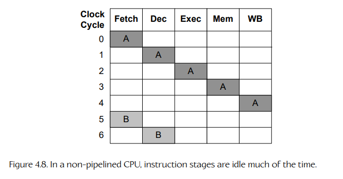
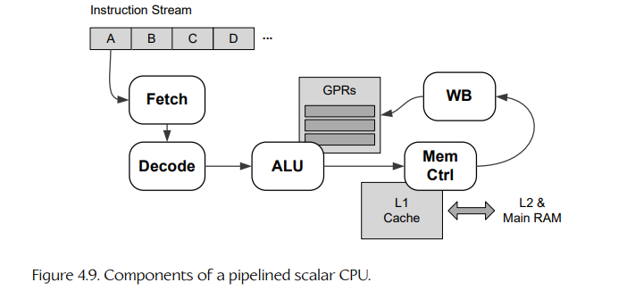
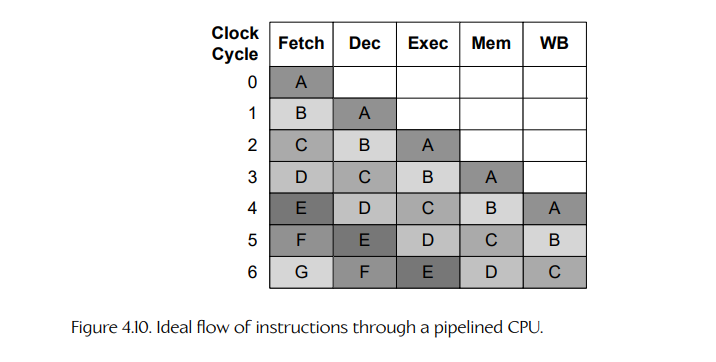
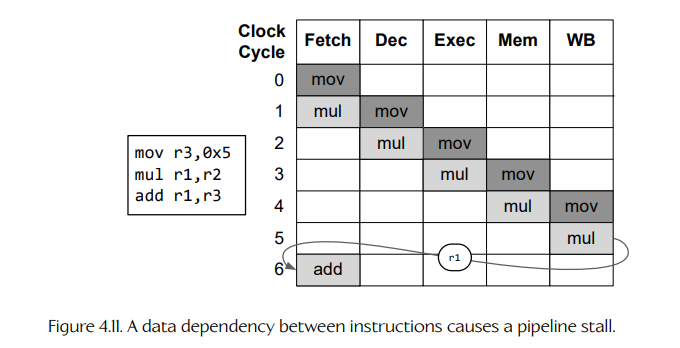
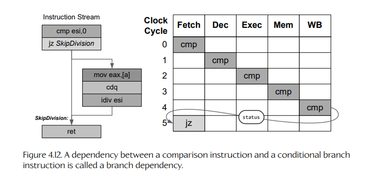
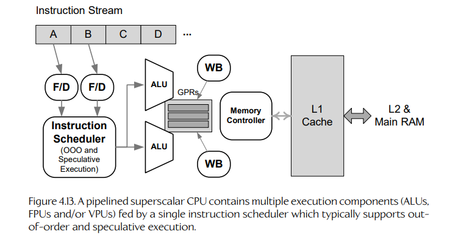
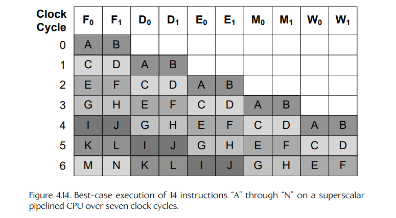

## 4.2 隐式并行

在第 4.1.2.1 节中，我们说过，implicit parallelism（隐式并行）是指出于提升单个线程执行速度的目的而使用并行计算硬件。CPU 制造商从 20 世纪 80 年代末开始在消费级产品中使用隐式并行，试图让同一产品线中每一代新的 CPU 都能让 existing code（现有代码）运行得更快。

有许多方法可以把并行性应用到提升 CPU 单线程性能的问题上。最常见的方式包括 pipelined CPU architectures（流水线 CPU 架构）、superscalar designs（超标量设计）以及 very long instruction word（VLIW，超长指令字）架构。我们会先看看流水线 CPU 是如何工作的，然后再讨论另外两种隐式并行变体。

### 4.2.1 流水线

为了让 CPU 执行一条 machine language instruction（机器语言指令），这条指令必须经过若干不同的 stages（阶段）。每种 CPU 设计都有所不同——有些 CPU 设计会使用大量细粒度阶段，而另一些则使用数量较少、粒度较粗的阶段。不过，每种 CPU 都会以某种方式实现以下基本阶段：

- **Fetch（取指）。** 从 instruction pointer register（指令指针寄存器，IP）所指向的内存位置读取将要执行的指令。

- **Decode（译码）。** 将 instruction word（指令字）分解为 opcode（操作码）、addressing mode（寻址模式）以及可选的 operands（操作数）。

- **Execute（执行）。** 根据操作码，选择 CPU 内部合适的 functional unit（功能单元），例如 ALU、FPU、memory controller（内存控制器）等。指令会连同相关操作数数据一起被派发到选定组件进行处理，随后该功能单元执行相应操作。



**Figure 4.8.** 在非流水线 CPU 中，指令阶段大部分时间处于空闲状态。



**Figure 4.9.** 流水线标量 CPU 的组成部分。

- **Memory access（内存访问）。** 如果指令涉及读取或写入内存，那么内存控制器会在这一阶段执行相应操作。

- **Register write-back（寄存器写回）。** 执行该指令的功能单元（ALU、FPU 等）会把结果写回到目标寄存器中。

图 4.8 追踪了名为 “A” 和 “B” 的两条指令在串行 CPU 的五个执行阶段中的路径。你会立刻注意到，这张图里有很多空白：当一个阶段正在处理某条指令时，所有其他阶段都闲着，什么也没做。

实际上，指令执行的每个阶段都由 CPU 内部不同的硬件负责，如图 4.9 所示。control unit（控制单元，CU）和内存控制器负责 instruction fetch（取指）阶段；CU 内部的另一个电路负责 decode（译码）阶段；ALU、FPU 或 VPU 负责 execute（执行）阶段的大部分工作；memory（内存）阶段由内存控制器完成；最后，write-back（写回）阶段主要涉及寄存器。CPU 内部不同电路之间的这种分工，是提高 CPU 效率的关键：我们只需要让所有阶段的硬件一直保持忙碌即可。



**Figure 4.10.** 指令通过流水线 CPU 的理想流程。

这种解决方案称为 pipelining（流水线）。我们不再等待每条指令完成全部五个阶段之后才开始执行下一条指令，而是在每个 clock cycle（时钟周期）开始执行一条新指令。因此，会有多条指令同时处于 “in flight”（执行中）状态。这个过程如图 4.10 所示。

流水线有点像洗衣服。如果你有很多批衣服要洗，那么等每一批衣服都洗完并烘干之后再开始下一批，并不是很高效——洗衣机忙着工作时，烘干机可能闲着，反之亦然。更好的方式是让两台机器始终保持忙碌：第一批衣服一进入烘干机，第二批衣服就马上开始清洗，依此类推。

Pipelining（流水线）是一种称为 instruction-level parallelism（指令级并行，ILP）的并行形式。大多数情况下，ILP 的设计目标是对程序员透明。理想情况下，在给定时钟频率下，一个能在 scalar CPU（标量 CPU）上正确运行的程序，也应该能在流水线 CPU 上正确运行——只是运行得更快——当然前提是这两个处理器支持相同的 instruction set architecture（指令集架构，ISA）。理论上，一个流水线深度为 $N$ 个阶段的 CPU，可以比对应的串行 CPU 快 $N$ 倍。不过，正如我们会在第 4.2.4 节中看到的，由于指令流中各种 dependencies（依赖关系）的存在，流水线的实际表现并不总是像我们预期的那样好。因此，想要编写高性能代码的程序员不能对 ILP 视而不见。我们必须接受它、理解它，并且有时还要调整代码和/或数据的设计，以便最大限度地发挥流水线 CPU 的性能。

### 4.2.2 延迟与吞吐量

pipeline（流水线）的 latency（延迟）是指完整处理一条指令所需的时间。它就是流水线中所有阶段延迟的总和。用时间变量 $T$ 表示延迟，我们可以写成：

$$
T_{\text{pipeline}}=\sum_{i=0}^{N-1}T_i
$$

其中，流水线共有 $N$ 个阶段。

流水线的 throughput（吞吐量）或 bandwidth（带宽）衡量的是它在单位时间内能够处理多少条指令。流水线的吞吐量由最慢阶段的延迟决定——就像一条链条的强度取决于最薄弱的一环。吞吐量可以理解为一个频率 $f$，单位是 instructions per second（每秒指令数）。它可以写成：

$$
f=\frac{1}{\max(T_i)}
$$

### 4.2.3 流水线深度

我们说过，CPU 中每个阶段都可能具有不同的延迟 $T_i$，而延迟最长的阶段决定了整个处理器的吞吐量。在每个时钟周期中，其他阶段都会空闲等待最长阶段完成。因此，理想情况下，我们希望 CPU 中所有阶段具有大致相同的延迟。

这一目标可以通过增加流水线中的总阶段数来实现：如果某个阶段比其他阶段耗时长得多，我们可以尝试把它拆分成两个或更多较短的阶段，从而让所有阶段的延迟大致相等。不过，我们不能永远继续细分阶段。阶段数量越多，整体 instruction latency（指令延迟）就越高。这会增加 pipeline stalls（流水线停顿）的代价（见第 4.2.4 节）。因此，CPU 制造商会尽力在通过更深流水线提升吞吐量和控制整体指令延迟之间取得平衡。结果是，真实 CPU 的流水线深度范围大致从最少 4 或 5 个阶段，到最多约 30 个阶段。

### 4.2.4 停顿

有时，CPU 在某个特定时钟周期无法发射新指令。这称为 stall（停顿）。在这样的时钟周期中，流水线的第一阶段处于空闲状态。在下一个时钟周期中，第二阶段将处于空闲状态，依此类推。因此，stall 可以被理解为一个空闲时间的 “bubble”（气泡），它以每个时钟周期推进一个阶段的速度在流水线中传播。这些气泡有时也称为 delay slots（延迟槽）。



**Figure 4.11.** 指令之间的数据依赖会导致流水线停顿。

### 4.2.5 数据依赖

Stall（停顿）是由正在执行的指令流中指令之间的 dependencies（依赖关系）引起的。例如，考虑下面这组指令：

```asm
mov  ebx,5     ;; load the value 5 into register EBX
imul eax,10    ;; multiply the contents of EAX by 10
               ;; (result stored in EAX)

add  eax,7     ;; add 7 to EAX (result stored in EAX)
```

理想情况下，我们希望在连续三个时钟周期中发射 `mov`、`imul` 和 `add` 指令，以便让流水线尽可能忙碌。但在这个例子中，`imul` 指令的结果会被随后执行的 `add` 指令使用，因此 CPU 必须等到 `imul` 完整通过流水线之后，才能发射 `add`。如果流水线包含五个阶段，这意味着会浪费四个周期（见图 4.11）。这种指令之间的依赖关系称为 data dependency（数据依赖）。

实际上，可能导致停顿的指令依赖共有三类：

- data dependencies（数据依赖）；
- control dependencies（控制依赖，也称 branch dependencies，分支依赖）；
- structural dependencies（结构依赖，也称 resource dependencies，资源依赖）。

我们会先讨论如何避免数据依赖，然后再看看分支依赖以及如何缓解它们的影响。最后，我们会介绍超标量 CPU 架构，并讨论它们如何在流水线 CPU 中引入结构依赖。

#### 4.2.5.1 指令重排

为了缓解数据依赖的影响，我们需要在 CPU 等待依赖指令通过流水线时，找到一些其他指令可供执行。这通常可以通过 reordering（重排）程序中的指令来完成，同时要注意不能改变程序的 behavior（行为）。对于任意一对相互依赖的指令，我们希望找到附近一些不依赖于它们的指令，并把这些指令上移或下移，使其最终运行在这对依赖指令之间，从而用有用的工作填充这个 “bubble”（气泡）。

当然，指令重排可以由程序员手工完成，适合那些不介意深入汇编语言编程的冒险者。幸运的是，这通常并不是必要的：如今的 optimizing compilers（优化编译器）非常擅长自动重排指令，以降低或消除数据依赖的影响。

作为程序员，我们当然不应该盲目信任编译器会把代码优化得完美无缺——在编写高性能代码时，查看反汇编并确认编译器做了合理的工作始终是个好主意。不过话虽如此，我们也应该记住 80/20 rule（80/20 法则）（见第 2.3 节），只把时间花在优化那 20% 甚至更少、但确实会对整体性能产生明显影响的代码上。

#### 4.2.5.2 乱序执行

编译器和程序员并不是唯一能够重排机器语言指令序列以避免停顿的角色。如今许多 CPU 都支持一种称为 out-of-order execution（乱序执行）的特性，使它们能够动态检测指令之间的数据依赖，并自动解决这些依赖。

为了实现这一点，CPU 会在指令流中向前查看，并分析指令对寄存器的使用情况，从而检测它们之间的依赖关系。当发现某个依赖时，CPU 会在 “look-ahead window”（前瞻窗口）中搜索另一条不依赖于任何当前正在执行指令的指令。如果找到这样的指令，它就会被发射（以乱序方式发射），从而让流水线保持忙碌。乱序执行的具体工作机制超出了本书范围。这里需要说明的是，作为程序员，我们不能依赖 CPU 按照我们（或编译器）写出的相同顺序执行指令。

编译器的优化器和 CPU 的乱序执行逻辑都会非常小心，以确保指令重排不会改变程序的行为。然而，正如我们将在第 4.9.3 节看到的，编译器优化和乱序执行可能会在并发程序中引发 bug，也就是由共享数据的多个控制流组成的程序。这也是并发编程比串行编程需要更多谨慎的众多原因之一。

### 4.2.6 分支依赖

当流水线 CPU 遇到 conditional branch instruction（条件分支指令）时会发生什么？例如 `if` 语句，或者 `for` / `while` 循环末尾的条件表达式。为了回答这个问题，我们考虑下面的 C/C++ 代码：

```cpp
int SafeIntegerDivide(int a, int b, int defaultVal)
{
    return (b != 0) ? a / b : defaultVal;
}
```

如果我们查看这个函数在 Intel x86 CPU 上的反汇编，它可能看起来像这样：

```asm
; function preamble omitted for clarity...

; first, put the default into the return register
mov  eax,dword ptr [defaultVal]

mov  esi,dword ptr [b] ; check (b != 0)
cmp  esi,0
jz   SkipDivision

mov  eax, dword ptr[a] ; divisor (a) must be in EDX:EAX
cdq                    ; ... so sign-extend into EDX
idiv esi               ; quotient lands in EAX

SkipDivision:
    ; function postamble omitted for clarity...
    ret                ; EAX is the return value
```

这里的依赖存在于 `cmp`（compare，比较）指令和 `jz`（jump if equal to zero，若等于零则跳转）指令之间。CPU 在知道比较结果之前，无法发射条件跳转指令。这称为 branch dependency（分支依赖，也称 control dependency，控制依赖）。图 4.12 展示了分支依赖。



**Figure 4.12.** 比较指令与条件分支指令之间的依赖称为分支依赖。

#### 4.2.6.1 推测执行

CPU 处理分支依赖的一种方式，是使用一种称为 speculative execution（推测执行）的技术，也称为 branch prediction（分支预测）。每当遇到分支指令时，CPU 会尝试 guess（猜测）分支将会走向哪一边。然后，它继续从被选中的分支发射指令，希望自己的猜测是正确的。当然，CPU 直到依赖指令从流水线末尾出来时，才会确定自己是否猜对。如果最终猜错了，CPU 就已经执行了一些本不应该执行的指令。因此，流水线必须被 flushed（清空），并从正确分支的第一条指令重新开始。这称为 branch penalty（分支惩罚）。

CPU 可以做出的最简单猜测是假设分支永远不会被采用。CPU 会继续按顺序执行指令，只有当事实证明它猜错时，才把指令指针跳转到新位置。这种方式对 I-cache 友好，因为 CPU 总是偏好最有可能已经位于缓存中的那条分支指令。

另一种稍微高级一点的分支预测方式是假设 backward branches（向后分支）总是会被采用，而 forward branches（向前分支）永远不会被采用。向后分支通常出现在 `while` 或 `for` 循环末尾，因此这类分支往往比向前分支更常见。

大多数高质量 CPU 都包含 branch prediction hardware（分支预测硬件），它能够显著提高这些 “static”（静态）猜测的质量。分支预测器可以追踪某条分支指令在多次循环迭代中的结果，并发现一些模式，从而在后续迭代中做出更好的猜测。

PS3 游戏程序员曾经必须经常应对 “branchy”（分支很多的）代码带来的糟糕性能，因为 Cell 处理器上的分支预测器确实很差。不过，PS4 和 Xbox One 中的 AMD Jaguar CPU，以及 PS5 和 Xbox Series X/S 中的 AMD Zen 2，都拥有非常先进的分支预测硬件。因此，游戏程序员在为这些主机编写代码时可以稍微松一口气。

#### 4.2.6.2 谓词执行

另一种缓解分支依赖影响的方法，是干脆避免 branching（分支）。再次考虑 `SafeIntegerDivide()` 函数，不过我们稍微修改它，让它处理浮点值而不是整数：

```cpp
float SafeFloatDivide(float a, float b, float d)
{
    return (b != 0.0f) ? a / b : d;
}
```

这个简单函数会根据条件测试 `b != 0` 的结果计算两个答案之一。我们不使用条件分支语句返回两个答案中的一个，而是可以把条件测试安排成生成一个 bit mask（位掩码）：如果条件为 false，则全为 0（`0x0U`）；如果条件为 true，则全为 1（`0xFFFFFFFFU`）。然后，我们可以执行两个分支，生成两个候选答案。最后，我们使用这个掩码产生函数要返回的最终答案。

下面的代码展示了 predication（谓词执行）背后的思想。不过请注意，在某些编译器上，这段代码并不会真正产生谓词执行——稍后我会更详细地解释这一点，现在先暂且看下去。

```cpp
float SafeFloatDivide_pred(float a, float b, float d)
{
    // convert Boolean (b != 0.0f) into either 1U or 0U
    const unsigned condition = (unsigned)(b != 0.0f);

    // convert 1U -> 0xFFFFFFFFU
    // convert 0U -> 0x00000000U
    const unsigned mask = 0U - condition;

    // calculate quotient (will be QNaN if b == 0.0f)
    const float q = a / b;

    // pun the types into unsigned integers
    unsigned qu; memcpy(&qu, &q, sizeof(qu));
    unsigned du; memcpy(&du, &d, sizeof(du));

    // select quotient when mask is all ones, or default
    // value d when mask is all zeros
    const unsigned ru = (qu & mask) | (du & ~mask);

    // pun the result back to float
    float r; memcpy(&r, &ru, sizeof(r));

    return r;
}
```

我们来仔细看看这个函数做了什么：

- 测试 `b != 0.0f` 会产生一个 `bool` 结果。我们通过简单的类型转换把它转换成 `unsigned` 整数。其结果要么是 `1U`（对应 true），要么是 `0U`（对应 false）。

- 我们通过用 `0U` 减去这个 unsigned 结果，把它转换成一个 bit mask。零减零仍然是零，而零减一在 32 位无符号整数算术中是 −1，也就是 `0xFFFFFFFFU`。

- 接着，我们直接计算商。无论非零测试的结果如何，都运行这段代码，从而绕开任何分支依赖问题。

- 现在，我们已经准备好两个答案：商 `q` 和默认值 `d`。我们想使用掩码来“选择”其中一个值。不过为了做到这一点，我们需要把 `q` 和 `d` 的 floating-point bit patterns（浮点位模式）重新解释为 unsigned integers（无符号整数）。在 C/C++ 中，最可移植的实现方式是在不同的 `unsigned` 和 `float` 变量之间使用 `memcpy()` 复制位模式。

- 掩码的应用方式如下：我们把商 `q` 与掩码进行 bitwise AND（按位与），如果掩码全为 1，则得到与 `q` 匹配的位模式；如果掩码全为 0，则得到全 0。然后，我们把默认值 `d` 与掩码的 complement（补码 / 反码）进行按位与，如果掩码全为 1，则得到全 0；如果掩码全为 0，则得到 `d` 的位模式。最后，我们将这两个值进行 bitwise OR（按位或），实际上就是选择了 `q` 或 `d` 的值。

使用 mask（掩码）在两个可能值之间选择，称为 predication（谓词执行），因为我们运行了两条代码路径（返回 `a / b` 的路径和返回 `d` 的路径），但每条代码路径都通过掩码 predicated on（基于）测试结果 `b != 0`。因为我们是在两个可能值之间选择，所以这也经常称为 select operation（选择操作）。

需要注意的是，只有当两个分支都能 safely（安全地）执行时，谓词执行才有效。浮点除零会产生一个 quiet not-a-number（QNaN，静默非数），但整数除零会抛出一个会导致游戏崩溃的异常（除非它被捕获）。这就是为什么我们在对这个例子应用谓词执行之前，先把它改成了浮点版本。

为了避免分支而费这么大劲，看起来可能有些过度，而且有时确实如此。事实上，在某些编译器上，它可能完全没有效果。例如，当上面的代码在 x64 Clang 3.0.0 上以 `-O1` 或更高优化级别编译时，编译器会看穿你的意图，然后仍然生成分支！

```asm
# Result of compiling SafeFloatDivide_pred
# under x64 Clang 3.0.0
SafeFloatDivide_pred(float, float, float):
        pxor    XMM3, XMM3
        ucomiss XMM1, XMM3
        setp    AL
        setne   CL
        or      CL, AL
        je      .LBB0_2
        divss   XMM0, XMM1
        ret
.LBB0_2:
        movaps  XMM0, XMM2
        ret
```

只有当 CPU 的 ISA 提供用于执行 select operation（选择操作）的特殊机器语言指令时，谓词执行才真正能发挥作用。例如，PowerPC ISA 提供整数选择指令 `isel`、浮点选择指令 `fsel`，甚至 SIMD 向量选择指令 `vecsel`；在 PowerPC 平台（例如 PS3）上使用这些指令，确实可能带来性能提升。

### 4.2.7 超标量 CPU

第 4.2.1 节中描述的流水线 CPU 称为 scalar processor（标量处理器）。这意味着它每个时钟周期最多只能开始执行一条指令。是的，在任意时刻可能有 multiple instructions（多条指令）处于 “in flight”（执行中）状态，但每个时钟周期只有一条 new instruction（新指令）会被送入流水线。

从根本上说，并行性就是同时使用多个硬件组件。因此，至少在理论上，使 CPU 吞吐量翻倍的一种方式，就是 duplicate（复制）芯片上的大多数组件，使得每个时钟周期可以发射两条指令。这称为 superscalar architecture（超标量架构）。

在 superscalar CPU（超标量 CPU）中，管理流水线每个阶段的电路会有两个或更多实例位于芯片上。CPU 仍然从单一指令流中获取指令，但它不是每个时钟周期发射 IP 指向的一条指令，而是在每个时钟周期获取并派发接下来的两条指令。图 4.13 展示了 two-way superscalar CPU（双发射超标量 CPU）中的硬件组件，图 4.14 则追踪了十条指令 “A” 到 “N” 穿过这个 CPU 的两条并行流水线的路径。

#### 4.2.7.1 超标量设计的复杂性

实现一个 superscalar CPU（超标量 CPU）并不像把两个完全相同的 CPU 核心“复制粘贴”到同一个晶圆上那么简单。虽然我们可以合理地把超标量 CPU 想象成两条并行指令流水线，但这两条流水线都由同一个指令流供给。因此，在这些并行流水线的前端需要某种 control logic（控制逻辑）。就像支持乱序执行的 CPU 一样，超标量 CPU 的控制逻辑会在指令流中向前查看，试图识别指令之间的 dependencies（依赖关系），然后乱序发射指令，以缓解这些依赖的影响。<sup>1</sup>

> **脚注 1**：从技术上说，pipelining（流水线）和 superscalar designs（超标量设计）是两种相互独立的并行形式。流水线 CPU 不一定是超标量 CPU。同样，超标量 CPU 也不一定是流水线 CPU，虽然大多数超标量 CPU 都是流水线化的。



**Figure 4.13.** 流水线超标量 CPU 包含多个执行组件（ALU、FPU 和/或 VPU），由单个指令调度器供给；该调度器通常支持乱序执行和推测执行。



**Figure 4.14.** 在七个时钟周期内，14 条指令 “A” 到 “N” 在超标量流水线 CPU 上执行的最佳情况。

除了数据依赖和分支依赖之外，超标量 CPU 还容易出现第三类依赖，称为 resource dependency（资源依赖）。这种依赖发生在两个或更多连续指令都需要 CPU 内部同一个功能单元时。例如，假设我们有一个超标量 CPU，它有两个整数 ALU，但只有一个 FPU。这样的处理器能够在每个时钟周期发射两条整数算术指令。但是，如果指令流中出现两条浮点算术指令，它们就无法在同一个时钟周期中同时发射，因为第二条指令所需的资源（FPU）已经被第一条指令占用了。因此，管理超标量 CPU 指令派发的控制逻辑，比支持乱序执行的标量 CPU 中的控制逻辑还要复杂。

#### 4.2.7.2 超标量与 RISC

双发射超标量 CPU 大约需要同类标量 CPU 设计两倍的硅片面积。为了腾出晶体管资源，大多数超标量 CPU 因此都是 reduced instruction set（RISC，精简指令集）处理器。RISC 处理器的 ISA 提供数量相对较少、目标非常明确的指令。更复杂的操作则通过构建这些简单指令的序列来完成。相比之下，complex instruction set computer（CISC，复杂指令集计算机）的 ISA 提供种类丰富得多的指令，其中每条指令都可能执行更复杂的操作。

### 4.2.8 超长指令字（VLIW）

我们在第 4.2.7.1 节中看到，超标量 CPU 包含高度复杂的 instruction dispatch logic（指令派发逻辑）。这些逻辑会占用 CPU 晶圆上宝贵的面积。此外，当 CPU 分析依赖关系并寻找乱序和/或超标量指令派发机会时，它只能在指令流中向前查看相对较少的指令。这限制了 CPU 能够执行的动态优化效果。

实现 instruction level parallelism（指令级并行）的一种稍微简单的方式，是设计一种 CPU：它在芯片上拥有多个 compute elements（计算单元），例如 ALU、FPU、VPU，但把将指令派发到这些计算单元的任务完全交给程序员和/或编译器。这样一来，所有复杂的指令派发逻辑都可以被消除，而原本用于这些逻辑的晶体管则可以用来实现更多计算单元或更大的缓存。另一个好处是，程序员和编译器理应比 CPU 更擅长优化程序中的指令派发，因为它们可以从更大的窗口中选择要派发的指令，通常甚至可以看到整个函数的指令。

为了允许程序员和/或编译器在每个时钟周期向多个计算单元派发指令，instruction word（指令字）会被扩展，使其包含两个或更多 “slots”（槽位），每个槽位对应芯片上的一个计算单元。例如，如果我们的假想 CPU 包含两个整数 ALU 和两个 FPU，那么程序员或编译器需要能够在每个指令字中最多编码两个整数操作和两个浮点操作。我们称这种设计为 very long instruction word（VLIW，超长指令字）设计。VLIW 架构如图 4.15 所示。

我们可以把 PlayStation 2 作为 VLIW 架构的一个具体例子。PS2 包含两个称为 vector units（向量单元）的协处理器（VU0 和 VU1），每个都能够在每个时钟周期派发两条指令。每个 instruction word（指令字）由两个称为 low 和 high 的槽位组成。在手写汇编语言时，有效填满两个槽位通常是一项挑战，不过后来也开发了一些工具，帮助程序员把“一周期一条指令”的程序转换成高效的“一周期两条指令”格式。


**Figure 4.15.** 一种流水线 VLIW CPU 架构，由两个整数 ALU 和两个浮点 FPU 组成。每条超长指令字包含两个整数操作和两个浮点操作，并被派发到对应的功能单元。注意其中没有超标量 CPU 中那种复杂的指令调度逻辑。

超标量方法和 VLIW 方法之间存在权衡。由于缺少超标量 CPU 中复杂的调度、乱序执行和分支预测逻辑，VLIW 处理器要简单得多，因此有可能比超标量处理器更大程度地利用并行性。然而，把串行程序转换成能够充分利用 VLIW 并行性的形式可能非常困难。这会让程序员和/或编译器的工作更加艰巨。话虽如此，人们已经取得了不少进展来克服这些限制，包括 variable-width VLIW designs（可变宽度 VLIW 设计）。例如，见 [137]。