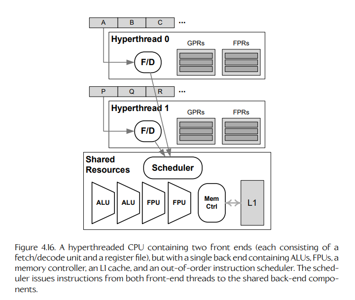
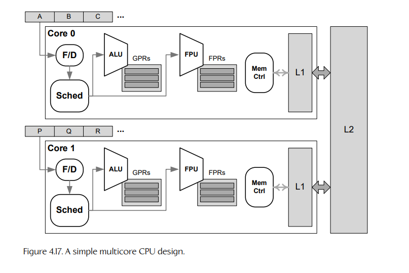
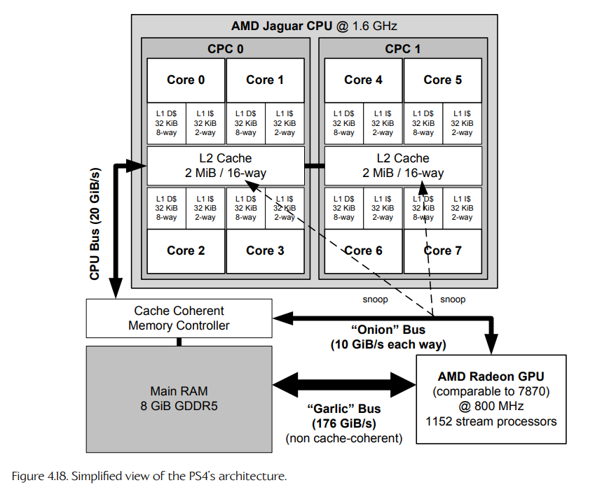
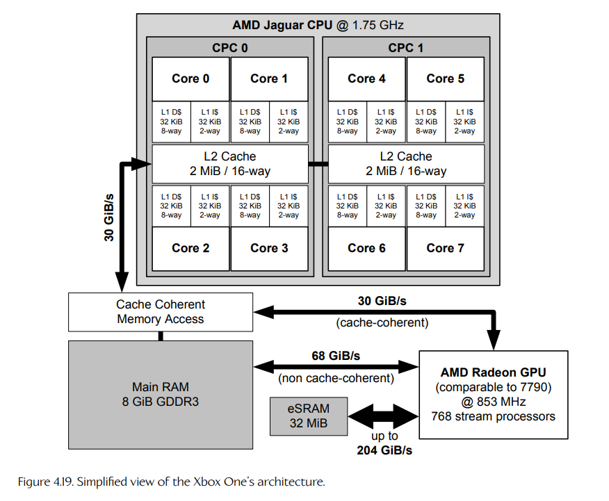

## 4.3 显式并行

Explicit parallelism（显式并行）的设计目标，是让并发软件运行得更加高效。因此，所有显式并行硬件设计都允许多个 instruction stream（指令流）并行处理。下面我们会列出几种常见的显式并行设计，其粒度从最细粒度的 hyperthreading（超线程），一直增加到最粗粒度的 cloud computing（云计算）。

### 4.3.1 超线程

正如我们在第 4.2.5.2 节看到的，有些流水线 CPU 能够以 out of order（乱序）的方式发射指令，从而减少流水线停顿。通常，流水线 CPU 会按照程序顺序执行指令；但有时，由于下一条指令依赖某条正在执行中的指令，指令流中的下一条指令无法被发射。这会产生一个 delay slot（延迟槽），理论上可以把另一条指令发射到这个延迟槽中。OOO CPU 可以在指令流中 “look ahead”（向前查看），并选择一条指令以乱序方式发射到这个延迟槽中。

如果只有单一指令流，那么 CPU 在选择发射到延迟槽的指令时，选择空间会受到一定限制。但如果 CPU 能够一次从两个独立的指令流中选择指令呢？这就是 hyperthreaded（HT，超线程）CPU 核心背后的基本原理。

从技术上说，一个 HT 核心包含两个 register files（寄存器文件）和两个 instruction decode units（指令译码单元），但只有一个用于执行指令的 “back end”（后端），以及一个共享的 L1 cache（一级缓存）。这种设计使得一个 HT 核心能够运行两个独立线程，同时由于共享后端和 L1 缓存，它所需的晶体管数量少于双核 CPU。当然，这种硬件组件共享也会导致其指令吞吐量低于同类双核 CPU，因为两个线程会争用这些共享资源。图 4.16 展示了典型超线程 CPU 设计中的关键组件。

**Figure 4.16.** 超线程 CPU 包含两个前端，但只有一个后端，后端中包含共享的执行资源。

### 4.3.2 多核 CPU

CPU core（CPU 核心）可以定义为一个 self-contained unit（自包含单元），能够执行来自至少一个 instruction stream（指令流）的指令。因此，我们目前看到的每一种 CPU 设计都可以称为一个 “core”。当一个 CPU die（CPU 裸片）上包含多个核心时，我们称之为 multicore CPU（多核 CPU）。

每个核心内部的具体设计可以是我们目前已经讨论过的任何一种设计：每个核心可能采用简单串行设计、流水线设计、超标量架构、VLIW 设计，也可能是一个超线程核心。图 4.17 展示了一个简单的多核 CPU 设计示例。

PlayStation 4、PlayStation 5、Xbox One 和 Xbox Series S/X 游戏主机都包含多核 CPU。PS4 和 Xbox One 各自都包含一个 accelerated processing unit（APU，加速处理单元），由两个四核 AMD Jaguar 模块组成，并与 GPU、内存控制器和视频编解码器集成在同一块裸片上。（在这八个核心中，有七个可供游戏应用程序使用。不过，第七个核心大约一半的带宽会保留给操作系统使用。）Xbox One X 也包含一个八核 APU，但其核心基于与 AMD 合作开发的专有技术，而不像其前代那样基于 Jaguar 微架构。图 4.18 展示了 PS4 硬件架构的框图，图 4.19 展示了 Xbox One 硬件架构的框图。

**Figure 4.17.** 一个简单的多核 CPU 设计。

**Figure 4.18.** PS4 架构的简化视图。

### 4.3.3 对称与非对称多处理

并行计算平台的 symmetry（对称性）与系统如何对待其中的 CPU 核心有关。在 symmetric multiprocessing（SMP，对称多处理）中，机器中可用的 CPU 核心（可以来自超线程、多核 CPU，或单个主板上的多个 CPU 的任意组合）在设计和 ISA 方面是同质的，并且被操作系统平等对待。任何线程都可以被调度到任何核心上执行。（不过需要注意的是，在这类系统中也可以为线程指定 affinity（亲和性），使其更可能，甚至保证被调度到某个特定核心上。）

PlayStation 4 和 Xbox One 都是 SMP 的例子。这两台主机都包含八个核心，其中七个可供程序员使用，并且应用程序可以自由地在任何可用核心上运行线程。

在 asymmetric multiprocessing（AMP，非对称多处理）中，CPU 核心不一定是同质的，操作系统也不会平等对待它们。在 AMP 中，一个 “master”（主）CPU 核心通常运行操作系统，而其他核心被视为 “slaves”（从属核心），工作负载由主核心分配给这些从属核心。

**Figure 4.19.** Xbox One 架构的简化视图。

PlayStation 3 中使用的 cell broadband engine（CBE，Cell 宽带引擎）就是 AMP 的一个例子；它使用一个称为 “power processing unit”（PPU，Power 处理单元）的主 CPU，该 CPU 基于 PowerPC ISA，同时还包含八个称为 “synergistic processing units”（SPU，协同处理单元）的协处理器，这些 SPU 基于一种完全不同的 ISA。（关于 PS3 的硬件架构，见第 3.5.5 节。）

### 4.3.4 分布式计算

在计算中实现并行性的另一种方式，是让多台独立计算机协同工作。从最一般的意义上说，这称为 distributed computing（分布式计算）。分布式计算系统有多种架构方式，包括：

- computer clusters（计算机集群）；
- grid computing（网格计算）；
- cloud computing（云计算）。

本书会专注于单台计算机内部的并行性，不过你也可以通过在线搜索上述术语来了解更多关于分布式计算的内容。