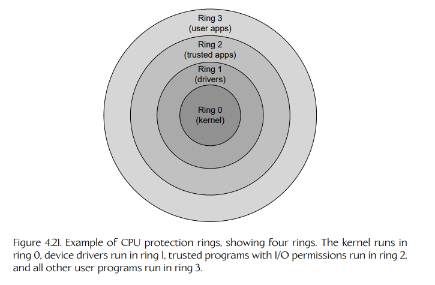
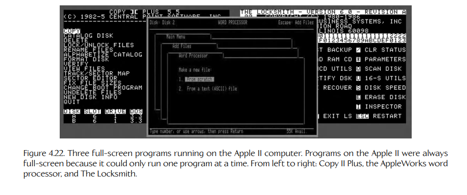
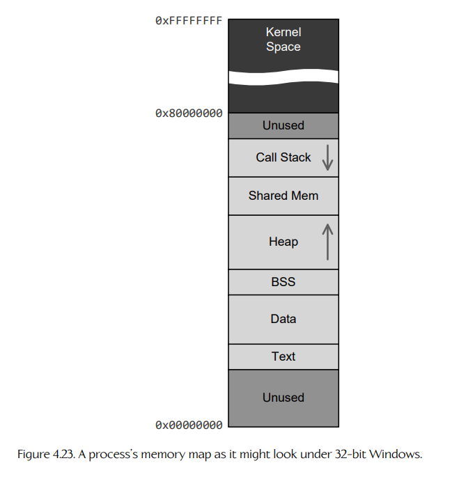
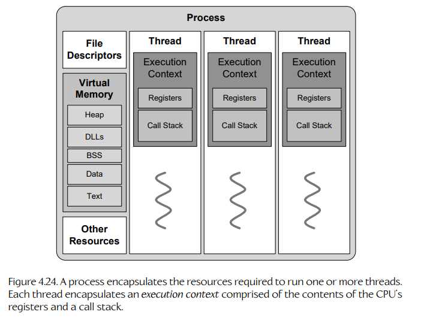
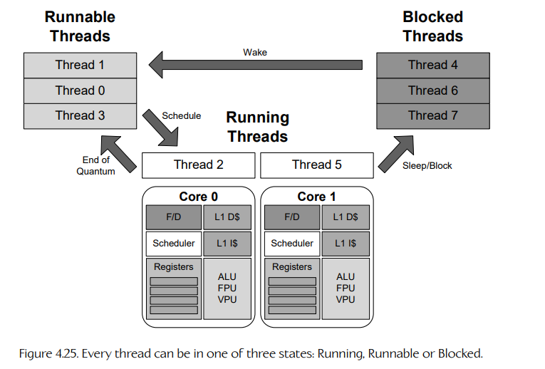
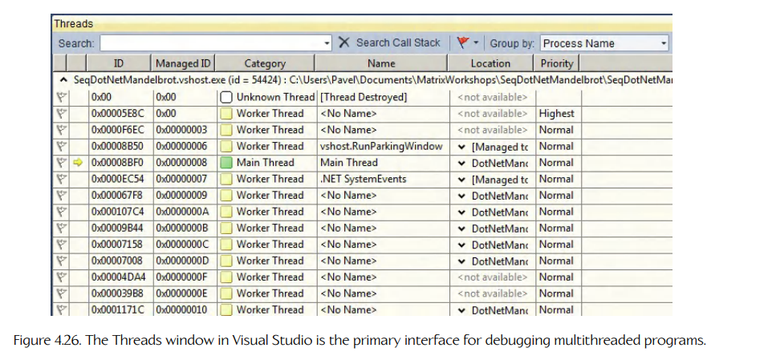

## 4.4 操作系统基础

现在我们已经对并行计算机硬件的基础有了扎实理解，接下来把注意力转向操作系统提供的服务，正是这些服务使 concurrent programming（并发编程）成为可能。

### 4.4.1 内核

现代操作系统需要处理种类繁多、粒度各异的任务。这些任务的一端包括处理键盘和鼠标事件，或为 preemptive multitasking（抢占式多任务）调度程序；另一端则包括管理打印机队列或网络协议栈。操作系统的 “core”（核心）——也就是处理所有最基础、最低层操作的部分——称为 kernel（内核）。操作系统的其余部分以及所有用户程序，都是构建在内核所提供的服务之上的。图 4.20 展示了这种架构。

### 4.4.1.1 内核模式与用户模式

内核及其设备驱动程序运行在一种特殊模式下，这种模式称为 protected mode（保护模式）、privileged mode（特权模式）或 kernel mode（内核模式）；而系统中的所有其他程序，包括操作系统中不属于内核的其他部分，都运行在 user mode（用户模式）下。顾名思义，运行在特权模式下的软件可以完全访问计算机中的全部硬件；而用户模式软件会以多种方式受到限制，以保证整个计算机系统的稳定性。运行在用户模式下的软件只能通过一次特殊的 kernel call（内核调用）来访问底层服务，也就是请求内核代表用户程序执行某个底层操作。这样可以保证程序不会无意或恶意地破坏系统稳定性。


实践中，操作系统可能会实现多个 protection rings（保护环）。内核运行在 ring 0 中，这是最受信任的环，并且拥有系统中所有可能的权限。设备驱动程序可能运行在 ring 1 中，具有 I/O 权限的受信任程序可能运行在 ring 2 中，而所有其他 “untrusted”（不受信任的）用户程序则运行在 ring 3 中。不过这只是一个例子——环的数量会随 CPU 和操作系统而变化，不同子系统分配到各个环中的方式也会变化。图 4.21 展示了保护环这一概念。



### 4.4.1.2 内核模式权限

Kernel mode（ring 0）软件可以访问 CPU 的 ISA 中定义的全部 machine language instructions（机器语言指令）。其中包括一组强大的指令，称为 privileged instructions（特权指令）。这些特权指令可能允许修改某些通常禁止访问的寄存器，例如用于控制虚拟内存映射，或屏蔽与解除屏蔽中断；也可能允许访问某些内存区域，或执行其他通常受限的操作。Intel x86 处理器上的特权指令示例包括 `wrmsr`（write to model-specific register，写模型专用寄存器）和 `cli`（clear interrupts，清除中断）。通过只允许内核这类 “trusted”（受信任）软件使用这些强大指令，可以提升系统稳定性和安全性。

借助这些特权机器语言指令，内核可以实现安全措施。例如，内核通常会锁定某些 virtual memory（虚拟内存）页，使用户程序无法写入这些页面。内核自身的软件以及所有内部记录数据，都保存在受保护的内存页中。这可以保证用户程序不会破坏内核，从而导致整个系统崩溃。

## 4.4.2 中断

Interrupt（中断）是发送给 CPU 的一种信号，用来通知 CPU 某个重要的底层事件已经发生，例如键盘按键、来自外围设备的信号，或计时器到期。当这类事件发生时，就会触发一个 interrupt request（IRQ，中断请求）。如果操作系统希望响应这个事件，它会暂停（interrupt）当前正在进行的处理，并调用一种特殊函数，称为 interrupt service routine（ISR，中断服务例程）。ISR 函数会响应该事件执行某些操作（理想情况下要尽可能快），然后控制权返回到中断发生之前正在运行的程序。

中断有两种：hardware interrupts（硬件中断）和 software interrupts（软件中断）。硬件中断通过在 CPU 的某个引脚上施加非零电压来请求。硬件中断可以由键盘、鼠标等设备触发，也可以由主板上或 CPU 内部的周期性计时器电路触发。由于它是由外部设备触发的，硬件中断可能在任何时刻发生，甚至可能正好发生在 CPU 执行某条指令的中途。因此，从硬件中断被物理触发，到 CPU 进入适合处理它的状态之间，可能会有一个很短的延迟。

软件中断由软件触发，而不是由 CPU 引脚上的电压触发。它的基本效果与硬件中断相同，都会使 CPU 的操作被打断，并调用一个服务例程。软件中断可以通过显式执行一条 “interrupt” 机器语言指令来触发。也可以在 CPU 运行某段软件时检测到错误条件后触发，这类中断称为 traps（陷阱）或 sometimes exceptions（异常，不过后者不应与语言层面的异常处理混淆）。例如，如果 ALU 被要求执行除零操作，就会触发一个软件中断。操作系统通常会通过终止相关程序并生成 core dump（核心转储）文件来处理这类中断。不过，如果调试器附加到了该程序上，它可以捕获这个中断，并让程序进入调试器以供检查。

## 4.4.3 内核调用

为了让用户软件执行某些特权操作，例如在虚拟内存系统中映射或解除映射物理内存页，或者访问原始网络套接字，用户程序必须向内核发出请求。内核会代表用户程序以安全方式执行该操作。这类请求称为 kernel call（内核调用）或 system call（系统调用）。

在大多数系统中，进入内核是通过 software interrupt（软件中断）实现的。<sup>2</sup> 在由中断触发的系统调用中，用户程序会把输入参数放到特定位置（可能在内存中，也可能在寄存器中），然后发出一条带有整数参数的 “software interrupt” 指令，该参数指定所请求的内核操作。这样会使 CPU 进入权限提升的模式，保存调用程序的状态，然后调用相应的内核中断服务例程。假设内核允许该请求继续执行，它会在特权模式下执行所请求的操作，然后在恢复调用者的执行状态后，将控制权返回给调用者。从用户模式程序切换到内核，就是 context switching（上下文切换）的一个例子。关于上下文切换，见第 4.4.6.5 节。

> **脚注 2**：在某些系统中，会使用 `call` 指令的一种特殊变体来调用内核。例如，在 MIPS 处理器上，这条指令称为 `syscall`。

在大多数现代操作系统中，用户程序不会手动执行软件中断或系统调用指令，例如通过内联汇编代码来完成。那样既混乱又容易出错。相反，用户程序会调用一个 kernel API（内核 API）函数，该函数再整理参数并触发软件中断。这就是为什么从用户程序的角度来看，系统调用看起来像普通函数调用。

## 4.4.4 抢占式多任务

最早的小型计算机和个人计算机一次只能运行一个程序。它们本质上是 serial computers（串行计算机），能够从单一 instruction stream（指令流）中读取程序，并一次执行该指令流中的一条指令。当时的 disk operating systems（DOS，磁盘操作系统）更多只是被美化了的设备驱动程序，使程序能够与磁带、软盘和硬盘驱动器等设备交互。整台计算机一次都会专门用于运行一个程序。图 4.22 展示了 Apple II 计算机上运行的几个全屏程序。

随着操作系统和计算机硬件变得更先进，在串行计算机上同时运行多个程序变得可行。在共享式大型机系统上，一种称为 multiprogramming（多道程序设计）的技术允许一个程序运行，而另一个程序等待某个来自外围设备的耗时请求得到满足。Classic Mac OS 以及 Windows NT 和 Windows 95 之前的 Windows 版本使用一种称为 cooperative multitasking（协作式多任务）的技术。在这种技术中，机器上一次仍然只有一个程序在运行，但每个程序都会定期 yield（让出）CPU，以便另一个程序获得运行机会。通过这种方式，每个程序最终都会获得周期性的 CPU 时间 “slice”（时间片）。从技术上说，这种技术称为 time division multiplexing（TDM，时分复用）或 temporal multithreading（TMT，时间多线程）。非正式地，它也称为 time-slicing（时间切片）。



协作式多任务存在一个问题：时间切片需要系统中每一个程序的配合。一个 “rogue”（失控）程序如果没有周期性地让出 CPU，就可能消耗掉全部 CPU 时间。PDP-6 Monitor 和 Multics 操作系统通过引入一种称为 preemptive multitasking（抢占式多任务）的技术解决了这个问题。后来，UNIX 操作系统及其所有变体，以及后来的 Mac OS 和 Windows 版本，也采用了这项技术。

在抢占式多任务中，程序仍然通过时间切片共享 CPU。不过，程序调度由操作系统控制，而不是依赖程序之间的协作。因此，每个程序都会在 CPU 上获得规律、一致且可靠的时间片。某个特定程序被允许在 CPU 上运行的时间片，有时称为该程序的 quantum（时间量）。为了实现抢占式多任务，操作系统会响应一个定时硬件中断，从而周期性地在系统中运行的不同程序之间执行 context switch（上下文切换）。我们会在下一节（4.4.6.5）更深入地讨论上下文切换的工作方式。

需要注意的是，即使在多核机器上，也仍然会使用抢占式多任务，因为通常线程数量会多于核心数量。例如，如果有 100 个线程但只有 4 个 CPU 核心，那么内核会使用抢占式多任务，在每个核心上对 25 个线程进行时间切片。

## 4.4.5 进程

Process（进程）是操作系统用于管理某个程序 running instance（运行实例）的方式，该程序包含在一个 executable file（可执行文件）中（Windows 上为 `.exe`，Linux 上为 `.elf`）。进程只在其程序实际运行时存在；当程序实例退出、被杀死或崩溃时，操作系统会销毁与该实例关联的进程。一个计算机系统在任意时刻可以运行多个进程。这可能包括同一程序的多个实例。

程序员通过操作系统提供的 API 与进程交互。该 API 的细节因操作系统而异，但核心概念大体一致。完整讨论任一操作系统的进程 API 超出了本书范围；但为了说明这些概念，我们主要关注 Linux、BSD 和 MacOS 等类 UNIX 操作系统的 API 风格。不过，我们也会指出 Windows 或游戏主机操作系统与类 UNIX 进程 API 的核心思想明显不同的情况。

### 4.4.5.1 进程剖析

在底层，一个 process 包含：

- 一个 process id（PID，进程 ID），用于在操作系统中唯一标识该进程；
- 一组 permissions（权限），例如哪个用户 “owns”（拥有）该进程，以及该进程属于哪个用户组；
- 对该进程 parent process（父进程）的引用，如果存在的话；
- 一个 virtual memory space（虚拟内存空间），包含该进程对物理内存的 “view”（视图）（更多信息见第 4.4.5.2 节）；
- 所有已定义 environment variables（环境变量）的值；
- 该进程正在使用的所有 open file handles（打开文件句柄）集合；
- 该进程当前的 working directory（工作目录）；
- 用于管理系统中进程间 synchronization（同步）和 communication（通信）的资源，例如消息队列、管道和信号量；
- 一个或多个 threads（线程）。

Thread（线程）封装了一个单一机器语言指令流的运行实例。默认情况下，一个进程包含一个线程。但正如我们将在第 4.4.6 节深入讨论的，一个进程中可以创建多个线程，从而允许多个指令流 concurrently（并发）运行。内核会把系统中的所有线程（来自所有正在运行的进程）调度到可用核心上执行。当线程数量多于核心数量时，内核使用抢占式多任务在线程之间进行时间切片。

这里需要强调的是，线程是操作系统内部 program execution（程序执行）的基本单位，而不是进程。进程只是提供一个 environment（环境），让其线程能够运行，其中包括 virtual memory map（虚拟内存映射）以及一组由该进程中所有线程使用并共享的 resources（资源）。每当一个线程被调度到某个核心上运行时，它所属的进程就变为 active（活动状态），该进程的资源和环境在该线程运行期间可供它使用。因此，当我们说某个 thread 正在某个核心上运行时，要记住它始终是在某一个进程的 context（上下文）中运行的。

### 4.4.5.2 进程的虚拟内存映射

你应该还记得第 3.5.2 节中提到过，程序通常永远不会直接使用物理内存地址。<sup>3</sup> 相反，程序通过 virtual addresses（虚拟地址）访问内存，CPU 和操作系统协作将这些虚拟地址 remap（重映射）为物理地址。我们曾说过，虚拟地址到物理地址的重映射，是以 pages（页）这种连续地址块为单位完成的，并且操作系统会使用 page table（页表）将虚拟页索引映射到物理页索引。

> **脚注 3**：用户程序始终使用虚拟内存地址；但内核可以直接使用物理地址。

每个进程都有自己的 virtual page table（虚拟页表）。这意味着每个进程都有自己定制的内存 view（视图）。这是操作系统提供安全、稳定执行环境的主要方式之一。两个进程不能破坏彼此的内存，因为一个进程拥有的物理页根本不会映射到另一个进程的地址空间中，除非它们显式共享页面。此外，内核拥有的页面会受到保护，避免被用户进程无意或故意破坏，因为它们被映射到一个特殊地址范围中，该范围称为 kernel space（内核空间），只有运行在内核模式下的代码才能访问。

一个进程的虚拟页表实际上定义了它的 memory map（内存映射）。该内存映射通常包含：

- 从程序可执行文件中读入的 text、data 和 BSS sections；
- 程序使用的所有 shared libraries（共享库，DLL、PRX）的视图；
- 每个线程的 call stack（调用栈）；
- 一个称为 heap（堆）的内存区域，用于动态内存分配；
- 可能还有一些与其他进程 shared（共享）的内存页；
- 一段进程无法访问的 kernel space 地址范围，但每当执行 kernel call 时，这段地址范围就会变得可访问。

#### Text、Data 和 BSS 段

当一个程序首次运行时，内核会在内部创建一个进程，并为它分配一个唯一的 PID。随后，内核为该进程建立一个 virtual page map（虚拟页映射）；换句话说，它创建了该进程的虚拟地址空间。然后，内核会根据需要分配物理页面，并通过向该进程的页表添加条目，将它们映射进虚拟地址空间。

内核通过分配虚拟页并把数据加载进去，将 executable file（可执行文件）中的 text、data 和 BSS sections 读入内存。这使程序代码和全局数据在该进程的虚拟地址空间中 “visible”（可见）。可执行文件中的机器代码实际上是 relocatable（可重定位）的，这意味着其中的地址被指定为 relative offsets（相对偏移），而不是绝对内存地址。操作系统会修正这些相对地址，也就是在运行程序之前，将它们转换回实际的虚拟地址。关于可执行文件格式，见第 3.3.5.1 节。

#### 调用栈

每个正在运行的线程都需要一个 call stack（调用栈，见第 3.3.5.2 节）。当一个进程首次运行时，内核会为它创建一个默认线程。内核为这个线程的调用栈分配物理内存页，并将其映射到该进程的虚拟地址空间中，使线程能够 “see”（看到）这个栈。stack pointer（SP，栈指针）和 base pointer（BP，基址指针）的值会被初始化为指向空栈的底部。最后，该线程从程序的 entry point（入口点）开始执行。（在 C/C++ 中，这通常是 `main()`，Windows 下则可能是 `WinMain()`。）

#### 堆

进程可以通过 C 中的 `malloc()` 和 `free()`，或 C++ 中的全局 `new` 和 `delete` 动态分配内存。这些请求来自一个称为 heap（堆）的内存区域。物理内存页由内核按需分配，以满足动态分配请求；这些页面会随着进程分配内存而映射进该进程的虚拟地址空间，而内容已经完全释放的页面会被解除映射并归还给系统。

#### 共享库

所有非平凡程序都依赖外部库。库可以 statically linked（静态链接）到程序中，也就是说，该库代码的副本会被放入可执行文件本身。大多数操作系统也支持 shared libraries（共享库）的概念。在这种情况下，程序只包含对库 API 函数的 references（引用），而不包含库机器代码的副本。共享库在 Windows 下称为 dynamic link libraries（DLL，动态链接库）。在 PlayStation 4 上，操作系统支持一种动态链接库，称为 PRX。（有趣的是，PRX 这个名称来自 PlayStation 3，当时它代表 PPU Relocatable Executable，指的是 PS3 中称为 PPU 的主处理器。）

共享库通常按如下方式工作：当某个进程第一次需要某个共享库时，操作系统会把该库加载进物理内存，并将其视图映射到该进程的虚拟地址空间中。共享库提供的函数和全局变量的地址会被 patch（修补）进程序的机器代码，使程序能够调用它们，就好像它们已经静态链接进可执行文件中一样。

共享库的好处只有当第二个使用同一共享库的进程运行时才会显现出来。此时，操作系统不必再次加载库代码和全局变量的副本，而是只需将已经加载好的物理页面映射进新进程的虚拟地址空间中。这可以节省内存，并加快除第一个使用某个共享库的进程之外的所有进程的启动速度。

共享库还有其他好处。例如，共享库可以被更新，比如修复一些 bug；理论上，所有使用该共享库的程序都会立即受益，而不需要重新链接并重新分发给用户。话虽如此，在实践中，更新共享库可能会无意中导致使用它们的程序之间出现兼容性问题。这会导致系统中同一个共享库出现大量不同版本，这种情况在 Windows 开发者中被亲切地称为 “DLL hell”（DLL 地狱）。为了解决这些问题，Windows 转向了一种 manifests（清单）系统，用来帮助保证共享库与使用它们的程序之间的兼容性。

#### 内核页

在大多数操作系统中，一个进程的地址空间实际上被划分为两个大的连续块：user space（用户空间）和 kernel space（内核空间）。例如，在 32-bit Windows 上，用户空间对应从地址 `0x0` 到 `0x7FFFFFFF` 的地址范围，也就是地址空间的低 2 GiB；而内核空间对应从 `0x80000000` 到 `0xFFFFFFFF` 的地址范围，也就是地址空间的高 2 GiB。在 64-bit Windows 上，用户空间对应从 `0x0` 到 `0x7FF'FFFFFFFF` 的 8 TiB 地址范围，而从 `0xFFFF0800'00000000` 到 `0xFFFFFFFF'FFFFFFFF` 的巨大 248 TiB 范围则保留给内核使用，尽管并不是所有地址都会被实际使用。

用户空间通过每个进程独有的虚拟页表进行映射。然而，内核空间使用一个由所有进程共享的独立虚拟页表。这样做是为了让系统中的所有进程对内核内部数据拥有一致的 “view”（视图）。

通常情况下，用户进程不能访问内核页面；如果它们尝试访问，就会发生 page fault（缺页异常），程序会崩溃。不过，当用户进程执行 system call（系统调用）时，会发生一次进入内核的 context switch（上下文切换，见第 4.4.6.5 节）。这会让 CPU 进入特权模式，使内核能够访问内核空间地址范围，也能够访问当前进程的虚拟页。内核在特权模式下运行其代码，根据需要更新其内部数据结构，最后把 CPU 切回用户模式，并将控制权返回给用户程序。关于 Windows 下用户空间和内核空间内存映射的更多细节，见 [138]。

有趣的是（也有点吓人！），最近发现的 “Meltdown” 和 “Spectre” 漏洞利用了 CPU 的 out-of-order（乱序）执行逻辑和 speculative execution（推测执行）逻辑，诱使 CPU 访问通常受到用户模式进程保护的内存页中的数据。关于这些漏洞以及操作系统如何防御它们，见 [139]。

#### 进程内存映射示例

图 4.23 描绘了一个进程在 32-bit Windows 下可能呈现的内存映射。该进程的所有虚拟页都映射到用户空间，也就是地址空间的低 2 GiB。可执行文件的 text、data 和 BSS 段映射在较低的内存地址处，随后是更高地址范围中的 heap，再之后是所有共享内存页。call stack 映射在用户地址空间的高端。最后，操作系统的 kernel pages（内核页）映射到地址空间的高 2 GiB。

每个内存区域的实际地址是不可预测的。这部分是因为每个程序段的大小不同，从而导致指针地址范围不同。另外，由于一种称为 address space layout randomization（ASLR，地址空间布局随机化）的安全机制，同一可执行文件在不同运行之间，其地址数值也会发生变化。



## 4.4.6 线程

Thread（线程）封装了一个单一机器语言指令流的运行实例。一个进程中的每个线程由以下部分组成：

- 一个 thread id（TID，线程 ID），它在该进程内部是唯一的，但在整个操作系统中可能唯一，也可能不唯一；
- 该线程的 call stack（调用栈），也就是一个连续内存块，其中包含所有当前正在执行函数的 stack frames（栈帧）；
- 所有 special-purpose（专用）和 general-purpose（通用）registers（寄存器）<sup>4</sup> 的值，包括 instruction pointer（IP，指令指针），它指向线程指令流中的当前指令；base pointer（BP，基址指针）和 stack pointer（SP，栈指针），它们定义当前函数的栈帧；
- 与每个线程关联的一块通用内存，称为 thread local storage（TLS，线程局部存储）。

> **脚注 4**：严格来说，线程的 execution context（执行上下文）只包含在 user mode（用户模式）中可见的寄存器值；它不包含某些特权模式寄存器的值。

默认情况下，一个进程包含一个 main thread（主线程），因此执行单一 instruction stream（指令流）。该线程从程序入口点开始执行，通常是 `main()` 函数。不过，所有现代操作系统都能够在单一进程的上下文中执行多个 concurrent instruction streams（并发指令流）。

你可以把线程理解为操作系统内部 fundamental unit of execution（基本执行单位）。线程提供执行指令流所需的最少资源：一个调用栈和一组寄存器。进程只是提供一个让一个或多个线程能够执行的 environment（环境）。图 4.24 展示了这一点。



### 4.4.6.1 线程库

所有支持多线程的操作系统都会提供一组 system calls（系统调用），用于创建和操作线程。也有一些可移植的线程库，其中最知名的是 IEEE POSIX 1003.1c 标准线程库（pthread），以及 C11 和 C++11 标准线程库。Sony PlayStation 4 SDK 提供了一组以 `sce` 为前缀的线程函数，它们几乎可以直接映射到 POSIX 线程 API。

不同线程 API 的细节各不相同，但它们都支持以下基本操作：

1. **Create（创建）**：一个函数或类构造函数，用于生成一个新线程。
2. **Terminate（终止）**：一个终止调用线程的函数。
3. **Request to exit（请求退出）**：一个允许某个线程请求另一个线程退出的函数。
4. **Sleep（睡眠）**：一个让当前线程睡眠指定时长的函数。
5. **Yield（让出）**：一个让出该线程剩余时间片的函数，使其他线程有机会运行。
6. **Join（汇合）**：一个让调用线程进入睡眠，直到另一个线程或一组线程已经终止的函数。

### 4.4.6.2 线程创建与终止

当一个可执行文件运行时，操作系统创建的用于封装它的进程会自动包含一个线程，并且该线程从程序的 entry point（入口点）开始执行；在 C/C++ 中，这个入口点就是特殊函数 `main()`。如果需要，这个 “main thread”（主线程）可以通过调用操作系统特定函数来生成新线程，例如 POSIX 线程中的 `pthread_create()`、Windows 中的 `CreateThread()`，或通过实例化一个线程类对象，例如 C++11 中的 `std::thread`。新线程会从调用者提供地址的入口点函数开始执行。

一旦创建，线程就会一直存在，直到它终止。线程的执行可以通过多种方式终止：

- 它可以通过从其入口点函数 return（返回）而 “自然” 结束。（在主线程的特殊情况下，从 `main()` 返回不仅会结束该线程，还会结束整个进程。）
- 它可以调用类似 `pthread_exit()` 的函数，在尚未从入口点函数返回之前 explicitly（显式）终止其执行。
- 它可以被另一个线程从外部 killed（杀死）。在这种情况下，外部线程会发出一个 request to cancel（取消请求）给目标线程，但该线程可能不会立即响应请求，也可能完全忽略该请求。线程的可取消性在线程创建时确定。
- 它可以因为所属进程已经结束而被强制杀死。（当主线程从 `main()` 入口点函数返回、任意线程调用 `exit()` 显式杀死进程，或某个外部行为者杀死进程时，进程都会终止。）

### 4.4.6.3 汇合线程

一个线程生成一个或多个 child threads（子线程）、让它们各自完成一些有用工作，然后等待这些子线程完成工作后再继续执行，是很常见的做法。例如，假设主线程要执行 1000 次计算，并进一步假设该程序运行在四核机器上。最高效的方法是把工作划分成四个大小相等的块，然后生成四个线程并行处理。一旦计算完成，假设主线程想对结果执行 checksum（校验和）计算。最终代码可能类似如下：

```cpp
ComputationResult g_aResult[1000];

void Compute(void* arg)
{
    uintptr_t startIndex = (uintptr_t)arg;
    uintptr_t endIndex = startIndex + 250;
    for (uintptr_t i = startIndex; i < endIndex; ++i)
    {
        g_aResult[i] = ComputeOneResult(...);
    }
}

int main(int, char**)
{
    pthread_t tid[4];

    for (int i = 0; i < 4; ++i)
    {
        const uintptr_t startIndex = i * 250;
        pthread_create(&tid[i], nullptr,
                       Compute, (void*)startIndex);
    }

    // perhaps do some other useful work...

    // wait for computations to be done
    for (int i = 0; i < 4; ++i)
    {
        pthread_join(&tid[i], nullptr);
    }

    // all threads are done, so we can do our checksum
    unsigned checksum = Sha1(g_aResult,
        1000*sizeof(ComputationResult));

    // ...
}
```

### 4.4.6.4 轮询、阻塞与让出

通常，线程会一直运行直到它终止。但有时，一个正在运行的线程需要等待某个未来事件发生。例如，线程可能需要等待某个耗时操作完成，或等待某种资源变得可用。在这种情况下，我们有三种选择：

1. 线程可以 poll（轮询）；
2. 它可以 block（阻塞）；
3. 它可以在轮询时 yield（让出）。

#### 轮询

Polling（轮询）指线程停留在一个紧密循环中，等待某个条件变为真。这有点像公路旅行中坐在后座的孩子反复问：“Are we there yet? Are we there yet?” 下面是一个例子：

```cpp
// wait for condition to become true
while (!CheckCondition())
{
    // twiddle thumbs
}

// the condition is now true and we can continue...
```

显然，这种方法虽然简单，却可能不必要地消耗 CPU 周期。这种方法有时称为 spin-wait（自旋等待）或 busy-wait（忙等）。

#### 阻塞

如果我们预期线程需要等待相对较长时间，直到某个条件变为真，那么 busy-waiting（忙等）就不是一个好选择。理想情况下，我们希望让线程进入睡眠状态，使它不浪费 CPU 资源，并依赖内核在未来某个时刻条件变为真时唤醒它。这称为 blocking the thread（阻塞线程）。

线程通过发起一种特殊的操作系统调用来阻塞，这种调用称为 blocking function（阻塞函数）。如果调用阻塞函数时条件已经为真，该函数实际上不会阻塞，而是会立即返回。但如果条件为假，内核就会让线程进入睡眠，并把该线程以及它正在等待的条件加入一个表中。稍后，当条件变为真时，内核会使用这个内部表识别并唤醒所有正在等待该条件的线程。随后，每个阻塞函数返回，线程继续执行。

各种各样的 OS 函数都会阻塞。下面是几个例子：

- **Opening a file（打开文件）**：大多数打开文件的函数，例如 `fopen()`，都会阻塞调用线程，直到文件确实被打开为止。这可能需要数百甚至数千个周期。某些函数，例如 Linux 下的 `open()`，提供非阻塞选项 `O_NONBLOCK`，以支持异步文件 I/O。
- **Explicit sleeping（显式睡眠）**：某些函数会明确让调用线程睡眠指定时长。变体包括 Linux 下的 `usleep()`、Windows 下的 `Sleep()`、C++11 标准库中的 `std::this_thread::sleep_until()`，以及 POSIX 线程中的 `pthread_sleep()`。
- **Joining with another thread（与另一个线程汇合）**：类似 `pthread_join()` 的函数会阻塞调用线程，直到被等待的线程已经终止。
- **Waiting for a mutex lock（等待互斥锁）**：类似 `pthread_mutex_wait()` 的函数会尝试通过一个称为 mutex（互斥锁，见第 4.6 节）的操作系统对象来获得某个资源的独占锁。如果没有其他线程持有该锁，该函数会把锁授予调用线程并立即返回；否则，调用线程会进入睡眠，直到它可以获得该锁。

操作系统调用并不是唯一可能阻塞的函数。任何最终调用阻塞式 OS 函数的用户空间函数，本身也被视为 blocking function（阻塞函数）。最好对这类函数加以文档说明，让使用它的程序员知道它具有阻塞的可能性。

#### 让出

这种技术介于 polling（轮询）和 blocking（阻塞）之间。线程在循环中轮询条件，但在每次迭代中都会调用 `pthread_yield()`（POSIX）、`Sleep(0)` 或 `SwitchToThread()`（Windows），或等价的系统调用，放弃自己剩余的时间片。

下面是一个例子：

```cpp
// wait for condition to become true
while (!CheckCondition())
{
    // yield the remainder of my time slice
    pthread_yield(nullptr);
}

// the condition is now true and we can continue...
```

与 busy-wait loop（忙等循环）相比，这种方法通常会浪费更少周期，并具有更好的功耗表现。

不过，让出 CPU 仍然涉及一次 kernel call（内核调用），因此开销相当大。有些 CPU 提供一种轻量级 “pause”（暂停）指令。（例如，在支持 SSE2 的 Intel x86 ISA 上，`_mm_pause()` intrinsic 会发出这样一条指令。）这种指令通过简单地等待 CPU 的指令流水线清空，再允许执行继续，从而降低 busy-wait loop 的功耗：

```cpp
// wait for condition to become true
while (!CheckCondition())
{
    // Intel SSE2 only:
    // reduce power consumption by pausing for ~40 cycles
    _mm_pause();
}

// the condition is now true and we can continue...
```

关于如何以及为什么在 busy-wait loop 中使用 pause 指令的深入讨论，见 [140]。

### 4.4.6.5 上下文切换

内核维护的每个线程都处于三种状态之一：<sup>5</sup>

- **Running（运行中）**：线程正在某个核心上主动运行。
- **Runnable（可运行）**：线程能够运行，但正在等待获得某个核心上的时间片。
- **Blocked（阻塞）**：线程处于睡眠状态，正在等待某个条件变为真。

> **脚注 5**：有些操作系统还会使用更多状态，但这些状态属于实现细节，我们在这里可以安全地忽略。

Context switch（上下文切换）发生在内核使一个线程从这些状态中的一种转换到另一种时。

上下文切换总是在 CPU 的特权模式下发生：它可能是为了响应驱动抢占式多任务的硬件中断，也就是 Running 与 Runnable 之间的转换；也可能是为了响应运行中线程发出的显式阻塞内核调用，也就是从 Running 或 Runnable 转换到 Blocked；还可能是为了响应某个等待条件变为真，从而 “waking”（唤醒）一个睡眠线程，也就是把它从 Blocked 转换为 Runnable。图 4.25 展示了内核的线程状态机。



当一个线程处于 Running 状态时，它正在主动使用某个 CPU 核心。该核心的寄存器中包含与该线程执行相关的信息，例如它的 instruction pointer（IP）、stack pointer（SP）和 base pointer（BP），以及各种 general-purpose registers（GPRs，通用寄存器）的内容。该线程还维护一个 call stack（调用栈），其中存储当前正在运行的函数的局部变量和返回地址，以及最终调用到该函数的整个函数调用栈。这些信息合在一起称为该线程的 execution context（执行上下文）。

每当线程从 Running 状态转移到 Runnable 或 Blocked 状态时，CPU 寄存器的内容都会被保存到由内核为该线程保留的内存块中。稍后，当某个 Runnable 线程转回 Running 状态时，内核会用该线程保存的寄存器内容重新填充 CPU 寄存器。

需要注意的是，线程的 call stack 不需要在上下文切换期间被显式保存或恢复。这是因为每个线程的调用栈本来就已经位于其进程虚拟内存映射中的一个独立区域。保存和恢复 CPU 寄存器内容这一动作包括保存和恢复 stack pointer（SP）和 base pointer（BP），因此实际上就 “免费” 保存和恢复了线程的调用栈。

在一次上下文切换期间，如果即将进入的线程属于不同于即将离开的线程的另一个进程，那么内核还需要保存离开进程的 virtual memory map（虚拟内存映射）状态，并建立进入进程的虚拟内存映射。你应该还记得第 3.5.2 节，虚拟内存映射由 virtual page table（虚拟页表）定义。因此，保存和恢复虚拟内存映射涉及保存和恢复一个指向该页表的指针，该指针通常保存在一个特殊的特权 CPU 寄存器中。每当发生 inter-process context switch（进程间上下文切换）时，translation lookaside buffer（TLB，转换后备缓冲区）也必须被 flushed（刷新）（见第 3.5.2.4 节）。这些额外步骤使得进程之间的上下文切换比同一进程内部线程之间的上下文切换更昂贵。

### 4.4.6.6 线程优先级与亲和性

在大多数情况下，内核负责把线程调度到机器中的可用核心上运行。不过，程序员确实有两种方式可以影响线程的调度：priority（优先级）和 affinity（亲和性）。

线程的 priority 控制它相对于系统中其他 Runnable 线程如何被调度。高优先级线程通常会优先于低优先级线程。不同操作系统提供不同数量的优先级级别。例如，Windows 线程可以属于六个优先级类别之一，并且每个类别中有七个不同的优先级级别。这两个值结合起来，会产生总共 32 个不同的 “base priorities”（基础优先级），用于线程调度。

最简单的线程调度规则如下：只要至少存在一个更高优先级的 Runnable 线程，就不会调度任何较低优先级线程运行。该方法背后的思想是，系统中的大多数线程都会以某个默认优先级创建，因此会公平地共享处理资源。但每隔一段时间，某个高优先级线程可能会变为 Runnable。当它变为 Runnable 时，它会尽可能接近立即运行，并希望在相对较短时间后退出，从而把控制权交还给所有较低优先级线程。

这种简单的基于优先级的调度算法可能导致一种情况：少数高优先级线程持续运行，从而阻止任何较低优先级线程运行。这称为 starvation（饥饿）。有些操作系统会尝试通过在简单调度规则中加入例外来缓解饥饿的不良影响，目标是至少给饥饿的低优先级线程一些 CPU 时间。

程序员控制线程调度的另一种方式是线程的 affinity（亲和性）。该设置请求内核要么把某个线程锁定到特定核心上，要么至少在调度该线程时 prefer（优先选择）一个或多个核心，而不是其他核心。

### 4.4.6.7 线程局部存储

我们曾说过，同一进程中的所有线程都会共享该进程的资源，包括其虚拟内存空间。这个规则有一个例外：每个线程都会被分配一个私有内存块，称为 thread local storage（TLS，线程局部存储）。这允许线程跟踪不应与其他线程共享的数据。例如，每个线程都可以维护一个私有内存分配器。我们可以把 TLS 内存块看作线程 execution context（执行上下文）的一部分。

实践中，TLS 内存块通常对一个进程中的所有线程都是可见的。它们通常并不受到操作系统保护，不像操作系统虚拟内存页那样受到保护。相反，操作系统会为每个线程分配自己的 TLS 块，并将它们全部映射到该进程虚拟地址空间中的不同数值地址上，同时提供一个系统调用，允许任意一个线程获取其私有 TLS 块的地址。

### 4.4.6.8 线程调试

如今，所有优秀的调试器都提供调试多线程应用程序的工具。在 Microsoft Visual Studio 中，Threads Window（线程窗口）就是用于此目的的核心工具。每当你进入调试器时，该窗口都会列出应用程序中当前存在的所有线程。双击某个线程，会使其 execution context（执行上下文）在调试器中变为活动状态。线程上下文被激活后，你可以通过 Call Stack 窗口上下查看其调用栈，并通过 Watch 窗口查看每个函数作用域内的局部变量。即使该线程处于 Runnable 或 Blocked 状态，这一操作也同样有效。图 4.26 展示了 Visual Studio 的 Threads 窗口。



## 4.4.7 纤程

在抢占式多任务中，线程调度由内核自动处理。这通常很方便，但有时程序员希望能够控制其程序中的工作负载调度。例如，在为游戏引擎实现一个 job system（作业系统，见第 8.6.4 节）时，我们可能希望允许 job（作业）显式地把 CPU 让给其他 job，而不必担心抢占机制会在 job 运行过程中突然 “pulling the rug out”（釜底抽薪）式地打断它。换句话说，有时我们希望使用 cooperative multitasking（协作式多任务），而不是 preemptive multitasking（抢占式多任务）。

有些操作系统正好提供了这种协作式多任务机制，它们被称为 fibers（纤程）。fiber 很像 thread（线程），因为它也表示一个机器语言指令流的运行实例。fiber 和 thread 一样，拥有 call stack（调用栈）和 register state（寄存器状态，也就是 execution context，执行上下文）。不过，二者最大的区别在于：fiber 永远不会由内核直接调度。相反，fiber 运行在线程的 context（上下文）之内，并由彼此协作式地调度。

本节中，我们会专门讨论 Windows fibers。其他一些操作系统，例如 Sony 的 PlayStation 5 SDK，也提供了非常相似的 fiber API。

### 4.4.7.1 纤程的创建与销毁

如何把一个基于线程的进程转换成基于纤程的进程？每个进程首次运行时都从单个线程开始，因此进程默认是基于线程的。当线程调用 `ConvertThreadToFiber()` 函数时，一个新的 fiber 会在调用线程的上下文中创建出来。这相当于对进程进行 “bootstraps”（自举），使它能够创建并调度更多 fibers。其他 fibers 可以通过调用 `CreateFiber()` 创建，并向它传入一个函数地址，该函数将作为 fiber 的 entry point（入口点）。任何正在运行的 fiber 都可以通过调用 `SwitchToFiber()`，在其所属线程内部协作式地调度另一个 fiber 运行。当某个 fiber 不再需要时，可以通过调用 `DeleteFiber()` 销毁它。

### 4.4.7.2 纤程状态

fiber 可以处于两种状态之一：Active（活动）或 Inactive（非活动）。当一个 fiber 处于 Active 状态时，它会被分配给一个线程，并代表该线程执行。当一个 fiber 处于 Inactive 状态时，它位于场外，不消耗任何线程资源，只是在等待被激活。Windows 把某个线程的 Active fiber 称为该线程的 “selected”（选中）fiber。

Active fiber 可以通过调用 `SwitchToFiber()` 使自己失活，并让另一个 fiber 变为活动状态。这是 fibers 在 Active 和 Inactive 状态之间切换的唯一方式。

一个 Active fiber 是否正在某个 CPU 核心上实际执行，取决于包围它的线程的状态。当 Active fiber 所在线程处于 Running 状态时，该 fiber 的机器语言指令正在某个核心上执行。当 Active fiber 所在线程处于 Runnable 或 Blocked 状态时，它的指令当然无法执行，因为整个线程都处在场外，要么等待被调度到某个核心上，要么等待某个条件变为真。

理解这一点很重要：fiber 本身并不像 thread 那样具有 Blocked 状态。换句话说，不能让一个 fiber 睡眠并等待某个条件；只有它所在的 thread 才能被置于睡眠状态。由于这一限制，每当 fiber 需要等待某个条件变为真时，它要么 busy-wait（忙等），要么调用 `SwitchToFiber`，在等待期间把控制权让给另一个 fiber。从 fiber 内部发起 blocking OS call（阻塞式操作系统调用）通常是一个非常糟糕的做法。这样做会让该 fiber 所在线程进入睡眠，从而阻止这个 fiber 做任何事情，也阻止该线程调度其他 fibers 进行协作式运行。

### 4.4.7.3 纤程迁移

fiber 可以从一个线程迁移到另一个线程，但只能通过其 Inactive 状态完成。例如，假设 fiber F 正在线程 A 的上下文中运行。fiber F 调用 `SwitchToFiber(G)`，激活线程 A 中另一个名为 G 的 fiber。这会使 fiber F 进入 Inactive 状态，也就是说，它不再与任何线程关联。现在假设另一个名为 B 的线程正在运行 fiber H。如果 fiber H 调用 `SwitchToFiber(F)`，那么 fiber F 就实际上从线程 A 迁移到了线程 B。

### 4.4.7.4 使用纤程进行调试

因为 fibers 由操作系统提供，所以调试工具和性能分析工具应该能够像 “see”（看到）threads 一样看到它们。例如，在 PS4 上使用 SN Systems 的 Visual Studio 调试器插件进行调试时，fibers 会自动出现在 Threads 窗口中，就好像它们是 threads 一样。你可以双击某个 fiber，在 Watch 和 Call Stack 窗口中激活它，然后像平常处理 thread 一样上下查看它的调用栈。

如果你正在考虑在游戏引擎中使用 fibers，那么在投入大量时间和精力进行基于 fiber 的设计之前，最好先检查目标平台上调试器的能力。如果你的调试器和/或目标平台没有提供良好的 fiber 调试工具，那可能会成为一个决定性问题。

### 4.4.7.5 关于纤程的延伸阅读

你可以在这里阅读更多关于 Windows fibers 的内容：[141]。

## 4.4.8 用户级线程与协程

threads 和 fibers 都往往相当 “heavy weight”（重量级），因为这些机制都是由内核提供的。这意味着，你调用的大多数用于操作 threads 或 fibers 的函数，都会涉及一次进入 kernel space（内核空间）的 context switch（上下文切换），而这并不是一个廉价操作。不过，相比 threads 和 fibers，也存在更轻量级的替代方案。这些机制允许程序员以多个独立 flows of control（控制流）的方式编写代码，每个控制流都有自己的 execution context（执行上下文），但不需要承担内核调用的高昂成本。总体而言，这些机制称为 user-level threads（用户级线程）。

用户级线程完全在 user space（用户空间）中实现。内核对它们一无所知。每个用户级线程由一个普通数据结构表示，该数据结构记录线程的 id、可能存在的人类可读名称，以及 execution context 信息（CPU 寄存器内容和调用栈）。用户级线程库会提供 API 函数，用于创建和销毁线程，以及在它们之间进行 context switching。每个用户级线程都运行在操作系统所提供的某个 “real”（真实）thread 或 fiber 的上下文之内。

实现用户级线程库的关键，是弄清楚如何实现一次 context switch。如果你仔细想想，context switch 基本上就是交换 CPU 寄存器的内容。毕竟，寄存器包含了描述线程执行上下文所需的全部信息，包括 instruction pointer（指令指针）和 call stack（调用栈）。因此，通过编写一些巧妙的 assembly language（汇编语言）代码，就可以实现一次 context switch。而一旦有了 context switch，用户级线程库的其余部分就不过是数据管理而已。

C 和 C++ 对用户级线程的支持并不理想，但确实存在一些可移植和不可移植的解决方案。POSIX 曾通过其 `ucontext.h` 头文件提供一组函数，用于管理轻量级线程执行上下文 [142]，但这一 API 后来已经被弃用。C++ Boost 库提供了一个可移植的用户级线程库。（关于该库的文档，见 [143]。）

### 4.4.8.1 协程

Coroutines（协程）是一种特殊类型的用户级线程，对于编写天然异步的程序非常有用，例如 Web 服务器和游戏。coroutine 是对 subroutine（子例程）概念的泛化。普通 subroutine 只能通过把控制权返回给调用者来退出，而 coroutine 还可以通过 yielding（让出）给另一个 coroutine 来退出。当一个 coroutine 让出时，它的 execution context（执行上下文）会保存在内存中。下一次该 coroutine 被调用时（也就是由某个其他 coroutine 让出给它时），它会从上一次离开的地方继续执行。

subroutine 以层级方式相互调用。subroutine A 调用 B，B 调用 C，C 返回到 B，B 再返回到 A。但 coroutines 会以对称方式相互调用。coroutine A 可以 yield 给 B，B 又可以 yield 给 A，如此无限往复。这种来回调用模式不会导致调用栈无限加深，因为每个 coroutine 都维护自己的私有 execution context（调用栈和寄存器内容）。因此，从 coroutine A yield 到 coroutine B 更像是线程之间的 context switch，而不像函数调用。不过，由于 coroutines 是通过 user-level threads 实现的，这些 context switches 非常高效。

下面是一个伪代码示例，其中一个 coroutine 持续产生数据，另一个 coroutine 消费这些数据：

```cpp
Queue g_queue;

coroutine void Produce()
{
    while (true)
    {
        while (!g_queue.IsFull())
        {
            CreateItemAndAddToQueue(g_queue);
        }
        YieldToCoroutine(Consume);

        // continues from here on next yield...
    }
}

coroutine void Consume()
{
    while (true)
    {
        while (!g_queue.IsEmpty())
        {
            ConsumeItemFromQueue(g_queue);
        }
        YieldToCoroutine(Produce);

        // continues from here on next yield...
    }
}
```

coroutines 最常由 Ruby、Lua 和 Google 的 Go 等高级语言提供。也可以在 C 或 C++ 中使用 coroutines。C++ Boost 库提供了一个可靠的 coroutine 实现，但 Boost 要求你编译并链接一个相当庞大的代码库。如果你想要更轻量的方案，可以尝试自己实现 coroutine 库。Malte Skarupke 的下面这篇博客文章表明，这件事并不像你一开始想象的那么困难：[144]。

### 4.4.8.2 内核线程与用户线程

“kernel thread”（内核线程）这个术语有两个非常不同的含义。当你阅读更多关于多线程的内容时，这可能成为一个主要的混淆来源。因此，我们先澄清一下这个术语。两个定义如下：

1. 在 Linux 中，“kernel thread” 是一种特殊线程，由内核自身创建并供内部使用，只在 CPU 处于 privileged mode（特权模式）时运行。内核也会通过 API 为用户进程创建线程，例如 `pthread` 或 C++11 的 `std::thread`。这些线程在进程上下文中运行于 user space（用户空间）。按照这种含义，任何运行在 privileged mode 中的线程都是 kernel thread，而任何运行在 user mode 中的线程（位于单线程或多线程进程的上下文中）都是 “user thread”（用户线程）。

2. “kernel thread” 也可以用来指任何被内核 known to（知晓）并 scheduled by（调度）的线程。按照这种定义，kernel thread 可以在 kernel space 或 user space 中执行，而 “user thread” 只适用于完全由用户空间程序管理、没有内核参与的控制流，例如 coroutine。

按照定义 #2，fiber 模糊了 “kernel thread” 和 “user thread” 之间的界线。一方面，内核知道 fibers，并且为每个 fiber 维护一个独立的调用栈。另一方面，fiber 并不由内核调度；只有当另一个 fiber 或 thread 通过诸如 `SwitchToFiber()` 这样的调用显式地把控制权交给它时，它才能运行。

## 4.4.9 关于进程与线程的延伸阅读

前面几节已经介绍了 processes、threads 和 fibers 的基础内容，但实际上我们只是触及了表面。想了解更多信息，可以查看下面这些网站：

- 关于 threads 的入门介绍，见 [145]。
- 完整的 pthread API 文档可以在线获取；只需搜索 “pthread documentation”。
- 关于 Windows thread API 的文档，见 [146]。
- 关于 thread scheduling（线程调度）的更多信息，可以在线搜索 Nikita Ishkov 的 “A Complete Guide to Linux Process Scheduling”。
- 关于 Go 的 coroutine 实现（称为 “goroutines”）的优秀入门介绍，可以观看 Rob Pike 的这个演讲：[147]。