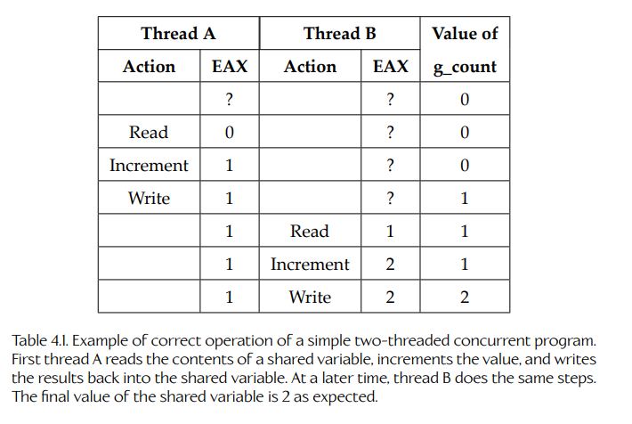
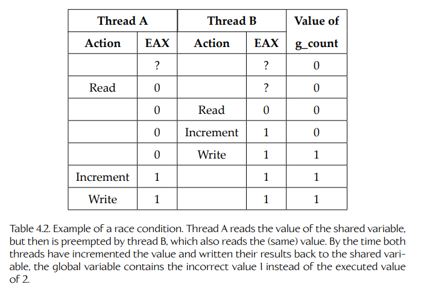
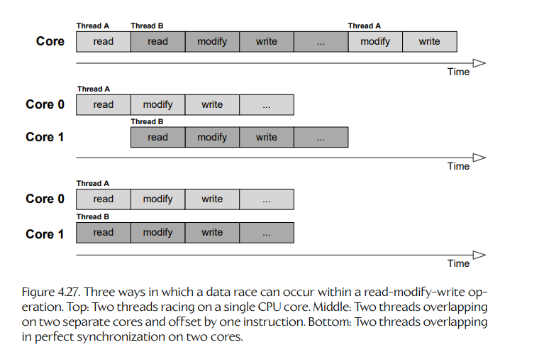
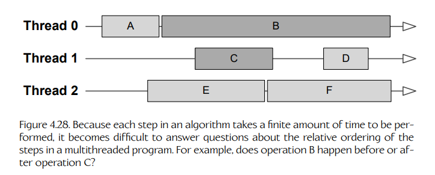
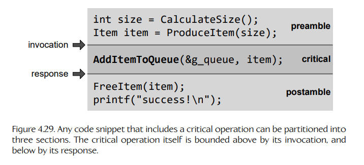
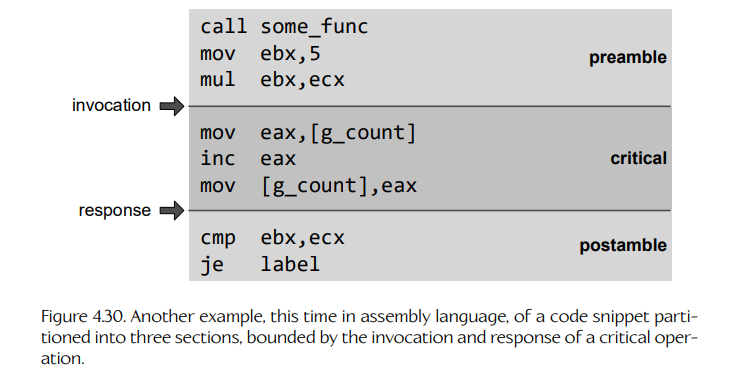
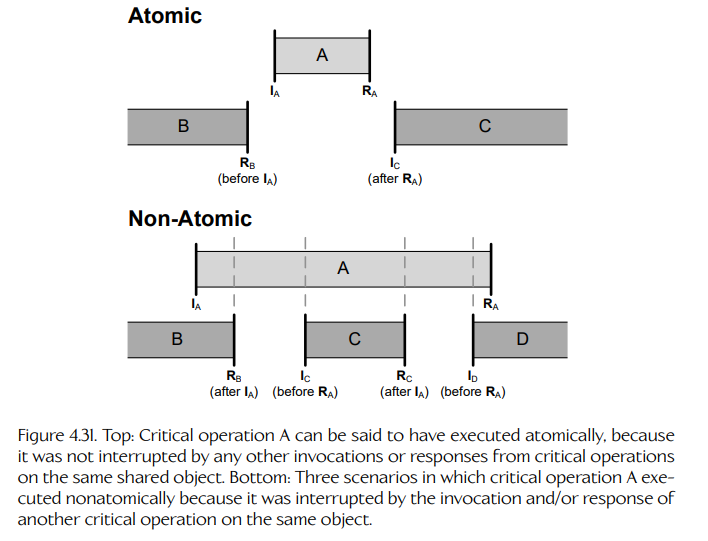
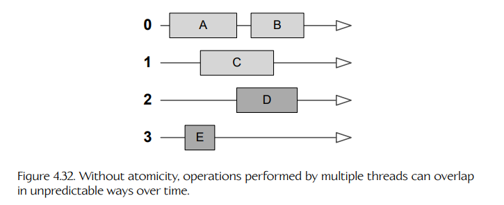
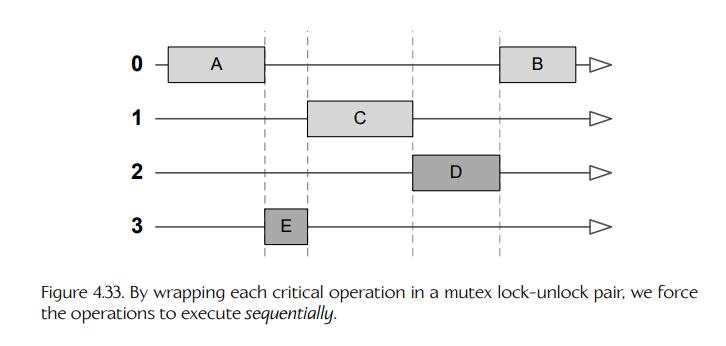

## 4.5 并发编程导论

市面上存在各种显式并行计算硬件，但作为程序员，我们该如何利用它们呢？答案在于 concurrent programming（并发编程）技术。在并发软件中，一个工作负载会被分解为两个或更多个 flows of control（控制流），这些控制流可以半独立地运行。正如我们在第 4.1 节中看到的，要使一个系统被称为并发系统，它必须涉及对 shared data（共享数据）的多个读取者和/或多个写入者。

Rob Pike 是 Google Inc. 的 Distinguished Engineer，专门研究分布式与并发系统以及编程语言。他将 concurrency（并发）定义为 “the composition of independently executing computations”（独立执行计算的组合）。这个定义强调了这样一种思想：并发系统中的多个控制流通常是半独立运行的，但它们的计算会通过 sharing data（共享数据）以及以各种方式 synchronizing（同步）操作而被组合起来。

并发可以有许多形式。一些例子包括：

- 在 Linux 或 Windows 下运行的一条管道命令链，例如：

```bash
cat render.cpp | grep "light"
```

- 一个由多个线程组成的单个进程，这些线程共享同一个虚拟内存空间，并在一个公共数据集上操作；
- 一个由数千个线程组成的线程组，运行在 GPU 上，并共同协作渲染一个场景；
- 一个多人电子游戏，在运行于多台 PC 或游戏主机上的客户端之间共享一个公共游戏状态。

### 4.5.1 为什么编写并发软件？

有时编写并发程序，是因为由多个半独立控制流组成的模型，比单一控制流设计更自然地匹配问题本身。即使手头的问题可能更适合顺序设计，也可以选择并发设计，以便更好地利用多核计算平台。

### 4.5.2 并发编程模型

为了让并发程序中的各个线程能够协作，它们需要 share data（共享数据），也需要 synchronize（同步）它们的活动。换句话说，它们需要 communicate（通信）。并发线程有两种基本通信方式：

- **Message passing（消息传递）。** 在这种通信模式下，并发线程通过在彼此之间传递消息来共享数据并同步它们的活动。消息可以通过网络发送，也可以借助 pipe（管道）在进程之间传递，或者通过内存中的 message queue（消息队列）传递，只要发送方和接收方都能访问该消息队列即可。这种方法既适用于运行在同一台计算机上的线程（无论是在单个进程内还是跨多个进程），也适用于运行在物理上不同计算机中的进程内线程（例如分布在全球各地的计算机集群或网格机器）。

- **Shared memory（共享内存）。** 在这种通信模式下，两个或更多线程被授予访问同一块物理内存的权限，因此它们可以直接操作驻留在该内存区域中的任何数据对象。直接访问共享内存只有在所有线程都运行在同一台计算机上，并且存在一块所有 CPU 核心都能 “seen”（看到）的物理 RAM 时才有效。单个进程中的线程总是共享一个 virtual address space（虚拟地址空间），因此它们可以 “免费” 共享内存。不同进程中的线程也可以通过把某些物理内存页映射到所有这些进程的虚拟地址空间中来共享内存。

有趣的是，物理上分离的计算机之间的 shared memory illusion（共享内存幻象）可以构建在消息传递系统之上，这种技术称为 distributed shared memory（分布式共享内存）。同样，也可以在共享内存架构之上实现消息传递机制，方法是在共享内存池中实现一个 message queue。

每种方法都有其优点和缺点。物理共享内存是共享大量数据最高效的方法，因为这些数据不需要在线程之间传输时被复制。另一方面，正如我们将在第 4.5.3 节和第 4.7 节中看到的，共享任何类型的资源（内存或其他资源）都会带来大量 synchronization problems（同步问题）。这些问题往往难以推理，也很难以一种能够保证程序正确性的方式处理。消息传递设计往往可以减轻这些问题的影响，但不能完全消除它们。

本书将主要关注 shared memory concurrency（共享内存并发）。这样做有两个原因：首先，作为游戏程序员，你最可能遇到的正是这种并发，因为游戏引擎通常实现为 single-process multithreaded programs（单进程多线程程序）。（联网多人游戏是这一规则的一个显著例外，因为它们大量使用消息传递。）其次，共享内存并发是一个更难理解的主题。一旦你理解了共享内存环境中的并发，消息传递技术相对来说就会容易学习得多。

### 4.5.3 竞态条件

race condition（竞态条件）被定义为这样一种情况：程序的行为依赖于 timing（时序）。换句话说，在存在 race condition 的情况下，当系统中发生的事件相对顺序发生变化时，程序的行为就可能发生变化，而这种变化来自各个控制流完成其任务所需时间长度的可变性。

#### 4.5.3.1 关键竞态

有时候，race condition 是无害的：程序行为可能会根据时序略有变化，但这种竞态不会造成不良后果。另一方面，critical race（关键竞态）是一种可能导致 incorrect program behavior（错误程序行为）的 race condition。

由 critical races 引发的 bug，对没有经验的程序员来说常常显得 “strange”（奇怪），甚至 “impossible”（不可能）。例如：

- 间歇性或看似随机的 bug 或崩溃；
- 错误结果；
- 数据结构进入损坏状态；
- 当你切换到 debug build（调试版本）时神奇消失的 bug；
- 存在一段时间后消失几天、然后又再次出现的 bug（通常是在 E3 前夜！）；
- 为了发现问题来源而给程序加入 logging（日志记录，又称 “`printf()` debugging”）后消失的 bug。

程序员通常把这类问题称为 Heisenbugs（海森堡 bug）。

#### 4.5.3.2 数据竞态

data race（数据竞态）是一种 critical race condition，其中两个或更多控制流在读取和/或写入一块 shared data（共享数据）时相互干扰，从而导致 data corruption（数据损坏）。数据竞态是并发编程的核心问题。编写并发程序最终总是归结为消除数据竞态：要么仔细控制对共享数据的访问，要么用私有的、彼此独立的数据副本替代共享数据（从而把并发问题转换为顺序编程问题）。

为了更好地理解 data races，请考虑下面这个简单的 C/C++ 代码片段：

```cpp
int g_count = 0;

inline void IncrementCount()
{
    ++g_count;
}
```

<a id="table-41"></a>


**Table 4.1.** 简单双线程并发程序正确运行的示例。首先，线程 A 读取共享变量的内容，将该值递增，然后把结果写回共享变量。稍后，线程 B 执行相同步骤。共享变量的最终值按预期为 2。

如果你为 Intel x86 CPU 编译这段代码，并查看其反汇编，它可能看起来像这样：

```asm
mov   eax,[g_count]  ; read g_count into register EAX
inc   eax            ; increment the value
mov   [g_count],eax  ; write EAX back into g_count
```

这是一个 read-modify-write（读-改-写，RMW）操作的例子。

现在想象两个线程 A 和 B 都并发地调用 `IncrementCount()` 函数（无论是在真正的并行硬件上，还是通过抢占式多线程）。在正常运行情况下，如果每个线程都恰好调用该函数一次，我们会期望 `g_count` 的最终值为 2，因为要么线程 A 先递增 `g_count`，然后线程 B 递增它，要么反过来。表 4.1 展示了这种情况。

接下来考虑这样一种情况：两个线程运行在单核机器上，并使用抢占式多任务。假设线程 A 先运行，并且刚执行完第一条 `mov` 指令时，发生了一次 context switch（上下文切换）到线程 B。于是线程 A 没有继续执行它的 `inc` 指令，而是线程 B 执行了自己的第一条 `mov` 指令。过了一会儿，线程 B 的 quantum（时间片）到期，内核 context switches 回线程 A，线程 A 从它离开的地方继续执行，并执行 `inc` 指令。表 4.2 展示了会发生什么。提示：情况很糟糕！`g_count` 的最终值不再是它应该得到的 2。

<a id="table-42"></a>


**Table 4.2.** 竞态条件示例。线程 A 读取共享变量的值，但随后被线程 B 抢占，线程 B 也读取了同一个值。等两个线程都递增该值并把结果写回共享变量时，全局变量中保存的是错误值 1，而不是期望值 2。

如果我们在并行硬件上运行这两个线程，也可能出现类似 bug，尽管理由稍有不同。和单核场景一样，我们可能会走运：两个 read-modify-write 操作可能根本不会重叠，那么结果就是正确的。然而，如果两个 read-modify-write 操作发生重叠，无论是彼此错开还是完全同步，两个线程最终都可能把同一个 `g_count` 值加载到各自的 EAX 寄存器中。二者都会递增该值，也都会把它写回内存。一个线程会覆盖另一个线程的结果，但这并不重要，因为它们都加载了同一个初始值，所以 `g_count` 的最终值会是错误的，就像单核场景中一样。图 4.27 展示了三种 data race 场景：preemption（抢占）、offset overlap（错位重叠）和 perfect synchronization（完全同步）。

<a id="figure-427"></a>


**Figure 4.27.** read-modify-write 操作中可能发生 data race 的三种方式。上：两个线程在单个 CPU 核心上竞争。中：两个线程在两个独立核心上重叠执行，并错开一个指令。下：两个线程在两个核心上完全同步地重叠执行。

<a id="figure-428"></a>


**Figure 4.28.** 因为算法中的每个步骤都需要有限时间才能完成，所以在多线程程序中回答这些步骤之间的相对顺序会变得困难。例如，操作 B 是发生在操作 C 之前还是之后？

### 4.5.4 关键操作与原子性

每当一个操作被另一个操作中断时，就可能产生 data race bug。不过，并不是所有中断都会真正导致 bug。例如，如果一个线程正在一块只能被该线程 “seen”（看到）的数据上执行操作，就不会发生 data race。这样的操作可以在任意时刻被其他任何操作中断，而不会造成后果。同样，如果一个数据对象上的操作被另一个不同对象上的操作中断，那么这两个操作也无法相互干扰，因而不可能出现 data race bug。<sup>6</sup> Data race bug 只会在一个 shared object（共享对象）上的操作被另一个作用于 same object（同一对象）的操作中断时发生。因此，只有相对于某个特定共享数据对象，我们才能有意义地讨论 data race。

> **脚注 6**：严格来说，只有当这两个对象位于不同 cache lines（缓存行）中时，这才成立。

我们使用 critical operation（关键操作）一词来指代任何可能读取或修改某个特定共享对象的操作。为了保证该共享对象不受 data race bug 影响，我们必须确保它的所有 critical operations 都不会相互中断。当一个 critical operation 以这种方式变得不可中断时，它就称为 atomic operation（原子操作）。换句话说，我们也可以说这样的操作具有 atomicity（原子性）。

#### 4.5.4.1 调用与响应

当我们最初学习编程时，通常会被教导：算法中每个步骤所需的时间与算法正确性无关，唯一重要的是这些步骤按照 proper order（正确顺序）执行。这个简单模型对 sequential（单线程）程序很有效。但在存在多个线程时，如果一组操作各自具有有限持续时间，就无法定义这些操作的 order（顺序）。这个思想如图 4.28 所示。

在并发系统中，定义 order 概念的唯一方式，是把讨论限制在 instantaneous events（瞬时事件）上。对于任意一对瞬时事件，只有三种可能：事件 A 发生在事件 B 之前，事件 A 发生在事件 B 之后，或者两个事件同时发生。（完全同时发生的事件很少见，但它们可以出现在某些核心共享同步时钟的多核计算机中。）

任何具有有限持续时间的操作都可以分解为两个瞬时事件：它的 invocation（调用，即操作开始的时刻）和 response（响应，即操作被认为已经完成的时刻）。当我们观察任何包含某个 shared data object 上 critical operation 的代码片段时，就可以把它划分为三个部分，并由瞬时的 invocation 和 response 事件标记它们之间的边界。注意，这里讨论的是事件按照它们在源代码中 written（书写）出来的顺序发生，这称为 program order（程序顺序）。

- **Preamble section（前置段）：** 在 program order 中，发生于 critical operation 的 invocation 之前的所有代码。
- **Critical section（关键段）：** 构成 critical operation 本身的代码。
- **Postamble section（后置段）：** 在 program order 中，发生于 critical operation 的 response 之后的所有代码。

图 4.29 和图 4.30 展示了这种把一个代码块划分为三个部分的概念。

<a id="figure-429"></a>


**Figure 4.29.** 任何包含 critical operation 的代码片段都可以划分为三个部分。critical operation 本身以上方的 invocation 为边界，以下方的 response 为边界。

<a id="figure-430"></a>


**Figure 4.30.** 另一个示例，这次是汇编语言代码：一个代码片段被划分为三个部分，其边界由 critical operation 的 invocation 和 response 确定。

#### 4.5.4.2 原子性的定义

正如我们在第 4.5.3.2 节中看到的，当一个 critical operation 被另一个作用于同一个 shared object 的 critical operation 中断时，就可能出现 data race bug。这可能发生在：

- 一个线程在单个核心上抢占另一个线程时；
- 两个或更多 critical operations 在多个核心上发生重叠时。

从 invocation 和 response 的角度思考，我们可以更精确地确定 interruption（中断）的一般概念：当一个操作的 invocation 和/或 response 发生在另一个操作的 invocation 与 response 之间时，就发生了 interruption。但如前所述，并不是所有 interruptions 都会导致 data race bug。某个特定 shared object 上的 critical operation 只有在它的 invocation 和 response 被另一个作用于同一个对象的 critical operation 中断时，才会受到 data race 的影响。因此，我们可以如下定义 critical operation 的 atomicity：

> 如果一个对象上的 critical operation 的 invocation 和 response 没有被另一个作用于同一对象的 critical operation 中断，那么就可以说该 critical operation 是 atomically（原子地）执行的。

需要强调的是，critical operation 被其他 noncritical operations（非关键操作）中断，或者被作用于其他无关数据对象的 critical operations 中断，都是完全没问题的。只有当两个作用于 same object（同一对象）的 critical operations 相互中断时，才会出现 data race bug。图 4.31 展示了几种情况：一种 critical operation 成功原子执行，另外三种则没有。

我们可以保证某个 critical operation 原子执行，前提是从系统中所有其他线程的角度看，它似乎发生在 instantaneously（瞬间）。换句话说，它必须看起来像该操作的 invocation 和 response 是同时发生的，或者该 critical operation 本身具有零持续时间。这样一来，就不可能有另一个 critical operation 的 invocation 或 response “sneaking in”（偷偷插入）到当前操作的 invocation 与 response 之间。

<a id="figure-431"></a>


**Figure 4.31.** 上：critical operation A 可以被认为已经原子执行，因为它没有被同一 shared object 上任何其他 critical operation 的 invocation 或 response 中断。下：critical operation A 非原子执行的三种场景，因为它被同一对象上另一个 critical operation 的 invocation 和/或 response 中断了。

#### 4.5.4.3 使操作变为原子操作

那么，如何把一个 critical operation 转换成 atomic operation 呢？最简单也最可靠的方法，是使用一个称为 mutex（互斥量）的特殊对象。mutex 是操作系统提供的对象，行为类似挂锁：线程可以对它进行 lock（加锁）和 unlock（解锁）。对于某个特定 shared data object 上的两个 critical operations，只要我们用获取 mutex 和释放 mutex 包围每个操作，就可以保证其中一个操作的 invocation 与另一个操作获取 mutex 之间，以及每个操作释放 mutex 与其 response 之间的关系。由于操作系统保证同一时刻只有一个线程能够获取某个 mutex，因此我们可以确定：一个操作的 invocation 或 response 永远不会发生在另一个操作的 invocation 与 response 之间。从并发系统中事件全局排序的角度看，被 mutex lock 保护的 critical operation 看起来就是瞬时发生的。

mutexes 属于操作系统提供的一组并发工具，这些工具称为 thread synchronization primitives（线程同步原语）。我们将在第 4.6 节中探讨线程同步原语。

#### 4.5.4.4 原子性即序列化

考虑一组线程，它们都试图对同一个 shared data object 执行某个操作。如果没有 atomicity，这些操作可能同时发生，也可能以各种不可预测的方式在时间上重叠。图 4.32 展示了这种情况。

<a id="figure-432"></a>


**Figure 4.32.** 如果没有 atomicity，多个线程执行的操作可能会以不可预测的方式在时间上重叠。

不过，使操作具有 atomicity 可以保证同一时刻永远只有一个线程在执行它。这会产生 serializing（序列化）操作的效果：原本混乱重叠的一堆操作，会被转换成有序的 atomic operations 序列。让一个操作具有 atomicity，并不能让我们控制这些操作最终以什么顺序排列；我们只能确定它们会按某种 sequential order（顺序）执行。图 4.33 展示了这一思想。

<a id="figure-433"></a>


**Figure 4.33.** 通过把每个 critical operation 包装在一对 mutex lock-unlock 操作中，我们强制这些操作 sequentially（顺序地）执行。

#### 4.5.4.5 以数据为中心的一致性模型

并发系统中的 atomicity 概念以及操作的 serialization（序列化）属于一个更大的主题，称为 data-centric consistency models（以数据为中心的一致性模型）。consistency model（一致性模型）是一种 contract（契约），存在于 data store（数据存储，例如并发系统中的共享数据对象，或分布式系统中的数据库）与一组共享该数据存储的线程之间。它使得关于数据存储行为的推理变得更容易：只要线程遵守契约规则，程序员就可以确信该数据存储会以一致且可预测的方式运行，并且其中的数据不会损坏。

一个提供 atomicity 保证的数据存储，可以说是 linearizable（线性化的）。data-centric consistency 是一个稍微超出本书范围的话题，但你可以在线阅读更多内容。这里有几个不错的入门资料：[148] 和 [149]。也可以尝试在 Wikipedia 上搜索 “consistency model” 和 “linearizability”。
