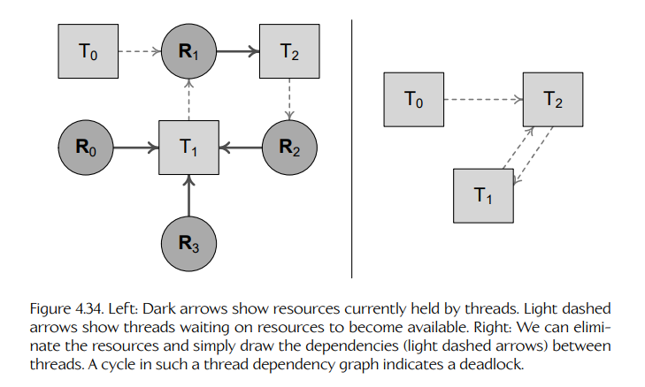

## 4.7 基于锁的并发存在的问题

在第 4.5.3.2 节中，我们了解到，data race（数据竞争）可能会在并发系统中导致不正确的程序行为。我们也看到，解决这一问题的方法是让 shared data objects（共享数据对象）上的操作变为 atomic（原子）。实现 atomicity（原子性）的一种方式，是用 locks（锁）把这些操作包裹起来，而这些锁通常使用操作系统提供的线程同步原语实现，例如 mutex。

然而，atomicity 只是并发问题的一部分。即使所有共享数据操作都已经被锁仔细保护起来，并发系统仍然可能受到其他问题的困扰。在下面几节中，我们将简要探讨其中最常见的一些问题。

### 4.7.1 死锁

Deadlock（死锁）是指系统中没有任何线程能够继续取得进展，从而导致程序 hang（挂起）的情况。当 deadlock 发生时，所有线程都处于 Blocked 状态，等待某些资源变为可用。但由于没有任何线程处于 Runnable 状态，这些资源永远不会变为可用，于是整个程序就挂起了。

要发生 deadlock，至少需要两个线程和两个资源。例如，Thread 1 持有 Resource A，但正在等待 Resource B；与此同时，Thread 2 持有 Resource B，但正在等待 Resource A。下面的代码片段展示了这种情况：

```cpp
void Thread1()
{
    g_mutexA.lock(); // holds lock for Resource A
    g_mutexB.lock(); // sleeps waiting for Resource B
    // ...
}

void Thread2()
{
    g_mutexB.lock(); // holds lock for Resource B
    g_mutexA.lock(); // sleeps waiting for Resource A
    // ...
}
```

当然，还可能发生其他更复杂的 deadlock，涉及更多线程和更多资源。但定义任何 deadlock 情况的关键因素，是线程与其资源之间存在 circular dependency（循环依赖）。

为了分析一个系统是否可能发生 deadlock，我们可以画出线程、资源以及它们之间依赖关系的图，如图 4.34 所示。在这张图中，我们用方形表示线程，用圆形表示资源（更准确地说，是保护这些资源的 mutex locks）。实线箭头连接资源与当前持有这些资源锁的线程。虚线箭头连接线程与它们正在等待的资源。为了简化图，我们实际上可以去掉资源节点，只保留连接正在等待其他线程的线程之间的虚线。如果这样的 dependency graph（依赖图）中出现 cycle（环），就说明发生了 deadlock。



其实，仅仅依赖图中存在一个 cycle，还不足以产生 deadlock。严格来说，deadlock 有四个必要且充分条件，称为 Coffman conditions（Coffman 条件）：

1. **Mutual exclusion（互斥）**。单个线程可以通过 mutex lock 获得对单个资源的独占访问权。

2. **Hold and wait（持有并等待）**。线程在进入睡眠、等待另一把锁时，必须已经持有一把锁。

3. **No lock preemption（锁不可抢占）**。任何人（甚至内核）都不能强行打破一个睡眠线程持有的锁。

4. **Circular wait（循环等待）**。线程依赖图中必须存在一个 cycle。

避免 deadlock，归根结底就是防止一个或多个 Coffman conditions 成立。由于违反条件 #1 和 #3 等同于“作弊”，解决方案通常集中在避免条件 #2 和 #4 上。

Hold and wait 可以通过减少锁的数量来避免。在我们的简单示例中，如果 Resource A 和 Resource B 都由同一把锁 L 保护，那么 deadlock 就不会发生。要么 Thread 1 获得这把锁，并在 Thread 2 等待时获得对两个资源的独占访问权；要么 Thread 2 获得这把锁，并在 Thread 1 等待时获得对两个资源的独占访问权。

Circular wait 条件可以通过对系统中的所有 lock-taking（加锁行为）施加一个 global order（全局顺序）来避免。在我们的简单双线程示例中，如果我们确保 Resource A 的锁总是在 Resource B 的锁之前获取，那么 deadlock 就可以避免。这样能起作用，是因为一个线程总会在尝试获取其他任何锁之前，先获得 Resource A 上的锁。这实际上会让所有其他竞争线程进入睡眠，从而确保随后尝试获取 Resource B 上的锁时总能成功。

### 4.7.2 活锁

deadlock 问题的另一种解决方案，是让线程尝试获取锁，但不要进入睡眠（例如使用 `pthread_mutex_trylock()` 这样的函数）。如果无法获得锁，线程就短暂睡眠一段时间，然后 retry（重试）获取锁。

当线程使用显式策略（例如 timed retries，定时重试）来避免或解决 deadlock 时，可能会出现一个新问题：线程最终可能把所有时间都花在试图解决 deadlock 上，而不是做任何真正的工作。这称为 livelock（活锁）。

作为 livelock 的简单例子，再次考虑两个线程 1 和 2 竞争两个资源 A 和 B 的情况。每当某个线程无法获得一把锁时，它就释放自己已经持有的所有锁，并等待一个固定 timeout（超时时间）后再重试。如果两个线程使用相同的 timeout，那么我们可能进入一种状态：同样的退化情况一遍又一遍地重复。线程永远“卡住”，不断试图解决冲突，但谁也没有机会完成真正的工作。Livelock 类似于国际象棋中的 stalemate（僵局）。

Livelock 可以通过使用 asymmetric deadlock resolution algorithm（非对称死锁解决算法）来避免。例如，我们可以确保当检测到 deadlock 时，只有一个线程会采取行动来解决它；这个线程可以随机选择，也可以基于 priority（优先级）选择。

### 4.7.3 饥饿

Starvation（饥饿）指的是一个或多个线程无法获得任何 CPU 执行时间的情况。当一个或多个更高优先级的线程不释放 CPU 控制权，从而阻止较低优先级线程运行时，就可能发生 starvation。Livelock 也是 starvation 的一种形式，其中 deadlock-resolution algorithm（死锁解决算法）实际上让所有线程都失去了做“真正”工作的能力。

基于 priority 的 starvation 通常可以通过确保高优先级线程不会运行太久来避免。理想情况下，一个多线程程序应由一组较低优先级线程组成，它们通常公平地共享系统的 CPU 资源。偶尔，一个较高优先级线程运行，快速处理自己的业务，然后结束，将 CPU 资源归还给较低优先级线程。

### 4.7.4 优先级反转

Mutex locks 可能导致一种称为 priority inversion（优先级反转）的情况：一个低优先级线程表现得仿佛它是系统中最高优先级的线程。考虑两个线程 L 和 H，它们分别具有低优先级和高优先级。线程 L 获取一把 mutex lock，然后被 H 抢占。如果 H 尝试获取同一把锁，那么 H 会进入睡眠，因为 L 已经持有这把锁。这就允许 L 继续运行，尽管它的优先级低于 H——这违反了较低优先级线程不应在较高优先级线程处于 runnable 状态时运行的原则。

如果一个中等优先级线程 M 在线程 L 持有 H 所需锁的时候抢占了 L，也可能发生 priority inversion。在这种情况下，L 在线程 M 运行时进入睡眠，因而无法释放锁。当 H 运行时，它因此无法获得锁；它进入睡眠，而此时 M 的优先级实际上已经与线程 H 的优先级发生了反转。

Priority inversion 的后果可能可以忽略不计。例如，如果较低优先级线程很快释放锁，那么 priority inversion 持续时间可能很短，可能不会被注意到，或者只产生轻微影响。然而，在极端情况下，priority inversion 可能导致 deadlock 或其他类型的系统故障。例如，priority inversion 可能导致一个高优先级线程错过关键 deadline（截止时间）。

Priority inversion 问题的解决方案包括：

- 避免使用可同时由低优先级线程和高优先级线程获取的锁。（这个方案通常不可行。）

- 给 mutex 本身分配非常高的 priority。任何获得该 mutex 的线程，其 priority 都会暂时提升到该 mutex 的 priority，从而确保它在持有锁期间不会被抢占。

- Random priority boosting（随机优先级提升）。在这种方法中，正在主动持有锁的线程会被随机提升 priority，直到它们退出 critical section（临界区）。Windows 调度模型使用了这种方法。

### 4.7.5 就餐哲学家问题

著名的 dining philosophers problem（就餐哲学家问题）很好地说明了 deadlock、livelock 和 starvation 的问题。它描述了这样一种情形：五位哲学家围坐在一张圆桌旁，每个人面前都有一盘意大利面。每两位哲学家之间放着一根筷子。哲学家希望在 thinking（思考，可以不需要任何筷子）和 eating（进餐，需要两根筷子）之间交替。问题是，要为哲学家定义一种行为模式，确保他们都能在 thinking 和 eating 之间交替，而不会遭遇 deadlock、livelock 或 starvation。（显然，哲学家代表线程，筷子代表 mutex locks。）

你可以在线阅读这个著名问题的更多内容，因此我们不会花太多篇幅讨论它。不过，考虑这个问题的一些最常见解决方案会很有启发性：

- **Global order（全局顺序）**。如果哲学家总是先拿起左边的筷子（或总是先拿右边的筷子），就可能出现 dependency cycle。这个问题的一种解决方案，是为每根筷子分配一个唯一的 global index。每当哲学家想吃饭时，总是先拿起 index 最低的筷子。这样可以防止 dependency cycle，从而避免 deadlock。

- **Central arbiter（中央仲裁者）**。在这个方案中，一个 central arbiter（“服务员”）要么一次性授予某个哲学家两根筷子，要么一根也不给。它通过确保没有哲学家会进入只持有一根筷子的状态来避免 hold and wait 问题，从而防止 deadlock。

- **Chandra-Misra**。在这个方案中，筷子被标记为 dirty（脏）或 clean（干净），哲学家通过互相发送消息来请求筷子。你可以在线搜索 “chandy-misra” 阅读更多关于该方案的内容。

- **N - 1 philosophers（N - 1 个哲学家）**。对于一张有 N 位哲学家和 N 根筷子的桌子，可以使用一个 integer semaphore（整数信号量）来限制任意时刻允许拿起筷子的哲学家数量，使其最多为 N - 1。这解决了 deadlock 和 livelock 问题，因为即使在退化情况下，也至少有一位哲学家能够成功获得两根筷子。不过，它确实允许某位哲学家发生 starvation，除非额外引入一个 “fairness”（公平性）标准。