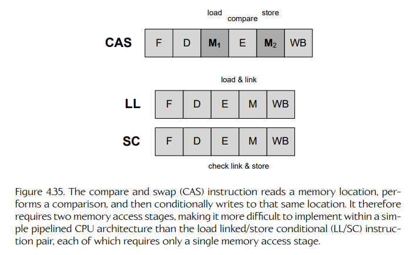
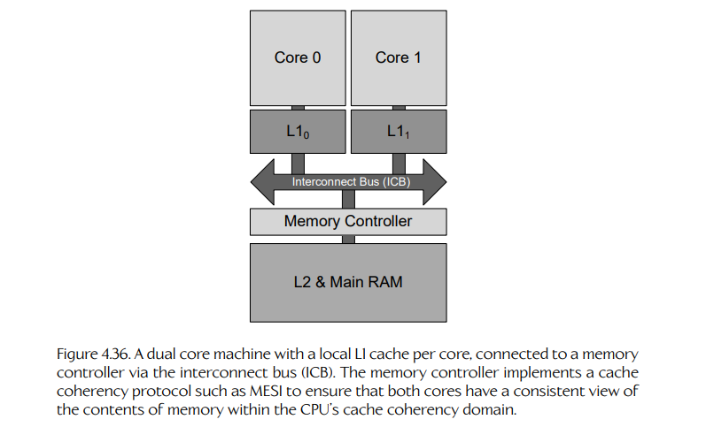
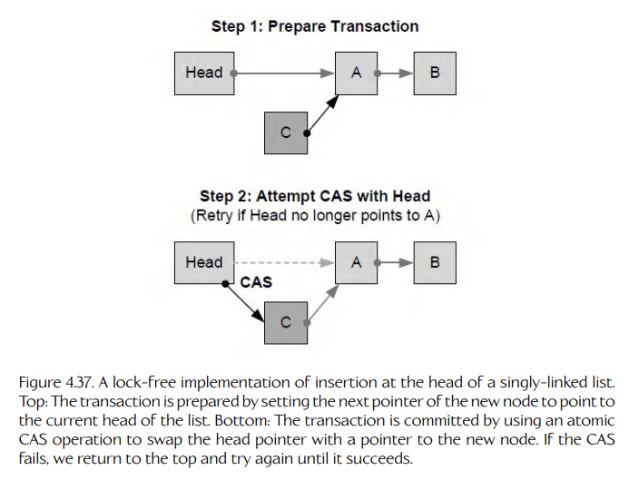

## 4.9 无锁并发

到目前为止，我们为解决并发系统中竞态条件问题所采用的所有方案，都是围绕使用 **互斥锁**（mutex locks）来让关键操作具备原子性，并且可能借助 **条件变量**（condition variables）以及内核将线程置于休眠状态的能力，避免线程在忙等循环中浪费宝贵的 CPU 周期。在前面的讨论中，我们也提到过，还有另一种避免竞态条件的方法，它有可能更加高效。这种方法被称为 **无锁并发**（lock-free concurrency）。

与人们通常的理解相反，“无锁”（lock-free）这个术语实际上并不只是指消除互斥锁，尽管这确实是该方法的一部分。事实上，“无锁”指的是这样一种实践：在线程等待某个资源变为可用时，阻止线程进入休眠状态。换句话说，在无锁编程中，我们绝不允许线程被 **阻塞**（block）。因此，也许“无阻塞”（block-free）这个名称反而更能准确描述它。

无锁编程实际上只是 **非阻塞**（non-blocking）并发编程技术集合中的一种。当线程被阻塞时，它就会停止取得进展。这些技术的共同目标，是为系统中的线程以及整个系统能够取得的 **进展**（progress）提供保证。我们可以按照它们所提供的进展保证强度从弱到强，将这些技术组织成以下类别：

- **阻塞**（Blocking）。阻塞算法是指线程在等待共享资源变为可用时，可能被置于休眠状态的算法。阻塞算法容易出现死锁、活锁、饥饿以及优先级反转等问题。

- **无阻碍性**（Obstruction freedom）。如果能够保证：当系统中的所有其他线程突然被挂起时，某个单独线程总能在有限步数内完成自己的工作，那么该算法就是无阻碍的。在这种场景下，继续运行的单个线程被称为正在执行 **独占执行**（solo execution）；无阻碍算法有时也被称为 **独占终止**（solo-terminating），因为当所有其他线程都被挂起时，这个独占线程最终会终止。任何使用互斥锁或自旋锁的算法都不可能是无阻碍的，因为如果某个持有锁的线程被挂起，那么这个独占线程就可能永远卡在等待该锁的状态中。

- **无锁性**（Lock freedom）。无锁性的技术定义是：在程序任意一个无限长的运行过程中，都会有无限多个操作被完成。直观地说，无锁算法保证系统中的 **某个** 线程总是能够取得进展；换句话说，如果一个线程被任意挂起，所有其他线程仍然能够继续取得进展。这同样排除了互斥锁或自旋锁的使用，因为如果持有锁的线程被挂起，就可能导致其他线程阻塞。无锁算法通常基于事务：如果另一个线程中断了某个事务，那么该事务可能失败，此时事务会被回滚并重试，直到成功为止。这种方法避免了死锁，但也可能导致某些线程饥饿。换言之，某些线程可能会陷入“事务不断失败并重试”的循环中，而其他线程的事务却总能成功。

- **无等待性**（Wait freedom）。无等待算法提供无锁性的所有保证，同时还保证无饥饿。也就是说，所有线程都能取得进展，并且不允许任何线程无限期地饥饿。

“无锁编程”这个术语有时会被宽泛地用于指代 **任何** 避免阻塞的算法，但从技术上讲，无阻碍算法、无锁算法和无等待算法作为一个整体，更准确的名称是 **非阻塞算法**（non-blocking algorithm）。

非阻塞算法这个主题非常庞大，并且仍然是一个开放的研究领域。如果要完整讨论这个主题，需要用整整一本书来展开。在本章中，我们将介绍无锁编程的一些基本原则。我们会先探讨数据竞态 bug 的真正成因。然后，我们会看看互斥锁在底层实际上是如何实现的，并学习如何实现自己的低成本 **自旋锁**（spin lock）。最后，我们会给出一个简单无锁链表的实现。这个讨论应该足以让你了解真实无锁数据结构和算法的大致样貌，并为你进一步阅读和实验无锁技术提供坚实的起点。

### 4.9.1 数据竞态缺陷的成因

在 4.5.3.2 节中，我们说过，当一个关键操作被另一个针对同一份共享数据的关键操作中断时，就会发生数据竞态 bug。但事实证明，数据竞态 bug 还可以通过另外两种方式出现。如果我们要实现自己的自旋锁，或者编写无锁算法，就必须理解所有这些情况。数据竞态 bug 可以通过以下方式被引入并发程序：

- 一个关键操作被另一个关键操作 **中断**；
- 编译器和 CPU 执行的 **指令重排**（instruction reordering）优化；
- 硬件特定的 **内存排序语义**（memory ordering semantics）。

我们进一步拆解这些情况：

- 由于抢占式多任务以及/或者多个核心并行运行线程，线程之间一直会彼此中断。然而，当一个关键操作被另一个作用于 **同一个** 共享数据对象的关键操作中断时，就可能发生数据竞态 bug。

- 优化编译器常常会重排指令，以尽量减少流水线停顿。同样，CPU 内部的乱序执行逻辑也可能导致指令以不同于程序顺序的次序执行。指令重排可以保证不会改变单线程程序的可观察行为。但是，它 **可能** 改变两个或更多线程协作共享数据的方式，从而把 bug 引入并发程序。

- 由于计算机内存控制器中的激进优化，一条读或写指令的 **效果** 有时会相对于系统中的其他读和/或写发生 **延迟**。与编译器优化和乱序执行（out-of-order, OOO）类似，这些内存控制器优化的设计目标也是不改变单线程程序的可观察行为。然而，这些优化 **可能** 改变并发系统中一对关键读和/或写的顺序，从而阻止线程以可预测的方式共享数据。在本书中，我们会把这类并发 bug 称为 **内存排序 bug**（memory ordering bugs）。

为了保证某个关键操作不发生数据竞态，并因此具备原子性，我们必须确保上述三种情况都不会发生。

### 4.9.2 实现原子性

首先，我们来处理如何让关键操作具备原子性，即不可被中断的问题。此前，我们只是简单地说，通过把关键操作包裹在一个互斥锁的加锁/解锁对中，就可以神奇地把它们转换成原子操作。但是，互斥锁到底是如何工作的呢？

#### 4.9.2.1 通过禁用中断实现原子性

为了防止其他线程中断我们的操作，我们可以尝试在执行操作之前立即禁用中断，并确保操作完成后重新启用中断。这样当然可以防止内核在原子操作执行到一半时上下文切换到另一个线程。然而，这种方法只适用于使用抢占式多任务的单核机器。

中断是通过执行一条机器语言指令来禁用的，例如 Intel x86 架构上的 `cli`，即“清除中断使能位”（clear interrupt enable bit）。但是这类指令只会影响执行它的那个核心。其他核心仍然会继续运行它们的线程，并且这些核心上的中断以及抢占式多线程仍然处于启用状态，因此那些线程仍然可以中断我们的操作。所以，这种方法在现实世界中适用范围非常有限。

#### 4.9.2.2 原子指令

“原子”（atomic）这个术语暗含这样一种概念：把一个操作不断分解成越来越小的部分，直到达到不可再分的粒度。这个想法引出了一个问题：是否存在天然具备原子性的机器语言指令？换句话说，CPU 是否保证某些指令不可被中断？

这些问题的答案是“是”，但有一些注意事项。确实有一些机器语言指令 **永远不能** 被假定为原子执行。另一些指令是原子的，但只是在作用于某些特定类型的数据时才是原子的。有些 CPU 允许通过在汇编语言指令前指定一个前缀，强制几乎任意指令以原子方式执行。（Intel x86 ISA 中的 `lock` 前缀就是一个例子。）

这对并发程序员来说是个好消息。事实上，正是这些 **原子指令** 的存在，使我们能够实现互斥锁、自旋锁等原子性工具，进而允许我们把更大规模的操作变成原子操作。

不同 CPU 和 ISA 提供不同集合的原子指令，并且受不同规则约束。不过，我们可以把所有原子指令概括为两大类：

- 原子读和原子写；
- 原子读-改-写（read-modify-write, RMW）指令。

#### 4.9.2.3 原子读和写

在大多数 CPU 上，我们可以比较有把握地认为，对一个按 4 字节对齐的 32 位整数进行读或写是原子的。也就是说，每个处理器都不同，所以在依赖任何特定指令的原子性之前，始终查阅你的 CPU 的 ISA 文档非常重要。

有些 CPU 也支持对更小或更大的对象执行原子读和写，例如单字节对象或 64 位整数；同样前提是它们按照自身大小的倍数进行了对齐。这是因为在大多数 CPU 上，读取和写入一个已对齐整数时，如果该整数的位宽等于或小于寄存器宽度，或者有时小于等于缓存行宽度，就可以在一次 **内存访问周期**（memory access cycle）中完成。由于 CPU 的操作与离散时钟同步执行，一个内存周期不能被中断，即使另一个核心也无法中断它。因此，这次读或写实际上就是原子的。

未对齐的读和写通常不具备这种原子性。这是因为为了读取或写入一个未对齐对象，CPU 通常需要组合两次已对齐的内存访问。因此，读或写可能会被中断，我们不能假定它一定是原子的。（关于对齐的更多细节，请参见 3.3.7.1 节。）

#### 4.9.2.4 原子读-改-写

单靠原子读和原子写，并不足以在一般意义上实现原子操作。为了实现像互斥锁这样的锁机制，我们需要能够从内存中读取某个变量的内容，对该变量执行某种操作，然后再把结果写回内存，并且这一切都不能被中断。

所有现代 CPU 都通过提供至少一种原子读-改-写（RMW）指令来支持并发。在接下来的几个小节中，我们会看看几种不同类型的原子 RMW 指令。每种指令都有各自的优缺点。它们都可以用来实现互斥锁或自旋锁。

#### 4.9.2.5 测试并置位

最简单的 RMW 指令被称为 **测试并置位**（test-and-set, TAS）。TAS 指令实际上并不是“测试并设置一个值”。相反，它会以原子方式把一个布尔变量设置为 1（true），并返回它的 **旧值**，这样这个值就可以被测试。

```cpp
// test-and-set 指令的伪代码
bool TAS(bool* pLock)
{
    // 以原子方式执行……
    const bool old = *pLock;
    *pLock = true;
    return old;
}
```

test-and-set 指令可以用来实现一种简单的锁，称为 **自旋锁**（spin lock）。下面是说明这一思路的一些伪代码。在这个例子中，我们使用一个假想的 **编译器内建函数**（compiler intrinsic）`_tas()`，把 TAS 机器语言指令发射到代码中。如果目标 CPU 支持这条指令，不同编译器会为它提供不同的内建函数。例如，在 Visual Studio 中，TAS 内建函数名为 `_interlockedbittestandset()`。

```cpp
void SpinLockTAS(bool* pLock)
{
    while (_tas(pLock) == true)
    {
        // 其他线程持有锁——忙等……
        PAUSE();
    }

    // 执行到这里时，我们知道自己已经成功地
    // 向 *pLock 中存入了 true，并且它之前包含 false，
    // 所以没有其他线程持有这把锁——完成
}
```

这里，`PAUSE()` 宏表示使用某种编译器内建函数，例如 Intel 的 SSE2 `_mm_pause()`，以减少忙等循环中的功耗。关于为什么在忙等循环中尽可能使用 pause 指令是明智的，请参见 4.4.6.4 节。

这里需要强调的是，上面的例子仅用于说明。它并不是 100% 正确的，因为它缺少合适的内存栅栏。我们将在 4.9.7 节给出一个完整可工作的自旋锁示例。

#### 4.9.2.6 交换

某些 ISA，例如 Intel x86，提供一条原子 **交换**（exchange）指令。这条指令会交换两个寄存器的内容，或者交换一个寄存器和内存中某个位置的内容。在 x86 上，当交换寄存器和内存时，它默认就是原子的，也就是说它的行为就像该指令前面带有 `lock` 前缀一样。

下面展示如何使用原子 exchange 指令实现一个自旋锁。在这个例子中，我们使用 Visual Studio 的 `_InterlockedExchange()` 编译器内建函数，把 Intel x86 的 `xchg` 指令发射到代码中。（同样注意，如果没有正确的内存栅栏，这个例子是不完整的，无法可靠工作。完整实现请参见 4.9.7 节。）

```cpp
void SpinLockXCHG(bool* pLock)
{
    bool old = true;
    while (true)
    {
        // 针对 8 位字发射 xchg 指令
        _InterlockedExchange8(old, pLock);
        if (!old)
        {
            // 如果取回 false，
            // 说明加锁成功
            break;
        }
        PAUSE();
    }
}
```

在 Microsoft Visual Studio 中，所有以下划线开头命名的 “interlocked” 函数都是 **编译器内建函数**，它们只是把合适的汇编语言指令直接发射到你的代码中。Windows SDK 提供了一组命名相似但 **不带** 前导下划线的函数。这些函数会尽可能以内建函数的形式实现，但由于它们涉及一次内核调用，所以开销要大得多。

#### 4.9.2.7 比较并交换

有些 CPU 提供一种称为 **比较并交换**（compare-and-swap, CAS）的指令。这条指令会检查某个内存位置中的已有值，并且 **当且仅当** 这个已有值与程序员提供的期望值匹配时，才以原子方式把它交换成一个新值。如果操作成功，它返回 true，表示该内存位置包含的是期望值。如果操作失败，它返回 false，因为该位置的内容并不是期望值。

CAS 可以作用于比布尔值更大的值。通常至少会为 32 位和 64 位整数提供 CAS 变体，尽管更小的字大小也可能被支持。

CAS 指令的行为可以用下面的伪代码表示：

```cpp
// compare and swap 的伪代码
bool CAS(int* pValue, int expectedValue, int newValue)
{
    // 以原子方式执行……
    if (*pValue == expectedValue)
    {
        *pValue = newValue;
        return true;
    }
    return false;
}
```

为了使用 CAS 实现任意原子读-改-写操作，我们通常采用以下策略：

1. 读取我们试图更新的变量的旧值。
2. 按照需要修改该值。
3. 写入结果时，使用 CAS 指令，而不是普通写入。
4. 不断迭代，直到 CAS 成功。

CAS 指令允许我们通过比较写入时内存位置中 **实际存在的值** 与调用读-改-写操作之前的值，来检测数据竞态。在没有竞态的情况下，CAS 指令的行为就像普通写指令一样。但是，如果读和写之间内存中的值发生变化，我们就知道有其他线程抢先一步完成了操作。这时，我们退避并重试。

通过 compare-and-swap 实现自旋锁大致如下，这里同样使用一个假想的编译器内建函数 `_cas()` 来发射 CAS 指令。（这个例子同样省略了让它在所有硬件上可靠工作所需的内存栅栏。完整可用的自旋锁请参见 4.9.7 节。）

```cpp
void SpinLockCAS(int* pValue)
{
    const int kLockValue = -1; // 0xFFFFFFFF
    while (!_cas(pValue, 0, kLockValue))
    {
        // 一定已经被其他线程锁住了——重试
        PAUSE();
    }
}
```

下面是使用 CAS 实现原子递增的方法。

```cpp
void AtomicIncrementCAS(int* pValue)
{
    while (true)
    {
        const int oldValue = *pValue; // 原子读
        const int newValue = oldValue + 1;
        if (_cas(pValue, oldValue, newValue))
        {
            break; // 成功！
        }
        PAUSE();
    }
}
```

在 Intel x86 ISA 上，CAS 指令称为 `cmpxchg`，并且可以通过 Visual Studio 的 `_InterlockedCompareExchange()` 编译器内建函数发射出来。

#### 4.9.2.8 ABA 问题

我们应该提到，CAS 指令无法检测某一种特定的数据竞态。设想一个原子 RMW 写操作，其中读操作读到了值 A。在我们能够发出 CAS 指令之前，另一个线程抢占了我们，或者运行在另一个核心上，并向我们试图原子更新的位置写入了两个值：首先写入 B，然后再次写入 A。当我们的 CAS 指令最终执行时，它无法区分它最初读取的那个 A 和另一个线程写入的 A。因此，它会“认为”没有发生数据竞态，但实际上发生了。这被称为 **ABA 问题**（ABA problem）。

#### 4.9.2.9 加载链接/条件存储

有些 CPU 会把 compare-and-swap 操作拆分成一对指令，称为 **加载链接**（load linked）和 **条件存储**（store conditional），即 LL/SC。load linked 指令会以原子方式读取某个内存位置的值，同时把该地址存入一个称为 **链接寄存器**（link register）的特殊 CPU 寄存器中。store conditional 指令会向给定地址写入一个值，但只有当该地址与链接寄存器中的内容匹配时才会写入。如果写入成功，它返回 true；如果失败，则返回 false。

总线上的 **任何** 写操作，包括 store conditional，都会把链接寄存器清零。这意味着一对 LL/SC 指令能够检测数据竞态，因为如果在 LL 和 SC 指令之间发生了任何写操作，SC 就会失败。

LL/SC 指令对的使用方式与普通读操作配合 CAS 指令的方式非常相似。具体来说，一个原子读-改-写操作可以使用以下策略实现：

1. 通过 LL 指令读取变量的旧值。
2. 按照需要修改该值。
3. 使用 SC 指令写入结果。
4. 不断迭代，直到 SC 成功。

下面是我们如何使用 LL/SC 实现原子递增的例子。这里使用假想的编译器内建函数 `_ll()` 和 `_sc()`，分别发射 LL 和 SC 指令：

```cpp
void AtomicIncrementLLSC(int* pValue)
{
    while (true)
    {
        const int oldValue = _ll(*pValue);
        const int newValue = oldValue + 1;
        if (_sc(pValue, newValue))
        {
            break; // 成功！
        }
        PAUSE();
    }
}
```



**Figure 4.35.** compare-and-swap（CAS）指令会读取一个内存位置、执行比较，然后有条件地向同一位置写入。因此，它需要两个内存访问阶段，这使得它比 load-linked/store-conditional（LL/SC）指令对更难在简单流水线 CPU 架构中实现；LL/SC 指令对中的每条指令都只需要一个内存访问阶段。

由于链接寄存器会被总线上的 **任何** 写操作清零，SC 指令可能会出现伪失败。但这并不会影响用 LL/SC 实现的原子 RMW 的正确性，它只意味着我们的忙等循环可能会比预期多执行几次迭代。

#### 4.9.2.10 LL/SC 相比 CAS 的优势

LL/SC 指令对相比单条 CAS 指令有两个明显优势。

首先，由于只要总线上执行了 **任何** 写操作，SC 指令就会失败，因此 LL/SC 指令对不容易受到 ABA 问题影响。

其次，LL/SC 指令对比 CAS 指令更适合流水线。最简单的流水线由五个阶段组成：取指、译码、执行、内存访问和寄存器写回。但是 CAS 指令需要两个内存访问周期：一次读取内存位置，以便与期望值比较；另一次在比较通过时写入结果。这意味着支持 CAS 的流水线必须包含一个额外的内存访问阶段，而这个阶段在大多数时候都处于未使用状态。另一方面，LL 和 SC 指令各自只需要一个内存访问周期，因此它们能够更自然地适配只有一个内存访问阶段的流水线。从流水线角度比较 CAS 和 LL/SC，如图 4.35 所示。

#### 4.9.2.11 强比较交换与弱比较交换

C++11 标准库提供了用于执行原子 compare-exchange 操作的可移植函数。在某些目标硬件上，这些函数可能由 CAS 指令实现；在另一些硬件上，则可能由 LL/SC 指令对实现。由于 store-conditional 指令可能出现伪失败，C++11 提供了两种 compare-exchange 变体：强版本和弱版本。强 compare-exchange 会向程序员“隐藏”伪 SC 失败，而弱 compare-exchange 不会。你可以在线搜索 “Strong Compare and Exchange Lawrence Crowl”，阅读一篇解释 C++11 中强、弱 compare-exchange 函数设计依据的论文。

#### 4.9.2.12 原子 RMW 指令的相对强度

有趣的是，从在并发系统中让多个线程达成 **共识**（consensus）的能力来看，TAS 指令比 CAS 和 LL/SC 指令更弱。这里的共识指的是，即使系统中的某些线程发生故障，线程之间仍然能就某个共享变量的值达成一致。

由于 TAS 指令只能作用于布尔值，它只能为两个并发线程解决一个称为 **无等待共识问题**（wait-free consensus problem）的问题。CAS 指令作用于 32 位值，因此它可以为任意数量的线程解决这个问题。

无等待共识这个主题远远超出了我们的范围；它主要在构建容错系统时才有意义。如果你对容错感兴趣，可以在 Wikipedia 上搜索 “consensus (computer science)” 来进一步了解共识问题。

### 4.9.3 栅栏

中断并不是数据竞态 bug 的唯一来源。编译器和 CPU 也会通过它们执行的 **指令重排** 优化，在我们的并发程序中合谋引入隐蔽的 bug，正如 4.2.5.1 节所述。

编译器优化和乱序执行的根本规则是：它们的优化不应对 **单个线程** 的行为产生可见影响。然而，编译器和 CPU 的控制逻辑都不知道系统中的其他线程可能正在运行什么，也不知道它们可能正在做什么。因此，这条根本规则不足以防止指令重排优化把 bug 引入并发程序。

操作系统提供的线程同步原语，例如互斥锁等，都经过精心设计，以避免由指令重排优化导致的并发 bug。但现在既然我们正在研究互斥锁是如何实现的，那就来看看如何手动避免这些问题。

#### 4.9.3.1 指令重排如何导致并发缺陷

作为指令重排可能在并发软件中导致问题的例子，我们再次考虑 4.6.3 节中的生产者-消费者问题。我们对这个例子进行了简化，并移除了互斥锁，这样就能暴露由指令重排引入的 bug。

```cpp
int32_t   g_data = 0;
int32_t   g_ready = 0;

void ProducerThread()
{
    // 生成一些数据
    g_data = 42;

    // 通知消费者
    g_ready = 1;
}

void ConsumerThread()
{
    // 等待数据准备好
    while (!g_ready)
        PAUSE();

    // 消费数据
    ASSERT(g_data == 42);
}
```

在一个对齐的 32 位整数读写具备原子性的 CPU 上，这个例子实际上不需要互斥锁。然而，没有任何东西能阻止编译器或 CPU 的乱序执行逻辑重排生产者对 `g_ready` 写入 1 的操作，使其发生在向 `g_data` 写入 42 之前。同样，从理论上讲，编译器也可以重排消费者检查 `g_data` 是否等于 42 的操作，使其发生在 while 循环之前。因此，即使所有读写都是原子的，它们仍然可能出现可观察的乱序。

指令重排实际上发生在汇编语言层面，因此它可能比 C/C++ 程序中语句重排要微妙得多。例如，下面的 C/C++ 代码：

```cpp
A = B + 1;
B = 0;
```

会产生下面的 Intel x86 汇编代码：

```asm
mov  eax,[B]
add  eax,1
mov  [A],eax
mov  [B],0
```

编译器完全可以按如下方式重排指令，而且不会对单线程执行产生任何可察觉的影响：

```asm
mov  eax,[B]
mov  [B],0  ;; 先写 B，再写 A！
add  eax,1
mov  [A],eax
```

如果第二个线程正在等待 B 变成零，然后再读取 A 的值，那么一旦应用这种编译器优化，它就无法正确工作。

Jeff Preshing 曾就这个主题写过一篇非常好的博客文章，可在 [152] 中找到。（上面的汇编语言例子正是来自那里。）我强烈推荐 Jeff 关于并发编程的所有文章，所以一定要去看看。

#### 4.9.3.2 C/C++ 中的 volatile，以及它为什么帮不上忙

我们如何防止编译器重排关键的读写序列？在 C 和 C++ 中，`volatile` 类型限定符保证对一个变量的连续读或写不会被编译器“优化掉”，因此听起来似乎是一个很有希望的想法。然而，由于若干原因，它并不能可靠地工作。

C/C++ 中的 `volatile` 限定符实际上是为保证内存映射 I/O 和信号处理器可靠工作而设计的。因此，它提供的唯一保证是：标记为 `volatile` 的变量的内容不会被缓存在寄存器中；每次访问该变量时，都会直接从内存中重新读取它的值。有些编译器确实保证指令不会跨越对 `volatile` 变量的读或写而重排，但并非所有编译器都这样做，而且有些编译器只在面向特定 CPU 时提供这种保证，或者只有在向编译器传入某个特定命令行选项时才提供这种保证。C 和 C++ 标准并不要求这种行为，因此我们在编写可移植代码时当然不能依赖它。（关于这个主题的深入讨论，请参见 [154]。）

此外，C/C++ 中的 `volatile` 关键字 **不会** 阻止 CPU 的乱序执行逻辑在运行时重排指令。它也不能防止与缓存一致性相关的问题（见 4.9.4.2 节）。所以，至少在 C 和 C++ 中，`volatile` 关键字并不能帮助我们编写可靠的并发软件。<sup>8</sup>

> **脚注 8**：在包括 Java 和 C# 在内的一些语言中，`volatile` 类型限定符确实保证原子性，并且可以用于实现并发数据结构和算法。关于这个主题的更多内容，请参见 4.9.6 节。

#### 4.9.3.3 编译器栅栏

防止编译器跨越关键操作边界重排读写指令的一种可靠方式，是显式指示它不要这样做。这可以通过向代码中插入一种称为 **编译器栅栏**（compiler barrier）的特殊伪指令来实现。

不同编译器使用不同语法来表达栅栏。在 GCC 中，可以通过如下所示的某种内联汇编语法插入编译器栅栏；在 Microsoft Visual C++ 中，编译器内建函数 `_ReadWriteBarrier()` 具有相同效果。

```cpp
int32_t   g_data = 0;
int32_t   g_ready = 0;

void ProducerThread()
{
    // 生成一些数据
    g_data = 42;

    // 亲爱的编译器，请不要把指令重排到
    // 这个栅栏两侧！
    asm volatile("" ::: "memory")

    // 通知消费者
    g_ready = 1;
}

void ConsumerThread()
{
    // 等待数据准备好
    while (!g_ready)
        PAUSE();

    // 亲爱的编译器，请不要把指令重排到
    // 这个栅栏两侧！
    asm volatile("" ::: "memory")

    // 消费数据
    ASSERT(g_data == 42);
}
```

还有其他方式可以防止编译器重排指令。例如，大多数函数调用都会作为隐式编译器栅栏。这是合理的，因为编译器并不知道一个函数调用的副作用是什么。<sup>9</sup> 因此，它不能假定调用前后的内存状态相同，这意味着大多数优化都不允许跨越函数调用。有些优化编译器会对内联函数例外处理。

> **脚注 9**：只有当编译器无法“看到”函数定义时，函数调用才会作为隐式栅栏，例如当函数定义在单独的翻译单元中时。链接时优化（link time optimization, LTO）可能会引入并发 bug，因为它为编译器优化器提供了一种看到原本看不到的函数定义的方式，从而实际上消除了这些隐式栅栏。

遗憾的是，编译器栅栏并不能阻止 CPU 的乱序执行逻辑在运行时重排指令。某些 ISA 提供了专门用于这一目的的特殊指令，例如 PowerPC 的 `isync` 指令。在 4.9.4.5 节中，我们将学习一组称为 **内存栅栏**（memory fences）的机器语言指令，它们既可以作为编译器和 CPU 的指令重排栅栏，更重要的是，还可以防止 **内存重排** bug。因此，要编写可靠的互斥锁、自旋锁以及其他无锁算法，原子指令和栅栏就是我们真正需要的全部内容。

### 4.9.4 内存排序语义

在 4.9.1 节中，我们说过，除了编译器或 CPU 实际重排程序中的机器语言指令之外，在并发系统中，读和写指令也可能被 **有效地重排**。具体来说，在一台带有多级内存缓存的多核机器中，两个或更多核心有时可能会对一组读写指令发生的表面顺序产生分歧，即使这些指令实际上是按照我们预期的顺序执行的。显然，这种分歧可能在并发软件中导致微妙的 bug。

这些神秘且令人困惑的问题只会发生在带有多级缓存的多核机器上。单个 CPU 核心总是会按照自己执行读写指令的顺序“看到”这些指令的效果；只有当存在两个或更多核心时，分歧才会出现。而且，不同 CPU 具有不同的内存排序行为，这意味着在运行完全相同的源程序时，这些奇怪的效果可能因机器而异！

幸运的是，情况并非无解。每个 CPU 都受一组严格规则约束，这组规则称为它的 **内存排序语义**（memory ordering semantics）。这些规则为读写如何在核心之间传播提供各种保证，并且当默认语义不足时，它们也为程序员提供了强制特定顺序所需的工具。

有些 CPU 默认只提供较弱的保证，而另一些 CPU 提供更强的保证，因此程序员需要进行的干预更少。所以，如果我们能够理解如何在内存排序语义最弱的 CPU 上克服内存排序问题，就可以相当确信这些技术也适用于默认语义更强的 CPU。

#### 4.9.4.1 重新审视内存缓存

为了理解这些神秘的内存重排效果如何发生，我们需要更仔细地看看多级内存缓存的工作方式。

在 3.5.4 节中，我们详细描述过，内存缓存通过把常用数据保存在缓存中，来避免主 RAM 极高的内存访问延迟。这意味着只要某个数据对象存在于缓存中，CPU 就总是会尝试使用那份缓存副本，而不是访问主 RAM 中的副本。

我们通过考虑下面这个简单且完全人为构造的函数，来简要回顾一下它的工作方式：

```cpp
constexpr int     COUNT = 16;
alignas(64) float g_values[COUNT];
float             g_sum = 0.0f;

void CalculateSum()
{
    g_sum = 0.0f;
    for (int i = 0; i < COUNT; ++i)
    {
        g_sum += g_values[i];
    }
}
```

第一条语句把 `g_sum` 设置为零。假设 `g_sum` 的内容尚未存在于 L1 缓存中，那么包含它的缓存行会在此时被读入 L1。同样，在循环的第一次迭代中，包含 `g_values` 数组全部元素的缓存行会被加载到 L1 中。（它们应该都能放进去，前提是我们的缓存行至少有 64 字节宽，因为我们使用 C++11 的 `alignas` 说明符把数组对齐到了 64 字节边界。）后续迭代会读取位于 L1 缓存中的 `g_values` 副本，而不是从主 RAM 中读取它们。

每次迭代期间，`g_sum` 都会被更新。编译器可能通过把求和结果保存在寄存器中直到循环结束来优化这一点。但无论是否执行了这种优化，我们都知道 `g_sum` 变量会在这个函数执行期间的某个时刻被写入。当这发生时，CPU 同样会写入 L1 缓存中存在的那份 `g_sum` 副本，而不是直接写入主 RAM。

当然，最终 `g_sum` 的“主”副本必须被更新。内存缓存硬件会通过触发一次 **写回**（write-back）操作自动完成这件事，将缓存行从 L1 拷贝回主 RAM。不过，写回通常不会立刻发生；它一般会被推迟到这个被修改过的变量再次被读取时才发生。<sup>10</sup>

> **脚注 10**：有些内存缓存硬件确实允许缓存写入立即 **直写**（write-through）到主 RAM 中。就当前讨论而言，我们可以安全地忽略直写缓存。

#### 4.9.4.2 多核缓存一致性协议

在多核机器中，内存缓存会复杂得多。图 4.36 展示了一台简单的双核机器，其中每个核心都有自己的私有 L1 缓存，两个核心共享一个 L2 缓存和一大块主 RAM。为了让接下来的讨论尽可能简单，我们忽略 L2 缓存，并把它视为大致等价于主 RAM。



**Figure 4.36.** 一台双核机器，每个核心都有一个本地 L1 缓存，并通过互连总线（interconnect bus, ICB）连接到内存控制器。内存控制器实现某种缓存一致性协议，例如 MESI，以确保两个核心在 CPU 的缓存一致性域内，对内存内容拥有一致的视图。

假设 4.9.3.3 节中展示的简化生产者-消费者例子正在这台双核机器上运行。生产者线程运行在核心 1 上，消费者线程运行在核心 2 上。为了讨论方便，我们进一步假设两个线程中的任何指令都没有被重排。

```cpp
int32_t   g_data = 0;
int32_t   g_ready = 0;

void ProducerThread() // 运行在 Core 1 上
{
    g_data = 42;
    // 假设这一行两侧没有指令重排
    g_ready = 1;
}

void ConsumerThread() // 运行在 Core 2 上
{
    while (!g_ready)
        PAUSE();
    // 假设这一行两侧没有指令重排
    ASSERT(g_data == 42);
}
```

现在考虑生产者（位于 Core 1）写入 `g_ready` 时会发生什么。为了提高效率，这次写入会导致 Core 1 的 L1 缓存被更新，但它不会立即触发对主 RAM 的写回。也就是说，在写入发生之后的一段有限时间内，`g_ready` 的最新值只存在于 Core 1 的 L1 缓存中。

假设消费者（运行在 Core 2 上）在生产者把 `g_ready` 设置为 1 之后的某个时刻尝试读取 `g_ready`。与 Core 1 一样，只要可能，Core 2 更愿意从缓存读取，以避免读取主 RAM 的高昂成本。Core 2 的本地 L1 缓存中没有 `g_ready` 的副本，但 Core 1 的 L1 缓存中有。因此，理想情况下，Core 2 希望向 Core 1 请求它的副本，因为这仍然比从主 RAM 中获取数据便宜得多。而在这个特定场景中，这样做还有一个明显优势：它会返回最新的值。

**缓存一致性协议**（cache coherency protocol）是一种通信机制，允许核心以这种方式在它们的本地 L1 缓存之间共享数据。大多数 CPU 使用 MESI 或 MOESI 协议。

#### 4.9.4.3 MESI 协议

在 MESI 协议下，每个缓存行都可以处于以下四种状态之一：

- **Modified**。这个缓存行已经在本地被修改过，即被写入过。
- **Exclusive**。与该缓存行对应的主 RAM 内存块只存在于这个核心的 L1 缓存中，没有其他核心拥有它的副本。
- **Shared**。与该缓存行对应的主 RAM 内存块存在于多个核心的 L1 缓存中，并且所有核心都拥有它的相同副本。
- **Invalid**。这个缓存行不再包含有效数据；下一次读取时，需要从另一个核心的 L1 缓存或主 RAM 中获取该缓存行。

MOESI 协议额外添加了一个称为 **Owned** 的状态，它允许核心在不先写回主 RAM 的情况下共享已修改的数据。为简化起见，我们这里将重点讨论 MESI。

在 MESI 协议下，所有核心的 L1 缓存都通过一条称为 **互连总线**（interconnect bus, ICB）的特殊总线连接在一起。所有 L1 缓存、更高层级缓存以及主 RAM 共同构成所谓的 **缓存一致性域**（cache coherency domain）。协议确保所有核心都对该域中的数据拥有一致的“视图”。

我们可以回到前面的例子，感受一下 MESI 状态机是如何工作的。

- 假设 Core 1（生产者）首先因为某种原因尝试读取 `g_ready` 的当前值。假设这个变量尚不存在于任何核心的 L1 缓存中，那么包含它的缓存行会被加载到 Core 1 的 L1 缓存中。该缓存行被置于 Exclusive 状态，表示没有其他核心拥有这条缓存行。

- 现在假设 Core 2（消费者）尝试读取 `g_ready`。一个 Read 消息会通过 ICB 发送出去。Core 1 拥有这条缓存行，因此它会响应一份数据副本。此时，这条缓存行在两个核心上都被置于 Shared 状态，表示二者拥有这条缓存行的相同副本。

- 接下来，Core 1 上的生产者向 `g_ready` 写入 1。这会更新 Core 1 的 L1 缓存中的值，并把它的这份缓存行副本置于 Modified 状态。随后，一个 Invalidate 消息会通过 ICB 发送出去，使 Core 2 的这份缓存行副本被置于 Invalid 状态。这表示 Core 2 中包含 `g_ready` 的缓存行副本已经不再是最新的。

- 下一次 Core 2（消费者）尝试读取 `g_ready` 时，它会发现本地缓存的副本处于 Invalid 状态。它会通过 ICB 发送一个 Read 消息，并从 Core 1 的 L1 缓存中获得新修改过的缓存行。这会导致两个核心的缓存行再次被置于 Shared 状态。同时，这也会触发该缓存行向主 RAM 的一次写回。

对 MESI 协议的完整讨论超出了本书范围，但这个例子应该足以让你直观理解它如何允许多个核心在各自的 L1 缓存之间共享数据，同时尽量减少对主 RAM 的访问。

#### 4.9.4.4 MESI 如何出错

基于上一节对 MESI 协议的讨论，看起来多核机器中 L1 缓存之间的数据共享问题似乎已经被解决得滴水不漏。那么，我们之前暗示过的内存排序 bug 又是怎么实际发生的呢？

这个问题可以用一个词回答：优化。在大多数硬件上，MESI 协议都经过高度优化以最小化延迟。这意味着当通过 ICB 接收到消息时，某些操作实际上不会立即执行。相反，它们会被延迟以节省时间。与编译器优化和 CPU 乱序执行优化一样，MESI 优化经过精心设计，使其不会被单个线程察觉。但如你所料，并发程序再一次成为受害者。

例如，我们的生产者（运行在 Core 1 上）向 `g_data` 写入 42，然后立即向 `g_ready` 写入 1。在某些情况下，MESI 协议中的优化可能导致 `g_ready` 的新值先于 `g_data` 的更新值，在缓存一致性域内对其他核心变得可见。比如，如果 Core 1 的本地 L1 缓存中已经有 `g_ready` 的缓存行，但没有 `g_data` 的缓存行，就可能发生这种情况。这意味着消费者（位于 Core 2）有可能先看到 `g_ready` 的值为 1，然后才看到 `g_data` 的值为 42，从而导致数据竞态 bug。

这种情况可以总结如下：

> 缓存一致性协议内部的优化可能会让两条读和/或写指令从系统中其他核心的角度看起来以某种顺序发生，而这个顺序与这些指令实际执行的顺序相反。

#### 4.9.4.5 内存栅栏

当两条指令的表面顺序被缓存一致性协议反转时，我们说第一条指令（按照程序顺序）**越过**（passed）了第二条指令。一条指令越过另一条指令有四种方式：

1. 一次读可以越过另一次读；
2. 一次读可以越过一次写；
3. 一次写可以越过另一次写；
4. 一次写可以越过一次读。

为了防止一条读或写指令的内存效果越过其他读和/或写，现代 CPU 提供了称为 **内存栅栏**（memory fences）的特殊机器语言指令，也称为 **内存屏障**（memory barriers）。

理论上，CPU 可以提供单独的栅栏指令来防止上述四种情况分别发生。例如，一个 ReadRead 栅栏只会阻止读越过其他读，但不会阻止任何其他情况。此外，栅栏指令可以是单向的，也可以是双向的。单向栅栏会保证在程序顺序中位于它之前的读或写，不会最终在它之后才产生效果，但反方向不保证。另一方面，双向栅栏会防止内存效果在任意方向上跨越栅栏“泄漏”。因此，从理论上讲，我们可以设想一个 CPU 提供十二种不同的栅栏指令——对应上述四种基本栅栏类型的双向、正向和反向变体。

幸运的是，真实 CPU 通常不会提供全部十二种栅栏。相反，一个 ISA 通常只规定少数几条栅栏指令，它们作为这些理论栅栏类型的组合使用。

最强的一种栅栏称为 **全栅栏**（full fence）。它确保在程序顺序中出现在栅栏之前的所有读和写，都绝不会看起来像是在栅栏之后发生；同样，出现在栅栏之后的所有读和写，也绝不会看起来像是在栅栏之前发生。换句话说，全栅栏是一个影响读和写两个方向的双向屏障。

在硬件中实现全栅栏实际上代价很高。CPU 设计者并不喜欢在更便宜的结构就足够时，还强迫程序员使用昂贵结构。因此，大多数 CPU 都提供多种开销更低的栅栏指令，这些指令提供的保证比全栅栏弱。

所有栅栏指令都有两个非常有用的副作用：

1. 它们可以作为编译器栅栏；
2. 它们可以防止 CPU 的乱序执行逻辑跨越栅栏重排指令。

这意味着，当我们使用栅栏来防止由 CPU 缓存一致性协议导致的内存排序 bug 时，它也能同时防止指令重排。因此，原子指令和内存栅栏，就是编写可靠互斥锁、自旋锁以及其他无锁算法真正所需的全部内容。

#### 4.9.4.6 获取语义与释放语义

无论某个特定 ISA 下的具体栅栏指令长什么样，我们都可以通过思考它们提供的 **语义**（semantics），也就是它们对系统中读写行为所强制提供的保证，来推理这些指令的效果。

内存排序语义实际上是读指令或写指令的属性，而不是栅栏本身的属性。栅栏只是为程序员提供一种方式，用来确保某条读或写指令具有特定的内存排序语义。我们通常真正需要关心的内存排序语义只有三种：

- **释放语义**（Release semantics）。这种语义保证，对共享内存的一次 **写入** 永远不会被程序顺序中位于它之前的任何其他读或写越过。当这种语义应用于一次共享写入时，我们称它为一次 **写释放**（write-release）。这种语义只在 **正向** 起作用——它并不保证阻止发生在 write-release 之后的内存操作，看起来像是在它之前发生。

- **获取语义**（Acquire semantics）。这种语义保证，从共享内存的一次 **读取** 永远不会被程序顺序中位于它之后的任何其他读或写越过。当这种语义应用于一次共享读取时，我们称它为一次 **读获取**（read-acquire）。这种语义只在 **反向** 起作用——它并不会阻止发生在 read-acquire 之前的内存操作，其效果看起来像是在它之后才被观察到。

- **全栅栏语义**（Full fence semantics）。这种双向语义确保所有内存操作在代码中的栅栏指令所创建的边界两侧，都表现为按照程序顺序发生。程序顺序中位于栅栏之前的任何读或写，都不能看起来像是在栅栏之后发生；同样，程序顺序中位于栅栏之后的任何读或写，也不能看起来像是在栅栏之前发生。

任何特定 ISA 提供的具体栅栏指令，通常至少会提供上述三种内存排序语义之一。每条栅栏指令到底如何提供这些语义保证，是 CPU 特定的；对大多数并发程序员而言，我们并不关心这些细节。只要我们能够在源代码中表达 write-release、read-acquire 和 full fence 的概念，我们就应该能够写出可靠的自旋锁，或者编写其他无锁算法。

#### 4.9.4.7 何时使用获取语义与释放语义

**写释放** 最常用于生产者场景：某个线程连续执行两次写入，例如先写入 `g_data`，然后写入 `g_ready`，而我们需要确保所有其他线程都能按正确顺序看到这两次写入。我们可以通过把这两次写入中的第二次写入变成 write-release 来强制这种顺序。为了实现这一点，提供 **释放语义** 的栅栏指令会被放在 write-release 指令 **之前**。从技术上讲，当一个核心执行带释放语义的栅栏指令时，它会等待此前所有写入都在缓存一致性域内被完全提交到内存中，然后才执行第二次写入，也就是 write-release。

**读获取** 通常用于消费者场景：某个线程连续执行两次读取，其中第二次读取以第一次读取为条件，例如只有在读取标志 `g_ready` 并得到 true 之后，才读取 `g_data`。我们通过确保第一次读取是 read-acquire 来强制这种顺序。为了实现这一点，提供 **获取语义** 的栅栏指令会被放在 read-acquire 指令 **之后**。从技术上讲，当一个核心执行带获取语义的栅栏指令时，它会等待来自其他核心的所有写入都被完全刷新到缓存一致性域中，然后才继续执行第二次读取。这保证第二次读取绝不会看起来像是在 read-acquire 之前发生。

下面是我们的生产者-消费者例子，这次以完整的无锁形式呈现，使用获取栅栏和释放栅栏来施加必要的内存排序语义：

```cpp
int32_t   g_data = 0;
int32_t   g_ready = 0;

void ProducerThread() // 运行在 Core 1 上
{
    g_data = 42;

    // 通过在写入之前放置释放栅栏，
    // 将对 g_ready 的写入变成 write-release
    RELEASE_FENCE();
    g_ready = 1;
}

void ConsumerThread() // 运行在 Core 2 上
{
    // 通过在读取之后放置获取栅栏，
    // 将对 g_ready 的读取变成 read-acquire
    while (!g_ready)
        PAUSE();
    ACQUIRE_FENCE();

    // 现在我们可以安全地读取 g_data……
    ASSERT(g_data == 42);
}
```

如果你想深入理解为什么在 MESI 缓存一致性协议下需要获取栅栏和释放栅栏，可以参见 [155]，其中有非常出色的详细讲解。

#### 4.9.4.8 CPU 内存模型

我们在 4.9.4 节中提到过，有些 CPU 默认提供比其他 CPU 更强的内存排序语义。在具有强内存语义的 CPU 上，读和/或写指令默认就会表现得像某种栅栏，而不需要程序员显式指定栅栏指令。例如，DEC Alpha 以默认语义极弱而臭名昭著，在几乎所有情况下都需要小心地使用栅栏。光谱的另一端是 Intel x86 CPU，它默认具有相当强的内存排序语义。关于弱内存排序和强内存排序的精彩讨论，请参见 [156]。

#### 4.9.4.9 真实 CPU 上的栅栏指令

现在我们已经理解了内存排序语义背后的理论，下面非常简要地看看一些真实 CPU 上的内存栅栏指令。

Intel x86 ISA 指定了三条栅栏指令：`sfence` 提供释放语义，`lfence` 提供获取语义，`mfence` 作为全栅栏。某些 x86 指令也可以带上 `lock` 修饰前缀，使其表现为原子操作，并在该指令执行之前提供一个内存栅栏。x86 ISA 默认是强排序的，这意味着在许多情况下，栅栏并不像在默认排序语义较弱的 CPU 上那样真正必要。但是，仍然有一些情况下这些栅栏指令是必需的。可以参见 Bartosz Milewski 的文章 “Who ordered memory fences on an x86?” [157]。

PowerPC ISA 的排序相当弱，因此通常需要显式栅栏指令来确保正确语义。PowerPC 区分对内存的读写与对 I/O 设备的读写，因此它提供了多种栅栏指令，这些指令主要区别在于它们如何处理内存操作和 I/O 操作。PowerPC 上的全栅栏由 `sync` 指令提供，但还有一种“轻量级”栅栏称为 `lwsync`，一种用于 I/O 操作的栅栏称为 `eieio`（ensure in-order execution of I/O），甚至还有一个纯指令重排屏障 `isync`，它不提供任何内存排序语义。你可以在 [158] 中阅读更多关于 PowerPC 栅栏指令的内容。

ARM ISA 提供一个称为 `isb` 的纯指令重排屏障，两个完整内存栅栏指令 `dmb` 和 `dsb`，一个单向 read-acquire 指令 `ldar`，以及一个单向 write-release 指令 `stlr`。有趣的是，这个 ISA 把获取语义和释放语义直接融入读写指令本身，而不是作为单独的栅栏指令。更多信息见 [159]。

### 4.9.5 原子变量

直接使用原子指令和内存栅栏可能繁琐而容易出错，更不用说它们完全不可移植。幸运的是，从 C++11 开始，类模板 `std::atomic<T>` 允许几乎任何数据类型被转换成一个 **原子变量**（atomic variable）。（一个名为 `std::atomic_flag` 的专门类封装了一个原子布尔变量。）除了原子性之外，`std::atomic` 模板族默认还为其变量提供“全栅栏”内存排序语义，尽管也可以在需要时指定更弱的语义。这让我们能够编写无锁代码，而不必担心数据竞态 bug 的三种成因。

使用这些设施，我们的生产者-消费者例子可以写成如下形式：

```cpp
std::atomic<float> g_data;
std::atomic_flag g_ready = false;

void ProducerThread()
{
    // 生成一些数据
    g_data = 42;

    // 通知消费者
    g_ready = true;
}

void ConsumerThread()
{
    // 等待数据准备好
    while (!g_ready)
        PAUSE();

    // 消费数据
    ASSERT(g_data == 42);
}
```

注意，这段代码看起来几乎和我们在 4.5.3 节讨论竞态条件时最初展示的错误代码完全一样。只要把变量包裹进 `std::atomic`，我们就把一个容易出现数据竞态 bug 的并发程序转换成了一个没有竞态的程序。

在底层，`std::atomic<T>` 和 `std::atomic_flag` 的实现当然很复杂。标准 C++ 库必须具备可移植性，因此其实现会使用目标平台上可用的任何原子机器语言指令和屏障机器语言指令。此外，`std::atomic<T>` 模板可以包裹任何可以想象的类型，但当然 CPU 不会为任意大小的数据对象提供原子指令。因此，`std::atomic<T>` 模板必须按大小进行特化：当模板应用于 32 位或 64 位类型时，它可以直接使用原子机器语言指令以无锁方式实现。但是当它应用于更大的类型时，就会使用互斥锁来确保正确的原子行为。（你可以对任何原子变量调用 `is_lock_free()`，以确定它在目标硬件上的实现是否真的无锁。）

#### 4.9.5.1 C++ 内存顺序

默认情况下，C++ 原子变量使用完整内存屏障，以确保它们在所有可能的使用场景下都能正确工作。然而，通过向操作原子变量的函数传入一个 **内存顺序语义**（memory order semantic），即一个类型为 `std::memory_order` 的可选参数，可以放宽这些保证。关于 `std::memory_order` 的文档相当令人困惑，所以我们来澄清一下。下面是可能的内存顺序设置及其含义：

1. **Relaxed**。使用 relaxed memory order semantics 执行的原子操作 **只保证原子性**。不会使用任何屏障或栅栏。

2. **Consume**。使用 consume semantics 执行的一次读取，保证同一线程内的其他读或写不会被重排到这次读取之前。换句话说，这种语义只用于防止 **编译器优化** 和 **乱序执行** 重排指令；它不会确保缓存一致性域内的任何特定内存排序语义。它通常通过类似 PowerPC `isync` 指令这样的指令重排屏障来实现。

3. **Release**。使用 release semantics 执行的一次写入，保证本线程中的其他读或写不会被重排到它之后，并且该写入保证对读取相同地址的其他线程可见。它通过 CPU 缓存一致性域中的一个 **释放栅栏** 来完成这一点。

4. **Acquire**。使用 acquire semantics 执行的一次读取，保证 consume semantics；此外，它还保证其他线程对同一地址的写入对当前线程可见。这是通过 CPU 缓存一致性域中的一个 **获取栅栏** 实现的。

5. **Acquire/Release**。这种语义（默认值）最安全，因为它会应用一个 **全内存栅栏**。

重要的是要认识到，使用内存顺序说明符并不保证某个特定语义在每个平台上都会实际使用。它所保证的只是语义 **至少** 达到这个强度；在某些目标硬件上，可能会使用更强的语义。例如，在 Intel x86 上，relaxed memory order 并不可能真正实现，因为 CPU 默认内存排序语义相对较强。在 Intel CPU 上，任何对 relaxed read 操作的请求，最终实际上都会具有 acquire semantics。

使用这些内存顺序说明符，需要从 `std::atomic` 的重载赋值和转型运算符切换到显式调用 `store()` 和 `load()`。下面再次给出我们的简单生产者-消费者例子，这次使用 `std::memory_order` 说明符来提供释放屏障和获取屏障：

```cpp
std::atomic<float> g_data;
std::atomic<bool> g_ready = false;

void ProducerThread()
{
    // 生成一些数据
    g_data.store(42, std::memory_order_relaxed);

    // 通知消费者
    g_ready.store(true, std::memory_order_release);
}

void ConsumerThread()
{
    // 等待数据准备好
    while (!g_ready.load(std::memory_order_acquire))
        PAUSE();

    // 消费数据
    ASSERT(g_data.load(std::memory_order_relaxed) == 42);
}
```

在使用这种 “relaxed” 内存排序语义时，记住 80/20 法则非常重要。这些语义很容易用错，所以你大概只有在能够通过性能分析证明性能提升确实必要，并且修改代码使用显式内存排序语义确实能产生预期收益时，才应该对 `std::atomic` 使用非默认内存顺序。

完整讨论如何在 C++ 中使用内存排序语义超出了我们的范围，但你可以在线搜索 Michael Chynoweth 的文章 “Implementing Scalable Atomic Locks for Multi-Core Intel® EM64T and IA32 Architectures” 阅读更多内容。

### 4.9.6 解释型编程语言中的并发

到目前为止，我们只在 C、C++ 这样的编译型语言和汇编语言的语境中讨论了并发。这些语言会被编译成直接由 CPU 执行的原始机器码。因此，原子操作和锁必须借助特殊机器语言指令来实现，这些指令提供原子操作和缓存一致的内存屏障；还需要内核提供额外帮助，确保线程被适当地置于休眠和唤醒状态；同时编译器也必须在优化代码时尊重屏障指令。

对于 Java 和 C# 这样的解释型编程语言，情况稍有不同。用这些语言编写的程序运行在 **虚拟机**（virtual machine, VM）的语境中：Java 程序运行在 Java Virtual Machine（JVM）内部，C# 程序运行在 Common Language Runtime（CLR）的语境中。虚拟机本质上是对 CPU 的一种软件仿真，它逐条读取字节码指令并执行。VM 的行为也有点像一个被仿真的操作系统内核：它提供自己的“线程”概念，这些线程由字节码指令组成，并且由它自己处理线程调度的所有细节。由于 VM 的操作完全由软件实现，因此像 Java 或 C# 这样的解释型语言可以提供强大的并发同步机制，而不必像 C 或 C++ 这样的编译型语言那样受到硬件的强烈约束。

这个原则的一个实际例子就是 `volatile` 类型限定符。我们在 4.6 节中说过，在 C/C++ 中，`volatile` 变量并不是原子的。然而，在 Java 和 C# 中，`volatile` 类型限定符 **确实** 保证原子性。在这些语言中，对 `volatile` 变量的操作不能被优化，也不能被另一个线程中断。此外，Java 和 C# 中对 `volatile` 变量的所有读取，都实际上是直接从主内存读取，而不是从缓存读取；同样，所有写入实际上也会写入主 RAM，而不是缓存。所有这些保证之所以能够部分成立，是因为虚拟机能够完全控制构成每个应用程序的字节码指令流的执行。

对 C# 和 Java 等解释型语言所提供的原子性和线程同步设施进行完整讨论，已经远远超出了本书范围。但现在你已经对最低层级原子性背后的原则有了扎实理解，理解这些设施在其他高级语言中的表现应该就很容易了。如需进一步阅读，以下网站是不错的起点：C# 见 [160]；Java 见 [161]。

### 4.9.7 自旋锁

在 4.9.2.2 节讨论原子机器语言指令时，我们给出了一些代码片段，展示了如何使用那些指令实现自旋锁。但是由于指令重排和内存排序语义的存在，那些例子并不是 100% 正确的。在本节中，我们会给出一个工业级自旋锁，然后探索几个有用的变体。

#### 4.9.7.1 基本自旋锁

自旋锁可以使用 `std::atomic_flag` 实现，可以封装在 C++ 类中，也可以通过一个简单的函数式 API 访问。获取自旋锁时，会使用 TAS 指令以原子方式把标志设置为 true，并在 while 循环中不断重试，直到 TAS 成功。解锁时，会以原子方式向标志写入 false。

获取自旋锁时，重要的是使用 read-acquire 内存排序语义，把锁的当前内容作为 TAS 操作的一部分读取。这个栅栏用于防止一种罕见场景：锁被观察为已经释放，但实际上某个其他线程还没有 **完全** 退出其临界区。在 C++11 中，这可以通过向 `test_and_set()` 调用传入 `std::memory_order_acquire` 来实现。在原始汇编语言中，我们会在 TAS 指令之后放置一个获取栅栏指令。

释放自旋锁时，同样重要的是使用 write-release 语义，以确保 `Unlock()` 调用之前执行的所有写入，不会被其他线程观察成好像发生在锁释放之后。

下面是一个完整的基于 TAS 的自旋锁实现，使用正确且最小的内存排序语义：

```cpp
class SpinLock
{
    std::atomic_flag m_atomic;

public:
    SpinLock() : m_atomic(false) { }

    bool TryAcquire()
    {
        // 使用获取栅栏，确保当前线程后续的所有读取都有效
        bool alreadyLocked = m_atomic.test_and_set(
                                std::memory_order_acquire);

        return !alreadyLocked;
    }

    void Acquire()
    {
        // 自旋，直到成功获取锁
        while (!TryAcquire())
        {
            // 在 Intel CPU 上减少功耗
            // （在不支持 CPU pause 的平台上，如果预计
            // 线程竞争很激烈，可以替换为 std::this_thread::yield()）
            PAUSE();
        }
    }

    void Release()
    {
        // 使用释放语义，确保所有此前写入
        // 在解锁前都已经完全提交
        m_atomic.clear(std::memory_order_release);
    }
};
```

#### 4.9.7.2 作用域锁

手动解锁互斥锁或自旋锁通常很不方便，也容易出错，尤其是当使用该锁的函数存在多个返回点时。在 C++ 中，我们可以使用一个称为 **作用域锁**（scoped lock）的简单包装类，确保当某个特定作用域退出时，锁会自动释放。它的工作方式很简单：在构造函数中获取锁，在析构函数中释放锁。

```cpp
template<class LOCK>
class ScopedLock
{
    typedef LOCK lock_t;
    lock_t* m_pLock;

public:
    explicit ScopedLock(lock_t& lock) : m_pLock(&lock)
    {
        m_pLock->Acquire();
    }

    ~ScopedLock()
    {
        m_pLock->Release();
    }
};
```

这个 scoped lock 类可以与任何接口兼容的自旋锁或互斥锁配合使用，也就是任何支持 `Acquire()` 和 `Release()` 函数的锁类。下面展示一种可能的用法：

```cpp
SpinLock g_lock;

int ThreadSafeFunction()
{
    // scoped lock 就像一个“清洁工”，
    // 因为它会帮我们清理！
    ScopedLock<decltype(g_lock)> janitor(g_lock);

    // 做一些工作……

    if (SomethingWentWrong())
    {
        // 锁会在这里释放
        return -1;
    }

    // 再做一些工作……

    // 锁也会在这里释放
    return 0;
}
```

#### 4.9.7.3 可重入锁

普通自旋锁会导致线程死锁，如果该线程尝试重新获取自己已经持有的锁，就会发生这种情况。当两个或更多 **线程安全** 函数试图在同一个线程内部以可重入方式相互调用时，就可能发生这种情况。例如，给定两个函数：

```cpp
SpinLock g_lock;

void A()
{
    ScopedLock<decltype(g_lock)> janitor(g_lock);

    // 做一些工作……
}

void B()
{
    ScopedLock<decltype(g_lock)> janitor(g_lock);

    // 做一些工作……

    // 在持有锁时调用 A()
    A();  // 死锁！

    // 再做一些工作……
}
```

如果我们能让自旋锁类缓存已加锁线程的 id，就可以放宽这种可重入限制。这样，锁就能“知道”某个线程是在尝试重新获取自己的锁，也就是我们希望允许的情况，还是另一个不同线程正在尝试抢占已被持有的锁，也就是应该导致调用者等待的情况。为了确保 `Acquire()` 和 `Release()` 成对调用，我们还需要向类中添加一个引用计数。下面是一个可用实现，使用了合适的内存栅栏：

```cpp
class ReentrantLock32
{
    std::atomic<std::size_t> m_atomic;
    std::int32_t            m_refCount;

public:
    ReentrantLock32() : m_atomic(0), m_refCount(0) { }

    void Acquire()
    {
        std::hash<std::thread::id> hasher;
        std::size_t tid = hasher(std::this_thread::get_id());

        // 如果这个线程还没有持有该锁……
        if (m_atomic.load(std::memory_order_relaxed) != tid)
        {
            // ……自旋等待，直到持有锁
            std::size_t unlockValue = 0;
            while (!m_atomic.compare_exchange_weak(
                        unlockValue,
                        tid,
                        std::memory_order_relaxed, // 栅栏在下面！
                        std::memory_order_relaxed))
            {
                unlockValue = 0;
                PAUSE();
            }
        }

        // 递增引用计数，以便验证
        // Acquire() 和 Release() 成对调用
        ++m_refCount;

        // 使用获取栅栏，确保当前线程后续的所有读取都有效
        std::atomic_thread_fence(std::memory_order_acquire);
    }

    void Release()
    {
        // 使用释放语义，确保所有此前写入
        // 在解锁前都已经完全提交
        std::atomic_thread_fence(std::memory_order_release);

        std::hash<std::thread::id> hasher;
        std::size_t tid = hasher(std::this_thread::get_id());
        std::size_t actual = m_atomic.load(std::memory_order_relaxed);
        assert(actual == tid);

        --m_refCount;
        if (m_refCount == 0)
        {
            // 释放锁；这是安全的，因为我们拥有它
            m_atomic.store(0, std::memory_order_relaxed);
        }
    }

    bool TryAcquire()
    {
        std::hash<std::thread::id> hasher;
        std::size_t tid = hasher(std::this_thread::get_id());

        bool acquired = false;

        if (m_atomic.load(std::memory_order_relaxed) == tid)
        {
            acquired = true;
        }
        else
        {
            std::size_t unlockValue = 0;
            acquired = m_atomic.compare_exchange_strong(
                            unlockValue,
                            tid,
                            std::memory_order_relaxed, // 栅栏在下面！
                            std::memory_order_relaxed);
        }
        if (acquired)
        {
            ++m_refCount;
            std::atomic_thread_fence(
                std::memory_order_acquire);
        }
        return acquired;
    }
};
```

#### 4.9.7.4 读者-写者锁

在一个多个线程可以读写共享数据对象的系统中，我们可以使用互斥锁或自旋锁来控制对该对象的访问。然而，应该允许多个线程并发 **读取** 共享对象。只有当共享对象正在被 **修改** 时，我们才需要确保互斥。我们想要的是这样一种锁：它允许任意数量的读者并发获取该锁；每当写者线程尝试获取锁时，它应该等待所有读者完成，然后以一种特殊的“独占”模式获取该锁，防止任何其他读者或写者在它完成对共享对象的修改之前获得访问权。这种锁称为 **读者-写者锁**（readers-writer lock），也称为 **共享-独占锁**（shared-exclusive lock）或 **push lock**。

我们可以用一种类似实现可重入锁的方式来实现读者-写者锁。不过，我们不会在原子变量中存储线程 id，而是存储一个引用计数，表示当前有多少读者持有锁。每次读者获取锁时，计数递增；每次读者释放锁时，计数递减。

那么，我们如何为写者提供“独占”锁模式呢？我们只需要保留一个非常高的引用计数值，并用它表示当前有写者持有锁即可。如果引用计数是一个无符号 32 位整数，那么值 `0xFFFFFFFFU` 可以很好地作为保留值。更简单的是，我们可以直接保留最高有效位，这意味着从 0 到 `0x7FFFFFFFU` 的引用计数表示读者锁，而保留值 `0x80000000U` 表示写者锁，其他值都无效。

读者-写者锁会遭遇饥饿问题：持锁时间过长的写者可能导致所有读者饥饿；同样，大量读者也可能导致写者饥饿。**顺序锁**（sequential lock）是解决饥饿问题的一种可能替代方案，详情见 [162]。也可以查看 [163]，了解另一种有趣的锁技术，它用于 Linux 内核，支持多个并发读者和写者，称为 **读-复制-更新**（read-copy-update, RCU）。

我们把读者-写者锁的实现留作练习。不过，如果你想对照笔记，可以在本书网站上找到一个完整可用的实现 [164]。

#### 4.9.7.5 不需要锁断言

无论怎么看，锁都是昂贵的。即使没有竞争，互斥锁也很昂贵。在低竞争场景下，自旋锁相对便宜，但它仍然会向任何软件片段引入非零成本。

很多时候，程序员会 **先验地** 知道某个锁并不需要。比如，在游戏引擎中，游戏循环的每一次迭代通常都在不同阶段执行。如果某个共享数据结构在一帧早期只由单个线程独占访问，而同一数据又在该帧后期再次由单个线程访问，那么我们实际上并不需要锁。是的，理论上这两个线程可能重叠，如果真的重叠，当然肯定需要锁。但在实践中，考虑到游戏循环的结构方式，我们可能知道这种重叠永远不会发生。

在这种情况下，我们有几种选择。我们可以把锁放进去，以防万一。这样，如果后来有人重新安排帧内操作顺序，导致这些线程发生重叠，我们也能应对。另一个选择是直接忽略重叠的可能性，完全不加锁。

还有第三种选择，在这种场景下我觉得更有吸引力：我们可以 **断言** 不需要锁。这有两个好处。第一，它可以非常便宜地完成，实际上这些断言可以在游戏发布前被剥离掉。第二，如果我们关于线程重叠的假设被证明是错误的，或者这些假设后来由于代码重构而被破坏，它会自动检测出问题。这类断言没有标准化名称，因此在本书中我们称它们为 **不需要锁断言**（lock-not-needed assertions）。

那么，我们如何检测需要锁的情况呢？一种方式是使用一个原子布尔变量，配合合适的内存栅栏，并像使用互斥锁一样使用它。只是不同的是，我们不会真正获取一个互斥锁，而是简单地断言这个布尔值为 false，然后以原子方式把它设置为 true。释放“锁”时，我们断言该布尔值为 true，然后以原子方式把它设置为 false。这种方法可以工作，但它的开销会和一个无竞争自旋锁一样高。我们可以做得更好。

“技巧”在于意识到，我们只关心检测共享对象上的关键操作之间是否存在重叠。而且这种检测不需要 100% 可靠。90% 的命中率大概就已经足够。如果两个关键操作确实发生了重叠，有时候我们可能检测不到。但如果你的游戏每天会被一个 100 人以上的开发团队以及由大量测试人员组成的 QA 部门运行很多次，你可以相当确信，只要问题存在，就会有人检测到它。

所以，我们不使用 **原子** 布尔变量，而只使用一个 `volatile` 布尔变量。如前所述，`volatile` 关键字并不能很好地防止并发竞态 bug。但它确实保证该布尔值的读写不会被优化掉，而这正是我们所需要的。我们会获得相当不错的检测率，并且测试成本极低。

```cpp
class UnnecessaryLock
{
    volatile bool m_locked;

public:
    void Acquire()
    {
        // 断言当前没有人已经持有锁
        assert(!m_locked);

        // 现在“加锁”
        // （这样如果关键操作发生重叠，我们就能检测到）
        m_locked = true;
    }

    void Release()
    {
        // 断言用法正确
        // （Release() 只能在 Acquire() 之后调用）
        assert(m_locked);

        // “解锁”
        m_locked = false;
    }
};

#if ASSERTIONS_ENABLED
#define BEGIN_ASSERT_LOCK_NOT_NECESSARY(L) (L).Acquire()
#define END_ASSERT_LOCK_NOT_NECESSARY(L)   (L).Release()
#else
#define BEGIN_ASSERT_LOCK_NOT_NECESSARY(L)
#define END_ASSERT_LOCK_NOT_NECESSARY(L)
#endif

// 示例用法……

UnnecessaryLock g_lock;

void EveryCriticalOperation()
{
    BEGIN_ASSERT_LOCK_NOT_NECESSARY(g_lock);

    printf("perform critical op...\n");

    END_ASSERT_LOCK_NOT_NECESSARY(g_lock);
}
```

我们也可以像这样把锁包裹进一个 janitor（见 3.1.1.6 节）中：

```cpp
class UnnecessaryLockJanitor
{
    UnnecessaryLock* m_pLock;
public:
    explicit
    UnnecessaryLockJanitor(UnnecessaryLock& lock)
        : m_pLock(&lock) { m_pLock->Acquire(); }

    ~UnnecessaryLockJanitor() { m_pLock->Release(); }
};

#if ASSERTIONS_ENABLED
#define ASSERT_LOCK_NOT_NECESSARY(J,L) \
    UnnecessaryLockJanitor J(L)
#else
#define ASSERT_LOCK_NOT_NECESSARY(J,L)
#endif

// 示例用法……

UnnecessaryLock g_lock;

void EveryCriticalOperation()
{
    ASSERT_LOCK_NOT_NECESSARY(janitor, g_lock);

    printf("perform critical op...\n");
}
```

我们在 Naughty Dog 实现过这种机制，它成功捕获了多个关键操作发生重叠的案例，而程序员原本假设这些操作永远不可能重叠。所以，这个小技巧已经经过实践检验。

### 4.9.8 无锁事务

这一节本来应该讨论无锁编程，但到目前为止，我们把所有时间都花在了编写自旋锁上！也许有点反直觉，从自旋锁本身的实现角度来看，编写自旋锁其实就是无锁编程的一个例子。一路上，我们也学到了很多关于原子指令、编译器屏障和内存栅栏的内容。所以这仍然是一次有用的练习。不过，我们还没有真正讨论无锁编程本身的原则；为了做到这一点，看看一个自旋锁之外的例子会很有启发性。无锁和非阻塞算法这个主题非常庞大，确实值得用一本单独的书来讲，所以我们不会在这里深入展开。但至少可以感受一下无锁方法通常是如何工作的。

无锁编程的目标当然是避免使用会让线程进入休眠，或者让线程陷入自旋锁忙等循环的锁。为了以无锁方式执行一个关键操作，我们需要把每一个这样的操作都看作一个 **事务**（transaction）：它要么整体成功，要么整体失败。如果失败，就简单地重试该事务，直到它成功为止。

为了实现任意事务，无论它多么复杂，我们都会在 **本地** 完成大部分工作，也就是使用只对当前线程可见的数据，而不是直接操作共享数据。当一切都准备就绪，并且事务已经准备好 **提交**（commit）时，我们执行一条 **单一原子指令**，例如 CAS 或 LL/SC。如果这条原子指令成功，我们就成功地把事务“发布”到了全局，它会成为我们正在操作的共享数据结构中的永久组成部分。但如果原子指令失败，就意味着有 **另一个线程** 正在和我们同时尝试提交一个事务。

这种失败并重试的方法之所以有效，是因为每当一个线程提交事务失败时，我们就知道这是因为某个 **其他线程** 成功了。结果是，系统中始终有一个线程在向前取得进展，只不过这个线程可能不是我们自己。而这正是 **无锁** 的定义。

### 4.9.9 无锁链表

作为一个具体例子，我们来看一个简单的无锁单向链表。本次讨论中，我们唯一支持的操作是 `push_front()`。

为了准备事务，我们分配新的 `Node`，并用数据填充它。我们还会把它的 next 指针设置为当前位于链表头部的那个节点。现在，该事务已经准备好以原子方式提交。



**Figure 4.37.** 在单向链表头部插入节点的一种无锁实现。上图：通过把新节点的 next 指针设置为当前链表头部，准备事务。下图：使用原子 CAS 操作提交事务，将头指针替换为指向新节点的指针。如果 CAS 失败，就回到上一步并不断重试，直到成功。

提交本身由一次对 head 指针调用 `compare_exchange_weak()` 构成；我们把这个 head 指针声明为指向 `Node` 的原子指针。如果这个调用成功，我们就已经把新节点插入到了链表头部，操作完成。但如果它失败，我们就需要重试。这包括重新初始化新节点的 next 指针，让它指向当前可能已经是 **全新** 的 head 节点，因为它很可能已经被另一个线程插入了新节点，而这也许正是我们第一次失败的原因。这个两阶段过程如图 4.37 所示。

在下面的代码中，你不会看到对节点 next 指针的显式重新初始化。这是因为 `compare_exchange_weak()` 会替我们完成重新初始化步骤。（多么方便！）代码如下：

```cpp
template< class T >
class SList
{
    struct Node
    {
        T     m_data;
        Node* m_pNext;
    };
    std::atomic< Node* > m_head { nullptr };

public:
    void push_front(T data)
    {
        // 在本地准备事务
        auto pNode = new Node();
        pNode->m_data = data;

        pNode->m_pNext
            = m_head.load(std::memory_order_relaxed);

        // 以原子方式提交事务
        // （不断重试，直到成功）
        while (!m_head.compare_exchange_weak(
                    pNode->m_pNext, pNode,
                    std::memory_order_release,
        // 如果事务成功，使用 release semantics
                    std::memory_order_relaxed))
        // 如果事务失败，使用 relaxed semantics
        // （并且我们需要重试）
        { }
    }
};
```

### 4.9.10 关于并发和无锁编程的进一步阅读

并发是一个庞大而深刻的主题，而本章只是浅尝辄止。和往常一样，本书的目标只是建立意识，并作为进一步学习的起点。

- 关于实现无锁单向链表的完整讨论，可以查看 Herb Sutter 在 CppCon 2014 上的演讲；上面的例子就来自那里。该演讲在 YouTube 上分为两部分：[165] 和 [166]。

- CMU 的 Geoff Langdale 的这堂课提供了很好的概览：[167]。

- 也一定要看看 Samy Al Bahra 的这个演示，它对几乎所有与并发编程有关的话题都给出了清晰且易于理解的概览：[168]。

- Mike Acton 关于并发思维的精彩演讲是必读内容，可见 [169]。

- 这些书是并发编程方面的优秀资源：[22]、[57]、[170] 和 [171]。

- 关于无锁编程，以及 atomics、barriers 和 fences 如何工作的一些优秀文章，可以在 Jeff Preshing 的博客上找到：[172]。

- 这个页面提供了关于 Linux 内存屏障的优秀信息：[173]。
