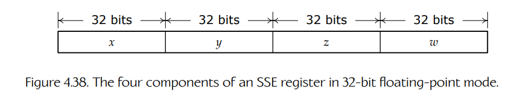

# 4.10 SIMD/向量处理

在 4.1.4 节中，我们介绍了一种称为 **单指令多数据**（single instruction multiple data, SIMD）的并行形式。它指的是大多数现代微处理器能够使用一条机器指令，对多个数据项 **并行** 执行一次数学操作的能力。在本节中，我们会较为详细地探讨 SIMD 技术，并在本章末尾简要讨论 SIMD 和多线程如何结合成一种称为 **单指令多线程**（single instruction multiple thread, SIMT）的并行形式，而 SIMT 构成了所有现代 GPU 的基础。

Intel 于 1994 年随 Pentium 系列 CPU 首次引入了它的 MMX<sup>11</sup> 指令集。这些指令允许在特殊的 64 位 MMX 寄存器中，对打包的 8 个 8 位整数、4 个 16 位整数，或 2 个 32 位整数执行 SIMD 计算。随后，Intel 又推出了一个扩展指令集的多个修订版本，称为 **流式 SIMD 扩展**（streaming SIMD extensions, SSE），其中第一个版本出现在 Pentium III 处理器中。

> **脚注 11**：正式来说，MMX 是 Intel 注册的一个无意义首字母缩写。非正式地说，开发者认为它代表 “multimedia extensions” 或 “matrix math extensions”。

SSE 指令集使用 128 位寄存器，其中可以包含整数或 IEEE 浮点数据。游戏引擎最常使用的 SSE 模式称为 **打包 32 位浮点模式**（packed 32-bit floating-point mode）。在这种模式下，4 个 32 位 `float` 值被打包到一个 128 位寄存器中。因此，加法或乘法这样的操作，可以把两个 128 位寄存器作为输入，并行作用于 4 对 `float`。此后 Intel 又对 SSE 指令集进行了多次升级，命名为 SSE2、SSE3、SSSE3 和 SSE4。2007 年，AMD 引入了自己的变体，称为 XOP、FMA4 和 CVT16。

2011 年，Intel 引入了新的、更宽的 SIMD 寄存器文件及其配套指令集，称为 **高级向量扩展**（advanced vector extensions, AVX）。AVX 寄存器宽 256 位，允许一条指令并行作用于最多 8 对 32 位浮点操作数。AVX2 指令集是 AVX 的扩展。现在一些 Intel CPU 支持 AVX-512，这是 AVX 的一个扩展，允许把 16 个 32 位 `float` 打包到一个 512 位寄存器中。

## 4.10.1 SSE 指令集及其寄存器

SSE 指令集包含种类繁多的操作，也有许多变体用于处理 SSE 寄存器中不同大小的数据元素。不过，出于当前讨论目的，我们只关注一个相对较小的指令子集：处理打包 32 位浮点数据的指令。这些指令带有 `ps` 后缀，表示我们处理的是 **打包数据**（packed data, p），并且每个元素都是 **单精度** `float`（single-precision float, s）。不过，接下来的大多数讨论都可以直观扩展到 AVX 的 256 位和 512 位模式；关于 AVX 的概览见 [174]。



**图 4.38** 32 位浮点模式下，一个 SSE 寄存器的四个分量。

SSE 寄存器命名为 `XMMi`，其中 `i` 是 0 到 15 之间的整数，例如 `XMM0`、`XMM1` 等。在打包 32 位浮点模式下，每个 128 位 `XMMi` 寄存器包含 4 个 32 位 `float`。在 AVX 中，寄存器宽 256 位，命名为 `YMMi`；在 AVX-512 中，寄存器宽 512 位，命名为 `ZMMi`。

在本章中，我们经常会把一个 SSE 寄存器中的单个 `float` 称为 `[x y z w]`，就像在纸面上使用齐次坐标做向量/矩阵数学时那样（见图 4.38）。只要你在解释每个元素时保持一致，通常并不重要你如何称呼 SSE 寄存器中的各个元素。最常见的方法是把一个 SSE 向量 `r` 看作包含元素 `[r0 r1 r2 r3]`。大多数 SSE 文档都使用这个约定，尽管有些文档使用 `[w x y z]` 约定，所以要小心！

### 4.10.1.1 `__m128` 数据类型

为了让 SSE 指令能够对打包浮点数据执行算术运算，这些数据必须位于某个 `XMMi` 寄存器中。对于长期存储而言，打包浮点数据当然可以位于内存中，但在用于任何计算之前，它必须先从 RAM 传输到 SSE 寄存器中，计算结果随后也要传回 RAM。

为了让使用 SSE 和 AVX 数据更容易，C 和 C++ 编译器提供了表示 `float` 打包数组的特殊数据类型。`__m128` 类型封装了一个由 4 个 `float` 组成的打包数组，用于配合 SSE intrinsic 使用。（`__m256` 和 `__m512` 类型也类似，分别表示由 8 个和 16 个 `float` 组成的打包数组，用于配合 AVX intrinsic 使用。）

`__m128` 数据类型及其同类类型可以用于声明全局变量、自动变量、函数实参和返回类型，甚至可以用于类和结构体成员。把自动变量和函数实参声明为 `__m128` 类型，通常会导致编译器把这些值当作 SSE 寄存器的直接代理来处理。但是，用 `__m128` 类型声明全局变量、结构体/类成员，有时也包括局部变量时，这些值会在内存中存储为 16 字节对齐的 `float` 数组。在 SSE 计算中使用一个基于内存的 `__m128` 变量，会导致编译器在执行计算前隐式发出指令，将数据从内存加载到 SSE 寄存器中；同样，也会发出指令，将计算结果存储回支撑这些变量的内存中。因此，在使用 `__m128` 类型及其 AVX 亲属类型时，最好检查反汇编，确保没有执行不必要的 SSE 寄存器加载和存储。

### 4.10.1.2 SSE 数据对齐

凡是要存储在内存中、并打算用于 `XMMi` 寄存器的数据，都必须按 16 字节，即 128 位对齐。（类似地，打算用于 AVX 的 256 位 `YMMi` 寄存器的数据必须按 32 字节，即 256 位对齐；用于 512 位 `ZMMi` 寄存器的数据必须按 64 字节，即 512 位对齐。）

编译器会确保 `__m128` 类型的全局变量和局部变量自动对齐。它还会填充 `struct` 和 `class` 成员，使任何 `__m128` 成员都相对于对象起始地址正确对齐，并确保整个结构体或类的对齐要求等于其成员中最坏情况的对齐要求。这意味着，如果声明一个全局或局部变量，其类型为包含至少一个 `__m128` 成员的 `struct` 或 `class`，那么编译器会自动将它按 16 字节对齐。

然而，这类 `struct` 或 `class` 的所有 **动态分配** 实例都需要手动对齐。同样，任何你打算配合 SSE 指令使用的 `float` 数组也必须正确对齐；你可以通过 C++11 的 `alignas` 说明符来确保这一点。关于对齐内存分配的更多信息，请参见 6.2.1.3 节。

### 4.10.1.3 SSE 编译器 Intrinsic

我们可以直接使用 SSE 和 AVX 汇编语言指令，也许通过编译器的内联汇编语法来实现。不过，这样写代码不仅不可移植，而且非常痛苦！为了让生活更轻松，现代编译器提供了 **intrinsic**：一种看起来和普通 C 函数一样、行为也像普通 C 函数，但实际上会被编译器转换为内联汇编代码的特殊语法。许多 intrinsic 会转换为单条汇编语言指令，尽管有些 intrinsic 是宏，会转换为一串指令。

为了使用 SSE 和 AVX intrinsic，你的 `.cpp` 文件在 Visual Studio 中必须 `#include <xmmintrin.h>`，或者在使用 Clang 或 gcc 编译时包含 `<x86intrin.h>`。

### 4.10.1.4 一些有用的 SSE Intrinsic

SSE intrinsic 有很多，但出于本节讨论目的，我们可以先从其中五个开始：

- `__m128 _mm_set_ps(float w, float z, float y, float x);`  
  这个 intrinsic 使用提供的 4 个浮点值初始化一个 `__m128` 变量。

- `__m128 _mm_load_ps(const float* pData);`  
  这个 intrinsic 从 C 风格数组中加载 4 个 `float` 到一个 `__m128` 变量中。输入数组必须按 16 字节对齐。

- `void _mm_store_ps(float* pData, __m128 v);`  
  这个 intrinsic 将一个 `__m128` 变量的内容存储到一个包含 4 个 `float` 的 C 风格数组中，该数组必须按 16 字节对齐。

- `__m128 _mm_add_ps(__m128 a, __m128 b);`  
  这个 intrinsic 会并行地把变量 `a` 和 `b` 中包含的 4 对 `float` 相加，并返回结果。

- `__m128 _mm_mul_ps(__m128 a, __m128 b);`  
  这个 intrinsic 会并行地把变量 `a` 和 `b` 中包含的 4 对 `float` 相乘，并返回结果。

你可能已经注意到，参数 `x`、`y`、`z` 和 `w` 是以相反顺序传给 `_mm_set_ps()` 函数的。这种奇怪约定大概源自 Intel CPU 是 **小端序**（little-endian）的事实。就像一个位模式为 `0x12345678` 的单个浮点值会按地址递增顺序在内存中存储为字节 `0x78`、`0x56`、`0x34`、`0x12` 一样，SSE 寄存器的内容在内存中也会以与这些分量在寄存器中实际出现顺序相反的方式存储。换句话说，不仅 SSE 寄存器中构成每个 `float` 的 4 个字节以小端顺序存储，4 个 `float` 本身也同样如此。所有这些其实只是命名约定的问题：SSE 寄存器中并没有真正意义上的“最高有效”或“最低有效” `float`。因此，我们既可以把内存顺序视为“正确”顺序，并认为 `_mm_set_ps()` 是“反着的”；也可以把 `_mm_set_ps()` 的参数视为“正确”顺序，并认为所有内存中的向量都是“反着的”。我们会坚持前一种约定，因为它意味着我们能更自然地读出向量：一个由成员 `(vx, vy, vz, vw)` 构成的齐次向量 `v` 会在 C/C++ 数组中存储为 `float v[] = { vx, vy, vz, vw }`，但会以 `w, z, y, x` 的顺序传给 `_mm_set_ps()`。

下面是一段小代码，它加载两个四元素浮点向量，将它们相加，并打印结果。

```cpp
#include <xmmintrin.h>

void TestAddSSE()
{
    alignas(16) float A[4];
    alignas(16) float B[4] = { 2.0f, 4.0f, 6.0f, 8.0f };

    // 通过字面量值把 a 设置为 (1, 2, 3, 4)，
    // 并从浮点数组中把 b 加载为 (2, 4, 6, 8)，
    // 这里只是为了说明两种做法
    // （记住 _mm_set_ps() 是反着的！）
    __m128 a = _mm_set_ps(4.0f, 3.0f, 2.0f, 1.0f);
    __m128 b = _mm_load_ps(&B[0]);

    // 向量相加
    __m128 r = _mm_add_ps(a, b);

    // 把 '__m128 a' 存入 float 数组，以便打印
    _mm_store_ps(&A[0], a);

    // 把结果存入 float 数组，以便打印
    alignas(16) float R[4];
    _mm_store_ps(&R[0], r);

    // 查看结果
    printf("a = %.1f %.1f %.1f %.1f\n",
        A[0], A[1], A[2], A[3]);
    printf("b = %.1f %.1f %.1f %.1f\n",
        B[0], B[1], B[2], B[3]);
    printf("r = %.1f %.1f %.1f %.1f\n",
        R[0], R[1], R[2], R[3]);
}
```

### 4.10.1.5 AltiVec `vector` 类型

作为一个简短旁注，GNU C/C++ 编译器 gcc（例如用于编译 PS3 代码）为 PowerPC 的 AltiVec 指令集提供支持。这个指令集支持 SIMD 操作，很像 Intel 处理器上的 SSE。128 位 `vector` 类型可以像普通 C/C++ 类型一样声明，只是前面要加上关键字 `vector`。例如，一个包含 4 个 `float` 的 SIMD 变量会被声明为 `vector float`。gcc 还提供了一种把字面量 SIMD 值写入源代码的方式。例如，你可以像这样初始化一个 `vector float`：

```cpp
vector float v = (vector float)(-1.0f, 2.0f, 0.5f, 1.0f);
```

对应的 Visual Studio 代码会稍微笨拙一些：

```cpp
// 使用编译器 intrinsic 加载“字面量”值
// （记住 _mm_set_ps() 是反着的！）
__m128 v = _mm_set_ps(1.0f, 0.5f, 2.0f, -1.0f);
```

本章不会专门讲 AltiVec，但一旦你理解了 SSE，它就会很容易学习。

## 4.10.2 使用 SSE 向量化循环

SIMD 有潜力将某些类型的计算加速 4 倍，因为一条机器语言指令可以对 4 个浮点值并行执行一次算术操作。下面看看如何使用 SSE intrinsic 来做到这一点。

首先，考虑一个简单循环，它对两个 `float` 数组逐元素相加，并把每个结果存入输出数组：

```cpp
void AddArrays_ref(int count,
                   float* results,
                   const float* dataA,
                   const float* dataB)
{
    for (int i = 0; i < count; ++i)
    {
        results[i] = dataA[i] + dataB[i];
    }
}
```

我们可以像这样使用 SSE intrinsic 显著加速这个循环：

```cpp
void AddArrays_sse(int count,
                   float* results,
                   const float* dataA,
                   const float* dataB)
{
    // 注意：调用者需要确保
    // 3 个数组大小相等，且大小是 4 的倍数！
    assert(count % 4 == 0);

    for (int i = 0; i < count; i += 4)
    {
        __m128 a = _mm_load_ps(&dataA[i]);
        __m128 b = _mm_load_ps(&dataB[i]);
        __m128 r = _mm_add_ps(a, b);
        _mm_store_ps(&results[i], r);
    }
}
```

在这个版本中，我们每次循环处理 4 个值。我们把 4 个 `float` 组成的块加载到 SSE 寄存器中，并行相加，然后把结果存储到结果数组中对应的 4 个 `float` 块里。这称为把循环 **向量化**（vectorizing）。在这个例子中，我们假设 3 个数组大小相等，且大小是 4 的倍数。调用者负责在必要时用 1 个、2 个或 3 个虚拟值对数组进行 **填充**（padding），以满足这一要求。

向量化可以带来显著的速度提升。这个特定例子并没有快到 4 倍，因为每次迭代都需要按 4 个一组加载值，并存储结果，这些操作本身也有开销；不过，当我测量这些函数在非常大的 `float` 数组上运行时，非向量化循环完成工作大约需要向量化循环的 3.8 倍时间。

## 4.10.3 向量化点积

我们把向量化应用到一个稍微有趣一些的任务上：计算点积。给定两个由四元素向量组成的数组，目标是逐对计算它们的点积，并把结果存入一个 `float` 输出数组。

下面是不使用 SSE 的参考实现。在这个实现中，输入数组 `a[]` 和 `b[]` 中每个连续的 4 个 `float` 块，都会被解释为一个齐次四元素向量。

```cpp
void DotArrays_ref(int count,
                   float r[],
                   const float a[],
                   const float b[])
{
    for (int i = 0; i < count; ++i)
    {
        // 把每个 4 个 float 组成的块视为
        // 一个四元素向量
        const int j = i * 4;

        r[i] = a[j+0]*b[j+0]  // ax*bx
             + a[j+1]*b[j+1]  // ay*by
             + a[j+2]*b[j+2]  // az*bz
             + a[j+3]*b[j+3]; // aw*bw
    }
}
```

### 4.10.3.1 第一次尝试：很慢

下面是第一次尝试使用 SSE intrinsic 完成这个任务：

```cpp
void DotArrays_sse_horizontal(int count,
                              float r[],
                              const float a[],
                              const float b[])
{
    for (int i = 0; i < count; ++i)
    {
        // 把每个 4 个 float 组成的块视为
        // 一个四元素向量
        const int j = i * 4;

        __m128 va = _mm_load_ps(&a[j]); // ax,ay,az,aw
        __m128 vb = _mm_load_ps(&b[j]); // bx,by,bz,bw

        __m128 v0 = _mm_mul_ps(va, vb);

        // 在寄存器内部横向相加……
        __m128 v1 = _mm_hadd_ps(v0, v0);
        // (v0w+v0z, v0y+v0x, v0w+v0z, v0y+v0x)
        __m128 vr = _mm_hadd_ps(v1, v1);
        // (v0w+v0z+v0y+v0x,
        //  v0w+v0z+v0y+v0x)

        _mm_store_ss(&r[i], vr); // 提取 vr.x 作为 float
    }
}
```

这个实现需要一条新指令：`_mm_hadd_ps()`，即 **水平加法**（horizontal add）。这个 intrinsic 作用于单个输入寄存器 `(x, y, z, w)`，并计算两个和：`s = x + y` 与 `t = z + w`。它把这两个和存储到目标寄存器的 4 个槽位中，形式为 `(t, s, t, s)`。执行两次这个操作，就可以计算出总和 `d = x + y + z + w`。这称为 **跨寄存器相加**（adding across a register）。

跨寄存器相加通常并不好，因为它是一个非常慢的操作。对 `DotArrays_sse()` 实现进行性能分析会发现，它实际上比参考实现还要稍微多花一点时间。这里使用 SSE 反而让我们变慢了！<sup>12</sup>

> **脚注 12**：在 SSE4 中，Intel 引入了 intrinsic `_mm_dp_ps()` 以及对应的 `dpps` 指令，它能以比调用两次 `_mm_hadd_ps()` 低一些的延迟计算点积。但所有水平加法都很昂贵，应尽量避免。

### 4.10.3.2 更好的方法

发挥点积中 SIMD 并行能力的关键，是想办法避免跨寄存器相加。可以做到这一点，但我们必须先 **转置** 输入向量。通过以转置后的顺序存储它们，我们可以用和普通 `float` 几乎相同的方式计算点积：先把 `x` 分量相乘，然后把结果加上 `y` 分量的乘积，再加上 `z` 分量的乘积，最后加上 `w` 分量的乘积。代码如下：

```cpp
void DotArrays_sse(int count,
                   float r[],
                   const float a[],
                   const float b[])
{
    for (int i = 0; i < count; i += 4)
    {
        __m128 vaX = _mm_load_ps(&a[(i+0)*4]); // a[0,4,8,12]
        __m128 vaY = _mm_load_ps(&a[(i+1)*4]); // a[1,5,9,13]
        __m128 vaZ = _mm_load_ps(&a[(i+2)*4]); // a[2,6,10,14]
        __m128 vaW = _mm_load_ps(&a[(i+3)*4]); // a[3,7,11,15]

        __m128 vbX = _mm_load_ps(&b[(i+0)*4]); // b[0,4,8,12]
        __m128 vbY = _mm_load_ps(&b[(i+1)*4]); // b[1,5,9,13]
        __m128 vbZ = _mm_load_ps(&b[(i+2)*4]); // b[2,6,10,14]
        __m128 vbW = _mm_load_ps(&b[(i+3)*4]); // b[3,7,11,15]

        __m128 result;
        result = _mm_mul_ps(vaX, vbX);
        result = _mm_add_ps(result, _mm_mul_ps(vaY, vbY));
        result = _mm_add_ps(result, _mm_mul_ps(vaZ, vbZ));
        result = _mm_add_ps(result, _mm_mul_ps(vaW, vbW));

        _mm_store_ps(&r[i], result);
    }
}
```

#### MADD 指令

值得注意的是，乘法后紧跟加法是一种非常常见的操作，以至于它拥有自己的名称：**madd**。有些 CPU 提供单条 SIMD 指令来执行 madd 操作。例如，PowerPC AltiVec intrinsic `vec_madd()` 会执行这个操作。因此，在 AltiVec 中，`DotArrays()` 函数的主体可以变得更简单一点：

```cpp
vector float result = vec_mul(vaX, vbX);
result = vec_madd(vaY, vbY, result));
result = vec_madd(vaZ, vbZ, result));
result = vec_madd(vaW, vbW, result));
```

### 4.10.3.3 边计算边转置

上面的实现 **假设** 输入数据已经由调用者转置。换句话说，假设 `a[]` 数组包含分量 `{a0, a4, a8, a12, a1, a5, a9, a13, ...}`，`b[]` 数组也是如此。如果我们想处理和参考实现格式相同的输入数据，就必须在函数内部进行转置。方法如下：

```cpp
void DotArrays_sse_transpose(int count,
                             float r[],
                             const float a[],
                             const float b[])
{
    for (int i = 0; i < count; i += 4)
    {
        __m128 vaX = _mm_load_ps(&a[(i+0)*4]); // a[0,1,2,3]
        __m128 vaY = _mm_load_ps(&a[(i+1)*4]); // a[4,5,6,7]
        __m128 vaZ = _mm_load_ps(&a[(i+2)*4]); // a[8,9,10,11]
        __m128 vaW = _mm_load_ps(&a[(i+3)*4]); // a[12,13,14,15]

        __m128 vbX = _mm_load_ps(&b[(i+0)*4]); // b[0,1,2,3]
        __m128 vbY = _mm_load_ps(&b[(i+1)*4]); // b[4,5,6,7]
        __m128 vbZ = _mm_load_ps(&b[(i+2)*4]); // b[8,9,10,11]
        __m128 vbW = _mm_load_ps(&b[(i+3)*4]); // b[12,13,14,15]

        _MM_TRANSPOSE4_PS(vaX, vaY, vaZ, vaW);
                                          // vaX = a[0,4,8,12]
                                          // vaY = a[1,5,9,13]
                                          // ...
        _MM_TRANSPOSE4_PS(vbX, vbY, vbZ, vbW);
                                          // vbX = b[0,4,8,12]
                                          // vbY = b[1,5,9,13]
                                          // ...

        __m128 result;
        result = _mm_mul_ps(vaX, vbX);
        result = _mm_add_ps(result, _mm_mul_ps(vaY, vbY));
        result = _mm_add_ps(result, _mm_mul_ps(vaZ, vbZ));
        result = _mm_add_ps(result, _mm_mul_ps(vaW, vbW));

        _mm_store_ps(&r[i], result);
    }
}
```

这两次对 `_MM_TRANSPOSE()` 的调用，实际上是调用一个有些复杂的宏；它使用 shuffle 指令移动 4 个输入寄存器中的分量。幸运的是，shuffle 并不是特别昂贵的操作，因此在计算点积时边转置向量并不会引入太多额外开销。对 `DotArrays()` 的全部三个实现进行性能分析表明，我们的最终版本，也就是边计算边转置的版本，大约比参考实现快 3.5 倍。

### 4.10.3.4 Shuffle 与转置

对于好奇的读者，下面展示 `_MM_TRANSPOSE()` 宏大致是什么样子：

```cpp
#define _MM_TRANSPOSE4_PS(row0, row1, row2, row3)   \
    { __m128 tmp3, tmp2, tmp1, tmp0;                \
                                                        \
    tmp0   = _mm_shuffle_ps((row0), (row1), 0x44);  \
    tmp2   = _mm_shuffle_ps((row0), (row1), 0xEE);  \
    tmp1   = _mm_shuffle_ps((row2), (row3), 0x44);  \
    tmp3   = _mm_shuffle_ps((row2), (row3), 0xEE);  \
                                                        \
    (row0) = _mm_shuffle_ps(tmp0, tmp1, 0x88);      \
    (row1) = _mm_shuffle_ps(tmp0, tmp1, 0xDD);      \
    (row2) = _mm_shuffle_ps(tmp2, tmp3, 0x88);      \
    (row3) = _mm_shuffle_ps(tmp2, tmp3, 0xDD); }
```

这些看起来很疯狂的十六进制数，是一种位打包的四元素字段，称为 **shuffle 掩码**（shuffle mask）。它们告诉 `_mm_shuffle()` intrinsic 应该如何精确地重排分量。这些位打包字段是常见的困惑来源，可能是因为大多数文档使用的命名约定造成了混淆。但它实际上很简单：shuffle mask 由 4 个整数组成，每个整数表示 SSE 寄存器中的一个分量，因此可以取 0 到 3 之间的值。

```cpp
#define SHUFMASK(p,q,r,s) \
        (p | (q<<2) | (r<<4) | (s<<6))
```

把两个 SSE 寄存器 `a` 和 `b` 以及一个 shuffle mask 传给 `_mm_shuffle_ps()` intrinsic，会导致 `a` 和 `b` 中指定的分量如下出现在输出寄存器 `r` 中：

```cpp
__m128 a = ...;
__m128 b = ...;
__m128 r = _mm_shuffle_ps(a, b,
                          SHUFMASK(p,q,r,s));
// r == ( a[p], a[q], b[r], b[s] )
```

## 4.10.4 使用 SSE 进行向量-矩阵乘法

现在我们已经理解如何执行点积，就可以把一个四元素向量与一个 4 × 4 矩阵相乘。要做到这一点，我们只需要在输入向量和输入矩阵的四行之间执行四次点积。

我们先定义一个 `Mat44` 类，它封装 4 个 SSE 向量，分别表示矩阵的 4 行。我们会使用一个 `union`，这样可以方便地以 `float` 形式访问矩阵的各个成员。（这可行是因为 `Mat44` 类的实例总是位于内存中，而不是直接位于 SSE 寄存器中。）

```cpp
union Mat44
{
    float  c[4][4]; // 分量
    __m128 row[4];  // 行
};
```

用于把向量和矩阵相乘的函数如下：

```cpp
__m128 MulVecMat_sse(const __m128& v, const Mat44& M)
{
    // 先转置 v
    __m128 vX = _mm_shuffle_ps(v, v, 0x00); // (vx,vx,vx,vx)
    __m128 vY = _mm_shuffle_ps(v, v, 0x55); // (vy,vy,vy,vy)
    __m128 vZ = _mm_shuffle_ps(v, v, 0xAA); // (vz,vz,vz,vz)
    __m128 vW = _mm_shuffle_ps(v, v, 0xFF); // (vw,vw,vw,vw)

    __m128 r =          _mm_mul_ps(vX, M.row[0]);
    r = _mm_add_ps(r, _mm_mul_ps(vY, M.row[1]));
    r = _mm_add_ps(r, _mm_mul_ps(vZ, M.row[2]));
    r = _mm_add_ps(r, _mm_mul_ps(vW, M.row[3]));
    return r;
}
```

这些 shuffle 用于把 `v` 的一个分量（即 `vx`、`vy`、`vz` 或 `vw`）复制到 SSE 寄存器的全部 4 个通道中。这样做相当于在与矩阵 `M` 的行执行点积之前，先转置了 `v`；而 `M` 的行已经是转置后的形式。（记住，向量-矩阵乘法通常涉及输入向量与矩阵 **列** 之间的点积。这里，我们把 `v` 转置到 4 个 SSE 寄存器中，然后按分量与矩阵的 **行** 做数学运算。）

## 4.10.5 使用 SSE 进行矩阵-矩阵乘法

一旦我们有了向量和矩阵相乘的函数，使用 SSE intrinsic 计算两个 4 × 4 矩阵相乘就很简单了。代码如下：

```cpp
void MulMatMat_sse(Mat44& R, const Mat44& A, const Mat44& B)
{
    R.row[0] = MulVecMat_sse(A.row[0], B);
    R.row[1] = MulVecMat_sse(A.row[1], B);
    R.row[2] = MulVecMat_sse(A.row[2], B);
    R.row[3] = MulVecMat_sse(A.row[3], B);
}
```

## 4.10.6 广义向量化

由于一个 SSE 寄存器包含 4 个浮点值，很容易把它想成四元素齐次向量 `v` 的各个分量的天然“容器”，并认为 SSE 最适合用于 3D 向量数学。然而，这是一种非常局限的 SIMD 并行思维方式。

大多数“批处理”操作，也就是在大型数据集上重复执行同一种计算的操作，都可以使用 SIMD 并行进行向量化。仔细想想，SIMD 寄存器的各个分量实际上就像并行“通道”（lanes），可以在其中执行任意处理。使用 `float` 变量时，我们只有一个通道；而使用 128 位的四元素 SIMD 变量时，我们可以跨 4 个通道并行执行同一项计算。换句话说，我们一次可以执行 4 次计算。使用 256 位 AVX 寄存器时，我们有 8 个通道，可以一次执行 8 次计算。而 AVX-512 提供 16 个通道，让我们一次执行 16 次计算。

编写 **向量化** 代码最简单的方法，是先把它写成单通道算法，也就是只使用 `float`。一旦它能工作，就可以把它转换为一次操作 `N` 个元素，使用具有 `N` 通道容量的 SIMD 寄存器。我们已经在实践中见过这个过程：在 4.10.3 节中，我们先写了一个循环，一次计算大量点积中的一个；然后将其转换为使用 SSE，从而一次计算 4 个点积。

以这种方式向量化代码的一个好处是，只需很少调整代码，就能获得更宽 SIMD 硬件带来的收益。在只支持 SSE 的机器上，你的循环每次迭代执行 4 个操作；在支持 AVX 的机器上，你只需把它改成每次迭代执行 8 个操作；在 AVX-512 系统上，则可以每次迭代执行 16 个操作。

有趣的是，大多数优化编译器都能自动向量化某些类型的单通道循环。事实上，在编写上面的例子时，为了把我的单通道代码和 SIMD 实现进行性能比较，我还费了一番功夫才强制编译器 **不要** 向量化它！再次强调，在编写优化代码时，查看反汇编总是一个好主意——你可能会发现编译器做得比你想象的更多（或更少）！

## 4.10.7 向量谓词

我们再看另一个完全人为构造的例子。这个例子会强化广义向量化的思路，同时也会说明另一种有用技术：**向量谓词**（vector predication）。

假设我们需要对一个大型 `float` 数组取平方根。我们先把它写成一个单通道循环，如下：

```cpp
#include <cmath>

void SqrtArray_ref(float* __restrict__ r,
                   const float* __restrict__ a,
                   int count)
{
    for (unsigned i = 0; i < count; ++i)
    {
        if (a[i] >= 0.0f)
            r[i] = std::sqrt(a[i]);
        else
            r[i] = 0.0f;
    }
}
```

接下来，我们把这个循环转换成 SSE，一次执行 4 个平方根：

```cpp
#include <xmmintrin.h>

void SqrtArray_sse_broken(float* __restrict__ r,
                          const float* __restrict__ a,
                          int count)
{
    assert(count % 4 == 0);
    __m128 vz = _mm_set1_ps(0.0f); // 全零

    for (int i = 0; i < count; i += 4)
    {
        __m128 va = _mm_load_ps(a + i);

        __m128 vr;
        if (_mm_cmpge_ps(va, vz)) // ???
            vr = _mm_sqrt_ps(va);
        else
            vr = vz;

        _mm_store_ps(r + i, vr);
    }
}
```

这看起来很简单：我们只是每次跨过输入数组中的 4 个 `float`，把 4 个 `float` 一组加载到 SSE 寄存器中，然后用 `_mm_sqrt_ps()` 并行执行 4 个平方根。

然而，这个循环里有一个小陷阱。我们需要检查输入值是否大于等于零，因为负数的平方根是虚数，因此会产生 QNaN。intrinsic `_mm_cmpge_ps()` 会逐分量比较两个 SSE 寄存器中的值，检查它们是否大于等于调用者提供的一组向量值。然而，这个函数并不返回布尔值。它怎么可能返回布尔值呢？我们是在把 4 个值与另外 4 个值比较，因此其中一些可能通过测试，而另一些可能失败。这意味着我们不能简单地对 `_mm_cmpge_ps()` 的结果做一次 `if` 检查。<sup>13</sup>

> **脚注 13**：单通道参考实现中的 `if` 检查也会阻止编译器自动向量化该循环。

这是否意味着我们的向量化实现注定失败？幸运的是并非如此。所有像 `_mm_cmpge_ps()` 这样的 SSE 比较 intrinsic 都会产生一个四分量结果，并存储在 SSE 寄存器中。但结果并不包含 4 个浮点值，而是由 4 个 32 位掩码组成。如果输入寄存器中对应的分量通过测试，那么对应掩码包含全 1，即 `0xFFFFFFFFU`；如果该分量测试失败，那么对应掩码包含全 0，即 `0x0U`。

我们可以把 SSE 比较 intrinsic 的结果作为位掩码来使用，从两个可能结果中选择一个。在我们的例子中，当输入值通过测试，也就是大于等于零时，我们想选择该输入值的平方根；当它测试失败，也就是为负数时，我们想选择零。这称为 **谓词**（predication）；由于我们把它应用到 SIMD 向量上，因此称为 **向量谓词**（vector predication）。

在 4.2.6.2 节中，我们已经看过如何对浮点值做谓词处理，使用按位 AND、OR 和 NOT 操作符。下面摘录那个例子的一部分：

```cpp
// ...

// 当 mask 全为 1 时选择 quotient，
// 当 mask 全为 0 时选择默认值 d
const unsigned ru = (qu & mask) | (du & ~mask);

// 把结果转换回 float
float r; memcpy(&r, &ru, sizeof(r));
return r;
}
```

这里没有什么不同，我们只需要使用这些按位操作符的 SSE 版本：

```cpp
#include <xmmintrin.h>

void SqrtArray_sse(float* __restrict__ r,
                   const float* __restrict__ a,
                   int count)
{
    assert(count % 4 == 0);
    __m128 vz = _mm_set1_ps(0.0f);

    for (int i = 0; i < count; i += 4)
    {
        __m128 va = _mm_load_ps(a + i);

        // 总是执行平方根，但某些或全部通道中
        // 最终可能产生 QNaN
        __m128 vq = _mm_sqrt_ps(va);

        // 现在根据输入是否大于等于零，
        // 在 vq 和 vz 之间选择
        __m128 mask = _mm_cmpge_ps(va, zero);

        // (vq & mask) | (vz & ~mask)
        __m128 qmask = _mm_and_ps(mask, vq);
        __m128 znotmask = _mm_andnot_ps(mask, vz);

        __m128 vr = _mm_or_ps(qmask, znotmask);

        _mm_store_ps(r + i, vr);
    }
}
```

把这个 **向量谓词** 操作封装到一个函数中很方便，这个函数通常称为 **向量选择**（vector select）。PowerPC 的 AltiVec ISA 为此提供了一个名为 `vec_sel()` 的 intrinsic。它的工作方式如下：

```cpp
// 说明 AltiVec 的 vec_sel() intrinsic
// 如何工作的伪代码
vector float vec_sel(vector float falseVec,
                     vector float trueVec,
                     vector bool mask)
{
    vector float r;
    for (each lane i)
    {
        if (mask[i] == 0)
            r[i] = falseVec[i];
        else
            r[i] = trueVec[i];
    }
    return r;
}
```

SSE2 没有提供 vector select 指令，但幸运的是 SSE4 引入了一条，它通过 intrinsic `_mm_blendv_ps()` 发出。

我们来看看如何自己实现一个 vector select 操作。可以这样写：

```cpp
__m128 _mm_select_ps(const __m128 a,
                     const __m128 b,
                     const __m128 mask)
{
    // (b & mask) | (a & ~mask)
    __m128 bmask = _mm_and_ps(mask, b);
    __m128 anotmask = _mm_andnot_ps(mask, a);
    return _mm_or_ps(bmask, anotmask);
}
```

或者，如果我们胆子大一点，可以用异或完成同样的事情：

```cpp
__m128 _mm_select_ps(const __m128 a,
                     const __m128 b,
                     const __m128 mask)
{
    // (((a ^ b) & mask) ^ a)
    __m128 diff = _mm_xor_ps(a, b);
    return _mm_xor_ps(a, _mm_and_ps(mask, diff));
}
```

看看你能不能弄明白它是如何工作的。这里有两个提示：异或运算符会计算两个值之间的 **按位差异**（bitwise difference）。连续两次 XOR 会让输入值保持不变，即 `((a ^ b) ^ b == a)`。