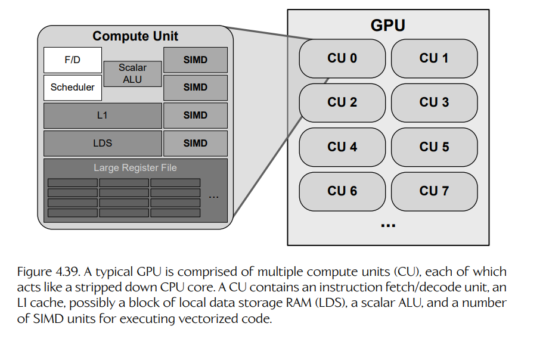
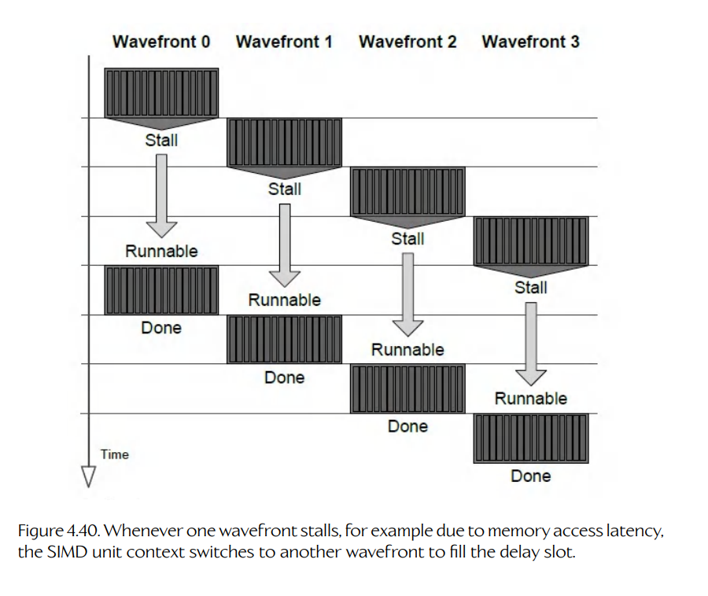

# 4.11 GPGPU 编程导论

在上一节中我们说过，如果目标 CPU 包含 SIMD 向量处理单元，并且源代码满足某些要求（例如不涉及复杂分支），那么大多数优化编译器都可以自动 **向量化**（vectorize）部分代码。向量化也是 **通用 GPU 编程**（general-purpose GPU programming, GPGPU）的支柱之一。在本节中，我们会简要介绍 GPU 在硬件架构上与 CPU 有何不同，以及 SIMD 并行和向量化的概念如何让程序员能够编写 **计算着色器**（compute shader），从而在 GPU 上并行处理大量数据。

## 4.11.1 数据并行计算

GPU 是一种专门的协处理器，设计目标是加速那些具有高度 **数据并行性**（data parallelism）的计算。它通过把 SIMD 并行（向量化 ALU）与 MIMD 并行（通过采用某种抢占式多线程形式）结合起来实现这一点。NVIDIA 创造了 **单指令多线程**（single instruction multiple thread, SIMT）这个术语，用来描述这种 SIMD/MIMD 混合设计。尽管这种设计并非 NVIDIA GPU 独有——而且 GPU 设计的具体细节会因厂商和产品线而显著不同——但所有 GPU 在设计中都会采用 SIMT 并行的一般原则。

GPU 专门设计用于在非常大的数据集上执行 **数据并行** 计算。为了让某个计算任务适合在 GPU 上执行，对数据集中任意一个元素执行的计算，必须 **独立于** 对其他元素执行计算的结果。换句话说，必须可以按任意顺序处理这些元素。

从 4.10.3 节开始给出的那些简单 SIMD 向量化例子，都是数据并行计算的例子。回忆下面这个函数，它处理两个可能非常大的输入向量数组，并生成一个输出数组，其中包含这些向量的标量点积：

```cpp
void DotArrays_ref(unsigned count,
                   float r[],
                   const float a[],
                   const float b[])
{
    for (unsigned i = 0; i < count; ++i)
    {
        // 把每个 4 个 float 组成的块视为
        // 一个四元素向量
        const unsigned j = i * 4;

        r[i] = a[j+0]*b[j+0]  // ax*bx
             + a[j+1]*b[j+1]  // ay*by
             + a[j+2]*b[j+2]  // az*bz
             + a[j+3]*b[j+3]; // aw*bw
    }
}
```

这个循环中每次迭代执行的计算，都独立于其他迭代执行的计算。这意味着我们可以按照自己认为合适的任意顺序执行这些计算。此外，正是这一性质允许我们使用 SSE 或 AVX intrinsic 对循环进行向量化：不再一次只执行一个计算，而是可以使用 SIMD 并行一次执行 4 个、8 个或 16 个计算，从而分别把迭代次数减少为原来的 1/4、1/8 或 1/16。

现在设想把 SIMD 并行化推向极端。如果我们有一个包含 1024 个通道的 SIMD VPU，会怎么样？在这种情况下，我们可以把总迭代次数除以 1024；而当输入数组包含 1024 个或更少元素时，我们甚至可以真的用一次迭代执行整个循环！

粗略地说，这正是 GPU 所做的事情。不过，它并不是使用真正宽达 1024 个通道的 SIMD。GPU 的 SIMD 单元通常是 8 或 16 个通道宽，但它们每次会以 32 或 64 个元素为一批处理工作负载。更重要的是，一个 GPU 包含 **许多** 这样的 SIMD 单元。因此，一个大型工作负载可以并行分派到这些 SIMD 单元上，使 GPU 能够真正并行处理成千上万个数据元素。

当把像素着色器（pixel shader，也称 fragment shader）应用到数百万个像素，或者把顶点着色器（vertex shader）应用到每帧数十万甚至数百万个 3D 网格顶点，并且以每秒 30 或 60 帧（FPS）运行时，数据并行计算正是所需要的东西。不过，现代 GPU 会把它们的计算能力暴露给程序员，使我们能够编写通用 **计算着色器**。只要我们希望在大型数据集上执行的计算基本彼此独立，它们很可能就可以在 GPU 上比在 CPU 上更高效地执行。

## 4.11.2 计算内核

在 4.10.3 节中，我们看到，为了向量化像 `DotArrays_ref()` 函数那样的循环，必须重写代码。该函数的向量化版本会使用 SSE 或 AVX intrinsic；我们的 **标量** 数据类型会被替换为 SSE 的 `__m128` 或 AltiVec 的 `vector float` 这样的 **向量** 类型；循环也会被硬编码为一次迭代 4 个、8 个或 16 个元素。

编写 GPGPU 计算着色器时，我们采用不同方法。我们不会把循环硬编码为以固定大小的批次运行，而是让循环保持为使用标量数据类型的“单通道”计算。然后，我们把循环体提取成一个单独函数，称为 **内核**（kernel）。上面的例子写成内核后如下所示：

```cpp
void DotKernel(unsigned i,
               float r[],
               const float a[],
               const float b[])
{
    // 把每个 4 个 float 组成的块视为
    // 一个四元素向量
    const unsigned j = i * 4;

    r[i] = a[j+0]*b[j+0]  // ax*bx
         + a[j+1]*b[j+1]  // ay*by
         + a[j+2]*b[j+2]  // az*bz
         + a[j+3]*b[j+3]; // aw*bw
}

void DotArrays_gpgpu1(unsigned count,
                      float r[],
                      const float a[],
                      const float b[])
{
    for (unsigned i = 0; i < count; ++i)
    {
        DotKernel(i, r, a, b);
    }
}
```

`DotKernel()` 函数现在处于适合转换成 **计算着色器** 的形式。它只处理输入数据中的一个元素，并生成一个输出元素。这类似于像素/片元着色器接收一个输入像素/片元颜色并将其转换为一个输出颜色，也类似于顶点着色器接收一个输入顶点并生成一个输出顶点。GPU 实际上会替我们运行这个 `for` 循环：它会针对数据集中的每个元素调用一次我们的内核函数。

GPGPU 计算内核通常用一种特殊的 **着色语言**（shading language）编写，它可以被编译成 GPU 能够理解的机器码。着色语言的语法通常非常接近 C，因此把 C 或 C++ 循环转换成 GPU 计算内核通常并不是特别困难。着色语言的例子包括 DirectX 的 HLSL（high-level shader language）、OpenGL 的 GLSL、NVIDIA 的 Cg 和 CUDA C 语言，以及 OpenCL。

有些着色语言要求你把内核代码移动到特殊的源文件中，与 C++ 应用程序代码分开。不过，OpenCL 和 CUDA C 本身是 C++ 语言的扩展。因此，它们允许程序员只做很少的语法调整，就把计算内核写成普通 C/C++ 函数，并以相对简单的语法在 GPU 上调用这些内核。

作为一个具体例子，下面是用 CUDA C 编写的 `DotKernel()` 函数：

```cpp
__global__ void DotKernel_CUDA(int count,
                               float* r,
                               const float* a,
                               const float* b)
{
    // CUDA 为每次内核调用提供一个神奇的“线程索引”，
    // 它充当我们的循环索引 i
    size_t i = threadIdx.x;

    // 确保索引有效
    if (i < count)
    {
        // 把每个 4 个 float 组成的块视为
        // 一个四元素向量
        const unsigned j = i * 4;

        r[i] = a[j+0]*b[j+0]  // ax*bx
             + a[j+1]*b[j+1]  // ay*by
             + a[j+2]*b[j+2]  // az*bz
             + a[j+3]*b[j+3]; // aw*bw
    }
}
```

你会注意到，循环索引 `i` 是从内核函数内部一个名为 `threadIdx` 的变量中取得的。线程索引是编译器提供的一个“神奇”输入，很像 C++ 类成员函数中的 `this` 指针会“神奇地”指向当前实例。我们会在下一节进一步讨论线程索引。

## 4.11.3 执行内核

既然已经写出了计算内核，下面看看如何在 GPU 上执行它。具体细节会因着色语言而异，但关键概念大致相同。例如，下面是在 CUDA C 中启动我们的计算内核的方法：

```cpp
void DotArrays_gpgpu2(unsigned count,
                      float r[],
                      const float a[],
                      const float b[])
{
    // 分配对 CPU 和 GPU 都可见的“托管”缓冲区
    int *cr, *ca, *cb;
    cudaMallocManaged(&cr, count * sizeof(float));
    cudaMallocManaged(&ca, count * sizeof(float) * 4);
    cudaMallocManaged(&cb, count * sizeof(float) * 4);

    // 把数据传输到 GPU 可见的内存中
    memcpy(ca, a, count * sizeof(float) * 4);
    memcpy(cb, b, count * sizeof(float) * 4);

    // 在 GPU 上运行内核
    DotKernel_CUDA <<<1, count>>> (cr, ca, cb, count);

    // 等待 GPU 完成
    cudaDeviceSynchronize();

    // 返回结果并清理
    memcpy(r, cr, count * sizeof(float));
    cudaFree(cr);
    cudaFree(ca);
    cudaFree(cb);
}
```

这里需要一些设置代码：把输入和输出缓冲区分配为对 CPU 和 GPU 都可见的“托管”内存，并把输入数据复制到这些缓冲区中。CUDA 特有的三重尖括号记法 `<<<G,N>>>` 会通过向驱动提交请求，在 GPU 上执行计算内核。对 `cudaDeviceSynchronize()` 的调用会强制 CPU 等待 GPU 完成工作，这与 `pthread_join()` 强制一个线程等待另一个线程完成的方式很相似。最后，我们释放 GPU 可见的数据缓冲区。

我们进一步看看 `<<<G,N>>>` 这个尖括号记法。尖括号中的第二个参数 `N` 允许我们指定输入数据的 **维度**。这对应于我们希望 GPU 执行的循环 **迭代次数**。它实际上可以是一维、二维或三维量，使我们能够处理一维、二维或三维输入数组。不过，就像在 C/C++ 中一样，多维数组实际上只是以特殊方式索引的一维数组。例如，在 C/C++ 中，写成 `[row][column]` 的二维数组访问，实际上等价于一维数组访问 `[row*numColumns + column]`。同样的原则也适用于多维 GPU 缓冲区。

尖括号中的第一个参数 `G` 告诉驱动，在运行这个计算内核时要使用多少个 **线程组**（thread groups，在 NVIDIA 术语中称为 **线程块** thread blocks）。只使用一个线程组的计算作业，会被限制在 GPU 上的一个 **计算单元**（compute unit）中运行。计算单元本质上是 GPU 内的一个 **核心**，它是一个能够执行指令流的硬件组件。为 `G` 传入更大的数字，允许驱动把工作负载划分到多个计算单元上。

## 4.11.4 GPU 线程与线程组

参数 `G` 告诉 GPU 驱动如何把我们的工作划分成多少个 **线程组**。正如你可能预料的那样，一个线程组由若干 **GPU 线程** 组成。但在 GPU 的语境下，“线程”这个术语究竟是什么意思？

每个 GPU 内核都会被编译成一条 **指令流**，它由一系列 GPU 机器语言指令构成，很像 C/C++ 函数会被编译成一串 CPU 指令。因此，从某种意义上说，GPU “线程”等价于 CPU “线程”，因为二者都表示一串可以由一个或多个核心执行的机器语言指令流。然而，GPU 执行线程的方式与 CPU 执行线程的方式略有不同。因此，“线程”这个术语应用于 GPU 计算内核时，与应用于 CPU 上运行的程序时，有着微妙不同的含义。

为了理解这种术语差异，我们简要看一下 GPU 的架构。我们在 4.11.1 节中说过，GPU 由多个 **计算单元** 组成，每个计算单元包含若干 **SIMD 单元**。可以把一个计算单元想象成一个精简版 CPU 核心：它包含取指/译码单元，可能包含一些内存缓存，一个常规的“标量”ALU，通常还包含大约 4 个 SIMD 单元。这些 SIMD 单元的作用与支持 SIMD 的 CPU 中的向量处理单元（vector processing unit, VPU）非常相似。这个架构如图 4.39 所示。



**图 4.39** 典型 GPU 由多个计算单元（compute unit, CU）组成，每个计算单元都像一个精简版 CPU 核心。CU 包含一个取指/译码单元、一个 L1 缓存、可能包含一块本地数据存储 RAM（local data storage RAM, LDS）、一个标量 ALU，以及若干用于执行向量化代码的 SIMD 单元。

不同 GPU 上，CU 中 SIMD 单元的通道宽度不同。不过，为便于讨论，我们假设自己使用的是 AMD Radeon™ Graphics Core Next（GCN）架构，其中 SIMD 宽 16 个通道。CU 不能进行推测执行或乱序执行；它只是读取一条指令流，并逐条执行，使用 SIMD 单元把每条指令<sup>14</sup>并行应用到 16 个输入数据元素上。

> **脚注 14**：GPU 上的计算单元确实包含一个标量 ALU，因此可以以“单通道”方式执行某些指令，即一次只作用于一个输入数据。

为了在 CU 上执行一个计算内核，驱动首先把输入数据缓冲区细分为每块包含 64 个元素的数据块。对于这些 64 元素数据块中的每一个，计算内核都会在一个 CU 上被调用一次。这样的调用称为一个 **wavefront**（在 NVIDIA 术语中也称为 **warp**）。执行一个 wavefront 时，CU 会逐条取出并译码内核的指令。每条指令都会使用一个 SIMD 单元以 **锁步**（lock step）方式应用到 16 个数据元素上。在内部，SIMD 单元由一个四级流水线组成，因此需要 4 个时钟周期才能完成。因此，与其让这条流水线的各个阶段在每 4 个时钟周期中空闲 3 个周期，CU 会把同一条指令再应用 3 次，作用于另外 3 个包含 16 个数据元素的块。这就是为什么一个 wavefront 由 64 个数据元素组成，尽管 CU 中的 SIMD 只有 16 个通道宽。

由于 CU 以这种有些特殊的方式执行指令流，“GPU 线程”这个术语实际上指的是单个 SIMD **通道**（lane）。因此，你可以把一个 GPU 线程看作最初那个非向量化循环中的一次迭代，也就是我们把循环体转换成计算内核之前的那种循环迭代。或者，你也可以把一个 GPU 线程理解为一次内核函数调用，它作用于一个输入数据，并产生一个输出数据。GPU 实际上并行运行多个 GPU 线程——也就是说，它实际上每个 wavefront 运行一次内核，但一次处理 64 个数据元素——这一事实只是实现细节。通过让程序员不必思考计算在某个具体 GPU 上如何被向量化，计算内核以及图形着色器都可以以可移植方式编写。

### 4.11.4.1 从 SIMD 到 SIMT

**单指令多线程**（single instruction multiple thread, SIMT）这个术语被引入，是为了强调 GPU 不只是使用 SIMD 并行——它还使用一种抢占式多线程形式，在多个 wavefront 之间进行时间片切换。我们简要看看为什么要这样做。

一个 SIMD 单元通过把着色器程序中的每条指令一次应用到 64 个数据元素上，来运行一个 wavefront，本质上是锁步执行。（在当前讨论中，我们可以忽略 wavefront 会以每组 16 个元素的子组处理这一事实。）然而，程序中的任意一条指令最终都可能需要访问内存，而这会在 SIMD 单元等待内存控制器响应时引入很长的停顿。

为了填补这些很大的延迟空槽，SIMD 单元会在多个 wavefront 之间进行时间片切换。这些 wavefront 可能来自同一个着色器程序，也可能来自许多彼此无关的着色器程序。每当某个 wavefront 停顿时，SIMD 单元就会上下文切换到另一个 wavefront，从而让该单元保持忙碌，只要还有可运行的 wavefront 可以切换即可。这个策略如图 4.40 所示。



**图 4.40** 每当某个 wavefront 发生停顿时，例如由于内存访问延迟，SIMD 单元就会上下文切换到另一个 wavefront 来填补延迟空槽。

可以想象，GPU 中的 SIMD 单元需要非常高频率地执行上下文切换。CPU 上下文切换时，离开线程的寄存器状态会被保存到内存中以免丢失，然后进入线程的寄存器状态会从内存读取到 CPU 寄存器中，使其能够从上次停止的位置继续执行。然而在 GPU 上，每次发生上下文切换时，如果都要保存每个 wavefront 的 SIMD 寄存器状态，就会耗费太多时间。

为了消除上下文切换期间保存寄存器的成本，每个 SIMD 单元都包含一个非常大的寄存器文件。这个寄存器文件中的 **物理寄存器** 数量，是任意一个 wavefront 可用 **逻辑寄存器** 数量的许多倍，通常大约大 10 倍。这意味着最多 10 个 wavefront 的逻辑寄存器内容可以始终保存在这些物理寄存器中。进一步说，这也意味着可以在 wavefront 之间执行上下文切换，而完全不需要保存或恢复任何寄存器。

## 4.11.5 机器学习与张量核心

NVIDIA 最新的 GPU 拥有一种新的处理核心，称为 **张量核心**（tensor cores）。这些核心的工作方式与 NVIDIA 的 CUDA 核心大体相同，但它们针对执行机器学习（ML）算法进行了优化，包括推理、预测和神经网络训练。在数学中，**张量**（tensor）是矩阵概念的推广。在 ML 语境中，张量是任意 n 维数值数据表，算法会在其上运行。

张量核心通过使用 **融合乘加**（fused multiply-add, MADD）指令来实现高速处理。这些指令能够作用于用少于 32 位表示的浮点和整数数据，也就是比典型 C/C++ 程序中 IEEE `float` 更少的位数。张量核心支持的浮点格式包括 FP64、FP32、FP16/bfloat16、Int8、Int4 和 Int1。NVIDIA 张量核心还支持 TF32 格式：这种所谓的“tensor float”格式在内存中占 32 位，但只包含 10 位尾数、8 位指数和 1 位符号位，32 位中总共只使用了 19 位。由于需要处理的位数更少，TF32 计算最多可以比可比的 FP32 计算快 8 倍。因此，张量核心代表了一种精度与速度之间的折中；这种折中之所以可行，是因为 ML 算法往往比图形应用等场景更能容忍较低精度。

## 4.11.6 关于 GPGPU 编程的进一步阅读

显然，GPGPU 编程是一个庞大的主题；和往常一样，本书在这里只是浅尝辄止。关于 GPGPU 和图形着色器编程的更多信息，可以查看以下在线教程和资源：

- CUDA 编程导论：[175]

- OpenCL 学习资源：[176]

- HLSL 编程指南和参考手册：[177]

- OpenGL 着色语言导论：[178]

- AMD Radeon™ RDNA 架构白皮书：[179]