## 5.2 点与向量

大多数现代 3D 游戏都由虚拟世界中的三维对象构成。游戏引擎需要跟踪所有这些对象的位置、朝向和缩放，在游戏世界中对它们进行动画处理，并将它们变换到屏幕空间，以便在屏幕上渲染。在游戏中，3D 对象几乎总是由三角形构成，而三角形的顶点由点表示。因此，在学习如何在游戏引擎中表示整个对象之前，我们先来看看点，以及与它关系密切的“表亲”——向量。

### 5.2.1 点与笛卡儿坐标

从技术上讲，**点**（point）是 n 维空间中的一个位置。（在游戏中，n 通常等于 2 或 3。）**笛卡儿坐标系**（Cartesian coordinate system）是游戏程序员最常用的坐标系。它使用两条或三条相互垂直的轴来指定 2D 或 3D 空间中的位置。因此，一个点 **P** 可以由一对或三元组实数表示，即 `(Px, Py)` 或 `(Px, Py, Pz)`（见图 5.1）。

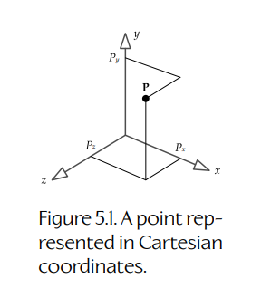

**Figure 5.1.** 用笛卡儿坐标表示的点。

当然，笛卡儿坐标系并不是我们唯一的选择。其他一些常见坐标系包括：

- **柱坐标**（Cylindrical coordinates）。这种坐标系使用一条垂直的“高度”轴 `h`，一条从垂直轴向外发散的径向轴 `r`，以及一个偏航角 theta（`θ`）。在柱坐标中，点 **P** 由三元组 `(Ph, Pr, Pθ)` 表示。如图 5.2 所示。

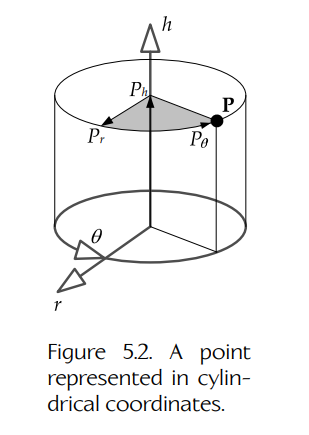

**Figure 5.2.** 用柱坐标表示的点。

- **球坐标**（Spherical coordinates）。这种坐标系使用俯仰角 phi（`φ`）、偏航角 theta（`θ`）和径向度量 `r`。因此，点由三元组 `(Pr, Pφ, Pθ)` 表示。如图 5.3 所示。

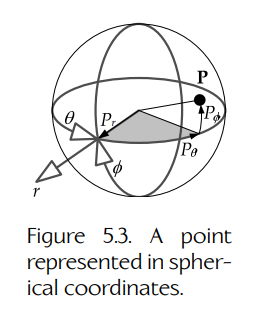

**Figure 5.3.** 用球坐标表示的点。

笛卡儿坐标是游戏编程中使用最广泛的坐标系。不过，要始终记住：应该选择最适合当前问题的坐标系。例如，在 Midway Home Entertainment 的游戏 *Crank the Weasel* 中，主角 Crank 会在一座装饰艺术风格的城市中四处奔跑并拾取战利品。我想让这些战利品物品围绕 Crank 的身体螺旋旋转，并越来越靠近他，直到它们消失。于是，我用相对于 Crank 当前所在位置的柱坐标来表示这些战利品的位置。为了实现这个螺旋动画，我只需要给战利品一个在 `θ` 方向上的恒定角速度，一个沿其径向轴 `r` 向内的小恒定线速度，以及一个沿 `h` 轴向上的极小恒定线速度，使战利品最终逐渐升到 Crank 的裤子口袋高度。这个极其简单的动画看起来效果很好，而且使用柱坐标建模比使用笛卡儿坐标要容易得多。

### 5.2.2 左手坐标系与右手坐标系

在三维笛卡儿坐标中，我们在排列三条相互垂直的轴时有两种选择：**右手系**（right-handed, RH）和 **左手系**（left-handed, LH）。在右手坐标系中，当你用右手手指绕着 z 轴弯曲，并让拇指指向正 z 坐标方向时，手指会从 x 轴指向 y 轴。在左手坐标系中，用左手做同样的事情即可。

左手坐标系和右手坐标系之间唯一的区别，是三条轴中某一条轴的指向。例如，如果 y 轴向上、x 轴向右，那么在右手系中，z 轴会朝向我们（从页面中出来）；而在左手系中，z 轴会远离我们（进入页面）。左手和右手笛卡儿坐标系如图 5.4 所示。

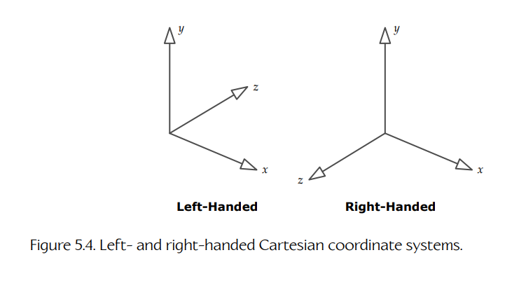

**Figure 5.4.** 左手与右手笛卡儿坐标系。

从左手坐标转换到右手坐标，或者反过来，都很容易。我们只需要翻转任意一条轴的方向，保持另外两条轴不变即可。重要的是要记住，数学规则在左手坐标系和右手坐标系之间并不会改变。改变的只是我们对数字的 **解释**，也就是我们脑海中数字如何映射到 3D 空间的图像。左手和右手约定只适用于可视化，不适用于底层数学。（实际上，在物理模拟中处理叉积时，手性确实很重要，因为叉积并不真正是一个向量，而是一种特殊的数学对象，称为 **伪向量**（pseudovector）。我们将在 5.2.4.9 节中稍微深入讨论伪向量。）

数值表示和可视表示之间的映射，完全由我们这些数学家和程序员决定。我们可以选择让 y 轴向上、z 轴向前、x 轴向左（RH）或向右（LH）。也可以选择让 z 轴向上。或者 x 轴也可以向上，甚至向下。真正重要的是，我们选定一种映射方式，然后始终如一地坚持使用它。

话虽如此，对于某些应用而言，有些约定确实比其他约定更好用。例如，3D 图形程序员通常使用左手坐标系，其中 y 轴向上，x 轴向右，正 z 轴远离观察者，也就是指向虚拟摄像机所朝向的方向。当使用这种特定坐标系把 3D 图形渲染到 2D 屏幕上时，增大的 z 坐标对应于场景中逐渐增加的 **深度**（depth），也就是离虚拟摄像机越来越远。正如后续章节将看到的，这正是使用 z-buffering 方案进行深度遮挡时所需要的。

### 5.2.3 向量

**向量**（vector）是 n 维空间中同时具有 **大小**（magnitude）和 **方向**（direction）的量。向量可以可视化为一条 **有向线段**（directed line segment），它从称为 **尾部**（tail）的点延伸到称为 **头部**（head）的点。与之相对，**标量**（scalar，即普通实数）只表示大小，没有方向。通常，标量用斜体表示（例如 `v`），而向量用粗体表示（例如 **v**）。

一个 3D 向量可以像点一样由三元组标量 `(x, y, z)` 表示。点和向量之间的区别其实相当微妙。从技术上讲，向量只是相对于某个已知点的偏移。只要其大小和方向不变，一个向量可以被移动到 3D 空间中的任何位置，它仍然是同一个向量。

如果我们把向量的尾部固定在坐标系原点，那么向量也可以用来表示一个点。这样的向量有时称为 **位置向量**（position vector）或 **径向向量**（radius vector）。就我们的目的而言，我们可以把任意三元组标量解释为点或向量；只要记住，位置向量受到约束，它的尾部必须保持在所选坐标系的原点处。

这意味着，点和向量在数学上的处理方式存在细微差异。也可以说，点是 **绝对的**（absolute），而向量是 **相对的**（relative）。

绝大多数游戏程序员都会用“向量”一词同时指代点（位置向量）以及严格线性代数意义上的向量（纯方向向量）。大多数 3D 数学库也会这样使用“向量”这个词。在本书中，当这种区别很重要时，我们会使用“**方向向量**”（direction vector）或直接使用“**方向**”（direction）这个术语。请务必始终在脑中清楚地区分点和方向（即使你的数学库并没有这样做）。正如我们将在 5.3.8.1 节中看到的，在把点和方向转换为齐次坐标以便用 4 × 4 矩阵进行操作时，方向需要以不同于点的方式处理。因此，把这两种向量混淆一定会导致代码中的 bug。

#### 5.2.3.1 笛卡儿基向量

定义三个 **正交单位向量**（orthogonal unit vectors）通常很有用，也就是彼此垂直且长度均为 1 的向量，它们分别对应三条主要笛卡儿坐标轴。沿 x 轴的单位向量通常称为 **i**，沿 y 轴的单位向量称为 **j**，沿 z 轴的单位向量称为 **k**。向量 **i**、**j** 和 **k** 有时称为笛卡儿 **基向量**（basis vectors）。

任何点或向量都可以表示为若干标量（实数）乘以这些单位基向量后的和。例如：

```text
(5, 3, −2) = 5i + 3j − 2k.
```

### 5.2.4 向量运算

你能对标量执行的大多数数学运算，也都可以应用到向量上。此外，还有一些只适用于向量的新运算。

#### 5.2.4.1 乘以标量

向量 **a** 乘以标量 `s`，是通过把 **a** 的各个分量分别乘以 `s` 完成的：

```text
sa = (sax, say, saz).
```

乘以标量的效果是缩放向量的大小，而保持其方向不变，如图 5.5 所示。乘以 −1 会翻转向量方向（头部变成尾部，尾部变成头部）。

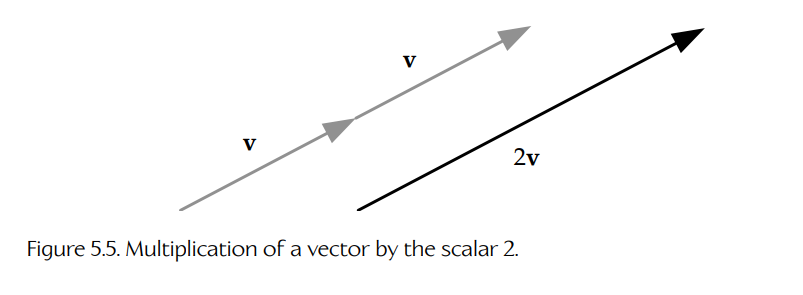

**Figure 5.5.** 向量乘以标量 2。

缩放因子可以沿每条轴不同。我们称其为 **非均匀缩放**（nonuniform scale），它可以表示为一个缩放向量 **s** 与目标向量之间的 **逐分量乘积**（component-wise product），这里用 `⊗` 运算符表示。两个向量之间这种特殊的乘积称为 **Hadamard 积**（Hadamard product）：

```text
s ⊗ a = (sx ax, sy ay, sz az).      (5.1)
```

Hadamard 积也用于将 RGB 颜色向量相乘。（更多细节见 12.3.4.1 节。）

正如我们将在 5.3.9.3 节中看到的，缩放向量 **s** 实际上只是表示 3 × 3 对角缩放矩阵 **S** 的一种紧凑方式。因此，方程（5.1）也可以写成如下形式：

```text
aS = [ ax  ay  az ] [ sx  0   0  ] = [ sxax  syay  szaz ].
                    [ 0   sy  0  ]
                    [ 0   0   sz ]
```

我们将在 5.3 节中更深入地探讨矩阵。

#### 5.2.4.2 加法与减法

两个向量 **a** 和 **b** 的加法，被定义为一个新向量，其分量是 **a** 和 **b** 对应 **分量** 的和。可以通过把向量 **a** 的头部放到向量 **b** 的尾部来可视化这个过程；和向量就是从 **a** 的尾部指向 **b** 的头部的向量（另见图 5.6）：

```text
a + b = [(ax + bx), (ay + by), (az + bz)].
```

向量减法 **a − b** 不过是 **a** 加上 **−b**，也就是把 **b** 乘以 −1 后翻转方向再相加。这对应于一个新向量，其分量是 **a** 的分量与 **b** 的分量之间的差：

```text
a − b = [(ax − bx), (ay − by), (az − bz)].
```

向量加法与减法如图 5.6 所示。

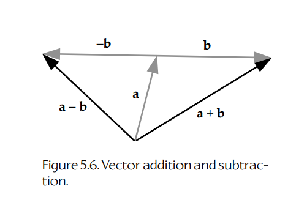

**Figure 5.6.** 向量加法与减法。

**点与方向的加减。**

你可以自由地对方向向量进行加法和减法。不过，从技术上讲，点不能彼此相加——你只能把一个方向向量加到一个点上，其结果是另一个点。同样，你可以取两个点之间的差，结果是一个方向向量。这些运算总结如下：

- direction + direction = direction
- direction − direction = direction
- point + direction = point
- point − point = direction
- point + point = nonsense

#### 5.2.4.3 大小

向量的 **大小**（magnitude）是一个标量，表示该向量在 2D 或 3D 空间中测得的长度。它通过在向量粗体符号两侧加竖线来表示。我们可以使用勾股定理来计算向量大小，如图 5.7 所示：

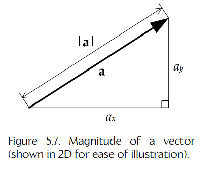

**Figure 5.7.** 向量的大小（为了便于说明，以 2D 显示）。

```text
|a| = sqrt(ax² + ay² + az²).
```

#### 5.2.4.4 向量运算实例

信不信由你，仅凭目前学到的向量运算，我们已经可以解决各种真实世界中的游戏问题了。尝试解决问题时，我们可以使用加法、减法、缩放和大小等运算，从已知数据中生成新数据。例如，如果我们有 AI 角色的当前位置向量 **P1**，以及表示其当前速度的向量 **v**，那么可以通过把速度向量乘以帧时间间隔 `Δt`，再加到当前位置上，求出它下一帧的位置 **P2**。如图 5.8 所示，得到的向量方程为 `P2 = P1 + v Δt`。（这称为 **显式欧拉积分**（explicit Euler integration）——严格来说，它只有在速度恒定时才有效，不过你明白意思即可。）

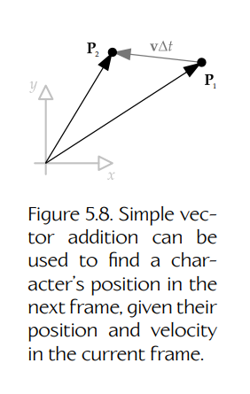

**Figure 5.8.** 简单向量加法可用于根据角色当前帧的位置和速度，求出其下一帧的位置。

再举一个例子，假设我们有两个球体，并想知道它们是否相交。已知两个球体的中心点 **C1** 和 **C2**，我们可以通过简单地相减得到它们之间的方向向量 `d = C2 − C1`。这个向量 **d** 的大小 `d = |d|` 决定了两个球心之间相距多远。如果这个距离小于两个球半径之和，那么它们相交；否则不相交。如图 5.9 所示。

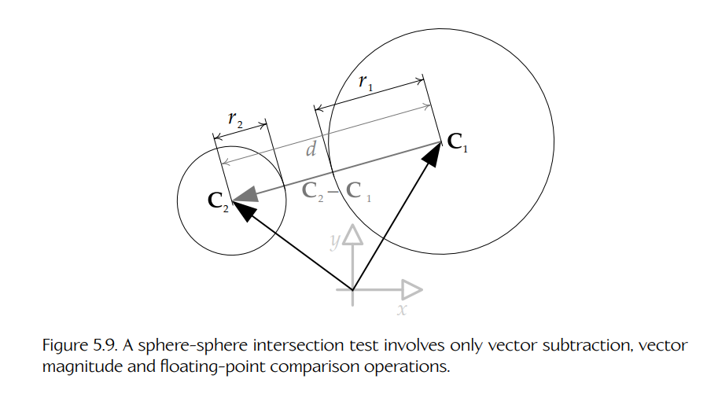

**Figure 5.9.** 球体-球体相交测试只涉及向量减法、向量大小和浮点比较运算。

平方根在大多数计算机上计算开销都很高，所以游戏程序员只要条件允许，就应该始终使用 **平方大小**（squared magnitude）：

```text
|a|² = (ax² + ay² + az²).
```

当比较两个向量的 **相对长度** 时（“向量 **a** 是否比向量 **b** 更长？”），或者当把一个向量的大小与某个其他（已平方的）标量量进行比较时，使用平方大小是有效的。因此，在我们的球体-球体相交测试中，为了获得最大速度，应该计算 `d² = |d|²`，并将其与半径之和的平方 `(r1 + r2)²` 进行比较。编写高性能软件时，永远不要在没有必要时开平方！

#### 5.2.4.5 归一化与单位向量

**单位向量**（unit vector）是大小（长度）为 1 的向量。单位向量在 3D 数学和游戏编程中非常有用，原因我们稍后会看到。

给定任意向量 **v**，其长度为 `v = |v|`，我们可以把它转换成一个与 **v** 指向相同方向、但长度为 1 的单位向量 **u**。为此，我们只需要把 **v** 乘以其大小的倒数。我们称这个过程为 **归一化**（normalization）：

```text
u = v / |v| = (1 / v) v.
```

#### 5.2.4.6 法向量

如果一个向量与某个表面 **垂直**，我们就说它是该表面的 **法向量**（normal vector）。法向量在游戏和计算机图形学中非常有用。例如，一个 **平面** 可以由一个点和一个法向量定义。在 3D 图形中，光照计算会大量使用法向量，用它来定义表面相对于照射到该表面的光线方向的朝向。

法向量通常是单位长度，但并不必须如此。注意不要把“normalization”（归一化）和“normal vector”（法向量）这两个术语混淆。归一化向量是任意单位长度的向量。法向量则是任意垂直于表面的向量，无论它是否为单位长度。

#### 5.2.4.7 点积与投影

向量可以相乘，但与标量不同，向量乘法有多种不同类型。在游戏编程中，我们最常使用下面两种乘法：

- **点积**（dot product，也称 scalar product 或 inner product）；
- **叉积**（cross product，也称 vector product 或 outer product）。

两个向量的 **点积** 会产生一个标量；它定义为两个向量对应分量乘积之和：

```text
a · b = axbx + ayby + azbz = d    （一个标量）。
```

点积也可以写成两个向量大小的乘积，再乘以它们之间夹角的余弦：

```text
a · b = |a| |b| cos θ.
```

点积具有 **交换律**（commutative，也就是两个向量的顺序可以颠倒）并且对加法具有 **分配律**（distributive）：

```text
a · b = b · a;

a · (b + c) = a · b + a · c.
```

点积与标量乘法的结合方式如下：

```text
sa · b = a · sb = s(a · b).
```

**向量投影。**

如果 **u** 是单位向量（`|u| = 1`），那么点积 `(a · u)` 表示向量 **a** 在由 **u** 的方向定义的无限直线上的 **投影**（projection）长度，如图 5.10 所示。这个投影概念在 2D 和 3D 中同样适用，而且对解决各种三维问题都非常有用。

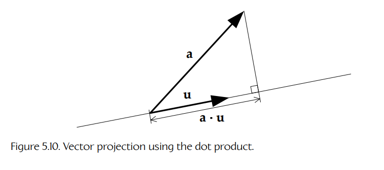

**Figure 5.10.** 使用点积进行向量投影。

**大小作为点积。**

一个向量的平方大小可以通过该向量与自身做点积得到。然后，对平方大小开方就可以轻松得到它的大小：

```text
|a|² = a · a;

|a| = sqrt(a · a).
```

这是因为 0 度的余弦为 1，所以 `|a| |a| cos θ = |a| |a| = |a|²`。

**点积测试。**

点积非常适合用于测试两个向量是否共线或垂直，或者它们是否大致指向相同方向或相反方向。对于任意两个向量 **a** 和 **b**，游戏程序员常使用如下测试，如图 5.11 所示：

- **共线**（Collinear）。`(a · b) = |a| |b| = ab`，也就是它们之间的夹角正好为 0 度。当 **a** 和 **b** 是单位向量时，该点积等于 `+1`。
- **共线但方向相反**（Collinear but opposite）。`(a · b) = −ab`，也就是它们之间的夹角为 180 度。当 **a** 和 **b** 是单位向量时，该点积等于 `−1`。
- **垂直**（Perpendicular）。`(a · b) = 0`，也就是它们之间的夹角为 90 度。
- **方向相同**（Same direction）。`(a · b) > 0`，也就是它们之间的夹角小于 90 度。
- **方向相反**（Opposite directions）。`(a · b) < 0`，也就是它们之间的夹角大于 90 度。

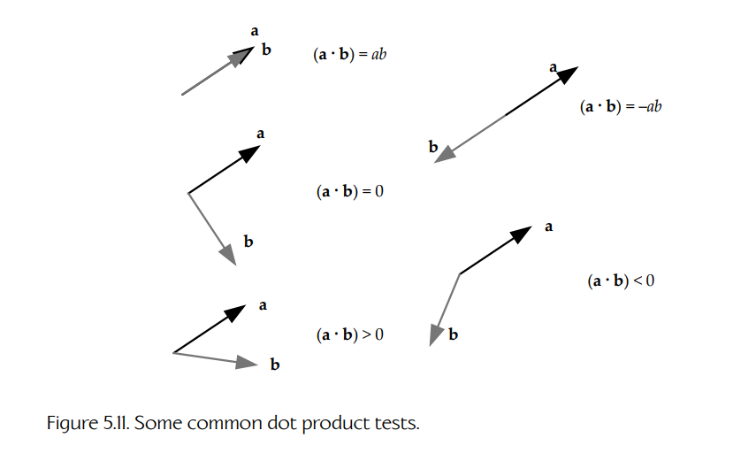

**Figure 5.11.** 一些常见的点积测试。

**点积的其他应用。**

点积在游戏编程中可以用于各种事情。例如，假设我们想知道某个敌人是在玩家角色前方还是后方。我们可以通过简单的向量减法，从玩家位置 **P** 到敌人位置 **E** 得到一个向量 `v = E − P`。假设我们有一个向量 **f**，它指向玩家 **面朝** 的方向。（正如我们将在 5.3.12.3 节中看到的，向量 **f** 可以直接从玩家的 model-to-world 矩阵中提取。）点积 `d = v · f` 可用于测试敌人在玩家前方还是后方：当敌人在前方时，结果为正；在后方时，结果为负。

点积也可以用于求某个点位于平面上方或下方的高度，这在编写登月游戏之类的东西时可能很有用。我们可以用两个向量量来定义一个平面：平面上任意一点 **Q**，以及一个垂直于该平面的单位向量 **n**。为了求点 **P** 位于平面上方的高度 `h`，我们首先从平面上的任意一点（**Q** 就很好）到目标点 **P** 计算一个向量。因此有 `v = P − Q`。向量 **v** 与单位长度法向量 **n** 的点积，就是 **v** 在由 **n** 定义的直线上的投影。而这正是我们要找的高度。因此：

```text
h = v · n = (P − Q) · n.      (5.2)
```

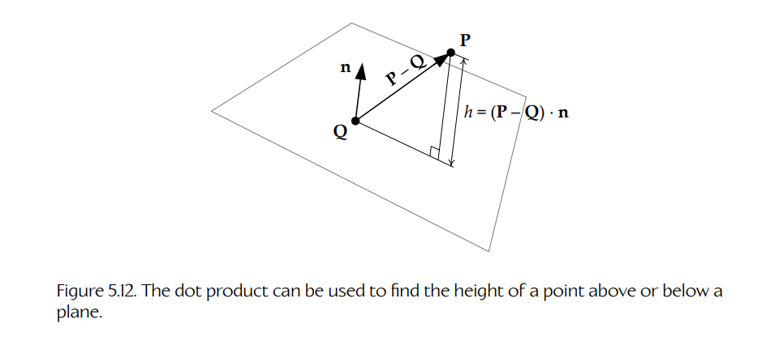

**Figure 5.12.** 点积可以用于求一个点位于平面上方或下方的高度。

如图 5.12 所示。

#### 5.2.4.8 叉积

两个向量的 **叉积**（cross product，也称 outer product 或 vector product）会产生另一个向量，该向量垂直于参与相乘的两个向量，如图 5.13 所示。叉积运算只在三维中定义：

```text
a × b = [(aybz − azby), (azbx − axbz), (axby − aybx)]
      = (aybz − azby)i + (azbx − axbz)j + (axby − aybx)k.
```

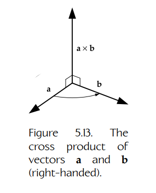

**Figure 5.13.** 向量 **a** 和 **b** 的叉积（右手系）。

**叉积的大小。**

叉积向量的大小，等于两个向量大小的乘积，再乘以它们之间夹角的正弦。（这类似于点积的定义，只是把余弦替换成正弦。）

```text
|a × b| = |a| |b| sin θ.
```

叉积大小 `|a × b|` 等于以 **a** 和 **b** 为边的平行四边形面积，如图 5.14 所示。由于三角形是平行四边形的一半，因此，如果一个三角形的顶点由位置向量 **V1**、**V2** 和 **V3** 指定，那么它的面积可以用任意两条边的叉积大小的一半来计算：

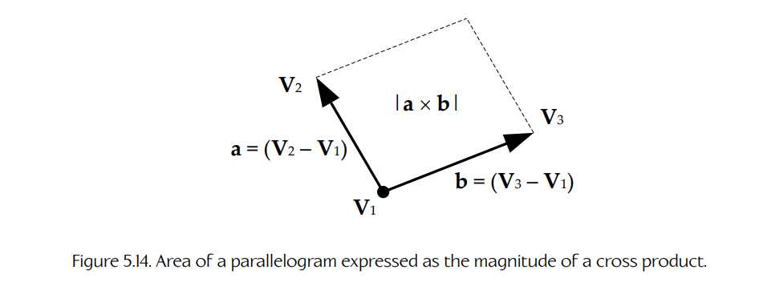

**Figure 5.14.** 用叉积大小表示的平行四边形面积。

```text
Atriangle = 1/2 |(V2 − V1) × (V3 − V1)|.
```

**叉积的方向。**

使用右手坐标系时，可以用 **右手法则**（right-hand rule）来确定叉积的方向。只需弯曲手指，使它们指向你会把向量 **a** 旋转到向量 **b** 上方的方向，那么叉积 `(a × b)` 就会位于你的拇指方向。

注意，当使用左手坐标系时，叉积由 **左手法则**（left-hand rule）定义。这意味着叉积方向会随坐标系选择而改变。乍看起来这可能有点奇怪，但请记住，坐标系的手性并不会影响我们执行的数学计算——它只会改变我们对数字在 3D 空间中长什么样的 **可视化**。当从右手系转换到左手系，或反向转换时，所有点和向量的数值表示都会保持不变，但某一条轴会被翻转。因此，我们对一切事物的可视化都会沿这条被翻转的轴镜像。如果某个叉积恰好与我们正在翻转的轴对齐（例如 z 轴），那么这条轴翻转时，叉积也需要翻转。如果它不翻转，那么叉积本身的数学定义就必须改变，使得叉积的 z 坐标在新坐标系中变为负值。你不必为这些事情过于纠结。只要记住：在 **可视化** 叉积时，右手坐标系使用右手法则，左手坐标系使用左手法则。

**叉积的性质。**

叉积 **不满足交换律**（not commutative，也就是顺序很重要）：

```text
a × b ≠ b × a.
```

不过，它满足 **反交换律**（anti-commutative）：

```text
a × b = −(b × a).
```

叉积对加法具有分配律：

```text
a × (b + c) = (a × b) + (a × c).
```

它与标量乘法的结合方式如下：

```text
(sa) × b = a × (sb) = s(a × b).
```

笛卡儿基向量通过叉积的关系如下：

```text
i × j = −(j × i) = k

j × k = −(k × j) = i

k × i = −(i × k) = j
```

这三个叉积定义了围绕笛卡儿坐标轴的 **正向旋转** 方向。正向旋转从 x 到 y（绕 z 轴），从 y 到 z（绕 x 轴），以及从 z 到 x（绕 y 轴）。注意绕 y 轴的旋转在字母顺序上是“反过来”的，因为它从 z 到 x，而不是从 x 到 z。正如我们稍后会看到的，这提示了为什么绕 y 轴旋转的矩阵看起来相对于绕 x 轴和 z 轴旋转的矩阵是“反的”。

**叉积实例。**

叉积在游戏中有很多应用。它最常见的用途之一，是寻找一个垂直于另外两个向量的向量。正如我们将在 5.3.12.2 节中看到的，如果我们知道对象的局部单位基向量（**i**<sub>local</sub>、**j**<sub>local</sub> 和 **k**<sub>local</sub>），就可以很容易找到表示对象朝向的矩阵。假设我们只知道对象的 **k**<sub>local</sub> 向量，也就是对象面朝的方向。如果假设该对象没有绕 **k**<sub>local</sub> 的滚转，那么可以通过对 **k**<sub>local</sub>（已知）和世界空间上方向量 **j**<sub>world</sub>（等于 `[0 1 0]`）取叉积来求出 **i**<sub>local</sub>。做法如下：`i_local = normalize(j_world × k_local)`。然后，我们可以简单地对 **i**<sub>local</sub> 和 **k**<sub>local</sub> 做叉积，求出 **j**<sub>local</sub>：`j_local = k_local × i_local`。

一种非常类似的技术也可以用于求三角形或其他平面的单位法向量。给定平面上的三个点 **P1**、**P2** 和 **P3**，法向量就是：

```text
n = normalize((P2 − P1) × (P3 − P1)).
```

叉积也用于物理模拟。当一个力作用于物体时，当且仅当它作用于偏离中心的位置时，它才会引起旋转运动。这种旋转力称为 **力矩**（torque），计算方式如下。给定一个力 **f**，以及从质心到受力点的向量 **r**，力矩为：

```text
N = r × f.
```

#### 5.2.4.9 伪向量与外代数

我们在 5.2.2 节中提到过，叉积实际上并不产生一个向量——它产生的是一种特殊的数学对象，称为 **伪向量**（pseudovector）。向量和伪向量之间的差异相当微妙。事实上，在执行游戏编程中通常遇到的那些变换时，你根本看不出它们之间的区别，这些变换包括平移、旋转和缩放。只有当你 **反射** 坐标系时，例如从左手坐标系移动到右手坐标系时，伪向量的特殊性质才会显现出来。在反射下，一个向量会变换成它的镜像，这大概符合你的预期。但当一个伪向量被反射时，它会变换成它的镜像，同时还会 **改变方向**。

位置及其所有导数（线速度、加速度、加加速度）都由真实向量表示，也称为 **极向量**（polar vectors）或 **逆变向量**（contravariant vectors）。角速度和磁场则由伪向量表示，也称为 **轴向量**（axial vectors）、**协变向量**（covariant vectors）、**双向量**（bivectors）或 **2-blades**。三角形的表面法线（通过叉积计算得到）也是一个伪向量。

值得注意的是，叉积 `(A × B)`、标量三重积 `(A · (B × C))` 以及矩阵的行列式彼此之间都有联系，而伪向量位于这一切的核心。数学家提出了一组代数规则，称为 **外代数**（exterior algebra）或 **Grassman 代数**（Grassman algebra），用于描述向量和伪向量如何工作，并允许我们计算平行四边形的面积（2D 中）、平行六面体的体积（3D 中），以及更高维中的类似量。

我们不会在这里深入所有细节，但 Grassman 代数的基本思想是引入一种特殊的向量积，称为 **楔积**（wedge product），记作 `A ∧ B`。两个向量的楔积会产生一个伪向量，并等价于叉积；它也表示由这两个向量形成的平行四边形的 **有符号面积**（signed area），其中符号告诉我们是从 A 旋转到 B，还是反过来。连续做两次楔积 `A ∧ B ∧ C`，等价于标量三重积 `A · (B × C)`，并会产生另一种奇特的数学对象，称为 **伪标量**（pseudoscalar，也称为 trivector 或 3-blade）。它可以解释为由三个向量形成的平行六面体的 **有符号体积**（signed volume）（见图 5.15）。这一思想也可以推广到更高维。关于 Grassman 代数的出色深入讨论，见 [34, Section 4.1]。

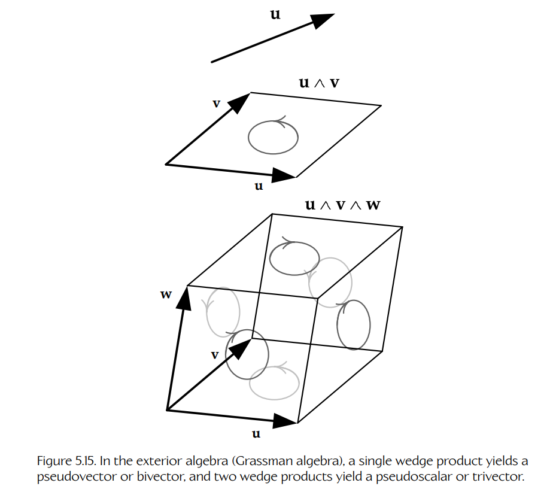

**Figure 5.15.** 在外代数（Grassman 代数）中，一次楔积产生伪向量或双向量，两次楔积产生伪标量或三向量。

这些对我们游戏程序员意味着什么？主要是，它能让我们更深入地理解在使用点积和叉积时到底发生了什么，尽管有些游戏开发团队也在尝试直接在引擎中使用 Grassman 代数。对于 3D 数学中的大多数实际目的而言，我们真正需要记住的是：某些类型的向量实际上是伪向量，因此我们需要正确地变换它们。

### 5.2.5 点与向量的线性插值

在游戏中，我们经常需要找到位于两个已知向量中间的向量。例如，如果我们想在两秒内以每秒 30 帧的速度，把一个对象从点 **A** 平滑地动画移动到点 **B**，那么就需要找到 **A** 和 **B** 之间的 60 个中间位置。

**线性插值**（linear interpolation）是一种简单的数学操作，用来在两个已知点之间找到一个中间点。这个操作的名称经常缩写为 **lerp**。该操作定义如下，其中 `β` 的取值范围是闭区间 `[0, 1]`：

```text
L = lerp(A, B, β) = (1 − β)A + βB

  = [(1 − β)Ax + βBx,  (1 − β)Ay + βBy,  (1 − β)Az + βBz]
```

从几何上看，`L = lerp(A, B, β)` 是一个点的位置向量，该点位于从点 **A** 到点 **B** 的线段上，距离 **A** 到 **B** 的进度为 `100β%`，如图 5.16 所示。例如，如果 `β` 为 0.3，那么该点就是从 **A** 到 **B** 路径上 30% 的位置。从数学上看，lerp 函数只是两个输入向量的 **加权平均**（weighted average），权重分别为 `(1 − β)` 和 `β`。注意，这两个权重始终相加为 1，这是任何加权平均的一般要求。

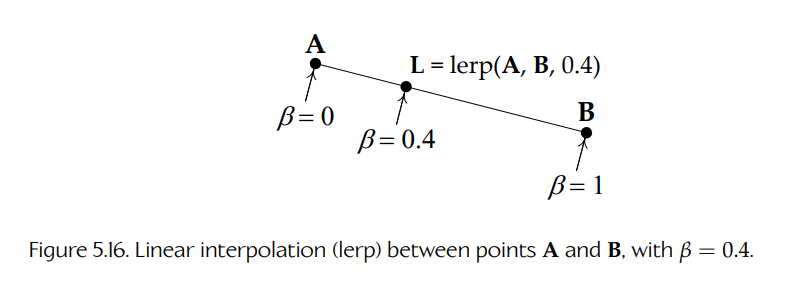

**Figure 5.16.** 点 **A** 和 **B** 之间的线性插值（lerp），其中 `β = 0.4`。