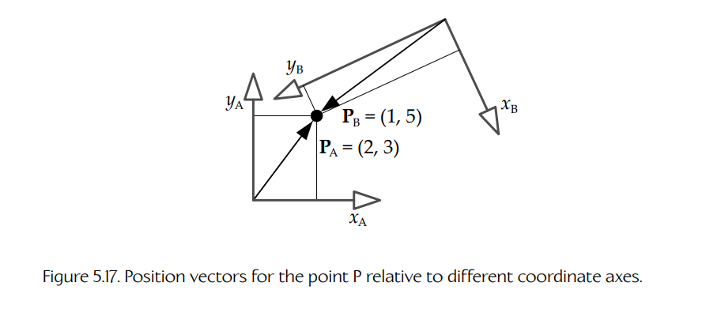
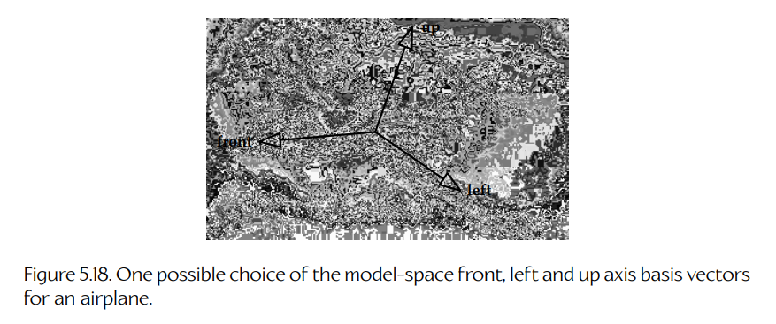
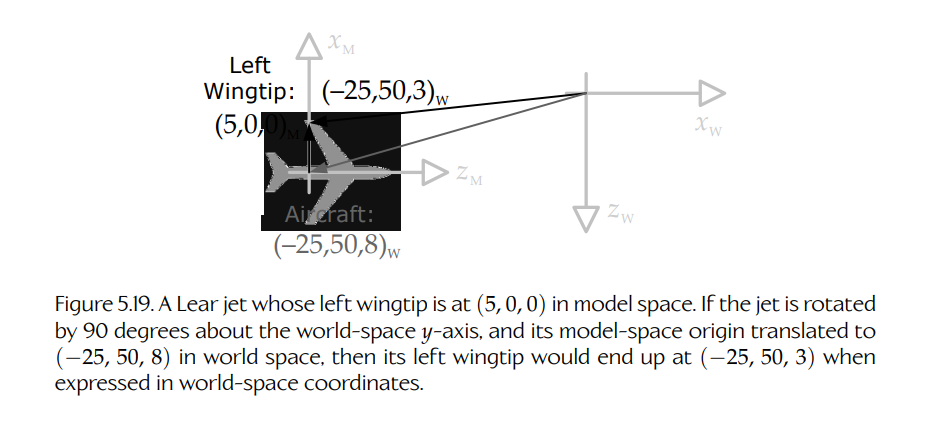
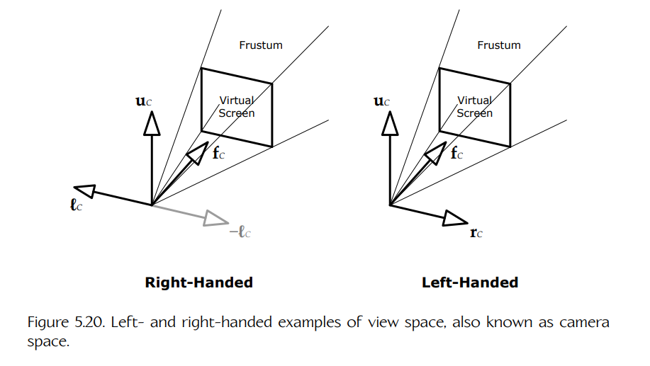
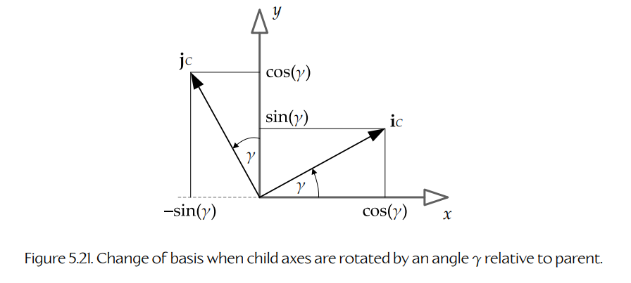
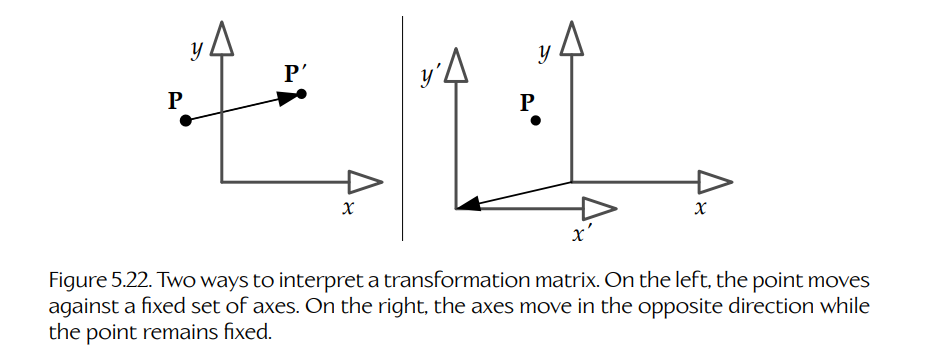

## 5.3 矩阵

**矩阵**（matrix）是由 `m × n` 个标量组成的矩形数组。矩阵是表示线性变换的一种方便方式，例如平移、旋转和缩放。

矩阵 **M** 通常写成一个由标量 `Mrc` 组成的网格，并用方括号括起来，其中下标 `r` 和 `c` 分别表示该元素的行索引和列索引。例如，如果 **M** 是一个 3 × 3 矩阵，它可以写成如下形式：

```text
      [ M11  M12  M13 ]
M  =  [ M21  M22  M23 ] .
      [ M31  M32  M33 ]
```

### 5.3.1 矩阵的行列式

矩阵 **M** 的 **行列式**（determinant）是一个单一的标量值，它概括了该矩阵的一些重要特征。例如，当一个矩阵的行列式为零时，这说明它没有逆矩阵（见 5.3.6 节）。行列式通过对矩阵中特定元素组进行乘法、加法和减法来计算。2 × 2 矩阵和 3 × 3 矩阵的行列式计算如下：

```text
    [ a  b ]
det [      ] = (ad − bc);
    [ c  d ]
```

```text
    [ a  b  c ]         [ e  f ]       [ d  f ]       [ d  e ]
det [ d  e  f ] = a det [      ] − b det [      ] + c det [      ] .
    [ g  h  i ]         [ h  i ]       [ g  i ]       [ g  h ]
```

### 5.3.2 矩阵的类型

我们可以把 3 × 3 矩阵的行和/或列看作 3D 向量。当一个 3 × 3 矩阵的所有行向量和列向量都具有单位长度，并且它们彼此正交时，我们称它为 **正交矩阵**（orthogonal matrix，也称为 orthonormal matrix）。如果再加上一个额外约束，即它的行列式 `det(M) = +1`，那么我们称它为 **特殊正交矩阵**（special orthogonal matrix）。特殊正交矩阵表示纯旋转。

在某些约束下，一个 4 × 4 矩阵可以表示任意 3D **变换**（transformation），包括 **平移**（translation）、**旋转**（rotation）和 **缩放**（scale）的变化。这类矩阵称为 **变换矩阵**（transformation matrices），也是作为游戏工程师时对我们最有用的一类矩阵。由矩阵表示的变换会通过矩阵乘法应用到点或向量上。我们将在下面研究它的工作方式。

**仿射矩阵**（affine matrix）是一个 4 × 4 变换矩阵，它保持直线的平行性和相对距离比例，但不一定保持绝对长度和角度。仿射矩阵可以是下列操作的任意组合：旋转、平移、缩放和/或切变。

### 5.3.3 矩阵乘法

两个矩阵 **A** 和 **B** 的乘积 **P** 写作 `P = AB`。如果 **A** 和 **B** 是变换矩阵，那么乘积 **P** 就是另一个变换矩阵，它会执行原始两个变换。例如，如果 **A** 是一个缩放矩阵，而 **B** 是一个旋转矩阵，那么矩阵 **P** 会对应用到它的点或向量同时进行缩放和旋转。这在游戏编程中特别有用，因为我们可以预先计算一个矩阵，使它执行一整串变换，然后把所有这些变换高效地应用到大量向量上。

为了计算矩阵乘积，我们只需要对 `nA × mA` 矩阵 **A** 的行与 `nB × mB` 矩阵 **B** 的列进行点积。每一个点积都会成为结果矩阵 **P** 的一个分量。只要两个矩阵的 **内维度**（inner dimensions）相等，也就是 `mA = nB`，这两个矩阵就可以相乘。例如，如果 **A** 和 **B** 都是 3 × 3 矩阵，那么 `P = AB` 可以表示如下：

```text
      [ P11  P12  P13 ]
P  =  [ P21  P22  P23 ]
      [ P31  P32  P33 ]

   =  [ Arow1 · Bcol1   Arow1 · Bcol2   Arow1 · Bcol3 ]
      [ Arow2 · Bcol1   Arow2 · Bcol2   Arow2 · Bcol3 ] .
      [ Arow3 · Bcol1   Arow3 · Bcol2   Arow3 · Bcol3 ]
```

矩阵乘法不满足交换律。换句话说，矩阵乘法的顺序很重要：

```text
AB ≠ BA
```

我们将在 5.3.4 节中看到为什么这一点很重要。

矩阵乘法常常称为 **连接**（concatenation），因为 `n` 个变换矩阵的乘积就是一个矩阵，它按照这些矩阵相乘的顺序，把原始变换序列连接或串联在一起。

### 5.3.4 将点和向量表示为矩阵

点和向量可以表示为 **行矩阵**（row matrices，`1 × n`）或 **列矩阵**（column matrices，`n × 1`），其中 `n` 是我们正在处理的空间维度（通常是 2 或 3）。例如，向量 `v = (3, 4, −1)` 可以写作：

```text
v1 = [ 3   4   −1 ]
```

或写作：

```text
      [  3 ]
v2 =  [  4 ] = v1^T .
      [ −1 ]
```

这里，上标 `T` 表示矩阵 **转置**（transposition，见 5.3.7 节）。

选择列向量还是行向量完全是任意的，但它确实会影响矩阵乘法的书写顺序。这是因为在矩阵相乘时，两个矩阵的内维度必须相等，因此：

- 要用一个 `1 × n` 行向量乘以一个 `n × n` 矩阵，向量必须出现在矩阵的 **左侧**：

```text
v'1×n = v1×n M n×n
```

- 而要用一个 `n × n` 矩阵乘以一个 `n × 1` 列向量，向量必须出现在矩阵的 **右侧**：

```text
v'n×1 = M n×n v n×1
```

如果多个变换矩阵 **A**、**B** 和 **C** 依次应用到向量 **v** 上，那么在使用 **行向量** 时，变换从 **左到右** “读取”；而在使用 **列向量** 时，则从 **右到左** 读取。记住这一点最简单的方式是：离向量最近的矩阵最先应用。下面的括号说明了这一点：

```text
v'  = (((vA)B)C)          Row vectors: read left-to-right;

v'T = (CT(BT(ATvT)))      Column vectors: read right-to-left.
```

本书将采用 **行向量约定**（row vector convention），因为从左到右读取变换顺序对英语读者而言最直观。话虽如此，你一定要仔细确认你的游戏引擎，以及你阅读的其他书籍、论文或网页使用的是哪种约定。通常可以通过观察向量-矩阵乘法中向量写在矩阵左侧（行向量）还是右侧（列向量）来判断。使用列向量时，你需要把本书中展示的所有矩阵全部转置。

### 5.3.5 单位矩阵

**单位矩阵**（identity matrix）是一种矩阵，当它与任何其他矩阵相乘时，结果仍然是原来的那个矩阵。它通常用符号 **I** 表示。单位矩阵总是一个方阵，对角线上都是 1，其他位置都是 0：

```text
         [ 1  0  0 ]
I3×3  =  [ 0  1  0 ] ;
         [ 0  0  1 ]

AI = IA = A.
```

### 5.3.6 矩阵求逆

矩阵 **A** 的 **逆矩阵**（inverse，记作 `A^-1`）是另一个矩阵，它会 **撤销** 矩阵 **A** 的效果。因此，例如，如果 **A** 使对象绕 z 轴旋转 37 度，那么 `A^-1` 会使对象绕 z 轴旋转 −37 度。同样，如果 **A** 把对象缩放到原始大小的两倍，那么 `A^-1` 会把对象缩放到一半大小。当一个矩阵乘以它自己的逆矩阵时，结果总是单位矩阵，因此：

```text
A(A^-1) = (A^-1)A = I.
```

并非所有矩阵都有逆矩阵。不过，所有 **仿射矩阵**（纯旋转、平移、缩放和切变的组合）都有逆矩阵。如果逆矩阵存在，可以使用高斯消元法或下三角-上三角（LU）分解来求得。

由于我们会大量处理矩阵乘法，所以这里需要注意：一串连接矩阵的逆，可以写成各个矩阵逆的 **反向连接**。例如：

```text
(ABC)^-1 = C^-1 B^-1 A^-1.
```

### 5.3.7 转置

矩阵 **M** 的 **转置**（transpose）记作 `M^T`。它通过沿原矩阵的对角线反射元素得到。换句话说，原矩阵的行会变成转置矩阵的列，反之亦然：

```text
[ a  b  c ]T     [ a  d  g ]
[ d  e  f ]   =  [ b  e  h ] .
[ g  h  i ]      [ c  f  i ]
```

转置有很多用途。首先，一个正交规范（纯旋转）矩阵的逆恰好等于它的转置——这是个好消息，因为转置矩阵比一般情况下求逆矩阵要便宜得多。当把数据从一个数学库移动到另一个数学库时，转置也可能很重要，因为有些库使用列向量，而另一些库期望行向量。基于行向量的库所使用的矩阵，相对于采用列向量约定的库所使用的矩阵，会是转置关系。

和逆矩阵一样，一串连接矩阵的转置也可以重写为各个矩阵转置的反向连接。例如：

```text
(ABC)^T = C^T B^T A^T.
```

当我们考虑如何把变换矩阵应用到点和向量上时，这一点会很有用。

### 5.3.8 齐次坐标

你可能还记得高中代数里，一个 2 × 2 矩阵可以表示二维中的旋转。要让向量 **r** 旋转 `φ` 度（其中正旋转是逆时针方向），可以写成：

```text
[ r'x  r'y ] = [ rx  ry ] [  cos φ   sin φ ]
                         [ −sin φ   cos φ ] .
```

三维中的旋转可以用 3 × 3 矩阵表示，这大概并不令人意外。上面的二维例子其实只是一个绕 z 轴的三维旋转，所以我们可以写成：

```text
[ r'x  r'y  r'z ] = [ rx  ry  rz ] [  cos φ   sin φ   0 ]
                                  [ −sin φ   cos φ   0 ] .
                                  [    0       0      1 ]
```

自然会出现一个问题：3 × 3 矩阵能否用来表示 **平移**（translation）？很遗憾，答案是否定的。把点 **r** 平移向量 **t** 后的结果，需要把 **t** 的各个分量分别加到 **r** 的各个分量上：

```text
r + t = [ (rx + tx)   (ry + ty)   (rz + tz) ].
```

矩阵乘法涉及矩阵元素的乘法和加法，因此用乘法实现平移的想法看起来很有希望。但是，不幸的是，我们无法把 **t** 的分量安排进一个 3 × 3 矩阵中，使得它与列向量 **r** 相乘后产生类似 `(rx + tx)` 的和。

好消息是，如果使用 4 × 4 矩阵，我们就可以得到这样的和。这样的矩阵会是什么样？首先，我们知道不希望有任何旋转效果，因此左上角的 3 × 3 部分应该包含一个单位矩阵。如果我们把 **t** 的分量横向排列在矩阵最底部一行，并把 **r** 向量的第四个元素（通常称为 `w`）设为 1，那么向量 **r** 与矩阵第一列做点积会得到 `(1 · rx) + (0 · ry) + (0 · rz) + (tx · 1)`，这正是我们想要的结果。如果矩阵右下角包含 1，并且第四列其余部分都是 0，那么结果向量的 `w` 分量也会是 1。最终的 4 × 4 平移矩阵如下：

```text
                                  [ 1   0   0   0 ]
r + t = [ rx  ry  rz  1 ]         [ 0   1   0   0 ]
                                  [ 0   0   1   0 ]
                                  [ tx  ty  tz  1 ]

      = [ (rx + tx)   (ry + ty)   (rz + tz)   1 ].
```

当一个点或向量以这种方式从三维扩展到四维时，我们说它被写成了 **齐次坐标**（homogeneous coordinates）。齐次坐标中的点总是有 `w = 1`。游戏引擎中的大多数 3D 矩阵数学，都是使用 4 × 4 矩阵以及写成齐次坐标形式的四元素点和向量来完成的。

#### 5.3.8.1 变换方向向量

从数学上讲，点（位置向量）和方向向量的处理方式存在细微差异。当用矩阵变换一个点时，矩阵的平移、旋转和缩放都会应用到这个点上。但当用矩阵变换一个方向时，矩阵的 **平移** 效果会被忽略。这是因为方向向量本身没有平移含义——把平移应用到方向上会改变它的大小，而这通常不是我们想要的。

在齐次坐标中，我们通过规定点的 `w` 分量等于 1，而方向向量的 `w` 分量等于 0 来实现这一点。在下面的例子中，请注意向量 **v** 的 `w = 0` 分量如何与矩阵中的 **t** 向量相乘，从而在最终结果中消除平移：

```text
[ v  0 ] [ U  0 ] = [ (vU + 0t)   0 ] = [ vU  0 ].
         [ t  1 ]
```

从技术上讲，齐次（四维）坐标中的点可以通过将 `x`、`y` 和 `z` 分量除以 `w` 分量，转换回非齐次（三维）坐标：

```text
[ x  y  z  w ] ≡ [ x/w   y/w   z/w ].
```

这解释了为什么我们把点的 `w` 分量设为 1，而把向量的 `w` 分量设为 0。除以 `w = 1` 不会影响点的坐标；但把一个纯方向向量的分量除以 `w = 0` 会得到无穷远。4D 中的无穷远点可以旋转但不能平移，因为无论我们尝试应用什么平移，这个点都会保持在无穷远。因此，实际上三维空间中的纯方向向量就像是四维齐次空间中的无穷远点。

### 5.3.9 基本变换矩阵

任何仿射变换矩阵都可以通过简单地连接一系列 4 × 4 矩阵来创建，这些矩阵分别表示纯平移、纯旋转、纯缩放和/或纯切变。下面介绍这些基本的变换构建块。（我们会省略切变，因为它在游戏中往往很少使用。）

注意，所有仿射 4 × 4 变换矩阵都可以划分为四个部分：

```text
           [ U3×3   03×1 ]
Maffine =  [              ] .
           [ t1×3     1   ]
```

- 左上角的 3 × 3 矩阵 **U**，表示旋转和/或缩放；
- 一个 1 × 3 的平移向量 **t**；
- 一个 3 × 1 的零向量 `0 = [ 0  0  0 ]^T`；
- 矩阵右下角的标量 1。

当一个点乘以这样分块的矩阵时，结果如下：

```text
[ r'1×3  1 ] = [ r1×3  1 ] [ U3×3   03×1 ] = [ (rU + t)   1 ].
                            [ t1×3     1   ]
```

#### 5.3.9.1 平移

下面的矩阵会将点 **r** 平移向量 **t**：

```text
                                  [ 1   0   0   0 ]
r + t = [ rx  ry  rz  1 ]         [ 0   1   0   0 ]        (5.3)
                                  [ 0   0   1   0 ]
                                  [ tx  ty  tz  1 ]

      = [ (rx + tx)   (ry + ty)   (rz + tz)   1 ],
```

或者用分块简写表示：

```text
[ r  1 ] [ I  0 ] = [ (r + t)  1 ].
         [ t  1 ]
```

要求一个纯平移矩阵的逆，只需要把向量 **t** 取反即可，也就是取反 `tx`、`ty` 和 `tz`。

#### 5.3.9.2 旋转

所有 4 × 4 纯旋转矩阵都具有如下形式：

```text
[ r  1 ] [ R  0 ] = [ rR  1 ].
         [ 0  1 ]
```

其中 **t** 向量为零，左上角的 3 × 3 矩阵 **R** 包含旋转角的余弦和正弦值，角度以弧度为单位。

下面的矩阵表示绕 x 轴旋转角度 `φ`：

```text
                                      [ 1      0       0     0 ]
rotatex(r, φ) = [ rx  ry  rz  1 ]     [ 0    cosφ    sinφ   0 ] .   (5.4)
                                      [ 0   −sinφ    cosφ   0 ]
                                      [ 0      0       0     1 ]
```

下面的矩阵表示绕 y 轴旋转角度 `θ`。（注意，这个矩阵相对于另外两个矩阵是转置的——正负正弦项沿对角线进行了反射。）

```text
                                      [ cosθ   0   −sinθ   0 ]
rotatey(r, θ) = [ rx  ry  rz  1 ]     [  0     1     0     0 ] .   (5.5)
                                      [ sinθ   0    cosθ   0 ]
                                      [  0     0     0     1 ]
```

下面的矩阵表示绕 z 轴旋转角度 `γ`：

```text
                                      [  cosγ   sinγ   0   0 ]
rotatez(r, γ) = [ rx  ry  rz  1 ]     [ −sinγ   cosγ   0   0 ] .   (5.6)
                                      [   0      0     1   0 ]
                                      [   0      0     0   1 ]
```

关于这些矩阵，有几点观察：

- 左上角 3 × 3 矩阵中的 1 总是出现在我们正在绕其旋转的轴上，而正弦和余弦项位于轴外位置。
- 正向旋转从 x 到 y（绕 z 轴），从 y 到 z（绕 x 轴），以及从 z 到 x（绕 y 轴）。z 到 x 的旋转发生了“环绕”，这就是为什么绕 y 轴的旋转矩阵相对于另外两个矩阵是转置的。（可以用右手法则或左手法则来记住这一点。）
- 纯旋转矩阵的逆就是它的转置。这是因为对旋转求逆等价于旋转负角度。你可能还记得 `cos(−θ) = cos(θ)`，而 `sin(−θ) = −sin(θ)`，因此对角度取负会使两个正弦项有效地交换位置，而余弦项保持不变。

#### 5.3.9.3 缩放

下面的矩阵会分别沿 x 轴、y 轴和 z 轴以系数 `sx`、`sy` 和 `sz` 缩放点 **r**：

```text
                              [ sx   0    0    0 ]
rS = [ rx  ry  rz  1 ]        [ 0    sy   0    0 ]        (5.7)
                              [ 0    0    sz   0 ]
                              [ 0    0    0    1 ]

   = [ sxrx   syry   szrz   1 ],
```

或者用分块简写表示：

```text
[ r  1 ] [ S3×3  0 ] = [ rS3×3  1 ].
         [  0    1 ]
```

关于这种矩阵，有几点观察：

- 要对缩放矩阵求逆，只需要把 `sx`、`sy` 和 `sz` 替换为它们的倒数，也就是 `1/sx`、`1/sy` 和 `1/sz`。
- 当三条轴上的缩放系数都相同（`sx = sy = sz`）时，我们称之为 **均匀缩放**（uniform scale）。球体在均匀缩放下仍然保持为球体，而在非均匀缩放下会变成椭球。为了让包围球检测的数学保持简单且快速，许多游戏引擎会施加限制：可渲染几何体或碰撞基本体只能使用均匀缩放。
- 当一个均匀缩放矩阵 **Su** 和一个旋转矩阵 **R** 连接时，乘法顺序并不重要，也就是 `SuR = RSu`。这只对 **均匀缩放** 成立！

### 5.3.10 4 × 3 矩阵

仿射 4 × 4 矩阵最右侧一列总是包含向量 `[ 0  0  0  1 ]^T`。因此，游戏程序员经常省略第四列以节省内存。你会在游戏数学库中经常遇到 4 × 3 仿射矩阵。

### 5.3.11 坐标空间

我们已经看到了如何使用 4 × 4 矩阵把变换应用到点和方向向量上。我们可以把这个想法扩展到刚体对象：这样的对象可以被看作由无限多个点组成。对一个刚体对象应用变换，就像对对象内部的每一个点应用同一个变换。例如，在计算机图形学中，一个对象通常表示为由三角形构成的网格，每个三角形都有三个由点表示的顶点。在这种情况下，可以通过依次对对象的所有顶点应用变换矩阵来变换该对象。



**图 5.17** 点 **P** 相对于不同坐标轴的位置向量。

前面说过，点是一个尾部固定在某个坐标系原点上的向量。换句话说，点（位置向量）总是相对于一组坐标轴来表达的。每当我们选择一组新的坐标轴时，表示点的三元组数值都会发生变化。在图 5.17 中，我们看到点 **P** 由两个不同的位置向量表示——向量 **PA** 给出 **P** 相对于 “A” 轴的位置，而向量 **PB** 给出同一个点相对于另一组 “B” 轴的位置。

在物理学中，一组坐标轴表示一个 **参考系**（frame of reference），因此我们有时把一组轴称为 **坐标框架**（coordinate frame，或简称 frame）。游戏行业中的人也使用 **坐标空间**（coordinate space，或简称 space）这个术语来指一组坐标轴。接下来的几节中，我们将看看游戏和计算机图形中最常见的几个坐标空间。

#### 5.3.11.1 模型空间

当使用 Maya 或 3DStudioMAX 等工具创建三角形网格时，三角形顶点的位置是相对于一个笛卡儿坐标系指定的，我们称这个坐标系为 **模型空间**（model space，也称 object space 或 local space）。模型空间原点通常放置在对象内部的一个中心位置，例如其质心处，或者类人/动物角色两脚之间的地面上。

大多数游戏对象都有固有的方向性。例如，飞机有机头、尾翼和机翼，它们分别对应前、上和左/右方向。模型空间坐标轴通常会与模型上的这些自然方向对齐，并赋予直观的名称来表示它们的方向性，如图 5.18 所示。



**图 5.18** 飞机模型空间中 front、left 和 up 轴基向量的一种可能选择。

- **Front**。这个名称赋予指向对象自然移动或面朝方向的轴。本书中，我们会用符号 **f** 表示沿 front 轴的单位基向量。
- **Up**。这个名称赋予指向对象顶部的轴。沿该轴的单位基向量记作 **u**。
- **Left** 或 **right**。名称 “left” 或 “right” 赋予指向对象左侧或右侧的轴。具体选择哪个名称，取决于你的游戏引擎使用左手坐标还是右手坐标。沿该轴的单位基向量会根据情况记作 **ℓ** 或 **r**。

（front、up、left）标签与 `(x, y, z)` 轴之间的映射完全是任意的。在使用右手坐标轴时，一个常见选择是把标签 front 分配给正 z 轴，把标签 left 分配给正 x 轴，把标签 up 分配给正 y 轴（或者用单位基向量表示为 `f = k`、`ℓ = i`、`u = j`）。不过，`+x` 是 front、`+z` 是 right 也同样常见（`f = i`、`r = k`、`u = j`）。我也使用过一些引擎，其中 z 轴是竖直方向。真正的要求只有一个：在整个引擎中始终坚持一种约定。

作为直观轴名称如何减少混淆的例子，可以考虑 **欧拉角**（Euler angles：pitch、yaw、roll），它们常用于描述飞机的朝向。不能用 `(i, j, k)` 基向量来定义 pitch、yaw 和 roll 角，因为它们的朝向是任意的。不过，我们 **可以** 用 `(ℓ, u, f)` 基向量来定义 pitch、yaw 和 roll，因为它们的朝向定义得很清楚。具体来说：

- **pitch** 是绕 **ℓ** 或 **r** 的旋转；
- **yaw** 是绕 **u** 的旋转；
- **roll** 是绕 **f** 的旋转。

#### 5.3.11.2 世界空间

**世界空间**（world space）是一个固定的坐标空间，游戏世界中所有对象的位置、朝向和缩放都在其中表达。这个坐标空间把所有独立对象连接成一个统一的虚拟世界。



**图 5.19** 一架 Lear 喷气机的左翼尖在模型空间中位于 `(5, 0, 0)`。如果该飞机绕世界空间 y 轴旋转 90 度，并且其模型空间原点被平移到世界空间中的 `(−25, 50, 8)`，那么其左翼尖在世界空间坐标中最终会位于 `(−25, 50, 3)`。

世界空间原点的位置是任意的，但通常会放在可玩游戏空间的中心附近，以尽量减少当 `(x, y, z)` 坐标变得很大时可能发生的浮点精度下降。同样，x、y 和 z 轴的朝向也是任意的，不过我遇到的大多数引擎使用 y-up 或 z-up 约定。y-up 约定可能是大多数数学教科书中的二维约定的扩展，在那里 y 轴向上，x 轴向右。z-up 约定也很常见，因为它能让游戏世界的俯视正交视图看起来像传统的二维 xy 图。

举个例子，假设我们飞机的左翼尖在模型空间中位于 `(5, 0, 0)`。（在我们的游戏中，如图 5.18 所示，front 向量对应模型空间中的正 z 轴，并且 y-up。）现在想象这架喷气机在世界空间中面朝正 x 轴，其模型空间原点位于某个任意位置，例如 `(−25, 50, 8)`。因为飞机的 **f** 向量（对应模型空间中的 +z）朝向世界空间中的 +x 轴，所以我们知道这架喷气机绕世界 y 轴旋转了 90 度。因此，如果飞机位于世界空间原点，它的左翼尖会位于世界空间中的 `(0, 0, −5)`。但由于飞机原点已经平移到 `(−25, 50, 8)`，所以喷气机左翼尖在世界空间中的最终位置是 `(−25, 50, [8 − 5]) = (−25, 50, 3)`。这如图 5.19 所示。

当然，我们可以在友好的天空中放置不止一架 Lear 喷气机。在这种情况下，它们所有的左翼尖在模型空间中都会具有 `(5, 0, 0)` 坐标。但在世界空间中，根据每架飞机的朝向和平移，其左翼尖会具有各种有趣的坐标。

#### 5.3.11.3 观察空间

**观察空间**（view space，也称 camera space）是固定在摄像机上的坐标框架。观察空间原点放在摄像机的焦点处。同样，任意轴朝向方案都是可行的。不过，一种典型做法是采用 y-up 约定，并让 z 沿摄像机面朝方向增加（左手系），因为这允许 z 坐标表示进入屏幕的深度。其他引擎和 API，例如 OpenGL，会把观察空间定义为右手系，在这种情况下摄像机会朝向负 z 方向，而 z 坐标表示负深度。图 5.20 展示了观察空间的两种可能定义。



**图 5.20** 左手和右手观察空间示例，也称为摄像机空间。

### 5.3.12 基变换

在游戏和计算机图形中，把对象的位置、朝向和缩放从一个坐标系转换到另一个坐标系经常非常有用。我们称这种操作为 **基变换**（change of basis）。

#### 5.3.12.1 坐标空间层级

坐标框架是相对的。也就是说，如果你想量化三维空间中一组坐标轴的位置、朝向和缩放，就必须相对于另一组坐标轴来指定这些量，否则这些数字将没有意义。这意味着坐标空间会形成一个 **层级结构**（hierarchy）——每个坐标空间都是某个其他坐标空间的 **子空间**（child），而另一个空间则作为它的 **父空间**（parent）。世界空间没有父空间；它位于坐标空间树的根部，所有其他坐标系最终都相对于它指定，要么是直接子级，要么是更远的亲属。

#### 5.3.12.2 构建基变换矩阵

将点和方向从任意子坐标系 **C** 变换到其父坐标系 **P** 的矩阵，可以写作 `MC→P`（读作 “C to P”）。下标表示该矩阵把点和方向从子空间变换到父空间。

任意子空间位置向量 **PC** 可以如下变换为父空间位置向量 **PP**：

```text
PP = PC MC→P;

          [ iC  0 ]
MC→P  =   [ jC  0 ]
          [ kC  0 ]
          [ tC  1 ]

       [ iCx  iCy  iCz  0 ]
    =  [ jCx  jCy  jCz  0 ] .
       [ kCx  kCy  kCz  0 ]
       [ tCx  tCy  tCz  1 ]
```

在这个方程中：

- **iC** 是沿子空间 x 轴的单位基向量，以父空间坐标表示；
- **jC** 是沿子空间 y 轴的单位基向量，以父空间坐标表示；
- **kC** 是沿子空间 z 轴的单位基向量，以父空间坐标表示；
- **tC** 是子坐标系相对于父空间的平移。

这个结果应该并不令人惊讶。**tC** 向量只是子空间坐标轴相对于父空间的平移，所以如果矩阵其余部分是单位矩阵，那么子空间中的点 `(0, 0, 0)` 会变成父空间中的 **tC**，正如我们预期的那样。**iC**、**jC** 和 **kC** 单位向量构成矩阵左上角的 3 × 3 部分，它是一个纯旋转矩阵，因为这些向量都是单位长度。我们可以通过考虑一个简单例子更清楚地看到这一点：假设子空间绕 z 轴旋转角度 `γ`，并且没有平移。回忆方程（5.6），这种旋转矩阵为：

```text
                                      [  cosγ   sinγ   0   0 ]
rotatez(r, γ) = [ rx  ry  rz  1 ]     [ −sinγ   cosγ   0   0 ] .
                                      [   0      0     1   0 ]
                                      [   0      0     0   1 ]
```

但在图 5.21 中，我们可以看到，以父空间表示的 **iC** 和 **jC** 向量坐标分别为：

```text
iC = [ cosγ   sinγ   0 ]

jC = [ −sinγ   cosγ   0 ].
```

当我们把这些向量代入 `MC→P` 的公式，并设 `kC = [ 0  0  1 ]` 时，它正好与方程（5.6）中的 `rotatez(r, γ)` 矩阵一致。



**图 5.21** 当子坐标轴相对于父坐标轴旋转角度 `γ` 时的基变换。

##### 缩放子坐标轴

对子坐标系进行缩放，只需适当地缩放单位基向量即可。例如，如果子空间被放大 2 倍，那么基向量 **iC**、**jC** 和 **kC** 的长度将变为 2，而不再是单位长度。

#### 5.3.12.3 从矩阵中提取单位基向量

我们可以用一个平移和三个笛卡儿基向量构建基变换矩阵，这一事实给了我们另一个强大的工具：给定任意仿射 4 × 4 变换矩阵，我们可以反向操作，通过简单地隔离矩阵中适当的 **行**（如果你的数学库使用列向量，则是列），从中提取子空间基向量 **iC**、**jC** 和 **kC**。

这非常有用。假设给定一个车辆的 model-to-world 变换，它是一个仿射 4 × 4 矩阵（一种非常常见的表示）。这实际上就是一个基变换矩阵，它把模型空间中的点变换到世界空间中的对应点。进一步假设在我们的游戏中，正 z 轴总是指向对象面朝的方向。那么，要找到表示车辆面朝方向的单位向量，我们只需要直接从 model-to-world 矩阵中提取 **kC**（也就是取第三行）。这个向量已经归一化，可以直接使用。

#### 5.3.12.4 变换坐标系与变换向量

我们说过，矩阵 `MC→P` 会把点和方向从子空间变换到父空间。回忆一下，`MC→P` 的第四行包含 **tC**，也就是子坐标轴相对于世界空间坐标轴的平移。因此，另一种可视化 `MC→P` 的方式，是把它想象成：取父坐标轴，并把它们变换成子坐标轴。这与点和方向向量所经历的事情相反。换句话说，如果一个矩阵把 **向量** 从子空间变换到父空间，那么它也会把 **坐标轴** 从父空间变换到子空间。仔细想想这是合理的：在坐标轴固定时，把一个点向右移动 20 个单位，与在点固定时把坐标轴向左移动 20 个单位是同一回事。这个概念如图 5.22 所示。



**图 5.22** 解释变换矩阵的两种方式。左图中，点相对于一组固定坐标轴移动；右图中，坐标轴向相反方向移动，而点保持固定。

当然，这只是另一个潜在的混淆点。如果你从坐标轴角度思考，变换朝一个方向进行；但如果你从点和向量角度思考，它们朝另一个方向进行！就像生活中许多令人困惑的事情一样，最好的做法大概是选择一种“规范”的思考方式并坚持使用。例如，在本书中，我们选择了如下约定：

- 变换作用于向量（而不是坐标轴）。
- 向量写作行向量（而不是列向量）。

这两个约定合在一起，使我们能够从左到右读取矩阵乘法序列，并且让它们具有清晰意义。例如，在表达式 `rD = rA MA→B MB→C MC→D` 中，B 和 C 实际上会“抵消”，只留下 `rD = rA MA→D`。显然，如果你开始从坐标轴移动而不是点和向量移动的角度来思考，那么你要么必须从右到左读取变换，要么必须反转这两个约定之一。只要你觉得某套约定容易记忆、容易使用，选择哪一套其实并不重要。

话虽如此，还是要注意：某些问题用向量被变换的方式思考会更容易，而另一些问题则在想象坐标轴移动时更容易处理。当你熟练掌握 3D 向量和矩阵数学后，会发现根据问题需要在这些约定之间来回切换并不困难。

### 5.3.13 变换法向量

**法向量**（normal vector）是一种特殊的向量，因为除了（通常！）具有单位长度之外，它还有一个额外要求：它应该始终保持与其关联的表面或平面 **垂直**。在变换法向量时必须特别小心，以确保它的长度和垂直性都得到保持。

一般来说，如果一个点或（非法向）向量可以通过 3 × 3 矩阵 `MA→B` 从空间 A 旋转到空间 B，那么法向量 **n** 将通过该矩阵的 **逆转置**（inverse transpose）从空间 A 变换到空间 B：

```text
(MA→B^-1)^T
```

我们不会在这里证明或推导这个结果（优秀的推导和解释见 [36, Section 3.5] 和 [34, Section 3.2]）。不过，我们可以观察到，如果矩阵 `MA→B` 只包含均匀缩放且没有切变，那么空间 B 中所有表面和向量之间的角度都会与空间 A 中相同。在这种情况下，矩阵 `MA→B` 对任意向量都能正常工作，无论它是不是法向量。然而，如果 `MA→B` 包含非均匀缩放或切变（也就是 **非正交**，non-orthogonal），那么从空间 A 移动到空间 B 时，表面与向量之间的角度不会被保持。一个在空间 A 中垂直于某表面的向量，在空间 B 中不一定仍然垂直于该表面。逆转置操作正是用来处理这种扭曲的，即使变换包含非均匀缩放或切变，也能让法向量重新与其表面保持垂直。另一种看法是：之所以需要逆转置，是因为表面法线其实是 **伪向量**（pseudovector），而不是普通向量（见 5.2.4.9 节）。

### 5.3.14 在内存中存储矩阵

在 C 和 C++ 语言中，二维数组经常用于存储矩阵。回忆一下，在 C/C++ 的二维数组语法中，第一个下标是行，第二个下标是列；当你按顺序遍历内存时，列索引变化最快。

```cpp
float m[4][4]; // [row][col], col varies fastest

// "flatten" the array to demonstrate ordering
float* pm = &m[0][0];
ASSERT( &pm[0] == &m[0][0] );
ASSERT( &pm[1] == &m[0][1] );
ASSERT( &pm[2] == &m[0][2] );
// etc.
```

在二维 C/C++ 数组中存储矩阵时，我们有两种选择。我们可以：

1. 将向量（**iC**、**jC**、**kC**、**tC**）**连续地**（contiguously）存储在内存中，也就是每一行包含一个向量；
2. 将向量 **跨步地**（strided）存储在内存中，也就是每一列包含一个向量。

方法（1）的好处是，我们可以通过简单地索引矩阵并把找到的四个连续值解释为一个 4 元素向量，来访问这四个向量中的任意一个。这种布局还有一个好处：它与行向量矩阵方程完全匹配（这也是我在本书中选择行向量记法的另一个原因）。方法（2）有时在使用支持向量的（SIMD）微处理器执行快速矩阵-向量乘法时是必要的，稍后本章会看到这一点。在我个人接触过的大多数游戏引擎中，矩阵都使用方法（1）存储，也就是把向量放在二维 C/C++ 数组的行中。如下所示：

```cpp
float M[4][4];

M[0][0]=ix;  M[0][1]=iy;  M[0][2]=iz;  M[0][3]=0.0f;
M[1][0]=jx;  M[1][1]=jy;  M[1][2]=jz;  M[1][3]=0.0f;
M[2][0]=kx;  M[2][1]=ky;  M[2][2]=kz;  M[2][3]=0.0f;
M[3][0]=tx;  M[3][1]=ty;  M[3][2]=tz;  M[3][3]=1.0f;
```

在调试器中查看时，这个矩阵看起来如下：

```text
M[][]
    [0]
        [0] ix
        [1] iy
        [2] iz
        [3] 0.0000
    [1]
        [0] jx
        [1] jy
        [2] jz
        [3] 0.0000
    [2]
        [0] kx
        [1] ky
        [2] kz
        [3] 0.0000
    [3]
        [0] tx
        [1] ty
        [2] tz
        [3] 1.0000
```

判断你的引擎使用哪种布局的一个简单方法，是找到一个构建 4 × 4 平移矩阵的函数。（每个优秀的 3D 数学库都会提供这样的函数。）然后你可以检查源代码，看看 **t** 向量的元素存储在什么位置。如果无法访问数学库的源代码（这在游戏行业中很少见），你也可以用一个容易识别的平移量调用该函数，例如 `(4, 3, 2)`，然后检查得到的矩阵。如果第 3 行包含 `4.0f, 3.0f, 2.0f, 1.0f`，那么向量存储在行中；否则，向量存储在列中。