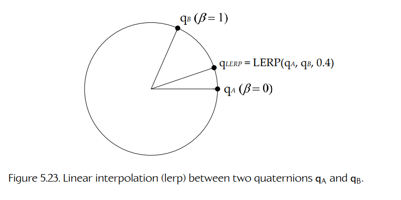
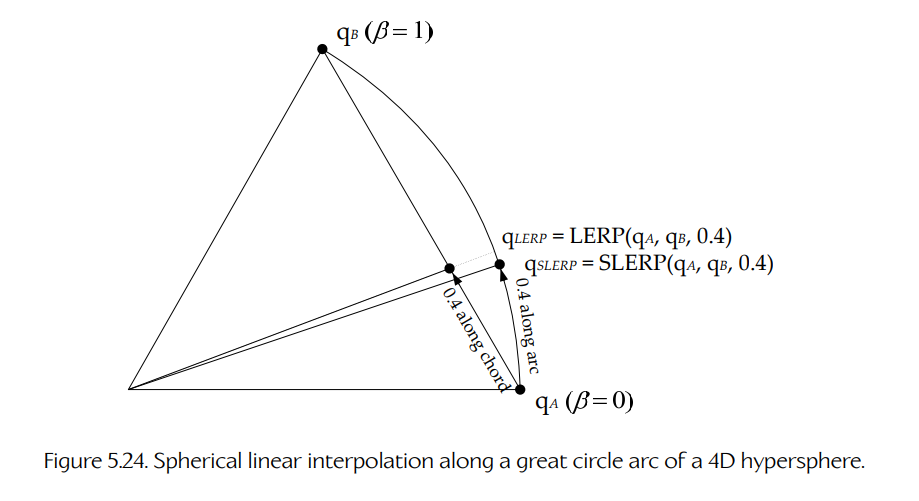

## 5.4 四元数

我们已经看到，3 × 3 矩阵可以用来表示三维空间中的任意旋转。然而，出于若干原因，矩阵并不总是旋转的理想表示方式：

1. 我们需要九个浮点数来表示一次旋转，而考虑到旋转只有三个自由度——pitch、yaw 和 roll——这似乎有些过多。
2. 旋转一个向量需要一次向量-矩阵乘法，其中涉及三个点积，总共需要九次乘法和六次加法。我们希望尽可能找到一种计算成本更低的旋转表示。
3. 在游戏和计算机图形学中，经常需要找到位于两个已知旋转之间某个百分比位置的旋转。例如，如果我们要在几秒钟内把摄像机从某个起始朝向 A 平滑地动画过渡到某个最终朝向 B，那么就需要在动画过程中找到 A 和 B 之间的大量中间旋转。当 A 和 B 的朝向表示为矩阵时，这件事会比较困难。

幸运的是，有一种旋转表示可以解决这三个问题。它是一种称为 **四元数**（quaternion）的数学对象。四元数看起来很像一个四维向量，但它的行为方式非常不同。我们通常用非斜体、非粗体的形式来书写四元数，如下所示：

```text
q = [ qx  qy  qz  qw ].
```

四元数由 William Rowan Hamilton 爵士于 1843 年提出，作为复数的扩展。（具体来说，四元数可以解释为一种四维复数，它有一个实轴，以及三个由虚数 `i`、`j` 和 `k` 表示的虚轴。因此，四元数可以用“复数形式”写成：

```text
q = iqx + jqy + kqz + qw.
```

四元数最早被用于解决力学领域的问题。严格来说，四元数遵循一套称为实数域上的四维 **赋范除法代数**（normed division algebra）的规则。好在我们不需要理解这些相当深奥的代数规则细节。对我们而言，只需要知道：**单位长度四元数**（unit-length quaternions，也就是所有满足约束 `qx² + qy² + qz² + qw² = 1` 的四元数）表示三维旋转。

网上有很多关于四元数的优秀论文、网页和演示文稿可供进一步阅读。这里是我最喜欢的一篇：[180]。

### 5.4.1 作为三维旋转的单位四元数

单位四元数可以被可视化为一个三维向量加上第四个标量坐标。向量部分 **qv** 是旋转的单位轴，并按旋转半角的正弦进行缩放。标量部分 `qs` 是半角的余弦。因此，单位四元数 **q** 可以写成如下形式：

```text
q = [ qv  qs ]

  = [ a sin(θ/2)   cos(θ/2) ],
```

其中 **a** 是沿旋转轴的单位向量，`θ` 是旋转角。旋转方向遵循 **右手法则**（right-hand rule），因此如果你的拇指指向 **a** 的方向，那么正向旋转将沿弯曲手指的方向。

当然，我们也可以把 **q** 写成一个简单的四元素向量：

```text
q = [ qx  qy  qz  qw ], where

qx = qvx = ax sin(θ/2),
qy = qvy = ay sin(θ/2),
qz = qvz = az sin(θ/2),
qw = qs  = cos(θ/2).
```

单位四元数非常类似于旋转的轴角表示（axis+angle representation），也就是形如 `[ a  θ ]` 的四元素向量。不过，如下文所示，四元数在数学上比其轴角对应物更加方便。

### 5.4.2 四元数运算

四元数支持向量代数中的一些熟悉运算，例如求模和向量加法。不过，我们必须记住：两个单位四元数之和并不表示一个 3D 旋转，因为这样的四元数不会是单位长度。因此，在游戏引擎中通常不会看到四元数求和，除非它们经过某种缩放，以保持单位长度要求。

#### 5.4.2.1 四元数乘法

我们会对四元数执行的最重要运算之一就是乘法。给定两个四元数 **p** 和 **q**，它们分别表示旋转 **P** 和 **Q**，乘积 **pq** 表示复合旋转（也就是先执行旋转 **Q**，再执行旋转 **P**）。

实际上，四元数乘法有很多不同种类，但我们在这里将讨论限制在与 3D 旋转一起使用的那种，也就是 Grassman product。使用这个定义，乘积 **pq** 定义如下：

```text
pq = [ (ps qv + qs pv + pv × qv)    (ps qs − pv · qv) ].
```

请注意，Grassman product 是根据向量部分和标量部分定义的。向量部分最终会进入结果四元数的 x、y 和 z 分量，而标量部分最终会进入 w 分量。

#### 5.4.2.2 共轭与逆

四元数 **q** 的 **逆**（inverse）记作 `q^-1`，定义为这样一个四元数：它与原四元数相乘后得到标量 1，也就是：

```text
qq^-1 = 0i + 0j + 0k + 1.
```

四元数 `[ 0  0  0  1 ]` 表示零旋转（这很合理，因为前三个分量中 `sin(0) = 0`，而最后一个分量中 `cos(0) = 1`）。

为了计算四元数的逆，我们必须先定义一个称为 **共轭**（conjugate）的量。它通常记作 `q*`，定义如下：

```text
q* = [ −qv  qs ].
```

换句话说，我们取反向量部分，但保持标量部分不变。

给定这个四元数共轭的定义，四元数 `q^-1` 的逆定义如下：

```text
q^-1 = q* / |q|².
```

我们的四元数总是单位长度（也就是 `|q| = 1`），因为它们表示 3D 旋转。因此，对我们来说，逆和共轭是相同的：

```text
q^-1 = q* = [ −qv  qs ]      when      |q| = 1.
```

这一事实非常有用，因为这意味着在对四元数求逆时，只要我们预先知道这个四元数已经归一化，就可以总是避免执行相对昂贵的除以平方模操作。这也意味着，对四元数求逆通常比对 3 × 3 矩阵求逆快得多——在优化引擎时，你也许可以在某些情况下利用这一点。

**乘积的共轭与逆。**

四元数乘积 `(pq)` 的共轭等于各个四元数共轭的反向乘积：

```text
(pq)* = q* p*.
```

同样，四元数乘积的逆等于各个四元数逆的反向乘积：

```text
(pq)^-1 = q^-1 p^-1.     (5.8)
```

这类似于转置或求逆矩阵乘积时发生的反转。

### 5.4.3 用四元数旋转向量

我们如何把四元数旋转应用到一个向量上？第一步是把向量改写成 **四元数形式**。向量是由单位基向量 **i**、**j** 和 **k** 参与构成的和。四元数也是由 **i**、**j** 和 **k** 参与构成的和，只是还带有第四个标量项。因此，把一个向量写成标量项 `qs` 等于零的四元数是合理的。给定向量 **v**，我们可以写出对应的四元数：

```text
v = [ v  0 ] = [ vx  vy  vz  0 ].
```

为了用四元数 **q** 旋转向量 **v**，我们先把向量（写成四元数形式 **v**）左乘 **q**，然后再右乘逆四元数 `q^-1`。因此，旋转后的向量 **v'** 可以如下得到：

```text
v' = rotate(q, v) = qvq^-1.
```

由于我们的四元数总是单位长度，这等价于使用四元数共轭：

```text
v' = rotate(q, v) = qvq*.     (5.9)
```

旋转后的向量 **v'** 只需从其四元数形式 **v'** 中提取出来即可。

四元数乘法在真实游戏中的各种场景都很有用。例如，假设我们想找到一个单位向量，用来描述飞机正在飞行的方向。我们进一步假设在我们的游戏中，按照约定，正 z 轴总是指向对象的前方。因此，任意对象在模型空间中的前向单位向量按定义总是：

```text
fM = [ 0  0  1 ].
```

为了把这个向量变换到世界空间，我们只需要取飞机的朝向四元数 **q**，并使用方程（5.9）把模型空间向量 **fM** 旋转成它对应的世界空间向量 **fW**（当然，要先把这些向量转换为四元数形式）：

```text
FW = qFMq^-1 = q [ 0  0  1  0 ] q^-1.
```

#### 5.4.3.1 四元数连接

旋转可以通过把四元数相乘，以与基于矩阵的变换完全相同的方式进行 **连接**（concatenate）。例如，考虑三个不同的旋转，分别由四元数 **q1**、**q2** 和 **q3** 表示，其矩阵等价物为 **R1**、**R2** 和 **R3**。我们想先应用旋转 1，然后应用旋转 2，最后应用旋转 3。复合旋转矩阵 **Rnet** 可以如下求得，并应用到向量 **v** 上：

```text
Rnet = R1 R2 R3;

v' = vR1 R2 R3
   = vRnet.
```

同样，复合旋转四元数 **qnet** 可以如下求得，并应用到向量 **v**（以四元数形式 **v**）上：

```text
qnet = q3 q2 q1;

v' = q3 q2 q1 v q1^-1 q2^-1 q3^-1
   = qnet v qnet^-1.
```

请注意，四元数乘积的执行顺序必须与旋转应用顺序相反（`q3q2q1`）。这是因为四元数旋转总是在向量的两侧进行乘法：未求逆的四元数在左侧，求逆后的四元数在右侧。正如我们在方程（5.8）中看到的，四元数乘积的逆是各个逆的反向乘积，因此未求逆的四元数从右到左读取，而求逆后的四元数从左到右读取。

### 5.4.4 四元数-矩阵等价

任意 3D 旋转都可以在 3 × 3 矩阵表示 **R** 和四元数表示 **q** 之间自由转换。如果令：

```text
q = [ qv  qs ] = [ qvx  qvy  qvz  qs ] = [ x  y  z  w ],
```

那么可以如下求得 **R**：

```text
    [ 1 − 2y² − 2z²     2xy + 2zw       2xz − 2yw  ]
R = [ 2xy − 2zw         1 − 2x² − 2z²   2yz + 2xw  ] .
    [ 2xz + 2yw         2yz − 2xw       1 − 2x² − 2y² ]
```

同样，给定 **R**，我们也可以如下求得 **q**（其中 `q[0] = qvx`，`q[1] = qvy`，`q[2] = qvz`，`q[3] = qs`）。这段代码假设我们在 C/C++ 中使用行向量（也就是说，矩阵的行对应上面展示的矩阵 **R** 的行）。这段代码改编自 Nick Bobic 于 1998 年 7 月 5 日发表在 Gamasutra 上的一篇文章，文章可见于 [181]。关于一些更快的矩阵转四元数方法，它们利用了对矩阵性质的各种假设，相关讨论见 [182]。

```cpp
void matrixToQuaternion(
        const float R[3][3],
        float       q[/*4*/])
{
    float trace = R[0][0] + R[1][1] + R[2][2];

    // check the diagonal
    if (trace > 0.0f)
    {
        float s = sqrt(trace + 1.0f);
        q[3] = s * 0.5f;

        float t = 0.5f / s;
        q[0] = (R[2][1] - R[1][2]) * t;
        q[1] = (R[0][2] - R[2][0]) * t;
        q[2] = (R[1][0] - R[0][1]) * t;
    }
    else
    {
        // diagonal is negative
        int i = 0;
        if (R[1][1] > R[0][0]) i = 1;
        if (R[2][2] > R[i][i]) i = 2;

        static const int NEXT[3] = {1, 2, 0};
        int j = NEXT[i];
        int k = NEXT[j];

        float s = sqrt((R[i][i]
                     - (R[j][j] + R[k][k]))
                     + 1.0f);

        q[i] = s * 0.5f;

        float t;
        if (s != 0.0)  t = 0.5f / s;
        else           t = s;

        q[3] = (R[k][j] - R[j][k]) * t;
        q[j] = (R[j][i] + R[i][j]) * t;
        q[k] = (R[k][i] + R[i][k]) * t;
    }
}
```

让我们稍微停下来考虑一下记法约定。本书中，我们像这样书写四元数：

```text
[ x  y  z  w ].
```

这不同于许多关于四元数作为复数扩展的学术论文中常见的 `[ w  x  y  z ]` 约定。我们的约定来自于一种努力：尽量与齐次向量通常写成 `[ x  y  z  1 ]`（即 `w = 1` 放在最后）的做法保持一致。而学术约定来自四元数与复数之间的平行关系。普通二维复数通常写作 `c = a + jb`，对应的四元数记法是 `q = w + ix + jy + kz`。因此要小心——在一头扎进论文之前，务必确认它使用的是哪种约定！

### 5.4.5 旋转线性插值

旋转插值在游戏引擎的动画、动力学和摄像机系统中有许多应用。在四元数的帮助下，旋转可以像向量和点一样容易地进行插值。

最简单且计算量最小的方法，是对我们想插值的四元数执行四维向量 lerp。给定两个四元数 **qA** 和 **qB**，分别表示旋转 A 和 B，我们可以找到一个中间旋转 `qlerp`，它从 A 到 B 走过了 `β` 百分比：

```text
qlerp = lerp(qA, qB, β)
      = ((1 − β)qA + βqB) / |(1 − β)qA + βqB|

      = normalize(
            [ (1 − β)qAx + βqBx
              (1 − β)qAy + βqBy
              (1 − β)qAz + βqBz
              (1 − β)qAw + βqBw ]^T
        ).
```

请注意，插值得到的四元数必须重新归一化。这是必要的，因为一般来说，lerp 操作并不会保持向量长度。

从几何上讲，`qlerp = lerp(qA, qB, β)` 是一个四元数，它的朝向位于从朝向 A 到朝向 B 的 `β` 百分比位置，如图 5.23 所示（为了清楚起见，用二维图示表示）。从数学上讲，lerp 操作得到的是两个四元数的加权平均，权重分别为 `(1 − β)` 和 `β`（注意这两个权重之和为 1）。



**Figure 5.23.** 两个四元数 **qA** 和 **qB** 之间的线性插值（lerp）。

#### 5.4.5.1 球面线性插值

lerp 操作的问题在于，它没有考虑这样一个事实：四元数实际上是四维 **超球面**（hypersphere）上的点。lerp 实际上是沿超球面的 **弦**（chord）进行插值，而不是沿超球面本身的表面插值。这会导致当参数 `β` 以恒定速率变化时，旋转动画不具有恒定角速度。旋转在端点附近看起来会更慢，而在动画中间会更快。

为了解决这个问题，我们可以使用 lerp 操作的一种变体，称为 **球面线性插值**（spherical linear interpolation），简称 **slerp**。slerp 操作使用正弦和余弦，沿 4D 超球面的 **大圆**（great circle）插值，而不是沿弦插值，如图 5.24 所示。这样，当 `β` 以恒定速率变化时，就会得到恒定角速度。



**Figure 5.24.** 沿 4D 超球面大圆弧进行球面线性插值。

slerp 的公式与 lerp 公式类似，但权重 `(1 − β)` 和 `β` 被替换为涉及两个四元数之间夹角正弦值的权重 `wp` 和 `wq`：

```text
slerp(p, q, β) = wp p + wq q,
```

其中：

```text
wp = sin((1 − β)θ) / sinθ,

wq = sin(βθ) / sinθ.
```

任意两个单位长度四元数之间夹角的余弦值，可以通过计算它们的四维点积得到。一旦知道 `cosθ`，我们就可以很容易地计算角度 `θ` 以及所需的各种正弦值：

```text
cosθ = p · q = pxqx + pyqy + pzqz + pwqw;

θ = cos^-1(p · q).
```

#### 5.4.5.2 是否使用球面线性插值（这仍然是个问题）

关于是否应该在游戏引擎中使用 slerp，目前仍然没有定论。Jonathan Blow 写过一篇很好的文章，认为 slerp 过于昂贵，而 lerp 的质量其实并没有那么差——因此，他建议我们应该理解 slerp，但在游戏引擎中避免使用它 [183]。

另一方面，我在 Naughty Dog 的一些同事发现，一个优秀的 slerp 实现的性能几乎可以和 lerp 一样好。（例如，在 PS3 的 SPU 上，Ice 团队的 slerp 实现每个关节需要 20 个周期，而 lerp 实现每个关节需要 16.25 个周期。）因此，我个人建议你在做任何决定之前，先对自己的 slerp 和 lerp 实现进行性能分析。如果 slerp 带来的性能损耗可以接受，我会支持使用它，因为它可能带来外观稍微更好的动画。但如果你的 slerp 很慢（而且你无法加速它，或者只是没有时间这么做），那么 lerp 通常对大多数用途已经足够好了。
