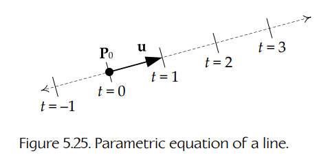
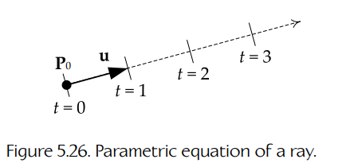

## 5.5 旋转表示的比较

我们已经看到，旋转可以用许多不同方式来表示。本节总结最常见的旋转表示，并概述它们各自的优缺点。没有任何一种表示在所有情况下都是理想的。利用本节中的信息，你应该能够为特定应用选择最合适的表示方式。

### 5.5.1 欧拉角

我们在第 5.3.11.1 节中简要讨论过 **欧拉角**（Euler angles）。通过欧拉角表示的旋转由三个标量值组成：yaw、pitch 和 roll。这些量有时会表示为一个 3D 向量：

```text
[ θY  θP  θR ].
```

这种表示的优点是简单、体积小（三个浮点数），并且很直观——yaw、pitch 和 roll 都很容易可视化。对于围绕单一轴的简单旋转，也可以很容易地进行插值。例如，通过对标量 `θY` 进行线性插值，就可以很直接地找到两个不同 yaw 角之间的中间旋转。然而，当旋转是围绕任意方向的轴进行时，欧拉角就不容易插值了。

此外，欧拉角容易出现一种称为 **万向节锁**（gimbal lock）的情况。当一次 90 度旋转导致三个主轴之一“坍缩”到另一个主轴上时，就会发生万向节锁。例如，如果你绕 x 轴旋转 90 度，那么 y 轴会坍缩到 z 轴上。这会阻止围绕原始 y 轴的任何进一步旋转，因为此时围绕 y 和 z 的旋转实际上已经变得等价。

欧拉角的另一个问题是：围绕各轴执行旋转的顺序很重要。顺序可以是 PYR、YPR、RYP 等等，而每一种顺序都可能产生不同的复合旋转。跨所有学科并不存在一种统一的欧拉角标准旋转顺序（尽管某些学科确实遵循特定约定）。因此，旋转角 `[ θY  θP  θR ]` 并不能唯一地定义某个特定旋转——你需要知道旋转顺序，才能正确解释这些数字。

欧拉角的最后一个问题是：它们依赖于 x、y 和 z 轴到被旋转对象的自然 **前方**（front）、**左/右**（left/right）和 **上方**（up）方向之间的映射。例如，yaw 总是被定义为围绕 up 轴的旋转，但如果没有额外信息，我们无法判断这对应的是围绕 x、y 还是 z 轴的旋转。

### 5.5.2 3 × 3 矩阵

出于许多原因，3 × 3 矩阵是一种方便且有效的旋转表示方式。它不会受到万向节锁影响，并且可以唯一表示任意旋转。旋转可以通过矩阵乘法（也就是一系列点积）以直接方式应用到点和向量上。现在大多数 CPU 和所有 GPU 都内置了对硬件加速点积和矩阵乘法的支持。旋转也可以通过求逆矩阵来反转，而对于纯旋转矩阵来说，求逆与求转置是同一件事——这是一个非常简单的操作。而 4 × 4 矩阵还提供了一种完全一致的方式，用来表示任意仿射变换——旋转、平移和缩放。

不过，旋转矩阵并不特别直观。看着一大张数字表，并不能帮助人们想象对应的三维空间变换。另外，旋转矩阵也不容易插值。最后，相对于欧拉角（三个浮点数）而言，旋转矩阵需要大量存储空间（九个浮点数）。

### 5.5.3 轴 + 角

我们可以把旋转表示为一个单位向量，它定义旋转轴；再加上一个标量，用来表示旋转角。这称为 **轴角表示**（axis+angle representation），有时会用四维向量表示：

```text
[ a  θ ] = [ ax  ay  az  θ ],
```

其中 **a** 是旋转轴，`θ` 是以弧度表示的角度。在右手坐标系中，正向旋转的方向由右手法则定义；而在左手坐标系中，我们改用左手法则。

轴角表示的优点是比较直观，并且也很紧凑。（它只需要四个浮点数，而不是 3 × 3 矩阵所需的九个。）

轴角表示的一个重要限制是：旋转不能被轻易插值。另外，这种格式下的旋转不能直接应用到点和向量上——必须先把轴角表示转换为矩阵或四元数。

### 5.5.4 四元数

如前所述，单位长度四元数可以用一种类似轴角表示的方式来表示 3D 旋转。两种表示之间的主要区别是：四元数的旋转轴会按旋转半角的正弦进行缩放；并且，我们不是把角度存储在向量的第四个分量中，而是存储半角的余弦。

四元数形式相比轴角表示有两个巨大优点。第一，它允许通过四元数乘法直接连接旋转，并把旋转直接应用到点和向量上。第二，它允许通过简单的 lerp 或 slerp 操作方便地对旋转进行插值。四元数的小尺寸（四个浮点数）相比矩阵形式也是一个优点。

### 5.5.5 SRT 变换

四元数本身只能表示旋转，而 4 × 4 矩阵可以表示任意仿射变换（旋转、平移和缩放）。当四元数与 **平移向量**（translation vector）和 **缩放因子**（scale factor，既可以是用于均匀缩放的标量，也可以是用于非均匀缩放的向量）结合时，我们就得到了 4 × 4 矩阵仿射变换表示的一种可行替代方案。我们有时把它称为 **SRT 变换**，因为它包含一个缩放因子、一个旋转四元数和一个平移向量。（它有时也被称为 **SQT**，因为旋转是一个四元数。）

```text
SRT = [ s  q  t ]      (uniform scale s),
```

或：

```text
SRT = [ s  q  t ]      (nonuniform scale vector s).
```

SRT 变换广泛用于计算机动画中，因为它们体积更小（均匀缩放时为八个浮点数；非均匀缩放时为十个浮点数；而 4 × 3 矩阵需要十二个浮点数），并且易于插值。平移向量和缩放因子通过 lerp 插值，而四元数可以通过 lerp 或 slerp 插值。

### 5.5.6 旋量

四元数是一种称为 **旋量**（spinor，读作 “spin-er”）的数学对象的特殊情况。具体而言，四元数是三维空间中的实值旋量。一般来说，旋量在数学和物理的许多分支中都很有用，包括表示电子的自旋。

旋量与普通向量之间的关键区别在于：旋量不仅编码了从空间中的初始朝向到最终朝向的变换，还会考虑对象为了到达那里是如何移动的。具体来说，它们编码了旋转的奇偶性，也就是对象在初始朝向和最终朝向之间，是否经过了一次完整的 360 度旋转；如果经过了，是经过了偶数次还是奇数次。这就是为什么我们说四元数对 3D 旋转空间表现出 “double cover”（双覆盖）：从初始朝向到最终朝向既有一种偶奇偶性为偶的路径，也有一种奇偶性为奇的路径。更多信息可查看这个有趣的 YouTube 视频：[184]。

### 5.5.7 对偶四元数

**刚体变换**（rigid transformation）是一种包含旋转和平移的变换——一种“螺旋开瓶器”式运动。这类变换在动画和机器人学中非常常见。刚体变换可以用一种称为 **对偶四元数**（dual quaternion）的数学对象表示。

对偶四元数表示相比典型的向量-四元数表示具有若干优点。最关键的优点是：线性插值混合可以以恒定速度、最短路径、坐标不变的方式执行，这类似于对平移向量使用 lerp、对旋转四元数使用 slerp（见第 5.4.5.1 节），但它还可以很容易地推广到包含三个或更多变换的混合。

对偶四元数类似于普通四元数，只不过它的四个分量是 **对偶数**（dual numbers），而不是普通的实值数。对偶数可以写成一个非对偶部分和一个对偶部分之和：

```text
â = a + εb.
```

这里 `ε` 是一个称为 **对偶单位**（dual unit）的特殊数，它被定义为 `ε² = 0`（但 `ε` 本身并不为零）。这类似于我们在把复数写成实部与虚部之和时使用的虚数：

```text
j = √−1,

c = a + jb.
```

因为每个对偶数都可以由两个实数表示（非对偶部分和对偶部分 `a` 与 `b`），所以一个对偶四元数可以表示为一个八元素向量。它也可以表示为两个普通四元数之和，其中第二个四元数乘以对偶单位，如下所示：

```text
q̂ = qa + εqb.
```

关于对偶数和对偶四元数的完整讨论超出了本书范围。不过，Kavan 等人的优秀论文 “Dual Quaternions for Rigid Transformation Blending” 概述了使用对偶四元数表示刚体变换的理论与实践——该论文可在线获取 [185]。请注意，在这篇论文中，对偶数写作：

```text
â = a0 + εaε,
```

而我在上文中使用 `a + εb`，是为了强调对偶数和复数之间的相似性。<sup>1</sup> 另有一篇关于该主题的优秀论文可见于 [186]。

> **脚注 1**：我个人更喜欢使用符号 `a1` 而不是 `a0`，这样对偶数就可以写成 `â = (1)a1 + (ε)aε`。就像我们在复平面中绘制复数时，可以把 `a` 看作沿实轴的“基向量”，把对偶单位 `ε` 看作沿对偶轴的“基向量”。

### 5.5.8 旋转与自由度

术语 **自由度**（degrees of freedom，简称 DOF）指对象的物理状态（位置和朝向）可以变化的、彼此独立的方式数量。你可能在力学、机器人学和航空学等领域见过“六自由度”这个说法。它指的是一个三维对象（其运动没有被人为约束）在平移上具有三个自由度（沿 x、y 和 z 轴），在旋转上也具有三个自由度（围绕 x、y 和 z 轴），总共六个自由度。

DOF 概念可以帮助我们理解：不同的旋转表示为什么可以使用不同数量的浮点参数，但都只指定具有三个自由度的旋转。例如，欧拉角需要三个浮点数，但轴角表示和四元数表示使用四个浮点数，而 3 × 3 矩阵需要九个浮点数。这些表示如何都能描述 3-DOF 旋转？

答案在于 **约束**（constraints）。所有 3D 旋转表示都使用三个或更多浮点参数，但有些表示还对这些参数施加了一个或多个约束。约束意味着这些参数并不是独立的——一个参数发生变化时，会引发其他参数发生变化，以便维持约束的有效性。如果我们从浮点参数数量中减去约束数量，就得到自由度数量——而对于 3D 旋转来说，这个数量应该总是三：

```text
N_DOF = N_parameters − N_constraints.     (5.10)
```

下面的列表展示了方程（5.10）如何适用于本书中遇到过的每一种旋转表示。



**图 5.25** 直线的参数方程。



**图 5.26** 射线的参数方程。

- **欧拉角**（Euler Angles）。3 个参数 − 0 个约束 = 3 DOF。
- **轴 + 角**（Axis+Angle）。4 个参数 − 1 个约束 = 3 DOF。  
  约束：轴被约束为单位长度。
- **四元数**（Quaternion）。4 个参数 − 1 个约束 = 3 DOF。  
  约束：四元数被约束为单位长度。
- **3 × 3 矩阵**（3 × 3 Matrix）。9 个参数 − 6 个约束 = 3 DOF。  
  约束：所有三行和所有三列都必须具有单位长度（当作三元素向量来看时），<sup>2</sup> 并且列与列、行与行必须相互正交。