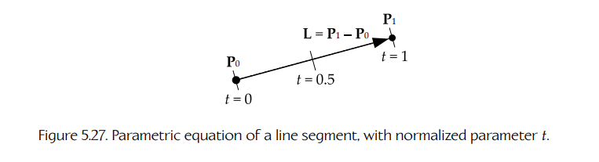
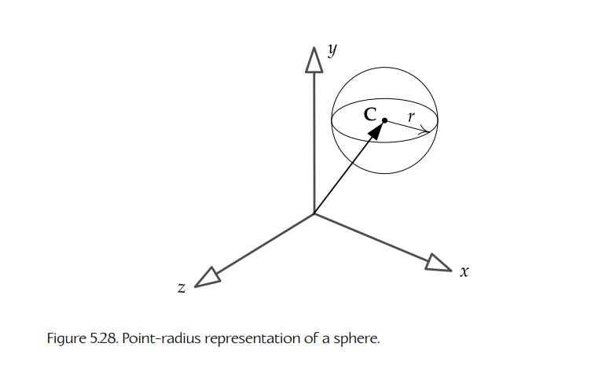
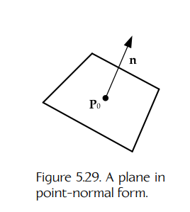
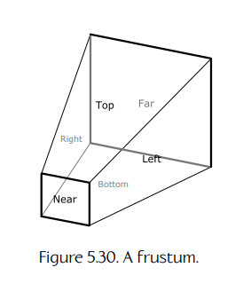

## 5.6 其他有用的数学对象

作为游戏工程师，除了点、向量、矩阵和四元数之外，我们还会遇到大量其他数学对象。本节将简要概述其中最常见的几类。

### 5.6.1 直线、射线和线段

一条无限长的 **直线**（line）可以由一个点 **P₀** 加上沿直线方向的单位向量 **u** 来表示。一条直线的 **参数方程**（parametric equation）通过从初始点 **P₀** 出发，并沿单位向量 **v** 的方向移动任意距离 `t`，描绘出直线上的所有可能点 **P**。这一无限大的点集 **P** 变成了标量参数 `t` 的一个向量函数：

```text
P(t) = P₀ + t u,     where −∞ < t < ∞.      (5.11)
```

这如图 5.25 所示。

**射线**（ray）是一条只在一个方向上延伸到无穷远的直线。这可以很容易地表示为带有约束 `t ≥ 0` 的 `P(t)`，如图 5.26 所示。

**线段**（line segment）在两端分别由 **P₀** 和 **P₁** 限定。它同样可以由 `P(t)` 表示，方式有以下两种。这里：

```text
L = P₁ − P₀,
L = |L| is the length of the line segment,
u = (1/L)L is a unit vector in the direction of L.
```

1. ```text
   P(t) = P₀ + t u, where 0 ≤ t ≤ L,
   ```

2. ```text
   P(t) = P₀ + t L, where 0 ≤ t ≤ 1.
   ```

后一种形式如图 5.27 所示，尤其方便，因为参数 `t` 是归一化的；换句话说，无论我们处理的是哪一条具体线段，`t` 总是从 0 到 1。这意味着我们不需要单独存储约束 `L` 作为一个独立的浮点参数；它已经被编码在向量 **L = L u** 中了（而这个向量无论如何都是必须存储的）。



**Figure 5.27.** 使用归一化参数 `t` 表示的线段参数方程。

### 5.6.2 球体

**球体**（sphere）在游戏引擎编程中无处不在。一个球体通常由中心点 **C** 加上半径 `r` 来定义，如图 5.28 所示。这可以很好地打包成一个四元素向量：

```text
[ Cx  Cy  Cz  r ].
```

正如我们在讨论 SIMD 向量处理时所看到的，把数据打包到一个包含四个 32 位浮点数的向量中（也就是一个 128 位包）具有明显优势。



**Figure 5.28.** 球体的点-半径表示。

### 5.6.3 平面

**平面**（plane）是 3D 空间中的一个 2D 表面。你可能还记得高中代数中，平面方程通常写成：

```text
Ax + By + Cz + D = 0.
```

这个方程只对位于该平面上的点集 **P = [ x  y  z ]** 成立。

平面可以由一个点 **P₀** 和一个垂直于该平面的单位向量 **n** 表示。这有时称为 **点-法线形式**（point-normal form），如图 5.29 所示。



**Figure 5.29.** 点-法线形式的平面。

有趣的是，当传统平面方程中的参数 `A`、`B` 和 `C` 被解释为一个 3D 向量时，该向量的方向正是平面法线方向。如果向量 `[ A  B  C ]` 被归一化为单位长度，那么归一化后的向量 `[ a  b  c ] = n`，而归一化后的参数：

```text
d = D / √(A² + B² + C²)
```

就是从平面到原点的距离。如果平面的法向量 **n** 指向原点（也就是原点位于平面的“正面”一侧），则该距离为正；如果法向量背离原点（也就是原点位于平面的“背面”一侧），则该距离为负。

理解这一点的另一种方式是：平面方程和点-法线形式其实只是同一个方程的两种写法。假设我们要测试任意点 **P = [ x  y  z ]** 是否位于平面上。为此，我们沿法线 **n = [ a  b  c ]** 方向求点 **P** 到原点的有符号距离；如果这个有符号距离等于平面到原点的有符号距离 `d = −n · P₀`，那么 **P** 必须位于平面上。因此，我们将二者设为相等并展开：

```text
(signed distance P to origin) = (signed distance plane to origin)

n · P = n · P₀

n · P − n · P₀ = 0

ax + by + cz − n · P₀ = 0

ax + by + cz + d = 0.      (5.12)
```

方程（5.12）只有在点 **P** 位于平面上时才成立。但如果点 **P** 不在平面上，会发生什么？在这种情况下，平面方程左侧 `(ax + by + cz)` 会告诉我们该点距离平面有多“远”。这个表达式计算的是从 **P** 到原点的距离与从平面到原点的距离之间的差值。换句话说，方程（5.12）的左侧给出了点和平面之间的垂直距离 `h`。这其实只是第 5.2.4.7 节中方程（5.2）的另一种写法：

```text
h = (P − P₀) · n;

h = ax + by + cz + d.      (5.13)
```

平面实际上也可以像球体一样打包成一个四元素向量。为此，我们观察到：要唯一描述一个平面，只需要法向量 **n = [ a  b  c ]** 和到原点的距离 `d`。四元素向量：

```text
L = [ n  d ] = [ a  b  c  d ]
```

是一种紧凑且方便的平面表示与内存存储方式。注意，当 **P** 写成齐次坐标且 `w = 1` 时，方程 `(L · P) = 0` 是写 `(n · P) = −d` 的另一种方式。所有位于平面 **L** 上的点 **P** 都满足这些方程。

用四元素向量形式定义的平面，可以很容易地从一个坐标空间变换到另一个坐标空间。给定一个矩阵 **M_A→B**，它把点和（非法线）向量从空间 **A** 变换到空间 **B**，我们已经知道：要变换类似平面法线 **n** 这样的 normal vector，需要使用该矩阵的逆转置：

```text
(M_A→B⁻¹)ᵀ.
```

因此，当我们了解到把一个矩阵的逆转置应用到四元素平面向量 **L** 上时，实际上会把该平面正确地从空间 **A** 变换到空间 **B**，也就不应感到惊讶了。这里不再进一步推导或证明这一结果，不过 [36] 的第 4.2.3 节提供了对这个小“技巧”为什么有效的详细解释。

### 5.6.4 轴对齐包围盒（AABB）

**轴对齐包围盒**（axis-aligned bounding box，AABB）是一个 3D **长方体**（cuboid），它的六个矩形面与某个特定坐标系的一组相互正交的坐标轴对齐。因此，AABB 可以表示为一个六元素向量，其中包含沿三个主轴的最小坐标和最大坐标：

```text
[ xmin, ymin, zmin, xmax, ymax, zmax ],
```

也可以表示为两个点 **Pmin** 和 **Pmax**。

这种简单的表示使得测试某个点 **P** 是否位于任意给定 AABB 内部或外部变得特别方便且廉价。我们只需测试以下所有条件是否为真：

```text
Px ≥ xmin and Px ≤ xmax and

Py ≥ ymin and Py ≤ ymax and

Pz ≥ zmin and Pz ≤ zmax.
```

由于相交测试速度很快，AABB 经常被用作一种“提前退出”的碰撞检测：如果两个对象的 AABB 不相交，那么就没有必要再进行更详细（也更昂贵）的碰撞测试。

### 5.6.5 有向包围盒（OBB）

**有向包围盒**（oriented bounding box，OBB）是一个经过定向的长方体，使它以某种逻辑方式与其包围的对象对齐。通常，OBB 会与对象的局部空间坐标轴对齐。因此，它在局部空间中表现得像一个 AABB，尽管它不一定与世界空间坐标轴对齐。

有多种技术可以测试一个点是否位于 OBB 内部，但一种常见方法是：先把该点变换到 OBB 的“对齐”坐标系中，然后使用前面介绍过的 AABB 相交测试。

### 5.6.6 视锥体

如图 5.30 所示，**视锥体**（frustum）是一组六个平面，它们定义了一个 **截顶金字塔**（truncated pyramid）形状。视锥体在 3D 渲染中非常常见，因为它们可以方便地定义从虚拟摄像机视角通过透视投影渲染 3D 世界时的可见区域。其中四个平面围成屏幕空间的边界，另外两个平面表示近裁剪平面和远裁剪平面（也就是说，它们定义了任何可见点可能具有的最小和最大 z 坐标）。



**Figure 5.30.** 一个视锥体。

视锥体的一种方便表示方式是六个平面的数组，其中每个平面都用点-法线形式表示（也就是每个平面一个点和一个法向量）。

测试一个点是否位于视锥体内部会稍微复杂一些，但基本思想是使用点积来判断该点位于每个平面的正面还是背面。如果它位于全部六个平面的内部，那么它就在视锥体内部。

一个有用的技巧是：通过把摄像机的透视投影应用到正在测试的世界空间点上，将该点从世界空间变换到称为 **齐次裁剪空间**（homogeneous clip space）的空间中。在这个空间中，视锥体只是一个轴对齐长方体（AABB）。这允许执行简单得多的内/外测试。

### 5.6.7 凸多面体区域

**凸多面体区域**（convex polyhedral region）由任意一组平面定义，这些平面的法向量全部指向内部（或全部指向外部）。测试一个点是否位于这些平面所定义体积的内部或外部相对直接；它类似于视锥体测试，只是可能包含更多平面。

凸区域在游戏中实现任意形状的触发区域时非常有用。许多引擎都使用这种技术；例如，Quake 引擎中无处不在的 **brushes**，本质上就是以这种方式由平面围成的体积。