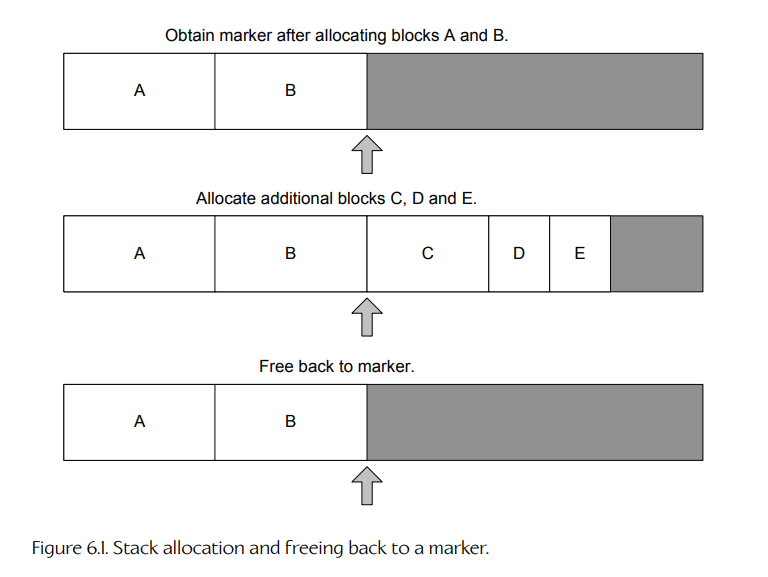
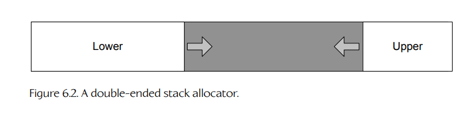
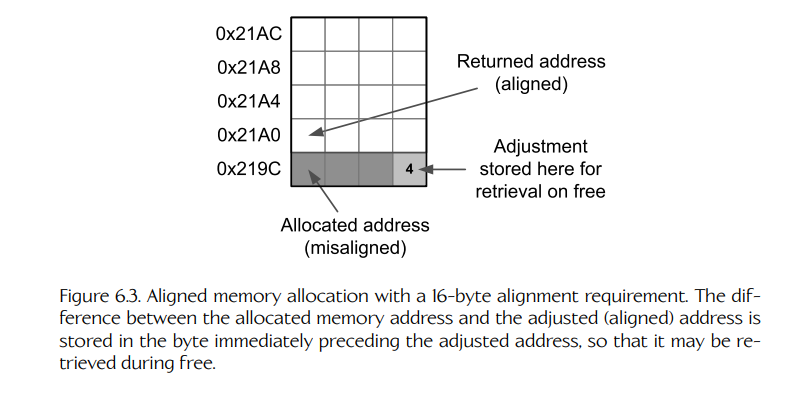
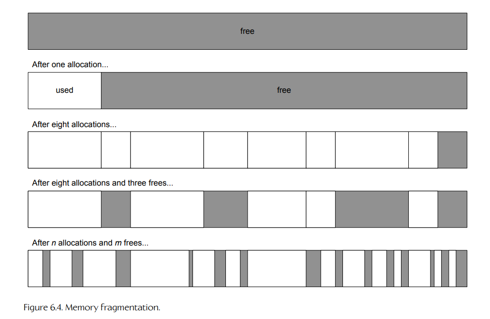
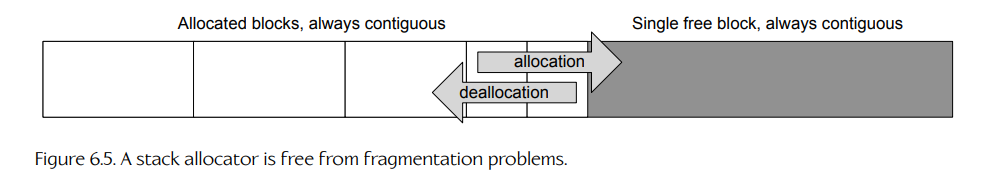
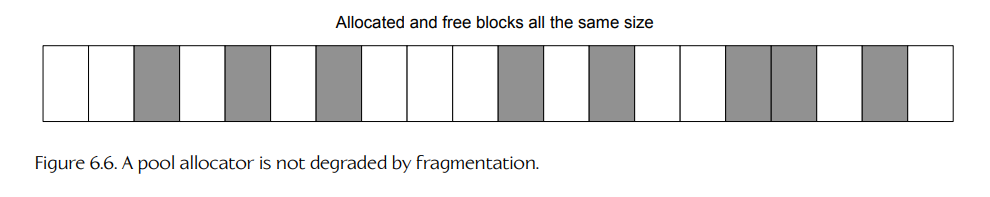
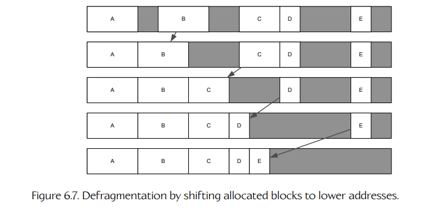

## 6.2 内存管理

作为游戏开发者，我们总是在努力让代码运行得更快。任何一段软件的性能，不仅取决于它所采用的算法，或者这些算法被编码得有多高效，还取决于程序如何**利用内存**（RAM）。内存会从两个方面影响性能：

1. 通过 `malloc()` 或 C++ 全局 `new` 操作符进行的**动态内存分配**是一项非常慢的操作。我们可以通过完全避免动态分配，或者使用能够大幅降低分配成本的自定义内存分配器，来提升代码性能。

2. 在现代 CPU 上，一段软件的性能往往主要受其**内存访问模式**支配。正如我们将看到的，位于小块、连续内存区域中的数据，CPU 处理起来要比散布在大量不同内存地址上的数据高效得多。即使算法本身非常高效、代码也写得极其谨慎，如果它所操作的数据在内存中的布局不够高效，性能也可能会严重下降。

在本节中，我们将学习如何沿着这两个方向优化代码的内存利用方式。

### 6.2.1 优化动态内存分配

通过 `malloc()` 和 `free()`，或者 C++ 全局 `new` 和 `delete` 操作符进行的动态内存分配，也称为**堆分配**（heap allocation），通常非常慢。其高成本主要来自两个因素。

首先，堆分配器是一种通用设施，因此它必须能够处理任意大小的分配请求，从一个字节到一个吉字节都要支持。这需要大量管理开销，使得 `malloc()` 和 `free()` 函数本身就比较慢。

其次，在大多数操作系统中，调用 `malloc()` 或 `free()` 时，程序通常必须先从用户模式切换到内核模式，由操作系统处理请求，然后再切换回程序。这些上下文切换可能非常昂贵。游戏开发中经常遵循的一条经验法则是：

> 尽量减少堆分配，并且永远不要在紧密循环中从堆上分配内存。

当然，没有哪个游戏引擎能够完全避免动态内存分配，因此大多数游戏引擎都会实现一个或多个自定义分配器。相较于操作系统的堆分配器，自定义分配器能够具备更好的性能特征，原因有两个。

首先，自定义分配器可以从一块预分配的内存块中满足分配请求。这块内存本身可以通过 `malloc()` 或 `new` 分配，也可以声明为全局变量。这样一来，分配器就可以完全在用户模式下运行，避免切换到操作系统内核所带来的成本。

其次，通过对使用模式作出各种假设，自定义分配器可以比通用堆分配器高效得多。

在接下来的小节中，我们会介绍几种常见的自定义分配器。关于该主题的更多信息，可参考 Christian Gyrling 的优秀博客文章 [194]。

#### 6.2.1.1 基于栈的分配器

许多游戏会以类似栈的方式分配内存。每当加载一个新的游戏关卡时，就为该关卡分配内存。关卡加载完成后，几乎不会再发生动态内存分配。关卡结束时，其数据被卸载，所有相关内存都可以被释放。因此，对于这类内存分配场景，使用类似栈的数据结构是很合理的。

**栈分配器**（stack allocator）非常容易实现。我们只需要通过 `malloc()`、全局 `new`，或者声明一个全局字节数组来分配一大块连续内存。如果使用全局字节数组，那么这块内存实际上会从可执行文件的 BSS 段中分配出来。分配器会维护一个指向栈顶的指针。该指针以下的所有内存地址都被认为正在使用，而该指针以上的所有地址都被认为是空闲的。

<a id="figure-61"></a>


**Figure 6.1.** 栈式分配，以及回滚到某个标记位置的释放方式。

栈顶指针会被初始化为栈中最低的内存地址。每个分配请求只需要把该指针向上移动所请求的字节数即可。最近分配的内存块可以通过将栈顶指针按该内存块大小向下移动来释放。

需要注意的是，使用栈分配器时，内存不能以任意顺序释放。所有释放操作都必须以与分配顺序相反的顺序进行。强制满足这一限制的一种简单方法是禁止单独释放某个内存块。相反，我们可以提供一个函数，将栈顶回滚到此前标记过的位置，从而释放当前栈顶和回滚点之间的所有内存块。

始终必须将栈顶指针回滚到两个已分配内存块之间的边界处，这一点非常重要。否则，新的分配可能会覆盖最上方内存块的尾部。为了确保这一点正确完成，栈分配器通常会提供一个函数，用来返回一个表示当前栈顶位置的**标记**（marker）。回滚函数随后以这些标记之一作为参数。图 6.1 展示了这一过程。栈分配器的接口通常类似如下：

```cpp
class StackAllocator
{
public:
    // Stack marker: Represents the current top of the
    // stack. You can only roll back to a marker, not to
    // arbitrary locations within the stack.
    typedef U32 Marker;

    // Constructs a stack allocator with the given total
    // size.
    explicit StackAllocator(U32 stackSize_bytes);

    // Allocates a new block of the given size from stack
    // top.
    void* alloc(U32 size_bytes);

    // Returns a marker to the current stack top.
    Marker getMarker();

    // Rolls the stack back to a previous marker.
    void freeToMarker(Marker marker);

    // Clears the entire stack (rolls the stack back to
    // zero).
    void clear();

private:
    // ...
};
```

**双端栈分配器。**

单个内存块实际上可以包含两个栈分配器：一个从内存块底部向上分配，另一个从内存块顶部向下分配。**双端栈分配器**（double-ended stack allocator）很有用，因为它允许底部栈和顶部栈之间进行内存使用量的权衡，从而更高效地使用内存。在某些情况下，两个栈可能会使用大致相同数量的内存，并在内存块中间相遇。在其他情况下，其中一个栈可能会比另一个栈消耗多得多的内存；但只要请求的总内存量不超过两个栈共享的内存块大小，所有分配请求仍然都可以被满足。图 6.2 展示了这种结构。

在 Midway 的街机游戏 *Hydro Thunder* 中，所有内存分配都来自一个由双端栈分配器管理的大型内存块。底部栈用于加载和卸载关卡（赛道），顶部栈用于每帧都会分配并释放的临时内存块。这种分配方案效果非常好，并确保 *Hydro Thunder* 从未遭遇内存碎片问题（见 6.2.1.4 节）。*Hydro Thunder* 的首席工程师 Steve Ranck 在 [9, Section 1.9] 中对这种分配技术作了深入描述。

<a id="figure-62"></a>


**Figure 6.2.** 双端栈分配器。

#### 6.2.1.2 池分配器

在游戏引擎编程中，经常需要分配大量小块内存，并且这些内存块的大小都相同。在一般软件工程中也很常见。例如，我们可能需要分配和释放矩阵、迭代器，或者链表、可渲染网格实例等结构中的节点。对于这种内存分配模式，**池分配器**（pool allocator）通常是非常理想的选择。

池分配器的工作方式是预先分配一大块内存，其大小正好是将要分配元素大小的整数倍。例如，一个包含若干 4 × 4 矩阵的池，其大小会是 64 字节的整数倍，因为每个矩阵有 16 个元素，每个元素 4 字节（假设每个元素都是 32 位 `float`）。

池中的每个元素都会被加入一个空闲元素链表。池首次初始化时，空闲链表包含所有元素。每当发生分配请求时，我们只需从空闲链表中取下下一个空闲元素并返回它。释放某个元素时，只需将它重新挂回空闲链表即可。分配和释放都是 `O(1)` 操作，因为无论池中当前有多少空闲元素，每次操作都只涉及少量指针操作。这里的 `O(1)` 是“大 O”记号的一个例子。在本例中，它表示分配和释放的执行时间大致是常数，不依赖于池中当前元素数量之类的因素。关于“大 O”记号的解释，见 6.3.3 节。

空闲元素链表可以是一个单链表，这意味着我们需要为每个空闲元素存储一个指针。在 32 位机器上，这个指针占 4 字节；在 64 位机器上，占 8 字节。那么，所有这些指针的内存从哪里来呢？当然可以把它们存储在一个单独预分配的内存块中，占用 `(sizeof(void*) * numElementsInPool)` 字节。然而，这样做相当浪费。

关键是要意识到：位于空闲链表上的内存块，按照定义，本身就是空闲内存块。因此，为什么不把每个空闲链表的“next”指针直接存储在空闲块本身内部呢？只要 `elementSize >= sizeof(void*)`，这个小技巧就能工作。我们不会浪费任何内存，因为所有空闲链表指针都位于空闲内存块内部，也就是那些原本没有被用于任何东西的内存中。

如果每个元素比一个指针还小，那么可以使用池元素索引，而不是指针，来实现链表。例如，如果池中包含 16 位整数，那么就可以用 16 位索引作为链表中的“next 指针”。只要池中元素数量不超过 `2^16 = 65,536`，这种方法就可以工作。

#### 6.2.1.3 对齐分配

正如我们在 3.3.7.1 节中看到的，每个变量和数据对象都有对齐要求。一个 8 位整数变量可以对齐到任意地址，但一个 32 位整数或浮点变量必须按 4 字节对齐，也就是说，它的地址只能以十六进制半字节 `0x0`、`0x4`、`0x8` 或 `0xC` 结尾。128 位 SIMD 向量值通常有 16 字节对齐要求，这意味着它的内存地址只能以半字节 `0x0` 结尾。在 PS3 上，要通过直接内存访问（DMA）控制器传输到 SPU 的内存块应当按 128 字节对齐，以获得最大 DMA 吞吐量，也就是说它们的地址只能以字节 `0x00` 或 `0x80` 结尾。

所有内存分配器都必须能够返回对齐的内存块。实现这一点相对直接。我们只需比实际请求多分配一点内存，将内存块地址稍微向上移动，使其正确对齐，然后返回移动后的地址。由于我们分配的内存比请求的多一些，所以即使地址稍微向上移动，返回的内存块仍然足够大。

在大多数实现中，额外分配的字节数等于对齐值减一，这是最坏情况下可能需要移动的距离。例如，如果我们想要一个 16 字节对齐的内存块，最坏情况是得到一个未对齐指针，其地址以 `0x1` 结尾，因为这需要把它向上移动 15 字节，才能到达 16 字节边界。

下面是一种可能的对齐内存分配实现：

```cpp
// shift the given address upwards if/as necessary to
// ensure it is aligned to the given number of bytes.
inline uintptr_t AlignAddress(uintptr_t addr, size_t align)
{
    const size_t mask = align - 1;
    assert((align & mask) == 0); // pwr of 2
    return (addr + mask) & ~mask;
}

// shift the given pointer upwards if/as necessary to
// ensure it is aligned to the given number of bytes.
template<typename T>
inline T* AlignPointer(T* ptr, size_t align)
{
    const uintptr_t addr = reinterpret_cast<uintptr_t>(ptr);
    const uintptr_t addrAligned = AlignAddress(addr, align);
    return reinterpret_cast<T*>(addrAligned);
}

// Aligned allocation function. IMPORTANT: 'align'
// must be a power of 2 (typically 4, 8 or 16).
void* AllocAligned(size_t bytes, size_t align)
{
    // Determine worst case number of bytes we'll need.
    size_t worstCaseBytes = bytes + align - 1;

    // Allocate unaligned block.
    U8* pRawMem = new U8[worstCaseBytes];

    // Align the block.
    return AlignPointer(pRawMem, align);
}
```

对齐的“魔法”由 `AlignAddress()` 函数完成。它的工作方式如下：给定一个地址和一个期望的对齐值 `L`，我们可以先给该地址加上 `L - 1`，然后剥离结果地址中最低的 `N` 位，其中 `N = log2(L)`。例如，要把任意地址对齐到 16 字节边界，我们先把它向上移动 15 字节，然后屏蔽掉最低的 `N = log2(16) = 4` 位。

为了剥离这些位，我们需要一个可以通过按位 AND 运算应用到地址上的掩码。由于 `L` 总是 2 的幂，`L - 1` 在二进制中会表现为最低 `N` 位全为 1、其他位全为 0 的掩码。因此，我们只需要把这个掩码取反，然后与地址进行 AND 运算即可，即 `(addr & ~mask)`。

**释放对齐块。**

当一个对齐块稍后被释放时，我们拿到的是移动后的地址，而不是最初分配得到的原始地址。但为了释放内存，我们需要释放 `new` 实际返回的那个地址。那么，我们该如何把对齐地址转换回原始的未对齐地址呢？

一种简单方法是，在 `free` 函数能够找到的位置，存储这个偏移量，也就是对齐地址和原始地址之间的差值。回想一下，我们在 `AllocAligned()` 中实际多分配了 `align - 1` 个额外字节，以便有空间对齐指针。这些额外字节正好可以用来存储偏移量。我们所做的最小偏移永远是 1 字节，因此这也是存储该偏移所需的最小空间。因此，给定一个对齐指针 `p`，我们可以简单地把偏移量作为一个字节值存储在地址 `p - 1` 处。

不过，这里有一个问题：`new` 返回的原始地址可能已经是对齐的。在这种情况下，上面给出的代码根本不会移动原始地址，也就没有任何额外字节可以用来存储偏移量。为了解决这个问题，我们不再额外分配 `L - 1` 字节，而是额外分配 `L` 字节；然后始终把原始指针移动到下一个 `L` 字节边界，即使它原本已经对齐。这样，最大偏移量将是 `L` 字节，最小偏移量将是 1 字节。因此，我们总是至少有一个额外字节可以存储偏移值。

<a id="figure-63"></a>



**Figure 6.3.** 具有 16 字节对齐要求的对齐内存分配。分配得到的内存地址和调整后的对齐地址之间的差值，被存储在调整后地址之前的那个字节中，以便释放时取回。

把偏移量存储在单个字节中，可以支持最大到 128 字节的对齐。由于我们永远不会把指针移动 0 字节，因此可以把不可能出现的偏移值 0 解释为 256 字节偏移，从而让该方案支持最大到 256 字节的对齐。对于更大的对齐值，则必须分配更多字节，并把指针移动得更远，以便为更宽的“头部”腾出空间。

下面是修改后的 `AllocAligned()` 函数及其对应的 `FreeAligned()` 函数的一种实现方式。图 6.3 展示了对齐块分配与释放的过程。

```cpp
// Aligned allocation function. IMPORTANT: 'align'
// must be a power of 2 (typically 4, 8 or 16).
void* AllocAligned(size_t bytes, size_t align)
{
    // Allocate 'align' more bytes than we need.
    size_t actualBytes = bytes + align;

    // Allocate unaligned block.
    U8* pRawMem = new U8[actualBytes];

    // Align the block. If no alignment occurred,
    // shift it up the full 'align' bytes so we
    // always have room to store the shift.
    U8* pAlignedMem = AlignPointer(pRawMem, align);
    if (pAlignedMem == pRawMem)
        pAlignedMem += align;

    // Determine the shift, and store it.
    // (This works for up to 256-byte alignment.)
    ptrdiff_t shift = pAlignedMem - pRawMem;
    assert(shift > 0 && shift <= 256);

    pAlignedMem[-1] = static_cast<U8>(shift & 0xFF);

    return pAlignedMem;
}

void FreeAligned(void* pMem)
{
    if (pMem)
    {
        // Convert to U8 pointer.
        U8* pAlignedMem = reinterpret_cast<U8*>(pMem);

        // Extract the shift.
        ptrdiff_t shift = pAlignedMem[-1];
        if (shift == 0)
            shift = 256;

        // Back up to the actual allocated address,
        // and array-delete it.
        U8* pRawMem = pAlignedMem - shift;
        delete[] pRawMem;
    }
}
```

#### 6.2.1.4 单帧与双缓冲内存分配器

几乎所有游戏引擎都会在游戏循环期间分配至少一些临时数据。这些数据要么在循环的每次迭代结束时被丢弃，要么会在下一帧使用，然后再被丢弃。这种分配模式非常常见，因此许多引擎都支持**单帧分配器**（single-frame allocator）和**双缓冲分配器**（double-buffered allocator）。

**单帧分配器。**

单帧分配器的实现方式是预留一块内存，并用前面描述过的简单栈分配器来管理它。每一帧开始时，栈的“顶部”指针会被清回内存块底部。该帧内发生的分配会朝内存块顶部增长。然后重复这个过程。

```cpp
StackAllocator g_singleFrameAllocator;

// Main Game Loop
while (true)
{
    // Clear the single-frame allocator's buffer every
    // frame.
    g_singleFrameAllocator.clear();

    // ...

    // Allocate from the single-frame buffer. We never
    // need to free this data! Just be sure to use it
    // only this frame.
    void* p = g_singleFrameAllocator.alloc(nBytes);

    // ...
}
```

单帧分配器的主要优点之一是：已经分配的内存永远不需要被释放，因为我们可以依赖分配器在每帧开始时被清空。单帧分配器也非常快。唯一明显的缺点是，使用单帧分配器需要程序员具备一定的纪律性。你必须意识到，从单帧缓冲区中分配出来的内存块只在当前帧有效。程序员绝不能把指向单帧内存块的指针缓存到帧边界之外！

**双缓冲分配器。**

双缓冲分配器允许在第 `i` 帧分配的内存块在第 `i + 1` 帧继续使用。为了实现这一点，我们创建两个大小相同的单帧栈分配器，然后每帧在它们之间来回切换。

```cpp
class DoubleBufferedAllocator
{
    U32            m_curStack;
    StackAllocator m_stack[2];

public:

    void swapBuffers()
    {
        m_curStack = (U32)!m_curStack;
    }

    void clearCurrentBuffer()
    {
        m_stack[m_curStack].clear();
    }

    void* alloc(U32 nBytes)
    {
        return m_stack[m_curStack].alloc(nBytes);
    }

    // ...
};

// ...

DoubleBufferedAllocator g_doubleBufAllocator;

// Main Game Loop
while (true)
{
    // Clear the single-frame allocator every frame as
    // before.
    g_singleFrameAllocator.clear();

    // Swap the active and inactive buffers of the double-
    // buffered allocator.
    g_doubleBufAllocator.swapBuffers();

    // Now clear the newly active buffer, leaving last
    // frame's buffer intact.
    g_doubleBufAllocator.clearCurrentBuffer();

    // ...

    // Allocate out of the current buffer, without
    // disturbing last frame's data. Only use this data
    // this frame or next frame. Again, this memory never
    // needs to be freed.
    void* p = g_doubleBufAllocator.alloc(nBytes);

    // ...
}
```

这类分配器对于缓存异步处理结果非常有用，尤其是在 Xbox 360、Xbox One、PlayStation 3 或 PlayStation 4 这类多核游戏主机上。例如，在第 `i` 帧中，我们可以在 PS4 的某个核心上启动一个异步任务，并把从双缓冲分配器中分配出来的目标缓冲区地址交给它。该任务运行一段时间，并在第 `i` 帧结束前把结果写入我们提供的缓冲区中。到第 `i + 1` 帧时，两个缓冲区被交换。任务结果现在位于非活动缓冲区中，因此不会被本帧可能发生的任何双缓冲分配覆盖。只要我们在第 `i + 2` 帧之前使用这些任务结果，数据就不会被覆盖。

### 6.2.2 内存碎片

动态堆分配的另一个问题是：内存会随着时间推移变得**碎片化**。程序刚开始运行时，堆内存完全空闲。当某个内存块被分配时，一段大小合适的连续堆内存区域会被标记为“使用中”，堆中剩余部分仍然保持空闲。当一个内存块被释放时，它会被标记为空闲，并且相邻的空闲块会被合并为一个更大的空闲块。

<a id="figure-64"></a>


**Figure 6.4.** 内存碎片。

随着时间推移，各种大小的分配和释放以随机顺序发生，堆内存开始看起来像是一块由空闲块和已使用块拼接而成的补丁布。我们可以把空闲区域想象成已使用内存结构中的“洞”。当洞的数量变多，并且/或者这些洞都相对较小时，我们就说内存已经变得碎片化。图 6.4 展示了这一过程。

内存碎片的问题在于，即使空闲字节总数足以满足请求，分配仍然可能失败。问题的关键是：被分配的内存块必须始终是连续的。例如，为了满足一个 128 KiB 的请求，必须存在一个大小为 128 KiB 或更大的空闲“洞”。如果有两个洞，每个洞都是 64 KiB，那么虽然总空闲字节数足够，但由于这些字节并不连续，分配仍然会失败。

在支持**虚拟内存**的操作系统上，内存碎片通常没有那么严重。虚拟内存系统会把不连续的物理内存块（称为页，pages）映射到一个虚拟地址空间中，在该地址空间里，这些页对应用程序来说表现为连续内存。当物理内存不足时，陈旧页面可以被交换到硬盘；需要时，再从磁盘重新加载。包括 PlayStation 5 和 Xbox Series X/S 在内的现代主机支持虚拟地址重映射（见 3.5.2 节），但它们并不像 Linux 或 Windows 机器那样支持自动把虚拟内存分页到磁盘。这意味着，在主机上，开发者拥有的是固定数量的 RAM；如果我们希望在 RAM 中流入和流出数据，就必须自己实现这样的流式系统。

#### 6.2.2.1 使用栈分配器和池分配器避免碎片

可以通过使用栈分配器和/或池分配器来避免内存碎片带来的负面影响。

- 栈分配器不受碎片影响，因为分配总是连续的，并且内存块必须按照与分配顺序相反的顺序释放。图 6.5 展示了这一点。

- 池分配器也不会受到内存碎片问题的影响。池本身**确实会**变得碎片化，但这种碎片不会像通用堆那样导致过早的内存不足。池分配请求不会因为缺少足够大的连续空闲块而失败，因为所有块的大小完全相同。图 6.6 展示了这一点。

<a id="figure-65"></a>


**Figure 6.5.** 栈式分配不会受到碎片问题影响。

<a id="figure-66"></a>


**Figure 6.6.** 池分配器不会因碎片化而退化。

#### 6.2.2.2 碎片整理与重定位

当不同大小的对象以随机顺序被分配和释放时，既不能使用基于栈的分配器，也不能使用基于池的分配器。在这种情况下，可以通过周期性地对堆进行**碎片整理**（defragmenting）来避免碎片问题。碎片整理的过程是：通过把已分配块从较高内存地址移动到较低内存地址，将堆中的所有空闲“洞”合并起来，从而把这些洞推到更高地址处。一个简单算法是寻找第一个“洞”，然后把紧挨着该洞上方的已分配块移动到洞的开头。这样会产生一种把洞向更高地址“冒泡”的效果。

<a id="figure-67"></a>


**Figure 6.7.** 通过将已分配块移动到较低地址来进行碎片整理。

如果重复这个过程，最终所有已分配块都会占据堆地址空间低端的一段连续内存区域，而所有洞都会被冒泡到堆高端，形成一个大的空闲洞。图 6.7 展示了这一过程。

上面描述的内存块移动过程实现起来并不特别困难。真正棘手的是要考虑到：我们移动的是**已分配的内存块**。如果有人持有指向这些已分配块中某个位置的指针，那么移动该块就会使这个指针失效。

解决这个问题的方法是修补所有指向被移动内存块的指针，使它们在移动后指向正确的新地址。这个过程称为**指针重定位**（pointer relocation）。遗憾的是，并不存在一种通用方法可以找出所有指向某段特定内存区域的指针。因此，如果我们要在游戏引擎中支持内存碎片整理，程序员就必须要么手动仔细跟踪所有指针，以便进行重定位；要么放弃普通指针，改用某种天生更适合重定位的机制，例如**智能指针**（smart pointers）或**句柄**（handles）。

智能指针是一个小型类，内部包含一个指针，并且在大多数场景下表现得像一个普通指针。不过，由于智能指针是一个类，因此可以被编码成能够正确处理内存重定位。一种做法是让所有智能指针都把自己加入一个全局链表。每当堆中的某个内存块被移动时，就扫描所有智能指针组成的链表，并适当调整每个指向该移动块的指针。

句柄通常实现为一个不可重定位表中的索引，而这个表本身包含真正的指针。当某个已分配块在内存中被移动时，可以扫描句柄表，找到并自动更新所有相关指针。由于句柄本身只是指针表中的索引，无论内存块如何移动，它们的值都不会改变，因此使用句柄的对象永远不会受到内存重定位的影响。

当某些内存块无法被重定位时，还会产生另一个问题。例如，如果你正在使用一个不使用智能指针或句柄的第三方库，那么任何指向其数据结构的指针都可能无法重定位。解决这个问题的最佳方式通常是安排该库从可重定位内存区域之外的特殊缓冲区中分配内存。另一种选择是直接接受某些块不可重定位这一事实。如果不可重定位块的数量和大小都很小，那么重定位系统仍然会表现得相当好。

值得注意的是，Naughty Dog 的所有引擎都支持碎片整理。在可能的情况下，它们使用句柄来避免重定位指针的需求。不过，在某些情况下，原始指针无法避免。这些指针会被仔细跟踪，并且每当某个内存块因碎片整理而移动时，都会被手动重定位。Naughty Dog 的少数游戏对象类由于各种原因不可重定位。不过，如前所述，这并不会造成实际问题，因为这类对象的数量总是很少，而且与可重定位内存区域的总体大小相比，它们本身也非常小。

**摊销碎片整理成本。**

碎片整理可能是一项较慢的操作，因为它涉及复制内存块。不过，我们并不需要一次性对整个堆进行完整碎片整理。相反，这一成本可以摊销到许多帧中。我们可以允许每帧最多移动 `N` 个已分配块，其中 `N` 是一个较小的值，例如 8 或 16。如果游戏以每秒 30 帧运行，那么每帧持续 `1/30` 秒，即 33 ms。因此，堆通常可以在不到一秒的时间内完成完整碎片整理，而且不会对游戏帧率造成任何可察觉的影响。只要分配和释放发生的速度不超过碎片整理移动块的速度，堆在任何时候都会基本保持已整理状态。

这种方法只有在每个内存块都相对较小时才有效，因为移动单个块所需的时间不能超过每帧分配给重定位的时间。如果需要重定位非常大的块，通常可以把它们拆分成两个或更多子块，每个子块都可以独立重定位。在 Naughty Dog 的引擎中，这一点并没有成为问题，因为重定位只用于动态游戏对象，而这些对象从不会大于几 KiB，并且通常还要小得多。
