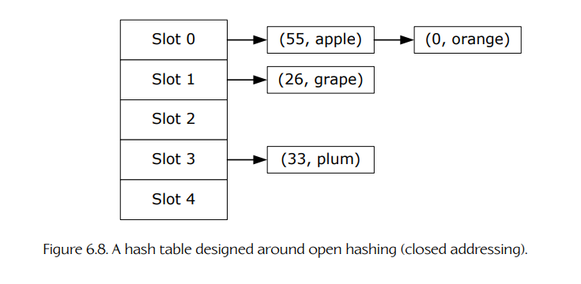
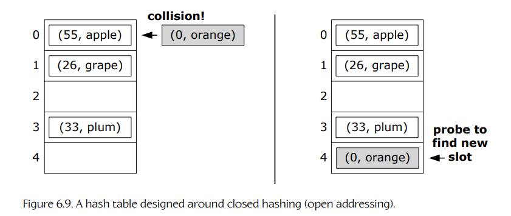
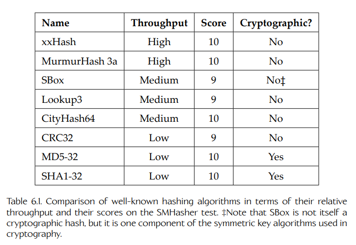

## 6.3 容器

游戏程序员会使用各种各样面向集合的数据结构，它们也被称为**容器**（containers）或**集合**（collections）。容器的职责始终相同：容纳并管理零个或多个数据元素。然而，不同容器在实现细节上差异很大，并且每种容器都有各自的优缺点。常见的容器数据类型包括但当然不限于以下几类：

- **数组**（array）。一种有序、连续的元素集合，通过索引访问。数组长度通常在编译期静态确定。数组可以是多维的。C 和 C++ 原生支持数组，例如 `int a[5]`。

- **动态数组**（dynamic array）。一种长度可以在运行时动态变化的数组，例如 C++ 标准库中的 `std::vector`。

- **链表**（linked list）。一种有序的元素集合，但元素并不连续存储在内存中，而是通过指针彼此连接，例如 C++ 标准库中的 `std::list`。

- **栈**（stack）。一种支持后进先出（LIFO, last-in-first-out）模型的容器，用于添加和移除元素，也称为 push/pop，例如 `std::stack`。

- **队列**（queue）。一种支持先进先出（FIFO, first-in-first-out）模型的容器，用于添加和移除元素，例如 `std::queue`。

- **双端队列**（deque）。一种双端队列，支持在数组两端进行高效插入和删除，例如 `std::deque`。

- **树**（tree）。一种元素按层级关系组织的容器。每个元素（节点）有零个或一个父节点，以及零个或多个子节点。树是 DAG 的一种特殊情况（见下文）。

- **二叉搜索树**（binary search tree, BST）。一种树，其中每个节点最多有两个子节点，并通过某种明确的排序规则保持节点有序。二叉搜索树有许多类型，包括红黑树、伸展树、AVL 树等。

- **二叉堆**（binary heap）。一种二叉树，它会通过两条规则来维持某种近似排序状态，但并不像二叉搜索树那样完全有序：其一是**形状性质**（shape property），要求树必须完全填满，并且最后一行从左到右填充；其二是**堆性质**（heap property），要求每个节点按照某种用户定义的标准，都“大于”或“等于”其所有子节点。

- **优先队列**（priority queue）。一种允许以任意顺序添加元素，然后按照元素自身某种属性所定义的顺序移除元素的容器，这个属性就是元素的**优先级**（priority）。优先队列通常实现为堆，例如 `std::priority_queue`，但也可以有其他实现方式。优先队列有点像始终保持有序的列表，只不过它只支持取出最高优先级的元素，而且其底层很少真正用列表实现。

- **字典**（dictionary）。一种键值对表。给定对应的键，可以高效“查找”某个值。字典也称为**映射**（map）或**哈希表**（hash table），不过严格来说，哈希表只是字典的一种可能实现方式，例如 `std::map`、`std::hash_map`。

- **集合**（set）。一种保证所有元素根据某些标准都是唯一的容器。集合类似于只有键、没有值的字典。

- **图**（graph）。一种由节点构成的集合，节点之间通过单向或双向路径以任意模式连接。

- **有向无环图**（directed acyclic graph, DAG）。一种节点集合，节点之间具有单向连接，即**有向**（directed）连接，并且没有**环**（cycles），也就是说，不存在从某个节点出发并最终回到同一节点的非空路径。

### 6.3.1 容器操作

使用容器类的游戏引擎也不可避免地会使用各种常见算法。一些例子包括：

- **插入**（insert）。向容器中添加一个新元素。新元素可能被放在列表开头、末尾或其他位置；容器也可能根本没有顺序这一概念。

- **移除**（remove）。从容器中移除一个元素；这可能需要先执行查找操作（见下文）。不过，如果已有一个指向目标元素的迭代器，那么通过该迭代器移除元素可能会更加高效。

- **顺序访问**（sequential access / iteration）。按照某种“自然”的预定义顺序访问容器中的每个元素。

- **随机访问**（random access）。以任意顺序访问容器中的元素。

- **查找**（find）。在容器中搜索满足给定条件的元素。查找操作有各种变体，包括反向查找、查找多个元素等。此外，不同类型的数据结构和不同场景需要不同算法 [195]。

- **排序**（sort）。根据某个给定标准对容器内容进行排序。排序算法有很多种，包括冒泡排序、选择排序、插入排序、快速排序等。相关细节见 [196]。

### 6.3.2 迭代器

**迭代器**（iterator）是一个小型类，它“知道”如何高效访问某种特定容器中的元素。它的行为有点像数组索引或指针：它一次指向容器中的一个元素，可以前进到下一个元素，并且提供某种机制来检测容器中的所有元素是否都已经被访问过。下面两个代码片段中，第一个使用指针遍历 C 风格数组，第二个则使用几乎相同的语法遍历链表。

```cpp
void processArray(int container[], int numElements)
{
    int* pBegin = &container[0];
    int* pEnd = &container[numElements];

    for (int* p = pBegin; p != pEnd; p++)
    {
        int element = *p;
        // process element...
    }
}

void processList(std::list<int>& container)
{
    std::list<int>::iterator pBegin = container.begin();
    std::list<int>::iterator pEnd = container.end();

    for (auto p = pBegin; p != pEnd; ++p)
    {
        int element = *p;
        // process element...
    }
}
```

相较于尝试直接访问容器元素，使用迭代器的主要好处如下：

- 直接访问会破坏容器类的封装。迭代器通常是容器类的 `friend`，因此它可以在不向外部世界暴露任何实现细节的情况下高效遍历容器。（事实上，大多数优秀的容器类都会隐藏其内部细节，并且不能在没有迭代器的情况下被遍历。）

- 迭代器可以简化遍历过程。大多数迭代器的行为都像数组索引或指针，因此可以写出一个简单循环：递增迭代器，并将其与终止条件比较。即使底层数据结构非常复杂，也是如此。例如，迭代器可以让一棵树的中序深度优先遍历看起来和普通数组遍历一样简单。

#### 6.3.2.1 前置自增与后置自增

注意，在 `processArray()` 示例中，我们使用的是 C++ 的**后置自增**操作符 `p++`，而不是**前置自增**操作符 `++p`。这是一个细微但有时很重要的优化点。

前置自增操作符会在变量的值被表达式使用之前递增变量内容。后置自增操作符则会在变量的值被使用之后再递增变量内容。这意味着，写 `++p` 会在代码中引入一个**数据依赖**（data dependency）：CPU 必须等待递增操作完成，才能在表达式中使用其结果。在深度流水线 CPU 上，这会引入一次**停顿**（stall）。另一方面，使用 `p++` 时则没有这种数据依赖。变量的值可以立即被使用，而递增操作可以在稍后并行发生。因此，两种方式都不会向流水线中引入停顿。

当然，在 `for` 循环的“update”表达式中，前置自增和后置自增应该没有区别。这是因为任何优秀编译器都会识别出变量值并未在 `update_expr` 中被使用。但是，当变量值确实会被使用时，后置自增更可取，因为它不会在 CPU 流水线中引入停顿。

对于具有**重载**自增操作符的类，通常应当为这个小经验法则作一个例外，迭代器类中就经常会出现这种情况。根据定义，后置自增操作符必须返回被调用对象的一个未修改副本。根据类中数据成员的大小和复杂程度，复制迭代器所增加的成本可能会让性能关键循环中更倾向于使用前置自增。（前置自增在上面的 `processList()` 简单示例中不一定比后置自增更好，但我在那里使用前置自增，是为了突出这种差异。）

### 6.3.3 算法复杂度

针对某个应用选择哪一种容器类型，取决于待考虑容器的性能特征和内存特征。对于每种容器类型，我们都可以确定一些常见操作的理论性能，例如插入、删除、查找和排序。

我们通常把某个操作预期需要的时间量 `T` 表示为容器中元素数量 `n` 的函数：

```text
T = f(n)
```

与其试图求出精确函数 `f`，我们通常只关心该函数的整体**阶**（order）。例如，如果实际理论函数是下面任意一个：

```text
T = 5n² + 17
T = 102n² + 50n + 12
T = 1/2 n²
```

那么在所有情况下，我们都会把表达式简化为最相关的项，也就是这里的 `n²`。为了表示我们只是在陈述函数的阶，而不是它的精确方程，我们使用“大 O”记号，并写作：

```text
T = O(n²)
```

算法的阶通常可以通过检查伪代码来确定。如果算法的执行时间完全不依赖于容器中的元素数量，我们称其为 `O(1)`，也就是说，它会在**常数时间**（constant time）内完成。如果算法会在容器元素上执行一个循环，并且每个元素只访问一次，例如对无序列表进行线性搜索，那么该算法是 `O(n)`。如果两个循环嵌套，每个循环都有可能访问每个节点一次，那么算法是 `O(n²)`。如果使用分治方法，例如**二分查找**（binary search），其中每一步都消除列表的一半，那么在最坏情况下，实际访问的元素数量预计只有 `⌊log₂(n) + 1⌋` 个，因此我们称其为 `O(log n)` 操作。如果某个算法执行一个子算法 `n` 次，而该子算法是 `O(log n)`，那么整个算法就是 `O(n log n)`。

为了选择合适的容器类，我们应当观察预计最常用的操作，然后选择在这些操作上性能特征最有利的容器。你最常见到的复杂度阶，按从快到慢的顺序列出如下：

```text
O(1), O(log n), O(n), O(n log n), O(n²), O(nᵏ) for k > 2
```

我们还应当考虑容器的内存布局和使用特征。例如，数组（如 `int a[5]` 或 `std::vector`）会把元素连续存储在内存中，并且除了元素本身之外，不需要任何额外存储开销。（注意，动态数组确实需要少量固定开销。）另一方面，链表（如 `std::list`）会把每个元素包装在一个“链接”数据结构中，该结构包含指向下一个元素的指针，并且可能还包含指向前一个元素的指针；在 64 位机器上，每个元素最多可能增加 16 字节开销。此外，链表中的元素不需要在内存中连续存储，并且通常也确实不是连续的。

一块连续内存通常比一组分散内存块更适合缓存。因此，对于高速算法而言，就缓存性能来说，数组通常优于链表（除非链表节点本身是从一小块连续内存中分配的）。但在插入和删除元素的速度至关重要的场景中，链表通常更好。

### 6.3.4 构建自定义容器类

许多游戏引擎都会为常见容器数据结构提供自己的自定义实现。这种做法在主机游戏引擎，以及面向手机和 PDA 平台的游戏中尤其常见。自己构建这些类的原因包括：

- **完全控制**。你可以控制数据结构的内存需求、所使用的算法、内存何时以及如何被分配等。

- **优化机会**。你可以优化数据结构和算法，以利用目标主机硬件特性；也可以根据引擎中的特定应用对它们进行微调。

- **可定制性**。你可以提供 C++ 标准库或 Boost 等第三方库中不常见的自定义算法，例如在容器中搜索 `n` 个最相关的元素，而不只是搜索单个最相关元素。

- **消除外部依赖**。由于软件是你自己构建的，因此你不必依赖任何其他公司或团队来维护它。如果出现问题，可以立刻调试和修复，而不必等到该库下一个版本发布，而那时可能已经晚于你的游戏发售时间。

- **控制并发数据结构**。当你编写自己的容器类时，可以完全控制它们在多线程或多核系统上如何防止并发访问。例如，在 PS4 上，Naughty Dog 对大多数并发数据结构使用轻量级“自旋锁”互斥量，因为它们能很好地配合基于 fiber 的任务调度系统。第三方容器库未必能提供这种灵活性。

我们不可能在这里覆盖所有可能的数据结构，但可以看看游戏引擎程序员处理容器时常用的几种方式。

#### 6.3.4.1 构建还是不构建

这里不会讨论如何实现所有这些类型和算法的细节，因为大量书籍和在线资源都可以用于这个目的。不过，我们要关心的问题是：从哪里获得你需要的类型和算法实现。作为游戏引擎设计者，我们基本上有三种选择：

1. 手动构建所需的数据结构。
2. 使用 C++ 标准库提供的 STL 风格容器。
3. 依赖第三方库，例如 Boost [197]。

C++ 标准库和 Boost 这样的第三方库很有吸引力，因为它们提供了一组丰富而强大的容器类，几乎覆盖了所有能想到的数据结构类型。此外，这些包还提供了一套强大的基于模板的**泛型算法**（generic algorithms），即常见算法的实现，例如在容器中查找元素，并且这些算法几乎可以应用于任意类型的数据对象。然而，对于某些类型的游戏引擎来说，这些实现可能并不合适。下面我们简单考察每种方法的优缺点。

**C++ 标准库。**

C++ 标准库中 STL 风格容器类的优点包括：

- 它们提供了丰富的功能。
- 它们的实现健壮且完全可移植。

不过，这些容器类也有一些缺点，包括：

- 头文件晦涩难懂（虽然文档通常相当不错）。
- 通用容器类通常比专门为特定问题精心设计的数据结构更慢。
- 泛型容器可能比定制设计的数据结构消耗更多内存。
- C++ 标准库会进行大量动态内存分配，而且有时很难以适合高性能、内存受限主机游戏的方式控制它的内存需求。
- 标准 C++ 库提供的模板化分配器系统并不够灵活，难以让这些容器与某些类型的内存分配器配合使用，例如基于栈的分配器（见 6.2.1.1 节）。

PC 版 *Medal of Honor: Pacific Assault* 引擎大量使用了当时称为标准模板库（STL）的内容。虽然 *MOHPA* 确实遇到了一些帧率问题，但团队能够绕开 STL 造成的性能问题，主要方法是仔细限制并控制其使用。OGRE 是本书部分示例所使用的流行面向对象渲染库，它也大量使用 STL 风格容器。不过，在 Naughty Dog，我们禁止在运行时游戏代码中使用 STL 容器（虽然允许在离线工具代码中使用）。具体情况因项目而异：在游戏引擎项目中使用 C++ 标准库提供的 STL 风格容器当然是可行的，但应当谨慎使用。

**Boost。**

Boost 项目由 C++ 标准委员会库工作组成员发起，但现在已经是一个开源项目，拥有来自全球的众多贡献者。该项目的目标是生成可以扩展并协同配合标准 C++ 库的库，适用于商业和非商业用途。许多 Boost 库从 C++11 起已经被纳入 C++ 标准库，更多组件也被纳入标准委员会的库技术报告（TR2），这是它们成为未来 C++ 标准一部分的一个步骤。下面简要总结 Boost 能带来的东西：

- Boost 提供了大量 C++ 标准库中没有的有用设施。
- 在某些情况下，Boost 为 C++ 标准库中某些类的设计或实现问题提供了替代方案或变通方法。
- Boost 很擅长处理一些非常复杂的问题，例如智能指针。（请记住，智能指针是复杂的东西，而且它们可能成为性能负担。句柄通常更可取；详见 17.5 节。）
- Boost 库的文档通常非常优秀。文档不仅解释了每个库做什么以及如何使用，在大多数情况下还会提供关于设计决策、约束和需求的深入讨论。因此，阅读 Boost 文档是学习软件设计原则的好方法。

如果你已经在使用 C++ 标准库，那么 Boost 可以作为其许多功能的优秀扩展和/或替代方案。不过，需要注意以下事项：

- 大多数 Boost 核心类都是模板，因此使用它们通常只需要包含适当的头文件。不过，某些 Boost 库会构建成相当大的 `.lib` 文件，可能不适合非常小规模的游戏项目。
- 虽然全球 Boost 社区是一个优秀的支持网络，但 Boost 库并不提供任何保证。如果遇到 bug，最终仍然是你的团队需要绕开它或修复它。
- Boost 库基于 Boost Software License 分发。请仔细阅读许可证信息 [198]，确保它适合你的引擎。

**Folly。**

Folly 是由 Andrei Alexandrescu 和 Facebook 工程师开发的开源库。它的目标是扩展标准 C++ 库和 Boost 库（而不是与它们竞争），重点在于易用性和高性能软件开发。你可以在 [199] 了解它。该库本身可以在 GitHub 上获得 [200]。

**Loki。**

C++ 编程中有一个相当深奥的分支，称为**模板元编程**（template metaprogramming）。其核心思想是利用 C++ 的模板特性，让编译器完成大量原本必须在运行时完成的工作，并且实际上是在“诱导”编译器去做一些它原本并不是为此设计的事情。这可以产生一些令人惊讶地强大且有用的编程工具。

目前最著名、也可能是最强大的 C++ 模板元编程库是 Loki。它由 Andrei Alexandrescu 设计并编写（他的主页见 [201]）。该库可从 SourceForge 获取 [202]。

Loki 非常强大，是一套值得研究和学习的迷人代码。不过，它有两个较大的实际弱点：（a）其代码阅读和使用起来可能令人望而生畏，更不用说真正理解它；（b）它的一些组件依赖于利用编译器的“副作用”行为，因此在新编译器上工作时需要仔细定制。所以 Loki 可能有些难用，并且不像某些“不那么极端”的替代方案那样可移植。Loki 并不适合胆小者。也就是说，Loki 中的一些概念，例如**基于策略的编程**（policy-based programming），可以应用于任何 C++ 项目，即使你并不使用 Loki 库本身。我强烈建议所有软件工程师阅读 Andrei 的开创性著作 *Modern C++ Design* [4]，Loki 库正是从这本书中诞生的。

### 6.3.5 动态数组与分块分配

固定大小的 C 风格数组在游戏编程中使用非常广泛，因为它们不需要内存分配、内存连续且缓存友好，并且支持许多常见操作，例如高效地追加数据和搜索。

当数组大小不能预先确定时，程序员通常会转向**链表**或**动态数组**。如果我们希望保持固定长度数组的性能和内存特征，那么动态数组通常就是首选数据结构。

实现动态数组最简单的方式是先分配一个包含 `n` 个元素的缓冲区，然后只有当尝试添加超过 `n` 个元素时才**增长**该列表。这样可以获得固定大小数组的有利特性，同时不设上限。增长过程的实现方式是：分配一个新的更大缓冲区，将数据从原缓冲区复制到新缓冲区，然后释放原缓冲区。缓冲区大小会以某种有序方式增长，例如每次增长时增加 `n` 个元素，或者每次增长时将容量翻倍。我见过的大多数实现都不会收缩数组，只会增长数组（一个明显例外是把数组清空为零大小，这可能会也可能不会释放缓冲区）。因此，数组大小会变成一种“高水位线”（high water mark）。`std::vector` 类就是以这种方式工作的。

当然，如果你能为数据建立一个高水位线，那么你可能最好在引擎启动时直接分配一个该大小的单一缓冲区。动态数组的增长可能非常昂贵，因为它涉及重新分配和数据复制成本。这些成本的影响取决于缓冲区大小。被丢弃的缓冲区释放时，增长也可能导致内存碎片。因此，与所有会分配内存的数据结构一样，使用动态数组时必须谨慎。动态数组最好在开发期间使用，此时你还不确定将需要多大的缓冲区。一旦建立了合适的内存预算，它们始终可以转换为固定大小数组。

### 6.3.6 字典与哈希表

**字典**（dictionary）是一张键值对表。给定键，可以快速查找字典中的值。键和值可以是任意数据类型。这种数据结构通常实现为二叉搜索树或哈希表。

在二叉树实现中，键值对存储在二叉树的节点中，并且该树按键排序维护。通过键查找值需要执行一次 `O(log n)` 二分搜索。

在哈希表实现中，值存储在固定大小的表中，表中的每个槽位表示一个或多个键。要把一个键值对插入哈希表，首先要通过一个称为**哈希**（hashing）的过程将键转换为整数形式（如果它还不是整数）。然后，通过取哈希后的键对表大小的**模**（modulo），计算出哈希表中的索引。最后，键值对会被存储到对应该索引的槽位中。回想一下，取模运算符（C/C++ 中的 `%`）会求整数键除以表大小后的余数。因此，如果哈希表有 5 个槽位，那么键 3 会存储在索引 3 处（`3 % 5 == 3`），而键 6 会存储在索引 1 处（`6 % 5 == 1`）。在没有冲突的情况下，查找一个键值对是 `O(1)` 操作。

#### 6.3.6.1 冲突：开放哈希与封闭哈希

有时，两个或更多键最终会占用哈希表中的同一个槽位。这称为**哈希冲突**（hash collision）。解决冲突有两种基本方式，由此产生两种不同的哈希表：

- **开放哈希**（open hashing）。在使用开放哈希的哈希表中（见图 6.8），冲突通过在每个索引处存储多个键值对来解决，通常以链表形式存储。这种方法容易实现，并且不会对可存储的键值对数量施加上限。不过，每当向表中添加新的键值对时，它确实需要动态分配内存。这种冲突解决策略有时称为**封闭寻址**（closed addressing），因为表中某个条目的地址完全由其哈希后的键决定。

<a id="figure-68"></a>


**Figure 6.8.** 围绕开放哈希（封闭寻址）设计的哈希表。

- **封闭哈希**（closed hashing）。在使用封闭哈希的哈希表中（见图 6.9），冲突通过一个称为**探测**（probing）的过程解决，直到找到空槽位为止。（“探测”指的是应用一个明确定义的算法来搜索空闲槽位。）这种方法实现稍微困难一些，并且会对表中可驻留的键值对数量施加上限，因为每个槽位只能容纳一个键值对。但这种哈希表的主要优点是，它使用固定数量的内存，而且不需要动态内存分配。因此，它通常是主机游戏引擎中的不错选择。这种冲突解决策略有时称为**开放寻址**（open addressing），因为表中某个条目的地址只由其哈希后的键部分决定。

<a id="figure-69"></a>


**Figure 6.9.** 围绕封闭哈希（开放寻址）设计的哈希表。

开放哈希有时也被称为使用一种叫做**链式法**（chaining）的寻址方式，这个名字来自表中每个槽位上的链表。

#### 6.3.6.2 哈希

**哈希**（hashing）是把某种任意数据类型的键转换为整数的过程。该整数随后可以对表大小取模，作为表中的索引。从数学上讲，给定一个键 `k`，我们希望使用哈希函数 `H` 生成一个整数哈希值 `h`，然后按如下方式求出表中的索引 `i`：

```text
h = H(k)
i = h mod N
```

其中，`N` 是表中槽位的数量，符号 `mod` 表示取模运算，也就是求商 `h / N` 的余数。

如果键是唯一整数，那么哈希函数可以是恒等函数，即 `H(k) = k`。如果键是唯一的 32 位浮点数，那么哈希函数可以简单地把 32 位 `float` 的位模式重新解释为一个 32 位整数。

```cpp
U32 hashFloat(float f)
{
    // type pun from float to U32 via memcpy
    U32 u;
    memcpy(&u, &f, sizeof(u));

    // return the float's bit pattern directly
    return u;
}
```

如果键是字符串，我们可以使用**字符串哈希函数**（string hashing function），它会把字符串中所有字符的 ASCII 或 UTF 编码组合成一个单独的 32 位整数值。

哈希函数 `H(k)` 的质量对哈希表效率至关重要。一个“好”的哈希函数应当把所有有效键均匀分布到整个表中，从而尽量降低冲突发生的可能性。哈希函数还必须计算速度足够快，并且具有**确定性**（deterministic），也就是说，在输入完全相同的情况下，每次调用都必须产生完全相同的输出。

字符串可能是你会遇到的最常见键类型，因此了解一个“好”的字符串哈希函数尤其有帮助。表 6.1 列出了一些知名哈希算法、它们的吞吐量评级（基于基准测试测量结果，并转换为 Low、Medium 或 High 评级），以及它们在 SMHasher 测试中的分数 [203]。请注意，表中列出的相对吞吐量只用于粗略比较。影响哈希函数吞吐量的因素很多，包括运行它的硬件以及输入数据的性质。密码学哈希被故意设计得很慢，因为它们关注的是生成一种极不可能与其他输入字符串哈希值发生碰撞的哈希，并且根据给定哈希值反推出能产生该哈希的字符串在计算上极其困难。

<a id="table-61"></a>


**Table 6.1.** 知名哈希算法的比较，包括其相对吞吐量和 SMHasher 测试分数。‡请注意，SBox 本身不是密码学哈希，但它是密码学中使用的对称密钥算法的一个组成部分。

关于哈希函数的更多信息，可参考 Paul Hsieh 的优秀文章 [204]。

#### 6.3.6.3 实现封闭哈希表

在封闭哈希表中，键值对直接存储在表中，而不是存储在每个表项的链表中。这种方法允许程序员预先精确定义哈希表将使用的内存量。当我们遇到**冲突**时会出现问题，也就是两个键最终都想存储到表中的同一个槽位。为了解决这个问题，我们使用称为**探测**（probing）的过程。

最简单的方法是**线性探测**（linear probing）。想象一下，我们的哈希函数产生了一个表索引 `i`，但该槽位已经被占用；那么我们只需依次尝试槽位 `(i + 1)`、`(i + 2)`，以此类推，直到找到空槽位为止；当 `i = N` 时则绕回表开头。线性探测的另一种变体是在向前和向后之间交替搜索：`(i + 1)`、`(i - 1)`、`(i + 2)`、`(i - 2)`，以此类推，并确保把最终索引对表大小取模。

线性探测往往会导致键值对“聚集成团”（clump up）。为了避免这些簇，可以使用一种称为**二次探测**（quadratic probing）的算法。我们从被占用的表索引 `i` 开始，并使用探测序列 `i_j = (i ± j²)`，其中 `j = 1, 2, 3, ...`。换句话说，我们依次尝试 `(i + 1²)`、`(i - 1²)`、`(i + 2²)`、`(i - 2²)`，以此类推，并且始终记得把得到的索引对表大小取模，使其落在有效范围内。

使用封闭哈希时，最好把表大小设置为**素数**。使用素数表大小并配合二次探测，通常能以最小的聚集获得对可用表槽位的最佳覆盖。关于为什么素数哈希表大小更可取，可参考 [205]。

#### 6.3.6.4 罗宾汉哈希

**Robin Hood 哈希**（Robin Hood hashing）是另一种用于封闭哈希表的探测方法，近来变得越来越流行。即使哈希表几乎已满，这种探测方案也能提升封闭哈希表的性能。关于 Robin Hood 哈希如何工作的优秀讨论，见 [207]。
