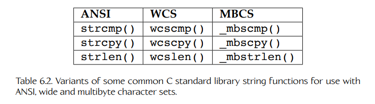
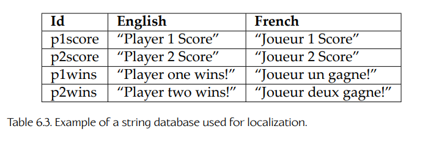
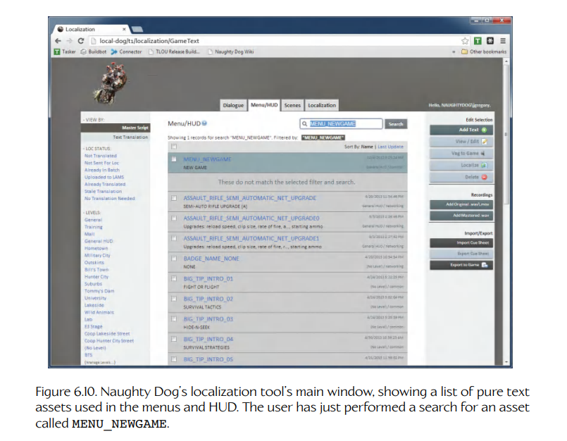
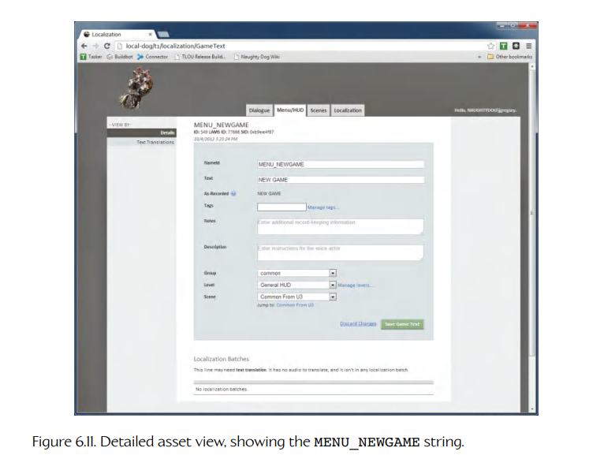

## 6.4 字符串

字符串几乎存在于每一个软件项目中，游戏引擎也不例外。表面上看，字符串似乎是一种简单、基础的数据类型。但是，当你开始在项目中使用字符串时，很快就会发现其中存在大量设计问题和约束，所有这些都必须被仔细考虑。

### 6.4.1 字符串的问题

关于字符串，最基本的问题是：它们应该如何在程序中存储和管理。在 C 和 C++ 中，字符串甚至不是一种原子类型——它们被实现为**字符数组**。字符串长度可变，这意味着我们要么必须硬编码字符串大小限制，要么需要动态分配字符串缓冲区。

另一个与字符串相关的大问题是**本地化**（localization）——即让软件适配其他语言发布的过程。这也称为**国际化**（internationalization），简称 I18N。任何显示给用户的英文字符串，都必须被翻译成你计划支持的各种语言。（当然，那些只在程序内部使用、永远不会显示给用户的字符串，可以免于本地化。）这不仅意味着你要确保能够表示计划支持的所有语言中的所有字符字形（通过一组合适的字体），还意味着要确保你的游戏能够处理不同的文本方向。例如，传统中文文本是竖排而不是横排的（虽然现代中文和日文通常是横向、从左到右书写的），而希伯来语等语言是从右到左阅读的。你的游戏还需要优雅地处理这样一种可能性：翻译后的字符串可能比英文原文长得多，也可能短得多。

最后，重要的是要认识到，在游戏引擎内部，字符串常常被用来命名资源文件和对象 ID。例如，当游戏设计师布置一个关卡时，允许他们使用有意义的名称来标识关卡中的对象会非常方便，例如 `"PlayerCamera"`、`"enemy-tank-01"` 或 `"explosionTrigger"`。

引擎如何处理这些内部字符串，通常会对游戏性能产生广泛影响。这是因为在运行时处理字符串本来就很昂贵。比较或复制 `int` 或 `float` 可以通过简单的机器语言指令完成。另一方面，比较字符串需要使用类似 `strcmp()` 的函数对字符数组进行一次 `O(n)` 扫描，其中 `n` 是字符串长度。复制字符串则需要一次 `O(n)` 内存拷贝，更不用说还可能需要为副本动态分配内存。在我参与过的一个项目中，我们分析游戏性能后发现，`strcmp()` 和 `strcpy()` 竟然是最昂贵的两个函数！通过消除不必要的字符串操作，并使用本节介绍的一些技术，我们几乎可以把这些函数从性能分析结果中完全消除，并显著提升游戏帧率。（我也听过许多不同工作室的开发者讲过类似经历。）

### 6.4.2 字符串类

许多 C++ 程序员更喜欢使用**字符串类**（string class），例如 C++ 标准库中的 `std::string`，而不是直接处理字符数组。这类类可以让程序员更方便地处理字符串。然而，字符串类可能具有一些隐藏成本，只有在对游戏进行性能分析后才会显现出来。例如，使用 C 风格字符数组向函数传递字符串通常很快，因为第一个字符的地址通常会通过硬件寄存器传递。另一方面，如果函数声明或使用不当，传递字符串对象可能会产生一个或多个拷贝构造函数的开销。复制字符串可能涉及动态内存分配，使一个看起来无害的函数调用最终消耗成千上万个机器周期。

由于字符串类存在大量问题，我通常倾向于避免在运行时游戏代码中使用它们。不过，如果你强烈想使用字符串类，请确保你选择或实现的字符串类具有可接受的运行时性能特征，并确保所有使用它的程序员都清楚它的成本。你必须了解你的字符串类：它是否把所有字符串缓冲区都视为只读？它是否使用**写时复制**（copy-on-write）优化？（见 [208]。）它是否提供移动构造函数？它是否拥有与字符串相关的内存，还是可以引用它并不拥有的内存？（关于字符串类中的内存所有权问题，见 [209]。）根据经验法则，始终通过引用传递字符串对象，绝不要按值传递，因为后者通常会产生字符串复制成本。尽早并经常分析你的代码，确保你的字符串类不会成为帧率损失的主要来源。

有一种情况下，专门的字符串类似乎确实有其合理性：存储和管理文件系统路径。这里，一个假想的 `Path` 类可以在原始 C 风格字符数组之上增加很多有用功能。例如，它可以提供从路径中提取文件名、文件扩展名或目录的函数。它还可以隐藏操作系统差异，例如自动把 Windows 风格的反斜杠转换为 UNIX 风格的正斜杠，或转换为其他操作系统的路径分隔符。在游戏引擎语境中，编写一个以跨平台方式提供这类功能的 `Path` 类可能非常有价值。（关于这个主题的更多细节，见 7.1.1.4 节。）

### 6.4.3 唯一标识符

任何虚拟游戏世界中的**对象**都需要以某种方式被唯一标识。例如，在 *Pac Man* 中，我们可能会遇到名为 `"pac_man"`、`"blinky"`、`"pinky"`、`"inky"` 和 `"clyde"` 的游戏对象。唯一对象标识符允许游戏设计师追踪构成其游戏世界的大量对象，也允许引擎在运行时找到并操作这些对象。此外，构成游戏对象的各种资源——网格、材质、纹理、音频片段、动画等——也都需要唯一标识符。

字符串看起来像是这类标识符的自然选择。资源通常以独立文件的形式存储在磁盘上，因此通常可以通过文件路径来唯一标识它们，而文件路径当然就是字符串。游戏对象由游戏设计师创建，因此让他们为对象分配可理解的字符串名称，也是很自然的做法，而不是让他们记住整数对象索引，或 64 位 / 128 位全局唯一标识符（GUID）。然而，在游戏中，唯一标识符之间比较的速度至关重要，所以 `strcmp()` 显然不够好。我们需要一种两全其美的方法：既能获得字符串的描述性和灵活性，又能拥有整数般的比较速度。

#### 6.4.3.1 哈希字符串标识符

一种不错的解决方案是对字符串进行**哈希**。如前所述，哈希函数会把字符串映射到一个半唯一整数。字符串哈希码可以像其他整数一样比较，因此比较速度很快。如果我们把实际字符串存储在哈希表中，那么原始字符串总可以从哈希码中恢复出来。这对调试很有用，也允许把哈希字符串显示在屏幕上或写入日志文件。游戏程序员有时使用术语 **string id** 来指称这种哈希字符串。Unreal Engine 则使用术语 **name**，由 `FName` 类实现。

和任何哈希系统一样，**冲突**（collision）是可能发生的，也就是说，两个不同字符串可能最终具有相同的哈希码。不过，使用合适的哈希函数时，我们几乎可以保证，对游戏中可能使用的所有合理输入字符串来说，冲突不会发生。毕竟，一个 32 位哈希码表示超过 40 亿种可能值。因此，如果哈希函数能够很好地把字符串均匀分布到这个巨大范围中，发生冲突的概率就很低。在 Naughty Dog，我们最初使用 CRC-32 算法的一个变体来哈希字符串，在 *Uncharted* 和 *The Last of Us* 多年的开发中，只遇到过少数几次冲突。而当冲突确实发生时，修复也很简单：稍微修改其中一个字符串即可，例如给某个字符串追加 `"2"` 或 `"b"`，或者使用一个完全不同但同义的字符串。话虽如此，Naughty Dog 已经在 *The Last of Us Part II* 以及所有未来游戏中转向使用 64 位哈希函数；考虑到单个游戏中所用字符串的数量和典型长度，这基本上可以消除哈希冲突的可能性。

#### 6.4.3.2 一些实现思路

从概念上讲，对字符串运行一个哈希函数来生成 string id 很简单。然而，从实践角度看，重要的是要考虑哈希**何时**计算。大多数使用 string id 的游戏引擎会在运行时进行哈希。在 Naughty Dog，我们允许在运行时对字符串进行哈希，但同时也使用 C++ 的**用户定义字面量**（user-defined literals）特性，把语法 `"any_string"_sid` 直接在编译期转换成一个哈希整数值。这样，string id 就可以用于任何可以使用整数显式常量的地方，包括 `switch` 语句中的常量 `case` 标签。（运行时函数调用生成的 string id 结果不是常量，因此不能作为 `case` 标签使用。）

从字符串生成 string id 的过程有时称为对字符串进行**驻留**（interning），因为除了对字符串进行哈希之外，字符串通常还会被添加到一个全局字符串表中。这样以后就可以从哈希码恢复原始字符串。你可能还希望工具能够在生成 string id 时对字符串进行哈希。这样一来，当工具生成供引擎使用的数据时，字符串就已经被哈希好了。

驻留字符串的主要问题在于它是一个慢操作。哈希函数必须在字符串上运行，这可能很昂贵，尤其是在大量字符串被驻留时。此外，还必须为字符串分配内存，并把它复制到查找表中。因此，如果你不是在编译期生成 string id，通常最好让每个字符串只驻留一次，并保存结果以供之后使用。例如，最好写出如下代码，因为后面的实现会导致每次调用函数 `f()` 时都不必要地重新驻留字符串。

```cpp
static StringId    sid_foo = internString("foo");
static StringId    sid_bar = internString("bar");

// ...

void f(StringId id)
{
    if (id == sid_foo)
    {
        // handle case of id == "foo"
    }
    else if (id == sid_bar)
    {
        // handle case of id == "bar"
    }
}
```

下面这种方法效率较低：

```cpp
void f(StringId id)
{
    if (id == internString("foo"))
    {
        // handle case of id == "foo"
    }
    else if (id == internString("bar"))
    {
        // handle case of id == "bar"
    }
}
```

下面是 `internString()` 的一种可能实现。

*stringid.h*

```cpp
typedef U32 StringId;

extern StringId internString(const char* str);
```

*stringid.cpp*

```cpp
static HashTable<StringId, const char*> gStringIdTable;

StringId internString(const char* str)
{
    StringId sid = hashCrc32(str);

    HashTable<StringId, const char*>::iterator it
        = gStringIdTable.find(sid);

    if (it == gStringTable.end())
    {
        // This string has not yet been added to the
        // table. Add it, being sure to copy it in case
        // the original was dynamically allocated and
        // might later be freed.
        gStringTable[sid] = strdup(str);
    }

    return sid;
}
```

Unreal Engine 使用的另一种思路是：把 string id 和指向相应 C 风格字符数组的指针包装在一个小类中。在 Unreal Engine 中，这个类称为 `FName`。在 Naughty Dog，我们也会做同样的事情，并把我们的 string id 类包装为 `StringId`。我们编写了一个自定义字符串字面量操作符，使得 `SID("any_string")` 会生成这个类的实例，其中的哈希值由用户定义字符串字面量语法 `"any_string"_sid` 生成。

**为字符串使用调试内存。**

使用 string id 时，字符串本身只是为了人类阅读而保留下来。当你发布游戏时，几乎肯定不需要这些字符串——游戏本身应该只使用 id。因此，把字符串表存储在一块最终零售版游戏中不存在的内存区域中，是个不错的主意。例如，PS5 开发套件拥有 16 GiB 零售内存，另外还有 16 GiB “调试内存”（debug memory，也称为 “development memory”，简称 “dev memory”），而零售机上并没有这部分内存。如果我们把字符串存储在调试内存中，就不必担心它们影响最终发布游戏的内存占用。（但我们必须小心，绝不要编写依赖这些字符串可用性的生产代码！）

### 6.4.4 本地化

游戏本地化（或任何软件项目的本地化）都是一项大工程。最好的做法是从第一天起就为它做计划，并在开发的每一步都考虑它。然而，我们并不总是能做到这一点。下面是一些建议，可以帮助你为游戏引擎项目规划本地化。关于软件本地化的深入讨论，见 [38]。

#### 6.4.4.1 Unicode

对大多数英语软件开发者来说，问题在于他们从出生起（或差不多从那时起！）就习惯于把字符串看作 8 位 ASCII 字符码数组，也就是遵循 ANSI 标准的字符。ANSI 字符串对于使用简单字母表的语言来说效果很好，例如英语。但是，对于包含大量字符、甚至包含与英语 26 个字母完全不同字形的复杂字母系统语言来说，ANSI 就远远不够了。为了解决 ANSI 标准的限制，Unicode 字符集系统被设计出来。

Unicode 背后的基本思想是：为全球常用的每种语言中的每个字符或字形分配一个唯一的十六进制编码，称为**码点**（code point）。当我们在内存中存储一串字符时，会选择一种特定的**编码**（encoding），也就是一种表示每个字符 Unicode 码点的具体方式；遵循这种规则，我们在内存中排布一串表示字符串的比特序列。UTF-8 和 UTF-16 是两种常见编码。你应当选择最适合自己需求的具体编码标准。

请现在放下这本书，去读 Joel Spolsky 的文章 “The Absolute Minimum Every Software Developer Absolutely, Positively Must Know About Unicode and Character Sets (No Excuses!)”。链接见 [210]。（读完之后，请再把书拿起来！）

**UTF-32。**

最简单的 Unicode 编码是 UTF-32。在这种编码中，每个 Unicode 码点都被编码为一个 32 位（4 字节）值。这种编码浪费大量空间，原因有两个。第一，大多数西欧语言字符串不会使用任何高值码点，因此平均每个字符通常至少浪费 16 位（2 字节）。第二，最高 Unicode 码点是 `0x10FFFF`，所以即便我们想创建一个使用所有可能 Unicode 字形的字符串，每个字符也只需要 21 位，而不是 32 位。

话虽如此，UTF-32 的确具有简单性优势。它是一种**固定长度编码**（fixed-length encoding），也就是说，每个字符在内存中占用相同数量的位（准确地说是 32 位）。因此，我们可以通过取得任意 UTF-32 字符串的字节长度并除以 4，来确定该字符串的长度。

**UTF-8。**

在 UTF-8 编码方案中，字符串中每个字符的码点以 8 位（1 字节）粒度存储，但有些码点会占用多个字节。因此，UTF-8 字符串占用的字节数不一定等于字符串中的字符数量。这称为**变长编码**（variable-length encoding），或者**多字节字符集**（multibyte character set, MBCS），因为字符串中的每个字符可能占用一个或多个字节的存储空间。

UTF-8 编码的一大优点是它向后兼容 ANSI 编码。这是因为前 127 个 Unicode 码点在数值上对应旧的 ANSI 字符码。这意味着每个 ANSI 字符在 UTF-8 中都恰好表示为一个字节，并且一个 ANSI 字符串可以无需修改地解释为 UTF-8 字符串。

为了表示更高值的码点，UTF-8 标准使用多字节字符。每个多字节字符都以一个最高有效位为 1 的字节开始，也就是说，它的值位于 128 到 255（含）范围内。这样的高值字节永远不会出现在 ANSI 字符串中，因此在区分单字节字符和多字节字符时不存在歧义。

**UTF-16。**

UTF-16 编码使用一种相对更简单、但开销更大的方式。UTF-16 字符串中的每个字符由一个或两个 16 位值表示。UTF-16 编码称为**宽字符集**（wide character set, WCS），因为每个字符至少有 16 位宽，而普通 ANSI 字符及其 UTF-8 对应字符只使用 8 位。

在 UTF-16 中，所有可能的 Unicode 码点被划分为 17 个**平面**（planes），每个平面包含 `2^16` 个码点。第一个平面称为**基本多文种平面**（basic multilingual plane, BMP）。它包含许多语言中最常用的码点。因此，许多 UTF-16 字符串可以完全由第一个平面内的码点表示，这意味着这种字符串中的每个字符只由一个 16 位值表示。然而，如果字符串中需要使用其他平面中的字符（称为**补充平面**，supplementary planes），那么它就会由两个连续的 16 位值表示。

UCS-2（2 字节通用字符集）编码是 UTF-16 编码的一个受限子集，只使用基本多文种平面。因此，它无法表示 Unicode 码点数值高于 `0xFFFF` 的字符。这简化了格式，因为每个字符都保证恰好占用 16 位（2 字节）。换句话说，UCS-2 是一种**固定长度字符编码**，而一般来说 UTF-8 和 UTF-16 都是**变长编码**。

如果我们预先知道某个 UTF-16 字符串只使用 BMP 中的码点（或者我们处理的是 UCS-2 编码字符串），那么只需将字节数除以 2，就可以确定字符串中的字符数量。当然，如果 UTF-16 字符串使用了补充平面，那么这个简单“技巧”就不再有效。

请注意，UTF-16 编码可以是小端或大端（见 3.3.2.1 节），这取决于目标 CPU 的原生字节序。在磁盘上存储 UTF-16 文本时，通常会在文本数据前加上一个**字节顺序标记**（byte order mark, BOM），用于指示单个 16 位字符是以小端还是大端格式存储。（当然，这一点对 UTF-32 编码字符串数据也同样成立。）

#### 6.4.4.2 `char` 与 `wchar_t`

标准 C/C++ 库定义了两种处理字符串的数据类型：`char` 和 `wchar_t`。`char` 类型意在用于旧式 ANSI 字符串和多字节字符集（MBCS），包括但不限于 UTF-8。`wchar_t` 类型是一种“宽”字符类型，意在能够用单个整数表示任意有效码点。因此，它的大小是编译器和系统相关的。在完全不支持 Unicode 的系统上，它可能是 8 位；如果假定所有宽字符都使用 UCS-2 编码，它可能是 16 位；如果使用类似 UTF-16 的多字编码，它也可能是 16 位；或者，如果 UTF-32 是首选的“宽”字符编码，它可能是 32 位。

由于 `wchar_t` 的定义中存在这种固有歧义，如果你需要编写真正可移植的字符串处理代码，就需要定义自己的字符数据类型，并提供一套库函数，用于处理你需要支持的任意 Unicode 编码。不过，如果你面向的是一个特定平台和编译器，那么你可以在该具体实现的限制之内编写代码，但会损失一些可移植性。

下面这篇文章很好地概述了使用 `wchar_t` 数据类型的优缺点：[211]。

#### 6.4.4.3 Windows 下的 Unicode

在 Windows 下，`wchar_t` 数据类型专门用于 UTF-16 编码的 Unicode 字符串，而 `char` 类型用于 ANSI 字符串和旧式 **Windows 代码页**（Windows code page）字符串编码。阅读 Windows API 文档时，术语 “Unicode” 因此总是等同于“宽字符集”（WCS）和 UTF-16 编码。这有点令人困惑，因为一般意义上的 Unicode 字符串当然也可以编码为“非宽字符”的多字节 UTF-8 格式。

Windows API 定义了三组字符 / 字符串操作函数：一组用于单字节字符集 ANSI 字符串（SBCS），一组用于多字节字符集（MBCS）字符串，还有一组用于宽字符集字符串。ANSI 函数本质上是我们都熟悉的老式 “C 风格” 字符串函数。MBCS 字符串函数可处理多种多字节编码，并且主要用于处理旧式 Windows 代码页编码。WCS 函数处理 Unicode UTF-16 字符串。

在整个 Windows API 中，前缀或后缀 `"w"`、`"wcs"` 或 `"W"` 表示宽字符集（UTF-16）编码；前缀或后缀 `"mb"` 表示多字节编码；前缀或后缀 `"a"`、`"A"`，或者完全没有任何前缀和后缀，表示 ANSI 或 Windows 代码页编码。C++ 标准库使用类似约定——例如，`std::string` 是其 ANSI 字符串类，而 `std::wstring` 是其宽字符等价类。不幸的是，函数名称并不总是 100% 一致。这会让不了解这些约定的程序员感到困惑。（但你不是那些程序员！）表 6.2 列出了一些示例。



**Table 6.2.** 一些常见 C 标准库字符串函数的变体，用于 ANSI、宽字符和多字节字符集。

Windows 还提供了在 ANSI 字符串、多字节字符串和宽 UTF-16 字符串之间转换的函数。例如，`wcstombs()` 会根据当前活动的**区域设置**（locale setting），把一个宽 UTF-16 字符串转换为多字节字符串。

Windows API 使用了一个小小的预处理器技巧，使你可以编写至少在表面上能在宽字符（Unicode）和非宽字符（ANSI/MBCS）字符串编码之间移植的代码。泛型字符数据类型 `TCHAR` 被定义为：当你的应用以 “ANSI mode” 构建时，它是 `char` 的 `typedef`；当你的应用以 “Unicode mode” 构建时，它是 `wchar_t` 的 `typedef`。宏 `_T()` 用于在 “Unicode mode” 编译时，把一个 8 位字符串字面量（例如 `char* s = "this is a string";`）转换为宽字符串字面量（例如 `wchar_t* s = L"this is a string";`）。类似地，还提供了一组“伪”API 函数，它们会根据你是否在 “Unicode mode” 下构建，自动神奇地变成相应的 8 位或 16 位变体。这些神奇的字符集无关函数，要么没有前缀和后缀，要么带有 `"t"`、`"tcs"` 或 `"T"` 前缀或后缀。

所有这些函数的完整文档都可以在网上找到。我更喜欢使用 `https://en.cppreference.com/` 或 `https://cplusplus.com/`。这里有一个指向 `strcmp()` 及其同类函数文档的链接 [212]，你可以很容易地通过页面左侧的树形视图，或通过搜索栏，导航到其他相关字符串操作函数。

#### 6.4.4.4 主机上的 Unicode

Xbox 软件开发套件（XDK）几乎完全使用 WCS 字符串处理所有字符串——甚至包括文件路径等内部字符串。这当然是处理本地化问题的一种有效方式，而且它让整个 XDK 的字符串处理非常一致。然而，UTF-16 编码在内存上有些浪费，因此不同游戏引擎可能采用不同约定。在 Naughty Dog，我们在整个引擎中使用 8 位 `char` 字符串，并通过 UTF-8 编码处理外语。编码选择本身并不特别重要，只要你在项目早期尽早选择一种编码，并始终坚持使用即可。

#### 6.4.4.5 其他本地化问题

即使你已经让软件适配了 Unicode 字符，仍然还有大量其他本地化问题需要处理。首先，字符串并不是唯一会产生本地化问题的地方。包含录制语音的音频片段必须被翻译。纹理中可能绘有英文单词，需要翻译。许多符号在不同文化中具有不同含义。即便是看似无害的不吸烟标志，在另一种文化中也可能被误解。此外，一些市场对不同游戏分级等级之间的边界划分不同。例如，在日本，Teen 评级游戏不允许显示任何形式的血液，而在北美，少量红色血迹飞溅是可以接受的。

对于字符串来说，也还有其他细节需要担心。你需要管理游戏中所有人类可读字符串的数据库，以便它们都能可靠地被翻译。软件必须根据用户安装设置显示正确语言。不同语言中字符串格式可能完全不同——例如，中文有时是竖排书写的，而希伯来语从右到左阅读。字符串长度会因语言而有很大差异。你还需要决定是发布一张包含所有语言的蓝光光盘，还是为特定地区发布不同光盘。

本地化系统中最关键的组件，是一个人类可读字符串的中央数据库，以及一个游戏内系统，用于通过 id 查找这些字符串。例如，假设你想要一个 HUD 显示每个玩家的分数，标签分别为 `"Player 1 Score:"` 和 `"Player 2 Score:"`，并且在一轮结束时显示文本 `"Player 1 Wins"` 或 `"Player 2 Wins"`。这四个字符串会存储在本地化数据库中，并使用你（游戏开发者）可以理解的唯一 id。因此，我们的数据库可能分别使用 id `"p1score"`、`"p2score"`、`"p1wins"` 和 `"p2wins"`。当游戏字符串被翻译成法语后，我们的数据库可能看起来像表 6.3 所示的简单示例。每当你的游戏支持一种新语言时，都可以添加额外列。



**Table 6.3.** 用于本地化的字符串数据库示例。

这个数据库的具体格式由你决定。它可以简单到只是一个 Microsoft Excel 工作表，保存为逗号分隔值（CSV）文件并由游戏引擎解析；也可以复杂到是一个完整的 Oracle 数据库。字符串数据库的具体细节对游戏引擎来说基本无关紧要，只要它能够读入 string id，以及你的游戏支持的任意语言所对应的 Unicode 字符串即可。（不过，从实践角度看，数据库的具体细节可能非常重要，这取决于你的游戏工作室组织结构。拥有内部翻译人员的小型工作室可能用位于网络驱动器上的 Excel 表格就足够了。但一个在英国、欧洲、南美和日本都有分部的大型工作室，可能会发现某种分布式数据库要合适得多。）

在运行时，你需要提供一个简单函数：给定字符串的唯一 id，返回“当前”语言下的 Unicode 字符串。该函数可能声明如下：

```cpp
wchar_t getLocalizedString(const char* id);
```

并且可以这样使用：

```cpp
void drawScoreHud(const Vector3& score1Pos,
                  const Vector3& score2Pos)
{
    renderer.displayTextOrtho(getLocalizedString("p1score"),
                              score1Pos);

    renderer.displayTextOrtho(getLocalizedString("p2score"),
                              score2Pos);

    // ...
}
```

当然，你还需要某种方式来全局设置“当前”语言。这可以通过配置设置完成，并在游戏安装期间固定下来。或者，你也可以允许用户通过游戏内菜单动态更改当前语言。无论哪种方式，这个设置都不难实现；它可以简单到只是一个全局整数变量，指定要从字符串表的哪一列读取（例如，第一列可能是英语，第二列是法语，第三列是西班牙语，依此类推）。

一旦这套基础设施就位，程序员就必须记住：**永远不要向用户显示原始字符串**。他们必须始终使用数据库中字符串的 id，并调用查找函数来检索相应字符串。

#### 6.4.4.6 案例研究：Naughty Dog 的本地化工具

在 Naughty Dog，我们使用一个内部开发的本地化数据库。本地化工具的后端由一个 MySQL 数据库组成，该数据库位于一台服务器上，Naughty Dog 内部开发者可以访问它，与我们合作把文本和语音音频片段翻译成游戏支持的各种语言的外部公司也可以访问它。前端是一个与数据库“对话”的 Web 界面，允许用户查看所有文本和音频资源、编辑其内容、为每个资源提供翻译、按 id 或内容搜索资源，等等。

在 Naughty Dog 的本地化工具中，每个资源要么是一个字符串（用于菜单或 HUD），要么是一个带可选字幕文本的语音音频片段（用于游戏内对话或过场动画）。每个资源都有一个唯一标识符，该标识符被表示为一个哈希 string id（见 6.4.3.1 节）。如果需要在菜单或 HUD 中使用某个字符串，我们会通过它的 id 查找它，并返回适合屏幕显示的 Unicode（UTF-8）字符串。如果要播放一行对话，同样会通过音频片段的 id 查找它，并在引擎内使用这些数据查找其对应字幕（如果有的话）。字幕会像菜单或 HUD 字符串一样处理，也就是说，它会由本地化工具 API 作为适合显示的 UTF-8 字符串返回。

图 6.10 展示了本地化工具的主界面，在这个例子中它显示在 Chrome Web 浏览器中。在这张图中，可以看到用户输入了 id `MENU_NEWGAME`，以查找字符串 `"NEW GAME"`，该字符串用于游戏主菜单中启动新游戏。



**Figure 6.10.** Naughty Dog 本地化工具的主窗口，显示菜单和 HUD 中使用的纯文本资源列表。用户刚刚搜索了名为 `MENU_NEWGAME` 的资源。

图 6.11 展示了 `MENU_NEWGAME` 资源的详细视图。如果用户点击资源详情窗口左上角的 “Text Translations” 按钮，就会出现图 6.12 所示的界面，允许用户输入或编辑该字符串的各种翻译。图 6.13 展示了本地化工具主页上的另一个标签页，这次列出的是语音音频资源。最后，图 6.14 描绘了语音资源 `BADA_GAM_MIL_ESCAPE_OVERPASS_001`（“We missed all the action”）的详细资源视图，其中展示了这句对话在若干受支持语言中的翻译。



**Figure 6.11.** 详细资源视图，显示 `MENU_NEWGAME` 字符串。
