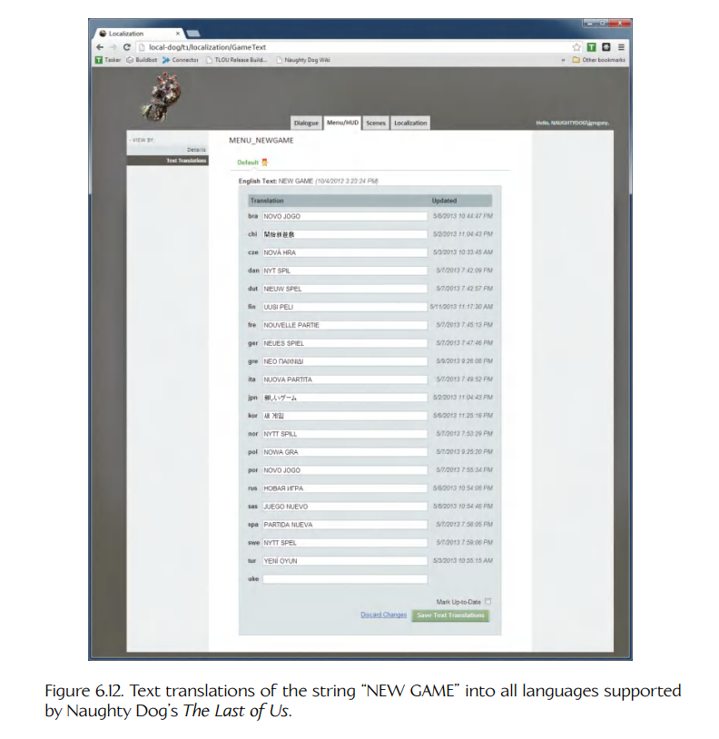
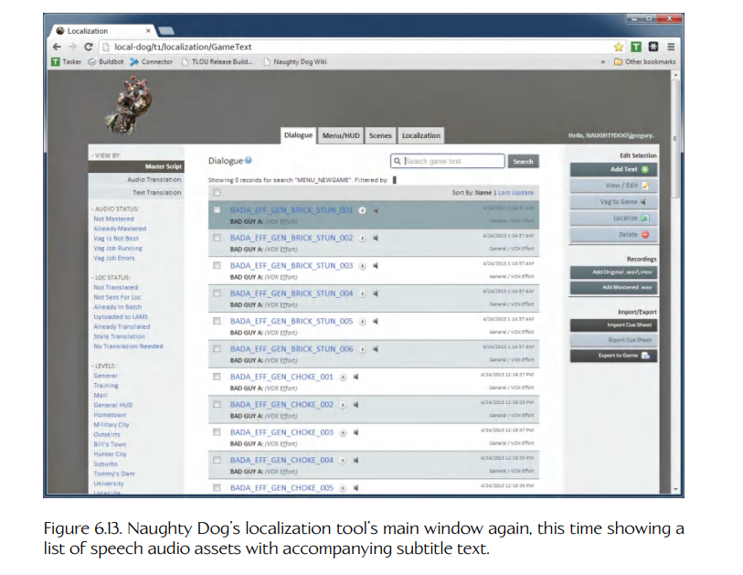
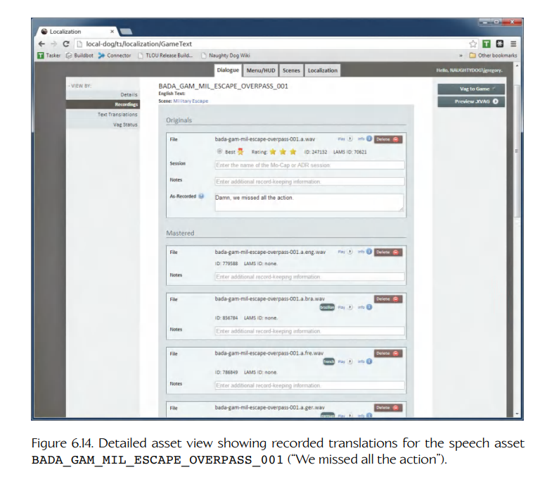

## 6.5 引擎配置

游戏引擎是复杂的“大家伙”，它们总是会有大量可配置选项。其中一些选项会通过游戏内的一个或多个选项菜单暴露给玩家。例如，游戏可能会暴露与图形质量、音乐和音效音量，或者控制器配置有关的选项。另一些选项则只为游戏开发团队而创建，并且在游戏发布前要么被隐藏，要么被完全从游戏中剥离。例如，玩家角色的最大行走速度可能会作为一个选项暴露出来，以便在开发期间进行微调，但在发布前它可能会被改成一个硬编码值。



**Figure 6.12.** 字符串 “NEW GAME” 被翻译成 Naughty Dog 的 *The Last of Us* 所支持的所有语言。

### 6.5.1 加载和保存选项

一个可配置选项可以很简单地实现为一个全局变量，或者实现为某个单例类的成员变量。然而，除非这些选项的值能够被配置、存储到硬盘、存储卡或其他存储介质中，并在之后由游戏重新读取，否则可配置选项并不会特别有用。加载和保存配置选项有许多简单方法：

- **文本配置文件**。保存和加载配置选项最常见的方法，是把它们放入一个或多个文本文件中。这些文件的格式在不同引擎之间差异很大，但通常都非常简单。例如，Windows INI 文件（OGRE 渲染器使用这种格式）由按逻辑区段分组的键值对平面列表组成。JSON 格式也是可配置游戏选项文件的另一种常见选择。XML 也是一种可行选项，虽然现在大多数开发者认为 JSON 比 XML 更简洁，也更易读。



**Figure 6.13.** Naughty Dog 本地化工具的主窗口再次出现，这次显示的是带有相应字幕文本的语音音频资源列表。



**Figure 6.14.** 详细资源视图，显示语音资源 `BADA_GAM_MIL_ESCAPE_OVERPASS_001`（“We missed all the action”）的录制翻译。

- **压缩二进制文件**。大多数现代主机都内置硬盘，但早期主机无法负担这种“奢侈品”。因此，从超级任天堂娱乐系统（SNES）开始，所有游戏主机都配备了专有的可移动存储卡，允许读写数据。游戏选项有时会与存档一起存储在这些存储卡上。在存储卡上，压缩二进制文件是首选格式，因为这些卡上的可用存储空间通常非常有限。

- **Windows 注册表**。Microsoft Windows 操作系统提供了一个全局选项数据库，称为注册表。它以树结构存储，其中内部节点（称为注册表键，registry keys）类似文件夹，叶节点则以键值对形式存储各个选项。话虽如此，我并不建议使用 Windows 注册表来存储引擎配置信息。注册表是一个单体数据库，很容易损坏、丢失（例如重装 Windows 时），或者与文件系统中的文件不同步。关于 Windows 注册表的缺点，见 [213]。

- **命令行选项**。命令行可以被扫描以获取选项设置。引擎可能提供一种机制，允许通过命令行控制游戏中的任何选项；或者它也可能只在这里暴露游戏选项的一个小子集。

- **环境变量**。在运行 Windows、Linux 或 MacOS 的个人计算机上，环境变量有时也被用来存储配置选项。

- **在线用户档案**。随着 Xbox Live 等在线游戏社区的出现，每个用户都可以创建个人档案，并用它保存成就、已购买和可解锁的游戏功能、游戏选项以及其他信息。这些数据存储在中央服务器上，只要玩家能够连接互联网，就可以访问这些数据。

### 6.5.2 按用户区分的选项

大多数游戏引擎会区分全局选项和按用户区分的选项。这是必要的，因为大多数游戏都允许每个玩家按自己的喜好配置游戏。在游戏开发过程中，这也是一个有用概念，因为它允许每位程序员、美术师和设计师自定义自己的工作环境，而不影响其他团队成员。

显然，必须小心地存储按用户区分的选项，使得每个玩家只能“看到”自己的选项，而不能看到同一台计算机或主机上其他玩家的选项。在主机游戏中，通常允许用户把自己的进度以及控制器偏好等按用户区分的选项保存在存储卡或硬盘上的“槽位”（slots）中。这些槽位通常实现为对应介质上的文件。

在 Windows 机器上，每个用户在 `C:\Users` 下都有一个文件夹，其中包含用户桌面、`My Documents` 文件夹、Internet 浏览历史、临时文件等信息。一个名为 `AppData` 的隐藏子文件夹用于按应用程序存储按用户区分的信息；每个应用程序都会在 `AppData` 下创建一个文件夹，并使用它存储所需的任何按用户区分的信息。

Windows 游戏有时会把按用户区分的配置数据存储在注册表中。注册表被组织为一棵树，根节点的一个顶层子节点称为 `HKEY_CURRENT_USER`，它存储当前登录用户的设置。每个用户在注册表中都有自己的子树（存储在顶层子树 `HKEY_USERS` 下），而 `HKEY_CURRENT_USER` 实际上只是当前用户子树的别名。因此，游戏和其他应用程序可以通过简单地读写 `HKEY_CURRENT_USER` 子树下的键，来管理按用户区分的配置选项。

### 6.5.3 一些真实引擎中的配置管理

在本节中，我们将简要了解一些真实游戏引擎如何管理它们的配置选项。

#### 6.5.3.1 示例：Quake 的 Cvar

Quake 系列引擎使用一种称为**控制台变量**（console variables）的配置管理系统，简称 **cvar**。cvar 只是一个浮点型或字符串型全局变量，它的值可以从 Quake 的游戏内控制台中查看和修改。一些 cvar 的值可以保存到磁盘，并在之后由引擎重新加载。

运行时，cvar 存储在一个全局链表中。每个 cvar 都是一个动态分配的 `struct cvar_t` 实例，其中包含变量名称、作为字符串或浮点数的值、一组标志位，以及指向所有 cvar 链表中下一个 cvar 的指针。访问 cvar 时会调用 `Cvar_Get()`，如果变量尚不存在，该函数会创建它；修改 cvar 时会调用 `Cvar_Set()`。其中一个位标志 `CVAR_ARCHIVE` 控制该 cvar 是否会被保存到一个名为 `config.cfg` 的配置文件中。如果设置了该标志，那么该 cvar 的值将在游戏多次运行之间保持不变。

#### 6.5.3.2 示例：OGRE

OGRE 渲染引擎使用一组 Windows INI 格式的文本文件来保存其配置选项。默认情况下，这些选项存储在三个文件中，每个文件都位于可执行程序所在的同一文件夹：

- `plugins.cfg` 包含一些选项，用于指定启用哪些可选引擎插件，以及在磁盘上的什么位置找到它们。
- `resources.cfg` 包含一个**搜索路径**（search path），用于指定游戏资源（也称 media，也称 resources）可以在哪里找到。
- `ogre.cfg` 包含大量选项，用于指定使用哪个渲染器（DirectX 或 OpenGL）、首选视频模式、屏幕大小等。

开箱即用时，OGRE 不提供存储按用户区分配置选项的机制。不过，OGRE 源代码是自由可用的，因此很容易修改它，让它在用户主目录中查找配置文件，而不是在包含可执行程序的文件夹中查找。`Ogre::ConfigFile` 类也让编写读写全新配置文件的代码变得很容易。

#### 6.5.3.3 示例：*Uncharted* 与 *The Last of Us* 系列

Naughty Dog 的引擎使用了多种配置机制。

##### 游戏内菜单设置

Naughty Dog 引擎支持一个强大的游戏内菜单系统，允许开发者控制全局配置选项并调用命令。可配置选项的数据类型必须相对简单（主要是布尔值、整数和浮点变量），但这一限制并没有阻止 Naughty Dog 的开发者创建数百个由菜单驱动的有用选项。

每个配置选项都被实现为一个全局变量，或单例 `struct` / 类的成员。当用于控制某个选项的菜单项被创建时，会提供该变量的地址，于是菜单项可以直接控制它的值。下面这个函数就是一个例子：它创建了一个子菜单项，其中包含一些用于 Naughty Dog **轨道车辆**（rail vehicles）的选项。轨道车辆是一类简单车辆，沿样条曲线运动，几乎出现在 Naughty Dog 的每一款游戏中，从 *Uncharted: Drake’s Fortune* 中的 “Out of the Frying Pan” 吉普追逐关，到 *Uncharted 4* 中的卡车车队 / 吉普追逐序列都有使用。它定义了控制三个全局变量的菜单项：两个布尔值和一个浮点值。这些条目被收集到一个菜单中，并返回一个特殊条目，当它被选中时会弹出该菜单。可以推测，调用该函数的代码会把这个条目添加到它正在构建的父菜单中。

```cpp
DMENU::ItemSubmenu * CreateRailVehicleMenu()
{
    extern bool g_railVehicleDebugDraw2D;
    extern bool g_railVehicleDebugDrawCameraGoals;
    extern float g_railVehicleFlameProbability;

    DMENU::Menu * pMenu
        = new DMENU::Menu("RailVehicle");

    pMenu->PushBackItem(
        new DMENU::ItemBool("Draw 2D Spring Graphs",
            DMENU::ToggleBool,
            &g_railVehicleDebugDraw2D));

    pMenu->PushBackItem(
        new DMENU::ItemBool("Draw Goals (Untracked)",
            DMENU::ToggleBool,
            &g_railVehicleDebugDrawCameraGoals));

    DMENU::ItemFloat * pItemFloat;
    pItemFloat = new DMENU::ItemFloat(
        "FlameProbability",
        DMENU::EditFloat, 5, "%5.2f",
        &g_railVehicleFlameProbability);

    pItemFloat->SetRangeAndStep(0.0f, 1.0f, 0.1f, 0.01f);
    pMenu->PushBackItem(pItemFloat);

    DMENU::ItemSubmenu * pSubmenuItem;
    pSubmenuItem = new DMENU::ItemSubmenu(
        "RailVehicle...", pMenu);

    return pSubmenuItem;
}
```

任何选项的值都可以保存：当对应菜单项被选中时，只需在 DualShock 手柄上按圆圈按钮标记即可。菜单设置会保存到一个 INI 风格的文本文件中，使保存的全局变量在游戏多次运行之间保持其值。能够以**每个菜单项为单位**控制哪些选项会被保存是非常有用的，因为任何未保存的选项都会采用程序员指定的默认值。如果程序员修改了某个默认值，所有用户都会“看到”这个新值，除非某个用户已经为该特定选项保存了自定义值。

##### 命令行参数

Naughty Dog 引擎会扫描命令行，以查找一组预定义的特殊选项。可以指定要加载的关卡名称，以及一些其他常用参数。

##### Scheme 数据定义

Naughty Dog 引擎中绝大多数引擎和游戏配置信息（用于制作 *Uncharted* 和 *The Last of Us* 系列）都是使用一种类似 Lisp 的语言 Scheme 指定的。借助一个专有数据编译器，Scheme 语言中定义的数据结构会被转换成可由引擎加载的二进制文件。数据编译器还会输出头文件，其中包含 Scheme 中定义的每种数据类型对应的 C `struct` 声明。这些头文件允许引擎正确解释加载的二进制文件中包含的数据。这些二进制文件甚至可以被即时重新编译和重新加载，使开发者能够修改 Scheme 中的数据，并立即看到更改效果（只要没有添加或删除数据成员，因为那会要求重新编译引擎）。

下面的例子展示了如何创建一个数据结构，用来指定动画的属性。然后它向游戏导出三个唯一动画。你可能以前从未读过 Scheme 代码，但对于这个相对简单的例子来说，它应该很容易理解。你会注意到一个奇怪之处：Scheme 符号中允许使用连字符，因此 `simple-animation` 是一个单独符号（不像在 C/C++ 中，`simple-animation` 会表示两个变量 `simple` 和 `animation` 相减）。

*simple-animation.scm*

```scheme
;; Define a new data type called simple-animation.
(deftype simple-animation ()
    (
        (name                 string)
        (speed                float   :default 1.0)
        (fade-in-seconds      float   :default 0.25)
        (fade-out-seconds     float   :default 0.25)
    )
)

;; Now define three instances of this data structure...
(define-export anim-walk
    (new simple-animation
        :name "walk"
        :speed 1.0
    )
)

(define-export anim-walk-fast
    (new simple-animation
        :name "walk"
        :speed 2.0
    )
)

(define-export anim-jump
    (new simple-animation
        :name "jump"
        :fade-in-seconds 0.1
        :fade-out-seconds 0.1
    )
)
```

这段 Scheme 代码会生成如下 C/C++ 头文件：

*simple-animation.h*

```cpp
// WARNING: This file was automatically generated from
// Scheme. Do not hand-edit.

struct SimpleAnimation
{
    const char* m_name;
    float       m_speed;
    float       m_fadeInSeconds;
    float       m_fadeOutSeconds;
};
```

在游戏中，可以通过调用 `LookupSymbol()` 函数读取这些数据。该函数以返回的数据类型为模板参数，如下所示：

```cpp
#include "simple-animation.h"

void someFunction()
{
    SimpleAnimation* pWalkAnim
        = LookupSymbol<SimpleAnimation*>(
            SID("anim-walk"));

    SimpleAnimation* pFastWalkAnim
        = LookupSymbol<SimpleAnimation*>(
            SID("anim-walk-fast"));

    SimpleAnimation* pJumpAnim
        = LookupSymbol<SimpleAnimation*>(
            SID("anim-jump"));

    // use the data here...
}
```

这个系统赋予程序员很大的灵活性，让他们能够定义各种配置数据——从简单的布尔值、浮点值和字符串选项，到复杂、嵌套、相互连接的数据结构。它被用于指定详细的动画树、物理参数、玩家机制，等等。