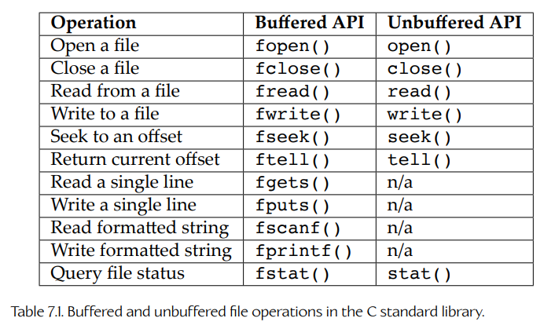

## 7.1 文件系统

游戏引擎的文件系统 API 通常会处理以下几个方面的功能：

- 操作文件名和路径；
- 打开、关闭、读取和写入单个文件；
- 扫描目录内容；
- 处理异步文件 I/O 请求（用于流式加载）。

下面几节将分别对这些功能做一个简要介绍。

### 7.1.1 文件名与路径

**路径**（path）是一个字符串，用于描述文件或目录在文件系统层次结构中的位置。每种操作系统使用的路径格式略有不同，但在所有操作系统上，路径的基本结构本质上是相同的。路径通常采用以下形式：

    volume/directory1/directory2/.../directoryN/file-name

或者：

    volume/directory1/directory2/.../directory(N-1)/directoryN

换句话说，路径通常由一个可选的**卷标识符**（volume specifier）开始，后面跟着一系列由保留路径分隔符字符分隔的**路径组成部分**（path components），例如正斜杠 `/` 或反斜杠 `\`。每个组成部分都表示从根目录到目标文件或目录沿途经过的某个目录。如果路径指定的是某个文件的位置，那么路径中的最后一个组成部分就是文件名；否则，它表示目标目录。根目录通常由一个路径来表示，该路径由可选的卷标识符后跟一个单独的路径分隔符组成（例如 UNIX 上的 `/`，或 Windows 上的 `C:\`）。

#### 7.1.1.1 不同操作系统之间的差异

每种操作系统都会在这种通用路径结构上引入一些细微差异。下面列出 Microsoft DOS、Microsoft Windows、UNIX 系列操作系统以及 Apple Macintosh OS 之间的一些主要差异：

- UNIX 使用正斜杠 `/` 作为路径组成部分的分隔符，而 DOS 和较早版本的 Windows 使用反斜杠 `\` 作为路径分隔符。较新版本的 Windows 允许使用正斜杠或反斜杠来分隔路径组成部分，不过有些应用程序仍然无法接受正斜杠。

- Mac OS 8 和 Mac OS 9 使用冒号 `:` 作为路径分隔符。Mac OS X 基于 BSD UNIX，因此它支持 UNIX 的正斜杠表示法。

- 有些文件系统认为路径和文件名是大小写敏感的（例如 UNIX 及其变体），而另一些文件系统则是大小写不敏感的（例如 Windows）。在跨多个操作系统处理文件，或者编写跨平台游戏时，这一点可能会造成问题。例如，名为 `EnemyAnims.json` 的资源文件是否应该被认为等同于名为 `enemyanims.json` 的资源文件？

- UNIX 及其变体不支持将卷作为独立的目录层次结构。整个文件系统都包含在一个单独的整体层次结构中，而本地磁盘驱动器、网络驱动器以及其他资源会被**挂载**（mounted）到该层次结构中，使其表现为主层次结构中的子树。因此，UNIX 路径中从来不会包含卷标识符。

- 在 Microsoft Windows 上，可以通过两种方式指定卷。可以用一个字母后接冒号来指定本地磁盘驱动器（例如无处不在的 `C:`）。远程网络共享可以被挂载成看起来像本地磁盘的形式，也可以通过一个卷标识符来引用，该标识符由两个反斜杠、远程计算机名以及该计算机上某个共享目录或资源的名称组成（例如 `\\some-computer\some-share`）。这种双反斜杠表示法是**通用命名约定**（Universal Naming Convention, UNC）的一个例子。

- 在 DOS 和早期版本的 Windows 中，文件名最多可以包含 8 个字符，并带有一个由点号与主文件名分隔开的 3 字符**扩展名**（extension）。扩展名描述文件类型，例如 `.txt` 表示文本文件，`.exe` 表示可执行文件。在较新的 Windows 实现中，文件名可以像 UNIX 一样包含任意数量的点号，但最后一个点号之后的字符仍然会被许多应用程序解释为文件扩展名，包括 Windows Explorer。

- 每个操作系统都会禁止在文件和目录名称中使用某些字符。例如，在 Windows 或 DOS 路径中，冒号不能出现在任何位置，除非它是驱动器字母卷标识符的一部分。某些操作系统允许这些保留字符的一个子集出现在路径中，前提是整个路径被引号包围，或者有问题的字符通过在前面添加反斜杠或其他保留**转义字符**（escape character）进行**转义**（escaped）。例如，在 Windows 下，文件和目录名称可以包含空格，但在某些上下文中，这样的路径必须用双引号包围。

- UNIX 和 Windows 都有**当前工作目录**（current working directory, CWD）的概念，也称为**当前工作目录**（present working directory, PWD）。在这两种操作系统中，都可以通过命令行 shell 中的 `cd`（change directory）命令来设置 CWD，并且可以在 Windows 上通过不带参数执行 `cd` 命令，或在 UNIX 上执行 `pwd` 命令来查询 CWD。在 UNIX 下，只有一个 CWD。而在 Windows 下，每个卷都有自己私有的 CWD。

- 支持多个卷的操作系统（例如 Windows）还具有**当前工作卷**（current working volume）的概念。在 Windows 命令行 shell 中，可以通过输入驱动器字母和冒号，然后按 Enter 键来设置当前卷（例如 `C:<Enter>`）。

- 主机通常还会使用一组预定义的**路径前缀**（path prefixes）来表示多个卷。例如，PlayStation 3 使用前缀 `/dev_bdvd/` 表示蓝光光盘驱动器，而 `/dev_hddx/` 表示一个或多个硬盘（其中 `x` 是设备索引）。在 PS3 开发套件上，`/app_home/` 会映射到开发过程中所使用主机上的用户定义路径。在开发期间，游戏通常会从 `/app_home/` 读取资源，而不是从蓝光光盘或硬盘读取资源。

#### 7.1.1.2 绝对路径与相对路径

所有路径都是相对于文件系统中某个位置来指定的。当一个路径是相对于根目录指定的，我们称其为**绝对路径**（absolute path）。当它是相对于文件系统层次结构中的其他某个目录指定的，我们称其为**相对路径**（relative path）。

在 UNIX 和 Windows 下，绝对路径都以路径分隔符字符开头（`/` 或 `\`），而相对路径没有前导路径分隔符。在 Windows 上，绝对路径和相对路径都可以带有一个可选的卷标识符。如果省略卷，则该路径会被假定为指向当前工作卷。

以下路径都是绝对路径：

*Windows*

- `C:\Windows\System32`
- `D:\`（`D:` 卷上的根目录）
- `\`（当前工作卷上的根目录）
- `\game\assets\animation\walk.anim`（当前工作卷）
- `\\joe-dell\Shared_Files\Images\foo.jpg`（网络路径）

*UNIX*

- `/usr/local/bin/grep`
- `/game/src/audio/effects.cpp`
- `/`（根目录）

以下路径都是相对路径：

*Windows*

- `System32`（相对于当前卷上的 CWD `\windows`）
- `X:animation\walk.anim`（相对于 `X:` 卷上的 CWD `\game\assets`）

*UNIX*

- `bin/grep`（相对于 CWD `/usr/local`）
- `src/audio/effects.cpp`（相对于 CWD `/game`）

#### 7.1.1.3 搜索路径

术语 **path** 不应与术语 **search path** 混淆。**路径**（path）是一个字符串，表示文件系统层次结构中某个文件或目录的位置。**搜索路径**（search path）是一个字符串，其中包含一组路径，每个路径之间由特殊字符分隔，例如冒号或分号；在查找文件时，系统会依次搜索这些路径。例如，当你从命令提示符运行任何程序时，操作系统会通过搜索 shell 环境变量中的搜索路径里的每一个目录，来查找可执行文件。

一些游戏引擎也会使用搜索路径来定位资源文件。例如，OGRE 渲染引擎使用一个资源搜索路径，该路径存放在名为 `resources.cfg` 的文本文件中。这个文件提供了一个简单列表，其中列出了在尝试查找某个资源时应该依次搜索的目录和 ZIP 归档文件。话虽如此，在运行时搜索资源是一个耗时的过程。通常情况下，我们没有理由无法预先知道资源路径。假设情况确实如此，我们就可以完全避免搜索资源，而这显然是一种更好的做法。

#### 7.1.1.4 路径接口

显然，路径远比简单字符串复杂。程序员在处理路径时可能需要完成许多操作，例如分离目录、文件名和扩展名，对路径进行规范化，在绝对路径和相对路径之间来回转换，等等。拥有一个功能丰富的 API 来帮助完成这些任务会非常有用。

Microsoft Windows 为此提供了一个 API。它由动态链接库 `shlwapi.dll` 实现，并通过头文件 `shlwapi.h` 暴露出来。该 API 的完整文档可在 Microsoft Learn 网站上的以下 URL 中找到：[214]。当然，`shlwapi` API 只在 Win32 平台上可用。

Sony 为 PlayStation 3 和 PlayStation 4 提供了类似的 API。但是，在编写跨平台游戏引擎时，我们不能直接使用平台专有 API。游戏引擎可能并不需要类似 `shlwapi` 这样的 API 所提供的所有函数。由于这些原因，游戏引擎通常会实现一个精简版的路径处理 API，该 API 满足引擎自身的特定需求，并且能够在引擎所面向的每一个操作系统上工作。这样的 API 可以实现为每个平台原生 API 之上的一个薄包装层，也可以完全从零开始编写。

### 7.1.2 基本文件 I/O

C 标准库提供了两套 API，用于打开、读取和写入文件内容：一套是带缓冲的，另一套是不带缓冲的。每一种文件 I/O API 都需要称为**缓冲区**（buffers）的数据块，用作程序与磁盘文件之间传输字节时的源或目标。如果某个文件 I/O API 会替你管理必要的输入和输出数据缓冲区，我们就说它是**带缓冲的**（buffered）。而对于不带缓冲的 API，分配和管理数据缓冲区的责任则落在使用该 API 的程序员身上。C 标准库的带缓冲文件 I/O 例程有时也被称为**流式 I/O**（stream I/O）API，因为它们提供了一种抽象，使磁盘文件看起来像字节流。

C 标准库中用于带缓冲和不带缓冲文件 I/O 的函数列在 Table 7.1 中。

**Table 7.1.** C 标准库中的带缓冲与不带缓冲文件操作。

C 标准库 I/O 函数已经有完善的文档，因此这里不会重复它们的详细说明。更多信息请参考 [215]，了解 Microsoft 对带缓冲（流式 I/O）API 的实现；参考 [216]，了解 Microsoft 对不带缓冲（低级 I/O）API 的实现。

在 UNIX 及其变体上，C 标准库的不带缓冲 I/O 例程就是原生操作系统调用。然而在 Microsoft Windows 上，这些例程只是对更底层 API 的包装。例如，Win32 函数 `CreateFile()` 会创建或打开一个文件用于写入或读取，`ReadFile()` 和 `WriteFile()` 分别用于读取和写入数据，而 `CloseFile()` 会关闭一个打开的文件句柄。与使用 C 标准库函数相比，使用低级系统调用的优点在于，它们会暴露原生文件系统的所有细节。例如，当使用 Windows 原生 API 时，你可以查询和控制文件的安全属性，而使用 C 标准库时则无法做到这一点。

一些游戏团队发现，管理自己的缓冲区是有用的。例如，Electronic Arts 的 *Red Alert 3* 团队观察到，将数据写入日志文件会造成明显的性能下降。他们修改了日志系统，使其先把输出累积到内存缓冲区中，只有当缓冲区填满时才将缓冲区写入磁盘。随后，他们又将缓冲区转储例程移动到一个单独的线程中，以避免阻塞主游戏循环。

#### 7.1.2.1 是否进行包装

游戏引擎可以直接使用 C 标准库的文件 I/O 函数，或者使用操作系统的原生 API。然而，许多游戏引擎会将文件 I/O API **包装**（wrap）到一组自定义 I/O 函数库中。包装操作系统 I/O API 至少有三个优点。第一，即使某个平台上的原生库行为不一致或存在缺陷，引擎程序员也可以保证所有目标平台上的行为一致。第二，可以将 API 简化到只保留引擎实际需要的函数，从而将维护工作量保持在最低水平。第三，可以提供扩展功能。例如，引擎的自定义包装 API 可能能够处理硬盘上的文件、主机上的蓝光光盘、网络上的文件（例如 Xbox Live 或 PSN 管理的远程文件），以及记忆棒或其他类型可移动介质上的文件。

#### 7.1.2.2 同步文件 I/O

C 标准库中的两套文件 I/O 库都是**同步的**（synchronous），这意味着发起 I/O 请求的程序必须等待，直到数据已经完全传入或传出媒体设备之后，才能继续执行。下面的代码片段演示了如何使用同步 I/O 函数 `fread()` 将某个文件的全部内容读取到内存缓冲区中。注意，`syncReadFile()` 函数直到所有数据都被读取到提供的缓冲区中之后才会返回。

    bool syncReadFile(const char* filePath,
                      U8* buffer,
                      size_t bufferSize,
                      size_t& rBytesRead)
    {
        FILE* handle = fopen(filePath, "rb");
        if (handle)
        {
            // 在这里阻塞，直到所有数据都已读取完毕。
            size_t bytesRead = fread(buffer, 1,
                                     bufferSize, handle);

            int err = ferror(handle); // 获取错误信息（如果有）

            fclose(handle);

            if (0 == err)
            {
                rBytesRead = bytesRead;
                return true;
            }
        }
        rBytesRead = 0;
        return false;
    }

    void main(int argc, const char* argv[])
    {
        U8 testBuffer[512];
        size_t bytesRead = 0;

        if (syncReadFile("C:\\testfile.bin",
                         testBuffer, sizeof(testBuffer),
                         bytesRead))
        {
            printf("success: read %u bytes\n", bytesRead);
            // 可以在这里使用缓冲区的内容……
        }
    }

### 7.1.3 异步文件 I/O

**流式加载**（streaming）指的是在主程序继续运行的同时，在后台加载数据的行为。许多游戏会从蓝光光盘或硬盘中流式加载后续关卡所需的数据，从而为玩家提供一种无缝、无加载画面的游玩体验。音频和纹理数据可能是最常被流式加载的数据类型，但任何类型的数据都可以被流式加载，包括几何体、关卡布局和动画片段。

为了支持流式加载，我们必须使用一个**异步**文件 I/O 库，也就是说，这个库允许程序在 I/O 请求尚未完成时继续运行。某些操作系统开箱即提供异步文件 I/O 库。例如，Windows 公共语言运行时（Common Language Runtime, CLR，也就是 Visual BASIC、C#、托管 C++ 和 J# 等语言所基于的虚拟机）提供了类似 `System.IO.BeginRead()` 和 `System.IO.BeginWrite()` 的函数。PlayStation 3、PlayStation 4 和 PlayStation 5 上则提供了一个名为 `fios` 的异步 API。如果目标平台没有可用的异步文件 I/O 库，那么可以自己编写一个。即使不必从零开始编写，出于可移植性的考虑，对系统 API 进行包装通常也是一个好主意。

下面的代码片段演示了如何使用异步读取操作，将文件的全部内容读取到内存缓冲区中。注意，`asyncReadFile()` 函数会立即返回；只有当 I/O 库调用回调函数 `asyncReadComplete()` 之后，数据才会出现在缓冲区中。

    AsyncRequestHandle g_hRequest; // 异步 I/O 请求句柄
    U8 g_asyncBuffer[512];         // 输入缓冲区

    static void asyncReadComplete(AsyncRequestHandle hRequest);

    void main(int argc, const char* argv[])
    {
        // 注意：这个对 asyncOpen() 的调用本身也可能是
        // 一个异步调用，但这里我们先忽略这个细节，
        // 并假定它是一个阻塞函数。

        AsyncFileHandle hFile = asyncOpen(
            "C:\\testfile.bin");

        if (hFile)
        {
            // 这个函数发起一个 I/O 读取请求，然后
            // 立即返回（非阻塞）。
            g_hRequest = asyncReadFile(
                hFile,                    // 文件句柄
                g_asyncBuffer,            // 输入缓冲区
                sizeof(g_asyncBuffer),    // 缓冲区大小
                asyncReadComplete);       // 回调函数
        }

        // 现在继续做自己的事情……
        // （这个循环模拟在等待 I/O 读取完成时做真实工作。）

        for (;;)
        {
            OutputDebugString("zzz...\n");
            Sleep(50);
        }
    }

    // 当数据读取完成后，会调用这个函数。
    static void asyncReadComplete(AsyncRequestHandle hRequest)
    {
        if (hRequest == g_hRequest
            && asyncWasSuccessful(hRequest))
        {
            // 数据现在已经存在于 g_asyncBuffer[] 中，
            // 可以使用了。查询实际读取的字节数。
            size_t bytes = asyncGetBytesReadOrWritten(
                                          hRequest);

            char msg[256];
            snprintf(msg, sizeof(msg),
                     "async success, read %u bytes\n",
                     bytes);
            OutputDebugString(msg);
        }
    }

大多数异步 I/O 库允许主程序在请求发出一段时间之后，等待某个 I/O 操作完成。当只有少量工作可以在需要使用某个挂起 I/O 请求的结果之前完成时，这会非常有用。下面的代码片段演示了这种情况。

    U8 g_asyncBuffer[512]; // 输入缓冲区

    void main(int argc, const char* argv[])
    {
        AsyncRequestHandle hRequest = ASYNC_INVALID_HANDLE;
        AsyncFileHandle hFile = asyncOpen(
                                      "C:\\testfile.bin");

        if (hFile)
        {
            // 这个函数发起一个 I/O 读取请求，然后
            // 立即返回（非阻塞）。
            hRequest = asyncReadFile(
                hFile,                    // 文件句柄
                g_asyncBuffer,            // 输入缓冲区
                sizeof(g_asyncBuffer),    // 缓冲区大小
                nullptr);                 // 无回调
        }

        // 现在先做一些有限的工作……
        for (int i = 0; i < 10; i++)
        {
            OutputDebugString("zzz...\n");
            Sleep(50);
        }

        // 在拿到这些数据之前，我们无法继续做任何事情，
        // 所以在这里等待。
        asyncWait(hRequest);

        if (asyncWasSuccessful(hRequest))
        {
            // 数据现在已经存在于 g_asyncBuffer[] 中，
            // 可以使用了。查询实际读取的字节数。
            size_t bytes = asyncGetBytesReadOrWritten(
                                              hRequest);

            char msg[256];
            snprintf(msg, sizeof(msg),
                     "async success, read %u bytes\n",
                     bytes);
            OutputDebugString(msg);
        }
    }

有些异步 I/O 库允许程序员询问某个特定异步操作预计还需要多久才能完成。有些 API 还允许你为某个请求设置**截止时间**（deadlines），这实际上会提高该请求相对于其他挂起请求的优先级，并且允许你指定当某个请求错过截止时间时会发生什么（例如取消请求、通知程序并继续尝试，等等）。

#### 7.1.3.1 优先级

需要记住的一点是，文件 I/O 是一个实时系统，与游戏的其他部分一样也受到截止时间约束。因此，异步 I/O 操作通常具有不同的优先级。例如，如果我们正在从硬盘或蓝光光盘流式加载音频并即时播放，那么加载下一整缓冲区音频数据的优先级显然高于加载纹理或一块游戏关卡。异步 I/O 系统必须能够挂起低优先级请求，使高优先级 I/O 请求有机会在截止时间之前完成。

#### 7.1.3.2 异步文件 I/O 的工作方式

异步文件 I/O 通过在单独的线程中处理 I/O 请求来工作。主线程调用一些函数，这些函数只是将请求放入队列，然后立即返回。与此同时，I/O 线程从队列中取出请求，并使用阻塞式 I/O 例程（例如 `read()` 或 `fread()`）依次处理它们。当某个请求完成时，主线程提供的回调函数会被调用，从而通知主线程该操作已经完成。如果主线程选择等待某个 I/O 请求完成，那么这通常会通过一个**信号量**（semaphore）来处理。（每个请求都关联一个信号量，主线程可以让自己进入休眠状态，等待该信号量在请求完成后由 I/O 线程发出信号。更多关于信号量的内容见 Section 4.6.4。）

实际上，几乎任何你能想到的同步操作，都可以通过将代码移动到一个单独线程中，或者在一个物理上独立的处理器上运行代码，而转换为异步操作；例如可以运行在 PlayStation 4 或 PlayStation 5 的某个 CPU 核心上。更多细节见 Section 8.6。

### 7.1.4 PlayStation 5 的 AMPR

PlayStation 5 的一大著名特性，是它极快的 M.2 固态硬盘（SSD）。PS5 能够以极高速度将数据从 SSD 加载到内存中（理论上超过 5.5 GiB/秒）。这种极快的 I/O 之所以成为可能，是因为 PS5 配备了一个专用处理器，可以同时加速虚拟内存映射，以及从 M.2 SSD 读取数据并对数据进行解压缩。游戏或其他应用程序可以预留虚拟地址范围，然后使用该专用处理器对物理内存页进行映射和取消映射，使其“支撑”这些虚拟地址。随后，数据就可以从 SSD 加载并解压缩到这些物理 RAM 页中。PS5 SDK 包含两个库，分别称为异步内存映射器（asynchronous memory mapper, AMM）和异步包读取器（asynchronous package reader, APR）。这两个库共同允许程序员向该专用处理器发送命令列表，指示它完成相应工作。这两个库合称为 AMPR。遗憾的是，AMPR 的文档是专有的，并且只提供给获得 PS5 SDK 授权的人，因此我们无法深入讨论细节。这里只需说明一点：在 PS5 上，可以使用 AMPR 来控制 PS5 的 M.2 SSD 及其虚拟内存系统，从而实现非常快速的异步文件 I/O。
