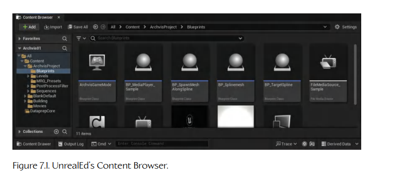
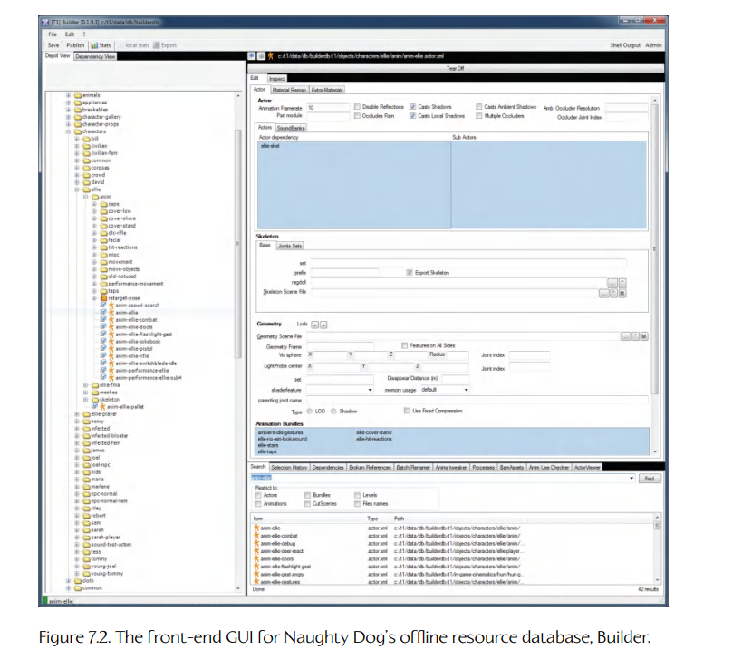
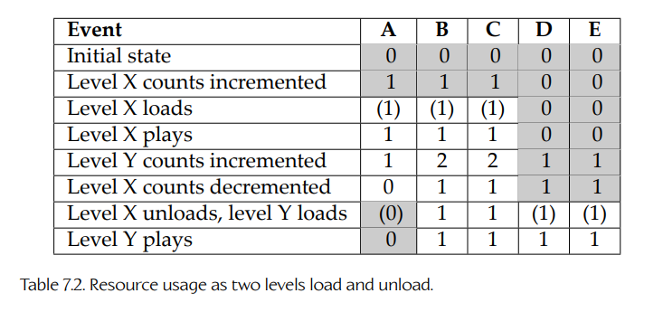
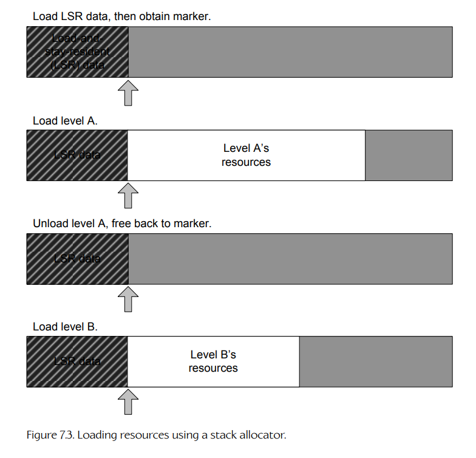
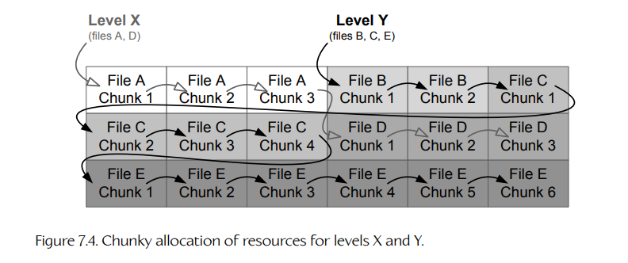
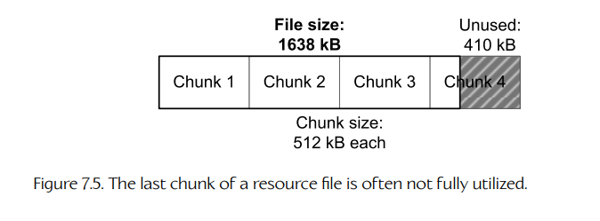
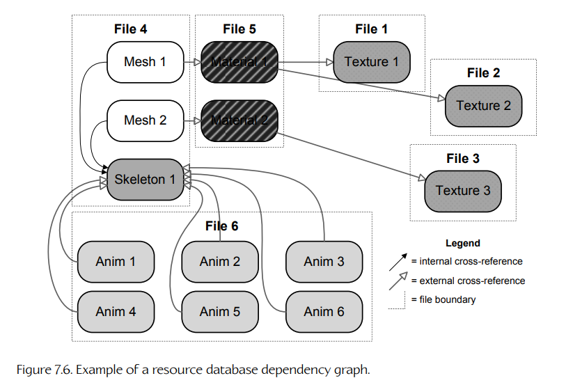
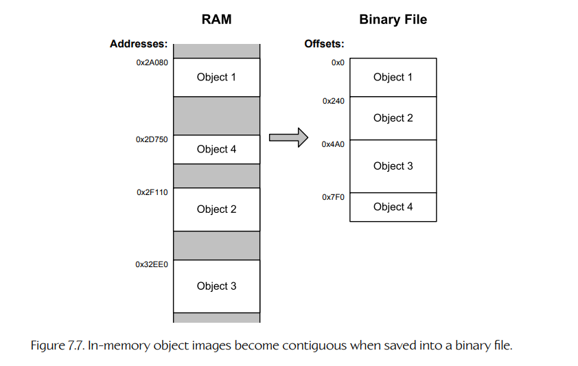
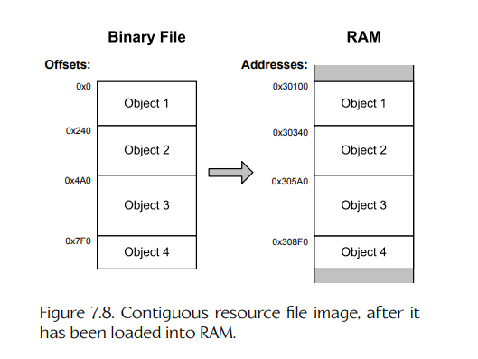
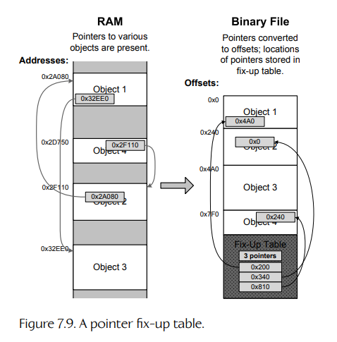

# 7.2 资源管理器

每个游戏都是由大量不同种类的**资源**（resources，有时也称为 **assets** 或 **media**）构成的。资源的例子包括网格、材质、纹理、着色器程序、动画、音频片段、关卡布局、碰撞基元、物理参数，等等。游戏资源必须得到管理，这既包括创建这些资源所使用的离线工具，也包括在运行时加载、卸载和操作这些资源。因此，每个游戏引擎都会以某种形式拥有一个**资源管理器**（resource manager）。

每个资源管理器都由两个彼此独立但又相互集成的组成部分构成。一个组成部分负责管理离线工具链，这些工具用于创建资源，并将资源转换为引擎可直接使用的形式。另一个组成部分则负责在运行时管理资源，确保资源在游戏需要之前加载进内存，并在不再需要时从内存中卸载。

在某些引擎中，资源管理器是一个设计清晰、统一且集中化的子系统，负责管理游戏所使用的所有类型资源。在另一些引擎中，资源管理器本身并不是一个单独的子系统，而是分散在一组彼此不同的子系统之中；这些子系统可能是在引擎漫长且有时颇为复杂的历史中，由不同的人在不同时期编写出来的。但无论具体如何实现，资源管理器总会承担某些职责，并解决一组被充分理解的问题。本节将探讨典型游戏引擎资源管理器的功能，以及其中的一些实现细节。

## 7.2.1 离线资源管理与工具链

### 7.2.1.1 资源的版本控制

在一个小型游戏项目中，游戏资源可以通过一种较为松散的方式管理：把零散文件放在共享网络驱动器上，并使用临时性的目录结构组织起来。然而，对于现代商业 3D 游戏来说，这种方式并不可行，因为这类游戏包含数量庞大且种类繁多的资源。对于这样的项目，团队需要一种更正式的方式来跟踪和管理资源。

一些游戏团队使用源代码版本控制系统来管理资源。美术源文件（Maya 场景、Photoshop PSD 文件、Illustrator 文件等）由美术人员提交到 Perforce 或类似系统中。这种方式通常运行得还不错，不过也有一些游戏团队会构建自定义资源管理工具，以帮助美术人员降低学习曲线。这类工具可能只是商业版本控制系统之上的简单包装层，也可能完全是自定义实现。

#### 处理数据规模

美术资源版本控制中最大的问题之一，就是数据量过于庞大。C++ 和脚本源代码文件相对于它们对项目的影响来说通常很小，而美术文件往往要大得多。由于许多源码控制系统的工作方式是将文件从中央仓库复制到用户的本地机器上，因此资源文件的巨大体积可能会使这些版本控制软件几乎完全无法使用。

我见过许多不同工作室采用的各种解决方案。有些工作室转向使用 Alienbrain 之类的商业版本控制系统，这类系统专门设计用于处理非常大的数据规模。有些团队则干脆“豁出去”，允许版本控制工具把资源复制到本地。只要磁盘足够大、网络带宽足够充足，这种方式也能工作，但它也可能效率低下，并拖慢整个团队。有些团队会在版本控制工具之上构建复杂系统，确保某个终端用户只在本地获得自己真正需要的文件副本。在这种模型中，用户要么无法访问仓库的其余部分，要么只能在需要时通过共享网络驱动器访问它。

在 Naughty Dog，我们使用一个名为 **NDFS**（Naughty Dog File System）的专有工具。它利用 Windows Projected Filesystem（Windows 10 版本 2004 或更高版本中可用），在中央仓库中管理资源，同时尽量减少需要复制到每个用户本地机器上的数据量。NDFS 让用户看起来像是在本地拥有仓库中存在的所有文件，但除非用户实际访问某个文件，否则本地副本并不会真正从服务器取回。如果需要编辑某个文件，NDFS 可以代表用户**签出**（check out）该文件，赋予用户修改该文件的独占权限。编辑完成后，用户可以将修改提交到服务器，此时 NDFS 会确保工作室中的所有其他用户自动“看到”最新版本。这同样可以以高效方式完成：要么只在用户实际尝试读取对应文件时更新他们，要么在计算机空闲时在后台逐渐更新文件。这个系统运行得很好，但遗憾的是，Naughty Dog 并没有将它商业化提供给其他游戏工作室使用（至少目前还没有！）。

### 7.2.1.2 资源数据库

正如我们将在下一节深入探讨的那样，大多数资源并不会以原始格式被游戏引擎使用。它们需要经过某种**资源调制流水线**（asset conditioning pipeline），其工作是将资源转换为引擎所需的二进制格式。对于每一个经过资源调制流水线的资源，都需要一些**元数据**（metadata），用于描述该资源应如何被处理。在压缩一张纹理位图时，我们需要知道哪种类型的压缩最适合这张特定图像。在导出一段动画时，我们需要知道 Maya 中的哪一段帧范围应该被导出。在从一个包含多个角色的 Maya 场景中导出角色网格时，我们需要知道哪个网格对应游戏中的哪个角色。

为了管理所有这些元数据，我们需要某种数据库。如果我们正在制作一个非常小的游戏，这个数据库也许可以直接存在于开发者自己的脑子里。我仿佛能听到他们这样说：“记住：玩家动画需要设置 `flip X` 标志，但其他角色绝不能设置……或者……糟了……是不是反过来？”

显然，对于任何具有一定规模的游戏，我们都不能依赖开发人员以这种方式进行记忆。首先，资源的庞大数量很快就会让人不堪重负。手工处理单个资源文件也太耗时，不适合成熟的商业游戏生产。因此，每个专业游戏团队都会拥有某种半自动化资源流水线，而驱动这条流水线的数据则存储在某种**资源数据库**（resource database）中。

资源数据库在不同游戏引擎中会呈现出截然不同的形式。在一个引擎中，描述资源应如何构建的元数据可能被嵌入到源资源本身之中（例如，它可能作为所谓的盲数据存储在 Maya 文件内部）。在另一个引擎中，每个源资源文件可能都配有一个小型文本文件，用于描述它应如何被处理。还有一些引擎会把资源构建元数据编码到一组 XML 文件中，并可能再由某种自定义图形用户界面包装起来。有些引擎则使用真正的关系型数据库，例如 Microsoft Access、MySQL，甚至可能是像 Oracle 这样的重量级数据库。

无论采用什么形式，资源数据库都必须提供以下基本功能：

- 能够处理多种**类型**的资源，理想情况下（但当然并非必须）以某种相对一致的方式处理。
- 能够创建新资源。
- 能够删除资源。
- 能够检查并修改已有资源。
- 能够将某个资源的源文件从磁盘上的一个位置移动到另一个位置。（这非常有用，因为美术人员和游戏设计师经常需要重新组织资源，以反映项目目标变化、游戏设计重新思考、功能新增和删减等情况。）
- 允许资源交叉引用其他资源（例如某个网格所使用的材质，或第 17 关所需的一组动画）。这些交叉引用通常会驱动资源构建过程，以及运行时的加载过程。
- 能够维护数据库中所有交叉引用的**引用完整性**（referential integrity），并且在执行删除、移动资源等常见操作时也能保持这种完整性。
- 能够维护修订历史，并带有记录谁在何时因为什么原因进行修改的日志。
- 如果资源数据库支持以各种方式进行搜索或查询，也会非常有帮助。例如，开发人员可能想知道某个特定动画被用于哪些关卡，或者某组材质引用了哪些纹理。又或者，他们可能只是想找到一个名字暂时想不起来的资源。

只要看一眼上面的列表就会很明显：创建一个可靠且健壮的资源数据库绝不是一件小事。如果设计良好并实现得当，资源数据库完全可能成为决定一个团队能否推出热门游戏的关键；反之，一个团队可能会在 18 个月里原地打转，最后被管理层迫使放弃项目（甚至更糟）。我知道这是真的，因为这两种情况我都亲身经历过。

### 7.2.1.3 一些成功的资源数据库设计

每个游戏团队在设计资源数据库时都会有不同需求，并做出不同决策。不过，仅供参考，下面列出一些在我个人经验中运行得不错的设计。

#### Unreal Engine

Unreal 的资源数据库由它的超级工具 UnrealEd 管理。UnrealEd 实际上负责所有事情，从资源元数据管理，到资源创建，再到关卡布局等等。UnrealEd 有它的缺点，但它最大的单一优势在于：UnrealEd 本身就是游戏引擎的一部分。这使得资源可以被创建出来，并立即以其完整效果查看，完全符合它们在游戏中出现时的样子。甚至可以在 UnrealEd 内部运行游戏，以便在资源的自然环境中观察它们，并查看它们是否以及如何在游戏中正常工作。

UnrealEd 的另一个巨大优势，是我所谓的**一站式服务**（one-stop shopping）。UnrealEd 的内容浏览器（如 Figure 7.1 所示）允许开发人员访问引擎所使用的每一种资源。为创建和管理所有类型资源提供单一、统一且相对一致的界面，是一个巨大的优点。考虑到大多数其他游戏引擎中的资源数据通常分散在无数彼此不一致、而且常常晦涩难懂的工具中，这一点尤其明显。仅仅能够在 UnrealEd 中轻松**找到**任意资源，就是一个很大的加分项。

Unreal 可能比许多其他引擎更不容易出错，因为资源必须显式导入到 Unreal 的资源数据库中。这使得资源能够在生产流程中非常早的阶段被检查有效性。在大多数游戏引擎中，任何旧数据都可以被扔进资源数据库，只有当它最终被构建出来时，才知道这些数据是否有效；有时甚至要等到运行时实际加载到游戏中，才知道是否有效。但在 Unreal 中，资源一旦被导入 UnrealEd，就能立即进行验证。这意味着创建该资源的人可以马上得到反馈，知道自己的资源是否配置正确。

**Figure 7.1.** UnrealEd 的内容浏览器。

当然，Unreal 的做法也存在一些严重缺点。首先，所有资源数据都存储在少数几个大型包文件中。这些文件是二进制文件，因此不容易被 CVS、Subversion 或 Perforce 这样的版本控制软件合并。当多个用户希望修改位于同一个包中的资源时，这会带来一些重大问题。即使用户试图修改的是**不同**资源，同一时间也只能有一个用户锁定该包，因此其他人必须等待。将资源划分为相对较小、粒度较细的包，可以缓解这个问题的严重程度，但实际上无法彻底消除它。

UnrealEd 中的引用完整性相当不错，但仍然存在一些问题。当某个资源被重命名或移动时，所有对它的引用都会通过一个虚拟对象自动维护，该虚拟对象会将旧资源重映射到新的名称或位置。这些虚拟重映射对象的问题在于，它们会一直存在并不断积累，有时会引发问题，尤其是在某个资源被删除时。总体而言，Unreal 的引用完整性相当好，但并不完美。

尽管存在这些问题，UnrealEd 仍然是我用过的最用户友好、集成度最高、流程最精简的资源创建工具包、资源数据库和资源调制流水线。

#### Naughty Dog 的引擎

在 *Uncharted: Drake’s Fortune* 中，Naughty Dog 将资源元数据存储在 MySQL 数据库中。我们编写了一个自定义图形用户界面来管理数据库内容。这个工具允许美术人员、游戏设计师和程序员创建新资源、删除已有资源，并检查和修改资源。这个 GUI 是系统中的关键组成部分，因为它让用户不必学习如何通过 SQL 与关系型数据库交互。

*Uncharted* 最初使用的 MySQL 数据库并不能提供有用的数据库修改历史，也无法很好地回滚“不好的”修改。它也不支持多个用户同时编辑同一个资源，并且管理起来很困难。此后，Naughty Dog 已经放弃 MySQL，转而使用基于 XML 文件的资源数据库，并由 Perforce 管理。

Builder 是 Naughty Dog 的资源数据库 GUI，如 Figure 7.2 所示。窗口分为两个主要区域：左侧是树形视图，显示游戏中的所有资源；右侧是属性窗口，允许查看和编辑树形视图中选中的资源。资源树包含用于组织的文件夹，因此美术人员和游戏设计师可以按他们认为合适的任何方式组织资源。各种类型的资源都可以在任意文件夹中创建和管理，包括 actor、关卡，以及组成它们的各种子资源（主要是网格、骨架和动画）。动画还可以被分组成称为 **bundle** 的伪文件夹。这样就可以将大量动画作为一个整体创建并管理，避免在树形视图中逐个拖动单个动画而浪费大量时间。

**Figure 7.2.** Naughty Dog 离线资源数据库 Builder 的前端 GUI。

*Uncharted* 和 *The Last of Us* 系列中使用的资源调制流水线由一组资源导出器、编译器和链接器组成，这些工具都从命令行运行。引擎能够处理各种不同类型的数据对象，但这些对象会被打包成两类资源文件之一：actor 和 level。actor 可以包含骨架、网格、材质、纹理和/或动画。level 包含静态背景网格、材质和纹理，以及关卡布局信息。要构建一个 actor，只需在命令行输入 `ba name-of-actor`；要构建一个 level，则输入 `bl name-of-level`。这些命令行工具会查询数据库，以准确确定如何构建对应的 actor 或 level。这包括如何从 Maya 和 Photoshop 等 DCC 工具导出资源、如何处理数据，以及如何将其打包成可由游戏引擎加载的二进制 `.pak` 文件。与许多引擎相比，这要简单得多；在许多引擎中，资源必须由美术人员**手动导出**，这是一项耗时、乏味且容易出错的工作。

Naughty Dog 所使用的资源流水线设计的优点包括：

- **粒度化资源**。资源可以按照游戏中的逻辑实体进行操作，例如网格、材质、骨架和动画。这些资源类型的粒度足够细，因此团队几乎不会遇到两个用户想同时编辑同一个资源的冲突。
- **必要功能，仅此而已**。Builder 工具提供了一组强大的功能，能够满足团队需求，但 Naughty Dog 并没有浪费资源去创建他们不需要的功能。
- **与源文件之间有清晰映射**。用户可以非常快速地确定哪些源资源（原生 DCC 文件，例如 Maya `.ma` 文件或 Photoshop `.psd` 文件）构成了某个特定资源。
- **易于修改 DCC 数据的导出和处理方式**。只需点击对应资源，并在资源数据库 GUI 中调整其处理属性即可。
- **易于构建资源**。只需在命令行输入 `ba` 或 `bl`，后接资源名称即可。依赖系统会处理其余工作。

当然，Naughty Dog 的工具链也有一些缺点，包括：

- **缺少可视化工具**。预览资源的唯一方式，是将其加载进游戏或模型/动画查看器中（而后者实际上也只是游戏本身的一种特殊模式）。
- **工具并未完全集成**。Naughty Dog 使用一个工具布局关卡，另一个工具管理资源数据库中的大部分资源，第三个工具设置材质和着色器（这并不是资源数据库前端的一部分）。资源的构建则在命令行中完成。如果所有这些功能都集成到一个工具中，或许会方便一些。不过，Naughty Dog 并没有计划这样做，因为收益很可能无法抵消相关成本。

#### OGRE 的资源管理器系统

OGRE 是一个渲染引擎，而不是一个完整的游戏引擎。话虽如此，OGRE 确实拥有一个相当完整且设计良好的运行时资源管理器。它使用一个简单、一致的接口来加载几乎任何类型的资源。并且该系统在设计时充分考虑了可扩展性。任何程序员都可以相当容易地为一种全新的资源类型实现资源管理器，并将其轻松集成到 OGRE 的资源框架中。

OGRE 资源管理器的一个缺点是，它只是运行时解决方案。OGRE 缺少任何形式的离线资源数据库。OGRE 确实提供了一些导出器，能够将 Maya 文件转换为可供 OGRE 使用的网格（包括材质、着色器、骨架以及可选动画）。然而，导出器必须在 Maya 内部手动运行。更糟的是，描述某个特定 Maya 文件应如何被导出和处理的所有元数据，都必须由执行导出的用户手动输入。

总之，OGRE 的运行时资源管理器强大且设计良好。但是，如果在工具侧也拥有同样强大且现代化的资源数据库和资源调制流水线，OGRE 将会受益良多。

#### Microsoft 的 XNA

XNA 是 Microsoft 推出的游戏开发工具包，面向 PC 和 Xbox 360 平台。尽管它已于 2014 年被 Microsoft 停止维护，但它仍然是学习游戏引擎的一个良好资源。XNA 的资源管理系统很独特，因为它利用 Visual Studio IDE 的项目管理和构建系统来管理并构建游戏资源。XNA 的游戏开发工具 Game Studio Express 只是 Visual Studio Express 的一个插件。

### 7.2.1.4 资源调制流水线

在 Section 1.6 中，我们了解到，资源数据通常使用高级数字内容创作（digital content creation, DCC）工具创建，例如 Maya、ZBrush、Photoshop 或 Houdini。然而，这些工具使用的数据格式通常不适合被游戏引擎直接消费。因此，大多数资源数据在进入游戏引擎之前，都要经过一条**资源调制流水线**（asset conditioning pipeline, ACP）。ACP 有时也被称为**资源调制流水线**（resource conditioning pipeline, RCP），或者简称为**工具链**（tool chain）。

每条资源流水线都从一组原生 DCC 格式的**源资源**（source assets）开始，例如 Maya `.ma` 或 `.mb` 文件、Photoshop `.psd` 文件等。这些资源在进入游戏引擎之前，通常会经过三个处理阶段：

1. **导出器**（exporters）。我们需要某种方式将数据从 DCC 的原生格式中取出，并转换为我们能够操作的格式。通常做法是为对应 DCC 编写一个自定义插件。该插件的工作是将数据导出为某种中间文件格式，以便传递给流水线后续阶段。大多数 DCC 应用程序都会提供相当方便的机制来完成这件事。Maya 实际上提供了三种方式：一个 C++ SDK、一种名为 MEL 的脚本语言，以及最近提供的 Python 接口。

   在某些情况下，如果 DCC 应用程序不提供自定义钩子，我们也总是可以将数据保存为该 DCC 工具的某种原生格式。幸运的话，其中某一种格式会是开放格式、相对直观的文本格式，或者其他某种可以进行逆向工程的格式。假设情况如此，我们就可以直接将该文件传递给流水线的下一阶段。

2. **资源编译器**（resource compilers）。我们经常必须以各种方式“整理”从 DCC 应用程序导出的原始数据，使它们达到游戏可用状态。例如，我们可能需要将网格中的三角形重新排列为条带，压缩纹理位图，或者计算 Catmull-Rom 样条曲线各段的弧长。并不是所有类型的资源都需要被编译；有些资源在导出之后就可能立即处于游戏可用状态。

3. **资源链接器**（resource linkers）。在被游戏引擎加载之前，多个资源文件有时需要被组合成一个有用的单一包。这类似于将已编译 C++ 程序的目标文件链接成可执行文件的过程，因此该过程有时称为**资源链接**（resource linking）。例如，在构建像 3D 模型这样的复杂复合资源时，我们可能需要将来自多个导出网格文件、多个材质文件、一个骨架文件和多个动画文件的数据组合成一个资源。并不是所有类型的资源都需要链接；有些资源在导出或编译步骤之后就已经游戏可用了。

#### 资源依赖与构建规则

很像先编译 C 或 C++ 项目中的源文件，然后将它们链接成可执行文件一样，资源调制流水线会处理源资源（例如 Maya 几何体和动画文件、Photoshop PSD 文件、原始音频片段、文本文件等），将它们转换成游戏可用形式，然后再将它们链接成一个可供引擎使用的内聚整体。并且，就像计算机程序中的源文件一样，游戏资源之间通常也存在相互依赖关系。（例如，某个网格引用一个或多个材质，而这些材质又引用各种纹理。）这些相互依赖关系通常会影响资源必须由流水线处理的顺序。（例如，在处理某个角色的动画之前，我们可能需要先构建该角色的骨架。）此外，资源之间的依赖关系还告诉我们，当某个特定源资源发生变化时，哪些资源需要被重新构建。

构建依赖不仅围绕资源本身的变化展开，也围绕数据格式的变化展开。如果格式文件发生变化，例如整个游戏中的所有网格都可能需要重新导出和/或重新构建。有些游戏引擎使用对版本变化具有鲁棒性的数据格式。例如，资源可能包含版本号，而游戏引擎可能包含能够“知道”如何加载和使用旧版资源的代码。这种策略的缺点是，资源文件和引擎代码往往会变得臃肿。当数据格式变化相对较少时，也许最好还是干脆在格式变化时重新处理所有文件。

每条资源调制流水线都需要一组规则，用于描述资源之间的相互依赖关系，还需要某种构建工具，利用这些信息确保当某个源资源被修改时，正确的资源会以正确的顺序被构建。有些游戏团队会自己编写构建系统。另一些团队则使用已有工具，例如 `make`。无论选择哪种方案，团队都应该极其谨慎地对待自己的构建依赖系统。如果不这样做，源资源的变化可能不会触发正确资源的重新构建。结果可能是不一致的游戏资源，从而导致视觉异常，甚至引擎崩溃。根据我个人经验，我曾见过无数小时被浪费在追踪那些本可以避免的问题上；只要资源间依赖被正确指定，并且构建系统可靠地使用这些依赖，这些问题本不该发生。

## 7.2.2 运行时资源管理

现在让我们把注意力转向：资源数据库中的资源在运行时如何在引擎中加载、管理和卸载。

### 7.2.2.1 运行时资源管理器的职责

游戏引擎的运行时资源管理器承担着广泛职责，而这些职责都与其主要任务有关：将资源加载进内存。

- 确保在任意给定时刻，内存中每一种唯一资源都只有**一份副本**。
- 管理每个资源的**生命周期**（lifetime）。
- **加载**所需资源，并**卸载**不再需要的资源。
- 处理**复合资源**（composite resources）的加载。复合资源是由其他资源组成的资源。例如，**3D 模型**就是一种复合资源，它由一个网格、一个或多个材质、一个或多个纹理，以及可选的骨架和多个骨骼动画组成。
- 维护**引用完整性**（referential integrity）。这包括**内部引用完整性**（单个资源内部的交叉引用）和**外部引用完整性**（资源之间的交叉引用）。例如，模型会引用它的网格和骨架；网格会引用它的材质，而材质又会引用纹理资源；动画会引用骨架，而骨架最终又会把动画关联到一个或多个模型上。当加载一个复合资源时，资源管理器必须确保所有必要的子资源都被加载，并且必须正确修补所有交叉引用。
- 管理已加载资源的**内存使用**，并确保资源被存储在内存中合适的位置。
- 允许在资源加载后，根据资源类型执行**自定义处理**。这个过程有时称为资源的**登录**（logging in）或**加载初始化**（load-initializing）。
- 通常（但不总是）提供一个**统一接口**，通过该接口可以管理多种资源类型。理想情况下，资源管理器还应该易于扩展，以便当游戏开发团队需要新资源类型时可以处理它们。
- 如果引擎支持该功能，则处理**流式加载**（streaming，即异步资源加载）。

### 7.2.2.2 资源文件与目录组织

在一些游戏引擎中（通常是 PC 引擎），每个独立资源都作为磁盘上的一个单独“松散”文件进行管理。这些文件通常包含在目录树中，而目录树的内部组织主要是为了方便创建资源的人；引擎通常并不关心资源文件在资源树中的具体位置。下面是一个名为 *Space Evaders* 的假想游戏的典型资源目录树：

    SpaceEvaders    整个游戏的根目录。
      Resources     所有资源的根目录。
        NPC         非玩家角色模型和动画。
          Pirate    海盗的模型和动画。
          Marine    陆战队员的模型和动画。
          ...

        Player      玩家角色模型和动画。

        Weapons     武器的模型和动画。
          Pistol    手枪的模型和动画。
          Rifle     步枪的模型和动画。
          BFG       那把巨大的……呃……枪的模型和动画。
          ...

        Levels      背景几何体和关卡布局。
          Level1    第一关资源。
          Level2    第二关资源。
          ...

        Objects     杂项 3D 物体。
          Crate     随处可见的可破坏木箱。
          Barrel    随处可见的爆炸桶。

其他引擎会将多个资源打包到一个单一文件中，例如 ZIP 归档文件，或某种其他复合文件（可能是专有格式）。OGRE 渲染引擎的资源管理器允许资源以磁盘上的松散文件形式存在，也允许资源作为大型 ZIP 归档文件中的虚拟文件存在。ZIP 的一个好处是它是开放格式。用于读取和写入 ZIP 归档的 `zlib` 和 `zziplib` 库都是免费可用的。`zlib` SDK 完全免费 [217]，而 `zziplib` SDK 则采用 GNU 宽通用公共许可证（LGPL）[218]。在 PlayStation 上，资源同样可以被收集到一种名为 `psarc`（PlayStation archive）的归档格式中。

Unreal Engine 采用类似方法，但有几个重要区别。在 Unreal 中，所有资源都必须包含在称为 **packages**（也称为 “pak files”）的大型复合文件中。不允许使用松散磁盘文件。包文件格式是专有的。Unreal Engine 的游戏编辑器 UnrealEd 允许开发人员创建和管理包，以及其中包含的资源。

任何归档文件格式（例如 ZIP、psarc 或 Unreal 的包格式）的主要优点包括：

1. **归档中的虚拟文件通常会“记住”它们的相对路径。** 这意味着从大多数用途来看，挂载后的归档文件“看起来像”一个原始文件系统。OGRE 资源管理器和 PlayStation 的 FIOS 文件系统都会通过类似文件系统路径的字符串唯一标识资源。然而，这些路径有时可以指向 ZIP 归档或 psarc 文件中的虚拟文件，而不是磁盘上的松散文件；在多数情况下，游戏程序员并不需要意识到二者之间的区别。

2. **归档可以被压缩。** 这会减少资源占用的磁盘空间。更重要的是，它可以加快加载时间，因为需要从磁盘加载的数据更少。当从蓝光光盘读取数据时，这尤其有帮助，因为这类设备的数据传输速率比硬盘或 SSD 慢得多。数据加载到内存后再解压缩的成本，通常会被从设备读取更少数据所节省的时间抵消。某些主机（例如 PlayStation 5）甚至拥有自定义硬件，可以以极快速度从 Oodle 格式执行 psarc 解压缩，而不会消耗宝贵的 CPU 资源。Oodle 是 RAD Game Tools 开发的一种非常高效的压缩算法。

3. **归档可以提升 I/O 效率。** 当从旋转硬盘上的文件加载数据时，三个最大的成本是寻道时间（也就是将读写磁头移动到物理介质上的正确位置）、打开每个单独文件所需的时间，以及将数据从文件读取到内存所需的时间。其中，对于旋转硬盘而言，寻道时间和文件打开时间并非小事。但当使用单个大型文件时，这些成本会被最小化。当然，固态硬盘（SSD）没有困扰 DVD、蓝光光盘和硬盘驱动器（HDD）等旋转介质的寻道时间问题。PlayStation 5 和 Xbox Series X 都使用高速 M.2 SSD 作为主存储设备。因此，在这些主机上，寻道时间实际上只是在从蓝光光盘执行 I/O 时才需要担心。

4. **归档鼓励模块化。** 举例来说，考虑 Naughty Dog 引擎如何管理特定语言的文本和音频资源。对于一个支持 N 种不同语言的游戏，每个文本和音频资源都会有 N 个版本。在 Naughty Dog 引擎中，每个资源的 N 个版本都使用完全相同的名称，但它们被放置在 N 个不同的 psarc 文件中。运行时，引擎只会挂载与用户所选语言对应的归档。如果用户通过选项菜单更改语言，引擎会卸载上一种语言的归档，然后挂载最新选择语言的归档。由于各个语言专用归档中的资源名称完全相同，引擎的其余部分并不需要“知道”或“关心”当前正在处理的是哪种语言。

### 7.2.2.3 资源文件格式

每种资源文件类型都可能拥有不同格式。例如，网格文件总是以不同于纹理位图的格式存储。有些资源会被存储为标准化的开放格式。例如，纹理通常存储为 Targa 文件（TGA）、便携式网络图形文件（PNG）、标记图像文件格式（TIFF）、联合图像专家组文件（JPEG）或 Windows 位图文件（BMP）；也可以存储为标准化压缩格式，例如 DirectX 的 S3 纹理压缩格式族（S3TC，也称为 DXTn 或 DXTC）。同样，3D 网格数据通常会从 Maya 或 Lightwave 之类的工具导出为标准格式，例如 OBJ 或 COLLADA，以供游戏引擎使用。

有时，一种单一文件格式可以用于容纳许多不同类型的资源。例如，RAD Game Tools 的 Granny SDK [219] 实现了一种灵活的开放文件格式，可用于存储 3D 网格数据、骨架层级结构和骨骼动画数据。（事实上，Granny 文件格式可以很容易被重新用于存储几乎任何可以想象的数据。）

许多游戏引擎程序员会出于各种原因设计自己的文件格式。如果没有标准化格式能够提供引擎所需的所有信息，这可能就是必要的。此外，许多游戏引擎都会尽可能多地进行离线处理，以最小化运行时加载和处理资源数据所需的时间。如果数据需要在内存中符合某种特定布局，例如可以选择一种原始二进制格式，使数据能由离线工具预先布局好，而不是在资源加载后再尝试在运行时格式化。

### 7.2.2.4 资源 GUID

游戏中的每个资源都必须拥有某种**全局唯一标识符**（globally unique identifier, GUID）。最常见的 GUID 选择是资源的文件系统路径（可以存储为字符串，也可以存储为 32 位哈希值）。这种 GUID 很直观，因为它清晰地将每个资源映射到磁盘上的一个物理文件。而且它保证在整个游戏中都是唯一的，因为操作系统已经保证不会有两个文件具有相同路径。

然而，文件系统路径绝不是资源 GUID 的唯一选择。有些引擎会使用不那么直观的 GUID 类型，例如 128 位哈希码，也许由某个能够保证唯一性的工具分配。在另一些引擎中，使用文件系统路径作为资源标识符是不可行的。例如，Unreal Engine 会将许多资源存储在一个称为 **package** 的大型文件中，因此包文件的路径无法唯一标识任何一个资源。为了解决这个问题，Unreal 包文件会被组织成包含各个资源的文件夹层次结构。Unreal 会为包中的每个单独资源赋予一个唯一名称，该名称看起来很像文件系统路径。因此，在 Unreal 中，资源 GUID 是由包文件的唯一名称和目标资源在包内的路径拼接而成的。例如，*Gears of War* 中的资源 GUID `Locust_Boomer.PhysicalMaterials.LocustBoomerLeather` 标识了 `Locust_Boomer` 包文件的 `PhysicalMaterials` 文件夹中名为 `LocustBoomerLeather` 的材质。

### 7.2.2.5 资源注册表

为了确保在任意给定时刻，每种唯一资源都只有一份副本被加载到内存中，大多数资源管理器都会维护某种已加载资源的**注册表**（registry）。最简单的实现方式是**字典**（dictionary），也就是一组**键-值对**（key-value pairs）的集合。键包含资源的唯一 ID，而值通常是指向内存中资源的指针。

每当某个资源被加载进内存时，就会以它的 GUID 作为键，在资源注册表字典中添加一个条目。每当某个资源被卸载时，它的注册表条目就会被移除。当游戏请求某个资源时，资源管理器会在资源注册表中通过它的 GUID 查找该资源。如果找到了资源，只需返回指向该资源的指针即可。如果找不到该资源，则可以自动加载它，或者返回失败代码。

乍看之下，如果请求的资源在资源注册表中找不到，自动加载它似乎是最直观的做法。事实上，有些游戏引擎确实这样做。然而，这种方法存在一些严重问题。加载资源是一个缓慢操作，因为它涉及定位并打开磁盘上的文件，从可能很慢的设备（例如蓝光驱动器）读取可能很大的数据量到内存中，而且还可能在资源数据加载完成后执行后加载初始化。如果资源请求发生在游戏过程中，加载资源所需的时间可能会导致游戏帧率出现非常明显的卡顿，甚至可能造成长达数秒的冻结。因此，引擎通常会采用以下两种替代方案之一：

1. 在活跃游戏过程中，可能完全禁止资源加载。在这种模型中，一个游戏关卡的所有资源都会在正式游玩之前一次性加载完成，通常是在玩家观看加载画面或某种进度条时。

2. 资源加载可以异步完成（也就是说，数据可以被**流式加载**）。在这种模型中，当玩家正在关卡 X 中游玩时，关卡 Y 的资源会在后台加载。这种方法更可取，因为它能为玩家提供无加载画面的游玩体验。不过，它实现起来要困难得多。

### 7.2.2.6 资源生命周期

资源的**生命周期**（lifetime）定义为：从资源首次加载进内存，到其内存被回收用于其他目的之间的这段时间。资源管理器的一项工作就是管理资源生命周期；这可以自动完成，也可以向游戏提供必要的 API 函数，使游戏能够手动管理资源生命周期。

每个资源都有自己的生命周期需求：

- 有些资源必须在游戏首次启动时加载，并且在整个游戏持续期间都驻留在内存中。也就是说，它们的生命周期实际上是无限的。这类资源有时称为**全局资源**（global resources）或**全局资产**（global assets）。典型例子包括玩家角色的网格、材质、纹理和核心动画，抬头显示器所使用的纹理和字体，以及整个游戏中所有标准武器所使用的资源。任何在整个游戏期间都对玩家可见或可听，并且无法在需要时即时加载的资源，都应该被视为全局资源。
- 另一些资源的生命周期与某个特定游戏关卡相匹配。这些资源必须在玩家第一次看到该关卡之前就已经存在于内存中，并且一旦玩家永久离开该关卡，就可以被丢弃。
- 有些资源的生命周期可能短于它们所在关卡的持续时间。例如，构成一段**游戏内过场动画**（in-game cinematic，即推动故事发展或向玩家提供重要信息的小型电影）的动画和音频片段，可能会在玩家看到这段过场动画之前预先加载，并在过场动画播放结束后丢弃。
- 有些资源（例如背景音乐、环境音效或全屏电影）会在播放时“实时”流式加载。这类资源的生命周期很难定义，因为每个字节只会在内存中存在极短的一瞬间，但整段音乐听起来会持续很长一段时间。此类资源通常会以适合底层硬件需求的大小分块加载。例如，一首音乐曲目可能以 4 KiB 的块读取，因为这可能是底层声音系统所使用的缓冲区大小。在任意时刻，内存中只会存在两个块：当前正在播放的块，以及紧随其后正在被加载进内存的块。

什么时候加载资源这个问题，通常可以根据玩家第一次看到该资源的时间来相当容易地回答。然而，什么时候卸载资源并回收其内存，则不是那么容易回答。问题在于，许多资源会被多个关卡共享。我们并不希望在关卡 X 完成后卸载某个资源，结果却因为关卡 Y 需要同一个资源而马上又重新加载它。

解决这个问题的一种方法，是对资源进行引用计数。每当需要加载一个新游戏关卡时，就遍历该关卡使用的所有资源列表，并将每个资源的引用计数加一（但此时还不加载它们）。接着，遍历所有不再需要的关卡所使用的资源，并将它们的引用计数减一；任何引用计数降为零的资源都会被卸载。最后，遍历所有引用计数刚刚从零变为一的资源列表，并将这些资源加载进内存。

例如，假设关卡 X 使用资源 A、B 和 C，关卡 Y 使用资源 B、C、D 和 E。（B 和 C 在两个关卡之间共享。）Table 7.2 展示了玩家依次游玩关卡 X 和 Y 时，这五个资源的引用计数。在该表中，引用计数以粗体显示，表示对应资源实际存在于内存中；灰色背景表示该资源不在内存中。括号中的引用计数表示对应资源数据正在加载或卸载。

**Table 7.2.** 两个关卡加载和卸载时的资源使用情况。

### 7.2.2.7 资源的内存管理

资源管理与内存管理密切相关，因为一旦资源被加载，我们不可避免地必须决定它们最终应该位于内存中的什么位置。并不是每个资源的目标位置都相同。首先，某些类型的资源必须驻留在视频 RAM 中；或者在 PlayStation 4 上，驻留在一块通过高速 “garlic” 总线映射以便访问的内存块中。典型例子包括纹理、顶点缓冲、索引缓冲和着色器代码。大多数其他资源可以驻留在主 RAM 中，但不同种类的资源可能需要驻留在不同地址范围内。例如，一个被加载后会在整个游戏中一直驻留的资源（全局资源）可能被加载到某个内存区域中，而频繁加载和卸载的资源则可能放在其他地方。

游戏引擎内存分配子系统的设计通常与其资源管理器的设计密切相关。有时，我们会设计资源管理器，使其能够充分利用已有的内存分配器类型；反过来，我们也可能设计内存分配器，使其适应资源管理器的需求。

正如我们在 Section 6.2.1.4 中看到的，任何资源管理系统面临的主要问题之一，就是在资源不断加载和卸载时需要避免内存碎片。下面将讨论一些较常见的解决方案。

#### 基于堆的资源分配

一种方法是直接忽略内存碎片问题，并使用通用堆分配器来分配资源，例如 C 中由 `malloc()` 实现的分配器，或 C++ 中的全局 `new` 运算符。如果你的游戏只打算运行在个人计算机上，这种方法最有效。在这类操作系统上，物理内存会变得碎片化，但操作系统能够将非连续的物理 RAM 页映射到连续的虚拟内存空间中，从而有助于缓解碎片化的一些影响。

如果你的游戏运行在物理 RAM 有限、并且只有很基础的虚拟内存管理器（甚至完全没有虚拟内存管理器）的主机上，那么碎片化就会成为问题。在这种情况下，一种替代方案是定期整理内存碎片。我们在 Section 6.2.2.2 中已经看过如何做到这一点。

#### 基于栈的资源分配

栈式分配器不会受到碎片化问题影响，因为内存是连续分配的，并且按照与分配顺序相反的顺序释放。当满足以下两个条件时，可以使用栈式分配器来加载资源：

- 游戏是线性且以关卡为中心的（也就是说，玩家先观看加载画面，然后游玩一个关卡，再观看另一个加载画面，然后游玩另一个关卡）。
- 每个关卡都能够完整装入内存。

假设这些要求得到满足，我们可以按如下方式使用栈式分配器加载资源：游戏首次启动时，首先分配全局资源。然后标记栈顶位置，以便稍后能够释放回这个位置。加载一个关卡时，我们只需将它的资源分配在栈顶。当关卡完成后，只需将栈顶重置回之前取得的标记位置，就能一次性释放该关卡的所有资源，而不会影响全局资源。这个过程可以对任意数量的关卡重复执行，并且永远不会造成内存碎片。Figure 7.3 展示了这一过程的实现方式。

双端栈式分配器可以用来增强这种方法。在一个大型内存块中定义两个栈。一个栈从内存区域底部向上增长，另一个栈从顶部向下增长。只要两个栈永不重叠，它们就可以自然地在资源之间来回交换内存；如果每个栈都驻留在自己的固定大小块中，这种做法将是不可能的。

在 *Hydro Thunder* 中，Midway 使用了双端栈式分配器。下层栈用于持久数据加载，而上层栈用于每帧都会释放的临时分配。双端栈式分配器的另一种用法是乒乓式关卡加载。Bionic Games, Inc. 曾在其一个项目中使用这种方法。基本思路是将关卡 B 的压缩版本加载到上层栈中，而当前活跃关卡 A（以未压缩形式）位于下层栈中。要从关卡 A 切换到关卡 B，我们只需释放关卡 A 的资源（通过清空下层栈），然后将关卡 B 从上层栈解压缩到下层栈中。解压缩通常比从磁盘加载数据快得多，因此这种方法实际上消除了玩家在关卡之间原本会经历的加载时间。

**Figure 7.3.** 使用栈式分配器加载资源。

#### 基于池的资源分配

在支持流式加载的游戏引擎中，另一种常见的资源分配技术，是以大小相等的**块**（chunks）来加载资源数据。由于所有块的大小相同，因此可以使用**池式分配器**（pool allocator，见 Section 6.2.1.2）来分配它们。当资源稍后被卸载时，这些块可以被释放，而不会造成碎片。

当然，基于块的分配方法要求所有资源数据都以一种允许划分为等大小块的方式进行布局。我们不能简单地把任意资源文件按块加载，因为文件中可能包含一个连续数据结构，例如数组，或者一个大到超过单个块的大型结构。例如，如果包含数组的块在 RAM 中没有按顺序排列，那么数组的连续性就会丢失，数组索引也将无法正常工作。这意味着，所有资源数据在设计时都必须考虑“块化”（chunkiness）。必须避免大型连续数据结构，转而使用足够小、可以装入单个块的数据结构，或者使用即使在 RAM 中不连续也能正常工作的数据结构（例如链表）。

池中的每个块通常会关联到某个特定游戏关卡。（一种简单做法是为每个关卡维护一个由其块组成的链表。）这样，即使多个生命周期不同的关卡在内存中同时存在，引擎也可以适当地管理每个块的生命周期。例如，当关卡 X 被加载时，它可能会分配并使用 N 个块。稍后，关卡 Y 可能会额外分配 M 个块。当关卡 X 最终被卸载时，它的 N 个块会被归还到空闲池中。如果关卡 Y 仍然处于活跃状态，那么它的 M 个块必须继续保留在内存中。通过将每个块关联到特定关卡，就可以轻松且高效地管理块的生命周期。Figure 7.4 展示了这一点。

**Figure 7.4.** 关卡 X 和关卡 Y 的资源块式分配。

“块化”资源分配方案中的一个主要权衡，是空间浪费。除非资源文件的大小正好是块大小的整数倍，否则文件中的最后一个块通常不会被完全利用（见 Figure 7.5）。选择较小的块大小有助于缓解这个问题，但块越小，对资源数据布局的限制就越严苛。（举一个极端例子，如果选择 1 字节作为块大小，那么任何数据结构都不能大于 1 字节——这显然是不可接受的。）

**Figure 7.5.** 资源文件的最后一个块通常不会被完全利用。

典型的块大小通常是若干 KiB 量级。例如，在 Naughty Dog，我们将块式资源分配器作为资源流式加载系统的一部分使用；在 PS3 上，我们的块大小为 512 KiB，在 PS4 上为 1 MiB。你可能还需要考虑选择一个操作系统 I/O 缓冲区大小的整数倍作为块大小，以便在加载单个块时最大化效率。

#### 资源块分配器

限制块内存浪费影响的一种方法，是设置一种特殊的内存分配器，它能够利用块中未使用的部分。就我所知，这种分配器没有标准名称，但由于缺少更好的名字，我们将其称为**资源块分配器**（resource chunk allocator）。

资源块分配器并不特别难实现。我们只需要维护一个链表，记录所有包含未使用内存的块，并记录每个空闲块的位置和大小。然后，我们就可以按任何合适的方式从这些空闲块中进行分配。例如，我们可以使用通用堆分配器来管理这些空闲块链表。或者，我们也可以在每个空闲块上映射一个小型栈式分配器；每当有内存请求到来时，就扫描这些空闲块，寻找其中某个栈拥有足够空闲 RAM 的块，然后用该栈满足请求。

不幸的是，这里存在一个相当难看的问题。如果我们在资源块未使用的区域中分配内存，那么当这些块被释放时会发生什么？我们不能只释放一个块的一部分——它要么整个释放，要么完全不释放。因此，我们在某个资源块未使用部分中分配的任何内存，都会在该资源被卸载时神奇地消失。

这个问题的简单解决方案是：只将空闲块分配器用于生命周期与某个块所属关卡生命周期相匹配的内存请求。换句话说，我们只应该从关卡 A 的块中为只与关卡 A 相关的数据分配内存，也只应该从关卡 B 的块中为只被关卡 B 使用的数据分配内存。这要求资源块分配器分别管理每个关卡的块。并且，它要求块分配器的使用者指定他们正在为哪个关卡进行分配，从而能够使用正确的空闲块链表来满足请求。

好在大多数游戏引擎在加载资源时，除了资源文件本身所需的内存之外，也需要动态分配额外内存。因此，资源块分配器可以成为一种有效方式，用于回收原本会被浪费的块内存。

#### 分段资源文件

与“块化”资源文件相关的另一个有用概念，是**文件分段**（file sections）。一个典型资源文件可能包含 1 到 4 个分段，其中每个分段又会被划分为一个或多个块，以便按上文所述进行池式分配。一个分段可能包含目标为主 RAM 的数据，另一个分段可能包含视频 RAM 数据。另一个分段可以包含加载过程中需要的临时数据，但一旦资源完全加载完成就会被丢弃。还有一个分段可能包含调试信息。这些调试数据可以在以调试模式运行游戏时加载，但在最终生产版本游戏中完全不加载。

#### 使用 AMPR 进行 I/O 与内存管理

PlayStation 5 提供了两个 API，用于帮助管理和控制资源加载：AMM 库负责控制物理到虚拟 RAM 页面的映射，而 APR 库则允许开发人员向 M.2 驱动器和硬件数据解压缩器发送命令列表，以加载资源。这两个库被设计为一起使用，用于管理文件 I/O 以及数据流入的内存，因此这一对库被称为 AMPR。

最近，Naughty Dog 已经转向使用基于 AMPR 的内存管理与 I/O 系统，来处理大部分资源加载需求。细节超出了本书范围，但基本思想是：预先分配一大段连续虚拟地址范围，然后将单个资源映射到这个空间中的地址子范围。当某个资源需要被流式载入时，引擎会请求 AMM 库将物理 RAM 映射到分配给该资源的虚拟地址范围所对应的页面上，然后指示 APR 库将数据加载并解压缩到这些物理页面中。当该资源稍后需要被流式移出（卸载）时，引擎只需请求 AMM 取消映射对应地址范围，从而将物理 RAM 页面归还到未使用池中，以便之后加载其他资源时复用。

### 7.2.2.8 复合资源与引用完整性

通常，游戏的资源数据库由多个**资源文件**（resource files）组成，每个文件包含一个或多个**数据对象**（data objects）。这些数据对象可以以任意方式彼此引用和依赖。例如，一个网格数据结构可能包含对其材质的引用，而该材质又包含一组对纹理的引用。通常，交叉引用意味着依赖关系（也就是说，如果资源 A 引用资源 B，那么 A 和 B 都必须位于内存中，才能让这些资源在游戏中正常工作）。一般来说，游戏的资源数据库可以表示为一张由相互依赖的数据对象组成的**有向图**（directed graph）。

**Figure 7.6.** 资源数据库依赖图示例。

数据对象之间的交叉引用可以是**内部的**（internal，即同一个文件中两个对象之间的引用），也可以是**外部的**（external，即对另一个文件中对象的引用）。这种区分很重要，因为内部交叉引用和外部交叉引用通常以不同方式实现。当可视化游戏的资源数据库时，我们可以画出围绕单个资源文件的虚线，以明确内部/外部的区别：图中任何跨越虚线文件边界的边都是外部引用，而不跨越文件边界的边都是内部引用。Figure 7.6 展示了这一点。

我们有时会使用术语**复合资源**（composite resource）来描述一组自足的、相互依赖的资源。例如，**模型**（model）就是一种复合资源，它由一个或多个**三角形网格**（triangle meshes）、一个可选**骨架**（skeleton）以及一组可选**动画**（animations）组成。每个网格都映射到一个**材质**（material），每个材质则引用一个或多个**纹理**（textures）。为了将像 3D 模型这样的复合资源完整加载进内存，它的所有依赖资源也都必须被加载。

### 7.2.2.9 处理资源之间的交叉引用

实现资源管理器时较具挑战性的方面之一，是管理资源对象之间的交叉引用，并保证引用完整性得到维护。为了理解资源管理器如何完成这件事，我们来看看交叉引用在内存中如何表示，以及它们在磁盘上如何表示。

在 C++ 中，两个数据对象之间的交叉引用通常通过**指针**（pointer）或**引用**（reference）实现。例如，一个网格可能包含数据成员 `Material* m_pMaterial`（一个指针）或 `Material& m_material`（一个引用），用以指向其材质。然而，指针只是内存地址。一旦脱离正在运行的应用程序上下文，它们就会失去意义。事实上，即使是在同一个应用程序随后的不同运行之间，内存地址也可以并且确实会发生变化。显然，当把数据存储到磁盘文件中时，我们不能使用指针来描述对象之间的依赖关系。

#### 作为交叉引用的 GUID

一种好方法，是将每个交叉引用存储为一个字符串或哈希码，其中包含被引用对象的唯一 ID。这意味着，每个可能被交叉引用的资源对象都必须拥有一个**全局唯一标识符**（globally unique identifier, GUID）。

为了让这种交叉引用方式正常工作，运行时资源管理器会维护一个全局资源查找表。每当一个资源对象被加载进内存时，指向该对象的指针就会被存储到这张表中，并以它的 GUID 作为查找键。当所有资源对象都加载进内存，并且它们的条目都被添加到表中之后，我们可以遍历所有对象，并通过该对象的 GUID 在全局资源查找表中查找每个被交叉引用对象的地址，从而将所有交叉引用转换为指针。

#### 指针修正表

将数据对象存储到二进制文件时，另一种常用方法是将**指针转换为文件偏移**（file offsets）。考虑一组 C 结构体或 C++ 对象，它们通过指针彼此交叉引用。为了将这组对象存储到二进制文件中，我们需要以任意顺序访问每个对象一次（且仅一次），并将每个对象的内存映像依次写入文件。这样做的效果是把这些对象序列化为文件中的一个**连续映像**（contiguous image），即使它们在 RAM 中的内存映像并不连续。Figure 7.7 展示了这一点。

**Figure 7.7.** 内存中的对象映像在保存到二进制文件时会变成连续布局。

由于对象的内存映像现在在文件中是连续的，我们就可以确定每个对象映像相对于文件开头的**偏移量**（offset）。在写入二进制文件映像的过程中，我们定位每个数据对象中的每个指针，将每个指针转换为偏移量，并将这些偏移量写入文件中原本存放指针的位置。我们可以直接用偏移量覆盖指针，因为偏移量所需的存储位数绝不会超过原始指针。实际上，偏移量就是内存中指针在二进制文件中的等价物。（需要注意开发平台和目标平台之间的差异。如果在 64 位 Windows 机器上写出内存映像，那么其中所有指针都会是 64 位宽，生成的文件将无法与 32 位主机兼容。）

当然，在稍后将文件加载进内存时，我们需要把偏移量重新转换成指针。这种转换称为**指针修正**（pointer fix-ups）。当文件的二进制映像被加载时，映像中包含的对象会保留其连续布局，因此将偏移量转换成指针非常简单。我们只需将偏移量加到整个文件映像的地址上即可。下面的代码片段演示了这一点，Figure 7.8 也展示了这一过程。

    U8* ConvertOffsetToPointer(U32 objectOffset,
                               U8* pAddressOfFileImage)
    {
        U8* pObject = pAddressOfFileImage + objectOffset;
        return pObject;
    }

当我们试图在指针和偏移量之间相互转换时，遇到的问题是：如何找到所有需要转换的指针。这个问题通常会在写入二进制文件时解决。负责写出数据对象映像的代码知道正在写入的数据类型和类，因此它知道每个对象内部所有指针的位置。指针的位置会被存储到一个简单的表中，这个表称为**指针修正表**（pointer fix-up table）。该表会与所有对象的二进制映像一起写入二进制文件。稍后，当文件再次被加载到 RAM 中时，就可以查询这张表，找到并修正每个指针。这张表本身只是文件中的一组偏移量列表——每个偏移量都表示一个需要修正的指针。Figure 7.9 展示了这一点。

**Figure 7.8.** 加载到 RAM 后的连续资源文件映像。

**Figure 7.9.** 指针修正表。

#### 使用位数组实现高效修正表

存储指针修正表的一种非常高效的方法，是使用**位数组**（bit array）。在采用 64 位寻址的计算机上，指针宽度为 8 字节。这意味着，整个系统中的每个指针在内存中都必须对齐到 8 字节边界。我们可以利用这一事实：任何二进制文件本质上都是一个由 8 字节“四字”（quadwords）组成的连续数组；只要整个文件本身被加载到 8 字节地址边界上，那么我们就知道每个指针都会刚好占据其中一个四字。（换句话说，一个指针永远不会跨越两个四字。）因此，为了知道文件中的指针位于哪里，我们只需要记录哪些四字是指针。

如果我们的二进制文件大小为 N 字节，那么它最多包含 ⌈N / 8⌉ 个四字。因此，一个包含 ⌈N / 8⌉ 位的位数组就可以充当文件中所有四字的“地图”。由于指针只能“存在”于四字内部，我们也可以把它作为所有指针位置的“地图”！我们只需在指针所在位置将位数组中的对应位设为 1，其余位保持为 0。这是可能的最小修正表：对于一个 N 字节的文件，我们只需要 ⌈N / 8⌉ 位；而每字节有 8 位，因此修正表大小只有 ⌈N / 64⌉ 字节。

#### 将 C++ 对象存储为二进制映像：构造函数

从二进制文件加载 C++ 对象时，一个容易被忽略的重要步骤，是确保对象的构造函数被调用。例如，如果我们加载的二进制映像包含三个对象——类 A 的实例、类 B 的实例和类 C 的实例——那么我们必须确保对这三个对象中的每一个都调用正确的构造函数。

这个问题有两种常见解决方案。第一种是干脆决定完全不在二进制文件中支持 C++ 对象。换句话说，只允许使用普通旧数据结构（plain old data structures，缩写为 PODS 或 POD），也就是 C 结构体以及不包含**虚函数**且具有**平凡无操作构造函数**（trivial do-nothing constructors）的 C++ 结构体和类。

第二种是将一张表与二进制映像一起保存下来，表中包含所有非 POD 对象的偏移量，并包含某种说明，用于表示每个对象属于哪个类。然后，在二进制映像被加载之后，我们可以遍历这张表，访问每个对象，并使用 **placement new** 语法调用适当的构造函数（也就是在一块预先分配的内存上调用构造函数）。例如，给定二进制映像中某个对象的偏移量，我们可以这样写：

    void* pObject = ConvertOffsetToPointer(objectOffset,
                                           pAddressOfFileImage);
    ::new(pObject) ClassName; // placement new 语法

其中 `ClassName` 是该对象所属的类。

不同版本 C++ 中对于什么构成 POD 的规则有所变化，但基本思想保持不变。关于 POD 结构体的更完整讨论，包括它们在 C++11、C++14、C++17 和 C++20 中发生的变化，见 [220]。

#### 处理外部引用

上文所述两种方法在应用于所有交叉引用都是**内部引用**的资源时效果很好，也就是说，这些引用只指向同一个资源文件内部的对象。在这种简单情况下，可以将二进制映像加载进内存，然后应用指针修正，以解析所有交叉引用。但是，当交叉引用延伸到其他资源文件中时，就需要一种稍作增强的方法。

为了成功表示一个**外部**交叉引用，我们不仅必须指定目标数据对象的偏移量或 GUID，还必须指定被引用对象所在资源文件的路径。

加载多文件复合资源的关键，是首先加载所有相互依赖的文件。可以通过加载一个资源文件，然后扫描它的交叉引用表，并加载所有尚未加载的外部引用文件来完成这件事。随着每个数据对象被加载到 RAM 中，我们可以把该对象的地址添加到主查找表中。一旦所有相互依赖的文件都已加载，并且所有对象都已存在于 RAM 中，我们就可以进行最后一遍修正：使用主查找表将 GUID 或文件偏移量转换为真实地址，从而修正所有指针。

### 7.2.2.10 加载后初始化

理想情况下，每一个资源都应该由离线工具完全准备好，使其在加载进内存的那一刻就可以立即使用。实际上，这并不总是可能的。许多类型的资源在加载之后至少还需要进行一些“整理”（massaging），才能为引擎所用。在本书中，我会使用术语**加载后初始化**（post-load initialization）来指代资源数据加载之后进行的任何处理。其他引擎可能使用不同术语。（例如，在 Naughty Dog，我们称之为资源的 **logging in**。）大多数资源管理器还支持在资源内存释放之前执行某种拆卸步骤。（在 Naughty Dog，我们称之为资源的 **logging out**。）

加载后初始化通常有两种形式：

- 在某些情况下，加载后初始化是不可避免的步骤。例如，在 PC 上，用于描述 3D 网格的顶点和索引会被加载到主 RAM 中，但在能够渲染之前，它们必须被传输到视频 RAM 中。这只能在运行时完成，具体方式是创建一个 DirectX 顶点缓冲或索引缓冲，锁定它，将数据复制或读取到缓冲区中，然后再解锁它。
- 在另一些情况下，加载后初始化期间执行的处理是可以避免的（也就是说，可以移动到工具中完成），但为了方便或权宜之计，仍然在运行时执行。例如，程序员可能想要为引擎的样条曲线库添加精确弧长计算功能。与其花时间修改工具来生成弧长数据，程序员可能会先简单地在运行时的加载后初始化阶段进行计算。稍后，当计算过程完善后，这段代码可以移动到工具中，从而避免运行时执行这些计算的成本。

显然，每种资源类型对于加载后初始化和拆卸都有自己独特的需求。因此，资源管理器通常允许针对每种资源类型分别配置这两个步骤。在类似 C 这样的非面向对象语言中，我们可以设想一张查找表，它将每种资源类型映射到一对函数指针：一个用于加载后初始化，一个用于拆卸。在类似 C++ 这样的面向对象语言中，事情甚至更简单：我们可以利用多态，让每个类以自己独特的方式处理加载后初始化和拆卸。

在 C++ 中，加载后初始化可以实现为一个特殊构造函数，而拆卸则可以在类的析构函数中完成。然而，使用构造函数和析构函数来完成这一目的存在一些问题。例如，通常需要先构造所有已加载对象，然后应用指针修正，最后再将加载后初始化作为一个单独步骤执行。因此，大多数开发人员会把加载后初始化和拆卸推迟到普通的虚函数中完成。例如，我们可以选择使用一对名称合理的虚函数，例如 `Init()` 和 `Destroy()`。

加载后初始化与资源的内存分配策略密切相关，因为初始化例程经常会生成新的数据。在某些情况下，加载后初始化步骤生成的数据会**扩充**（augments）从文件加载的数据。（例如，如果我们在加载 Catmull-Rom 样条曲线后计算其各段的弧长，那么我们可能会希望分配一些额外内存来存储结果。）在另一些情况下，加载后初始化期间生成的数据会**替换**（replaces）已加载数据。（例如，我们可能允许加载旧的过时格式的网格数据，然后出于向后兼容原因自动将其转换为最新格式。）在这种情况下，已加载的数据可能需要在加载后步骤生成新数据之后被部分或全部丢弃。

*Hydro Thunder* 引擎有一种简单但强大的方式来处理这种情况。它允许资源以两种方式之一加载：（a）直接加载到其在内存中的最终驻留位置，或（b）加载到临时内存区域中。在后一种情况下，加载后初始化例程负责将最终数据复制到其最终目标位置；资源的临时副本会在加载后初始化完成后被丢弃。这对于加载同时包含相关数据和无关数据的资源文件非常有用。相关数据会被复制到其在内存中的最终目标位置，而无关数据则会被丢弃。例如，旧格式的网格数据可以被加载到临时内存中，然后由加载后初始化例程转换为最新格式，而不必浪费任何内存来继续保留旧格式数据。