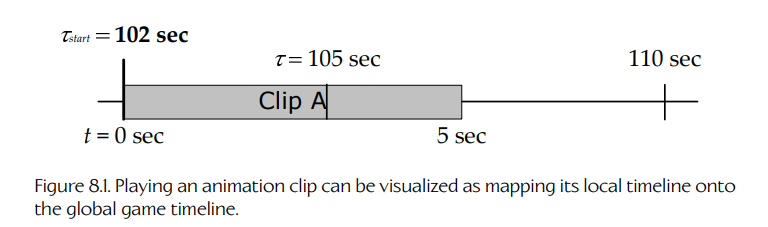
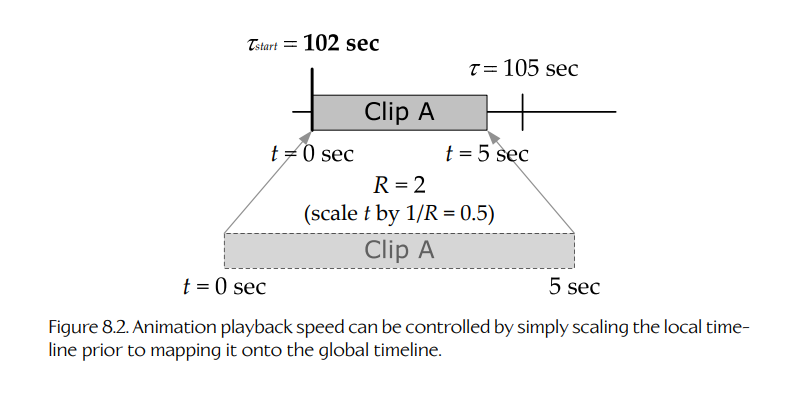
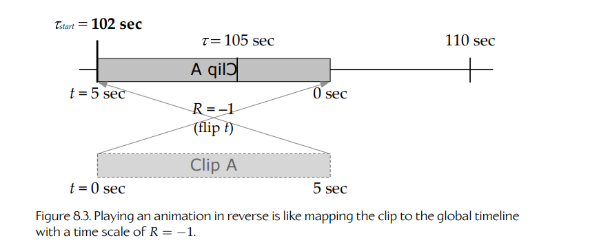

## 8.4 抽象时间线

在游戏编程中，从**抽象时间线**（abstract timelines）的角度思考可能极其有用。时间线是一条连续的一维轴，它的原点（`t = 0`）可以位于相对于系统中其他时间线的任意位置。一条时间线可以通过一个简单的时钟变量来实现，该变量以整数或浮点格式存储绝对时间值。

### 8.4.1 真实时间

我们可以把直接通过 CPU 高精度计时器寄存器（见 Section 8.5.3）测量得到的时间，视为位于我们称为**真实时间线**（real timeline）的时间线上。这条时间线的原点被定义为与 CPU 上一次通电或重置的时刻重合。它以 CPU 周期数（或其某种倍数）为单位测量时间，尽管这些时间值可以很容易地转换为秒：只需将它们乘以当前 CPU 上高精度计时器的频率即可。

### 8.4.2 游戏时间

我们并不需要把自己限制在只使用真实时间线。为了处理手头的问题，我们可以根据需要定义任意数量的其他时间线。例如，我们可以定义一条**游戏时间线**（game timeline），它在技术上独立于真实时间。正常情况下，游戏时间与真实时间一致。如果我们希望暂停游戏，只需暂时停止更新游戏时间线。如果我们希望游戏进入慢动作状态，就可以让游戏时钟比真实时间时钟更新得更慢。通过相对于另一条时间线缩放和扭曲某条时间线，可以实现各种效果。

暂停或放慢游戏时钟也是一种非常有用的调试工具。为了追踪视觉异常，开发者可以暂停游戏时间来冻结动作。与此同时，只要渲染引擎和调试飞行摄像机由不同的时钟控制（例如真实时间时钟，或单独的摄像机时钟），它们仍然可以继续运行。这样开发者就可以在游戏世界中飞行摄像机，从任意想要的角度检查场景。我们甚至可以支持游戏时钟的单步执行：当游戏处于暂停状态时，每按一次手柄或键盘上的“单步”按钮，就将游戏时钟推进一个目标帧间隔（例如 1/30 秒）。

使用上述方法时，有一点很重要：即使游戏被暂停，游戏循环仍然在运行——只是游戏时钟停止了。通过向暂停的游戏时钟添加 1/30 秒来单步执行游戏，与在主循环中设置断点、然后反复按 F5 键逐次运行循环迭代，并不是同一件事。这两种单步方式都可以用于追踪不同类型的问题。我们只需要记住这些方法之间的差异。

### 8.4.3 局部时间线与全局时间线

我们可以设想各种其他时间线。例如，一段动画片段或音频片段可能拥有一条**局部时间线**（local timeline），其原点（`t = 0`）被定义为与该片段的起点重合。局部时间线衡量的是该片段最初被创作或录制时的时间推进方式。当该片段在游戏中回放时，我们并不一定要以原始速率播放它。我们可能想要加快一段动画，或者放慢一个音频样本。我们甚至可以通过让局部时钟反向运行来倒放动画。

这些效果都可以可视化为局部时间线与某条全局时间线之间的**映射**（mapping），例如真实时间或游戏时间。为了以动画片段最初创作时的速度播放它，我们只需将动画局部时间线的起点（`t = 0`）映射到全局时间线上的目标起始时间（`τ = τ_start`）。Figure 8.1 展示了这一点。

**Figure 8.1.** 播放动画片段可以被可视化为将其局部时间线映射到全局游戏时间线。

为了以半速播放动画片段，我们可以想象在映射到全局时间线之前，先将局部时间线缩放为原来的两倍。要做到这一点，我们只需在片段的全局起始时间 `τ_start` 之外，额外记录一个时间缩放系数或播放速率 `R`。Figure 8.2 展示了这一点。通过使用负的时间缩放系数（`R < 0`），片段甚至可以倒放，如 Figure 8.3 所示。

**Figure 8.2.** 动画播放速度可以通过在映射到全局时间线之前缩放局部时间线来控制。

**Figure 8.3.** 倒放动画相当于以 `R = -1` 的时间缩放系数将片段映射到全局时间线。
