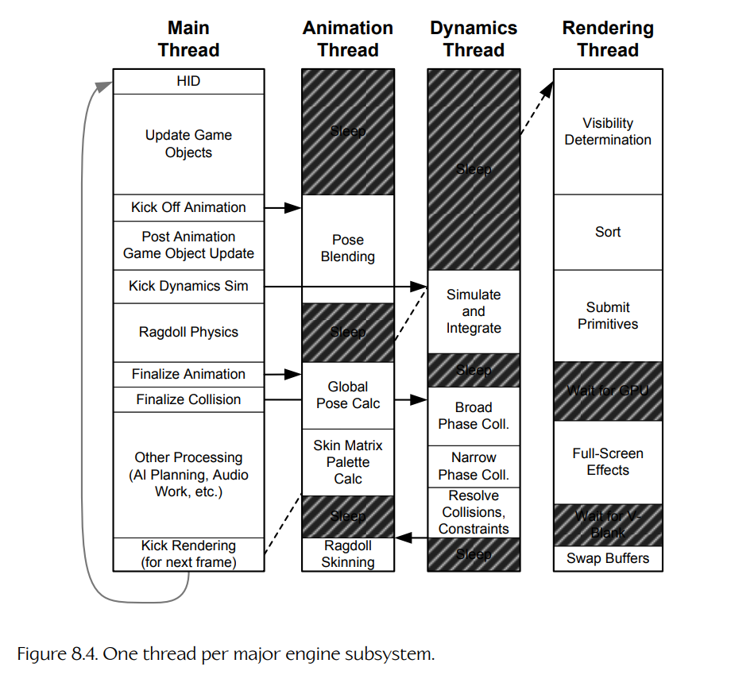
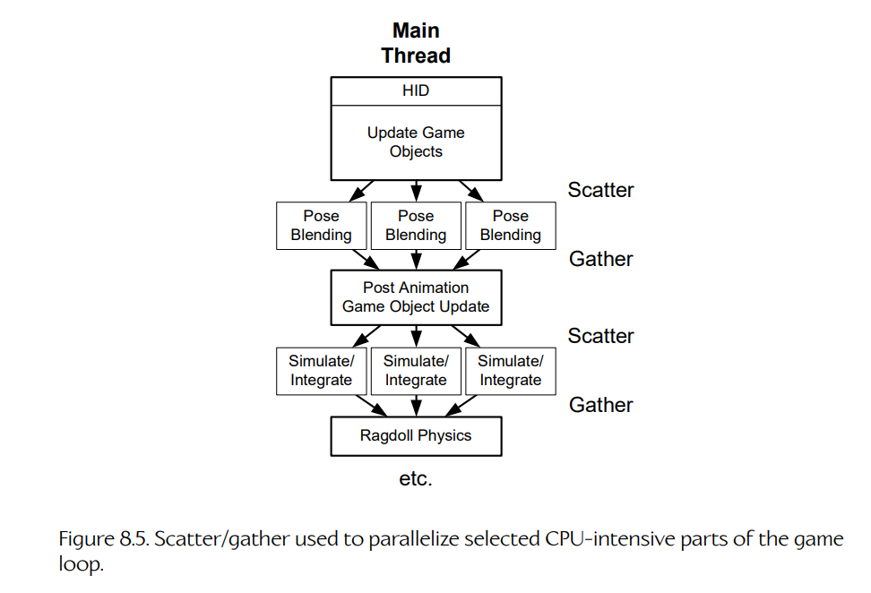
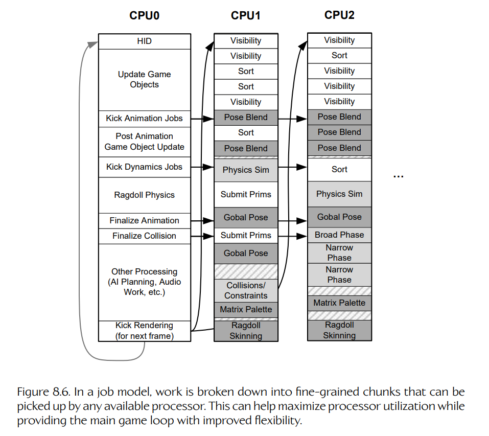
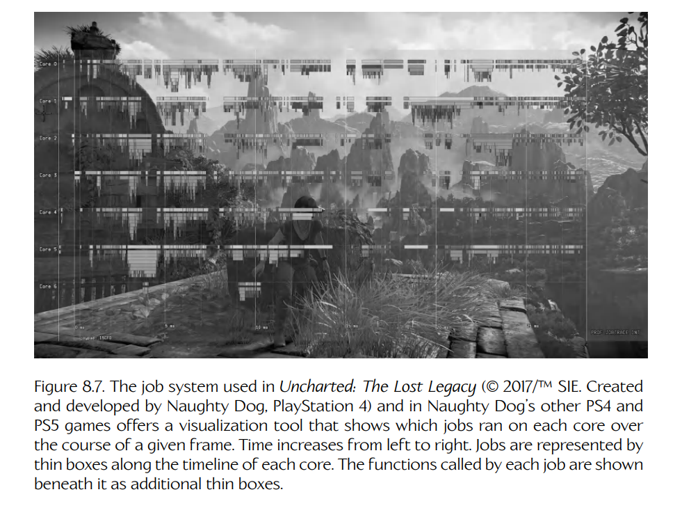

## 8.6 多处理器游戏循环

在 Chapter 4 中，我们探讨了如今已经普遍存在于消费级计算机、移动设备和游戏主机中的并行计算硬件，并学习了如何编写能够利用这些并行计算资源的**并发**软件机制。在本节中，我们将讨论如何将这些知识应用到游戏引擎的**游戏循环**中。

### 8.6.1 任务分解

为了利用并行计算硬件，我们需要将游戏循环每次迭代期间执行的各种任务**分解**（decompose）为多个子任务，每个子任务都可以并行执行。这种分解行为会将我们的软件从**顺序程序**（sequential program）转换为**并发程序**（concurrent program）。

有许多方法可以为了并发而分解软件系统，但正如我们在 Section 4.1.3 中讨论的那样，它们大致可以分为两类：**任务并行**（task parallelism）和**数据并行**（data parallelism）。

任务并行天然适合这样一些情况：有许多**不同的事情**需要完成，而我们选择让它们在多个核心上并行完成。例如，我们可以尝试在游戏循环的每次迭代期间，将动画混合与碰撞检测并行执行；或者，我们可以在向 GPU 提交用于渲染第 `N` 帧的图元的同时，开始更新第 `N + 1` 帧的游戏世界状态。

数据并行最适合这样一些情况：需要对大量数据元素重复执行**同一种**计算。GPU 可能是数据并行的最佳实际例子。GPU 每帧会通过将工作分发到大量并行运行的处理核心上，执行数百万次逐像素和逐顶点计算。然而，正如我们将在接下来的几节中看到的，数据并行并不只存在于 GPU 上；在游戏循环期间由 CPU 执行的许多任务同样可以从数据并行中受益。

在接下来的几节中，我们将考察几种不同方式来细分游戏循环所完成的工作。其中一些方式采用任务并行方法，另一些方式则依赖数据并行。我们将探讨每种方法的优缺点，然后看看通用**作业系统**（job system）如何成为一种有用工具，将几乎任何工作负载转换为能够利用硬件并行性的并发操作。

### 8.6.2 每个子系统一个线程

一种分解游戏循环以实现并发的简单方式，是将特定引擎子系统分配到独立线程中运行。例如，渲染引擎、碰撞与物理模拟、动画流水线以及音频引擎都可以各自分配到自己的线程。一个主线程会控制并同步这些次级子系统线程的操作，同时也继续处理游戏高层逻辑的主要部分（主游戏循环）。在拥有多个物理 CPU 的硬件平台上，这种设计将允许这些线程化引擎子系统彼此并行执行，并与主游戏循环并行执行。这是**任务并行**的一个简单例子，如 Figure 8.4 所示。

**Figure 8.4.** 每个主要引擎子系统一个线程。

这种将每个引擎子系统分配到自己线程中的简单方法存在许多问题。首先，引擎子系统的数量很可能与游戏平台上的核心数量不匹配。因此，线程数量很可能多于核心数量，一些子系统线程将需要通过时间片共享同一个核心。

另一个问题是，每个引擎子系统在每一帧所需的处理量各不相同。这意味着，有些线程（以及对应的 CPU 核心）在每一帧中都被高度利用，而另一些线程可能会在一帧中的很大一部分时间里处于空闲状态。

还有一个问题是，某些引擎子系统会**依赖**其他子系统产生的数据。例如，渲染和音频子系统在动画、碰撞和物理系统完成第 `N` 帧的工作之前，无法开始执行第 `N` 帧的工作。如果两个子系统像这样彼此依赖，我们就无法让它们并行运行。

由于所有这些问题，尝试将每个引擎子系统分配到自己的线程中，实际上并不是一个实用设计。我们可以做得更好。

### 8.6.3 分散/收集

游戏循环单次迭代中执行的许多任务都是数据密集型的。例如，我们可能需要处理大量射线投射请求，混合一大批动画姿势，或者为大型交互场景中的每个对象计算世界空间矩阵。利用并行计算硬件执行这类任务的一种方式，是采用分治方法。与其试图在单个 CPU 核心上逐个处理 13,000 次射线投射，不如将工作划分为例如 13 批，每批 1000 次射线投射，然后在 PS5 或 Xbox Series X/S 上可用的 13 个1硬件线程中，每个线程执行一批。这种方法是一种**数据并行**（data parallelism）形式。

在分布式系统术语中，这称为**分散/收集**（scatter/gather）方法，因为一个工作单元被划分为更小的子单元，并分发到多个处理核心上执行（scatter），然后在所有工作负载完成后，以适当方式合并或最终处理结果（gather）。

> **脚注 1**：PS5 和 Xbox Series X/S 都包含 8 个核心，每个核心都可以运行两个超线程。不过，这些机器上的第 8 个核心完全不可用。这样做是为了应对 CPU 制造过程中不可避免会产生一些有缺陷核心这一事实。因此，它们留下了 7 个可用核心，即 14 个硬件线程，其中一个保留给操作系统使用。

#### 8.6.3.1 游戏循环中的分散/收集

在游戏循环的上下文中，一次游戏循环迭代期间，可以由“主”游戏循环线程在不同时间执行一个或多个分散/收集操作。Figure 8.5 展示了这种架构。

给定一个包含 `N` 个需要处理的数据项的数据集，主线程会将工作划分为 `m` 批，每批大约包含 `N / m` 个元素。（`m` 的值通常会根据系统中可用核心数量来确定，不过如果我们希望留出一些核心用于其他工作，这也未必一定如此。）然后，主线程会生成 `m` 个工作线程，并为每个线程提供起始索引和数量，使其能够处理被分配的数据子集。每个工作线程可能会原地更新数据项；或者（通常更好）将输出数据写入单独的预分配缓冲区（每个工作线程一个）。

**Figure 8.5.** 使用分散/收集来并行化游戏循环中选定的 CPU 密集型部分。

成功分散工作负载后，主线程就可以在等待工作线程完成任务的同时，自由执行其他有用工作。

在该帧稍后的某个时刻，主线程会通过等待所有工作线程终止来收集结果，也许使用类似 `pthread_join()` 的函数。如果所有工作线程都已经退出，该函数会立即返回；但如果任何工作线程仍在运行，这个调用会使主线程进入休眠状态。

一旦收集步骤完成，主线程就可以以任何合适方式合并结果。例如，在完成动画混合之后，下一步可能是计算蒙皮矩阵；这一步只有在所有动画混合线程都完成工作后才会启动。我们在 Section 4.4.6 讨论线程创建和 join 时，展示过一个非常类似的例子。

#### 8.6.3.2 用于分散/收集的 SIMD

在 Section 4.10 中，我们探讨了**循环向量化**（loop vectorization），也就是利用 SIMD 并行性来提升数据密集型工作性能的一种方式。这实际上只是分散/收集方法的另一种形式，只是粒度非常细。SIMD 可以替代基于线程的分散/收集，但它更可能与后者结合使用（即每个工作线程在内部利用向量化来执行自己的工作）。

#### 8.6.3.3 让分散/收集更高效

分散/收集方法是一种直观方式，可以将数据密集型工作分布到多个核心上。然而，如上所述，这种并行化方法存在一个大问题：生成线程的成本很高。生成线程涉及一次内核调用，将主线程与工作线程 join 起来也是如此。每当线程来来去去时，内核本身都会进行大量设置和拆卸工作。因此，每次想执行分散/收集时都生成一堆线程是不实际的。

我们可以通过使用一组预先生成的线程池来缓解线程生成成本。一些操作系统（例如 Windows）提供了用于创建和管理线程池的 API。（例如见 `https://learn.microsoft.com/en-us/windows/win32/procthread/thread-pools`。）如果没有这种 API，也总是可以自己实现一个简单线程池，使用**条件变量**（condition variables）、**信号量**（semaphores）、原子布尔变量或其他机制来同步线程活动。

我们希望线程池能够在每一帧中执行各种各样的分散/收集操作。这意味着，我们不能再简单地为每个分散/收集生成一堆线程，并让每个线程的入口函数只执行某个特定计算。相反，线程池中的每个线程都必须能够执行我们在游戏循环任意迭代期间可能想执行的任意分散/收集操作。我们可以想象使用一个巨大的 `switch` 语句来实现这一点，但这个想法听起来笨拙、丑陋且难以维护。实际上，我们真正想要的是一个通用系统，用于在目标硬件上可用的核心之间并发执行工作单元。

### 8.6.4 作业系统

**作业系统**（job system）是一个通用系统，用于在多个核心上执行任意工作单元，这些工作单元通常称为**作业**（jobs）。有了作业系统，程序员可以将游戏循环的每次迭代划分为数量相对较多的独立作业，并将这些作业提交给作业系统执行。作业系统会维护一个已提交作业队列，并将这些作业调度到可用核心上；可以通过将它们提交给线程池中的工作线程执行，也可以通过其他方式执行。从某种意义上说，作业系统就像一个自定义的轻量级操作系统内核，只不过它调度的不是线程在可用核心上运行，而是调度作业。

作业可以被任意细粒度地划分，而在真实游戏引擎中，许多作业彼此独立。正如 Figure 8.6 所示，这些事实有助于最大化处理器利用率。这种架构还可以自然扩展到拥有任意数量 CPU 核心的硬件。

**Figure 8.6.** 在作业模型中，工作被分解为细粒度块，可由任何可用处理器拾取。这有助于最大化处理器利用率，同时为主游戏循环提供更高灵活性。

#### 8.6.4.1 典型作业系统接口

典型作业系统会提供一个简单易用的 API，看起来与线程库 API 非常相似。它会有一个用于生成作业的函数（相当于 `pthread_create()`，通常称为**启动作业**（kicking a job）），一个允许某个作业等待一个或多个其他作业终止的函数（相当于 `pthread_join()`），也可能有某种方式允许作业“提前”自我终止（在从入口点函数返回之前）。作业系统还必须提供某种自旋锁或互斥锁，用于以**原子**（atomic）方式执行关键并发操作。它也可能提供通过条件变量或类似机制让作业睡眠并唤醒它们的设施。

为了启动一个作业，我们需要告诉作业系统要执行**什么**作业，以及**如何**执行它。通常，这些信息会通过一个小型数据结构传递给 `KickJob()` 函数；这里我们称其为**作业声明**（job declaration）。

作业声明至少必须包含一个指向作业入口点函数的指针。能够向作业入口点函数传递任意输入参数也很重要。这可以通过各种方式完成，但最简单的方法是提供一个类型为 `uintptr_t` 的单个参数，在作业实际运行时将其传递给入口点函数。这让我们能够毫不麻烦地向作业传递简单信息，例如单个布尔值或整数；不过，由于指针可以安全地转换为 `uintptr_t`，因此也可以使用这个作业参数向任意数据结构传递指针，而该数据结构本身包含作业可能需要的任何输入参数。

作业系统还可以提供一种优先级机制，很像大多数线程库那样。在这种情况下，优先级也可以包含在作业声明中。

下面是一个简单作业声明以及简单作业系统 API 的例子：

    namespace job
    {
        // 所有作业入口点的签名
        typedef void EntryPoint(uintptr_t param);

        // 允许的优先级
        enum class Priority
        {
            LOW, NORMAL, HIGH, CRITICAL
        };

        // 计数器（实现未展示）
        struct Counter ... ;
        Counter* AllocCounter();
        void FreeCounter(Counter* pCounter);

        // 简单作业声明
        struct Declaration
        {
            EntryPoint*     m_pEntryPoint;
            uintptr_t       m_param;
            Priority        m_priority;
            Counter*        m_pCounter;
        };

        // 启动作业
        void KickJob(const Declaration& decl);
        void KickJobs(int count, const Declaration aDecl[]);

        // 等待作业终止（等待其计数器变为零）
        void WaitForCounter(Counter* pCounter);

        // 启动作业并等待完成
        void KickJobAndWait(const Declaration& decl);
        void KickJobsAndWait(int count, const Declaration aDecl[]);
    }

你会注意到，这里有一个名为 `job::Counter` 的不透明类型。计数器允许某个作业进入睡眠状态，并等待一个或多个其他作业执行完成。我们将在 Section 8.6.4.6 中讨论作业计数器。

#### 8.6.4.2 基于线程池的简单作业系统

正如前面暗示的那样，可以围绕一组工作线程池来构建作业系统。一个好做法是为目标机器中存在的每个 CPU 生成一个线程，并使用亲和性将每个线程锁定到一个核心。每个工作线程都处于无限循环中，处理其他线程（和/或其他作业）提供给它的作业请求。在这个无限循环顶部，工作线程会进入睡眠状态（可能通过条件变量），等待作业请求变为可用。当收到请求时，工作线程被唤醒，调用作业的入口点函数，并将作业声明中的输入参数传递给该函数。当入口点函数返回时，这表示工作已经完成，因此工作线程会回到无限循环顶部，以执行更多作业。如果没有可用作业，它就会重新睡眠，等待另一个作业请求到来。

下面是一个作业工作线程底层可能是什么样子的例子。请记住，这不是一个完整实现；它只是用于说明目的。

    namespace job
    {
        void* JobWorkerThread(void*)
        {
            // 永远持续运行作业……
            while (true)
            {
                Declaration declCopy;

                // 等待一个作业变为可用
                pthread_mutex_lock(&g_mutex);
                while (!g_ready)
                {
                    pthread_cond_wait(&g_jobCv, &g_mutex);
                }

                // 将 JobDeclaration 复制到本地，
                // 并释放互斥锁。
                declCopy = GetNextJobFromQueue();
                pthread_mutex_unlock(&g_mutex);

                // 运行作业
                declCopy.m_pEntryPoint(declCopy.m_param);

                // 作业完成！然后重复……
            }
        }
    }

#### 8.6.4.3 基于线程的作业的一个限制

假设我们要编写一个作业，用于更新由 AI 驱动的非玩家角色（NPC）的状态。作业入口点函数可能如下所示：

    void NpcThinkJob(uintparam_t param)
    {
        Npc* pNpc = reinterpret_cast<Npc*>(param);

        pNpc->StartThinking();
        pNpc->DoSomeMoreUpdating();
        // ...

        // 现在发射一条射线，看看我们是否瞄准了
        // 什么有趣的东西——这涉及启动另一个作业，
        // 它将在另一个核心（工作线程）上运行。
        RayCastHandle hRayCast = CastGunAimRay(pNpc);

        // 这次射线投射的结果要到本帧稍后才会准备好，
        // 所以先睡眠，直到结果可用。
        WaitForRayCast(hRayCast);

        // zzz...

        // 醒来！

        // 现在开火，但只有当射线投射表明
        // 我们瞄准的是敌人时才开火。
        pNpc->TryFireWeaponAtTarget(hRayCast);

        // ...
    }

这个作业看起来足够简单：它执行一些更新，启动一个射线投射作业（在另一个工作线程/核心上运行），用于确定 NPC 正在用枪瞄准什么对象。然后 NPC 开火，但只有当射线投射报告其瞄准范围内有敌人时才开火。

不幸的是，如果我们尝试在上一节所描述的简单作业系统中运行这类作业，它并不能正常工作。问题出在对 `WaitForRayCast()` 的调用上。在我们的简单线程池式作业系统中，每个作业一旦开始运行，就必须一直运行到完成。它不能在等待射线投射结果时“进入睡眠”，让其他作业在该工作线程上运行，然后在射线投射结果准备好之后再“醒来”。

这个限制产生的原因是：在我们的简单系统中，每个正在运行的作业都与调用它的工作线程共享同一个调用栈。要让一个作业进入睡眠，我们实际上需要**上下文切换**（context switch）到另一个作业。这将涉及保存即将切出的作业的调用栈和寄存器，然后用即将切入的作业调用栈覆盖工作线程的调用栈。使用如此简单的作业执行方法时，并没有简单方式来做到这一点。

#### 8.6.4.4 将作业作为协程

克服这个问题的一种方式，是从基于线程池的作业系统改为基于**协程**（coroutines）的作业系统。回忆 Section 4.4.8 中的内容，协程拥有普通线程所不具备的一个重要特性：它能够在执行到一半时**让出**（yield）控制权给另一个协程，并在稍后另一个协程把控制权让回给它时，从自己离开的地方继续执行。协程之所以能够这样相互让出控制权，是因为其实现实际上会在线程内部交换切出协程和切入协程的调用栈。因此，与纯粹基于线程的作业不同，基于协程的作业可以有效地“进入睡眠”，并在等待射线投射这类操作完成时允许其他作业运行。

#### 8.6.4.5 将作业作为纤程

另一种允许作业进入睡眠并相互让出控制权的方式，是使用**纤程**（fibers）而不是线程来实现它们。在 Section 4.4.7 中我们了解到，纤程与线程之间的关键区别在于：纤程之间的上下文切换永远是**协作式**（cooperative）的，而不是**抢占式**（preemptive）的。基于纤程的系统首先会将自己的某个线程转换为纤程。该线程会继续运行这个纤程，直到它显式调用 `SwitchToFiber()`，将控制权显式让给另一个纤程。和协程一样，每当上下文切换到另一个纤程时，整个纤程调用栈都会被保存。纤程甚至可以从一个线程迁移到另一个线程。这使得纤程非常适合用于实现作业系统。Naughty Dog 的作业系统就是基于纤程的。

#### 8.6.4.6 作业计数器

如果我们使用协程或纤程来实现作业系统，就具备了让作业进入睡眠（保存其执行上下文）并在未来某个时刻将其唤醒（恢复其执行上下文）的能力。这进而允许我们为作业系统实现一个 **join** 函数：该函数会让调用作业进入睡眠，等待一个或多个其他作业执行完成。这样的函数大致等价于 POSIX 线程库中的 `pthread_join()`，或者 Windows 下的 `WaitForSingleObject()`。

一种实现方式是为每个作业关联一个**句柄**（handle），就像大多数线程库中线程拥有句柄一样。等待某个作业就相当于调用某种 `job::Join()` 函数，并传入希望等待的作业句柄。

基于句柄的方法的一个缺点是，它无法很好地扩展到等待大量作业的情况。此外，为了等待单个作业完成，我们需要周期性轮询，检查系统中所有作业的状态。这种轮询会浪费宝贵的 CPU 周期。由于这些原因，上面给出的作业系统 API 引入了**计数器**（counter）的概念。它有点像一个信号量，只不过是反过来的。每当一个作业被启动时，它可以选择性地关联到一个计数器（通过 `job::Declaration` 提供）。启动该作业的动作会递增计数器，而当作业终止时，计数器会递减。因此，等待一批作业只需要用同一个计数器将它们全部启动，然后等待该计数器归零即可（这表明所有作业都已经完成工作）。等待计数器归零比轮询单个作业高效得多，因为检查可以在计数器递减的时刻完成。因此，基于计数器的系统可以带来性能收益。Naughty Dog 的作业系统就使用了这样的计数器。

#### 8.6.4.7 作业同步原语

任何并发程序都需要一种执行**原子操作**（atomic operations）的机制，作业系统也不例外。正如线程库会提供一组**线程同步原语**（thread synchronization primitives），例如互斥锁、条件变量和信号量，作业系统也必须提供一组**作业同步原语**（job synchronization primitives）。

作业同步原语的具体实现会随作业系统实际实现方式而有所不同。但它们通常并不只是对内核线程同步原语的简单包装。要理解原因，可以考虑 OS 互斥锁的行为：当一个线程试图获取某个已经被另一个线程持有的锁时，OS 互斥锁会让这个线程进入睡眠。如果我们把作业系统实现为线程池，那么在作业内部等待互斥锁会让**整个工作线程**进入睡眠，而不仅仅是那个想等待锁的作业。显然，这会造成严重问题，因为在该线程被唤醒之前，没有任何作业能够在该线程对应的核心上运行。这样的系统很可能充满死锁问题。

为了克服这个问题，作业可以使用**自旋锁**（spin locks）而不是 OS 互斥锁。只要线程之间不存在大量锁竞争，这种方法就能很好地工作，因为在这种情况下，不会有作业为了尝试获得锁而对每个锁进行忙等。Naughty Dog 的作业系统在大多数加锁需求中都使用自旋锁。

不过，有时一个作业可能会遇到高竞争情况。设计良好的作业系统可以通过自定义“互斥锁”机制来处理这种情况：当作业等待资源可用时，该机制可以让作业进入睡眠。这样的互斥锁可能在无法获得锁时先进行忙等。如果经过一个短暂超时后锁仍不可用，该互斥锁就可以把协程或纤程让出给另一个等待中的作业，从而让当前等待作业进入睡眠。正如内核会跟踪所有因等待互斥锁而睡眠的线程一样，我们的作业系统也需要跟踪所有睡眠中的作业，以便在它们的互斥锁释放时将它们唤醒。

#### 8.6.4.8 作业可视化与分析工具

一旦开始使用作业系统，正在运行的作业及其依赖关系图很快就会变得庞大而复杂。为任何作业系统提供可视化和性能分析工具，都是一个好主意。

例如，Naughty Dog 的作业系统提供了一个类似 Figure 8.7 所示的可视化视图。在这个显示中，你可以看到七个核心（再加上 GPU）沿左侧边缘纵向列出。时间从左向右推进，每个逻辑帧都由垂直标记分隔。沿着每个核心的时间线，细长方块表示给定帧中运行的各种作业。在每个作业下方，还有额外的细矩形行——这些表示该作业的调用栈（它调用了哪些函数，以及每个函数运行耗时多久）。

作业会根据其功能进行颜色编码，因此用户可以快速定位某个特定作业。例如，假设我们正在寻找一个耗时特别长的射线投射。如果射线投射作业被标成红色，我们就可以在显示中直观扫描所有宽度超出预期的红色作业。点击某个作业会使所有非同类型作业都以灰色绘制，从而便于查看所选作业类型的所有作业。此外，当点击一个作业时，细线会将它连接到它所启动的作业，以及启动它的那个作业。将鼠标悬停在某个作业上，或悬停在它下方调用栈中的某个函数上，会弹出一些文本，显示该作业或函数的名称，以及它的执行时间（毫秒）。

**Figure 8.7.** *Uncharted: The Lost Legacy* 中使用的作业系统（© 2017/TM SIE，由 Naughty Dog 开发，PlayStation 4），以及 Naughty Dog 其他 PS4 和 PS5 游戏中的作业系统，都提供了一个可视化工具，用于显示给定帧期间哪些作业运行在哪个核心上。时间从左向右递增。作业由每个核心时间线上的细框表示。每个作业调用的函数则以额外细框显示在其下方。

另一个非常有用的作业系统功能，是我称为**性能陷阱**（profile trap）的东西。假设游戏某个区域大多数时候都能以 30 FPS 正常运行，但偶尔会掉到 24 FPS。我们可以为任何耗时超过例如 35 ms 的帧设置一个陷阱。然后正常游玩游戏。一旦检测到某一帧耗时超过 35 ms，陷阱系统会自动暂停游戏，并将性能分析显示呈现在屏幕上。随后就可以分析该帧中运行的作业，找出导致慢帧的罪魁祸首。

#### 8.6.4.9 Naughty Dog 作业系统

Naughty Dog 在 *The Last of Us: Remastered*、*Uncharted 4: A Thief’s End* 和 *Uncharted: The Lost Legacy* 中使用的作业系统，大体遵循了我们到目前为止讨论过的假想作业系统设计。它基于纤程（而不是线程池或协程）。它使用自旋锁，同时也提供一种特殊的作业互斥锁，能够在作业等待锁时让其进入睡眠。它使用计数器而不是作业句柄来实现 join 操作。

下面我们来看一下 Naughty Dog 引擎中基于纤程的作业系统是如何工作的。当系统首次启动时，主线程会将自身转换为纤程，以便在整个进程中启用纤程。接着，生成作业工作线程；在 PS5 上，开发者可用的七个核心各对应一个工作线程。这些线程会通过 CPU 亲和性设置各自锁定到一个核心上，因此我们可以把这些工作线程及其核心粗略地视为同义概念（尽管在现实中，其他更高优先级的线程有时也会在一帧中非常短暂地中断工作线程）。在 PS5 上创建纤程很慢，因此系统会预先生成一个纤程池，同时预先分配内存块，用作每个纤程的调用栈。

当作业被启动时，它们的声明会被放入一个队列。随着核心/工作线程变为空闲（也就是作业终止时），新的作业会从该队列中取出并执行。正在运行的作业也可以向作业队列中添加更多作业。

为了执行一个作业，系统会从纤程池中取出一个未使用的纤程，然后工作线程执行 `SwitchToFiber()`，开始运行该作业。当作业从入口点函数返回，或以其他方式自我终止时，作业的最后一个动作是执行 `SwitchToFiber()`，切回作业系统本身。随后系统从队列中选择另一个作业，这个过程会无限重复。

当一个作业等待某个计数器时，该作业会进入睡眠，并且它的纤程（执行上下文）会与它正在等待的计数器一起被放入等待列表。当这个计数器归零时，该作业会被唤醒，使它能够从离开的地方继续执行。作业的睡眠和唤醒同样通过在作业纤程与每个核心/工作线程上的作业系统管理纤程之间调用 `SwitchToFiber()` 来实现。

关于 Naughty Dog 作业系统如何构建，以及为什么以这种方式构建的深入优秀讨论，可以观看 Christian Gyrling 在 GDC 2015 的精彩演讲 “Parallelizing the Naughty Dog Engine”，该演讲见 [221]。Christian 的幻灯片见 [222]。
