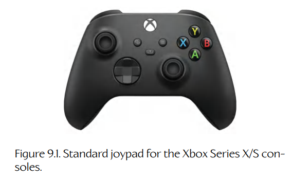
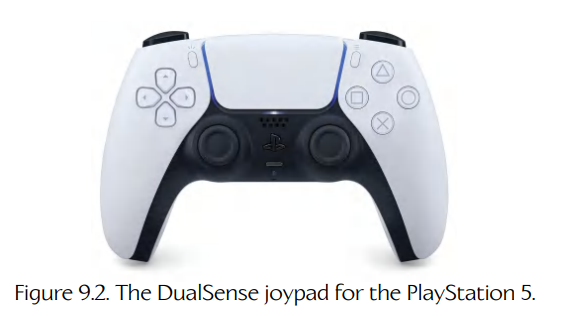
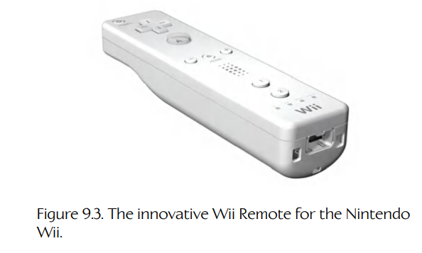
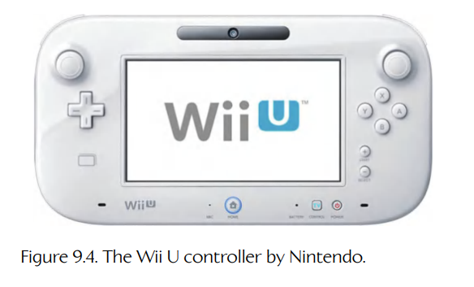
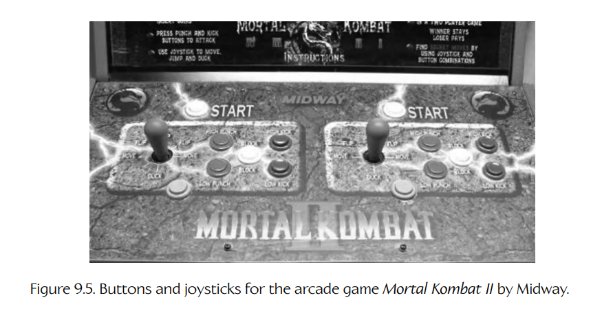
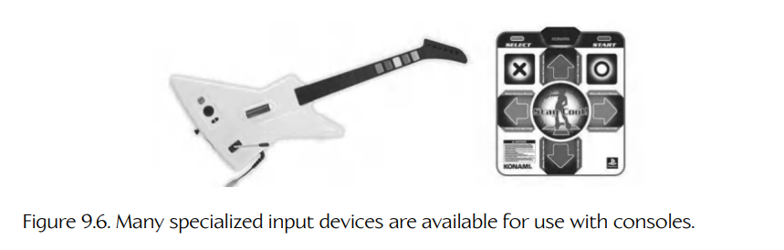
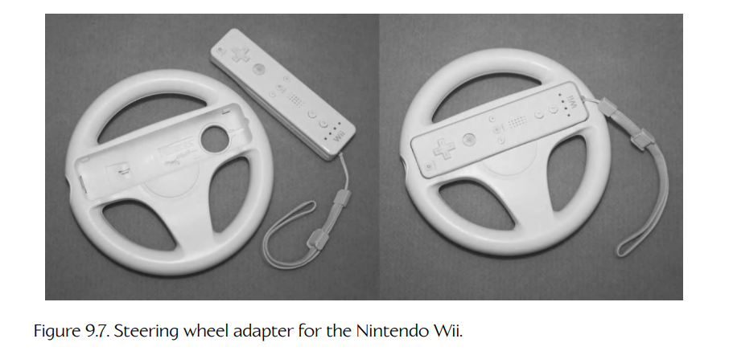

# 9.1 人机接口设备的类型

可用于游戏的人机接口设备种类非常广泛。Xbox Series X/S 和 PS5 这样的主机配备了手柄控制器，如 Figure 9.1 和 Figure 9.2 所示。任天堂的 Wii 主机则以其独特且创新的 Wii Remote 控制器而闻名（通常称为 “Wiimote”），如 Figure 9.3 所示。到了 Wii U，任天堂又创造了一种介于控制器和半移动游戏设备之间的创新混合体（Figure 9.4）。PC 游戏通常要么通过键盘和鼠标控制，要么通过手柄控制。（Microsoft 设计 Xbox 手柄时，使其既能用于 Xbox，也能用于 Windows/DirectX PC 平台。）如 Figure 9.5 所示，街机通常拥有一个或多个内置控制器，例如摇杆和各种按钮，或者轨迹球、方向盘等。街机的输入设备通常会根据对应游戏进行一定程度的定制，不过同一制造商生产的街机之间也经常会复用输入硬件。

**Figure 9.1.** Xbox Series X/S 主机的标准手柄。

**Figure 9.2.** PlayStation 5 的 DualSense 手柄。

**Figure 9.3.** 任天堂 Wii 的创新性 Wii Remote 控制器。

**Figure 9.4.** 任天堂 Wii U 控制器。

在主机平台上，除了“标准”输入设备（例如手柄）之外，通常还可以使用专用输入设备和适配器。例如，*Guitar Hero* 系列游戏可使用吉他和鼓类设备，驾驶游戏可购买方向盘，而 *Dance Dance Revolution* 这类游戏则使用专用跳舞毯设备。其中一些设备如 Figure 9.6 所示。

任天堂 Wiimote 可能是主机游戏史上最灵活的输入设备之一。它经常被适配到新的用途，而不是被完全不同的新设备取代。例如，*Mario Kart Wii* 配有一个塑料方向盘适配器，Wiimote 可以插入其中使用（见 Figure 9.7）。

**Figure 9.5.** Midway 街机游戏 *Mortal Kombat II* 的按钮和摇杆。

**Figure 9.6.** 许多专用输入设备都可用于主机。

**Figure 9.7.** 任天堂 Wii 的方向盘适配器。