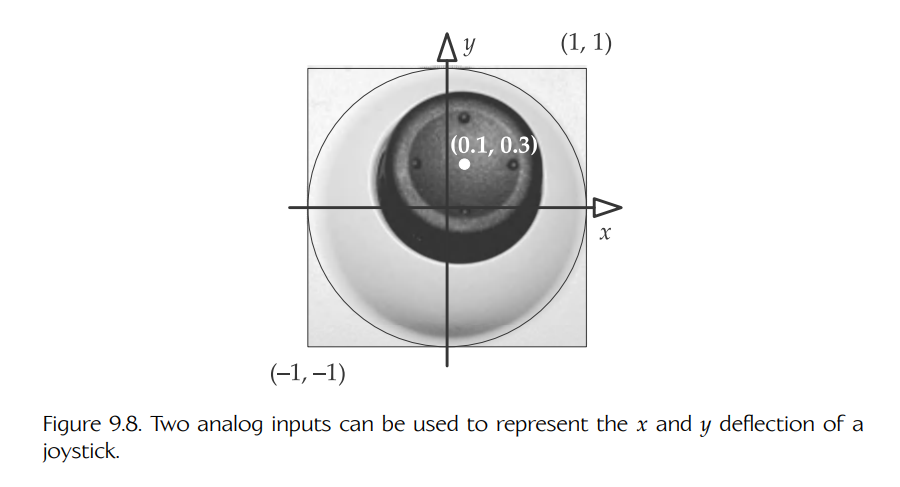
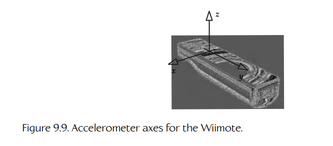
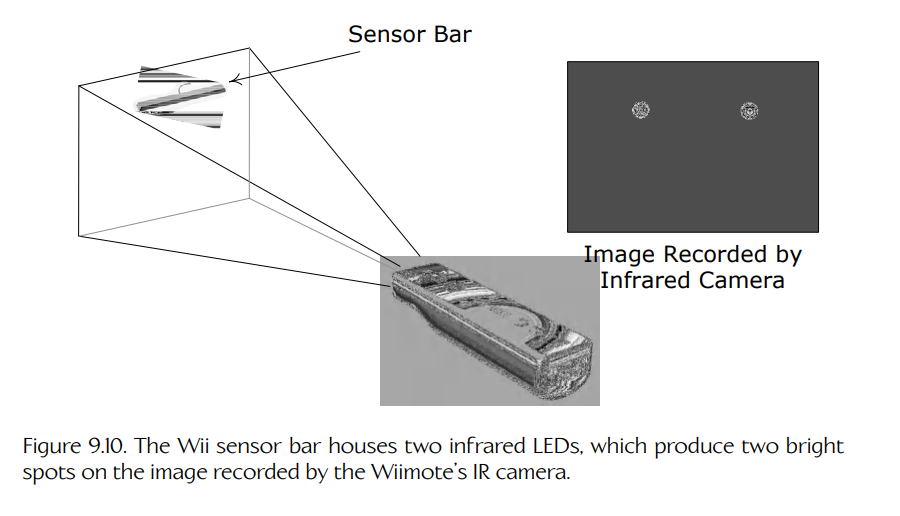
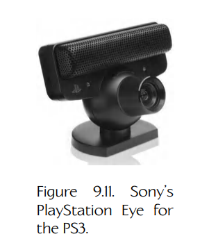
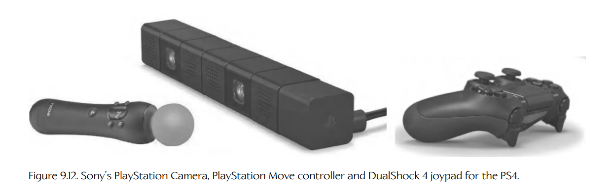
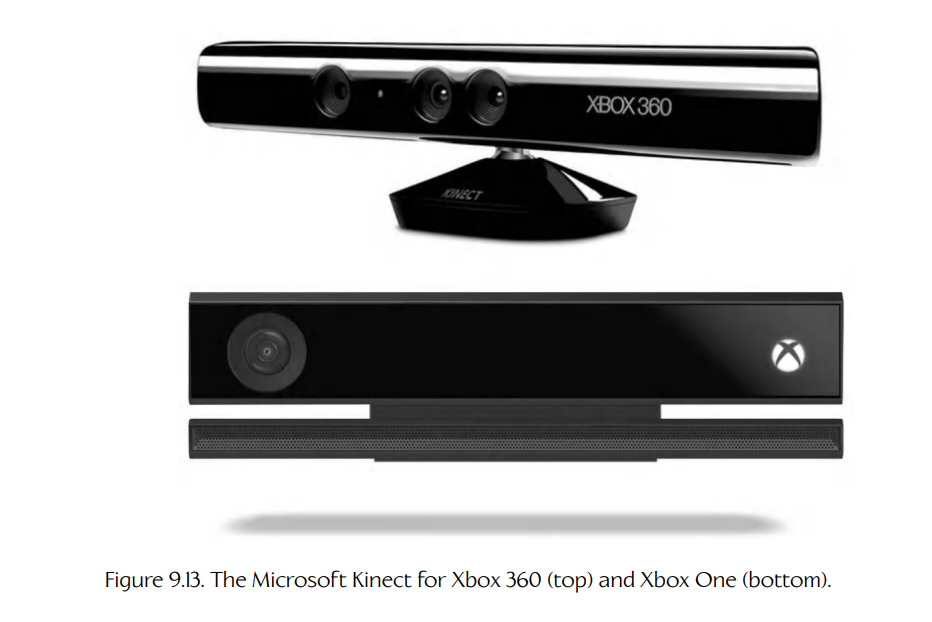

## 9.3 输入类型

尽管游戏用人机接口设备在外形规格和布局上差异很大，但它们提供的大多数输入都可以归入少数几类。下面我们将深入研究每一种类别。

### 9.3.1 数字按钮

几乎每一种 HID 至少都有几个**数字按钮**（digital buttons）。这些按钮只能处于两种状态之一：**按下**（pressed）和**未按下**（not pressed）。游戏程序员通常把按下的按钮称为 **down**，把未按下的按钮称为 **up**。

电气工程师会把包含开关的电路称为**闭合**（closed，表示电流正在流过电路）或**断开**（open，没有电流流过——电路具有无限大的**电阻**）。闭合到底对应按下还是未按下，取决于硬件。如果开关是**常开**（normally open）的，那么当它未被按下（up）时，电路是断开的；当它被按下（down）时，电路是闭合的。如果开关是**常闭**（normally closed）的，则情况正好相反——按下按钮会打开电路。

在软件中，数字按钮的状态（按下或未按下）通常用单个位表示。常见做法是用 0 表示未按下（up），用 1 表示按下（down）。但同样，根据电路性质以及编写设备驱动程序的程序员所做的决定，这些值的含义也可能反过来。

设备上所有按钮的状态通常会被打包进一个无符号整数值中。例如，在 Microsoft 的 XInput API 中，Xbox 手柄的状态会通过一个名为 `XINPUT_GAMEPAD` 的结构体返回，如下所示。

    typedef struct _XINPUT_GAMEPAD
    {
        WORD  wButtons;
        BYTE  bLeftTrigger;
        BYTE  bRightTrigger;
        SHORT sThumbLX;
        SHORT sThumbLY;
        SHORT sThumbRX;
        SHORT sThumbRY;
    } XINPUT_GAMEPAD;

这个结构体包含一个名为 `wButtons` 的 16 位无符号整数（`WORD`）变量，用于保存所有按钮的状态。下面的掩码定义了该 word 中每一位对应哪个物理按钮。（注意，第 10 位和第 11 位未使用。）

    #define XINPUT_GAMEPAD_DPAD_UP          0x0001 // bit 0
    #define XINPUT_GAMEPAD_DPAD_DOWN        0x0002 // bit 1
    #define XINPUT_GAMEPAD_DPAD_LEFT        0x0004 // bit 2
    #define XINPUT_GAMEPAD_DPAD_RIGHT       0x0008 // bit 3
    #define XINPUT_GAMEPAD_START            0x0010 // bit 4
    #define XINPUT_GAMEPAD_BACK             0x0020 // bit 5
    #define XINPUT_GAMEPAD_LEFT_THUMB       0x0040 // bit 6
    #define XINPUT_GAMEPAD_RIGHT_THUMB      0x0080 // bit 7
    #define XINPUT_GAMEPAD_LEFT_SHOULDER    0x0100 // bit 8
    #define XINPUT_GAMEPAD_RIGHT_SHOULDER   0x0200 // bit 9
    #define XINPUT_GAMEPAD_A                0x1000 // bit 12
    #define XINPUT_GAMEPAD_B                0x2000 // bit 13
    #define XINPUT_GAMEPAD_X                0x4000 // bit 14
    #define XINPUT_GAMEPAD_Y                0x8000 // bit 15

可以通过 C/C++ 的按位与运算符（`&`），使用相应的位掩码对 `wButtons` 这个 word 进行遮罩，然后检查结果是否非零，从而读取单个按钮的状态。例如，要判断 A 键是否被按下（down），可以这样写：

    bool IsButtonADown(const XINPUT_GAMEPAD& pad)
    {
        // 屏蔽除第 12 位（A 按钮）之外的所有位。
        return ((pad.wButtons & XINPUT_GAMEPAD_A) != 0);
    }

### 9.3.2 模拟轴与模拟按钮

**模拟输入**（analog input）是指可以取一系列数值的输入，而不只是 0 或 1。这类输入常用于表示扳机被按下的程度，或摇杆的二维位置（它用两个模拟输入表示，一个用于 x 轴，一个用于 y 轴，如 Figure 9.8 所示）。由于这种常见用法，模拟输入有时也称为**模拟轴**（analog axes），或简称为**轴**（axes）。

在某些设备上，某些按钮也是模拟的，这意味着游戏实际上可以检测玩家按压它们的力度。然而，模拟按钮产生的信号通常噪声太大，不一定特别实用。能够有效使用模拟按钮输入的游戏并不多。一个很好的例子是 PS2 上的 *Metal Gear Solid 2*。它在瞄准模式中使用压敏（模拟）按钮数据，区分快速松开 X 键（发射武器）和缓慢松开 X 键（取消射击）——这在潜行游戏中很有用，因为除非必须开火，否则你并不想惊动敌人！

**Figure 9.8.** 两个模拟输入可以用来表示摇杆在 x 和 y 方向上的偏转。

严格来说，模拟输入在进入游戏引擎时已经不再是真正的模拟量。模拟输入信号通常会被**数字化**（digitized），也就是说，它会被量化，并在软件中用整数表示。例如，如果用 16 位有符号整数表示，一个模拟输入的范围可能是 -32,768 到 32,767。有时模拟输入会被转换为浮点数——例如，取值范围可能是 -1 到 1。但正如我们在 Section 3.3.1.3 中所知，浮点数本质上也只是经过量化的数字值。

回顾 `XINPUT_GAMEPAD` 的定义（下面再次列出），可以看到 Microsoft 选择用 16 位有符号整数表示 Xbox 手柄左右拇指摇杆的偏转量（左摇杆使用 `sThumbLX` 和 `sThumbLY`，右摇杆使用 `sThumbRX` 和 `sThumbRY`）。因此，这些值的范围从 -32,768（向左或向下）到 32,767（向右或向上）。然而，为了表示左右肩部扳机的位置，Microsoft 选择使用 8 位无符号整数（分别为 `bLeftTrigger` 和 `bRightTrigger`）。这些输入值的范围从 0（未按下）到 255（完全按下）。不同游戏机对其模拟轴使用不同的数字表示方式。

    typedef struct _XINPUT_GAMEPAD
    {
        WORD  wButtons;

        // 8-bit unsigned
        BYTE  bLeftTrigger;
        BYTE  bRightTrigger;

        // 16-bit signed
        SHORT sThumbLX;
        SHORT sThumbLY;
        SHORT sThumbRX;
        SHORT sThumbRY;
    } XINPUT_GAMEPAD;

### 9.3.3 相对轴

模拟按钮、扳机、摇杆或拇指摇杆的位置是**绝对的**（absolute），也就是说，对于零点在哪里有明确理解。然而，有些设备的输入是**相对的**（relative）。对于这类设备，并不存在一个明确位置可以作为输入值的零点。相反，零输入表示设备的位置没有变化，而非零值则表示相对于上一次读取输入值时的增量。例子包括鼠标、鼠标滚轮和轨迹球。

### 9.3.4 加速度计

PlayStation 的 DualShock 和 DualSense 手柄，以及任天堂 Wiimote，都包含加速度传感器（**加速度计**，accelerometers）。这些设备可以检测沿三个主轴（x、y 和 z）的加速度，如 Figure 9.9 所示。它们是**相对模拟输入**，很像鼠标的二维轴。当控制器没有加速时，这些输入为零；但当控制器正在加速时，它们会测量每个轴上最高 ±3 g 的加速度，并量化为三个有符号 8 位整数，分别对应 x、y 和 z。

**Figure 9.9.** Wiimote 的加速度计轴。

### 9.3.5 使用 Wiimote、DualShock 或 DualSense 获取三维朝向

许多 Wii 和 PlayStation 游戏会使用 Wiimote 或 DualShock/DualSense 手柄中的三个加速度计，来估计玩家手中控制器的朝向。例如，在 *Super Mario Galaxy* 中，Mario 会跳到一个大球上，并用脚让球滚动。在这种模式下控制 Mario 时，Wiimote 会被玩家握住，并让 IR 传感器朝向天花板。向左、向右、向前或向后倾斜 Wiimote，会使球向相应方向加速。

一组三个加速度计可以用来检测 Wiimote 或 DualShock/DualSense 手柄的朝向，这是因为我们在地球表面玩这些游戏，而这里存在由重力导致的恒定向下加速度 1 g（约 9.8 m/s²）。如果控制器完全水平放置，并且 IR 传感器指向电视机，那么垂直（z）加速度应该大约为 -1 g。

如果控制器竖直握持，IR 传感器朝向天花板，那么我们预期 z 传感器上的加速度为 0 g，而 y 传感器上的加速度为 +1 g（因为它现在承受了完整的重力效应）。以 45 度角握持 Wiimote 时，y 和 z 输入上应大致产生 `sin(45°) = cos(45°) = 0.707 g`。一旦我们校准了加速度计输入，找出每个轴上的零点，就可以使用反正弦和反余弦运算轻松计算俯仰、偏航和横滚。

这里有两个注意事项。第一，如果握持 Wiimote 的人没有保持静止，加速度计输入会把这种运动加速度也包含进数值中，从而使我们的计算失效。第二，加速度计的 z 轴已经经过校准以考虑重力，但另外两个轴没有。这意味着，z 轴在检测朝向时可用的精度较低。许多 Wii 游戏会要求用户以非标准朝向握持 Wiimote，例如让按钮朝向玩家胸口，或者让 IR 传感器朝向天花板。这样可以通过让 x 或 y 加速度计轴与重力方向对齐，而不是使用已经过重力校准的 z 轴，来最大化朝向读取的精度。关于这一主题的更多信息，见 [223]。

### 9.3.6 摄像头

Wiimote 拥有一种在其他标准主机 HID 上找不到的独特功能——红外（infrared, IR）传感器。这个传感器本质上是一台低分辨率摄像头，可以记录 Wiimote 指向方向上的二维红外图像。Wii 配有一个“传感器条”（sensor bar），它放置在电视机顶部，内部包含两个红外发光二极管（LED）。在 IR 摄像头记录到的图像中，这些 LED 会显示为黑暗背景上的两个亮点。Wiimote 内部的图像处理软件会分析这幅图像，并分离出两个点的位置和大小。（实际上，它最多可以检测并传输 4 个点的位置和大小。）这些位置和大小信息可以由主机通过蓝牙无线连接读取。

由这两个点构成的线段的位置和朝向，可以用于确定 Wiimote 的俯仰、偏航和横滚（只要它正指向传感器条）。通过观察两点之间的距离，软件还可以判断 Wiimote 离电视机有多近或多远。有些软件还会利用这些点的大小。Figure 9.10 展示了这一点。

**Figure 9.10.** Wii 传感器条内有两个红外 LED，它们会在 Wiimote 的 IR 摄像头记录的图像中形成两个亮点。

另一种流行的摄像头设备是 Sony 为 PS3 推出的 PlayStation Eye，如 Figure 9.11 所示。该设备基本上是一台高质量彩色摄像头，可用于广泛应用。它可以像任何网络摄像头一样用于简单视频会议。理论上，它也可以像 Wiimote 的 IR 摄像头一样，用于位置、朝向和深度感知。游戏社区才刚刚开始挖掘这类高级输入设备的各种可能性。

**Figure 9.11.** Sony 为 PS3 推出的 PlayStation Eye。

到了 PlayStation 4，Sony 改进了 Eye，并将其重新命名为 PlayStation Camera。当它与 PlayStation Move 控制器（见 Figure 9.12）、DualShock 4 控制器或 DualSense 控制器配合使用时，PlayStation 可以以与 Microsoft Kinect 系统基本相同的方式检测手势（Figure 9.13）。Sony 也提供了一款高清摄像头，可与 PlayStation 5 配合使用。

**Figure 9.12.** Sony 为 PS4 推出的 PlayStation Camera、PlayStation Move 控制器和 DualShock 4 手柄。

**Figure 9.13.** Microsoft Kinect：Xbox 360 版本（上）和 Xbox One 版本（下）。
