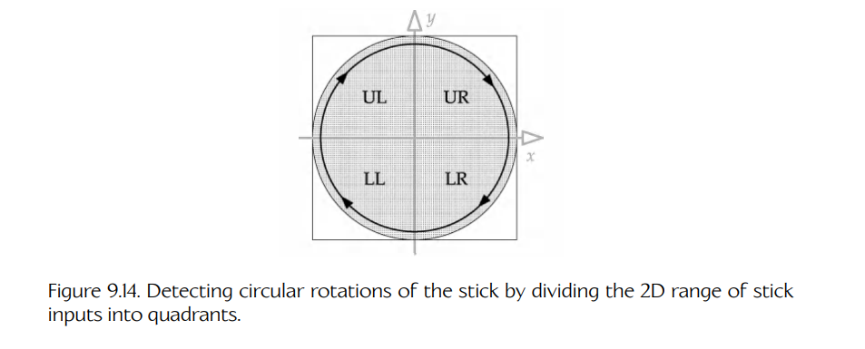

## 9.5 游戏引擎 HID 系统

大多数游戏引擎并不会直接使用“原始”（raw）HID 输入。通常需要以各种方式对这些数据进行处理，以确保来自 HID 的输入能够转化为游戏中平滑、舒适且直观的行为。此外，大多数引擎还会在 HID 与游戏之间引入至少一层额外的间接层，以便以各种方式抽象 HID 输入。例如，可以使用一个按钮映射表，将原始按钮输入转换为逻辑上的游戏动作，这样人类玩家就可以按自己的喜好重新分配按钮功能。在本节中，我们将概述游戏引擎 HID 系统的典型需求，然后逐一深入探讨。

### 9.5.1 典型需求

游戏引擎的 HID 系统通常会提供以下部分或全部功能：

- 死区；
- 模拟信号滤波；
- 事件检测（例如 button up、button down）；
- 按钮序列和多按钮组合（称为 chords）的检测；
- 手势检测；
- 面向多玩家的多 HID 管理；
- 多平台 HID 支持；
- 控制器输入重映射；
- 上下文敏感输入；
- 临时禁用某些输入的能力。

### 9.5.2 死区

摇杆、拇指摇杆、肩部扳机键或任何其他模拟轴都会产生输入值，这些值位于某个预定义的最小值和最大值之间，我们将其称为 $I_{\min}$ 和 $I_{\max}$。当控制器没有被触碰时，我们期望它产生一个稳定而清晰的“未受干扰”值，记为 $I_0$。这个未受干扰值通常在数值上等于 0；对于像摇杆轴这样居中的双向控制器，它位于 $I_{\min}$ 和 $I_{\max}$ 的中间；而对于像扳机键这样单向控制器，它与 $I_{\min}$ 重合。

遗憾的是，由于 HID 本质上是模拟设备，设备产生的电压会带有噪声，我们观察到的实际输入可能会在 $I_0$ 附近略微波动。解决这一问题最常见的方法是在 $I_0$ 周围引入一个较小的**死区**（dead zone）。对于摇杆，死区可以定义为 $[I_0-\delta, I_0+\delta]$；对于扳机键，死区可以定义为 $[I_0, I_0+\delta]$。任何落在死区内的输入值都会被简单地钳制到 $I_0$。死区必须足够宽，以覆盖未受干扰控制器所产生的最大噪声输入；但也必须足够小，以免影响玩家对 HID 响应性的感知。

### 9.5.3 模拟信号滤波

即使控制器没有处于死区内，信号噪声仍然是一个问题。这种噪声有时会让由 HID 控制的游戏内行为显得生硬或不自然。因此，许多游戏会对来自 HID 的原始输入进行**滤波**（filter）。相对于人类玩家产生的信号，噪声信号通常具有较高频率。因此，一种解决方案是在原始输入数据被游戏使用之前，让它通过一个简单的**低通滤波器**（low-pass filter）。

离散的一阶低通滤波器可以通过将当前未滤波输入值与上一帧的滤波输入值组合起来实现。如果用随时间变化的函数 $u(t)$ 表示未滤波输入序列，用 $f(t)$ 表示滤波后的输入，其中 $t$ 表示时间，那么可以写作：

$$
f(t) = (1-a)f(t-\Delta t) + au(t),
$$

其中，参数 $a$ 由帧时长 $\Delta t$ 和滤波常数 $RC$ 决定。这里的 $RC$ 只是传统模拟 RC 低通滤波电路中电阻和电容的乘积：

$$
a = \frac{\Delta t}{RC+\Delta t}.
$$

它可以非常简单地用 C 或 C++ 实现如下。这里假设调用方代码会记录上一帧的滤波输入，以便在下一帧中使用。更多信息参见 [224]。

    F32 lowPassFilter(F32 unfilteredInput,
                      F32 lastFramesFilteredInput,
                      F32 rc, F32 dt)
    {
        F32 a = dt / (rc + dt);

        return (1 - a) * lastFramesFilteredInput
             + a * unfilteredInput;
    }

另一种对 HID 输入数据进行滤波的方法是计算简单移动平均值。例如，如果我们希望对 3/30 秒（3 帧）时间间隔内的输入数据求平均，只需将原始输入值存储在一个包含 3 个元素的循环缓冲区中即可。滤波后的输入值就是该数组在任意时刻的数值之和再除以 3。实现这种滤波器时需要处理一些小细节。例如，在输入的前两帧中，3 元素数组还没有被有效数据填满，我们需要正确处理这种情况。不过，实现并不特别复杂。下面的代码展示了一种正确实现 N 元素移动平均值的方法。

    template< typename TYPE, int SIZE >
    class MovingAverage
    {
        TYPE    m_samples[SIZE];
        TYPE    m_sum;
        U32     m_curSample;
        U32     m_sampleCount;

    public:
        MovingAverage() :
            m_sum(static_cast<TYPE>(0)),
            m_curSample(0),
            m_sampleCount(0)
        {
        }

        void addSample(TYPE data)
        {
            if (m_sampleCount == SIZE)
            {
                m_sum -= m_samples[m_curSample];
            }
            else
            {
                m_sampleCount++;
            }

            m_samples[m_curSample] = data;
            m_sum += data;
            m_curSample++;

            if (m_curSample >= SIZE)
            {
                m_curSample = 0;
            }
        }

        F32 getCurrentAverage() const
        {
            if (m_sampleCount != 0)
            {
                return static_cast<F32>(m_sum)
                     / static_cast<F32>(m_sampleCount);
            }
            return 0.0f;
        }
    };

### 9.5.4 检测输入事件

低层 HID 接口通常会为游戏提供设备各种输入的当前状态。不过，游戏通常更关心检测**事件**（event），例如状态变化，而不仅仅是每帧检查当前状态。最常见的 HID 事件大概是 button-down（按下）和 button-up（释放），但当然也可以检测其他类型的事件。

#### 9.5.4.1 按钮释放与按钮按下

暂且假设我们的按钮输入位在未按下时为 0，按下时为 1。检测按钮状态变化最简单的方法，是记录上一帧观察到的按钮状态位，并将其与本帧观察到的状态位进行比较。如果它们不同，我们就知道发生了一个事件。每个按钮的当前状态告诉我们这个事件是 button-up 还是 button-down。

我们可以使用简单的按位运算符来检测 button-down 和 button-up 事件。给定一个 32 位字 `buttonStates`，其中包含最多 32 个按钮的当前状态位，我们希望生成两个新的 32 位字：一个表示 button-down 事件，称为 `buttonDowns`；另一个表示 button-up 事件，称为 `buttonUps`。在两种情况下，如果该按钮对应的事件在本帧没有发生，则对应位为 0；如果发生了，则为 1。为了实现这一点，我们还需要上一帧的按钮状态 `prevButtonStates`。

异或（exclusive OR, XOR）运算符在两个输入相同时产生 0，在两个输入不同时产生 1。因此，如果我们将 XOR 运算符应用到上一帧和当前帧的按钮状态字，就只会在那些状态从上一帧到当前帧发生变化的按钮位置得到 1。为了判断事件是 button-up 还是 button-down，我们需要查看每个按钮的当前状态。任何状态发生变化且当前处于 down 状态的按钮都会产生 button-down 事件；button-up 事件则相反。下面的代码应用这些思想生成两个按钮事件字：

    class ButtonState
    {
        U32 m_buttonStates;       // 当前帧的按钮状态
        U32 m_prevButtonStates;   // 上一帧的状态
        U32 m_buttonDowns;        // 1 = 本帧按钮被按下
        U32 m_buttonUps;          // 1 = 本帧按钮被释放

        void DetectButtonUpDownEvents()
        {
            // 假设 m_buttonStates 和
            // m_prevButtonStates 有效，生成
            // m_buttonDowns 和 m_buttonUps。

            // 首先通过 XOR 判断哪些位发生了变化。
            U32 buttonChanges = m_buttonStates
                               ^ m_prevButtonStates;

            // 现在使用 AND 只保留当前处于 DOWN 的位。
            m_buttonDowns = buttonChanges & m_buttonStates;

            // 使用 AND-NOT 只保留当前处于 UP 的位。
            m_buttonUps = buttonChanges & (~m_buttonStates);
        }

        // ...
    };

#### 9.5.4.2 组合键

**组合键**（chord）是一组按钮，当它们同时被按下时，会在游戏中产生一种独特行为。下面是几个例子：

- *Super Mario Galaxy* 的启动画面要求你同时按下 Wiimote 上的 A 和 B 按钮，才能开始新游戏。
- 同时按下 Wiimote 上的 1 和 2 按钮，会使其进入蓝牙发现模式（不管你正在玩什么游戏）。
- 许多格斗游戏中的“抓取”动作由两个按钮组合触发。
- 出于开发目的，在 *The Last of Us Part II* 中同时按住 DualSense 的左右扳机键，可以让玩家角色在游戏世界中任意飞行，并关闭碰撞。（抱歉，这在正式发行版游戏中不起作用！）许多游戏都有类似的作弊功能，用来简化开发工作。（当然，它可能由组合键触发，也可能不是。）在 Quake 引擎中，这称为 **no-clip mode**，因为角色的碰撞体不会被裁剪到世界中有效的可玩区域内。其他引擎会使用不同术语。

从原理上说，检测组合键相当简单：我们只需观察两个或更多按钮的状态，并且只在它们**全部**处于 down 状态时执行所请求的操作。

不过，这里有一些细节需要处理。首先，如果组合键包含的一个或多个按钮在游戏中还有其他用途，那么我们必须注意不要在组合键被按下时同时执行单个按钮的动作和组合键动作。这通常通过在检测单个按钮按下时检查组合键中的其他按钮是否**没有**处于 down 状态来完成。

另一个麻烦之处在于，人类并不完美，他们经常会比其他按钮稍早按下组合键中的一个或多个按钮。因此，我们的组合键检测代码必须能够应对这种可能性：我们可能会在第 $i$ 帧观察到一个或多个单独按钮，而在第 $i+1$ 帧（甚至更晚的多帧之后）才观察到组合键中的其余按钮。有许多方法可以处理这种情况：

- 可以设计按钮输入，使组合键总是执行单独按钮的动作**再加上**某个额外动作。例如，如果按 L1 会发射主武器，按 L2 会投掷手榴弹，那么 L1 + L2 组合键也许可以发射主武器、投掷手榴弹，**并且**发出一道能量波，使这些武器造成的伤害翻倍。这样，不管单独按钮是否先于组合键被检测到，从玩家角度来看行为都是一致的。
- 可以在看到单个 button-down 事件和它“算作”有效游戏事件之间引入一个延迟。在这个延迟期间（比如 2 或 3 帧），如果检测到组合键，那么它就优先于单独的 button-down 事件。这会给人类玩家在执行组合键时留出一定余量。
- 可以在按钮被按下时检测组合键，但等到按钮再次释放时才触发效果。
- 可以立即开始单按钮动作，并允许它被组合键动作抢占。

#### 9.5.4.3 序列与手势检测

在按钮真正按下与它真正“算作”down 之间引入延迟这一思想，是**手势检测**（gesture detection）的一个特殊情况。手势是人类玩家在一段时间内通过 HID 执行的一系列动作。例如，在格斗游戏或清版动作游戏中，我们可能希望检测按钮按下序列，例如 A-B-A。我们也可以将这个思想扩展到非按钮输入。例如，A-B-A-Left-Right-Left，其中后三个动作是游戏手柄上某个拇指摇杆的左右移动。通常，序列或手势只有在某个最大时间范围内完成时才被认为有效。因此，在四分之一秒内快速完成 A-B-A 可能“算数”，而在一两秒内缓慢完成 A-B-A 可能就不算。

手势检测通常通过保存玩家执行的 HID 动作的简短历史来实现。当手势的第一个组成部分被检测到时，它会被存储到历史缓冲区中，并附带一个时间戳，表示它发生的时间。随着每个后续组成部分被检测到，系统会检查它与前一个组成部分之间的时间间隔。如果它处于允许的时间窗口内，也会被加入历史缓冲区。如果整个序列在指定时间内完成（即历史缓冲区被填满），就会生成一个事件，通知游戏引擎的其余部分该手势已经发生。不过，如果检测到了任何无效的中间输入，或者手势的任何组成部分发生在其有效时间窗口之外，那么整个历史缓冲区都会被重置，玩家必须重新开始执行手势。

让我们看三个具体例子，以便真正理解它的工作方式。

**快速按键连打。**

许多游戏要求用户快速敲击某个按钮来执行一个动作。按钮按下的频率可能会，也可能不会转换为游戏中的某个量，例如玩家角色奔跑的速度或执行某个其他动作的强度。这个频率通常也用于定义手势是否有效——如果频率低于某个最小值，手势就不再被认为有效。

我们可以通过简单地记录上一次看到该按钮 button-down 事件的时间，来检测按钮按下的频率。我们称这个时间为 $T_{\text{last}}$。频率 $f$ 就是两次按下之间时间间隔 $\Delta T = T_{\text{cur}} - T_{\text{last}}$ 的倒数，即 $f = 1/\Delta T$。每当检测到新的 button-down 事件时，我们都会计算新的频率 $f$。为了实现最小有效频率，我们只需将 $f$ 与最小频率 $f_{\min}$ 比较；或者也可以直接将 $\Delta T$ 与最大周期 $\Delta T_{\max}=1/f_{\min}$ 比较。如果满足阈值，就更新 $T_{\text{last}}$ 的值，并认为该手势正在进行。如果不满足阈值，我们就不更新 $T_{\text{last}}$。在出现一对足够快速的 button-down 事件之前，该手势将被认为无效。下面的伪代码展示了这一点：

    class ButtonTapDetector
    {
        U32     m_buttonMask; // 要观察哪个按钮（位掩码）
        F32     m_dtMax;      // 两次按下之间允许的最大时间
        F32     m_tLast;      // 上一次 button-down 事件时间，单位为秒

    public:

        // 构造一个对象，用于检测给定按钮
        // （由索引标识）的快速敲击。
        ButtonTapDetector(U32 buttonId, F32 dtMax) :
            m_buttonMask(1U << buttonId),
            m_dtMax(dtMax),
            m_tLast(CurrentTime() - dtMax) // 初始时无效
        {
        }

        // 可在任意时刻调用，用于查询该手势当前是否正在执行。
        bool IsGestureValid() const
        {
            F32 t = CurrentTime();
            F32 dt = t - m_tLast;

            return (dt < m_dtMax);
        }

        // 每帧调用一次。
        void Update()
        {
            if (ButtonsJustWentDown(m_buttonMask))
            {
                m_tLast = CurrentTime();
            }
        }
    };

在上面的代码片段中，我们假设每个按钮都由一个唯一 id 标识。这个 id 实际上只是一个索引，范围从 0 到 $N-1$（其中 $N$ 是该 HID 上按钮的数量）。我们通过将无符号整数 1 左移等于按钮索引的位数，将按钮 id 转换为位掩码（`1U << buttonId`）。函数 `ButtonsJustWentDown()` 如果发现给定位掩码指定的**任意一个**按钮在本帧刚刚被按下，就会返回非零值。这里我们只检查单个 button-down 事件，但稍后我们可以并且会使用同一个函数来检查多个同时发生的 button-down 事件。

**多按钮序列。**

假设我们希望检测序列 A-B-A，并要求它最多在一秒内完成。我们可以按如下方式检测这个按钮序列：维护一个变量，追踪当前正在寻找序列中的哪个按钮。如果我们用一个按钮 id 数组定义序列（例如 `aButtons[3] = {A, B, A}`），那么这个变量就是该数组中的索引 $i$。它初始为序列中的第一个按钮，即 $i = 0$。我们还会维护整个序列的开始时间 $T_{\text{start}}$，就像快速按键连打示例中那样。

逻辑如下：每当看到一个与当前正在寻找的按钮相匹配的 button-down 事件时，我们检查它的时间戳与整个序列开始时间 $T_{\text{start}}$ 的关系。如果它发生在有效时间窗口内，就将当前按钮推进到序列中的下一个按钮；仅对于序列中的第一个按钮（$i = 0$），我们还会更新 $T_{\text{start}}$。如果我们看到一个 button-down 事件，它不匹配序列中的下一个按钮，或者时间增量已经变得太大，那么我们将按钮索引 $i$ 重置到序列开头，并将 $T_{\text{start}}$ 设置为某个无效值（例如 0）。下面的代码说明了这一点：

    class ButtonSequenceDetector
    {
        U32*    m_aButtonIds;    // 要观察的按钮序列
        U32     m_buttonCount;   // 序列中的按钮数量
        F32     m_dtMax;         // 整个序列的最大时间
        U32     m_iButton;       // 序列中下一个要观察的按钮
        F32     m_tStart;        // 序列开始时间，单位为秒

    public:

        // 构造一个对象，用于检测给定按钮序列。
        // 当序列被成功检测到时，给定事件会被广播，
        // 以便游戏的其余部分以合适的方式响应。

        ButtonSequenceDetector(U32* aButtonIds,
                               U32 buttonCount,
                               F32 dtMax,
                               EventId eventIdToSend) :
            m_aButtonIds(aButtonIds),
            m_buttonCount(buttonCount),
            m_dtMax(dtMax),
            m_eventId(eventIdToSend), // 完成时要发送的事件
            m_iButton(0),             // 序列起点
            m_tStart(0)               // 初始无关值
        {
        }

        // 每帧调用一次。
        void Update()
        {
            ASSERT(m_iButton < m_buttonCount);

            // 判断接下来期望的是哪个按钮，
            // 形式为一个位掩码（将 1 移到正确的位索引）。
            U32 buttonMask = (1U << m_aButtonIds[m_iButton]);

            // 如果期望按钮以外的任何按钮刚刚被按下，
            // 则使序列无效。（使用按位 NOT 运算符检查所有其他按钮。）
            if (ButtonsJustWentDown(~buttonMask))
            {
                m_iButton = 0; // 重置
            }

            // 否则，如果期望的按钮刚刚被按下，
            // 检查 dt 并相应地更新状态。
            else if (ButtonsJustWentDown(buttonMask))
            {
                if (m_iButton == 0)
                {
                    // 这是序列中的第一个按钮。
                    m_tStart = CurrentTime();
                    m_iButton++; // 推进到下一个按钮
                }
                else
                {
                    F32 dt = CurrentTime() - m_tStart;

                    if (dt < m_dtMax)
                    {
                        // 序列仍然有效。
                        m_iButton++; // 推进到下一个按钮

                        // 序列完成了吗？
                        if (m_iButton == m_buttonCount)
                        {
                            BroadcastEvent(m_eventId);
                            m_iButton = 0; // 重置
                        }
                    }
                    else
                    {
                        // 抱歉，不够快。
                        m_iButton = 0; // 重置
                    }
                }
            }
        }
    };

**拇指摇杆旋转。**

作为一个更复杂手势的例子，我们来看如何检测玩家是否正在顺时针旋转左拇指摇杆。我们可以很容易地做到这一点：将可能的二维摇杆位置范围划分为象限，如图 9.14 所示。在顺时针旋转中，摇杆依次经过左上象限、右上象限、右下象限，最后是左下象限。我们可以把每一种情况都当作一次按钮按下，并用上面序列检测代码的稍微修改版本来检测一次完整旋转。这个练习留给读者完成。试试看！

**Figure 9.14.** 通过将摇杆输入的二维范围划分为象限，检测摇杆的圆周旋转。

### 9.5.5 面向多玩家的多 HID 管理

大多数游戏机器都允许连接两个或更多 HID，以支持多人游戏。引擎必须记录当前连接了哪些设备，并将每个设备的输入路由到游戏中对应的玩家。这意味着我们需要某种方式将控制器映射到玩家。这可以简单到控制器索引与玩家索引之间的一对一映射，也可以更复杂，例如在用户按下 Start 按钮时将控制器分配给玩家。

即使是在只有一个 HID 的单人游戏中，引擎也需要对各种异常情况保持健壮，例如控制器被意外拔出或电池耗尽。当控制器连接丢失时，大多数游戏会暂停游戏，显示一条消息，并等待控制器重新连接。一些多人游戏会挂起或临时移除与被移除控制器对应的化身，但允许其他玩家继续游戏；当控制器重新连接时，被移除或挂起的化身可能会重新激活。

在带有电池供电 HID 的系统上，游戏或操作系统负责检测低电量状态。作为响应，通常会以某种方式警告玩家，例如通过不打扰玩家的屏幕消息和/或音效。

### 9.5.6 跨平台 HID 系统

许多游戏引擎都是跨平台的。在这样的引擎中处理 HID 输入和输出的一种方法，是在代码中所有与 HID 交互的位置散布条件编译指令，如下所示。这显然不是理想方案，但它确实可行。

    #if TARGET_XBOX
    if (ButtonsJustWentDown(XB_BUTTONMASK_A))
    #elif TARGET_PS5
    if (ButtonsJustWentDown(PS5_BUTTONMASK_TRIANGLE))
    #elif TARGET_STEAMDECK
    if (ButtonsJustWentDown(STEAM_BUTTONMASK_A))
    #endif
    {
        // do something...
    }

更好的方案是提供某种硬件抽象层，从而将游戏代码与硬件特定细节隔离开来。

如果运气不错，我们可以通过谨慎选择抽象按钮和轴 id，抽象掉不同平台 HID 之间的大部分差异。例如，如果我们的游戏要在 Xbox 和 PlayStation 上发布，这两种手柄上的控制布局（按钮、轴和扳机）几乎完全相同。每个平台上的控制项具有不同 id，但我们很容易设计出可以覆盖两类手柄的通用控制 id。例如：

    enum AbstractControlIndex
    {
        // Start and back buttons
        AINDEX_START,          // Xbox Start, PS5 Start
        AINDEX_BACK_SELECT,    // Xbox Back, PS5 Select

        // Left D-pad
        AINDEX_LPAD_DOWN,
        AINDEX_LPAD_UP,
        AINDEX_LPAD_LEFT,
        AINDEX_LPAD_RIGHT,

        // Right "pad" of four buttons
        AINDEX_RPAD_DOWN,      // Xbox A, PS5 X
        AINDEX_RPAD_UP,        // Xbox Y, PS5 Triangle
        AINDEX_RPAD_LEFT,      // Xbox X, PS5 Square
        AINDEX_RPAD_RIGHT,     // Xbox B, PS5 Circle

        // Left and right thumb stick buttons
        AINDEX_LSTICK_BUTTON,  // Xbox LThumb, PS5 L3,
                               // Xbox white
        AINDEX_RSTICK_BUTTON,  // Xbox RThumb, PS5 R3,
                               // Xbox black

        // Left and right shoulder buttons
        AINDEX_LSHOULDER,      // Xbox L shoulder, PS5 L1
        AINDEX_RSHOULDER,      // Xbox R shoulder, PS5 R1

        // Left thumb stick axes
        AINDEX_LSTICK_X,
        AINDEX_LSTICK_Y,

        // Right thumb stick axes
        AINDEX_RSTICK_X,
        AINDEX_RSTICK_Y,

        // Left and right trigger axes
        AINDEX_LTRIGGER,       // Xbox -Z, PS5 L2
        AINDEX_RTRIGGER,       // Xbox +Z, PS5 R2
    };

我们的抽象层可以将当前目标硬件上的原始控制 id 转换为抽象控制索引。例如，每当我们将按钮状态读入一个 32 位字时，可以执行一次位重排（bit-swizzling）操作，将各个位重新排列到正确顺序，使其对应我们的抽象索引。模拟输入也可以类似地被重新排列到正确顺序。

在物理控制与抽象控制之间进行映射时，我们有时需要稍微聪明一些。例如，在 Xbox 上，左右扳机键表现为单个轴：按下左扳机时产生负值，两个扳机都未按下时为零，按下右扳机时产生正值。为了匹配 PlayStation DualShock 和 DualSense 控制器的行为，我们可能希望在 Xbox 上将这个轴拆分为两个独立的轴，并适当缩放数值，使所有平台上的有效取值范围相同。

这当然不是在多平台引擎中处理 HID I/O 的唯一方法。我们可能希望采用更功能化的方式，例如根据抽象控制在游戏中的功能而不是它们在手柄上的物理位置来命名它们。我们也可能引入更高层的函数，用每个平台上的自定义检测代码来检测抽象手势；或者干脆咬牙为所有需要 HID I/O 的游戏代码编写平台特定版本。可能性很多，但几乎所有跨平台游戏引擎都会以某种方式将游戏与硬件细节隔离开来。

### 9.5.7 输入重映射

许多游戏允许玩家在一定程度上选择物理 HID 上各个控制项的功能。一个常见选项是主机游戏中用于摄像机控制的右拇指摇杆垂直轴方向。有些人喜欢向前推摇杆让摄像机向上倾斜，而另一些人喜欢反转控制方案：向后拉摇杆让摄像机向上倾斜（很像飞机操纵杆）。其他游戏允许玩家在两个或更多预定义按钮映射之间进行选择。一些 PC 游戏允许用户完全控制键盘上各个按键、鼠标按钮和鼠标滚轮的功能，并在两条鼠标轴的各种控制方案之间进行选择。

为了实现这一点，我们借用我的一位大学导师、滑铁卢大学 Jay Black 教授最喜欢的一句话：“计算机科学中的每个问题都可以通过增加一层间接层来解决。”我们为游戏中的每个功能分配一个唯一 id，然后提供一张简单的表，将每个物理或抽象控制索引映射到游戏中的逻辑功能。每当游戏希望判断某个特定逻辑游戏功能是否应该被激活时，它就在表中查找对应的抽象或物理控制 id，然后读取该控制的状态。要更改映射，我们可以整体替换整张表，也可以允许用户编辑表中的单个条目。

这里我们略过了一些细节。首先，不同控制项会产生不同类型的输入。模拟轴可能产生范围为 -32,768 到 32,767 的值，或 0 到 255 的值，或其他范围。HID 上所有数字按钮的状态通常会被打包进一个机器字。因此，我们必须谨慎地只允许有意义的控制映射。例如，我们不能将一个按钮用作需要轴输入的逻辑游戏功能的控制项。解决这个问题的一种方法是将所有输入归一化。例如，我们可以将所有模拟轴和模拟按钮的输入重新缩放到 $[0, 1]$ 范围内。不过，这并不像一开始看起来那么有用，因为有些轴本质上是双向的（例如摇杆），而另一些轴是单向的（例如扳机）。但是，如果我们将控制项分成几个类别，就可以在这些类别内部对输入进行归一化，并且只允许在兼容类别之间进行重映射。标准主机手柄的一组合理类别及其归一化输入值可能如下：

- **数字按钮**。状态被打包进一个 32 位字，每个按钮占 1 位。
- **单向绝对轴**（例如扳机、模拟按钮）。产生范围为 $[0, 1]$ 的浮点输入值。
- **双向绝对轴**（例如摇杆）。产生范围为 $[-1, 1]$ 的浮点输入值。
- **相对轴**（例如鼠标轴、滚轮、轨迹球）。产生范围为 $[-1, 1]$ 的浮点输入值，其中 $\pm 1$ 表示在单个游戏帧内可能出现的最大相对偏移（即在 1/30 或 1/60 秒的时间段内）。

一些游戏平台可以替我们处理按钮重映射。例如，Steamworks SDK 提供了一个名为 Steam Input 的完整按钮重映射系统。这个系统的工作细节超出了本书范围，但你可以在 [225] 阅读更多信息。

### 9.5.8 上下文敏感控制

在许多游戏中，单个物理控制项可以根据上下文具有不同功能。一个简单例子是无处不在的“使用”（use）按钮。如果站在门前时按下“使用”按钮，角色可能会打开门。如果站在物体附近时按下它，可能会让玩家角色拾取该物体，等等。另一个常见例子是模态控制方案。当玩家四处行走时，控制项用于导航和控制摄像机；当玩家驾驶车辆时，控制项用于操控车辆，摄像机控制也可能有所不同。

上下文敏感控制可以比较直接地通过状态机实现。根据我们所处的状态，某个 HID 控制项可能具有不同用途。棘手之处在于决定应该处于什么状态。例如，当上下文敏感的“使用”按钮被按下时，玩家可能正站在一个武器和一个医疗包之间等距的位置，面向它们之间的中心点。这种情况下我们应该使用哪个物体？一些游戏会实现一个优先级系统来打破这种平局。也许武器比医疗包具有更高权重，因此在这个例子中它会“胜出”。实现上下文敏感控制并不是什么火箭科学，但它总是需要大量试错，才能让手感和行为都刚刚好。要做好大量迭代和集中测试的准备！

另一个相关概念是**控制所有权**（control ownership）。HID 上的某些控制项可能被游戏的不同部分“拥有”。例如，一些输入用于玩家控制，一些用于摄像机控制，还有一些用于游戏的包装层和菜单系统（暂停游戏等）。一些游戏引擎会引入**逻辑设备**（logical device）的概念，它只由物理设备输入的一个子集组成。一个逻辑设备可能用于玩家控制，另一个用于摄像机系统，另一个用于菜单系统。

### 9.5.9 禁用输入

在大多数游戏中，有时需要禁止玩家控制其角色。例如，当玩家角色参与游戏内过场动画时，我们可能希望临时禁用所有玩家控制；或者当玩家穿过狭窄门道时，我们可能希望临时禁用自由摄像机旋转。

一种相当粗暴的方法是使用位掩码来禁用输入设备上的单个控制项。每当读取控制项时，都会检查禁用掩码；如果对应位被设置，则返回一个中性值或零值，而不是从设备读取到的实际值。不过，在禁用控制项时我们必须特别小心。如果忘记重置禁用掩码，游戏可能会进入一种玩家永远失去全部控制并且必须重启游戏的状态。仔细检查逻辑非常重要，同时最好加入一些故障保护机制，确保禁用掩码会在某些关键时刻被清除，例如玩家死亡并重生时。

禁用 HID 输入会对所有可能的客户端都屏蔽该输入，这可能过于限制。更好的方法可能是将禁用特定玩家动作或摄像机行为的逻辑直接放入玩家或摄像机代码本身。这样，如果摄像机决定忽略右拇指摇杆的偏转，其他游戏引擎系统仍然可以自由读取该摇杆的状态，用于其他目的。
