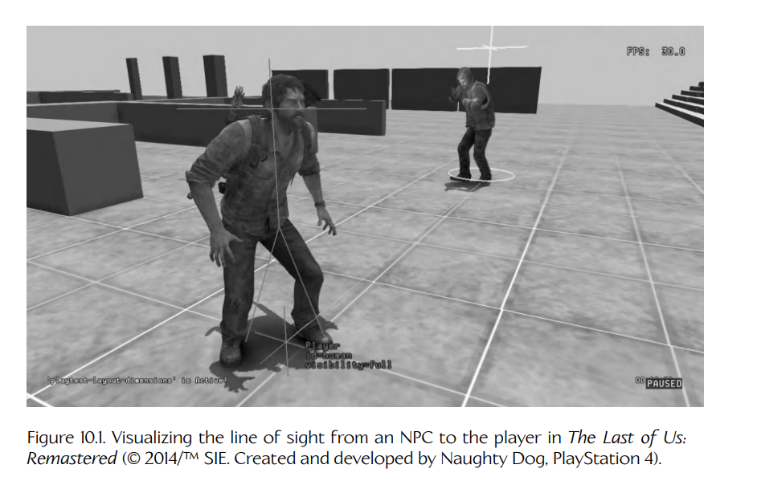
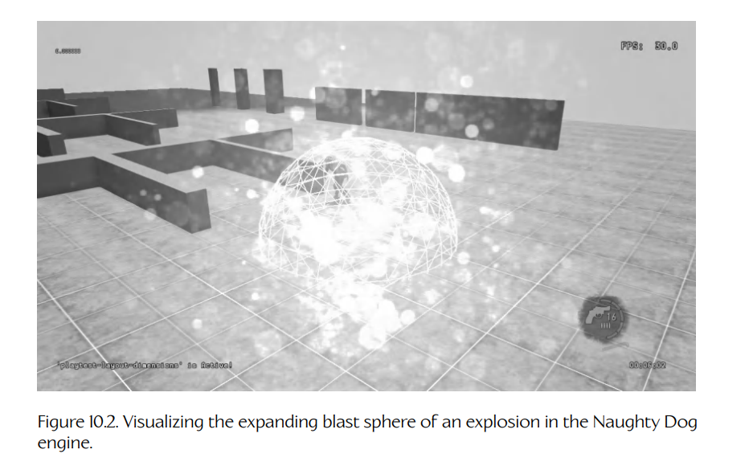
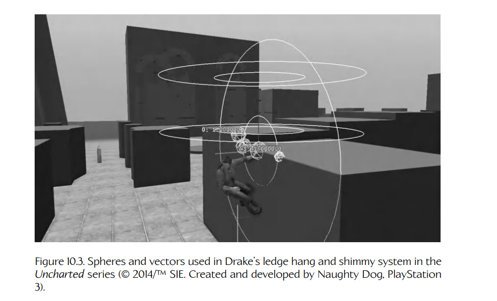
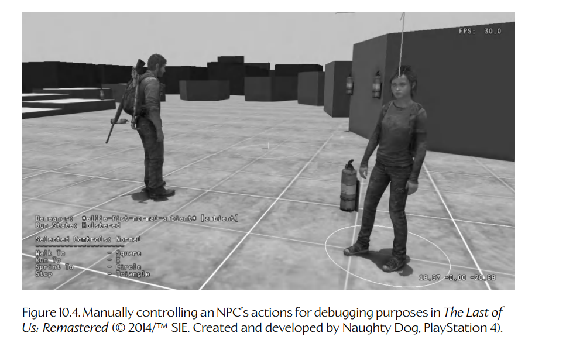

## 10.2 调试绘图设施

现代交互式游戏几乎完全由数学驱动。我们使用数学来定位和定向游戏世界中的对象、移动对象、进行碰撞检测、投射射线以确定视线，当然还会使用矩阵乘法将对象从对象空间变换到世界空间，并最终变换到屏幕空间以进行渲染。几乎所有现代游戏都是三维的，但即便是在二维游戏中，也很难在脑中可视化所有这些数学计算的结果。出于这个原因，大多数优秀的游戏引擎都会提供一个 API，用于绘制彩色线条、简单形状和 3D 文本。我们把它称为**调试绘图设施**（*debug drawing facility*），因为通过它绘制的线条、形状和文本，旨在开发和调试期间用于可视化，并会在游戏发布前移除。

调试绘图 API 可以节省大量时间。例如，如果你正在试图弄清楚为什么你的投射物没有击中敌方角色，哪种方式更容易？是在调试器里解读一堆数字？还是在游戏中绘制一条三维线，显示投射物的轨迹？有了调试绘图 API，逻辑错误和数学错误会立刻变得显而易见。可以说，一张图胜过一千分钟的调试。

下面是 Naughty Dog 引擎中调试绘图实际工作的若干示例。以下截图都取自我们的 *play-test level*，这是我们用于测试新功能和调试游戏问题的许多特殊关卡之一。

- **Figure 10.1** 展示了对敌方 NPC 感知玩家位置的可视化。小小的“火柴人”图形表示 NPC 所感知到的玩家位置。当玩家打断了自己与 NPC 之间的视线后，即便玩家已经悄悄离开，“火柴人”仍会停留在玩家最后已知的位置。
- **Figure 10.2** 展示了如何使用线框球体来可视化爆炸动态扩张的爆炸半径。
- **Figure 10.3** 展示了如何使用圆来可视化 Drake 在游戏中搜索可悬挂边缘时所使用的半径。一条线显示他当前悬挂的边缘。
- **Figure 10.4** 展示了一个被置于特殊调试模式下的 AI 角色。在这种模式下，角色的大脑实际上被关闭，开发者可以通过一个简单的抬头显示菜单完全控制该角色的移动和动作。开发者只需瞄准摄像机，就可以在游戏世界中绘制目标点，然后指示角色走、跑或冲刺到指定点。用户还可以让角色进入或离开附近的掩体、开火，等等。



**Figure 10.1.** 可视化 *The Last of Us: Remastered* 中 NPC 到玩家的视线（© 2014/TM SIE。由 Naughty Dog 开发，PlayStation 4）。



**Figure 10.2.** 在 Naughty Dog 引擎中可视化爆炸不断扩张的爆炸球体。



**Figure 10.3.** *Uncharted* 系列中 Drake 的悬挂边缘与横向移动系统所使用的球体和向量（© 2014/TM SIE。由 Naughty Dog 开发，PlayStation 3）。



**Figure 10.4.** 在 *The Last of Us: Remastered* 中，为调试目的手动控制 NPC 的动作（© 2014/TM SIE。由 Naughty Dog 开发，PlayStation 4）。

### 10.2.1 调试绘图接口

调试绘图 API 通常需要满足以下要求：

- API 应该简单且易于使用。
- 它应该支持一组有用的图元，包括但不限于：
  - 线段；
  - 球体；
  - 点（通常表示为小十字或小球，因为单个像素很难看清）；
  - 坐标轴（通常，x 轴绘制为红色，y 轴为绿色，z 轴为蓝色）；
  - 包围盒；
  - 格式化文本。
- 它应该在控制图元如何绘制方面提供相当大的灵活性，包括：
  - 颜色；
  - 线宽；
  - 球体半径；
  - 点的大小、坐标轴长度以及其他“预制”图元的尺寸。
- 应该能够在世界空间中绘制图元（完整 3D，使用游戏摄像机的透视投影矩阵），也应该能够在屏幕空间中绘制图元（使用正交投影，或者也可能使用透视投影）。世界空间图元适合为 3D 场景中的对象添加标注。屏幕空间图元则适合以抬头显示的形式展示调试信息，并且不依赖摄像机的位置或朝向。
- 应该能够在启用或不启用**深度测试**（*depth testing*）的情况下绘制图元。
  - 启用深度测试时，图元会被场景中的真实对象遮挡。这使得它们的深度容易可视化，但也意味着图元有时可能难以看见，甚至会完全被场景几何体遮住。
  - 禁用深度测试时，图元会“悬浮”在场景中的真实对象之上。这会让判断它们的真实深度变得更困难，但也能确保没有任何图元会被遮挡。
- 应该能够从代码中的任意位置调用绘图 API。大多数渲染引擎要求几何体在游戏循环的某个特定阶段提交给渲染器，通常是在每帧末尾。这一要求意味着系统必须把所有传入的调试绘图请求排入队列，以便稍后在合适的时机提交。
- 理想情况下，每个调试图元都应该有一个与之关联的**生命周期**（*lifetime*）。生命周期控制图元在被请求后会在屏幕上保留多久。如果绘制该图元的代码每帧都会被调用，那么生命周期可以是一帧——该图元会一直显示在屏幕上，因为它每帧都会被刷新。然而，如果绘制该图元的代码很少或间歇性地被调用（例如，一个用于计算投射物初始速度的函数），那么你并不希望图元只在屏幕上闪烁一帧然后消失。在这种情况下，程序员应该能够为调试图元指定更长的生命周期，通常是几秒钟量级。
- 调试绘图系统还必须能够高效地处理大量调试图元。当你为 1000 个游戏对象绘制调试信息时，图元数量确实会迅速累积；而你并不希望一旦打开调试绘图，游戏就变得不可用。

Naughty Dog 引擎中的调试绘图 API 大致如下：

```cpp
class DebugDrawManager
{
public:
    // Adds a line segment to the debug drawing queue.
    void AddLine(const Point& fromPosition,
                 const Point& toPosition,
                 Color color,
                 float lineWidth = 1.0f,
                 float duration = 0.0f,
                 bool depthEnabled = true);

    // Adds an axis-aligned cross (3 lines converging at
    // a point) to the debug drawing queue.
    void AddCross(const Point& position,
                  Color color,
                  float size,
                  float duration = 0.0f,
                  bool depthEnabled = true);

    // Adds a wireframe sphere to the debug drawing queue.
    void AddSphere(const Point& centerPosition,
                   float radius,
                   Color color,
                   float duration = 0.0f,
                   bool depthEnabled = true);

    // Adds a circle to the debug drawing queue.
    void AddCircle(const Point& centerPosition,
                   const Vector& planeNormal,
                   float radius,
                   Color color,
                   float duration = 0.0f,
                   bool depthEnabled = true);

    // Adds a set of coordinate axes depicting the
    // position and orientation of the given
    // transformation to the debug drawing queue.
    void AddAxes(const Transform& xfm,
                 Color color,
                 float size,
                 float duration = 0.0f,
                 bool depthEnabled = true);

    // Adds a wireframe triangle to the debug drawing
    // queue.
    void AddTriangle(const Point& vertex0,
                     const Point& vertex1,
                     const Point& vertex2,
                     Color color,
                     float lineWidth = 1.0f,
                     float duration = 0.0f,
                     bool depthEnabled = true);

    // Adds an axis-aligned bounding box to the debug
    // queue.
    void AddAABB(const Point& minCoords,
                 const Point& maxCoords,
                 Color color,
                 float lineWidth = 1.0f,
                 float duration = 0.0f,
                 bool depthEnabled = true);

    // Adds an oriented bounding box to the debug queue.
    void AddOBB(const Mat44& centerTransform,
                const Vector& scaleXYZ,
                Color color,
                float lineWidth = 1.0f,
                float duration = 0.0f,
                bool depthEnabled = true);

    // Adds a text string to the debug drawing queue.
    void AddString(const Point& pos,
                   const char* text,
                   Color color,
                   float duration = 0.0f,
                   bool depthEnabled = true);
};

// This global debug drawing manager is configured for
// drawing in full 3D with a perspective projection.
extern DebugDrawManager g_debugDrawMgr;

// This global debug drawing manager draws its
// primitives in 2D screen space. The (x,y) coordinates
// of a point specify a 2D location on-screen, and the
// z coordinate contains a special code that indicates
// whether the (x,y) coordinates are measured in absolute
// pixels or in normalized coordinates that range from
// 0.0 to 1.0. (The latter mode allows drawing to be
// independent of the actual resolution of the screen.)
extern DebugDrawManager g_debugDrawMgr2D;
```

下面是这个 API 在游戏代码中的一个使用示例：

```cpp
void Vehicle::Update()
{
    // Do some calculations...

    // Debug-draw my velocity vector.
    const Point& start = GetWorldSpacePosition();
    Point end = start + GetVelocity();
    g_debugDrawMgr.AddLine(start, end, kColorRed);

    // Do some other calculations...

    // Debug-draw my name and number of passengers.
    {
        char buffer[128];
        sprintf(buffer, "Vehicle %s: %d passengers",
                GetName(), GetNumPassengers());

        const Point& pos = GetWorldSpacePosition();
        g_debugDrawMgr.AddString(pos,
                                 buffer, kColorWhite, 0.0f, false);
    }
}
```

你会注意到，绘图函数的名字使用的是动词 “add”，而不是 “draw”。这是因为调试图元通常不会在绘图函数被调用时立刻绘制。相反，它们会被添加到一个视觉元素列表中，并在稍后的某个时间点被绘制。关于渲染引擎如何工作，我们将在第 11 章中学习更多内容。
