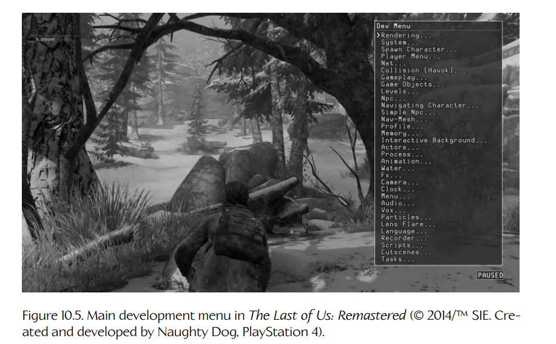
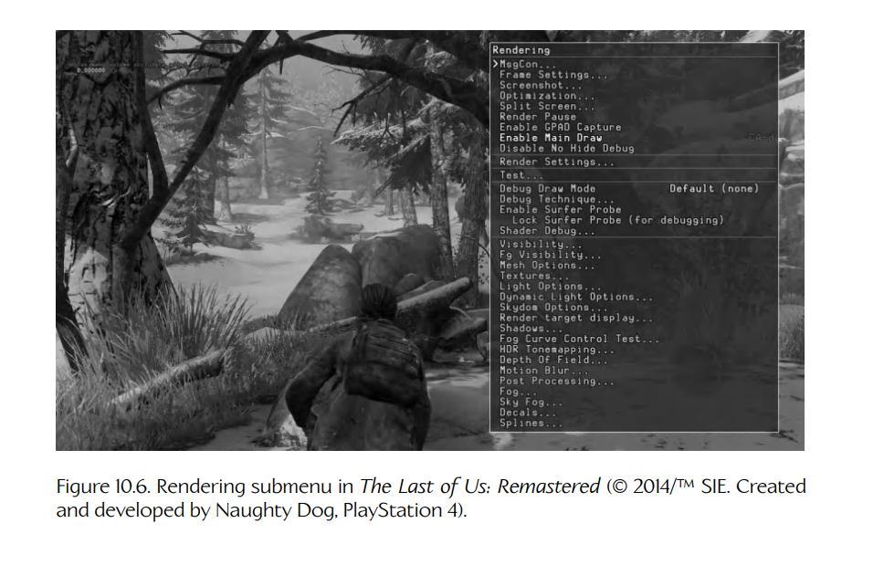
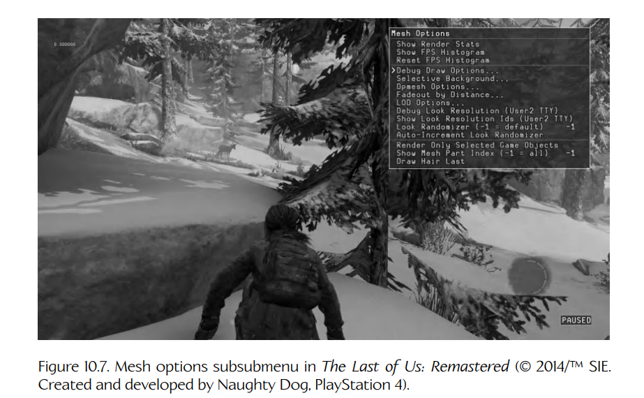
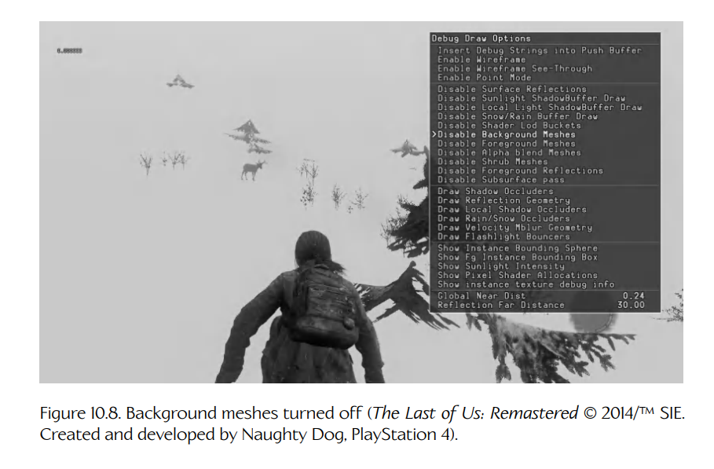
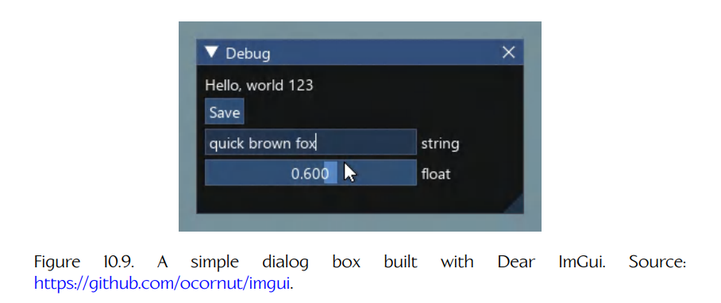

## 10.3 游戏内菜单

每个游戏引擎都有大量配置选项和功能。事实上，每个主要子系统，包括渲染、动画、碰撞、物理、音频、网络、玩家机制、AI 等，都会暴露出自己专门的配置选项。对于程序员、美术师和游戏设计师来说，如果能够在游戏运行时配置这些选项，而不必修改源代码、重新编译并重新链接游戏可执行文件，然后再重新运行游戏，将会非常有用。这可以大大减少游戏开发团队花在调试问题、设置新关卡或游戏机制上的时间。

允许这类操作的一种简单而方便的方法，是提供一套**游戏内菜单**（in-game menus）系统。游戏内菜单中的条目可以执行任意数量的操作，包括但当然不限于：

- 切换全局布尔设置；
- 调整全局整数值和浮点值；
- 调用任意函数，这些函数实际上可以执行引擎中的任何任务；
- 打开子菜单，从而让菜单系统以层级结构组织，便于导航。

游戏内菜单应该易于打开且操作方便，也许可以通过手柄上的一个简单按键来调出。（当然，你会希望选择一个在正常游戏过程中不会出现的按键组合。）调出菜单通常会暂停游戏。这样，开发者就可以一直游玩到问题即将发生的时刻，然后通过调出菜单暂停游戏，调整引擎设置以便更清楚地可视化问题，再解除暂停，深入检查问题。

下面我们简要看一下 Naughty Dog 引擎中的菜单系统是如何工作的。Figure 10.5 展示了顶层菜单。它包含了引擎中每个主要子系统的子菜单。在 Figure 10.6 中，我们向下进入了一级 **Rendering...** 子菜单。由于渲染引擎是一个高度复杂的系统，因此它的菜单中包含了许多用于控制渲染各个方面的子菜单。为了控制 3D 网格的渲染方式，我们继续向下进入 **Mesh Options...** 子菜单，如 Figure 10.7 所示。在这个菜单中，我们可以关闭所有静态背景网格的渲染，只留下动态前景网格可见。这如 Figure 10.8 所示。（啊哈，那只讨厌的鹿又出现了！）



**Figure 10.5.** *The Last of Us: Remastered* 中的主开发菜单（© 2014/™ SIE。由 Naughty Dog 创建并开发，PlayStation 4）。

### 10.3.1 第三方图形用户界面

如今，许多游戏团队都会使用第三方图形用户界面库，为引擎添加菜单和其他调试设施。一个流行的选择是 **Dear ImGui**。它是一个**立即模式 GUI 库**（immediate mode GUI library），这意味着程序员通过调用函数来构建用户界面。例如，要在屏幕上绘制一个可调整大小的窗口，你需要每帧调用 `ImGui::Begin()` 和 `ImGui::End()`。要向窗口中填充控件，则在 `ImGui::Begin()` 和 `ImGui::End()` 调用之间调用更多 ImGui 函数，例如用 `ImGui::Text()` 向窗口添加标签，或者用 `ImGui::BeginMenuBar()` 构建菜单栏。只要你希望 UI 显示在屏幕上，这些函数就要每帧调用。Figure 10.9 展示了一个简单的 ImGui 对话框，下面的代码展示了如何将其绘制到屏幕上。你可以在 https://github.com/ocornut/imgui 阅读更多关于 ImGui 的内容，并下载它供自己使用。



**Figure 10.6.** *The Last of Us: Remastered* 中的渲染子菜单（© 2014/™ SIE。由 Naughty Dog 创建并开发，PlayStation 4）。



**Figure 10.7.** *The Last of Us: Remastered* 中的网格选项子菜单（© 2014/™ SIE。由 Naughty Dog 创建并开发，PlayStation 4）。



**Figure 10.8.** 关闭背景网格后的效果（*The Last of Us: Remastered*，© 2014/™ SIE。由 Naughty Dog 创建并开发，PlayStation 4）。



**Figure 10.9.** 使用 Dear ImGui 构建的简单对话框。来源：https://github.com/ocornut/imgui。

```cpp
ImGui::Begin("Debug", &debug_active);
ImGui::Text("Hello, world %d", 123);
if (ImGui::Button("Save"))
    MySaveFunction();
ImGui::InputText("string", buf, IM_ARRAYSIZE(buf));
ImGui::SliderFloat("float", &f, 0.0f, 1.0f);
ImGui::End();