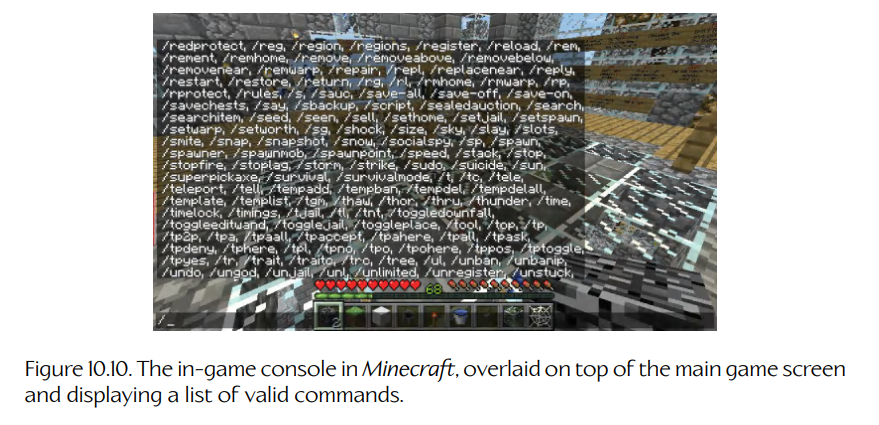

## 10.4 游戏内控制台

一些引擎会提供**游戏内控制台**（in-game console），用来替代游戏内菜单系统，或作为菜单系统之外的补充。游戏内控制台为游戏引擎功能提供了一个命令行接口，这很像 DOS 的**命令提示符**（command prompt）为用户提供访问 Windows 操作系统各种功能的入口，或者像 `csh`、`tcsh`、`ksh` 或 `bash` 这样的 **shell 提示符**（shell prompt）为用户提供访问类 UNIX 操作系统功能的入口。和菜单系统很相似，游戏引擎控制台可以提供命令，让开发者查看并操作全局引擎设置，也可以运行任意命令。

控制台比菜单系统略微不方便，尤其是对那些打字不太快的人来说更是如此。然而，控制台可以比菜单强大得多。有些游戏内控制台只提供一组非常基础的硬编码命令，使其灵活性大致和菜单系统相当。但另一些控制台则为引擎中几乎每一项功能都提供了丰富的接口。Figure 10.10 展示了 *Minecraft* 中游戏内控制台的截图。

**Figure 10.10.** *Minecraft* 中的游戏内控制台，叠加在主游戏画面之上，并显示了一组有效命令列表。

一些游戏引擎提供了功能强大的脚本语言，程序员和游戏设计师可以用它来扩展引擎功能，甚至构建全新的游戏。如果游戏内控制台也“使用”同一种脚本语言，那么任何可以在脚本中完成的事情，也都可以通过控制台以交互方式完成。我们将在 Section 17.9 中深入探讨脚本语言。
