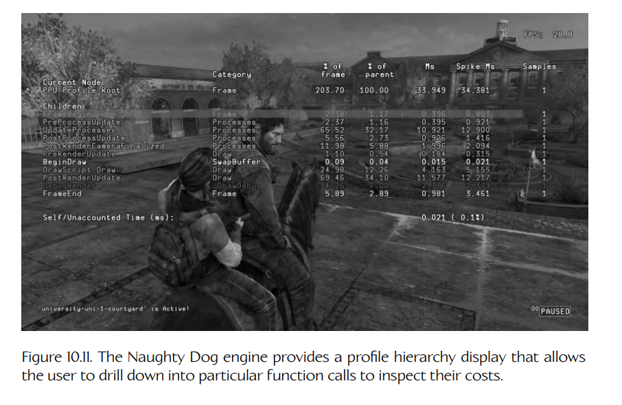
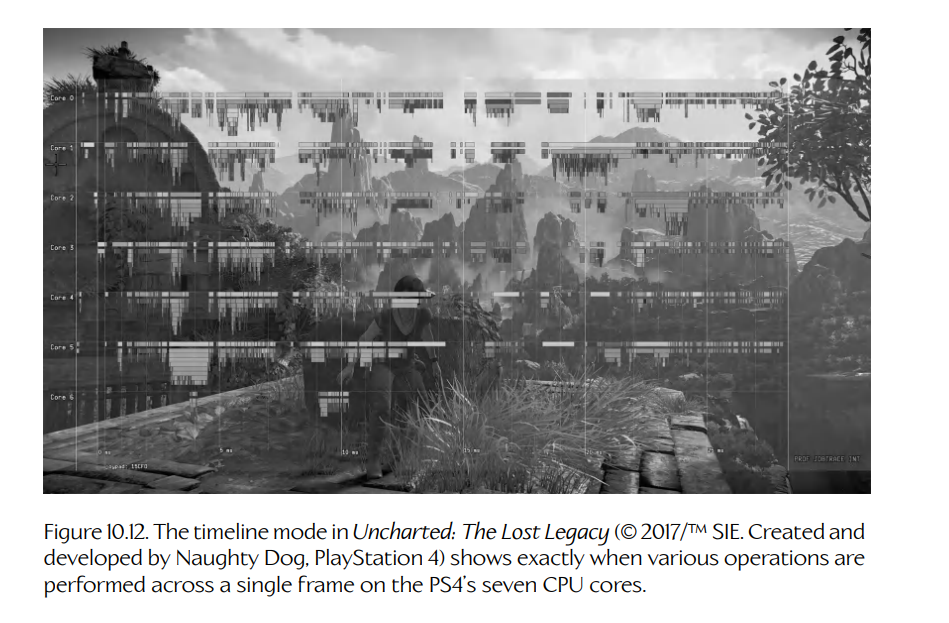
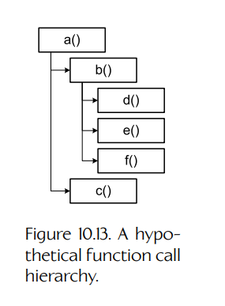
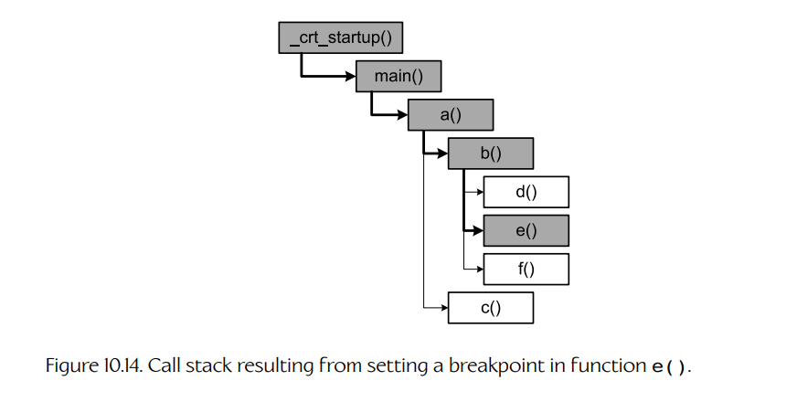

## 10.8 游戏内性能分析

游戏是实时系统，因此实现并维持较高的帧率（通常为 30 FPS 或 60 FPS）非常重要。因此，任何游戏程序员工作中的一部分，就是确保自己的代码能够高效运行，并且保持在预算之内。正如我们在第 2 章讨论 80/20 法则时所看到的，你的代码中很大一部分可能并不需要优化。想要知道**哪些**部分需要优化，唯一的办法就是**测量游戏的性能**。我们在第 2 章讨论过各种第三方性能分析工具。然而，这些工具有各种限制，并且在主机平台上可能根本不可用。出于这个原因，或者仅仅是为了方便，许多游戏引擎都会提供某种形式的游戏内性能分析工具。

通常，游戏内性能分析器允许程序员对需要计时的代码块进行标注，并为它们赋予人类可读的名称。性能分析器会通过 CPU 的高分辨率计时器测量每个被标注代码块的执行时间，并将结果存储在内存中。系统会提供一个平视显示器（heads-up display），用于显示每个代码块最新的执行时间（示例如图 10.11 和图 10.12 所示）。该显示界面通常会以多种形式提供数据，包括原始周期数、以微秒为单位的执行时间，以及相对于整个帧执行时间的百分比。



**Figure 10.11.** Naughty Dog 引擎提供了一种性能分析层级显示界面，允许用户下钻到特定函数调用中，以检查其开销。



**Figure 10.12.** 《神秘海域：失落的遗产》中的时间线模式展示了在 PS4 的七个 CPU 核心上，一个帧内各类操作究竟是在何时执行的。

### 10.8.1 层级式性能分析

用命令式语言编写的计算机程序本质上是**层级式**的——一个函数会调用其他函数，而这些函数又会调用更多函数。例如，我们假设函数 `a()` 调用了函数 `b()` 和 `c()`，而函数 `b()` 又调用了函数 `d()`、`e()` 和 `f()`。其伪代码如下所示。

```cpp
void a()
{
    b();
    c();
}

void b()
{
    d();
    e();
    f();
}

void c() { ... }

void d() { ... }

void e() { ... }

void f() { ... }
```

假设函数 `a()` 是直接从 `main()` 调用的，那么这个函数调用层级如图 10.13 所示。



**Figure 10.13.** 一个假想的函数调用层级。

调试程序时，**调用栈**（call stack）只显示这棵树的一个快照。具体来说，它显示的是从层级中**当前正在执行**的函数一路通向根函数的路径。在 C/C++ 中，根函数通常是 `main()` 或 `WinMain()`，不过从技术上讲，该函数是由标准 C 运行时库（CRT）中的一个启动函数调用的，因此这个启动函数才是该层级真正的根。如果我们在函数 `e()` 中设置断点，那么调用栈大致如下：

```text
e()              ← 当前正在执行的函数。
b()
a()
main()
_crt_startup()  ← 调用层级的根。
```

该调用栈在图 10.14 中被描绘为一条从函数 `e()` 通向函数调用树根部的路径。



**Figure 10.14.** 在函数 `e()` 中设置断点后得到的调用栈。

#### 10.8.1.1 以层级方式测量执行时间

如果我们测量单个函数的执行时间，那么测得的时间会包含该函数调用的任何子函数，以及这些子函数的所有孙函数、曾孙函数等的执行时间。为了正确解释我们可能收集到的任何性能分析数据，必须考虑函数调用层级。

许多商业性能分析器可以自动对程序中的每一个函数进行插桩（instrument）。这样，它们就能够测量性能分析会话期间被调用的每个函数的**包含时间**（inclusive time）和**排他时间**（exclusive time）。顾名思义，包含时间测量的是函数自身以及其所有子函数的总执行时间，而排他时间只测量函数本身花费的时间。（某个函数的排他时间可以通过从该函数的包含时间中减去其所有直接子函数的包含时间来计算。）此外，一些性能分析器还会记录每个函数被调用了多少次。优化程序时，这是一项重要信息，因为它可以让你区分两类函数：一类是在函数内部消耗了大量时间，另一类则是因为被调用了非常多次而消耗了大量时间。

相比之下，游戏内性能分析工具通常没有那么复杂，往往依赖对代码进行**手动插桩**。如果我们的游戏引擎主循环结构足够简单，那么我们也许可以在较粗粒度的层面获得有效数据，而不必过多考虑函数调用层级。例如，一个典型的游戏循环大致如下：

```cpp
while (!quitGame)
{
    PollJoypad();
    UpdateGameObjects();
    UpdateAllAnimations();
    PostProcessJoints();
    DetectCollisions();
    RunPhysics();
    GenerateFinalAnimationPoses();
    UpdateCameras();
    RenderScene();
    UpdateAudio();
}
```

我们可以在非常粗略的层面上对这个游戏进行性能分析，即测量游戏循环中每个主要阶段的执行时间：

```cpp
while (!quitGame)
{
    {
        PROFILE(SID("Poll Joypad"));
        PollJoypad();
    }
    {
        PROFILE(SID("Game Object Update"));
        UpdateGameObjects();
    }
    {
        PROFILE(SID("Animation"));
        UpdateAllAnimations();
    }
    {
        PROFILE(SID("Joint Post-Processing"));
        PostProcessJoints();
    }
    {
        PROFILE(SID("Collision"));
        DetectCollisions();
    }
    {
        PROFILE(SID("Physics"));
        RunPhysics();
    }
    {
        PROFILE(SID("Animation Finaling"));
        GenerateFinalAnimationPoses();
    }
    {
        PROFILE(SID("Cameras"));
        UpdateCameras();
    }
    {
        PROFILE(SID("Rendering"));
        RenderScene();
    }
    {
        PROFILE(SID("Audio"));
        UpdateAudio();
    }
}
```

上面展示的 `PROFILE()` 宏很可能会实现为一个类：它的构造函数启动计时器，析构函数停止计时器，并将执行时间记录到给定名称之下。因此，借助 C++ 会在对象进出作用域时自动构造和析构对象这一特性，它自然只会测量其所在代码块内部的代码。

```cpp
struct AutoProfile
{
    AutoProfile(const char* name)
    {
        m_name = name;
        m_startTime = QueryPerformanceCounter();
    }

    ~AutoProfile()
    {
        std::int64_t endTime = QueryPerformanceCounter();
        std::int64_t elapsedTime = endTime - m_startTime;

        g_profileManager.storeSample(m_name, elapsedTime);
    }

    const char*  m_name;
    std::int64_t m_startTime;
};

#define PROFILE(name) AutoProfile p(name)
```

这种简化方法的问题在于，当它被用于更深层次的函数调用嵌套时，就会失效。例如，如果我们在 `RenderScene()` 函数内部嵌入额外的 `PROFILE()` 标注，就需要理解函数调用层级，才能正确解释这些测量结果。

这个问题的一种解决方案是，允许负责标注代码的程序员指出性能分析样本之间的层级关系。例如，在 `RenderScene()` 函数内部采集的任何 `PROFILE(...)` 样本，都可以声明为 `PROFILE(SID("Rendering"))` 样本的子项。这些关系通常不是在标注本身中直接设置的，而是通过预先声明所有样本槽（sample bins）来单独建立。例如，我们可能会在引擎初始化期间如下设置游戏内性能分析器：

```cpp
// This code declares various profile sample "bins",
// listing the name of the bin and the name of its
// parent bin, if any.

ProfilerDeclareSampleBin(SID("Rendering"), nullptr);
ProfilerDeclareSampleBin(SID("Visibility"), SID("Rendering"));
ProfilerDeclareSampleBin(SID("Shaders"), SID("Rendering"));
ProfilerDeclareSampleBin(SID("Materials"), SID("Shaders"));

ProfilerDeclareSampleBin(SID("SubmitGeo"), SID("Rendering"));

ProfilerDeclareSampleBin(SID("Audio"), nullptr);

// ...
```

这种方法仍然有自己的问题。具体来说，当调用层级中的每个函数都只有一个父函数时，它运行良好；但当我们尝试分析一个会被多个父函数调用的函数时，它就会失效。原因非常明显：我们静态声明样本槽时，仿佛每个函数在函数调用层级中只能出现一次；但实际上，同一个函数可能会在树中多次出现，而且每次都有不同的父函数。结果可能会产生误导性数据，因为某个函数的时间会被包含到某一个父样本槽中，但实际上应该分摊到它所有父样本槽中。大多数游戏引擎不会尝试修正这个问题，因为它们主要关心的是对粗粒度函数进行性能分析，而这些函数通常只会从函数调用层级中的某个特定位置被调用。但在使用大多数游戏引擎中那种简单的引擎内性能分析器来分析代码时，这个限制需要牢记。

当然，也可以编写复杂得多的性能分析系统，正确处理嵌套的 `AutoProfile` 实例。这是设计游戏引擎时需要做出的众多权衡之一。我们是投入工程时间去创建一个完全层级式的性能分析器？还是先使用更简单的方案，把这些编程资源投入到其他地方？最终，这取决于你。

我们还希望统计某个给定函数被调用了多少**次**。在上面的例子中，我们知道被分析的每个函数每帧都恰好调用一次。但函数调用层级更深处的其他函数，可能每帧会被调用多次。如果我们测量函数 `x()` 的执行时间为 2 ms，那么很重要的一点是要知道：它本身执行一次就花了 2 ms，还是它的执行时间为 2 ms，但在这一帧中被调用了 1,000 次。记录每帧中某个函数被调用的次数非常简单——性能分析系统只需要在每次收到样本时递增一个计数器，并在每帧开始时重置这些计数器即可。

### 10.8.2 导出到 Excel

一些游戏引擎允许将游戏内性能分析器捕获的数据转储到文本文件中，以便后续分析。我发现逗号分隔值（CSV）格式最合适，因为这种文件可以很容易加载到 Microsoft Excel 电子表格中，在那里可以用各种方式操纵和分析数据。我曾为 *Medal of Honor: Pacific Assault* 引擎编写过这样的导出器。各列对应不同的被标注代码块，每一行表示游戏执行过程中某一帧采集到的性能分析样本。第一列包含帧编号，第二列包含以秒为单位测量的实际游戏时间。这样，团队就可以绘制性能统计数据随时间变化的图表，并确定每一帧实际花了多长时间执行。通过向导出的电子表格添加一些简单公式，我们还可以计算帧率、执行时间百分比等数据。