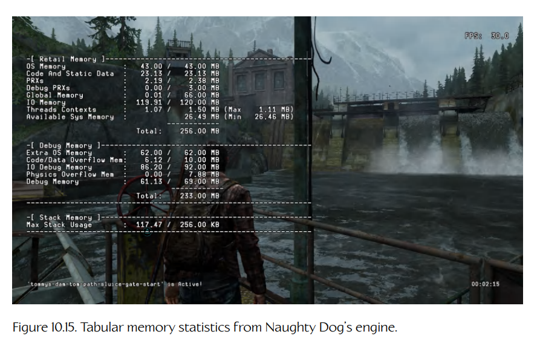
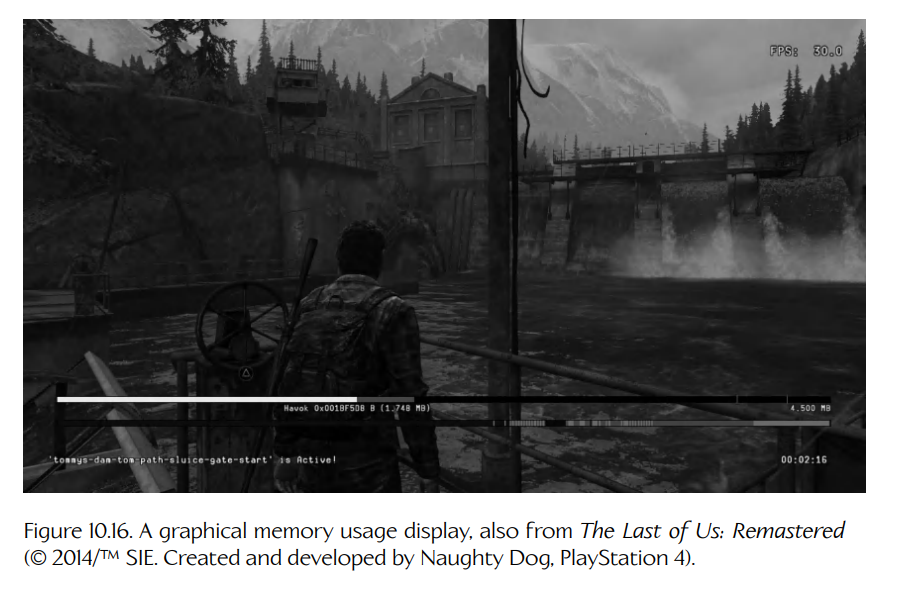

## 10.9 游戏内存统计与泄漏检测

除了运行时性能（即帧率）之外，大多数游戏引擎还会受到目标硬件可用内存容量的限制。PC 游戏受这类限制的影响最小，因为现代 PC 拥有复杂的虚拟内存管理器。但即使是 PC 游戏，也会受到所谓“最低配置”（min spec）机器的内存限制——也就是发行商承诺游戏能够运行、并写在游戏包装上的最低性能机器。

因此，大多数游戏引擎都会实现自定义的内存跟踪工具。这些工具允许开发人员查看每个引擎子系统正在使用多少内存，以及是否存在内存泄漏（即内存被分配后从未释放）。掌握这些信息非常重要，因为当你试图削减游戏内存占用，使其能够装进目标主机或目标 PC 类型的内存范围内时，需要据此做出有根据的决策。

跟踪一个游戏实际使用了多少内存，可能是一项出人意料地棘手的工作。你可能会以为，只要把 `malloc()/free()` 或 `new/delete` 包装在一组成对的函数或宏中，用来记录已分配和已释放的内存量就可以了。然而，事情从来没有这么简单，原因有以下几点：

1. **你通常无法控制别人代码的分配行为。**  
   除非你从零开始编写操作系统、驱动程序和整个游戏引擎，否则你很可能会把游戏链接到至少一些第三方库。大多数优秀的库都会提供**内存分配钩子**（memory allocation hooks），这样你就可以用自己的分配器替换它们的分配器。但有些库并不提供这一功能。要跟踪游戏引擎中每一个第三方库所分配的内存通常很困难——不过，如果你在选择第三方库时足够彻底和谨慎，这通常还是可以做到的。

2. **内存有不同的类型。**  
   例如，一台 PC 有两种 RAM：主内存（main RAM）和显存（video RAM，即位于显卡上的内存，主要用于几何数据和纹理数据）。即便你成功跟踪了主内存中发生的所有内存分配和释放，也几乎不可能完整跟踪显存的使用情况。这是因为像 DirectX 这样的图形 API 实际上会向开发者隐藏显存如何分配和使用的细节。在主机平台上，情况会稍微容易一些，因为你通常最终需要自己编写一个显存管理器。虽然这比使用 DirectX 更困难，但至少你可以完整掌握内部正在发生的事情。

3. **分配器也有不同的类型。**  
   许多游戏会针对不同用途使用专门的分配器。例如，Naughty Dog 引擎有一个用于通用分配的**全局堆**（global heap），一个用于管理游戏对象在生成和销毁过程中所创建内存的特殊堆，一个用于游戏过程中**流式载入**（streamed into memory）数据的**关卡加载堆**（level-loading heap），一个用于**单帧分配**（single-frame allocations）的**栈分配器**（stack allocator，栈会在每帧自动清空），一个用于**显存**（video RAM）的分配器，以及一个只用于最终发行版游戏中不需要的分配的**调试内存堆**（debug memory heap）。这些分配器中的每一个都会在游戏启动时抓取一大块内存，然后自行管理这块内存。如果我们只跟踪所有对 `new` 和 `delete` 的调用，那么我们会看到这六个分配器各自只调用了一次 `new`，仅此而已。为了获得真正有用的信息，我们实际上需要跟踪这些分配器各自内存块内部发生的所有分配。

大多数专业游戏团队都会投入大量精力，创建引擎内部的内存跟踪工具，以提供准确而详细的信息。最终得到的工具通常会以多种形式输出结果。例如，引擎可能会生成一个详细转储，列出游戏在某一特定时间段内发生的所有内存分配。这些数据可能包括每个内存分配器或每个游戏系统的**高水位标记**（high water marks），指出它们所需物理 RAM 的最大数量。有些引擎还会在游戏运行时提供内存使用情况的抬头显示。这些数据可以是表格形式，如图 10.15 所示，也可以是图形形式，如图 10.16 所示。

**Figure 10.15.** Naughty Dog 引擎中的表格式内存统计信息。

**Figure 10.16.** 图形化的内存使用情况显示，同样来自《The Last of Us: Remastered》（© 2014/TM SIE。由 Naughty Dog 开发，PlayStation 4）。

此外，当低内存或内存不足情况出现时，一个优秀的引擎会尽可能以有帮助的方式提供这些信息。当开发 PC 游戏时，游戏团队通常会在比目标最低配置机器拥有更多 RAM 的高性能 PC 上工作。同样，主机游戏也会在特殊的**开发套件**（development kits）上开发，而这些开发套件的内存通常比零售版主机更多。因此，在这两种情况下，即使游戏在技术上已经耗尽了内存（即它已经无法装入零售版主机或最低配置 PC），游戏仍然可能继续运行。当这种内存不足情况出现时，游戏引擎可以显示类似这样的消息：“内存不足——此关卡无法在零售系统上运行。”

游戏引擎的内存跟踪系统还可以通过许多其他方式，帮助开发者尽早、尽可能方便地定位问题。下面是几个例子：

- 如果一个模型加载失败，可以在游戏世界中该对象本应出现的位置，显示一段悬浮的亮红色 3D 文本字符串。
- 如果一个纹理加载失败，可以让该对象显示为一种丑陋的粉色纹理，使其非常明显地不像最终游戏中的内容。
- 如果一个动画加载失败，角色可以摆出一种特殊的（可能带有幽默效果的）姿势，用来表示动画缺失，并且缺失资源的名称可以悬浮显示在角色头顶。

提供优秀内存分析工具的关键在于：（a）提供准确的信息；（b）以方便查看、并能让问题显而易见的方式呈现数据；（c）在问题发生时提供上下文信息，帮助团队追踪问题的根本原因。
