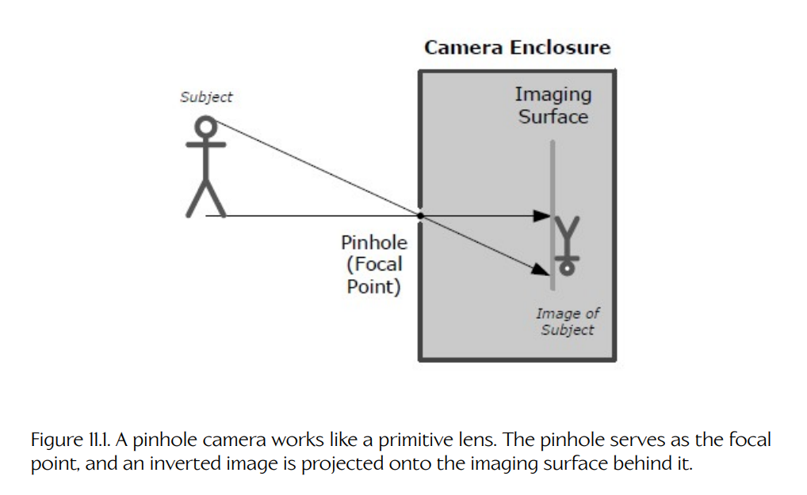
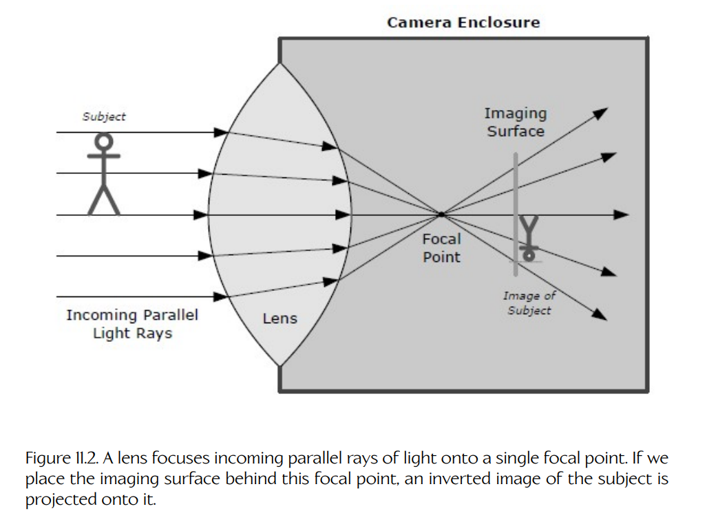
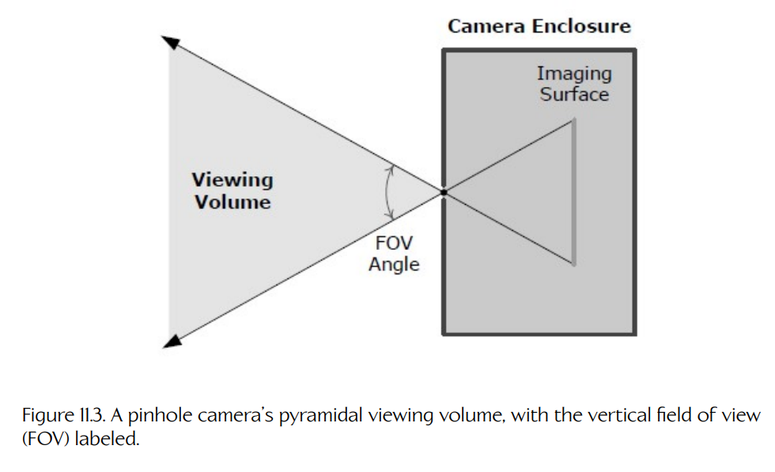
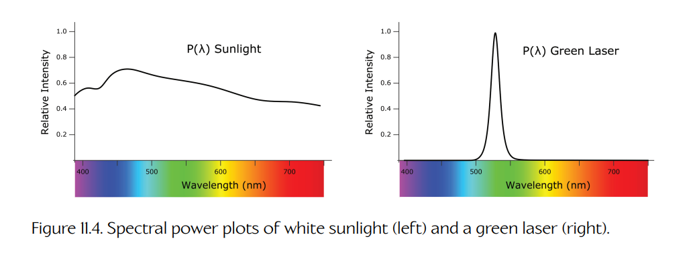
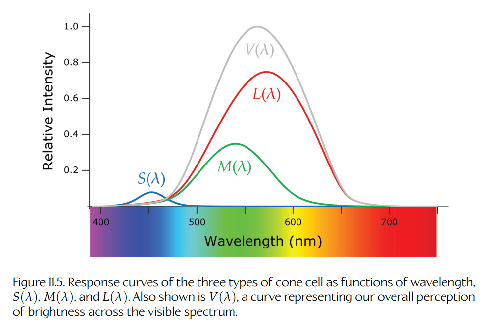
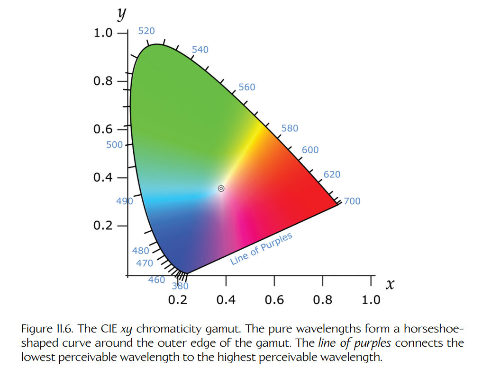
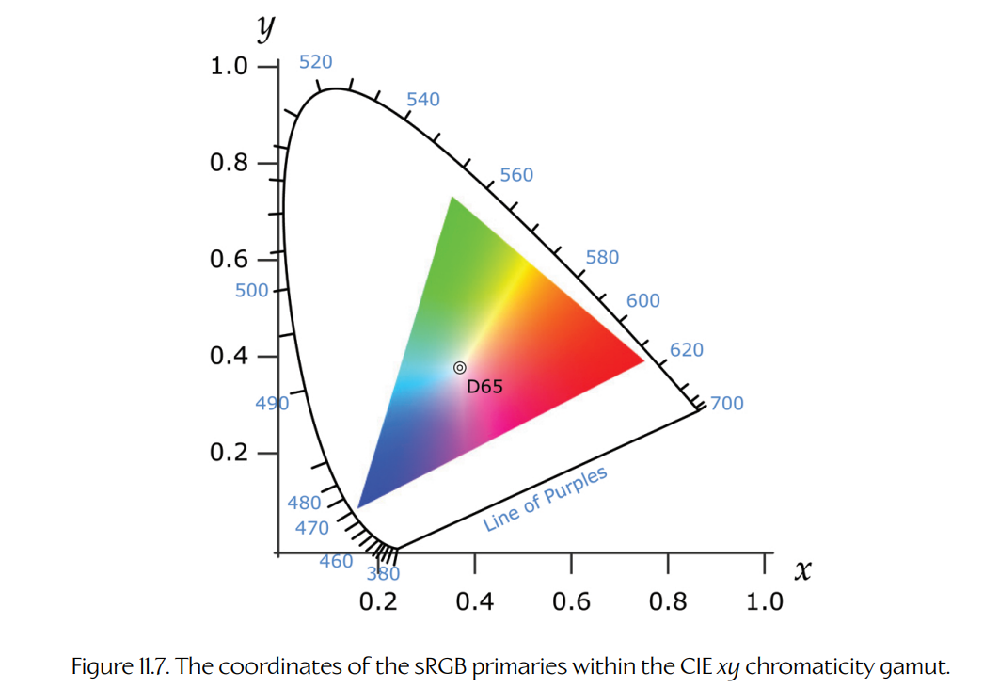
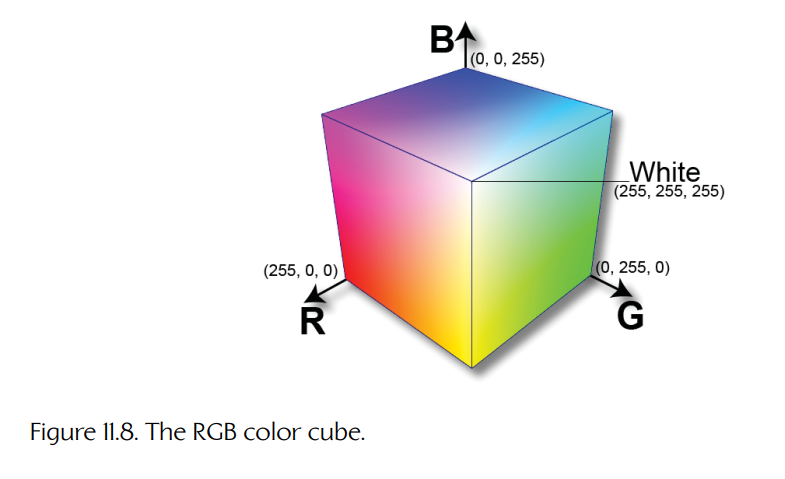

## 11.2 灯光、摄像机，开拍！

为了理解 3D 渲染引擎如何解决可见性问题与光照问题，我们首先需要理解光和摄像机在真实世界中是如何工作的。在本节中，我们将考察光是什么，并探讨眼睛和摄像机如何测量它们接收到的光，从而生成场景的二维图像。我们还将讨论人类如何感知颜色，以及颜色信息如何被表示、存储和操纵。后续各节将以这些基础为出发点，逐步建立对游戏中最常用的实时 3D 渲染技术的完整理解。

### 11.2.1 什么是光？

**光**（light）是一个通俗说法，它指的是一种被称为**电磁辐射**（electromagnetic radiation, EMR）的物理现象。当带电粒子由于材料受热、金属中通过电流、核聚变等原因而发生加速时，就会产生电磁辐射。光表现出一种令人着迷的性质，称为**波粒二象性**（wave-particle duality）。有时它的行为像波，有时它的行为又像粒子。光的波动性源于这样一个事实：它是电场和磁场的周期性波动。光的粒子性则源于这样一个事实：它以不可分割的能量包或能量子来携带能量，这些能量子被称为**光子**（photons）。

和任何波一样，光具有振幅 $A$ 和频率 $\nu$。严格地说，电磁辐射由电场和磁场中的扰动共同构成。这些扰动始终同步，并且彼此成 90 度取向。因此，我们既可以讨论电场波的振幅和频率，也可以讨论磁场波的振幅和频率；不过按照惯例，我们通常以电场为基础进行讨论。光波的振幅 $A$ 描述的是电场强度相对于其环境值的最大偏离量，单位是伏特每米。频率 $\nu$ 描述的是每单位时间内，电扰动或磁扰动从环境值到最大值、到最小值，再回到环境值所完成的循环次数。因此，频率以每秒循环数或赫兹（Hertz，缩写为 Hz）为单位。循环本身是无量纲的，所以 $1\ \mathrm{Hz} = 1\ \mathrm{s}^{-1} = 1/\mathrm{s}$。

我们也可以用电磁波中相邻波峰或波谷之间的距离来表示光的频率。这个距离称为光的**波长**（wavelength）。它通常用 $\lambda$ 表示，并以纳米（nanometers, nm）为单位进行测量。电磁辐射可以出现在很宽的频率范围内，这个范围被称为**电磁谱**（electromagnetic spectrum）。我们通常会将电磁辐射划分为不同的**频段**（frequency bands）。人眼可见的频率范围称为**可见光谱**（visible spectrum）。人类将可见光谱中的频率感知为一道颜色的彩虹：红光具有最低频率，也就是最长波长；紫光具有最高频率，也就是最短波长。低于红光频率的频段称为**红外光**（infrared light）；同样，高于紫光频率的频段称为**紫外光**（ultraviolet light）。

电磁波在真空中以恒定速度 $c$ 传播。由于波粒二象性，我们可以把 $c$ 理解为波的波峰或波谷表面上传播的速度，也可以理解为单个光子在空间中传播的速度。根据爱因斯坦著名的相对论，真空中的光速与观察者的运动速度无关，始终保持恒定！（我们不会深入解释原因，不过如果你想让自己的大脑被震撼一下，可以去查一查“闵可夫斯基空间”。）任意波的传播速度 $v$、频率 $\nu$ 和波长 $\lambda$ 之间的关系为 $v = \nu / \lambda$。对光来说，这个关系变为 $v = c / \lambda$。

光是一种**横波**（transverse wave）。这意味着磁场和电场的波动不仅彼此垂直，而且也与光波（或光子）的传播方向垂直。可以将它与声音这样的**纵波**（longitudinal wave）进行对比：在纵波中，空气压力的波动方向与传播方向相同。电场和磁场分别用向量 $\mathbf{E}$ 和 $\mathbf{B}$ 表示。在**偏振**（polarized）光信号中，所有光子的电场向量和磁场向量彼此对齐；而在**非偏振**（unpolarized）信号中，这些场向量会以各种随机角度取向。大多数时候，我们可以在 3D 渲染中忽略偏振的影响，不过在少数情况下它也可能发挥作用。

### 11.2.2 眼睛与摄像机

人眼由一个透镜、一个不透光的封闭区域（眼球），以及一个被称为**视网膜**（retina）的成像表面组成。视网膜由大量极小的感光神经元构成，这些神经元被称为**视杆细胞**（rods）和**视锥细胞**（cones）。当这些神经元检测到光时，它们会向大脑发送信号，使我们能够感知图像。视杆细胞和视锥细胞共同工作，使人类能够在很宽的光照条件范围内都具有良好的视觉。视锥细胞会测量它们接收到的光的强度和颜色，但对低光强并不是非常敏感。另一方面，视杆细胞在黑暗环境中工作得很好，但它们不能感知颜色。这就是为什么我们在夜晚看到的世界大多是黑白的。我们将在 [Section 11.2.3](02-lights-camera-action.md#1123-color-theory) 中精确讨论眼睛中的视锥细胞如何产生我们的颜色感知。

摄像机本质上是一只人工眼睛，它的工作方式与眼睛非常相似。它由一个透镜、一个不透光的封闭区域（摄像机机身），以及一个矩形成像表面组成。在胶片相机中，入射光会与一张未显影胶片发生化学反应，从而生成一幅负片图像。

在数字摄像机中，成像表面是矩形的，并且由一个规则网格的小型半导体传感器构成，这些传感器要么是**电荷耦合器件**（charged-coupled device, CCD）传感器，要么是**互补金属氧化物半导体**（complementary metal-oxide semiconductor, CMOS）传感器。数字摄像机中的每个传感器都会测量落在其上的光的强度和颜色，并将该颜色信息写入输出图像的像素中。图像通常会保存到安装在摄像机中的可移动存储卡文件里。

#### 11.2.2.1 辐亮度

更精确地说，眼睛或摄像机中的光传感器所敏感的物理量，是一个称为**辐亮度**（radiance）的辐射度学量。我们将在 [Section 12.2](../12-lighting-and-post-processing/02-radiometry-and-the-theory-of-light-transport.md) 中更严格地推导辐亮度的数学形式；但暂时来说，可以把辐亮度想象为沿着一束无限细的光笔所携带的光功率——用数学术语来说，就是一条**射线**（ray）。换句话说，辐亮度是在空间中沿某个特定方向传播的光功率量。我们也可以直观地把辐亮度理解为“赋予物体外观的那个物理量”。

#### 11.2.2.2 透镜与针孔

摄像机成像表面上的传感器，实际上对来自所有方向的光都敏感。为了生成一幅聚焦图像，并确保传感器真正测量的是**辐亮度**，我们需要某种方式来确保每个传感器只接收来自一个方向的光线。实现这一点最简单的方法，是在摄像机外壳上钻一个极小的针孔。这个针孔会成为入射光线的一个**焦点**（focal point）。只有穿过这个公共点的光线才能到达成像表面。[Figure 11.1](#figure-111) 展示了针孔相机如何形成图像。从图中可以看出，所有光线都必须穿过一个公共焦点，这会导致图像在水平和垂直方向上都发生倒置。

针孔相机的问题在于，它只允许极少量的光进入摄像机外壳，这意味着需要非常长的曝光时间才能生成图像。我们可以通过增加到达感光表面的光量来缩短曝光时间。这意味着要扩大外壳上的孔洞，但这样一来，我们就需要一个**透镜**（lens）来聚焦光线。透镜是一块成形玻璃或其他透明材料，其折射率不同于空气。透镜的形状会使入射光线发生折射，从而将它们聚焦到成像表面上。[Figure 11.2](#figure-112) 展示了摄像机透镜如何聚焦光线。

**Figure 11.1.** 针孔相机的工作方式类似一个原始透镜。针孔充当焦点，倒置图像被投影到其后的成像表面上。

**Figure 11.2.** 透镜会将入射的平行光线聚焦到单个焦点上。如果我们将成像表面放在该焦点之后，拍摄对象的倒置图像就会投影到成像表面上。

和针孔相机一样，光线会先会聚到焦点上，然后才击中成像表面。同样，最终得到的图像也是倒置的。

#### 11.2.2.3 视场与焦距

由于透镜或针孔会将入射光聚焦到单个焦点上，因此摄像机只能看到周围世界的一部分。使用针孔相机来思考这个问题最简单。假设我们从摄像机成像矩形的四个角追踪射线，让它们穿过针孔并进入场景，最终会得到一个金字塔形的**观察体积**（viewing volume）。位于这个金字塔之外的任何内容都无法被摄像机成像，因为从其发出的任何光线都必然会落到成像表面的边界之外。我们也可以把观察体积看作由四个平面围成：这四个平面分别与成像表面的四条边相交，并且也在焦点处相互相交。这四个平面与摄像机中心观察方向所形成的角度，称为摄像机的**角视场**（angular field of view, FOV）。我们可以用水平角或垂直角来描述 FOV。[Figure 11.3](#figure-113) 展示了这一概念。

**Figure 11.3.** 针孔相机的金字塔形观察体积，其中标出了垂直视场角（FOV）。

对于使用实际透镜而非针孔的摄像机，情况会稍微复杂一些，但原理是相同的。任何透镜或透镜系统都有一个固有视场，该视场由它使入射光弯折并会聚到焦点的最大角度决定。描述视场的另一种方式，是描述焦点距离透镜有多远。如果透镜只让入射光稍微弯折，那么焦点会位于透镜后方很远的位置。但如果透镜对入射光线的弯折更强，那么焦点会更接近透镜。因此，我们可以用透镜的**焦距**（focal length）来描述其视场，焦距就是从透镜到焦点的距离。

焦距与垂直角视场之间的转换公式为：

$$
\mathrm{FOV} = 2 \tan^{-1} \left( \frac{H}{2f} \right),
$$

其中 $H$ 是摄像机外壳内部成像表面的高度（如果是水平 FOV，则为宽度），$f$ 是焦距。

### 11.2.3 色彩理论

在计算机中，颜色通常使用三个数字 $(R, G, B)$ 的三元组来表示，它们分别对应于该颜色中所含红光、绿光和蓝光的数量。但为什么我们会使用这三个特定的值来量化颜色呢？为了回答这个问题，我们需要理解光的能量含量如何随波长变化，以及当眼睛接收到一个包含复杂波长混合的光信号时，我们的眼睛如何产生颜色感觉。（关于这个主题更深入的讨论，见 [35]。）

#### 11.2.3.1 光能与功率

光波携带能量。换句话说，光子可以对其他物体施加力，因此它们具有做功的能力。回顾高中物理，我们会想起，当一个力作用在一段距离上时，就产生了**功**（work）。力是质量与加速度的乘积，单位为牛顿（Newtons，$1\ \mathrm{N} = 1\ \mathrm{kg} \cdot \mathrm{m}/\mathrm{s}^2$）。功是力乘以距离，因此它的单位为焦耳（joules，$1\ \mathrm{J} = 1\ \mathrm{N} \cdot \mathrm{m} = 1\ \mathrm{kg} \cdot \mathrm{m}^2/\mathrm{s}^2$）。**能量**（energy）是做功的能力，因此也以焦耳为单位。在高中物理中，我们通常用符号 $E$ 表示能量。但在光学领域，$E$ 被用来表示另一个称为**辐照度**（irradiance）的量。因此，光信号的能量通常改用符号 $Q$ 表示。

光也可以用其**功率**（power）来表征。功率是做功的速率，或者说能量交换的速率。功率以焦耳每秒为单位，也称为瓦特（watts，$1\ \mathrm{W} = 1\ \mathrm{J}/\mathrm{s} = 1\ \mathrm{kg} \cdot \mathrm{m}^2/\mathrm{s}^3$）。光源单位时间发出的能量称为**辐射功率**（radiant power）。例如，我们可以说一个灯泡发出 60 瓦功率的光，也就是每秒 60 焦耳的光能。辐射功率是能量对时间的导数，通常用符号 $\Phi$ 表示，因此可以写作：

$$
\Phi = \frac{\mathrm{d}Q}{\mathrm{d}t}.
$$

在 [Section 11.2.3.4](#11234-luminous-power) 中，我们将介绍一个相关的量：**光通量**（luminous power）$\Phi_v$，它表示人眼会感知到的辐射功率量。这一点非常重要：像 $\Phi$ 这样的**辐射度学量**（radiometric quantities）描述的是电磁辐射的直接测量结果，而像 $\Phi_v$ 这样的**光度学量**（photometric quantities）描述的是人类对测量结果的感知。在本书中，当需要将光度学量与其辐射度学对应量区分开时，我们会使用小写的下标 “$v$”2，它代表 “as visually perceived”（视觉感知到的）。

> **脚注 2**：注意不要将这个下标与大写的 “$V$” 下标混淆；后者用于表示观察空间中的点和向量，例如观察空间基向量 $\mathbf{i}_V$、$\mathbf{j}_V$ 和 $\mathbf{k}_V$。

**Figure 11.4.** 白色阳光（左）和绿色激光（右）的光谱功率图。

在计算机图形学和辐射度学教材中，你经常会看到辐射功率用另一个术语 **辐射通量**（radiant flux）来描述，但这可能会引起混淆，因为术语 “flux” 通常指某种量**单位面积上的流动**，而辐射功率明确不是单位面积上的功率。我们将在 [Section 12.2.4](../12-lighting-and-post-processing/02-radiometry-and-the-theory-of-light-transport.md) 中进一步讨论这个主题；但为了避免混淆，目前我们会坚持使用**辐射功率**这一术语。

#### 11.2.3.2 光谱功率分布

当一束光中的每个光子都具有完全相同的波长时，我们称其为**单色光**（monochromatic light）。例如，一束绿色激光可能携带波长全都精确为 550 nm 的光子。现实世界中我们遇到的大多数光并不是单色的；它由各种不同波长的光子混合而成。我们可以把每个波长看作携带了光整体功率的某个百分比。任何特定光信号的颜色内容，都可以方便地通过定义一个称为**光谱功率分布**（spectral power distribution, SPD）的函数来表征，通常记作 $P(\lambda)$。它的单位是瓦特每纳米（W/nm）。

太阳发出白光，其功率在整个可见电磁频谱上分布得相当均匀。因此，太阳光的光谱功率图 $P_{\mathrm{sun}}(\lambda)$ 看起来像是一条贯穿整个可见光谱的、略有起伏且稍微倾斜的线。上文提到的单色绿色激光，其光谱功率图 $P_{\mathrm{laser}}(\lambda)$ 几乎在所有地方都为零，只在 550 nm 处有一个非常高且狭窄的尖峰。紫色灯泡可能发出由红色和蓝色波长混合而成的光。它的光谱功率函数 $P_{\mathrm{purple}}(\lambda)$ 可能有两个峰，一个位于光谱蓝色部分附近的 450 nm，另一个位于黄色/红色部分附近的 680 nm。[Figure 11.4](#figure-114) 展示了两个光谱功率图。

我们可以把光谱功率函数理解为辐射功率关于波长的导数：$P(\lambda) = \mathrm{d}\Phi/\mathrm{d}\lambda$。给定任意一个特定的光谱功率图，我们可以通过将所有波长上的光谱功率微分相加，来求出该光信号中的总功率。换句话说，对该函数在整个频谱上关于波长进行积分，可以将以瓦特每纳米为单位的光谱功率转换为以瓦特为单位的总辐射功率：

$$
\Phi = \int_0^\infty P(\lambda)\,\mathrm{d}\lambda.
$$

#### 11.2.3.3 三刺激响应曲线

我们视网膜中的视锥细胞分为三类，每一类都对可见光谱的不同子频段敏感。第一类视锥细胞对低频率（长波长）最敏感，因此最擅长检测偏红色的颜色；我们将它们称为 L 锥细胞。第二类最敏感的频率位于可见频段中部（中等波长），对应于偏绿色的颜色范围；我们将它们称为 M 锥细胞。最后一类视锥细胞对高频率（短波长）的响应最强，因此最擅长检测蓝色和靛蓝色；我们称其为 S 锥细胞。

给定某个具有特定光谱分布的入射光，我们的大脑会根据三类视锥细胞对该光的响应强度，为它得出一个单一标签，也就是我们称为“颜色”的东西。如果 L 锥细胞响应强烈，但 S 和 M 锥细胞基本安静，那么我们往往会把这个颜色标记为“红色”。如果 L 和 S 锥细胞都响应强烈，但 M 锥细胞没有响应，那么我们往往会把这个颜色称为“紫色”。

我们可以通过绘制三类视锥细胞对整个可见光谱中每一种可能波长 $\lambda$ 的响应强度，来可视化它们的响应，如 [Figure 11.5](#figure-115) 所示。我们分别将这三条曲线标记为 $S(\lambda)$、$M(\lambda)$ 和 $L(\lambda)$，对应于三类视锥细胞。这些曲线通常称为**三刺激曲线**（tristimulus curves）。人类视觉感知几乎是线性的，也就是说，我们的大脑将入射光信号的**亮度**（brightness）感知为三类视锥细胞响应之和。[Figure 11.5](#figure-115) 中还包含第四条曲线，标记为 $V(\lambda)$，它绘制的是感知亮度关于波长的变化。这条曲线几乎正好等于另外三条曲线之和。

这些曲线看起来很像我们在 [Section 11.2.3.1](#11231-light-energy-and-power) 中讨论过的光谱功率图。但它们并不测量以瓦特每纳米为单位的绝对光功率。三刺激图的纵轴实际上是无量纲的，因为它表示的是相对于给定波长处三类视锥细胞合计最大响应而言，视锥细胞对入射波长的响应强度。该轴的范围从 0 到 1，其中 1 表示可能出现的最强响应。因此，$V(\lambda)$ 在 1.0 处达到最大值，而任何单独的三刺激曲线都不会单独达到 1.0。需要意识到，这幅图表示的是平均人类视锥细胞的响应。任何个体的绝对响应强度以及响应曲线形状，都可能与这个平均值不同。

**Figure 11.5.** 三类视锥细胞随波长变化的响应曲线：$S(\lambda)$、$M(\lambda)$ 和 $L(\lambda)$。图中还显示了 $V(\lambda)$，它表示我们在整个可见光谱上的总体亮度感知。

#### 11.2.3.4 光通量

正如 $V(\lambda)$ 的钟形曲线所表明的，人类会把可见光谱中间范围的波长感知得比光谱低端和高端的波长更亮。换句话说，当人眼接收到一个具有特定光谱功率分布的入射光信号时，我们会感知到：该信号在绿色和黄色部分的功率比实际更强，而在红色和蓝色部分的功率比实际更弱。我们可以通过计算一个称为**光通量**（luminous power）的量，来校正人类视觉的这种特异性。和能量意义上的辐射功率 $\Phi$ 一样，光通量通过在所有波长上对光谱功率分布进行积分来计算。但与能量意义上的辐射功率不同，光通量会通过将光谱功率分布乘以总体亮度感知响应曲线 $V(\lambda)$，来纳入人类感知。由于 $V(\lambda)$ 在可见光谱之外为 0，因此积分实际上由最小与最大可见波长界定。该积分的值会乘以常数 683，使其单位变为**流明**（lumens）。流明的定义方式是：在 $\lambda = 555\ \mathrm{nm}$ 处，每瓦特具有 683 流明，因为这是 $V(\lambda)$ 达到最大值 1.0 的位置。

$$
\Phi_v = 683 \int_{380\ \mathrm{nm}}^{750\ \mathrm{nm}} P(\lambda)V(\lambda)\,\mathrm{d}\lambda.
$$

#### 11.2.3.5 颜色编码系统

人眼不能直接感知光谱功率分布——我们的眼睛无法分辨某个入射光信号中，每个单独波长究竟携带了多少辐射功率。我们所能感知的，只是三类视锥细胞分别受到刺激的强度。有无限多种光谱功率分布，最终会以完全相同的方式刺激我们的视锥细胞，这意味着所有这些由不同入射波长混合而成的光，看起来实际上都是同一种颜色。所有会被人眼感知为同一种颜色的光谱辐射功率曲线集合，被称为**同色异谱**（metamers）。

同色异谱的存在是一件好事，因为它意味着我们不需要完整的光谱功率图来描述一种颜色。由于人眼包含三类视锥细胞，我们只需要用三个数字就可以描述一种**感知颜色**（perceived color）。这三个数字大致对应于从任意特定入射光谱功率分布中观察时，会产生的视锥细胞刺激强度。有许多方式可以将一个数值三元组映射到一种感知颜色。每一种这样的系统都称为**颜色编码系统**（color encoding system）。而由于一个数字三元组的行为类似于三维向量空间，我们通常将这些颜色编码系统称为**颜色空间**（color spaces）。

#### 11.2.3.6 CIE RGB 颜色编码系统

20 世纪 20 年代，一个名为**国际照明委员会**（International Commission on Illumination, CIE）的标准化组织定义了一种称为 **CIE RGB 颜色空间**（CIE RGB color space）的颜色编码系统。该编码系统使用三个定义良好的单色光源，称为**基色**（primary colors）。

理想情况下，这三个基色本应被选择为每个基色只刺激一种视锥细胞。然而三条三刺激曲线彼此有显著重叠，因此这个理想目标不可能实现。因此，CIE 基色是一种折中选择：它们被选在接近三条三刺激曲线峰值的位置，同时也必须是当时可以使用现成光源精确复现的波长。CIE 基色分别定义为 700 nm（一种红色）、546.1 nm（一种绿色）和 435.8 nm（一种蓝色）。

为了使用 CIE RGB 颜色编码系统描述任何特定颜色，我们需要指定三个数字 $R$、$G$ 和 $B$，它们表示为了创建该颜色的**感知同色异谱**（perceptual metamer），需要将每种基色混合在一起的数量。为了定义这个颜色编码系统，CIE 向测试对象展示了大量单色颜色样片，每个样片都对应于可见光中的某个特定波长，同时提供三个可调节光源，它们分别发出三种基色。对于每个样片，测试对象都被要求调节每种基色光源的数量，直到合成结果与该颜色样片匹配。通过将这些结果绘制到整个可见光谱上，CIE 得到了三条**配色函数**（color-matching functions），分别命名为 $\bar{r}(\lambda)$、$\bar{g}(\lambda)$ 和 $\bar{b}(\lambda)$。

一个数值三元组 $(\bar{r}, \bar{g}, \bar{b})$ 只能描述单个单色光源的颜色。那么，我们如何将这个编码方案扩展为能够描述多色光源（也就是任意光谱分布）的颜色呢？答案是将多色光信号中每个单色分量对应的 $(\bar{r}, \bar{g}, \bar{b})$ 值加总起来。为此，我们取出希望描述颜色的光信号的光谱功率曲线，并将它分别乘以三条配色函数 $\bar{r}(\lambda)$、$\bar{g}(\lambda)$ 和 $\bar{b}(\lambda)$，然后在可见光波长范围 $\Lambda$ 上进行积分：

$$
\bar{R} = \int_\Lambda P(\lambda)\bar{r}(\lambda)\,\mathrm{d}\lambda,
$$

$$
\bar{G} = \int_\Lambda P(\lambda)\bar{g}(\lambda)\,\mathrm{d}\lambda,
$$

$$
\bar{B} = \int_\Lambda P(\lambda)\bar{b}(\lambda)\,\mathrm{d}\lambda.
$$

#### 11.2.3.7 CIE XYZ 颜色编码系统

CIE RGB 方法的一个困难在于，其配色曲线在光谱的某些区域实际上会变为负值。这是因为 CIE RGB 系统中的三个基色在所有可能色度构成的空间中形成了一个三角形；某些纯波长的光落在这个三角形之外，因此只能通过加入某个基色的负量来匹配，方式与位于三角形外的点至少有一个负的**重心坐标**（barycentric coordinate）非常相似。CIE RGB 系统的另一个问题是，光信号的感知亮度并不容易直接获得；亮度被部分编码在 $(\bar{R}, \bar{G}, \bar{B})$ 三个值之中。

为了解决这些问题，另一种颜色编码系统被开发出来，它被称为 **CIE XYZ 颜色空间**（CIE XYZ color space）。在这个系统中，会对 $\bar{r}(\lambda)$、$\bar{g}(\lambda)$ 和 $\bar{b}(\lambda)$ 配色函数施加一个线性变换，从而得到三条新的曲线，分别命名为 $\bar{x}(\lambda)$、$\bar{y}(\lambda)$ 和 $\bar{z}(\lambda)$。这个特定的数学变换经过精心选择，使得 $\bar{x}(\lambda)$、$\bar{y}(\lambda)$ 和 $\bar{z}(\lambda)$ 在整个可见光谱上都严格为正。更重要的是，$\bar{y}(\lambda)$ 曲线经过精心选择，使其非常接近人类总体亮度感知曲线 $V(\lambda)$。因此，使用 CIE XYZ 系统编码的颜色，其亮度可以直接从编码颜色的 $\bar{Y}$ 值中读出。

与 CIE RGB 系统类似，多色光信号的感知颜色被编码为三个值 $(\bar{X}, \bar{Y}, \bar{Z})$，它们对应于该光信号的光谱功率曲线 $P(\lambda)$ 与 $\bar{x}(\lambda)$、$\bar{y}(\lambda)$ 和 $\bar{z}(\lambda)$ 曲线乘积的积分：

$$
\bar{X} = \int_\Lambda P(\lambda)\bar{x}(\lambda)\,\mathrm{d}\lambda,
$$

$$
\bar{Y} = \int_\Lambda P(\lambda)\bar{y}(\lambda)\,\mathrm{d}\lambda,
$$

$$
\bar{Z} = \int_\Lambda P(\lambda)\bar{z}(\lambda)\,\mathrm{d}\lambda.
$$

这三个值有些抽象——它们并不像 CIE RGB 系统中的值那样表示三种基色的混合。$(\bar{X}, \bar{Y}, \bar{Z})$ 值也不会整齐地落在 0 到 1 的范围内。更重要的是，这三个值都会随感知亮度一起缩放。为了让这个颜色编码方案更有用，通常会通过将每个分量除以三个分量之和，对 $(\bar{X}, \bar{Y}, \bar{Z})$ 值进行**归一化**（normalize）。这会得到一个新的数字三元组 $(x, y, z)$，其定义如下：

$$
(x, y, z) =
\left(
\frac{\bar{X}}{\bar{X} + \bar{Y} + \bar{Z}},
\frac{\bar{Y}}{\bar{X} + \bar{Y} + \bar{Z}},
\frac{\bar{Z}}{\bar{X} + \bar{Y} + \bar{Z}}
\right).
$$

由于它们已经归一化，CIE $(x, y, z)$ 值只编码颜色的**色度**（chromaticity），不涉及亮度。三个分量之和为 1，因此我们只需要指定其中两个分量——第三个分量总是可以由另外两个计算出来。因此，通常只指定 $x$ 和 $y$ 值来描述一种颜色的色度。原始未归一化的 $\bar{Y}$ 值则用于指定亮度，从而形成一个新的数字三元组 $(x, y, \bar{Y})$，同时编码色度与亮度。这个颜色编码方案称为 **xyY 颜色空间**（xyY color space）。

#### 11.2.3.8 CIE xy 色度图

一个 CIE $xyY$ 编码颜色的 $(x, y)$ 坐标，位于一个二维色度空间中。当我们绘制所有对应于真实感知颜色的这两个坐标组合时，会得到一个倾斜的马蹄形，称为该颜色空间的**色域**（gamut）。CIE $xy$ 色度色域如 [Figure 11.6](#figure-116) 所示。单色光颜色（纯波长光）沿着这个马蹄形的弯曲外边缘分布。最长可见波长（红色）位于马蹄形的右端，而最短可见波长（紫色）位于左端。马蹄形内部的每个点都表示 $x$ 和 $y$ 色度的某种特定混合，从而形成一种独特的感知颜色，例如青色、品红色、橙色、黄色等等。闭合马蹄形底部、连接最长可见波长与最短可见波长的线，称为**紫线**（line of purples）。在马蹄形中心附近的某一点上，色度会完美混合成白色。这一点称为 $xy$ 色度空间的**白点**（white point）。

**Figure 11.6.** CIE $xy$ 色度色域。纯波长在色域外边缘形成马蹄形曲线。紫线连接最低可感知波长与最高可感知波长。

#### 11.2.3.9 标准 RGB 颜色空间

计算机图形应用使用一种称为**标准 RGB**（standard RGB）的颜色编码系统，简称 **sRGB**。该系统源自 CIE $xyY$ 编码，并且被选择为尽可能匹配电视和计算机显示器等显示设备的能力。

在 sRGB 系统中，与 CIE RGB 系统一样，每种颜色都由一个数字三元组 $(R, G, B)$ 表示，其分量表示为了生成所描述颜色的感知同色异谱，需要混合的三种预定义基色的数量。不过要小心，不要将 sRGB 基色与 CIE RGB 颜色空间中的 $\bar{R}$、$\bar{G}$ 和 $\bar{B}$ 数值混淆！sRGB 空间中的基色实际上被定义为 CIE XYZ 系统二维 $xy$ 色度空间中的固定点。因此，sRGB 颜色空间由一个三角形界定，而不是由一个倾斜的马蹄形界定。sRGB 基色的坐标如 [Figure 11.7](#figure-117) 所示。

三角形 sRGB 色域只覆盖 CIE $xy$ 马蹄形色域的一部分。换句话说，并不是 CIE XYZ 系统中的所有颜色都能在 sRGB 系统中表示。幸运的是，那些被 sRGB 系统排除在外的颜色，与位于 sRGB 三角色域内部的相邻颜色在感知上并没有非常大的差异，因此这种限制不会造成显著的实际问题。

**Figure 11.7.** sRGB 基色在 CIE $xy$ 色度色域中的坐标。

三个 sRGB 基色的 $(x, y, \bar{Y})$ 坐标定义如下：

$$
(x_R, y_R, \bar{Y}_R) = (0.64, 0.33, 0.212639),
$$

$$
(x_G, y_G, \bar{Y}_G) = (0.3, 0.6, 0.715169),
$$

$$
(x_B, y_B, \bar{Y}_B) = (0.15, 0.06, 0.072192).
$$

#### 11.2.3.10 其他 RGB 颜色空间

sRGB 颜色空间由 CIE 1931 $xy$ 色度空间中的一组特定色度坐标定义。也可以选择其他基色，从而得到若干不同的基于 RGB 的颜色空间。旧式模拟电视广播系统使用一种称为 **NTSC** 的颜色标准，它只覆盖了 sRGB 色域大约 35% 的范围。**DCI-P3** 颜色空间是为数字摄影机使用而设计的，它所选择的基色使其三角色域覆盖的 CIE 1931 马蹄形色域比 sRGB 略大。**Adobe RGB** 颜色空间的基色形成了一个三角形，它覆盖的可见颜色范围又比 DCI-P3 更宽。更大的色域能够更忠实地再现绿色和青色的细微色调。sRGB 仍然是最常用的标准，但像 Adobe 这样的标准常用于专业图像创作和编辑。关于各种 RGB 颜色空间优缺点的精彩讨论，见 [227]。

**Figure 11.8.** RGB 颜色立方体。

#### 11.2.3.11 RGB 颜色立方体

我们可以将 RGB 色域可视化为一个**颜色立方体**（color cube），它沿三个基色轴的范围都从 0 延伸到 1。RGB 颜色空间的原点表示黑色，点 $(1, 1, 1)$ 表示最亮的白色。sRGB 颜色立方体如 [Figure 11.8](#figure-118) 所示。

在任何常见 RGB 系统中编码的颜色，都可以像向量一样相加。例如，如果两个不同的光信号同时落到视网膜上，那么连接到该视网膜的人会将得到的颜色感知为这两种颜色的向量和，也就是如果每个光信号分别照亮该视网膜时所感知到的两种颜色之和。将一种颜色乘以一个标量以调整其亮度，也是合理的；也可以将两种颜色按分量相乘，在这种情况下，其中一种颜色会充当一种三分量缩放因子，称为**反射率**（reflectance）。

不过，我们必须小心，不要把 RGB 颜色当作完整数学意义上的向量来处理。例如，对 RGB 三元组求点积或叉积是没有意义的。而且与向量不同，RGB 颜色的分量永远不会为负。换句话说，RGB 颜色立方体只占据三维颜色空间的第一个（严格为正的）卦限。还应注意，虽然 RGB 颜色的加法与乘法本身是线性操作，但人类对亮度的感知实际上是非线性的。虽然线性 RGB 颜色操作并不严格正确，但它们已经足够接近，可以用于渲染引擎中；而真正正确地处理颜色乘法无论如何都会代价高昂到难以承受。在本书中，我们会使用粗体无衬线字体来区分 RGB 颜色三元组 $\mathbf{C} = (C_R, C_G, C_B)$ 与普通向量，例如 $\mathbf{v} = (v_x, v_y, v_z)$。

#### 11.2.3.12 HSL、HSV 和 HSI 颜色空间

RGB 颜色立方体是一种方便的坐标系统，可用于将颜色作为三维笛卡尔向量进行思考和处理。不过，对于在编辑器中选取颜色等用途来说，它并不是特别方便的坐标系统。**HSL**、**HSV** 和 **HSI** 颜色空间通过将 RGB 颜色立方体重新排列为圆柱坐标系统来解决这一需求。HSL 代表 “hue, saturation, lightness”（色相、饱和度、明度），HSV 代表 “hue, saturation, value”（色相、饱和度、明值，有时也称为 HSB，即 “hue, saturation, brightness”），HSI 则代表 “hue, saturation, intensity”（色相、饱和度、强度）。这三种颜色空间并没有得到很好的标准化，它们的细节也存在差异。不过，它们都把 RGB 颜色立方体映射到一个圆柱形空间中，该圆柱的半径和高度都为 1。

在这些系统中，一种颜色的**色相**（hue）表示其“纯”色度，它被编码为绕圆柱中心轴旋转的角度。颜色的**饱和度**（saturation）通过离中心轴的距离来测量；它表示中心轴上白色（饱和度为零）与圆柱边缘处某种特定纯色度（饱和度为一）之间的混合。最后，颜色的亮度或强度通过颜色沿圆柱中心轴的“高度”来编码。例如，在 HSL 系统中，黑色的明度为 0，白色的明度为 1。这意味着 HSL 圆柱的两个圆形端盖分别是完全黑色和完全白色。关于 HSL、HSV 和 HSI 圆柱坐标之间差异的更多信息，见 [228]。

#### 11.2.3.13 LUV 颜色空间

**感知均匀颜色空间**（perceptually uniform color space）是这样一种颜色空间：三个颜色分量之一的变化，在感知上等同于任意其他分量中相同大小的变化。原始的 CIE 1931 $xyY$ 色域并不是感知均匀的。为了解决这一问题，**CIE 1976 LUV 颜色空间**（CIE 1976 LUV color space）被开发出来。该空间中的 $(U, V)$ 坐标大致对应于 $xyY$ 颜色空间中的 $(x, y)$ 色度坐标，而 $L$ 坐标表示亮度，并大致对应于 $xyY$ 空间中的 $\bar{Y}$ 坐标。