## 11.3 三维渲染基础

在本节中，我们将介绍 3D 渲染中使用的基础概念、数据结构与算法。正如我们在 [Section 11.1.2](01-the-rendering-problem.md#1112-三维渲染引擎的类型) 中所讨论的，3D 渲染问题可以通过三种截然不同的方式来解决：将场景分解为有限表面元素，并为每个元素计算辐射度；追踪穿过场景的射线，以模拟光子如何传播并最终进入眼睛或摄像机；或者通过光栅化三角形逐步构建图像。

在这些方法中，三角形光栅化是游戏产业中实时 3D 渲染最常用的方法。因此，本节的讨论会偏向基于光栅化的引擎所使用的方法论、算法和数据结构。不过，本节将讨论的许多内容也适用于基于辐射度和基于光线追踪的引擎。

本节将要学习的概念，将为我们穿越 3D 渲染领域的两段迷人但又彼此相当独立的旅程做好准备：

- 在本章中，我们将讨论 **3D 图形管线**（3D graphics pipeline）——这是一种几乎在游戏产业中无处不在的编程模型，由 OpenGL 和 DirectX 等**图形管线 API**（graphics pipeline APIs）支持，并主要实现在一种称为**图形处理单元**（graphics processing unit, GPU）的硬件加速芯片上。

- 随后在 [Chapter 12](../12-lighting-and-post-processing/README.md) 中，我们将深入探讨照片级真实感光照的物理学与数学。我们会探索辐射度学、光度学以及光传输理论等主题。这些概念是各种光照引擎（基于辐射度的引擎、光线追踪器，以及基于光栅化的引擎）赖以构建的基础。

### 11.3.1 图形栈

3D 渲染引擎是复杂系统，由多个软件层和硬件层组成，这些层有时被称为**图形栈**（graphics stack）。3D 渲染引擎的分层架构如 [Figure 11.9](#figure-119) 所示。

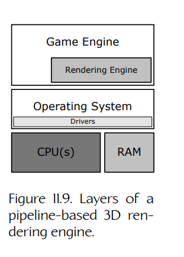

**Figure 11.9.** 基于管线的 3D 渲染引擎的各层。

#### 11.3.1.1 硬件

图形栈的最底层当然是硬件。无论我们谈论的是高端工作站、游戏 PC，还是 PlayStation 5 或 Xbox Series X 这样的主机，这些硬件都由主**母板**（motherboard）、一个或多个**中央处理单元**（central processing unit, CPU）核心，以及若干组**随机存取存储器**（random-access memory, RAM）组成。虽然像高端电影产业工作站这样的系统，或者非常老旧的游戏 PC 可能不会使用 GPU，但如今几乎每一台游戏 PC 和游戏主机都包含一种称为**图形处理单元**（graphics processing unit, GPU）的专用芯片。

CPU 核心位于主板上，旁边是主 RAM，通常还会有两级或更多级 CPU 缓存（L1、L2，可能还有 L3）。GPU 要么位于主板上（主机），要么位于一块可插拔的图形扩展卡上（PC）。GPU 可以直接访问一块称为**视频 RAM**（video RAM, VRAM）的内存。在 PC 上，VRAM 在物理上位于显卡上，只能通过 PCIe 总线间接访问。然而，主机通常采用一种**非统一内存访问**（non-uniform memory access, NUMA）架构；在这种情况下，VRAM 只是主 RAM 中同时对 CPU 核心和 GPU 可见的一部分。

计算机通过从内存中的一个缓冲区读取像素颜色数据，并将其显示在 CRT、平板显示器、HDTV 等**显示设备**（display device）上，从而显示图形。显卡上的专用芯片会逐行**扫描**（scans）内存，将在那里找到的（通常是 RGB）像素数据转换为发送到显示设备的信号。视频硬件会从屏幕顶部一直扫描到底部，然后回到顶部，再重新开始整个过程。显示器重复这一过程的速率称为其**刷新率**（refresh rate）。显示硬件会以周期性速率读取帧缓冲区的内容：北美和日本使用的 NTSC 电视为 60 Hz，而欧洲和世界许多其他地区使用的 PAL/SECAM 电视为 50 Hz。

#### 11.3.1.2 操作系统与驱动程序

下一层由**操作系统**（operating system）和各种硬件**驱动程序**（drivers）组成，其中包括针对已安装 GPU 的具体品牌和版本的专用驱动程序。在 PC 平台上，操作系统很可能是 Microsoft Windows、MacOS 或 Linux。程序员通过 Windows SDK 等编程接口与操作系统交互。主机通常由定制操作系统管理。例如，PlayStation 5 的操作系统通过一种称为 PS5 SDK 的专有接口进行编程。有趣的是，Steam Deck 主机底层运行的是 Linux 操作系统，但它通常通过一种称为 Proton 的 Microsoft Windows 仿真层进行编程；正是这个仿真层使 Steam Deck 能够直接运行 Windows 游戏，而无需将它们移植到 Linux。

#### 11.3.1.3 渲染引擎

渲染引擎本身位于硬件、操作系统和驱动程序之上。在游戏引擎中，3D 渲染引擎只是构成游戏软件本身的许多子系统之一。渲染引擎可能被构造成一个单一的整体式软件组件，但更多时候，它内部也遵循某种分层架构。

构建 3D 渲染引擎有两种基本方式。选择哪一种，很大程度上取决于所使用的渲染方法。在这两种方法中，场景内容都会使用一种称为**场景图**（scene graph）的数据结构表示在内存中；场景图允许对数据进行快速**随机访问**（random access）。系统会指定一个或多个虚拟摄像机，从而得到一个或多个进入场景的视图。这两种方法的区别在于场景图由何处、以何种方式进行管理：

- **保留模式**（retained mode）。在这种方法中，渲染引擎在内部维护场景图，引擎客户端只负责最初填充场景图、在场景内容发生变化时每帧更新它，并请求引擎通过每个视图渲染场景。场景实际如何渲染的细节，大多对客户端应用程序隐藏。这是 20 世纪 80 年代后期 PHIGS 渲染引擎采用的方法（后来在 20 世纪 90 年代中期被 OpenGL 取代）。这种方法也常见于基于辐射度或光线追踪的渲染引擎，因为这些算法需要对构成场景的全部数据进行随机访问。

- **立即模式**（immediate mode）。在这种方法中，渲染引擎被拆分为两层：较低层被构造成一个数据处理**管线**（pipeline），设计用于只渲染单个场景元素（三角形网格或更高阶的参数曲面几何体）。较高层作为渲染管线的客户端。它管理场景图（或其他场景描述数据结构），配置并控制管线，并将场景元素提交给管线进行渲染。输出图像通过组合各个场景元素的渲染结果而被“构建”出来。这种架构是基于光栅化的渲染引擎的标准做法。

#### 11.3.1.4 三维图形管线

在立即模式渲染引擎中，较低层通常称为 **3D 图形管线**（3D graphics pipeline）或**渲染管线**（rendering pipeline）。管线只是由相互连接的计算**阶段**（stages）组成的有序链条，每个阶段都处理一条输入数据流，并生成一条输出数据流，再将其传递给下一个阶段。图形栈的这种变体如 [Figure 11.10](#figure-1110) 所示。

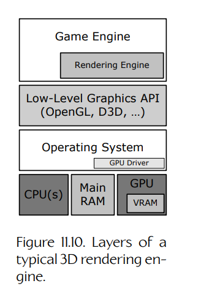

**Figure 11.10.** 典型 3D 渲染引擎的各层。

较高层有时被称为**应用程序阶段**（application stage），因为它可以被看作只是向管线其余部分馈送数据的又一个阶段。不过，OpenGL 和 DirectX 等图形 API 会将应用程序或渲染引擎视为 3D 图形管线的外部客户端。在本书中，我们将使用术语**应用程序**（application）或**应用层**（application layer，省略 “stage” 一词）来指代图形栈的最上层。

管线的每个阶段都可以消耗多个输入并产生多个输出，而且输入与输出的数据格式不必匹配。这意味着，管线可以生成结构与其所消耗数据完全不同的输出数据。以图形管线为例，三角形网格会从一端输入，同时还会输入网格材质属性的描述、场景中光源的描述，以及虚拟摄像机的描述。另一端则输出场景的一幅二维位图图像。

3D 图形管线通常由运行在 CPU 上的软件、固定功能 GPU 组件、GPU 专用驱动程序软件，以及运行在 GPU 本身上的软件共同实现。OpenGL、DirectX、Vulkan 和 Metal 等图形 API 提供了管线的标准化实现，应用程序可以对其进行配置和控制。这些图形 API 所提供的管线结构是固定的，但管线中某些阶段的操作可以由渲染程序员通过编写称为**着色器**（shaders）的小程序进行定制，这些小程序会直接运行在 GPU 上。我们将在 [Section 11.4](04-programming-the-3d-graphics-pipeline.md) 中深入讨论 3D 图形管线。

应用层通常实现为运行在 CPU 上的软件。它的设计、架构和实现方式在不同游戏引擎之间差异很大。

#### 11.3.1.5 模糊应用程序与管线之间的界线

应用程序与 3D 图形管线之间的界线，随着时间推移一直在图形栈中稳步上移。最早的 3D 图形管线完全由运行在 CPU 上的软件实现。3Dfx 公司的 Voodoo 图形加速器问世后，管线中最昂贵的后期阶段得以迁移到硬件上。GPU 的引入则使应用层更多职责能够转移到图形管线本身中。如今的渲染引擎会执行配置与场景管理，但会将实际渲染工作的绝大部分交给运行在 GPU 上的图形管线。

渲染引擎设计中的一个近期趋势，是甚至将应用层也转移到 GPU 上（以计算着色器的形式运行），从而释放 CPU 去执行其他与游戏引擎相关的工作。在这些引擎中，应用程序与管线之间的界线几乎已经模糊到不存在。随着**网格着色器**（mesh shaders）的引入（[Section 11.4.6.4](04-programming-the-3d-graphics-pipeline.md#11464-网格着色器管线)），GPU 上图形管线的设计本身也正在变得更少管线化、更偏向随机访问。本质上，这些引擎正重新走向一种更接近**保留模式**的渲染引擎设计。Unreal Engine 5 的 **Nanite** 渲染系统（[Section 11.6.8](06-geometry-processing-and-other-visual-effects.md#1168-虚拟化几何体与-nanite)）就是这种方法的典型例子；Naughty Dog 的渲染引擎也正在朝这个方向发展。

### 11.3.2 虚拟摄像机

**虚拟摄像机**（virtual camera）是渲染引擎用于合成图像的简化摄像机模型。虽然真实世界中的数字摄像机和胶片摄像机总是会使用透镜，但渲染引擎并不受曝光时间等问题约束。通过将虚拟摄像机建模为一个简单的针孔相机，就可以实现照片级真实感结果。这种简化确实意味着会丢失一些微妙的真实细节，例如镜头光晕、景深、焦外成像、暗角和鬼影。这些与透镜相关的效果可以通过各种方式“伪造”出来，但一些高级照片级真实感 3D 渲染引擎确实会采用真实透镜模型，以便把这类效果作为光传输模拟的副作用“免费”生成出来。

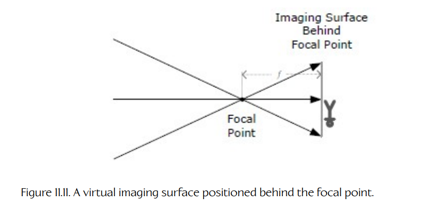

**Figure 11.11.** 位于焦点后方的虚拟成像表面。

#### 11.3.2.1 成像表面

我们可以进一步简化针孔相机模型。在真实的针孔相机中，矩形成像表面位于一个不透光外壳内部，如 [Figure 11.1](02-lights-camera-action.md#figure-111) 所示。但由于我们是在虚拟世界中工作，并不真正需要不透光外壳——只需保留针孔原本所在的焦点，并将成像表面放在其后方距离 $f$ 的位置，如 [Figure 11.11](#figure-1111) 所示。此外，回想一下，位于焦点后方成像表面上的图像是翻转的。为了避免这种翻转效果，可以简单地将虚拟成像表面移动到焦点前方距离 $-f$ 的位置，如 [Figure 11.12](#figure-1112) 所示。

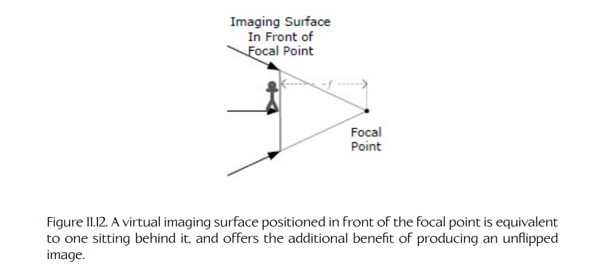

**Figure 11.12.** 位于焦点前方的虚拟成像表面，等价于位于焦点后方的成像表面，并且额外具有生成未翻转图像的好处。

这样做是可行的，因为任何会击中位于焦点后方成像矩形的光线，也都会穿过一个大小相同、位于同一个焦点前方相同距离处的成像矩形。

**Figure 11.13.** 大多数 3D 渲染引擎所使用的虚拟摄像机模型。摄像机的世界空间位置 $\mathbf{x}_{\mathrm{cam}}$ 被视为焦点的位置。摄像机的平面成像表面位于焦点前方距离 $-f$ 的位置，并被划分为虚拟图像传感器网格，对应于帧缓冲区中的像素。通过位于 $\mathbf{y}_j$ 的第 $j$ 个像素看到的最近可见表面点，标记为点 $\mathbf{x}_j$ 及其表面法线 $\mathbf{n}_j$。

#### 11.3.2.2 摄像机的局部坐标系

虚拟摄像机在场景中的位置通常被视为其焦点的位置。我们将这个点称为 $\mathbf{x}_{\mathrm{cam}}$。摄像机朝向的方向可以用一个单位向量 $\mathbf{f}_{\mathrm{cam}}$ 表示，我们称其为摄像机的**朝向向量**（facing vector，也称为 **front vector**）。朝向向量只指定摄像机的俯仰角和偏航角；若要指定其滚转角（换句话说，也就是它绕 $\mathbf{f}_{\mathrm{cam}}$ 轴的旋转），我们需要第二个向量。我们指定一个单位向量 $\mathbf{u}_{\mathrm{cam}}$，它从成像矩形的中心指向其上边缘。我们称其为摄像机的 **up 向量**。计算第三个单位向量 $\boldsymbol{\ell}_{\mathrm{cam}}$ 也很有用，它从成像矩形中心指向其左边缘。我们可以通过对 up 向量和 front 向量求叉积，计算这个 **left 向量**：

$$
\boldsymbol{\ell}_{\mathrm{cam}}
=
\operatorname{normalize}(\mathbf{u}_{\mathrm{cam}} \times \mathbf{f}_{\mathrm{cam}})
=
\frac{\mathbf{u}_{\mathrm{cam}} \times \mathbf{f}_{\mathrm{cam}}}
{\left|\mathbf{u}_{\mathrm{cam}} \times \mathbf{f}_{\mathrm{cam}}\right|}.
$$

这三个互相垂直的单位向量构成了一个右手坐标系的基，用于定义**观察空间**（view space）或**摄像机空间**（camera space）。我们将在 [Section 11.3.8.3](03-foundations-of-3d-rendering.md#11383-观察空间) 中讨论观察空间以及如何用矩阵表示它；但目前只需要把虚拟摄像机理解为在其焦点处附着了一个小坐标系即可。

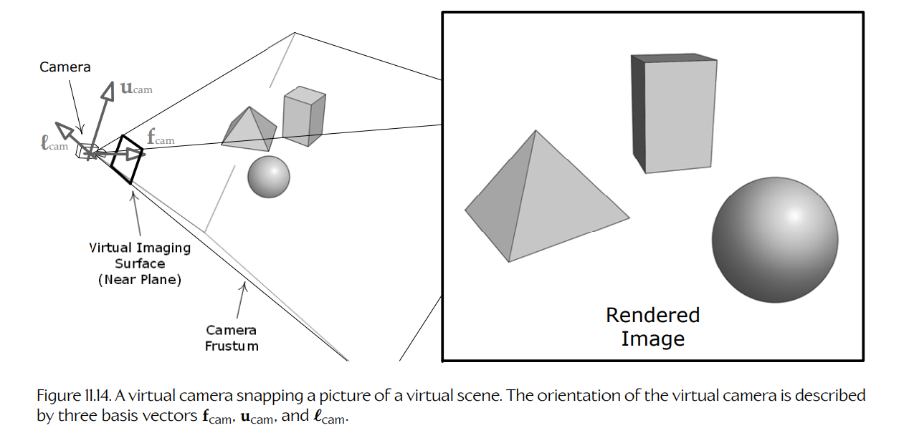

**Figure 11.14.** 虚拟摄像机为虚拟场景拍摄图像。虚拟摄像机的方向由三个基向量 $\mathbf{f}_{\mathrm{cam}}$、$\mathbf{u}_{\mathrm{cam}}$ 和 $\boldsymbol{\ell}_{\mathrm{cam}}$ 描述。

#### 11.3.2.3 视锥体

我们在 [Section 11.2.2.3](02-lights-camera-action.md#11223-视场与焦距) 中说过，摄像机的观察体积是一个金字塔，由穿过成像矩形四条边的四个平面围成。由于我们的虚拟摄像机将成像矩形放在焦点前方，因此它无法“看到”位于这个平面之后的任何物体。我们将这个第五个平面称为**近平面**（near plane）。当虚拟摄像机用于三角形光栅化时，通常还会对其进行限制，使其无法一直看到无穷远处。（在光线追踪引擎中，这种限制并不那么重要。）我们通常会定义第六个平面，它位于距离焦点很远的位置，并且与近平面平行；超出这个平面的任何内容都不会被渲染。它被称为**远平面**（far plane）。因此，虚拟摄像机能够成像的空间体积，是一个在两端都被截断的金字塔。这个被截断的金字塔体积称为摄像机的**视锥体**（frustum）。

[Figure 11.14](#figure-1114) 描绘了一台完整指定的虚拟摄像机，以及它将生成的虚拟场景图像。

### 11.3.3 位图图像

**位图图像**（bitmapped image，简称 **bitmap**）是一张二维表格，其中存放以数字编码的颜色数据，其单元称为**图像元素**（picture elements）或**像素**（pixels）。位图在 3D 渲染中被广泛使用。任何 3D 渲染引擎的输出都是一幅称为**帧缓冲区**（frame buffer）的位图图像。渲染引擎绘制图形的任何缓冲区，包括帧缓冲区或离屏图像，都称为**渲染目标**（render target）。位图图像还用于为虚拟场景中对象的外表面“上色”——在这种语境下，这类图像称为**纹理贴图**（texture maps），简称**纹理**（textures）。我们将在 [Section 11.3.14](#11314-纹理) 中更深入讨论纹理贴图。

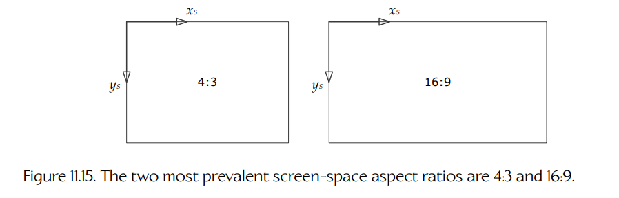

**Figure 11.15.** 两种最常见的屏幕空间宽高比是 4:3 和 16:9。

#### 11.3.3.1 分辨率与宽高比

位图图像中像素的总数称为图像的**分辨率**（resolution）。谈论数码相机生成的图像时，我们经常使用**百万像素**（megapixels）这一单位。一个百万像素等于一百万个像素，或者更精确地说，它等于 1,048,576，也就是 $2^{20}$ 个总像素。实际引用的数字通常只是粗略近似。例如，一台“1600 万像素”的相机可能生成尺寸为 $5312 \times 2988$ 像素的图像，实际上只有 1590 万像素……不过谁会去计较呢？

在计算机图形学领域，我们往往比数码相机公司的市场部门更精确一些。我们通常会用图像或帧缓冲区的像素**宽度**（width）或**高度**（height）来描述其分辨率，同时还会给出宽度与高度之比，这称为图像的**宽高比**（aspect ratio）。早期电视的宽高比为 4:3，称为**全屏**（fullscreen）分辨率。电影制作者更偏好更宽的 16:9 宽高比，这称为**宽屏**（widescreen）。电视最终也随之转向并开始支持宽屏格式。计算机显示器和现代电视可以以各种各样的分辨率和宽高比显示图像。不过，16:9 宽高比已经在某种程度上成为电影和游戏的标准。一些游戏支持所谓的**超宽屏**（ultrawide）宽高比，例如 21:9 或 32:9。当然，也有些电影会以更窄或更宽的格式制作。例如，IMAX 电影采用的宽高比实际上是高于其宽的格式（通常为 1:1.43 或 1:1.90）。宽高比如 [Figure 11.15](#figure-1115) 所示。

令人困惑的是，在指定位图图像的分辨率时，我们有时引用其宽度，有时又引用其高度。例如，“4K” 分辨率是一种 16:9 图像格式，其**宽度**约为 4000 像素。（精确地说，它的宽度为 3840 像素。）然而，这种图像格式也常被称为 2160p3，这里实际上引用的是图像的**高度**（精确地说是 2160 像素）。我们可以注意到 $16 \times 2160 = 9 \times 3840$，从而验证这是一个 16:9 宽高比。

> **脚注 3**：2160p 中的 “p” 代表**逐行扫描**（progressive scan），它指的是显示设备生成图像的方式。在逐行扫描中，图像一次从上到下生成一行。另一种方法称为**隔行扫描**（interlaced），它会分两次生成图像，分别由奇数行和偶数行组成。

#### 11.3.3.2 位图图像的颜色格式

在计算机图形学领域，图像的**颜色格式**（color format）描述颜色如何存储在图像像素中（无论是在磁盘上还是在内存中）。正如我们在 [Section 11.2.3](02-lights-camera-action.md#1123-色彩理论) 中学到的，颜色通常使用 RGB 格式编码，不过也可以使用其他编码方案，例如 HSL 或 LUV。图像的颜色格式不只是描述使用了哪种编码系统，它还精确描述每个颜色**通道**（color channel）如何存储在内存中，通道值是以浮点量还是整数形式编码，以及三个颜色通道值各自占用多少位。我们可以通过说明颜色格式的编码方式（例如 RGB）以及其占用的每像素总**位数**（bits per pixel）来概括一种颜色格式。

RGB 颜色空间将每种颜色编码为一个由实值数字构成的三元组，范围从 0 到所需的任意最大强度。因此，我们可以通过将三个通道分别编码为 32 位（4 字节）IEEE 浮点数，把 RGB 颜色存储在内存中。采用这种方式，位图图像中的每个像素将需要 12 字节存储空间，也就是惊人的每像素 96 位。这种内存密集型颜色格式通常由渲染引擎在内部用于执行光照计算。高精度非常重要，尤其是在我们希望支持**高动态范围**（high dynamic range, HDR）光照时。

计算机显示器和电视屏幕无法显示现实生活中出现的极宽光强范围。因此，在向帧缓冲区写入颜色时，渲染引擎会将颜色通道强度映射或钳制到 0 到 1 的范围内，对应于显示设备能够发出的最小和最大亮度。虽然我们仍然可以使用 32 位浮点数表示 0 到 1 范围内的值，但并不需要那么高的精度。因此，我们通常会将 0 到 1 的范围重新映射到一个更大的整数范围中，从而让每个通道占用更少的位数。

RGB888 格式每个颜色通道使用 8 位，因此总共为每像素 24 位。在这种格式中，每个通道的范围都是 0 到 255（十六进制中为 0x0 到 0xFF）。RGB565 格式只为红色和蓝色各使用 5 位，为绿色使用 6 位，因此总共为每像素 16 位。如果我们并不关心色相，而只想存储每个像素的强度，就可以进一步节省内存。这类**灰度图像**（greyscale image）通常使用一种称为 I8 的格式，表示它将每个像素的强度存储为单个 8 位字节。（这种格式有时称为 R8，因为我们可以把它看作一种只使用红色通道来编码强度的 RGB888 格式。）

在位图图像中存储颜色的另一种方式，是使用**调色板**（color palette）。我们不直接在每个像素中存储 RGB 颜色，而是在旁边创建一张表，以任意我们喜欢的格式编码有限数量的不同颜色。然后，每个像素只需要存储少量位，用作这张颜色表的索引。这种格式在早期 2D 像素美术中很流行，因为这种小尺寸、低分辨率图像通常本来也只包含少数几种不同颜色。

**不透明度与 Alpha 通道。**

RGB 颜色向量后面经常会附加第四个通道，称为 **alpha**。Alpha 测量对象的不透明度，值为 0 表示完全透明，值为 1 表示完全不透明。在基于光线追踪的渲染引擎中，Alpha 并不是特别有用，但在基于深度缓冲三角形光栅化技术构建的渲染器中，它被广泛用作一种“hack”，用于解释光穿过参与介质时的透射情况。

当 RGB 颜色格式扩展为包含 alpha 时，根据 alpha 位于三个颜色分量之前还是之后，它被称为 RGBA 或 ARGB。例如，RGBA8888 是一种每像素 32 位格式，其中红、绿、蓝和 alpha 各占 8 位。RGBA5551 是一种每像素 16 位格式，其中 alpha 只有 1 位；在这种格式中，像素要么完全不透明，要么完全透明。

**高动态范围颜色：Log-LUV。**

在**高动态范围渲染**（high dynamic range rendering）中，光照计算结果会存储在输出图像的像素中，而不会将得到的强度钳制到 0 到 1 的范围内。其净效果是，图像中极暗与极亮区域都能在不丢失细节的情况下得到表示。log-LUV 颜色模型是 HDR 光照的一种常见选择。在该模型中，颜色表示为一个强度通道 $(L)$ 和两个色度通道 $(U, V)$。由于人眼对强度变化比对色度变化更敏感，因此 $L$ 通道使用 16 位存储，而 $U$ 和 $V$ 各只使用 8 位。此外，为了捕捉极宽的光强范围，$L$ 使用对数尺度（以 2 为底）表示。关于 log-LUV 格式的更多细节，可查看 Silicon Graphics, Inc. 的 Gregory Ward Larson 的论文：[229]。

**高动态范围颜色：FP16。**

另一种存储高动态范围颜色的方式，是为 $R$、$G$ 和 $B$ 三个通道各使用 16 位，并且每个通道都以浮点值存储。将浮点值编码进 16 位的方法有很多种，但大多数 GPU 支持的标准称为 IEEE 754-2008。这种格式简称为 **FP16**。和它的 32 位亲戚一样（详见 Section 3.3.1.4），FP16 格式使用最高有效位编码浮点数的符号，并使用带偏置的指数和带隐含 1 位的尾数。不过，与 FP32 格式不同，FP16 的指数只占 5 位，尾数被打包到剩余 10 位中（如果把隐含的 1 位也计算在内，则相当于 11 位）。

### 11.3.4 帧缓冲区

视频硬件为在显示器或电视上显示而扫描的内存缓冲区，通常称为**帧缓冲区**（frame buffer）。在最早的个人计算机中，帧缓冲区位于主 RAM 中。随着显卡和 GPU 的引入，帧缓冲区如今位于显卡上的特殊内存中。我们称这种内存为**视频 RAM**（video RAM）或 VRAM。

帧缓冲区是一幅位图图像。DirectX 等图形 API 允许程序员将帧缓冲区配置为各种格式，包括高动态范围（HDR）格式，但最终显示在屏幕上的图像必须采用一种扫描图像并将其显示到屏幕上的视频硬件所能“理解”的格式。这通常是一种带有可选 alpha（A）通道的 RGB 格式。（如果存在 alpha 通道，显示硬件会忽略它，但它在渲染过程中的合成操作中很有用。）

早期光栅显示器支持各种预先配置的**视频模式**（video modes），这些模式为每个像素规定特定的颜色格式。当今基于 GPU 的显卡上的显示硬件通常支持 sRGB 格式，其中颜色存储在线性空间中，并由硬件自动应用 gamma 校正（见 [Section 11.3.4.2](03-foundations-of-3d-rendering.md#11342-伽马校正)）。如果渲染引擎输出 HDR 格式图像，那么它需要负责执行一个**色调映射**（tone mapping）步骤，将 HDR 颜色转换为适合显示的 sRGB 编码。

#### 11.3.4.1 双缓冲与三缓冲

为了制造运动幻觉，渲染引擎会快速生成虚拟世界的图像（通常为每秒 30 或 60 帧）。如果渲染引擎在视频输出硬件读取帧缓冲区的同时向帧缓冲区写入数据，可能会产生一种丑陋的伪影，称为**撕裂**（tearing）：显示图像的下半部分显示来自上一帧的旧数据，而上半部分则包含来自新渲染帧的完整或部分绘制结果。为了解决这个问题，大多数渲染引擎都采用**双缓冲**（double-buffered）。这意味着会分配两个帧缓冲区：一个供引擎渲染，称为**后缓冲区**（back buffer）；另一个供视频硬件读取，称为**前缓冲区**（front buffer）。每一帧，当视频硬件完成对帧缓冲区的一次完整扫描，并且渲染引擎完成绘制之后，就会触发一次**翻转**（flip），交换两个缓冲区的角色。前缓冲区和后缓冲区合在一起，会形成一条相互连接的缓冲区“链”，称为**交换链**（swap chain）。

**Figure 11.16.** 三缓冲的交换链。翻转之前，显示适配器扫描缓冲区 2 中的第 $N$ 帧，同时渲染引擎将第 $N + 1$ 帧绘制到缓冲区 3；随后它开始将第 $N + 2$ 帧绘制到缓冲区 1。翻转之后，第 $N + 1$ 帧通过扫描缓冲区 3 显示出来，同时渲染引擎完成将第 $N + 2$ 帧绘制到缓冲区 1；随后它继续将第 $N + 3$ 帧绘制到缓冲区 2。

一些渲染引擎会使用三个帧缓冲区。这种技术恰当地称为**三缓冲**（triple buffering）。在这种方法中，交换链由一个前缓冲区和两个后缓冲区组成，它们首尾相接形成一个环。（如 [Figure 11.16](#figure-1116) 所示。）每次发生翻转时，三个缓冲区的角色都会在这个环中移动一个“槽位”：前缓冲区变为后缓冲区 B，后缓冲区 B 变为后缓冲区 A，而后缓冲区 A 则变为前缓冲区。当渲染引擎渲染单帧所用时间短于显示设备刷新周期时，三缓冲交换链的好处就会显现出来。一旦渲染引擎完成将第 $N$ 帧绘制到后缓冲区 A，它就可以立即开始将第 $N + 1$ 帧渲染到后缓冲区 B，而无需等待下一次翻转。

如今许多显示设备支持一种称为**可变刷新率**（variable refresh rate, VRR）的技术。它允许显卡上的视频硬件直接控制显示设备的刷新率，使其与游戏渲染帧的速率同步。这项技术可以消除撕裂，并通过让引擎不必等到显示设备下一次刷新才翻转帧缓冲区，来提高渲染效率。

#### 11.3.4.2 伽马校正

将一种颜色从钳制浮点格式转换为 RGB888，需要将每个通道从 $[0,1]$ 范围映射到 $[0,255]$ 范围。我们可以通过计算 $C_{8\text{-bit}} = 255 C_{\mathrm{float}}$ 来**线性**执行这种映射。然而，人类对亮度的感知本质上是非线性的——在低光照条件下，我们对亮度变化比在明亮光照条件下更敏感。这意味着，线性映射会在亮度频谱的高端浪费宝贵精度，而在那里人眼并不那么敏感；同时，在最需要精度的低端又会出现精度不足。这个问题如 [Figure 11.17](#figure-1117) 所示。

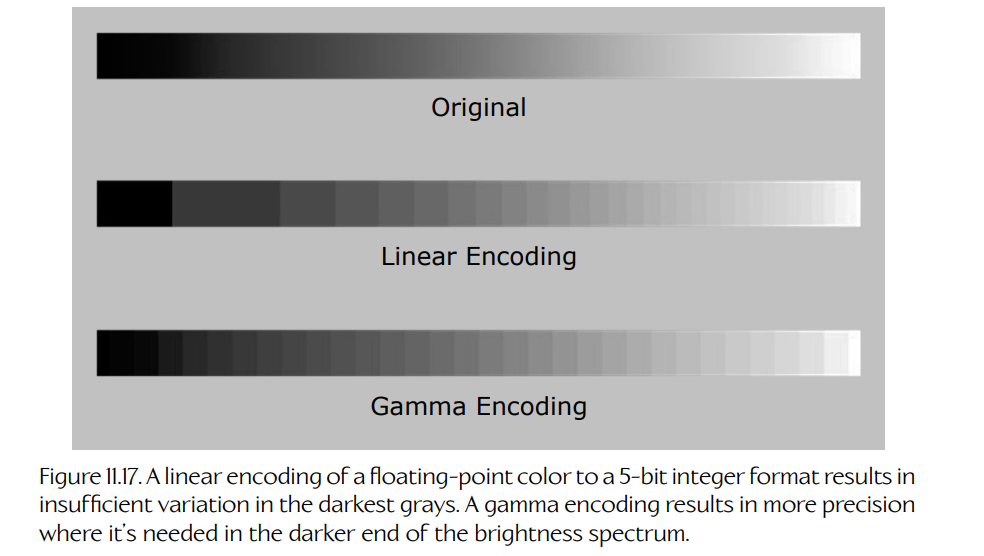

**Figure 11.17.** 将浮点颜色线性编码为 5 位整数格式，会导致最暗灰阶中的变化不足。Gamma 编码会在亮度频谱较暗端这种最需要精度的区域提供更高精度。

因此，当浮点颜色被编码为整数格式时，通常会对它应用一条 **gamma 校正**（gamma correction）曲线。这意味着将每个颜色通道的值提升到指数 $\gamma$，如下所示：

$$
C_{\mathrm{out}} = C_{\mathrm{in}}^\gamma.
\tag{11.1}
$$

$\gamma < 1$ 的值称为**编码 gamma**（encoding gamma），此时 Equation (11.1) 是一个 **gamma 压缩**（gamma compression）函数。这类函数会在将线性浮点颜色信息存储到位图图像时使用。当 $\gamma > 1$ 时，它是**解码 gamma**（decoding gamma），该等式则变为 **gamma 扩展**（gamma expansion）或 **gamma 解压缩**（gamma decompression）函数。在这种形式下，该函数通常用于“撤销”gamma 压缩的效果。所有光照计算都需要在线性空间中执行，因此，例如在从内存加载经过 gamma 压缩的位图并将其转换回浮点值以用于着色时，就可以使用 gamma 扩展。

Gamma 校正这一概念最初出现，是因为旧式 CRT 显示器对输入信号具有非线性响应：显示像素的实际亮度，等于输入信号的亮度提升到一个大约为 $\gamma = 2.2$ 的正（解码）gamma。虽然现代显示设备并不受 CRT 技术约束，也没有固有的 gamma 响应曲线，但它们为了保持一致性，会模拟旧式显示技术的行为。因此，当渲染引擎将输出颜色写入帧缓冲区时，必须对其进行 gamma 编码；显示设备本身会撤销该 gamma 编码，从而让正确的（线性）亮度到达观察者眼睛。

#### 11.3.4.3 帧缓冲图像平面

帧缓冲区的主要任务，是存储输出图像中每个像素的颜色信息。我们可以扩展帧缓冲区，让它也存储其他类型的非颜色信息。实现这一点的方法，是定义一个或多个额外的二维数据数组，其尺寸与颜色缓冲区相同。这些额外图像的像素可以包含任意数据。我们可以把帧缓冲区看作物理上由多个**图像平面**（image planes）组成：一个平面用于存储颜色信息，其他平面用于存储各种其他逐像素数据。

**深度缓冲区。**

正如我们将在 [Section 11.3.10](03-foundations-of-3d-rendering.md#11310-光栅化) 中看到的，三角形光栅化算法会使用一个辅助缓冲区来存储每个已渲染像素的深度信息。深度只是衡量被光栅化的三角形距离虚拟摄像机成像平面有多远的量。这个图像平面恰当地称为**深度缓冲区**（depth buffer）。由于深度缓冲区中每个像素存储的是投影到屏幕上的 4D 齐次点的 $z$ 或 $w$ 分量，因此深度缓冲区有时也称为 **z-buffer** 或 **w-buffer**。

深度值可以以多种格式存储在深度缓冲区的像素中。深度缓冲区通常会与另一个称为**模板缓冲区**（stencil buffer）的缓冲区一起配置，因此我们通常将它们合称为一个**深度/模板图像平面**（depth/stencil image plane）。最早的 GPU 使用每像素 32 位的深度/模板格式，其中深度以 24 位定点格式存储，剩余每像素 8 位可作为模板值使用。今天的 GPU 支持更广泛的深度缓冲区格式，包括 16 位和 32 位浮点深度。

**模板缓冲区。**

**模板缓冲区**（stencil buffer）的每个像素通常存储一个 8 位整数（不过大多数 GPU 也支持其他位深度）。模板缓冲区中的整数可用于多种用途，包括统计一个像素被渲染的次数，或者为每个像素编码一个唯一标识符。例如，我们可以决定将敌方 NPC 与值 1 关联起来，并将所有其他几何体的值设为 0。场景渲染完成后，我们就可以通过检查某个像素处模板缓冲区的值是否等于 1，来判断任意给定像素是否表示一个敌人。

模板缓冲区也可以用于**传送门渲染**（portal rendering），如 Valve 那款极其流行的同名游戏中所见。在这种技术中，主场景可能被赋予模板值 0，橙色传送门被赋予值 1，蓝色传送门被赋予值 2。主场景渲染完成后，模板缓冲区中只有与橙色或蓝色传送门对应的像素才会分别包含值 1 或 2。随后，我们可以限制 GPU 只绘制模板值为 1 的像素，并从橙色传送门的视角重新渲染场景。同样，我们也可以配置 GPU 只绘制模板值为 2 的像素，并从蓝色传送门的视角重新渲染场景。最终结果看起来就像观察者正透过橙色和蓝色传送门向外窥视，如 [Figure 11.18](#figure-1118) 所示。

**Figure 11.18.** 左：Valve Corporation 的热门游戏《Portal》截图。右：一个可能用于三遍渲染该场景的模板缓冲区——一遍用于主场景，一遍用于从橙色传送门看到的场景，一遍用于从蓝色传送门看到的场景。

**G-Buffer。**

作为图形程序员，你可以定义任意数量的辅助帧缓冲图像平面。这对于在屏幕空间中执行光照计算尤其有用。一个这样的平面可能存储屏幕空间速度向量，另一个可能存储屏幕空间表面法线向量。当帧缓冲区包含的不只是颜色平面、深度平面和模板平面时，它通常被称为 **G-buffer**。我们将在 [Section 12.5.12](../12-lighting-and-post-processing/05-lighting-with-triangle-rasterization.md#12512-延迟渲染) 中更深入讨论 G-buffer 的使用。

### 11.3.5 场景几何

光的大多数有趣行为都发生在不同材料之间的**边界**（boundaries）处。这些边界分为两类：固体对象的表面，以及不同种类透光介质之间的**界面**（interfaces）。我们将这两类边界统称为广义的**表面**（surfaces）。游戏开发者经常将这些表面称为**场景几何**（scene geometry），简称**几何**（geometry）。

我们可以把任意空间体积看作被划分为若干子体积，每个子体积包含不同类型的材料，并且每个子体积都由一个表面界定。因此，对于 3D 渲染而言，我们可以将大多数场景描述为一组表面，以及关于这些表面所包围子体积内部包含何种材料的信息。场景的表面表示使我们能够处理不透明对象，以及被参与介质和非参与介质占据的空间体积。

像烟、雾或爆炸这样的无定形材料没有明确边界。但我们仍然可以将这类参与介质建模为具有明确表面边界的体积。“诀窍”在于允许材料属性在体积内部发生变化。例如，表示一团烟云的体积可以在其表面处是透明且非参与的，但朝体积内部逐渐变得更加半透明，甚至不透明。

还有一些非物理方法可以生成看起来像烟、雾或火焰的视觉效果。例如，面向摄像机的扁平卡片可以用于模拟烟团、爆炸、体积光等等。这些基于卡片的方法称为**粒子系统**（particle systems）。粒子效果与当前讨论无关，但我们将在 [Section 11.6.5](06-geometry-processing-and-other-visual-effects.md#1165-粒子效果) 中更详细地探讨它们。

#### 11.3.5.1 解析曲面

真实物质由粒子构成，这意味着现实生活中材料之间的边界总是“凹凸不平”且不规则。不过，为了进行计算机图像合成，我们会忽略这些微观细节，并使用**理想化**的数学曲面来描述场景中事物之间的边界。

在数学中，**曲面**（surface）是嵌入三维空间中的二维流形。曲面有时可以用**解析形式**（analytically）描述。例如，以点 $\mathbf{c}$ 为中心的球面，其解析表示由熟悉的方程给出：

$$
(x - c_x)^2 + (y - c_y)^2 + (z - c_z)^2 = r^2,
$$

或者用向量形式写作：

$$
(\mathbf{x} - \mathbf{c}) \cdot (\mathbf{x} - \mathbf{c}) = r^2.
$$

在这个方程中，$\mathbf{c} = (c_x, c_y, c_z)$ 是球心，而 $\mathbf{x} = (x, y, z)$ 表示球面上的任意点。

可渲染场景几何中出现的大多数形状都不能用解析形式描述。在 3D 图形学中，任意复杂的曲面通常通过将其分解为更简单几何图元的拼接来近似表示。在接下来的几节中，我们将简要概览若干常用方法，它们通过将曲面分解为图元形状的拼接来描述曲面。

不过需要注意的是，解析球面和平面在游戏引擎中确实有许多用途。例如，它们经常用于描述碰撞体积、包围体积或触发区域。解析形状也可以作为基于光线追踪的渲染引擎编写过程中的简单测试用例。

#### 11.3.5.2 参数曲面

在电影产业中，曲面通常由一组矩形**面片**（patches）表示，每个面片由少量控制点定义的二维**样条曲线**（spline）形成。这些曲面统称为**参数曲面**（parametric surfaces）。

可以使用各种类型的样条，包括 Bézier 曲面（例如双三次面片，也就是三阶 Bézier 曲面——更多信息见 [230]）、非均匀有理 B 样条（NURBS）[231]、Bézier 三角形和 **N-patches**（也称为 **normal patches**）。使用面片建模有点像用小矩形布片或纸浆片覆盖一座雕像。

像 Pixar 的 RenderMan 这样的高端电影渲染引擎，会使用**细分曲面**（subdivision surfaces）来定义几何形状。每个曲面由一个控制多边形网格（非常类似于样条）表示，但这些多边形可以使用 Catmull-Clark 算法进一步细分为越来越小的多边形。这种细分通常持续进行，直到单个多边形小于一个像素。该方法最大的好处在于，无论摄像机距离曲面多近，都可以进一步细分曲面，从而让其轮廓边缘看起来不会有多面体感。若想了解更多关于细分曲面的内容，可以查看以下文章：[232]、[233]、[234] 和 [235]。

#### 11.3.5.3 三角形网格

游戏开发者传统上使用**三角形网格**（triangle meshes）为曲面建模。三角形是实时渲染中首选的多边形，因为它具有以下理想性质：

- **三角形是最简单的多边形类型。** 少于三个顶点，就根本无法形成一个表面。

- **三角形总是平面的。** 具有四个或更多顶点的任意多边形未必具有这一性质，因为前三个顶点定义了一个平面，但第四个顶点可能位于该平面之上或之下。

- **在大多数类型的变换下，三角形仍然保持为三角形，包括仿射变换和透视投影。** 最坏情况下，从边缘方向观察到的三角形会退化为一条线段。在其他任何方向下，它仍保持为三角形。

- **几乎所有商用图形加速硬件都是围绕三角形光栅化设计的。** 从最早的 PC 3D 图形加速器开始，渲染硬件几乎就完全围绕三角形光栅化进行设计。这一决定可以一路追溯到最早为 3D 游戏开发的软件光栅化器，例如 id Software 的《Doom》和 Blue Sky Productions 的《Ultima Underworld: The Stygian Abyss》。

三角形网格可以作为任意曲面的**分段线性近似**（piecewise linear approximation），其方式非常类似于一系列相连线段可以作为函数或曲线的分段线性近似。这个思想如 [Figure 11.19](#figure-1119) 所示。通过将三维曲面分解为三角形来近似它的过程称为**镶嵌化**（tessellation）。

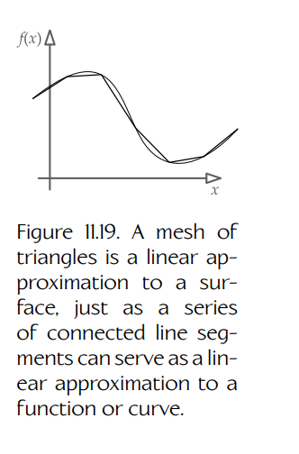

**Figure 11.19.** 三角形网格是对曲面的线性近似，就像一系列相连线段可以作为函数或曲线的线性近似一样。

### 11.3.6 三角形网格的解剖结构

在基于光栅化的渲染器中，所有场景几何要么一开始就表示为三角形网格，要么表示为更高阶的参数曲面，并在光栅化之前由图形管线**镶嵌化**（tessellated）为三角形。术语 “tessellation” 描述的是将曲面划分为一组离散多边形的过程。这些多边形通常要么是四边形（也称为 **quads**），要么是三角形。术语**三角化**（triangulation）有时用于指将曲面镶嵌化为三角形。

对于任意给定的光滑弯曲 3D 曲面，都有无数种方式可以对其进行镶嵌化。因此，镶嵌化是一门艺术，它涉及谨慎选择每个曲面的三角化密度（通常，曲率很高或包含大量细节的曲面需要更高密度）、对象从不同观察角度看起来的轮廓，以及如何放置各个三角形，使它们在应用蒙皮动画时能够正确变形。3D 建模师会使用自动化工具执行镶嵌化（因为逐个三角形手动镶嵌化模型是不现实的），但这些工具也给予艺术家大量控制权，使其能够精确控制每个曲面如何被三角化。

#### 11.3.6.1 顶点、边与绕序

一个三角形由三个**顶点**（vertices）组成；每个顶点表示 3D 空间中的一个点。我们可以将一个三角形的顶点位置表示为 $\mathbf{p}_1$、$\mathbf{p}_2$ 和 $\mathbf{p}_3$。顶点按照顺时针或逆时针顺序列出，这称为三角形的**绕序**（winding order）；这个概念如 [Figure 11.20](#figure-1120) 所示。

三角形的边可以通过简单地相减相邻顶点的位置向量得到。例如：

$$
\mathbf{e}_{12} = \mathbf{p}_2 - \mathbf{p}_1,
$$

$$
\mathbf{e}_{23} = \mathbf{p}_3 - \mathbf{p}_2,
$$

$$
\mathbf{e}_{31} = \mathbf{p}_1 - \mathbf{p}_3.
$$

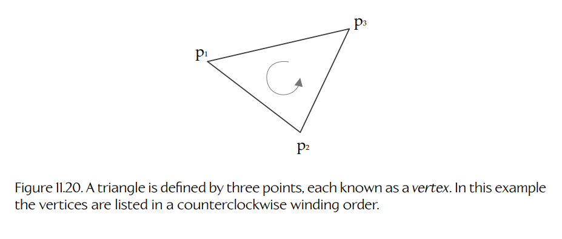

**Figure 11.20.** 三角形由三个点定义，每个点称为一个顶点。在这个例子中，顶点按照逆时针绕序列出。

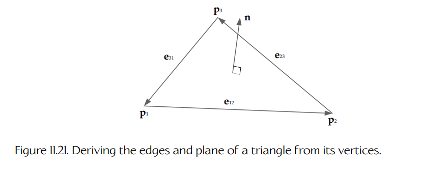

**Figure 11.21.** 由三角形顶点推导其边和平面。

任意两条边的归一化叉积定义了单位**面法线**（face normal）$\mathbf{n}$：

$$
\mathbf{n}
=
\frac{\mathbf{e}_{12} \times \mathbf{e}_{13}}
{\left|\mathbf{e}_{12} \times \mathbf{e}_{13}\right|}
=
\frac{\mathbf{e}_{12} \times -\mathbf{e}_{31}}
{\left|\mathbf{e}_{12} \times -\mathbf{e}_{31}\right|}.
$$

这些推导如 [Figure 11.21](#figure-1121) 所示。

**背面剔除。**

保持三角形绕序与面法线方向的一致性非常重要。例如，如果我们决定一个闭合对象的面法线应指向外部（即远离对象内部），那么我们应对场景中的所有几何体都采用这一约定。这样做的一个原因，是支持一种称为**背面剔除**（backface culling）的优化。我们将在 [Section 11.5.1](05-pipeline-management-the-application-layer.md#1151-剔除与可见性判定) 中讨论剔除。

#### 11.3.6.2 顶点属性

除了位置信息之外，在三角形网格的顶点中存储额外信息非常有用。典型三角形网格会在每个顶点处包含以下部分或全部属性。作为渲染工程师，我们当然也可以自由定义任何额外属性，以实现屏幕上期望的视觉效果。

- **位置向量**：$\mathbf{p} = (p_x, p_y, p_z)$。这是顶点的 3D 位置。它通常在对象局部坐标空间中指定，这个空间称为**模型空间**（model space）。

- **顶点法线**：$\mathbf{n} = (n_x, n_y, n_z)$。这个向量定义了顶点位置处的单位表面法线。它用于逐顶点动态光照计算。

- **顶点切线**：$\mathbf{t} = (t_x, t_y, t_z)$ 与  
  **顶点副切线**：$\mathbf{b} = (b_x, b_y, b_z)$。这两个单位向量彼此垂直，并且也垂直于顶点法线。向量 $\mathbf{n}$、$\mathbf{t}$ 和 $\mathbf{b}$ 共同定义了一组称为**切线空间**（tangent space）的坐标轴，如 [Section 12.2.2.1](../12-lighting-and-post-processing/02-radiometry-and-the-theory-of-light-transport.md#12221-切线空间与单位半球) 中所介绍的。这个空间用于各种逐像素光照计算，例如法线贴图和环境贴图。

- **漫反射颜色**：$\mathbf{C}_{\mathrm{diff}} = (R_{\mathrm{diff}}, G_{\mathrm{diff}}, B_{\mathrm{diff}}, A_{\mathrm{diff}})$。这个四元素向量描述表面的漫反射颜色，以 RGB 颜色空间表示。它通常还包含顶点位置处表面不透明度或 **alpha** $(A)$ 的指定。这个颜色可以离线计算（静态光照），也可以在运行时计算（动态光照）。

- **镜面反射颜色**：$\mathbf{C}_{\mathrm{spec}} = (R_{\mathrm{spec}}, G_{\mathrm{spec}}, B_{\mathrm{spec}}, A_{\mathrm{spec}})$。这个量描述当光从光亮表面直接反射到虚拟摄像机成像平面时，应当出现的镜面高光颜色。

- **纹理坐标**：$\mathbf{u}_j = (u_j, v_j, w_j)$。纹理坐标允许将二维或有时三维的位图“收缩包裹”到网格表面上，这一过程称为**纹理映射**（texture mapping）。二维纹理坐标 $(u, v)$ 描述某个特定顶点在纹理二维归一化坐标空间中的位置；三维纹理坐标 $(u, v, w)$ 同样用于定位该顶点在归一化三维纹理空间中的位置。一个三角形可以映射多个纹理，因此它可以拥有多组纹理坐标。我们用下标 $j$ 表示不同的纹理坐标集。我们将在 [Section 11.3.14](#11314-纹理) 中深入讨论纹理。

- **蒙皮权重**：$\mathbf{k}_j = (k_j, w_j)$。在骨骼动画中，网格的顶点会附着到关节式骨架中的各个关节上。在这种情况下，每个顶点必须通过索引 $k$ 指明它附着到哪个关节。一个顶点可以受到多个关节影响，此时最终顶点位置将成为这些影响的加权平均值。因此，每个关节影响的权重用权重因子 $w$ 表示。一般来说，一个顶点可以有多个关节影响，每个影响都以下标 $j$ 标识。

#### 11.3.6.3 三角形列表

为了让图形管线渲染一个三角形网格，必须以某种方式将它存储在 VRAM 中。网格的各个顶点存储在一个数组中，该数组在 DirectX 中称为**顶点缓冲区**（vertex buffer），在 OpenGL 中称为**顶点数组**（vertex array）。将这些顶点连接为三角形的最直接方式，是把它们以每组三个的形式放入顶点缓冲区中，每个三元组对应网格中的一个三角形。这种数据结构称为**三角形列表**（triangle list），如 [Figure 11.22](#figure-1122) 所示。

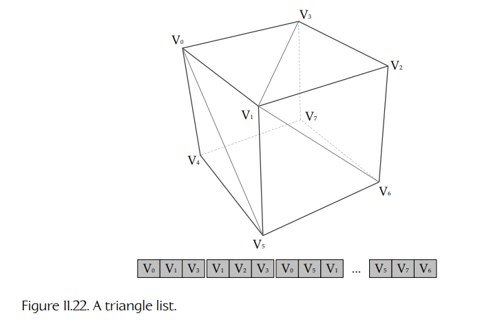

**Figure 11.22.** 三角形列表。

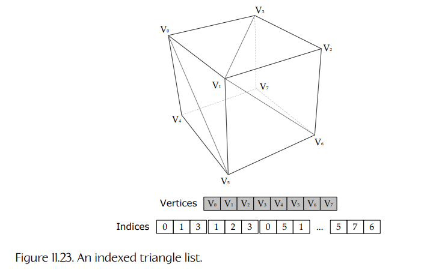

**Figure 11.23.** 索引三角形列表。

#### 11.3.6.4 索引三角形列表

你可能已经注意到，[Figure 11.22](#figure-1122) 中三角形列表里的许多顶点都被重复了，而且通常会重复多次。由于我们经常会在每个顶点中存储大量属性数据，因此在三角形列表中重复顶点会浪费内存。它也会浪费 GPU 带宽，因为重复的顶点会被多次变换和光照计算。

因此，渲染引擎通常使用一种更高效的数据结构，称为**索引三角形列表**（indexed triangle list）。其基本思想是：每个顶点只在顶点缓冲区中存储一次（不重复存储顶点），然后使用轻量级的顶点**索引**（indices）来定义构成三角形的顶点三元组。这些索引存储在一个辅助缓冲区中，在 DirectX 中称为**索引缓冲区**（index buffer），在 OpenGL 中称为**索引数组**（index array）。对于小型网格（顶点数不超过 65,536），每个索引可以用 16 位整数表示；对于更大的网格，通常使用 32 位整数索引。该技术如 [Figure 11.23](#figure-1123) 所示。

#### 11.3.6.5 三角形带与三角形扇

有时游戏渲染会使用称为**三角形带**（triangle strips）和**三角形扇**（triangle fans）的专用网格数据结构。这两种数据结构都消除了对索引缓冲区的需求，同时仍然在一定程度上减少了顶点重复。它们通过预先定义顶点出现的顺序以及顶点如何组合成三角形来实现这一点。

在三角形带中，前三个顶点定义第一个三角形。之后的每个顶点都会与其前两个相邻顶点一起构成一个全新的三角形。为了保持三角形带的绕序一致，在每个新三角形之后，前两个相邻顶点会交换位置。三角形带如 [Figure 11.24](#figure-1124) 所示。

在三角形扇中，前三个顶点定义第一个三角形，而之后的每个顶点都会与前一个顶点以及三角形扇中的第一个顶点一起定义一个新的三角形。该结构如 [Figure 11.25](#figure-1125) 所示。（今天的 GPU 已经不能再渲染三角形扇，因为支持它们所需的硬件成本被认为超过了它们带来的收益。）

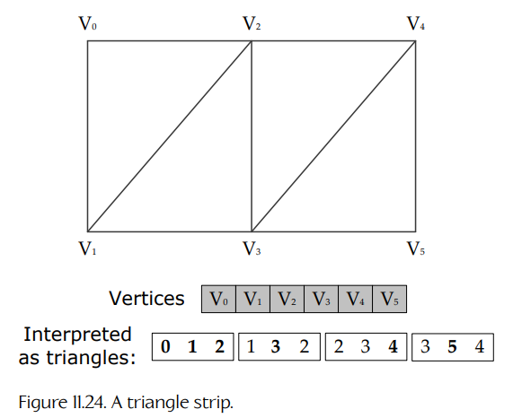

**Figure 11.24.** 三角形带。

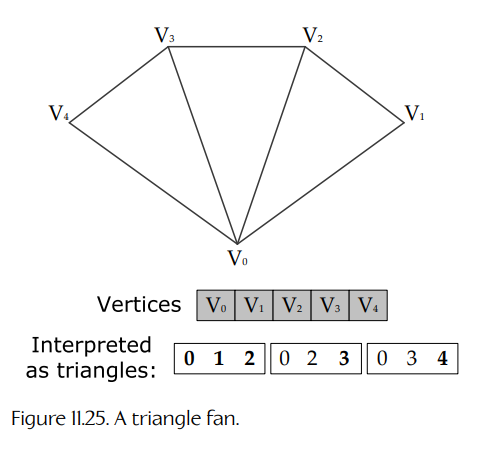

**Figure 11.25.** 三角形扇。

#### 11.3.6.6 顶点格式

描述单个顶点的一组属性，可以用 C 风格的 `struct` 表达，其布局称为**顶点格式**（vertex format）。不同网格需要不同的属性组合，因此需要不同的顶点格式。下面是一些常见顶点格式的示例：

    // 最简单的顶点格式——只有位置
    // （可用于阴影体拉伸、轮廓边缘检测、
    // 卡通渲染、z-pre-pass 等）
    struct Vertex1P
    {
        Vector3  m_p;  // position
    };

    // 一种典型的顶点格式，包含位置、顶点法线
    // 和一组纹理坐标。
    struct Vertex1P1N1UV
    {
        Vector3  m_p;       // position
        Vector3  m_n;       // vertex normal
        F32      m_uv[2];   // (u, v) texture coordinate
    };

    // 一个蒙皮顶点，包含位置、漫反射和镜面反射
    // 颜色，以及四个加权关节影响。
    struct Vertex1P1D1S2UV4J
    {
        Vector3  m_p;        // position
        Color4   m_d;        // diffuse color and translucency
        Color4   m_s;        // specular color
        F32      m_uv0[2];   // first set of tex coords
        F32      m_uv1[2];   // second set of tex coords
        U8       m_k[4];     // four joint indices, and...
        F32      m_w[3];     // three joint weights, for
                              // skinning (fourth is calc'd
                              // from the first three)
    };

顶点缓冲区可以描述为由这些顶点格式结构体之一构成的扁平数组。不过，顶点属性可能的排列组合数量非常大，因此渲染引擎所需的不同顶点格式结构体声明数量也可能变得极其庞大。过去，管理所有这些顶点格式曾是图形程序员头疼的常见来源。

幸运的是，今天的 GPU 允许多个同质的顶点属性数组被动态交错。我们不必定义一个 `Vertex1P1N1UV` 类型的顶点数组，并将该数组作为单个顶点缓冲区直接传递给 GPU；相反，可以定义三个数组——一个用于顶点位置，一个用于法线，一个用于纹理坐标。这三个数组可以存储在三个独立的顶点缓冲区中，也可以一个接一个地存储在一个大型顶点缓冲区中。然后，我们可以要求图形 API 将第 $i$ 个位置、第 $i$ 个法线和第 $i$ 个纹理坐标交错起来，并把它们传递给顶点着色器，就好像它们是 `Vertex1P1N1UV` 结构体的一个实例一样。在 DirectX 11 中，这通过 `ID3D11Device::CreateInputLayout` 函数完成，并使用 `D3D11_INPUT_ELEMENT_DESC` 结构体来描述每个交错分量。在 OpenGL 中，`glVertexAttribPointer` 函数起到类似作用。由于 GPU 具备这一特性，管理顶点格式对渲染程序员来说已经不再那么令人头疼。

#### 11.3.6.7 顶点缓存优化

当 GPU 处理索引三角形列表时，每个三角形都可以引用顶点缓冲区中的任意顶点。顶点必须按照它们在三角形中出现的顺序进行处理，因为每个三角形的完整性必须为光栅化阶段保留下来。当顶点由顶点着色器处理时，它们会被缓存起来以供复用。如果后续图元引用了一个已经位于缓存中的顶点，则会直接使用它已经处理好的属性，而不必重新处理该顶点。

使用三角形带的部分原因在于，它们可能节省内存（不需要索引缓冲区）；另一部分原因在于，它们往往能够改善 GPU 对视频 RAM 进行内存访问时的缓存一致性。更进一步，我们还可以使用**索引带**（indexed strip）来几乎消除顶点重复（这通常比消除索引缓冲区更能节省内存），同时仍然获得带状顶点排序所带来的缓存一致性收益。

索引三角形列表也可以进行缓存优化，而不必局限于带状顶点顺序。**顶点缓存优化器**（vertex cache optimizer）是一种离线几何处理工具，它会尝试以能够优化缓存中顶点复用的顺序列出三角形。它通常会考虑多种因素，例如某类 GPU 上存在的顶点缓存大小，以及 GPU 用于决定何时缓存顶点、何时丢弃顶点的算法。例如，Sony 的 Edge 几何处理库中为 PlayStation 提供的顶点缓存优化器，可以实现比三角形带最多高出 4% 的渲染吞吐率。在非 PlayStation 平台上，NVIDIA 的 Nsight™ 和 Microsoft 的 DirectXMesh 工具都是进行顶点缓存优化的不错选择。

#### 11.3.6.8 细节层次（LOD）

游戏中使用的这类三角形网格有一个问题：其镶嵌化层次在美术师首次创作时就已经固定。固定镶嵌化会导致对象的**轮廓边缘**（silhouette edges）看起来呈块状，如 [Figure 11.26](#figure-1126) 所示；当对象接近摄像机时，这一点尤其明显。理想情况下，我们希望有一种方案，使对象越接近虚拟摄像机，就能任意增加其镶嵌化程度。换句话说，我们希望无论对象离摄像机远近如何，都能保持一致的三角形到像素密度。

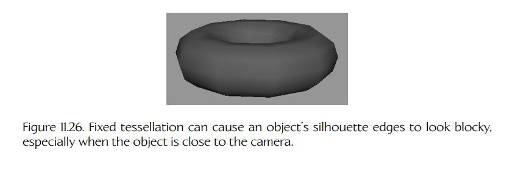

**Figure 11.26.** 固定镶嵌化会导致对象轮廓边缘看起来呈块状，尤其是在对象靠近摄像机时。

**Figure 11.27.** 一组 LOD 网格链，每个网格都具有固定的镶嵌化层次，可用于近似一致的三角形到像素密度。最左侧的圆环由 5,000 个三角形构成，中间的圆环由 450 个三角形构成，最右侧的圆环由 200 个三角形构成。

游戏开发者经常通过为每个三角形网格创建一组替代版本来近似这种理想的一致三角形到像素密度，每个版本称为一个**细节层次**（level of detail, LOD）。第一个 LOD 通常称为 LOD 0，表示最高镶嵌化层次；当对象非常接近摄像机时使用它。后续 LOD 会以越来越低的分辨率进行镶嵌化（见 [Figure 11.27](#figure-1127)）。随着对象离摄像机越来越远，引擎会从 LOD 0 切换到 LOD 1、LOD 2，依此类推。这使得渲染引擎能够把大部分时间花在变换和光照那些最靠近摄像机的对象顶点上，因为这些对象会占据屏幕上最多的像素。

一些游戏引擎会将**动态镶嵌化**（dynamic tessellation）技术应用于水面或地形等大规模网格。在这种技术中，网格通常表示为定义在某种规则网格模式上的高度场。离摄像机最近的网格区域会以该网格的完整分辨率进行镶嵌化。离摄像机更远的区域则使用越来越少的网格点进行镶嵌化。

**渐进网格**（progressive meshes）是另一种用于动态镶嵌化与 LOD 的技术。在这种技术中，会创建一个单一的高分辨率网格，用于对象非常接近摄像机时的显示。（这实际上就是 LOD 0 网格。）然后，随着对象逐渐远离摄像机，该网格会通过折叠某些边自动去镶嵌化。实际上，这个过程会自动生成一条半连续的 LOD 链。Unreal Engine 5 提供的 **Nanite** 技术就是渐进式 LOD 系统的一个例子。关于渐进网格技术的一般性详细讨论，见 [236]；我们将在 [Section 11.6.8](06-geometry-processing-and-other-visual-effects.md#1168-虚拟化几何体与-nanite) 中专门讨论 Nanite。

### 11.3.7 光源

在真实世界中，光源有两种基本类型：发光表面和发光介质。太阳是发光表面的一个例子，灯泡或发光的灼热炉丝也是如此。火焰是发光介质的一个例子：火焰由混合了水蒸气的空气组成（如果火焰足够热，可能还包含等离子体），但只有在火焰附近的介质足够热、能够触发光子发射时，该介质才会发光。

对于 3D 渲染而言，我们主要关注发光**表面**。像蜡烛火焰或爆炸这样的发光介质，通常可以通过把该体积视为由一个想象出来的发光表面包围来很好地近似。发光对象会从其表面的每一点发出光，因此这种光源称为**面光源**（area light）。

面光源在光线追踪引擎中相对容易处理——它们只是恰好会向场景中添加光能的普通表面。然而，当使用三角形光栅化等其他 3D 渲染方法时，面光源可能比较棘手。因此，使用简化的理想化光源模型会更方便。像灯泡或 LED 这样的小光源可以近似为**点光源**（point light，也称为**全向光源**，omnidirectional light），它从 3D 空间中的单个点沿所有方向径向向外发射光子。像太阳这样非常大的面光源可以近似为**方向光**（directional light），它发出的光子充满整个空间，并沿单一方向向量彼此平行地传播。

理想化光源的一个缺点是，它们不会产生真实的阴影。在真实世界中，光源具有有限表面积这一事实，会导致带有本影和半影的软边阴影。理想化光源只会产生硬边阴影，除非我们采取额外步骤来模糊其边缘。关于如何建模理想化光源，以及它们如何使用，我们将在 [Section 12.4.2](../12-lighting-and-post-processing/04-the-shading-equation.md#1242-建模理想化光源) 中进一步讨论。

### 11.3.8 坐标变换

为了从虚拟摄像机的视角渲染场景，我们需要执行一些坐标系变换。正如 [Section 5.3.11](../../volume-01-foundations-and-core-engine-systems/05-3d-math-for-games/03-matrices.md#5311-坐标空间) 中讨论过的，我们可以使用 4D 仿射变换矩阵，将通常在对象局部空间（也称为**对象空间**，object space）中指定的对象几何，转换到一个公共坐标空间中，这个空间称为**世界空间**（world space）。随后，我们再将所有内容变换到摄像机空间中，以便从摄像机的视角生成图像。最后，三角形的三维顶点会使用**透视投影**（perspective projection）或**正交投影**（orthographic projection）投影到二维屏幕空间中，以便进行光栅化。在接下来的几节中，我们将考察这些变换和投影背后的数学。

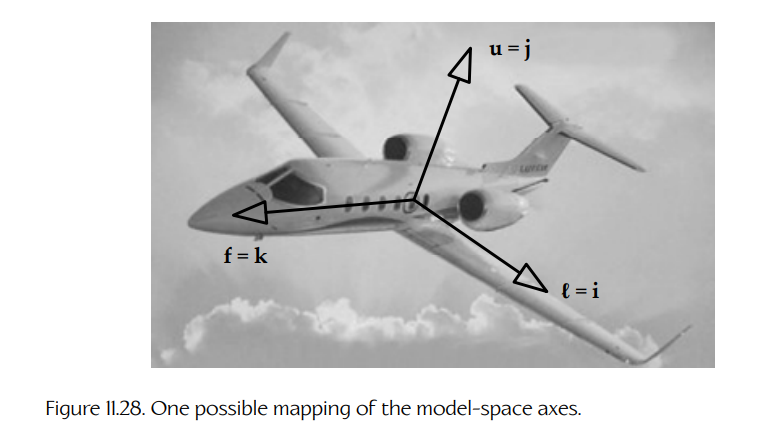

**Figure 11.28.** 模型空间坐标轴的一种可能映射方式。

#### 11.3.8.1 模型空间

三角形网格顶点的位置向量通常相对于一个方便的局部坐标系来指定，这个坐标系称为**模型空间**（model space）、**局部空间**（local space）或**对象空间**（object space）。模型空间的原点通常位于对象中心，也可能位于其他方便的位置，例如角色双脚之间的地面上，或者车辆的质心处。

正如我们在 Section 5.3.11.1 中学到的，模型空间坐标轴的含义是任意的，但坐标轴通常会与模型的自然“前”“左”或“右”“上”方向对齐。为了稍微严谨一些，我们可以定义三个单位向量 $\mathbf{f}$（**front 向量**）、$\boldsymbol{\ell}$（**left 向量**，或另一种选择 $\mathbf{r}$，即 **right 向量**）和 $\mathbf{u}$（**up 向量**），并根据需要将它们映射到模型空间中的单位基向量 $\mathbf{i}$、$\mathbf{j}$ 和 $\mathbf{k}$（也就是分别映射到 $x$、$y$ 和 $z$ 轴）。例如，一种常见映射是 $\boldsymbol{\ell} = \mathbf{i}$、$\mathbf{u} = \mathbf{j}$、$\mathbf{f} = \mathbf{k}$。这种映射完全是任意的，但在整个引擎中的所有模型之间保持一致非常重要。[Figure 11.28](#figure-1128) 展示了飞机模型的模型空间坐标轴的一种可能映射。

#### 11.3.8.2 世界空间与网格实例化

许多独立网格会通过在一个公共坐标系中定位和定向，组合成一个完整场景；这个公共坐标系称为**世界空间**（world space）。任意一个网格可能会在场景中出现许多次——例如一条街道两旁排列着相同的路灯、一群没有面孔的士兵，或一群正在攻击玩家的蜘蛛。我们将每个这样的对象称为一个**网格实例**（mesh instance）。

一个网格实例包含对其共享网格数据的引用，同时还包含一个变换矩阵，该矩阵会在该特定实例的语境下，将网格顶点从模型空间转换到世界空间。这个矩阵称为**模型到世界矩阵**（model-to-world matrix），有时简称为**世界矩阵**（world matrix）。使用 Section 5.3.12.2 中的记号，该矩阵可以写作：

$$
\mathbf{M}_{\mathrm{M}\to\mathrm{W}}
=
\begin{bmatrix}
(\mathbf{RS})_{\mathrm{M}\to\mathrm{W}} & \mathbf{0} \\
\mathbf{t}_{\mathrm{M}} & 1
\end{bmatrix},
$$

其中，上方的 $3 \times 3$ 矩阵 $(\mathbf{RS})_{\mathrm{M}\to\mathrm{W}}$ 将模型空间顶点旋转并缩放到世界空间中，而 $\mathbf{t}_{\mathrm{M}}$ 是以世界空间表达的模型空间坐标轴平移量。如果我们已经有用世界空间坐标表达的模型空间单位基向量 $\mathbf{i}_{\mathrm{M}}$、$\mathbf{j}_{\mathrm{M}}$ 和 $\mathbf{k}_{\mathrm{M}}$，那么该矩阵也可以写作：

$$
\mathbf{M}_{\mathrm{M}\to\mathrm{W}}
=
\begin{bmatrix}
\mathbf{i}_{\mathrm{M}} & 0 \\
\mathbf{j}_{\mathrm{M}} & 0 \\
\mathbf{k}_{\mathrm{M}} & 0 \\
\mathbf{t}_{\mathrm{M}} & 1
\end{bmatrix}.
$$

给定一个以模型空间坐标表达的顶点，渲染引擎会按如下方式计算它的世界空间等价形式：

$$
\mathbf{v}_{\mathrm{W}} = \mathbf{v}_{\mathrm{M}}\mathbf{M}_{\mathrm{M}\to\mathrm{W}}.
$$

我们可以把矩阵 $\mathbf{M}_{\mathrm{M}\to\mathrm{W}}$ 理解为模型空间坐标轴自身的位置与方向描述，只不过以世界空间坐标表达。或者，也可以把它理解为一个将顶点从模型空间变换到世界空间的矩阵。

渲染网格时，模型到世界矩阵也会应用于网格的表面法线。回想 Section 5.3.13，为了正确变换法线向量，必须将它们乘以模型到世界矩阵的逆转置。如果矩阵不包含任何缩放或切变，则可以简单地在乘以模型到世界矩阵之前，将法线向量的 $w$ 分量设为 0，从而正确变换法线向量，如 Section 5.3.8.1 所述。

某些网格，例如建筑、地形和其他背景元素，是完全静态且唯一的。这些网格的顶点通常已经以世界空间表达，因此它们的模型到世界矩阵是单位矩阵，可以忽略。

#### 11.3.8.3 观察空间

虚拟摄像机的焦点是一个 3D 坐标系的原点，这个坐标系称为**观察空间**（view space）或**摄像机空间**（camera space）。摄像机的位置和方向可以使用一个观察到世界矩阵来指定，正如一个网格实例通过其模型到世界矩阵定位在场景中一样。如果我们知道摄像机空间的位置向量和三个基向量，并用世界空间坐标表达它们，那么观察到世界矩阵可以按照类似于构造模型到世界矩阵的方式写出。

**Figure 11.29.** 右：当摄像机坐标轴为右手系时，必须取反一个轴，才能定义一个左手观察空间，使其 $z$ 轴表示深度、$x$ 轴指向右方。左：当摄像机坐标轴本身已经是左手系时，可以直接用它们定义观察空间。

为此，我们需要决定每个基向量映射到哪个坐标轴。可以任意选择映射方式，但在本书中，我们会将前向量映射到观察空间的 $z$ 轴（$\mathbf{k}_{\mathrm{V}} = \mathbf{f}_{\mathrm{cam}}$），将负 left 向量沿 $x$ 轴放置（$\mathbf{i}_{\mathrm{V}} = -\boldsymbol{\ell}_{\mathrm{cam}}$），并将 up 向量与 $y$ 轴对齐（$\mathbf{j}_{\mathrm{V}} = \mathbf{u}_{\mathrm{cam}}$）。观察空间平移量 $\mathbf{t}_{\mathrm{V}}$ 只是焦点 $\mathbf{x}_{\mathrm{cam}}$ 的位置。因此，观察到世界矩阵可以写作：

$$
\mathbf{M}_{\mathrm{V}\to\mathrm{W}}
=
\begin{bmatrix}
\mathbf{i}_{\mathrm{V}} & 0 \\
\mathbf{j}_{\mathrm{V}} & 0 \\
\mathbf{k}_{\mathrm{V}} & 0 \\
\mathbf{t}_{\mathrm{V}} & 1
\end{bmatrix}
=
\begin{bmatrix}
-\boldsymbol{\ell}_{\mathrm{cam}} & 0 \\
\mathbf{u}_{\mathrm{cam}} & 0 \\
\mathbf{f}_{\mathrm{cam}} & 0 \\
\mathbf{x}_{\mathrm{cam}} & 1
\end{bmatrix}.
\tag{11.2}
$$

这种观察空间形式很方便，因为观察空间中的 $x_{\mathrm{V}}$ 和 $y_{\mathrm{V}}$ 坐标对应于图像空间中的二维 $(X,Y)$ 坐标，而观察空间中的 $z_{\mathrm{V}}$ 坐标对应于从摄像机视角进入场景的**深度**。不过需要注意，为了让 $x_{\mathrm{V}}$ 指向右方，我们必须取反摄像机的 left 向量，这意味着观察空间由一个**左手坐标系**（left-handed coordinate system）定义，尽管本书其他地方通常使用右手约定。

OpenGL 也为观察空间使用左手坐标系，并为其他所有内容使用右手坐标。不过，OpenGL 通过取反 $z$ 轴而不是 $x$ 轴来定义观察空间。这样做是因为 OpenGL 还将 $\mathbf{f}_{\mathrm{cam}}$ 定义为指向与摄像机实际朝向相反的方向。就我个人而言，我觉得这比简单地取反 $x$ 更令人困惑。如果你的引擎本身已经是左手系，就像 DirectX 那样，那么可以使用更简单的映射 $\mathbf{i}_{\mathrm{V}} = \mathbf{r}_{\mathrm{cam}}$。[Figure 11.29](#figure-1129) 描绘了这两种替代方案。

**变换到观察空间。**

渲染三角形网格时，其顶点首先会从模型空间变换到世界空间，然后再从世界空间变换到观察空间。为了执行后一个变换，我们需要世界到观察矩阵，它是观察到世界矩阵的逆。这个矩阵有时称为**观察矩阵**（view matrix）：

$$
\mathbf{M}_{\mathrm{W}\to\mathrm{V}}
=
\mathbf{M}^{-1}_{\mathrm{V}\to\mathrm{W}}
=
\mathbf{M}_{\mathrm{view}}.
$$

这里要小心。摄像机矩阵相对于场景中对象矩阵是反向求逆的，这一点是新手游开发者常见的困惑和 bug 来源。

在渲染某个特定网格实例之前，世界到观察矩阵通常会与模型到世界矩阵连接起来。这个组合矩阵在 OpenGL 中称为**模型观察矩阵**（model-view matrix）。我们会预先计算该矩阵，这样渲染引擎在将顶点从模型空间变换到观察空间时，只需要执行一次矩阵乘法：

$$
\mathbf{M}_{\mathrm{M}\to\mathrm{V}}
=
\mathbf{M}_{\mathrm{M}\to\mathrm{W}}\mathbf{M}_{\mathrm{W}\to\mathrm{V}}
=
\mathbf{M}_{\mathrm{modelview}}.
$$

#### 11.3.8.4 光源空间

有时，将场景几何变换到某个光源的坐标空间中会很有用。正如虚拟摄像机附带一个坐标系一样，我们也可以为每个光源附加一个坐标系。一旦光源的世界空间位置 $\mathbf{y}_{\mathrm{light}}$ 及其局部坐标轴建立起来，构造光源空间到世界空间变换矩阵的数学形式，就与构造观察到世界矩阵完全相同：

$$
\mathbf{M}_{\mathrm{L}\to\mathrm{W}}
=
\begin{bmatrix}
\mathbf{i}_{\mathrm{L}} & 0 \\
\mathbf{j}_{\mathrm{L}} & 0 \\
\mathbf{k}_{\mathrm{L}} & 0 \\
\mathbf{t}_{\mathrm{L}} & 1
\end{bmatrix}
=
\begin{bmatrix}
-\boldsymbol{\ell}_{\mathrm{light}} & 0 \\
\mathbf{u}_{\mathrm{light}} & 0 \\
\mathbf{f}_{\mathrm{light}} & 0 \\
\mathbf{y}_{\mathrm{light}} & 1
\end{bmatrix}.
$$

光源空间的一个常见用途是生成阴影贴图。我们可以把每个光源当作一个辅助摄像机，从光源的视角渲染场景，并生成一张阴影贴图纹理；之后可以从摄像机视角将该纹理投影到场景上，以描述场景中哪些位置应该处于阴影中。关于阴影贴图的更多细节，见 [Section 12.5.6](../12-lighting-and-post-processing/05-lighting-with-triangle-rasterization.md#1256-阴影)。

### 11.3.9 投影

为了将 3D 场景渲染到 2D 图像平面上，我们使用一种特殊类型的变换，称为**投影**（projection）。**透视投影**（perspective projection）是计算机图形学中最常见的投影，因为它模拟了典型摄像机所生成的图像。在这种投影下，物体距离摄像机越远，看起来就越小——这种效果称为**透视缩短**（perspective foreshortening）。

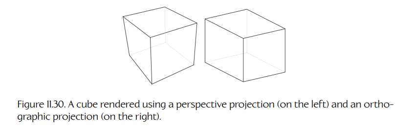

**Figure 11.30.** 使用透视投影（左）和正交投影（右）渲染的立方体。

保持长度的**正交投影**（orthographic projection）也会被一些游戏使用，主要用于渲染 3D 模型或游戏关卡的**平面视图**（plan views，例如前视图、侧视图和俯视图），以便进行编辑；也用于将 2D 图形叠加到屏幕上，例如 HUD 等。正交投影是一种**平行投影**（parallel projection），也称为**轴测投影**（axonometric projection）。所有平行投影的定义特征是，投影线彼此平行；我们也可以把它看成透视投影在焦点移动到无限远处时的极限情况。[Figure 11.30](#figure-1130) 展示了用这两种投影类型渲染立方体时的外观。

#### 11.3.9.1 观察体积与视锥体

摄像机能够“看到”的空间区域称为**观察体积**（view volume）。观察体积由六个平面定义。**近平面**（near plane）对应于虚拟图像感测表面。四个侧平面对应于虚拟屏幕的四条边。**远平面**（far plane）用作渲染优化，以确保极其遥远的对象不会被绘制。它还为将存储在深度缓冲区中的深度提供了一个上限（见 [Section 11.3.10.5](03-foundations-of-3d-rendering.md#113105-带深度缓冲的光栅化)）。

当使用透视投影渲染场景时，观察体积的形状是一个被截断的金字塔，称为**视锥体**（frustum）。当使用正交投影时，观察体积是一个长方体。透视观察体积和正交观察体积分別如 [Figure 11.31](#figure-1131) 和 [Figure 11.32](#figure-1132) 所示。

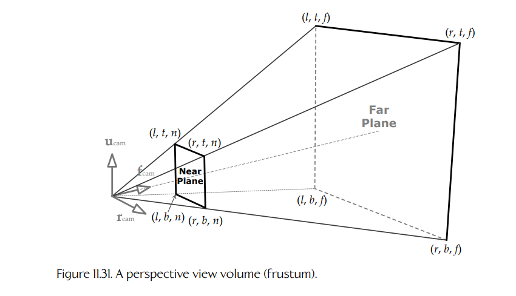

**Figure 11.31.** 透视观察体积（视锥体）。

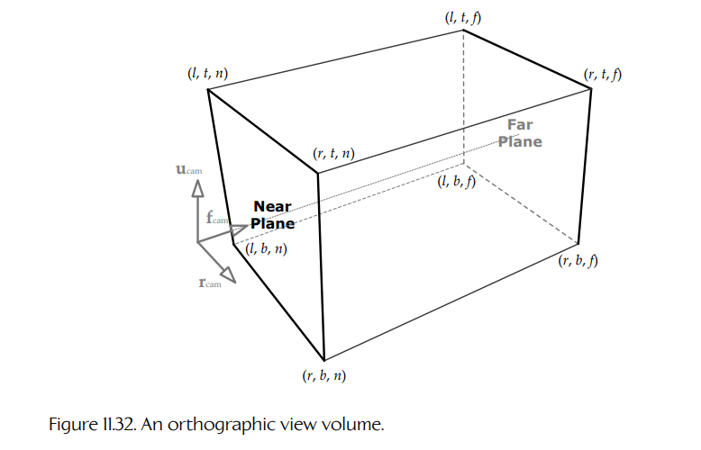

**Figure 11.32.** 正交观察体积。

观察体积的六个平面可以使用六个四元素向量 $(n_{xi}, n_{yi}, n_{zi}, d_i)$ 紧凑表示，其中 $\mathbf{n}_i = (n_{xi}, n_{yi}, n_{zi})$ 是平面法线，$d_i$ 是它到原点的垂直距离。如果我们更喜欢点-法线形式的平面表示，也可以用六对向量 $(\mathbf{Q}_i, \mathbf{n}_i)$ 来描述这些平面，其中 $\mathbf{Q}$ 是平面上的任意点，$\mathbf{n}_i$ 是第 $i$ 个平面的法线。

#### 11.3.9.2 投影与齐次裁剪空间

透视投影和正交投影都会将观察空间中的点变换到一个称为**齐次裁剪空间**（homogeneous clip space）的坐标空间中。这个三维空间实际上只是观察空间的一个扭曲版本。裁剪空间的目的是将摄像机空间的观察体积转换为一个**规范观察体积**（canonical view volume），该体积既独立于用于将 3D 场景转换到 2D 屏幕空间的投影类型，也独立于场景将要渲染到的屏幕的分辨率和宽高比。

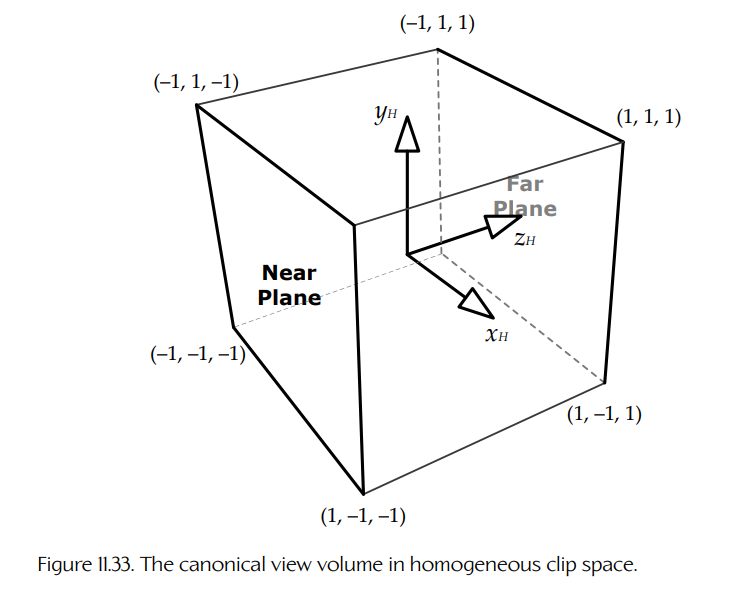

**Figure 11.33.** 齐次裁剪空间中的规范观察体积。

在裁剪空间中，规范观察体积是一个长方体，沿 $x$ 轴和 $y$ 轴从 $-1$ 延伸到 $+1$。沿 $z$ 轴，观察体积的范围要么从 $-1$ 到 $+1$（OpenGL），要么从 $0$ 到 $1$（DirectX）。我们之所以称这个坐标系为“裁剪空间”，是因为该空间中的观察体积平面与坐标轴对齐，因此可以方便地将三角形裁剪到观察体积中（即使使用的是透视投影）。OpenGL 的规范裁剪空间观察体积如 [Figure 11.33](#figure-1133) 所示。注意，裁剪空间的 $z$ 轴指向屏幕内部，$y$ 向上，$x$ 向右。换句话说，齐次裁剪空间通常是左手系。这里使用左手约定，是因为它使递增的 $z$ 值对应于进入屏幕的递增**深度**，同时 $y$ 和 $x$ 仍像通常一样分别向上和向右递增。

**透视投影。**

关于透视投影的精彩解释可见 [36] 的 Section 4.5.1，因此这里不再重复。我们只给出下面的透视投影矩阵 $\mathbf{M}_{\mathrm{V}\to\mathrm{H}}$。（下标 $\mathrm{V}\to\mathrm{H}$ 表明该矩阵将顶点从观察空间变换到齐次裁剪空间。）如果将观察空间视为右手系，那么近平面与 $z$ 轴相交于 $z=-n$，远平面与其相交于 $z=-f$。虚拟屏幕的左、右、下、上边分别位于近平面上的 $x=l$、$x=r$、$y=b$ 和 $y=t$。（通常，虚拟屏幕以摄像机空间 $z$ 轴为中心，在这种情况下 $l=-r$ 且 $b=-t$，但情况并不总是如此。）使用这些定义，OpenGL 的透视投影矩阵如下：

$$
\mathbf{M}_{\mathrm{V}\to\mathrm{H}}
=
\begin{bmatrix}
\left(\dfrac{2n}{r-l}\right) & 0 & 0 & 0 \\
0 & \left(\dfrac{2n}{t-b}\right) & 0 & 0 \\
\left(\dfrac{r+l}{r-l}\right) & \left(\dfrac{t+b}{t-b}\right) & \left(-\dfrac{f+n}{f-n}\right) & -1 \\
0 & 0 & \left(-\dfrac{2nf}{f-n}\right) & 0
\end{bmatrix}.
$$

DirectX 将裁剪空间观察体积的 $z$ 轴范围定义为 $[0,1]$，而不是 OpenGL 所使用的 $[-1,1]$。我们可以很容易地调整透视投影矩阵，以符合 DirectX 的约定，如下所示：

$$
(\mathbf{M}_{\mathrm{V}\to\mathrm{H}})_{\mathrm{DirectX}}
=
\begin{bmatrix}
\left(\dfrac{2n}{r-l}\right) & 0 & 0 & 0 \\
0 & \left(\dfrac{2n}{t-b}\right) & 0 & 0 \\
\left(\dfrac{r+l}{r-l}\right) & \left(\dfrac{t+b}{t-b}\right) & \left(-\dfrac{f}{f-n}\right) & -1 \\
0 & 0 & \left(-\dfrac{nf}{f-n}\right) & 0
\end{bmatrix}.
$$

**除以 z。**

透视投影会导致每个顶点的 $x$ 和 $y$ 坐标被其 $z$ 坐标除。这正是产生透视缩短的原因。为了理解为什么会发生这一点，考虑将一个以四元素齐次坐标表达的观察空间点 $\mathbf{p}_{\mathrm{V}}$ 乘以 OpenGL 透视投影矩阵：

$$
\mathbf{p}_{\mathrm{H}} = \mathbf{p}_{\mathrm{V}}\mathbf{M}_{\mathrm{V}\to\mathrm{H}}
$$

$$
=
\begin{bmatrix}
p_{Vx} & p_{Vy} & p_{Vz} & 1
\end{bmatrix}
\begin{bmatrix}
\left(\dfrac{2n}{r-l}\right) & 0 & 0 & 0 \\
0 & \left(\dfrac{2n}{t-b}\right) & 0 & 0 \\
\left(\dfrac{r+l}{r-l}\right) & \left(\dfrac{t+b}{t-b}\right) & \left(-\dfrac{f+n}{f-n}\right) & -1 \\
0 & 0 & \left(-\dfrac{2nf}{f-n}\right) & 0
\end{bmatrix}.
$$

这个乘法结果具有如下形式：

$$
\mathbf{p}_{\mathrm{H}}
=
\begin{bmatrix}
a & b & c & -p_{Vz}
\end{bmatrix}.
\tag{11.3}
$$

当我们将任意齐次向量转换为三维坐标时，$x$、$y$ 和 $z$ 分量都会除以 $w$ 分量：

$$
\begin{bmatrix}
x & y & z & w
\end{bmatrix}
\equiv
\begin{bmatrix}
\dfrac{x}{w} & \dfrac{y}{w} & \dfrac{z}{w}
\end{bmatrix}.
$$

因此，将 Equation (11.3) 除以齐次 $w$ 分量后，而这个分量实际上就是负的观察空间 $z$ 坐标 $-p_{Vz}$，我们得到：

$$
\mathbf{p}_{\mathrm{H}}
=
\begin{bmatrix}
\dfrac{a}{-p_{Vz}} & \dfrac{b}{-p_{Vz}} & \dfrac{c}{-p_{Vz}}
\end{bmatrix}
=
\begin{bmatrix}
p_{Hx} & p_{Hy} & p_{Hz}
\end{bmatrix}.
$$

因此，齐次裁剪空间坐标已经被观察空间 $z$ 坐标除过，这正是导致透视缩短的原因。

**正交投影。**

正交投影由以下矩阵执行：

$$
(\mathbf{M}_{\mathrm{V}\to\mathrm{H}})_{\mathrm{ortho}}
=
\begin{bmatrix}
\left(\dfrac{2}{r-l}\right) & 0 & 0 & 0 \\
0 & \left(\dfrac{2}{t-b}\right) & 0 & 0 \\
0 & 0 & \left(-\dfrac{2}{f-n}\right) & 0 \\
\left(-\dfrac{r+l}{r-l}\right) & \left(-\dfrac{t+b}{t-b}\right) & \left(-\dfrac{f+n}{f-n}\right) & 1
\end{bmatrix}.
$$

这只是一个普通的缩放和平移矩阵。（左上角 $3 \times 3$ 部分包含一个对角非均匀缩放矩阵，底行包含平移。）由于观察体积在观察空间和裁剪空间中都是长方体，因此我们只需对顶点进行缩放和平移，就可以从一个空间转换到另一个空间。

#### 11.3.9.3 屏幕空间

**屏幕空间**（screen space）是一个二维坐标系，其坐标轴以屏幕像素为单位测量。$x$ 轴通常指向右方，原点位于屏幕左上角，$y$ 指向下方。（$y$ 轴反转的原因在于，CRT 显示器会从上到下扫描屏幕。）

我们可以通过简单绘制齐次裁剪空间中三角形的 $(x,y)$ 坐标并忽略 $z$，来渲染这些三角形。但在这样做之前，我们需要缩放并平移裁剪空间坐标，使其位于屏幕空间中，而不是归一化单位正方形内。这种缩放和平移操作称为**屏幕映射**（screen mapping）。

#### 11.3.9.4 视口

**视口**（viewport）是一个二维矩形，三维场景会被投影到其中。视口矩形的尺寸可以小于完整渲染目标表面的尺寸，从而允许渲染到显示区域的子矩形中。在 DirectX 中，视口还包含齐次裁剪空间中光栅化三角形时所使用的深度值范围。从这个意义上说，视口实际上并不是一个矩形——它实际上是一个 3D 体积。（OpenGL 也支持三维视口概念，但二维视口矩形和深度范围是分别配置的。）

### 11.3.10 光栅化

**光栅化算法**（rasterization algorithm）是一种在屏幕或其他二维位图图像上绘制填充三角形的方法，该图像由像素网格组成。更精确地说，给定一个三角形的三个顶点在**屏幕空间**中的位置，光栅化算法会确定哪些像素位于三角形边界**内部**。

一旦这些像素被识别出来，我们就可以对它们执行一些有用操作。可以决定简单地用纯色填充所有内部像素。（这称为**平面着色**，flat shading。）或者，可以执行更复杂的操作来确定每个内部像素应接收什么颜色。我们甚至可以决定完全不向这些像素写入任何颜色信息，而只是记录三角形重叠了哪些像素以供之后使用。不过为了便于讨论，我们将假设只用纯色填充内部像素，以保持简单。

#### 11.3.10.1 光栅化单个三角形

可以这样理解光栅化算法：首先识别屏幕空间中三角形的最高顶点和最低顶点。接着，通过穿过剩余顶点绘制一条水平线，将三角形分成两个子三角形。这会得到一个平顶三角形和一个平底三角形，如 [Figure 11.34](#figure-1134) 所示。对于每个子三角形，我们使用其最高和最低顶点/边的 $Y$ 坐标，找出被三角形覆盖的最高像素行和最低像素行，这些行也称为**扫描线**（scan lines）4。然后算法逐行从上到下进行处理。在每一行上，我们计算三角形左边缘和右边缘的水平坐标 $X_{\mathrm{left}}$ 和 $X_{\mathrm{right}}$，从而定义一段连续的水平像素“run”，这些像素在该行上位于三角形内部（见 [Figure 11.35](#figure-1135)）。收集所有这些水平 run 后，我们就得到了三角形覆盖的全部像素集合。随后，可以用我们选择的颜色填充这些像素。

> **脚注 4**：术语 “scan line” 起源于 CRT 显示器的早期时代。当时 CRT 显示器中有一支电子枪，会从上到下逐行扫描屏幕上的水平线，以激发玻璃上的发光荧光粉。

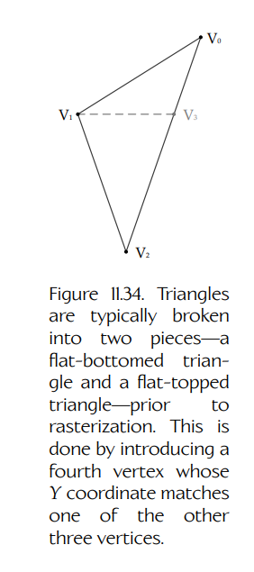

**Figure 11.34.** 三角形在光栅化之前通常会被分成两部分：一个平底三角形和一个平顶三角形。这通过引入第四个顶点完成，该顶点的 $Y$ 坐标与另外三个顶点之一相同。

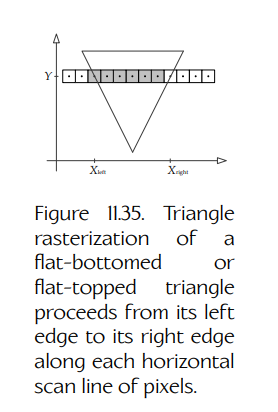

**Figure 11.35.** 对平底或平顶三角形进行光栅化时，会沿每条水平像素扫描线从左边缘推进到右边缘。

#### 11.3.10.2 光栅化规则

渲染引擎从不会孤立地光栅化单个三角形。相反，它会绘制完整的三角形网格。网格中的相邻三角形通常共享一条边，因此很重要的一点是：不要把这些共享边上的像素绘制超过一次。这个问题通过引入某种**光栅化规则**（rasterization rule）来解决，该规则定义每个像素“属于”哪个三角形。OpenGL 和 DirectX 等图形 API 使用“**左上规则**”（top-left rule）。该规则规定，一个像素只有在完全位于三角形内部，或者位于三角形的上边或左边上时，才被认为与该三角形重叠。因此，一个未被某个给定三角形光栅化的右边或下边上的像素，将会被相邻三角形光栅化，因为这条右边或下边已经成为相邻三角形的上边或左边。使用左上规则光栅化的三角形如 [Figure 11.36](#figure-1136) 所示。

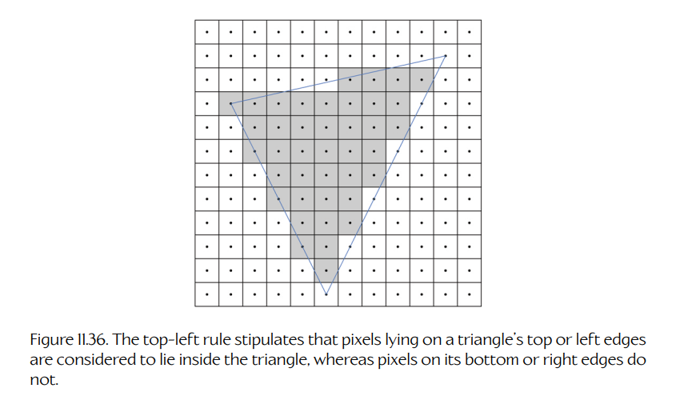

**Figure 11.36.** 左上规则规定：位于三角形上边或左边上的像素被认为在三角形内部，而位于其下边或右边上的像素则不被认为在内部。

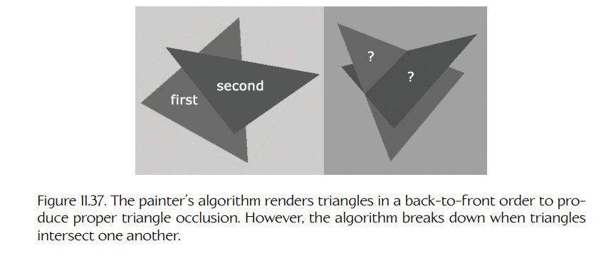

**Figure 11.37.** 画家算法按照从后到前的顺序渲染三角形，以产生正确的三角形遮挡效果。然而，当三角形彼此相交时，该算法会失效。

#### 11.3.10.3 深度与画家算法

当渲染两个在屏幕空间中相互重叠的三角形时，我们需要某种方式来确保离摄像机更近的三角形显示在更远的三角形之上。我们可以尝试在光栅化之前，先将三角形按从后到前的顺序排序。距离更远的三角形会先被光栅化，而更近的三角形最终会覆盖其中一些像素，使它在最终场景中显示在上方。这称为**画家算法**（painter’s algorithm）。然而，如 [Figure 11.37](#figure-1137) 所示，如果三角形彼此相交，这种方法就会失效。

为了将三角形这类对象集合按从后到前的顺序排序，我们需要一种方法来衡量每个对象距离摄像机成像平面有多远。从成像平面到单个点的距离，就是该点在观察空间中的 $z$ 坐标——这个距离称为该点的**深度**（depth）。因此，我们可以通过简单地提取三角形三个顶点的 $z$ 坐标，轻松获得它们的深度。

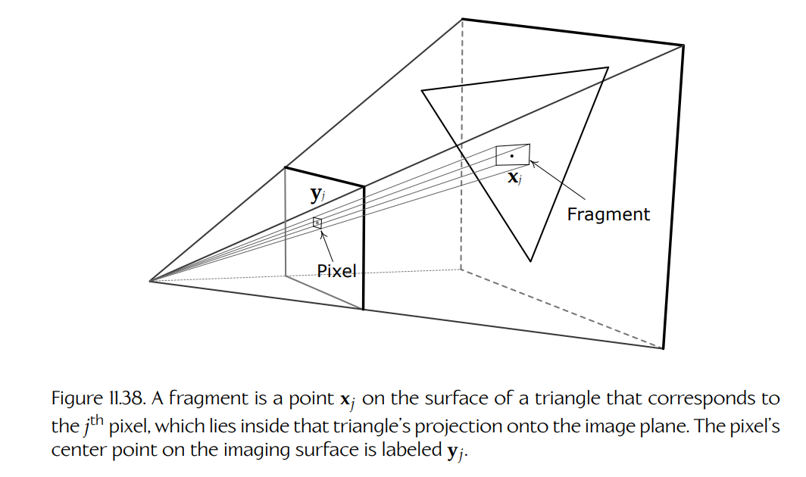

**Figure 11.38.** 片段是三角形表面上的点 $\mathbf{x}_j$，它对应第 $j$ 个像素；该像素位于该三角形投影到成像平面后的区域内部。该像素在成像表面上的中心点标记为 $\mathbf{y}_j$。

但“三角形的深度”到底是什么？三角形表面上的每个点——它的三个顶点以及它们之间无限多个点——都有唯一的深度。那么我们应该选择哪个点来排序？可以尝试用最近顶点的深度作为三角形深度的替代值，也可以使用最远顶点，或者使用其质心的深度。但无论选择哪个点，当三角形彼此相交时，仍然会遇到问题。根本不存在一种三角形排序顺序，能够在所有可能的三角形配置中产生正确结果。

#### 11.3.10.4 片段

三角形光栅化会识别成像平面上哪些像素位于投影后三角形的内部。我们也可以把光栅化理解为一个过程：它将原始的、尚未投影的观察空间三角形，分解成一些像素大小的小多边形片。这些片称为**片段**（fragments）。三角形片段的概念如 [Figure 11.38](#figure-1138) 所示。

一旦三角形被分解为片段，无论三角形之间如何相交，我们都可以正确解决三角形重叠问题。我们只需要对片段进行深度排序，而不是对三角形排序。

不过，片段并不真的是一个形状有点奇怪的小多边形。更准确的理解是，将片段看作三角形表面上的一个无穷小点。由于每个片段都对应 3D 观察空间中的一个点，因此每个片段都有唯一的深度（即唯一的观察空间 $z$ 坐标）。而对于那些在整个场景渲染完成后最终离摄像机最近的幸运片段，它们的观察空间位置恰好对应于我们之前所说的可见性问题的解，即表面点集合 $\{\mathbf{x}_j\}$。（关于为什么将片段理解为点而不是多边形很重要，还可参见 [Section 11.3.13](#11313-抗锯齿)。）

那么，在光栅化期间如何找到片段的深度呢？事实证明这很直接。我们可以对三角形三个顶点的 $z$ 坐标进行**线性插值**（linearly interpolate），从而找到任意给定片段（或者三角形内部表面上的任意其他点）的 $z$ 坐标。不过请注意，我们不能直接插值 $z$ 值——必须使用一种称为**透视正确插值**（perspective-correct interpolation）的技术，我们将在 [Section 11.3.10.7](03-foundations-of-3d-rendering.md#113107-透视正确属性插值) 中讨论它。

#### 11.3.10.5 带深度缓冲的光栅化

为了解决画家算法固有的问题，我们实际上不会对所有片段进行排序——那样并不现实。相反，我们使用光栅化算法的一种变体，称为**带深度缓冲的三角形光栅化**（depth-buffered triangle rasterization）。其工作方式如下：首先定义一个辅助位图，其尺寸与帧缓冲区相同，但其像素包含深度而不是颜色。这个缓冲区恰当地称为**深度缓冲区**（depth buffer）。（它是 [Section 11.3.4.3](03-foundations-of-3d-rendering.md#11343-帧缓冲图像平面) 中所描述的组成帧缓冲区的图像平面之一。）

我们将深度缓冲区初始化，使每个像素都具有一个实际上无限大的深度。然后，我们以任意顺序光栅化三角形。对于每个被光栅化三角形的每个片段，我们通过插值顶点深度来计算其深度。如果该片段的深度小于对应像素在深度缓冲区中已经存储的深度，那么它就更接近摄像机，因此我们允许它同时覆盖现有像素的颜色和深度。但如果片段的深度大于其像素已有的深度，那么该片段会被**丢弃**（discarded），也就是说，它的深度和颜色都不会对最终图像产生贡献。

带深度缓冲的光栅化以增量方式解决深度排序问题：每当一个新三角形被光栅化时，我们都会更新对于哪些片段最接近摄像机的认知。当所有三角形都完成光栅化后，颜色缓冲区只包含那些与每个像素之间存在直接视线的片段（三角形表面点）的颜色，而深度缓冲区则包含这些最近片段与成像平面之间的距离。

#### 11.3.10.6 使用重心坐标的光栅化

真实 GPU 实际上并不会使用逐行（基于扫描线）的算法来光栅化三角形。相反，GPU 会计算每个像素投影到三角形平面后的**重心坐标**（barycentric coordinates），并使用这些坐标来测试该像素位于三角形内部还是外部。重心坐标非常方便，因为它们具有双重用途。它们可以在光栅化期间使用，也可以用于插值深度和其他顶点属性，我们将在 [Section 11.3.10.7](03-foundations-of-3d-rendering.md#113107-透视正确属性插值) 中讨论。

给定一个由三个顶点位置 $\mathbf{p}_1$、$\mathbf{p}_2$ 和 $\mathbf{p}_3$ 定义的三角形，以及位于该三角形平面上的一点 $\mathbf{p}_f$（表示某个片段的位置），我们可以将 $\mathbf{p}_f$ 表示为三个顶点位置的加权平均。点 $\mathbf{p}_f$ 的重心坐标 $\lambda_1$、$\lambda_2$ 和 $\lambda_3$，就是这个加权平均中使用的权重：

$$
\mathbf{p}_f = \lambda_1\mathbf{p}_1 + \lambda_2\mathbf{p}_2 + \lambda_3\mathbf{p}_3.
$$

由于它们定义的是一个加权平均，因此三个重心坐标之和必须始终为 1：

$$
\lambda_1 + \lambda_2 + \lambda_3 = 1.
$$

如果 $\mathbf{p}_f$ 位于三角形内部，那么三个重心坐标都为正。然而，如果 $\mathbf{p}_f$ 位于三角形外部，那么它的一个或多个重心坐标将为负。

如果我们从点 $\mathbf{p}_f$ 分别向三个顶点构造三个向量（并且该点位于三角形内部），这些向量会将三角形划分为三个子三角形，如 [Figure 11.39](#figure-1139) 所示。

$$
\mathbf{v}_{1f} = \mathbf{p}_f - \mathbf{p}_1,
$$

$$
\mathbf{v}_{2f} = \mathbf{p}_f - \mathbf{p}_2,
$$

$$
\mathbf{v}_{3f} = \mathbf{p}_f - \mathbf{p}_3.
$$

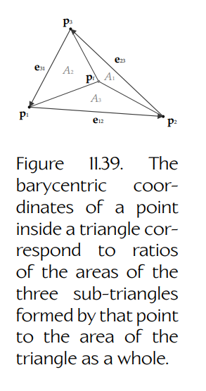

**Figure 11.39.** 三角形内部一点的重心坐标，对应于该点形成的三个子三角形面积与整个三角形面积之间的比值。

重心坐标有时称为**面积坐标**（areal coordinates），因为可以将它们理解为这些子三角形面积与整个三角形面积之间的比值。事实上，计算重心坐标的一种方法，是对三角形边与从每个顶点指向点 $\mathbf{p}_f$ 的向量进行叉积。这些叉积的长度表示平行四边形的面积，因此将它们除以 2，就可以得到三个子三角形的面积：

$$
A_{\mathrm{total}}
=
\frac{1}{2}\left|\mathbf{e}_{12} \times \mathbf{e}_{13}\right|
=
\frac{1}{2}\left|\mathbf{e}_{12} \times -\mathbf{e}_{31}\right|,
$$

$$
A_1 = \frac{1}{2}\left|\mathbf{e}_{23} \times \mathbf{v}_{2f}\right|,
$$

$$
A_2 = \frac{1}{2}\left|\mathbf{e}_{31} \times \mathbf{v}_{3f}\right|,
$$

$$
A_3 = \frac{1}{2}\left|\mathbf{e}_{12} \times \mathbf{v}_{1f}\right|.
$$

然后，我们用每个子面积除以三角形总面积，得到三个重心坐标：

$$
\lambda_1 = \frac{A_1}{A_{\mathrm{total}}},
$$

$$
\lambda_2 = \frac{A_2}{A_{\mathrm{total}}},
$$

$$
\lambda_3 = \frac{A_3}{A_{\mathrm{total}}} = 1 - (\lambda_1 + \lambda_2).
$$

#### 11.3.10.7 透视正确属性插值

让我们更仔细地考察如何插值片段的深度。我们在 Section 5.2.5 中学过，**线性插值**（linear interpolation，简称 **lerp**）可以看作一种加权平均。例如，给定由两个点 $\mathbf{A}$ 和 $\mathbf{B}$ 形成的一条线段，我们可以通过对这两个点取加权平均，找到位于它们之间某个百分比位置上的插值点 $\mathbf{L}$。只要每个权重都位于 0 到 1 之间，并且它们之和为 1（$\beta_1 = 1 - \beta_2$），任何权重都可以：

$$
\mathbf{L} = \beta_1\mathbf{A} + \beta_2\mathbf{B}.
$$

若要在**三个**点之间进行 lerp，我们需要三个总和为 1 的权重。但我们已经确定，重心坐标可以用于将一个点表示为另外三个点的加权平均。因此，我们应该能够使用重心坐标，根据三角形顶点的深度线性插值片段的深度。（事实上，我们可以使用重心坐标在片段位置处插值任意顶点属性。）

我们可能会想直接按如下方式计算加权平均，从而插值片段的深度：

$$
z_f = \lambda_1 z_1 + \lambda_2 z_2 + \lambda_3 z_3.
\tag{11.4}
$$

然而，在使用透视投影时，这并不完全正确！虽然 3D 空间中的一条线在透视投影下会投影为 2D 屏幕空间中的一条线，但点与点之间的距离在这种投影下并不会保持不变。这种现象称为**透视缩短**（perspective foreshortening）。为了在投影后三角形的表面上插值深度等属性，我们需要通过一种称为**透视正确属性插值**（perspective-correct attribute interpolation）的技术来考虑这种缩短。

透视正确属性插值的推导超出了我们的范围，但这里会直接给出其结果而不作证明。为了以透视正确的方式线性插值深度，我们只需将 Equation (11.4) 应用于三个顶点深度的倒数，然后再取结果的倒数：

$$
\frac{1}{z_f}
=
\lambda_1\frac{1}{z_1}
+
\lambda_2\frac{1}{z_2}
+
\lambda_3\frac{1}{z_3}.
\tag{11.5}
$$

从直觉上看，这是有道理的，因为透视投影的效果就是将 3D 坐标除以它们的 $z$ 坐标。我们实际上是在撤销透视除法，正常插值，然后再对结果重新执行透视除法。

以透视正确方式插值其他顶点属性也遵循类似过程。例如，如果要根据三个顶点处的颜色插值某个片段的 RGB 颜色，可以写作：

$$
\mathbf{C}_f
=
z_f
\left(
\frac{\lambda_1}{z_1}\mathbf{C}_1
+
\frac{\lambda_2}{z_2}\mathbf{C}_2
+
\frac{\lambda_3}{z_3}\mathbf{C}_3
\right).
$$

关于透视正确属性插值背后数学推导的精彩说明，可参见 [35]。Scratchapixel 的这节课也是一个很好的资源：[237]。

#### 11.3.10.8 基于四像素块的光栅化

需要强调的是，大多数 GPU 实际上并不是一次一个像素地光栅化三角形。相反，基于 GPU 的三角形光栅化通常以称为 **quad** 的 $2 \times 2$ 像素块为单位工作。基于 quad 的光栅化允许 GPU 通过对相邻三角形片段的 3D 位置取**一阶差分**（first differences），来计算称为**梯度**（gradients）的空间导数。这些梯度是执行带有 **mipmap** 的纹理渲染时进行**纹理过滤**（texture filtering）所必需的。我们将在 [Section 11.3.14](#11314-纹理) 中讨论纹理映射、过滤和 mipmapping。

GPU 如何以大规模并行方式光栅化三角形网格，其细节非常复杂，超出了本书范围。不过，我们可以把基于 quad 的光栅化理解为一种两遍算法：在第一遍中，我们确定每个三角形覆盖了哪些 $2 \times 2$ quad。在第二遍中，我们计算 quad 中四个像素相对于正在光栅化的三角形的重心坐标。如果所有三个重心坐标都为正，那么该像素位于三角形内部。关于三角形光栅化的更多细节，可参见 [238]。

### 11.3.11 深度测试与深度写入

在带深度缓冲的三角形光栅化中，每个片段会使用深度缓冲区执行两个不同操作：

1. 被光栅化的片段首先会经历一次**深度测试**（depth test）。片段的深度会被计算出来（通过插值），如果该深度大于给定像素在深度缓冲区中已经存在的值，那么该片段测试失败并被丢弃。

2. 对于通过深度测试的片段，我们可以执行一次**深度写入**（depth write）操作。这会使该片段的深度覆盖之前存在于深度缓冲区中的任何值。

重要的是要意识到，这两个操作可以彼此独立地开启和关闭。如果在渲染一组三角形之前禁用深度测试操作，那么所有这些被渲染片段实际上都会通过深度测试，并向图像贡献颜色，即便它们彼此重叠，或者比之前渲染过的三角形距离摄像机更远。另一方面，如果禁用深度写入操作，那么片段就不会更新其像素处的深度，因此也不会影响后续深度测试的结果。（当然，如果同时禁用这两个操作，那么我们实际上就不再进行带深度缓冲的光栅化了！）

配置这两个操作可以实现各种视觉效果。例如，在大多数第一人称射击游戏中，玩家可能会靠近墙壁到足以让玩家武器直接穿过墙体的位置（这看起来会非常糟糕）。一种解决这个问题的方法（同时不限制玩家的移动自由）是分两遍绘制场景：第一遍渲染除枪之外的一切，并像往常一样启用深度测试和深度写入。第二遍绘制枪，但这一次禁用深度测试。这样，即使墙壁或其他对象实际上比枪的某些部分更靠近摄像机，武器的所有片段仍然可以绘制到帧缓冲区中。5

> **脚注 5**：为了让这种方法生效，由于缺少深度测试，枪的三角形必须在渲染前按从后到前排序。另一种方法是：第一遍绘制不包含枪的场景，清除深度缓冲区，然后在第二遍中渲染枪（两遍都启用深度测试和深度写入）。第三种方法是将枪渲染到离屏纹理中；随后将枪绘制为一个使用该纹理映射的单个 quad，并禁用深度测试。

#### 11.3.11.1 裁剪矩形

GPU 通常还会执行另一种可能丢弃片段的测试。这个测试称为**裁剪测试**（scissor test）。程序员会在屏幕空间中定义一个或多个矩形区域，称为**裁剪矩形**（scissor rectangles），GPU 会确保只有那些目标像素位于这些矩形内部的片段才会被绘制。这在将三维场景渲染到一个矩形窗口中时非常有用，而该窗口本身是一个二维用户界面的一部分。关于裁剪矩形的更多信息，见 [239]。

### 11.3.12 透明与阿尔法混合

当我们绘制的所有三角形都是不透明时，带深度缓冲的光栅化效果非常好。但如果场景中包含一些部分**透明**（transparent）的三角形，该怎么办？例如，假设摄像机正在透过一块玫瑰色玻璃观看由不透明对象组成的场景，如 [Figure 11.40](#figure-1140) 所示。我们期望能够看到玻璃板后面的对象，但这些对象的颜色会因为玻璃的染色而呈现玫瑰色。因此，对于玻璃覆盖的每个像素，我们希望将玻璃片段的颜色与其下方不透明片段的颜色进行**混合**（blend）。

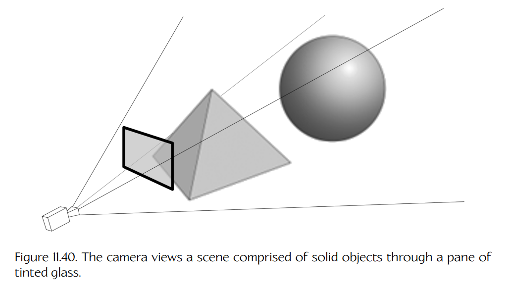

**Figure 11.40.** 摄像机透过一块有色玻璃板观看由实体对象组成的场景。

这种混合操作可以通过在透明片段颜色和像素已有颜色之间执行**线性插值**（linear interpolation, lerp）来实现。这个 lerp 在三维 RGB “颜色立方体”空间中进行，如 [Section 11.2.3.11](02-lights-camera-action.md#112311-rgb-颜色立方体) 中所述。一个称为 **alpha** 的参数决定透明片段颜色应以多大比例混合到像素已有颜色中：

$$
\mathbf{C}'_p = \alpha\mathbf{C}_f + (1-\alpha)\mathbf{C}_p,
$$

其中，$\mathbf{C}_p$ 是帧缓冲区中像素已有的颜色，$\mathbf{C}_f$ 是正在绘制的透明片段颜色，而 $\mathbf{C}'_p$ 是该像素最终混合后的颜色。

参数 $\alpha$ 用于衡量片段有多透明。当 $\alpha = 0$ 时，该片段不会对最终颜色贡献任何内容——已有颜色保持不变——这意味着该片段表现得像完全透明一样。当 $\alpha = 1$ 时，该片段颜色会完全覆盖已有颜色，这意味着该片段实际上是不透明的。$\alpha$ 在 0 到 1 之间的任意值都会产生一种由片段颜色与像素颜色混合而成的输出颜色，意味着该片段是半透明的（类似有色玻璃）。

**Figure 11.41.** 当 $N$ 个透明片段位于摄像机成像平面与最近的不透明片段之间时，我们希望混合所有 $N + 1$ 个片段的颜色，以产生像素的最终颜色。在这个例子中，$N = 3$，因此该像素颜色将是四个片段颜色的混合结果。

Alpha 是场景中几何体的许多可能**材质属性**（material properties）之一。6 为了将这一材质属性传达给渲染引擎，它通常会附加在材质的漫反射 RGB 颜色上（也称为材质的**漫反射率**，diffuse reflectance，或其 **albedo**）。片段颜色通常表示为 RGBA 颜色，也就是一个四维颜色向量 $\mathbf{C} = (R, G, B, A)$，其中约定 $A=\alpha$。7 漫反射材质颜色通常与场景中三角形网格的顶点一起存储，而逐片段颜色要么作为光照计算的一部分计算出来，要么如 [Section 11.3.10.7](03-foundations-of-3d-rendering.md#113107-透视正确属性插值) 所述，简单地从顶点颜色插值得到。

> **脚注 6**：在日常谈话中，游戏程序员倾向于把 $\alpha$ 称为材质的“透明度”。不过，更准确地说，它应该称为“不透明度”，因为 $\alpha = 1$ 会使材质显示为不透明。

> **脚注 7**：换一种角度看，$A$ 是希腊大写字母 “alpha”，而不是英文字母表的第一个字母。

**渲染透明几何体。**

如果我们把有色透明三角形和不透明三角形混在一起，并用带深度缓冲的光栅化算法渲染整个场景，那么我们就无法“透过”有色玻璃看到任何东西。玻璃表面的片段最终会覆盖其后方不透明对象的片段。显然，我们需要另一种方法。

渲染透明几何体时，我们希望混合每个像素上**多个重叠片段**的颜色。具体来说，如果有 $N$ 个透明片段位于摄像机成像平面与最近的不透明片段之间，我们希望将所有 $N + 1$ 个片段的颜色混合在一起，得到该像素的最终颜色。这个概念如 [Figure 11.41](#figure-1141) 所示。

为了正确渲染包含透明表面的场景，相比渲染完全不透明的场景，我们必须以两种不同方式处理：

- 需要扩展光栅化算法，使某些片段能够将其颜色与帧缓冲区中已有的颜色混合，而不是总是覆盖已有颜色。

- 需要分两遍渲染场景。第一遍只绘制不透明几何体，并配置光栅化器，使被渲染片段覆盖帧缓冲区中的颜色。第二遍按照深度对透明几何体排序，并按从后到前的顺序渲染它们。我们还会配置光栅化器，使这一遍中渲染的每个片段都将其颜色与帧缓冲区中已有颜色混合。

这种方法之所以有效，是因为在第二遍中，只有那些比不透明几何体更靠近摄像机的透明三角形会通过深度测试并被绘制。通过将这些透明片段的颜色与帧缓冲区中已经存在的颜色（第一遍中写入的不透明对象颜色）混合，我们可以获得观察一个对象透过有色透明玻璃平面时预期看到的染色效果。需要强调的是，这并不是一种物理正确的方式，不能真正模拟光如何穿过参与介质传播。但它能产生一种看起来相当可信的结果。

#### 11.3.12.1 顺序无关透明（OIT）

按从后到前顺序渲染透明几何体，会受到我们已经讨论过的画家算法问题影响：即使预先把三角形按从后到前排序，相互相交的三角形仍然无法被正确渲染。对于只包含少量薄片透明有色玻璃的简单场景，画家算法可以工作得相当不错，但它不适合更复杂的场景。

一类统称为**顺序无关透明**（order-independent transparency, OIT）的渲染技术旨在绕过这些问题。OIT 技术通常会按每个像素维护片段列表。在透明遍中，透明几何体以任意顺序渲染。随着它们被光栅化，每个片段都会被追加到适当像素的片段列表中。随后，这些片段会按深度排序，并进行 alpha 混合，以在帧缓冲区中生成每个像素的最终颜色。

逐像素维护片段列表可能看起来不太现实。然而，在第二遍中渲染透明几何体时，每个像素上的重叠三角形数量通常相当少，因为只有那些恰好位于最近不透明表面与摄像机成像平面之间的三角形片段才需要考虑。我们可以使用一种暴力实现方式：为每个像素关联一个固定容量数组，用来存储预定义数量的片段。更实用的实现则会为每个像素存储片段链表。这种 OIT 实现依赖现代 GPU 的一些特性，包括像素着色器向 VRAM 中任意数据缓冲区写入的能力，以及原子操作的引入，使多个并发着色器实例能够安全地更新同一个像素的片段列表。

### 11.3.13 抗锯齿

当一个三角形被光栅化时，它的边缘可能看起来呈锯齿状——这就是我们都熟悉并且爱恨交织的“阶梯”效果。严格来说，走样产生的原因在于：为了生成位图图像，我们使用一个由**离散光传感器**组成的网格，对现实中平滑、**连续**8 的二维光信号进行**采样**。（关于采样和走样的详细讨论，见 [Section 15.2](../15-audio/02-the-mathematics-of-sound.md#152-声音的数学)。）

> **脚注 8**：光子以离散量子携带能量。但撞击成像表面的光子数量如此之多，以至于实际上可以认为是无限的。这就是为什么我们可以把图像信号看作连续信号。

术语**抗锯齿**（antialiasing）描述任何能减少走样造成的视觉伪影的技术。对渲染场景进行抗锯齿的方法有很多种。几乎所有方法的净效果，都是通过将渲染三角形的边缘与周围像素混合来“软化”边缘。每种技术都有独特的性能、内存占用和质量特征。[Figure 11.42](#figure-1142) 展示了一个场景：首先没有抗锯齿，然后使用 $4\times$ MSAA，最后使用 Nvidia 的 FXAA 技术。

#### 11.3.13.1 全屏抗锯齿（FSAA）

在**全屏抗锯齿**（full-screen antialiasing）中，也称为**超采样抗锯齿**（super-sampled antialiasing, SSAA），场景会被渲染到一个比实际屏幕更大的帧缓冲区中。帧渲染完成后，得到的超大图像会被**下采样**（downsampled）到目标分辨率。实际上，这样做会使图像在 $x$ 和 $y$ 轴上的有效采样频率翻倍，从而减少走样效果。

在 $4\times$ 超采样中，渲染图像的宽度和高度都是屏幕的两倍，因此帧缓冲区占用四倍内存。它还需要四倍的 GPU 处理能力，因为像素着色器必须为每个屏幕像素运行四次。FSAA 相关成本很高，因此实践中很少使用。

![Figure 11.42 No antialiasing (left), 4x MSAA (center), and NVIDIA’s FXAA, preset 3 (right). Image from NVIDIA’s FXAA white paper by Timothy Lottes [240].](../../assets/images/volume-02/chapter-11/figure-11-42-no-antialiasing-msaa-fxaa-comparison.png)

**Figure 11.42.** 无抗锯齿（左）、$4\times$ MSAA（中）以及 NVIDIA 的 FXAA preset 3（右）。图像来自 Timothy Lottes 撰写的 NVIDIA FXAA 白皮书 [240]。

#### 11.3.13.2 多重采样抗锯齿（MSAA）

**多重采样抗锯齿**（multisampled antialiasing, MSAA）是一种技术，它能提供与 FSAA 相当的视觉质量，同时消耗少得多的 GPU 带宽（以及相同数量的视频 RAM）。为了理解 MSAA 的工作方式，回想一下，光栅化一个三角形的过程实际上可以归结为三个不同操作：

1. 确定三角形覆盖哪些像素（光栅化，即覆盖测试）；

2. 确定每个像素是否被其他三角形遮挡（深度测试）；

3. 确定每个像素的颜色，前提是覆盖测试和深度测试表明该像素确实应该被绘制（像素着色）。

在没有抗锯齿的情况下光栅化三角形时，覆盖测试、深度测试和像素着色操作都在每个屏幕像素中的一个理想化点上运行，通常位于像素中心。在 MSAA 中，覆盖测试和深度测试会在每个屏幕像素内称为**子采样点**（subsamples）的 $N$ 个点上运行。

$N$ 通常选择为 2、4、5、8 或 16。然而，无论使用多少个子采样点，像素着色器每个屏幕像素只运行**一次**。这使 MSAA 相比 FSAA 在 GPU 带宽方面具有很大优势，因为着色通常比覆盖测试和深度测试昂贵得多。

在 $N\times$ MSAA 中，深度、模板和颜色缓冲区都会被分配为原本大小的 $N$ 倍。对于每个屏幕像素，这些缓冲区包含 $N$ 个“槽位”，每个子采样点一个槽位。光栅化三角形时，覆盖测试和深度测试会针对三角形每个片段内的 $N$ 个子采样点运行 $N$ 次。如果 $N$ 次测试中至少有一次表明该片段应该被绘制，像素着色器就运行一次。随后，像素着色器得到的颜色只会存储到那些对应于落在三角形**内部**的子采样点槽位中。整个场景渲染完成后，超大的颜色缓冲区会被下采样，得到最终的屏幕分辨率图像。这个过程涉及对每个屏幕像素的 $N$ 个子采样槽位中找到的颜色值求平均。其净结果是，在着色成本等于非抗锯齿图像的情况下，得到一幅抗锯齿图像。

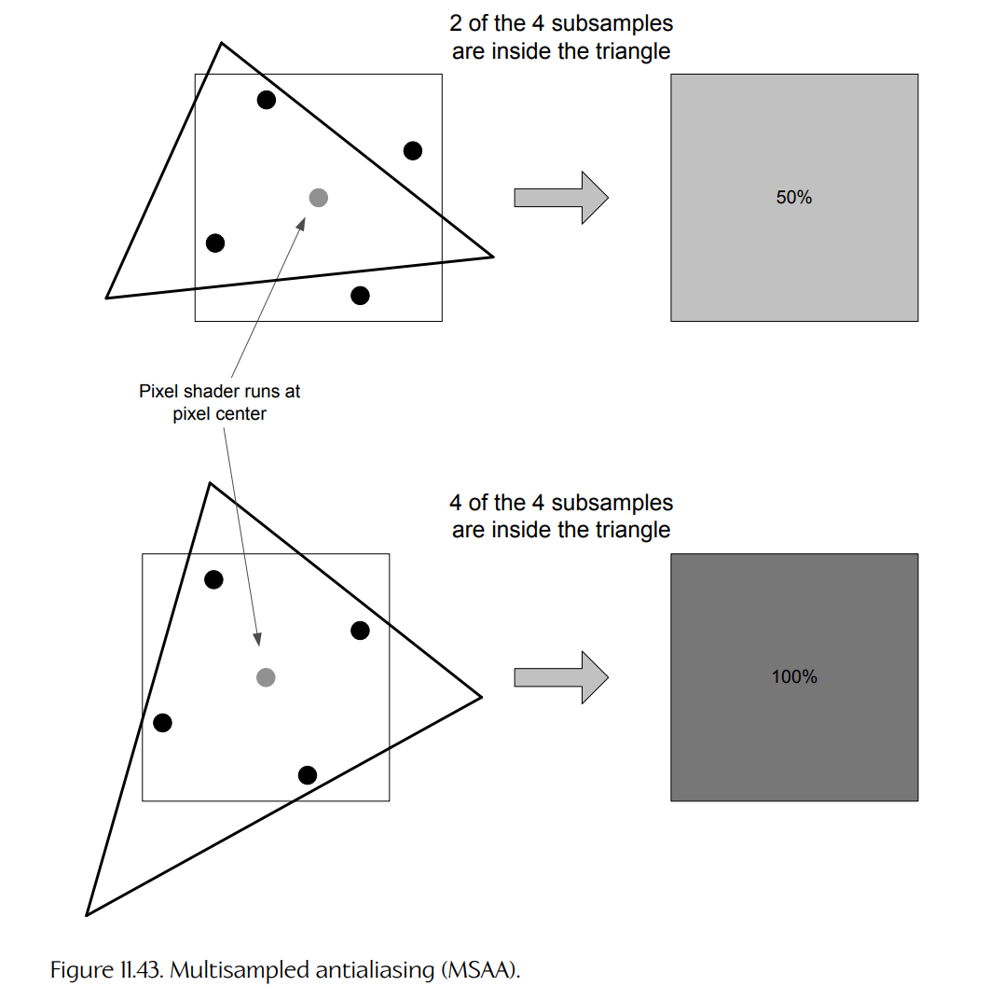

**Figure 11.43.** 多重采样抗锯齿（MSAA）。

[Figure 11.43](#figure-1143) 展示了 $4\times$ MSAA 技术。关于 MSAA 的更多信息，见 [241]。

**像素不是小盒子。**

MSAA 技术很好地强调了一点：光栅化并不是给小方形“像素盒子”涂颜色的过程，而是对连续二维信号进行**采样**以生成离散二维图像的过程。Alvy Ray Smith 在 1995 年写过一篇很好的文章，详细讨论了这个主题。它可以在 [242] 找到，也可以在网上搜索 “A Pixel Is Not A Little Square”。

#### 11.3.13.3 覆盖采样抗锯齿（CSAA）

这项技术是 NVIDIA 开创的 MSAA 技术优化。对于 $4\times$ CSAA，像素着色器运行一次，每个片段会对四个子采样点执行深度测试和颜色存储，但像素覆盖测试会对每个片段的 16 个“覆盖子采样点”执行。这会在三角形边缘产生更细粒度的颜色混合，类似于 $8\times$ 或 $16\times$ MSAA 的效果，但内存和 GPU 成本仅为 $4\times$ MSAA。

#### 11.3.13.4 形态学抗锯齿（MLAA）

**形态学抗锯齿**（morphological antialiasing）将精力集中在只校正场景中最容易受到走样影响的区域。在 MLAA 中，场景以正常尺寸渲染，然后对其进行扫描，以识别阶梯状图案。找到这些图案后，会对其进行模糊处理，以减少走样效果。**快速近似抗锯齿**（fast approximate antialiasing, FXAA）是 NVIDIA 开发的一项优化技术，其方法与 MLAA 类似。

关于 MLAA 的详细讨论，见 [243]。FXAA 的详细说明见 [244]。

#### 11.3.13.5 子像素形态学抗锯齿（SMAA）

**子像素形态学抗锯齿**（Subpixel Morphological Antialiasing, SMAA）将形态学抗锯齿（MLAA 和 FXAA）技术与多重采样/超采样策略（MSAA、SSAA）结合起来，以生成更准确的子像素特征。和 FXAA 一样，它是一种成本较低的技术，但相比 FXAA，它对最终图像的模糊程度更小。因此，可以说它是当今最好的 AA 方案之一。本书不会详细覆盖这个主题，但你可以在 [245] 阅读更多关于 SMAA 的内容。

#### 11.3.13.6 时间抗锯齿（TAA）

**时间抗锯齿**（temporal antialiasing, TAA）通过结合多个已渲染帧中的信息来减少锯齿。在这项技术中，每个像素在每帧中只采样一次，但每个像素内部采样点的精确位置会在帧与帧之间随机移动，或按照预定义模式移动。这称为对采样位置进行**抖动**（jittering）。多个帧的采样像素颜色会混合在一起，以产生最终的抗锯齿图像。虽然 TAA 的质量可与超采样相当，但它往往容易产生图像重影和模糊。

#### 11.3.13.7 基于机器学习的抗锯齿（DLSS、PSSR）

NVIDIA 开发了一项称为**深度学习超采样**（Deep Learning Super Sampling, DLSS）的技术。使用 DLSS 时，渲染引擎可以每帧渲染一幅相对低分辨率的图像，然后由生成式神经网络“填补空隙”，生成一幅看起来像以更高分辨率渲染出来的图像。这可以大幅减少渲染单个高分辨率帧所需的时间。为实现这一点，DLSS 会以类似时间抗锯齿的方式使用之前已渲染帧的信息。除了提升渲染效率外，DLSS 也可以用于生成抗锯齿图像。

**PlayStation Spectral Super Resolution**（PSSR）是另一种基于机器学习的 PlayStation 5 Pro 上采样技术。这项技术与 NVIDIA 的技术类似，但生成的图像比 DLSS 略微更柔和。

### 11.3.14 纹理

当三角形相对较大时，按顶点指定表面属性可能过于粗糙。线性属性插值并不总是我们想要的效果，并且可能导致不理想的视觉异常。为了克服这些限制，渲染工程师使用称为**纹理贴图**（texture maps）的位图图像。

纹理通常包含颜色信息，并且通常会投影到网格的三角形上。在这种情况下，它的作用有点像我们小时候贴在胳膊上的那些傻乎乎的假纹身。但纹理也可以包含除颜色之外的其他视觉表面属性。而且，纹理不一定必须投影到网格上——例如，纹理可以作为独立的数据表使用。纹理中的单个图像元素称为**纹素**（texels），以区别于屏幕上的像素。

在大多数图形硬件上，纹理位图的尺寸受到 2 的幂限制。典型纹理尺寸包括 $256 \times 256$、$512 \times 512$、$1024 \times 1024$ 和 $2048 \times 2048$；不过某些 GPU 和 DirectX feature level 支持高达 $16384 \times 16384$ 的尺寸。

#### 11.3.14.1 纹理贴图的用途

最常见的纹理类型称为**漫反射贴图**（diffuse map）或 **albedo 贴图**（albedo map）。它描述表面上每个纹素处的漫反射表面颜色，作用类似表面上的贴花或喷漆，并且在光照计算中扮演重要角色。其他类型的纹理也会在光照计算期间使用：

- **法线贴图**（normal maps）会在每个纹素处存储单位法线向量，并编码为 RGB 值；

- **光泽贴图**（gloss maps）或**镜面反射贴图**（specular maps）编码每个纹素处表面应有多光亮；

- **环境贴图**（environment maps）包含周围环境的图像，用于渲染反射并处理间接光照；

- **光照贴图**（light maps）存储场景中表面的预计算光照信息；

- **阴影贴图**（shadow maps）存储从单个光源视角看到的深度信息，用于绘制阴影；

- 以及许多其他类型。

关于纹理如何用于各种**基于图像的光照**（image-based lighting）技术，可参见 [Section 12.5.2](../12-lighting-and-post-processing/05-lighting-with-triangle-rasterization.md#1252-基于图像的光照)。

纹理贴图也可以用于编码几何细节。**凹凸贴图**（bump map）编码局部扰动，使原本平坦或光滑的表面产生细节变化。纹理也可以编码大尺度地形特征，例如丘陵、山谷和山脉，在这种情况下它称为**高度图**（heightmap）。纹理贴图可以向渲染引擎提供附加数据，例如编码 Perlin 噪声。

纹理甚至可以即时生成。例如，在 Naughty Dog 引擎中，粒子系统可用于模拟角色身体上汗珠或血迹向下流动的痕迹。这些痕迹会被渲染到离屏纹理中，随后作为遮罩使用，以显示角色皮肤上的湿润或血迹。

**一维与三维纹理。**

纹理不一定是二维的。一维纹理可以用于存储复杂数学函数的采样值、颜色到颜色的映射表，或任何其他类型的查找表（look-up table, LUT）。查找表对于执行后处理任务很有用，例如颜色校正或调色。为此，帧缓冲区中的颜色会被分配索引，用于从 LUT 纹理中查找新颜色。这些重新映射后的颜色会替换最终帧缓冲区中的原始颜色，从而生成颜色校正或调色后的效果。调色可用于产生类似电影《辛德勒的名单》中红衣女孩与黑白背景形成对比的经典场景，也可用于实现电影《拯救大兵瑞恩》和《少数派报告》中使用的**漂白旁路**（bleach bypass）效果。

现代图形硬件也支持三维纹理。3D 纹理可以理解为一叠 2D 纹理。三维纹理可用于描述对象的外观或体积属性。例如，我们可以渲染一个大理石球体，并允许它被任意平面切开。无论切口位于何处，纹理在切面上都会看起来连续且正确，因为纹理在球体的整个体积中都有良好定义且连续。

#### 11.3.14.2 纹理坐标

让我们考虑如何将二维纹理投影到网格上。为此，我们定义一个称为**纹理空间**（texture space）的二维坐标系。纹理坐标通常表示为一对归一化数字 $(u, v)$。这些坐标的范围始终是从纹理左下角的 $(0,0)$ 到右上角的 $(1,1)$。使用这种归一化坐标，可以让同一个坐标系在不考虑纹理尺寸的情况下通用。

为了将三角形映射到 2D 纹理上，我们只需在每个顶点 $i$ 处指定一对纹理坐标 $(u_i, v_i)$。这实际上将三角形映射到了纹理空间中的图像平面上。[Figure 11.44](#figure-1144) 展示了一个纹理映射示例。

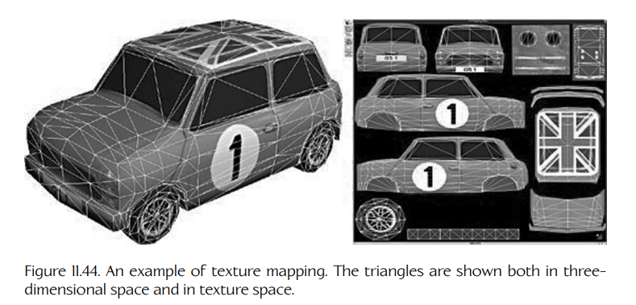

**Figure 11.44.** 纹理映射示例。图中同时展示了三维空间和纹理空间中的三角形。

#### 11.3.14.3 纹理寻址模式

纹理坐标允许超出 $[0,1]$ 范围。图形硬件可以通过以下任意一种方式处理越界纹理坐标。这些方式称为**纹理寻址模式**（texture addressing modes）；使用哪种模式由用户控制。

- **Wrap**。在这种模式下，纹理会在每个方向上不断重复。所有形式为 $(ju, kv)$ 的纹理坐标都等价于坐标 $(u, v)$，其中 $j$ 和 $k$ 是任意整数。

- **Mirror**。这种模式类似 wrap 模式，不同之处在于：当 $u$ 为奇数整数倍时，纹理会关于 $v$ 轴镜像；当 $v$ 为奇数整数倍时，纹理会关于 $u$ 轴镜像。

- **Clamp**。在这种模式下，当纹理坐标落在正常范围之外时，纹理外边缘附近的纹素颜色会被简单地延伸出去。

- **Border color**。在这种模式下，用户指定的任意颜色会用于 $[0,1]$ 纹理坐标范围之外的区域。

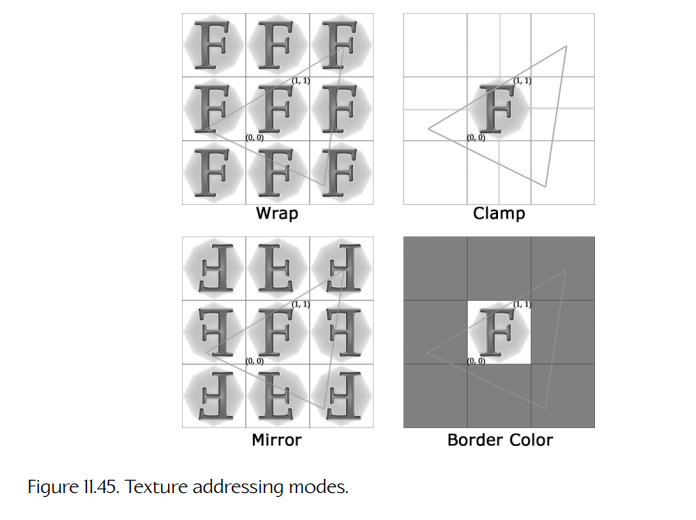

**Figure 11.45.** 纹理寻址模式。

这些纹理寻址模式如 [Figure 11.45](#figure-1145) 所示。

#### 11.3.14.4 纹理格式

纹理位图几乎可以以任意图像格式存储在磁盘上，只要你的游戏引擎包含将其读入内存所需的代码。常见格式包括 Targa（.tga）、Portable Network Graphics（.png）、Windows Bitmap（.bmp）和 Tagged Image File Format（.tif）。在内存中，纹理通常表示为二维（带步幅的）像素数组，并使用各种颜色格式，例如 RGB888、RGBA8888、RGB565、RGBA5551 等。

大多数现代显卡和图形 API 都支持**压缩纹理**（compressed textures）。DirectX 支持一组称为 **S3 Texture Compression**（S3TC）的压缩格式。这些格式也称为 DXT$n$（大概代表 “DirectX Texture”）或 BC$n$（代表 “Block Compression”），其中 $n$ 是一个索引，用于指定所使用的具体压缩方法。这里不会介绍细节，但基本思想是将纹理分解为 $4 \times 4$ 像素块，并使用一个小型调色板存储每个块的颜色。你可以在 [246] 和 [247] 阅读更多关于 S3 压缩纹理格式的内容。关于纹理压缩的更多信息，可参见 [248]。Aras Pranckevičius 的这篇博客文章 [249] 也是另一个极好的资源。

压缩纹理显然有一个好处：相比未压缩纹理，它们使用更少内存。另一个意想不到的额外优点是，它们渲染起来也更快。S3 压缩纹理能够实现这种加速，是因为其内存访问模式更加缓存友好——相邻像素的 $4 \times 4$ 块会存储在一个 64 位或 128 位机器字中——而且一次能有更多纹理内容放入缓存中。压缩纹理确实会受到压缩伪影影响。虽然这些异常通常不明显，但在某些情况下必须使用未压缩纹理。

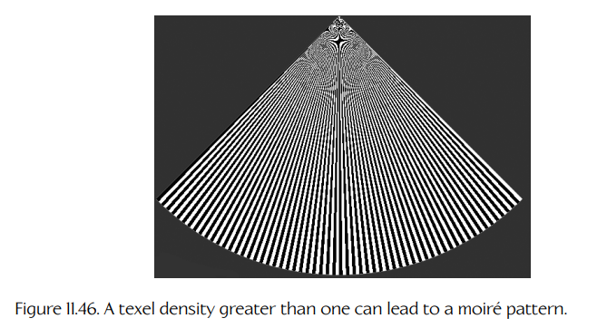

**Figure 11.46.** 纹素密度大于 1 可能导致摩尔纹图案。

#### 11.3.14.5 纹素密度与多级渐远纹理

设想渲染一个全屏 quad（由两个三角形组成的矩形），并给它映射一张分辨率与屏幕完全匹配的纹理。在这种情况下，每个纹素都恰好映射到屏幕上的单个像素，因此我们称**纹素密度**（texel density，即纹素与像素之比）为 1。当同一个 quad 从远处观察时，它在屏幕上的面积会变小。纹理分辨率并没有改变，因此该 quad 的纹素密度现在大于 1（意味着不止一个纹素会贡献给每个像素）。

显然，纹素密度不是一个固定量——它会随着带纹理对象相对于摄像机的移动而变化。纹素密度会影响三维场景的内存消耗和视觉质量。当纹素密度远小于 1 时，纹素会显著大于屏幕上的像素，你会开始看到纹素边缘。这会破坏视觉幻觉。当纹素密度远大于 1 时，许多纹素会贡献给屏幕上的单个像素。这可能产生如 [Figure 11.46](#figure-1146) 所示的**摩尔条纹图案**（moiré banding pattern）。更糟的是，随着摄像机角度或位置发生细微变化，像素边界内不同纹素会主导其颜色，导致像素颜色看起来游动和闪烁。使用非常高纹素密度渲染远处对象也可能浪费内存，如果玩家**永远**无法靠近它。毕竟，如果没有人会看到所有那些细节，为什么还要把这样一张高分辨率纹理保存在内存中？

理想情况下，我们希望无论近处还是远处对象，都始终保持接近 1 的纹素密度。这不可能精确实现，但可以通过一种称为 **mipmapping** 的技术近似实现。对于每张纹理，我们会创建一系列较低分辨率位图，每一张的宽度和高度都是前一张的一半。我们将这些图像中的每一张称为一个 **mipmap**，或 **mip level**。例如，一张 $64 \times 64$ 纹理会具有以下 mip level：$64 \times 64$、$32 \times 32$、$16 \times 16$、$8 \times 8$、$4 \times 4$、$2 \times 2$ 和 $1 \times 1$，如 [Figure 11.47](#figure-1147) 所示。一旦我们为纹理生成 mipmap，图形硬件就会根据三角形距离摄像机的远近选择合适的 mip level，试图保持接近 1 的纹素密度。例如，如果某个纹理在屏幕上占据 $40 \times 40$ 的区域，可能会选择 $64 \times 64$ mip level；如果同一纹理只占据 $10 \times 10$ 区域，则可能使用 $16 \times 16$ mip level。正如下面会看到的，**三线性过滤**（trilinear filtering）允许硬件采样两个相邻 mip level 并混合结果。在这种情况下，$10 \times 10$ 区域可能会通过混合 $16 \times 16$ 和 $8 \times 8$ mip level 来映射。

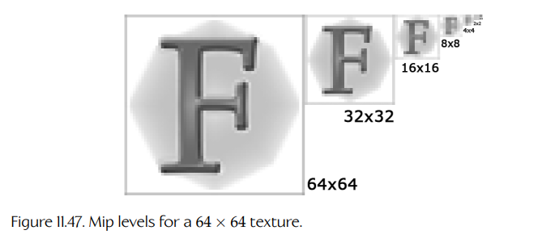

**Figure 11.47.** 一张 $64 \times 64$ 纹理的 mip level。

#### 11.3.14.6 世界空间纹素密度

术语“纹素密度”也可以用于描述带纹理表面上纹素与世界空间面积的比率。例如，一个映射了 $256 \times 256$ 纹理的 2 米立方体，其纹素密度为 $256^2 / 2^2 = 16384$。我会把它称为**世界空间纹素密度**（world-space texel density），以区别于目前为止我们一直讨论的屏幕空间纹素密度。

世界空间纹素密度不需要接近 1，事实上，其具体值通常会远大于 1，并且完全取决于你选择的世界单位。尽管如此，让对象以相当一致的世界空间纹素密度进行纹理映射仍然很重要。例如，我们会期望立方体的六个面都占据相同的纹理面积。如果不是这样，那么立方体某一面的纹理会比另一面呈现出更低分辨率的外观，这可能会被玩家注意到。许多游戏工作室会为美术团队提供指导规范和引擎内工具，用于帮助他们在整个场景中保持合理一致的世界空间纹素密度。

#### 11.3.14.7 纹理过滤

当渲染带纹理三角形的某个像素时，图形硬件会通过考虑像素中心落在纹理空间中的位置来采样纹理贴图。纹素与像素之间通常不存在干净的一一映射关系，像素中心可能落在纹理空间中的任意位置，包括恰好落在两个或多个纹素的边界上。因此，图形硬件通常必须采样不止一个纹素，并混合得到的颜色，才能获得实际采样到的纹素颜色。我们称这一过程为**纹理过滤**（texture filtering）。

大多数显卡支持以下几种纹理过滤：

- **最近邻**（nearest neighbor）。在这种粗糙方法中，会选择中心点距离像素中心最近的那个纹素。当启用 mipmapping 时，会选择分辨率最接近、但高于实现屏幕空间纹素密度为 1 所需理想理论分辨率的 mip level。

- **双线性过滤**（bilinear）。在这种方法中，会采样像素中心周围的四个纹素，最终颜色是这些纹素颜色的加权平均值（权重基于各纹素中心到像素中心的距离）。当启用 mipmapping 时，会选择最接近的 mip level。

- **三线性过滤**（trilinear）。在这种方法中，会对两个最接近的 mip level 分别使用双线性过滤（一个分辨率高于理想值，另一个低于理想值），然后对这两个结果再进行线性插值。这可以消除屏幕上 mip level 之间突兀的视觉边界。

- **各向异性过滤**（anisotropic）。双线性过滤和三线性过滤都会采样 $2 \times 2$ 的正方形纹素块。当带纹理表面正对观察方向时，这样做是正确的；但当表面相对于虚拟屏幕平面呈斜角时，这样做就不正确。各向异性过滤会在一个与观察角度对应的梯形区域内采样纹素，从而提升斜视角下带纹理表面的质量。

#### 11.3.14.8 纹理流送与虚拟纹理

通常情况下，整张纹理贴图，包括其所有 mip level，都会驻留在 VRAM 中。这样一来，GPU 上的纹理采样器在执行过滤和混合时，就可以访问所有 mip level 中所需的任何纹素。对于较小纹理来说，这种方式效果很好；但纹理尺寸越大，它就越消耗内存。此外，GPU 通常会施加最大纹理尺寸限制。例如，在 DirectX feature level 9_3 上，最大支持尺寸为 $4096 \times 4096$；在 feature level 10_1 上，则为 $8192 \times 8192$。（关于 DirectX feature level 的更多内容，见 [Section 11.4.5.3](04-programming-the-3d-graphics-pipeline.md#11453-directx-功能级别)。）

id Software 的 Rage 引擎（id Tech 5）引入了对**巨型纹理**（megatextures）的支持。其思路是让美术师创作尺寸约为 $128\text{k} \times 128\text{k}$ 像素的超大纹理，将其划分成由更小子纹理组成的网格，这些子纹理称为 **tiles**，然后根据需要将这些 tile 动态流送到 VRAM 中。megatexture 概念的目标，是让大型开放世界可以使用永不重复的唯一纹理来绘制。虽然这项特定技术并没有真正流行起来，但随后出现了一系列密切相关的技术。

**纹理流送**（texture streaming）是一项允许纹理（无论是巨大 megatexture 的片段，还是传统的小型纹理）在需要时被流送到 VRAM 中、不再绘制时再被卸载的技术。许多游戏引擎都会这样做，包括 Naughty Dog 的引擎。在一些纹理流送方案中，包括 Naughty Dog 的方案，同一张纹理的不同 mip level 可以分别加载。这样，最低分辨率的 mip 可以始终驻留并可用于绘制，而当需要更多细节时，更高分辨率的 mip 可以按需流入。

**虚拟纹理**（virtual textures）在概念上与纹理流送和 megatexture 技术相关。在虚拟纹理中，每张纹理都会被分解为相对较小的 tile，通常尺寸为 $128 \times 128$ 像素。GPU 和图形 API 会管理各个 tile 在 VRAM 中的驻留状态，从而只让纹理中相关的部分占用宝贵的内存资源。Unreal Engine 区分了**运行时虚拟纹理**（runtime virtual textures）和**流送虚拟纹理**（streamed virtual textures）：前者通常由程序在运行时生成，后者通常离线创作，并从磁盘流入或流出 VRAM。

只将纹理中选定的 tile 保存在物理 VRAM 中会带来一个问题：纹理过滤会失效。正常情况下，过滤需要访问相邻纹素和相邻 mip level，才能在采样期间正确过滤并混合纹素颜色。但如果虚拟纹理的各个 tile 完全由应用程序管理（就像 id Tech 5 引擎中那样），GPU 就不会“知道”某些 tile 在更大纹理的语境中本应彼此相邻，过滤就会在 tile 接缝处失效。为了解决这一问题，DirectX feature level 11_0 及之后版本支持一种称为 **tiled resources** 的特性。该特性向 GPU 提供正确跨越 tile 边界进行过滤所需的相邻信息。这项特性有时也称为**部分驻留纹理**（partially-resident textures）。使用 tiled resources 时，GPU 可访问的最大纹理尺寸为 $16384 \times 16384$。
