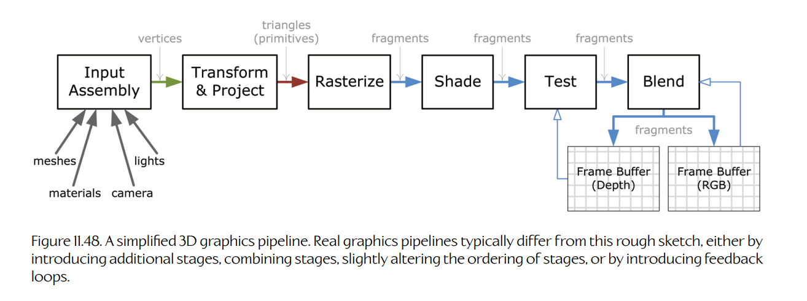
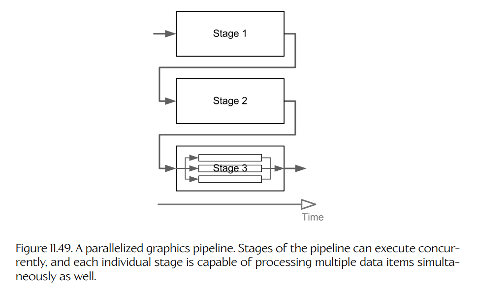
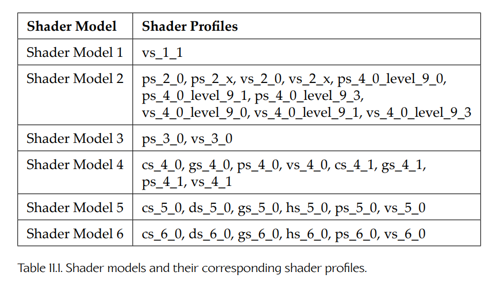
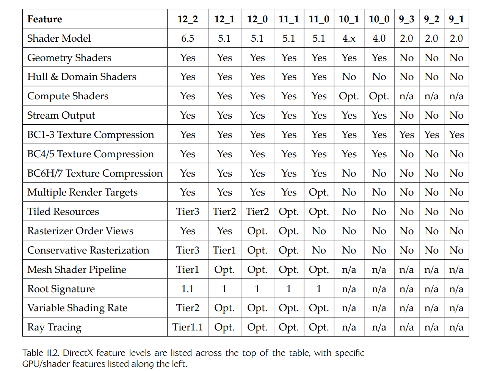
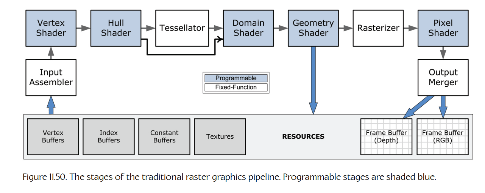
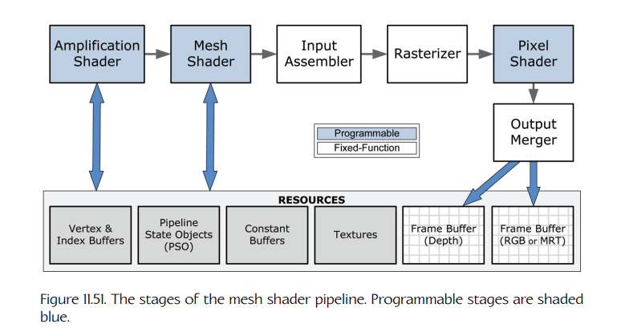

## 11.4 三维图形管线编程

在 [Section 11.3.1.4](03-foundations-of-3d-rendering.md#11314-三维图形管线) 中，我们说过，大多数实时 3D 渲染引擎都基于三角形光栅化（而不是光线追踪或辐射度方法）。这类引擎通常采用一种两层架构：下层是 **3D 图形管线**（3D graphics pipeline），上层才是严格意义上的渲染引擎。

在本节中，我们将较为详细地探讨 3D 图形管线。我们会了解管线化架构背后的动机，以及管线通常如何通过 OpenGL、DirectX、Vulkan 或 Metal 等图形 API 来配置和控制。我们还会看到，如何通过使用 HLSL 或 PSSL 等着色语言编写着色器程序来自定义管线。随后，我们将在 [Section 11.5](05-pipeline-management-the-application-layer.md) 中讨论图形栈中的应用层。

任何图形 API 都可用于配置、控制和编程市场上的任何 GPU。因此，所有这些 API 都围绕一套共同的概念和功能来运作（当然，它们在向程序员暴露这些概念和功能的方式上会略有不同）。本节并不打算作为教程，也不打算充当任何一种图形 API 的文档。网上和其他书籍中已经有大量资源承担了这些用途。我们这里的目标主要是建立意识，并帮助读者理解所有 GPU 和所有图形 API 共有的关键概念。

### 11.4.1 基于光栅化的渲染算法

3D 图形管线的目的，是生成由 3D 几何**图元**（geometric primitives）组成的 2D 光栅化图像。这些图元通常采用三角形网格的形式，不过线带（line strip）和点云图元也受到支持。为了完成这一任务，图形管线必须执行以下算法步骤：

- **变换**（transformation）。每个顶点的三维位置会被变换到视图空间中。

- **投影**（projection）。视图空间中的顶点位置会被投影到二维屏幕空间中。

- **光栅化**（rasterization）。每个投影后的三角形会被光栅化，以确定它覆盖了哪些屏幕像素。光栅化实际上会把三角形表面分解成若干片段（fragment），每个片段都被恰好一个像素“看到”。

- **着色**（shading）。每个片段的颜色会被计算出来，其方式可以是对从顶点属性中获得的颜色信息进行插值，也可以是执行**逐片段光照**（per-fragment lighting）计算。

<a id="figure-1148"></a>


**Figure 11.48.** 一个简化的 3D 图形管线。真实图形管线通常会与这个粗略示意不同，可能会引入额外阶段、合并阶段、略微改变阶段顺序，或引入反馈循环。

- **片段测试**（fragment testing）。片段最多会经历两个可选测试：深度测试和模板测试。如果任一测试失败，该片段就会被丢弃（不被渲染）。

- **合并与混合**（merging and blending）。对于通过所有相关测试的每个片段，其颜色会被写入帧缓冲的 RGB 平面，它到相机的距离会被写入深度平面。片段颜色也可以选择性地与该像素原先已有的颜色进行**混合**（blend），以实现合成、透明等效果。

图形管线也可以渲染高阶样条曲面，但这些曲面必须先被细分成管线能够处理的某种图元类型，然后再由上面列出的步骤处理。

这些算法步骤如 Figure 11.48 所示，大致对应于 3D 图形管线的各个**阶段**（stages）。不过正如我们将在后续小节中看到的，大多数真实图形管线都与上图提供的草图有显著差异。上面列出的某些阶段可能会合并成一个阶段；其他阶段可能会拆分为若干子阶段。通常还会存在额外阶段。不过，所有基于光栅化的渲染引擎都至少需要执行上面列出的所有算法步骤，并且大致按照这里给出的顺序执行。

### 11.4.2 从算法到管线

我们已经多次提到，基于光栅化的渲染引擎的下层是一个**管线**（pipeline），但还没有解释为什么它要采用这种结构。如果我们再次观察基于光栅化渲染所涉及的算法步骤，就会发现每个步骤一次只处理**一个数据元素**：变换和投影一次处理一个顶点；光栅化一次处理一个三角形，并将其分解为若干片段；着色和测试步骤一次处理一个独立片段；合并步骤把单个片段与帧缓冲中对应的像素结合起来，因此它同样一次处理一个片段—像素对。

<a id="figure-1149"></a>


**Figure 11.49.** 一个并行化的图形管线。管线的各个阶段可以并发执行，并且每个单独阶段也可以同时处理多个数据项。

一次只处理一个数据元素看起来似乎效率不高，但实际上，这正是让基于光栅化的渲染极快运行所需要的“秘诀”。这里的关键观察是：每个数据元素都可以独立于场景中同类型的其他所有数据元素进行处理。用于变换和投影一个顶点的算法不允许“跨过网格”去检查或修改其他顶点。同样，用于光栅化一个三角形的算法不允许读取网格中任何其他三角形的数据。<sup>9</sup> 着色、测试和合并片段的算法，也不允许读取或写入其他片段，或帧缓冲中不相关的像素。这些算法步骤内在的数据独立性意味着它们不容易出现**数据竞争**（data races）。因此，通过把基于光栅化的渲染算法组织成一个由多个阶段组成的管线，让各阶段一次处理一个数据元素，并且独立于所有其他数据元素，我们就能让渲染引擎实现高度的**并行性**（parallelism）。

> **脚注 9**：几何着色器是这条规则的一个例外——它处理单个主三角形的三个顶点，但也可以选择性地获得描述网格中三个相邻三角形的另外三个顶点。

图形管线中的并行性可以通过两种方式实现。第一，管线中各个阶段的执行可以在时间上彼此重叠。第二，如果我们在 GPU 裸片上复制用于多次处理同一阶段的硬件，那么每个阶段也可以同时处理多个数据元素。Figure 11.49 展示了一个并行化的图形管线。

GPU 的架构专门用于支持这两类并行性。GPU 上的每个计算核心都围绕一种宽 SIMD 架构设计，通常有 32 条或 64 条通道。这使得 GPU 核心最多可以同时处理 32 或 64 个数据元素——前提是所有这些数据元素属于同一类型，并且由完全相同的着色器程序处理。一个 GPU 裸片包含大量这样的 SIMD 核心（通常约为 50 个或更多）。这使 GPU 能够并行执行一组异构工作负载，这些工作负载称为 **wavefronts** 或 **warps**。每个工作负载可以实现图形管线中的不同阶段。例如，一个 wavefront/warp 可能正在变换并投影一批 32 或 64 个顶点，而另一个 wavefront/warp 可能正在为一批片段着色。如 [Section 4.11](../../volume-01-foundations-and-core-engine-systems/04-parallelism-and-concurrent-programming/11-introduction-to-gpgpu-programming.md) 中所讨论的，GPU 被设计为在工作负载之间快速切换。因此，只要处理某个 wavefront/warp 时出现内存停顿，GPU 就可以直接切换去处理另一个 wavefront/warp。只要有足够的工作可做，GPU 的核心就可以始终保持繁忙。这解释了为什么 GPU 如此擅长图形处理——例如，在最大吞吐量下，一个拥有 50 个 SIMD 核心、且每个核心宽度为 32 条通道的 GPU，可以同时处理 $50 \times 32 = 1600$ 个数据元素！而拥有更多 SIMD 核心（和/或更宽通道数）的 GPU，还可以并行完成更多工作。

### 11.4.3 逻辑图形管线与物理图形管线

3D 图形管线实际上有两种表现形式，本书中我们称之为**逻辑管线**（logical pipeline）和**物理管线**（physical pipeline）。

**逻辑管线**代表一种编程范式，它充当管线实现者与使用管线的软件之间的契约。逻辑管线定义了管线中有哪些阶段、这些阶段以什么顺序连接，以及每个阶段能够执行哪些操作。逻辑管线的定义，以及用于配置和控制它的接口，由某种**图形 API**（graphics API）提供，例如 OpenGL、DirectX、Vulkan 或 Metal。

**物理管线**是某一种逻辑管线范式的具体实现。物理管线可能完全由运行在 CPU 上的软件实现。但更常见的是，它由运行在 CPU 上的软件、运行在驱动层的 GPU 专用软件、GPU 上的固定功能硬件，以及由图形程序员编写、由 CPU 编译并上传到 GPU 执行的小程序组成，这些小程序称为**着色器**（shaders）。

逻辑管线的阶段不一定与物理管线的阶段一一对应。例如，虽然逻辑管线明确区分了顶点着色器和像素着色器，但这两类着色器通常都运行在 GPU 上的通用 SIMD 核心上。

除了 GPU 驱动的实现之外，大多数图形 API 还会提供所谓的逻辑管线**参考实现**（reference implementation）。这种实现完全运行在软件中，旨在提供一种“基准真值”，GPU 实现可以与之比较，以确保正确性。因此，参考实现通常并不是以性能或帧率为目标来设计的。

### 11.4.4 高层与低层图形接口

今天的图形 API 可以分为两类：

- **高层 API**（high-level APIs）。这类 API 以更便于使用的方式实现图形管线范式。OpenGL 以及 DirectX 11 及更早版本都可以归为高层图形 API。

- **低层 API**（low-level APIs）。这类 API 以实现最大运行时性能为目标。DirectX 12、Vulkan、Metal，以及 PlayStation 4 和 PlayStation 5 的 Gnm 库，都是低层图形 API 的例子。

GPU 与 CPU 之间的接口非常复杂，部分原因在于 GPU 本身就是一块复杂的硬件，部分原因在于 GPU 芯片及其内存（VRAM）物理上位于一块插入主板 PCIe 插槽的扩展卡上，还有部分原因在于跨多个核心进行并发编程本身就很复杂。例如，要向 GPU 提供数据（例如顶点缓冲、索引缓冲、变换矩阵、纹理等），CPU 必须先把这些数据写入主 RAM 中的一块内存。然后这些数据会通过 PCIe 总线上传到 VRAM。CPU 核心和 GPU 是彼此独立的处理器，因此需要通过互斥锁等方式进行同步。而且，由于 GPU 高度并行，并发的着色器调用有时也需要同步，通常通过无锁原子操作来完成。

在 OpenGL 和 DirectX 11 这类高层图形 API 中，所有这些细节都由 API 在“底层”处理。这使得 API 相对易用——程序员只需要关注准备数据、配置管线，以及提交要绘制到屏幕上的几何体。然而，这类 API 有两个大问题。第一，它们有些不够灵活。例如，程序员几乎无法控制 VRAM 的管理方式。第二，因为这些 API 提供了相对简单的逻辑编程模型，并隐藏了许多硬件实际工作方式的细节，它们的实现往往存在难以解决的低效问题。

DirectX 12 和 Vulkan 这类低层图形 API 的开发，正是为了克服其高层对应物缺乏灵活性和性能受限的问题。这些 API 并不试图提供隐藏实现细节的便利编程范式，而是拥抱这些实现细节。这使程序员能够最大化渲染引擎效率，同时也向程序员暴露底层 GPU 硬件的所有强大能力。这类 API 的缺点是它们使用起来困难得多，因为程序员必须自行处理并发、内存管理等大量繁琐细节，而这些细节在高层图形 API 中原本由 API 代为处理。

本书不会深入讲解 DirectX 12 和 Vulkan 等低层图形 API 的细节。因此，我们会把大部分注意力放在高层 API 的工作方式上。不过，在讨论过程中，我们仍会涉及这两类 API 之间的一些关键差异。

### 11.4.5 功能级别与着色器模型

3D 图形管线的硬件能力随着时间发生了显著演进。GPU 的前身 3Dfx Inc. 的 Voodoo Graphics 加速卡，只能执行光栅化、着色和合并这几个阶段，而管线中更早的阶段则由运行在 CPU 上的软件实现。第一款“真正的”GPU 是 NVIDIA 的 GeForce 256 加速卡，它增加了在硬件中执行顶点变换和投影的能力，但整个图形管线的功能都是硬连线的；管线中的阶段高度可配置，但不可编程。在后来的 GPU 设计中，管线中的某些阶段变得可编程，同时新的细分曲面阶段和几何放大阶段也被加入管线。最近，GPU 厂商已经转向一种全新的管线架构，其核心是 **mesh shader** 和 **amplification shader**（我们将在 [Section 11.4.6.4](04-programming-the-3d-graphics-pipeline.md#11464-网格着色器管线) 中描述）。

GPU 的可编程能力以及用于编程 GPU 的语言，也随着时间发生了巨大演进。最早的可编程 GPU NVIDIA GeForce 3（代号 NV20）只提供可编程像素着色器，这些着色器使用一种简单的汇编语言编写，表达能力和功能都非常有限。随后不久，又加入了对可编程顶点着色器的支持。起初，由于顶点着色器提供的指令集比像素着色器更复杂，这两类着色器作为 GPU 上不同的处理核心来实现。这种区分使 GPU 厂商可以在单个裸片上塞入更多着色器，因为像素着色器更简单，占用的芯片面积更少。但随着着色器设计逐渐成熟，这种区分变得不再那么有用。ATI Technologies 为 Xbox 360 引入了一种**统一着色器架构**（unified shader architecture），允许 GPU 上的单个核心同时处理顶点和像素。NVIDIA 和 AMD 很快也跟进了这一做法。

随着时间推移，高层着色语言也被引入，包括 NVIDIA 的 Cg（C for Graphics）、GLSL（OpenGL Shading Language）、HLSL（High-Level Shading Language）和 PSSL（PlayStation Shading Language）。这些语言提供了类似 C 的语法表达能力，并把 GPU 不断增长的硬件能力暴露给程序员。与此同时，图形 API 本身（OpenGL、DirectX 等）也在不断演进。已有 API 中引入了新的编程范式。Vulkan、Metal 和 DirectX 12 这样的全新 API 也相继出现。如果说 3D 图形管线的世界中有什么不变的常量，那就是它不会长时间保持不变！

#### 11.4.5.1 着色器模型

可编程 GPU 着色器的演进很快催生出了一套版本编号系统，用于描述其不断增长的能力。这些版本编号称为 **shader models**。单独的着色器类型也有一套版本系统，称为 **shader profiles**。这些 profile 的命名方式是：先用两个字母前缀表示对应着色器类型，然后跟上主版本号和次版本号。例如，`ps_2_0` 表示 2.0 版本的像素着色器能力。同样，`vs_` 前缀表示顶点着色器，`cs_` 前缀描述计算着色器，`gs_` 前缀描述几何着色器。某个 shader model 版本号会对应一组 shader profile 版本号。Table 11.1 列出了 shader model 以及各自包含的 shader profile。

<a id="table-111"></a>


**Table 11.1.** Shader model 及其对应的 shader profile。

Shader model 1、2 和 3 封装了一系列越来越强大的着色器能力。然而，所有这些早期 shader model 在着色器可包含的最大指令数量，以及可使用的常量和寄存器数量方面都受到极大限制。在这些 shader model 中，像素着色器和顶点着色器使用完全不同的指令集架构（instruction set architectures, ISAs）。从 shader model 4 开始，GPU 厂商转向**统一着色器架构**，移除了之前着色器设计中的大多数限制，并为所有类型的着色器带来了共同的 ISA。

#### 11.4.5.2 能力位

GPU 管线阶段、GPU 编程模型、着色器编程语言和图形 API 的快速发展，催生出令人眼花缭乱的一系列硬件能力，以及与之相关的版本号。每个 GPU 厂商都有自己的版本编号和命名方案；图形 API 各自有自己的版本系统；着色器编程模型也会被版本化。

在实时 3D 游戏早期，PC 图形程序员通常会把游戏写成面向最新、最强大的 GPU 能力。为了在各种较老的 GPU 硬件、游戏和其他 3D 图形应用中支持向后兼容，程序会查询 GPU 的所谓 **capabilities bits**（caps bits），以确定安装在 PC 中的 GPU 支持哪些功能。每个 bit 都对应一种特定硬件功能。渲染引擎会根据这些 bit 调整自身行为，以适配可用的任何能力。这种做法导致渲染引擎复杂且容易出现兼容性 bug。

#### 11.4.5.3 DirectX 功能级别

在 DirectX 11 中，Microsoft 通过引入更简单的 **feature level** 概念，采取措施简化编写向后兼容 3D 渲染软件的过程。每个 feature level 都把 GPU 硬件功能集及对应 DirectX 版本整齐地归类到一个线性的 feature level 编号序列中。如果某个 GPU 支持某个 feature level，那么 GPU 厂商就保证该 feature level 指定的所有强制硬件能力都会存在于该 GPU 上。每个 feature level 都是前面较低 level 的严格超集，也就是说，每个 level 都包含其下所有 level 版本的全部功能。

这种方式已经证明，比渲染引擎过去必须考虑的令人眼花缭乱的 caps bits 组合更容易使用。有了 feature level，渲染引擎的初始化代码会尝试以所需的最高 feature level 创建一个 **Direct3D device object**。如果设备创建成功，那么我们就知道 GPU 支持该 feature level 所需的全部功能；如果设备创建失败，我们可以退回到更低的 feature level 重试，直到找到一个可用的 level。

<a id="table-112"></a>


**Table 11.2.** DirectX feature level 列在表格顶部，具体 GPU/Shader 功能列在左侧。

Table 11.2 列出了本书出版时 GPU 支持的主要功能，以及支持这些功能的 DirectX feature level。该表并不试图给出完整的 GPU 功能列表——关于全部细节，请见 [250]。

考虑到目前为止的讨论，Table 11.2 中列出的许多功能应该都容易理解。不过其中有一些可能看起来比较陌生。下面快速说明这些功能的作用：

- **Shader model**。这些是每个 feature level 支持的各种 shader model 的版本号。详见 [Section 11.4.5.1](04-programming-the-3d-graphics-pipeline.md#11451-着色器模型)。

- **Geometry shaders**。从 feature level 10_0 开始加入了对几何着色器的支持。

- **Hull & domain shaders**。Hull shader、domain shader 和硬件 tessellator 是在 feature level 11_0 中引入的。（我们将在 [Section 11.4.6.1](04-programming-the-3d-graphics-pipeline.md#11461-传统光栅图形管线) 中准确讨论 geometry、hull 和 domain shader 是什么。）

- **Compute shaders**。支持 compute shader 的 GPU 对应 feature level 10_0 及以上，但从 feature level 11_0 开始成为强制功能。

- **Texture compression**。随着时间推移，GPU 中加入了对新型 DXT/BC 纹理压缩的支持。BC1、BC2 和 BC3 压缩由所有 feature level 支持（覆盖 DirectX 9 及以上版本）。BC4 和 BC5 支持从 feature level 10_0 开始加入，而 BC6H 和 BC7 支持从 feature level 11_0 开始。关于纹理压缩，详见 [Section 11.3.14.4](03-foundations-of-3d-rendering.md#113144-纹理格式)。

- **Multiple render targets (MRT)**。该功能允许像素着色器输出不止颜色数据，从而支持 G-buffer。关于 G-buffer，详见 [Section 12.5.12](../12-lighting-and-post-processing/05-lighting-with-triangle-rasterization.md#125121-g-buffer)。

- **Stream output**。Stream output 管线阶段从 feature level 10_0 开始受支持。[Section 11.4.6.1](04-programming-the-3d-graphics-pipeline.md#11461-传统光栅图形管线) 会详细讨论该阶段。

- **Tiled resources**。该功能允许 GPU 处理非常大的纹理：把它们切分成更小的矩形块，并在运行时按需流入和流出内存。关于 tiled texture resources，详见 [Section 11.3.14.8](03-foundations-of-3d-rendering.md#113148-纹理流送与虚拟纹理)。

- **Rasterizer Order Views**。正如我们将在 [Section 11.4.9.2](04-programming-the-3d-graphics-pipeline.md#11492-资源视图) 中看到的，着色器可以通过 **views** 访问顶点缓冲、纹理等较大数据资源的子区域。无序访问视图（unordered access views, UAVs）允许对某个资源视图进行随机访问，但它们不保留图形图元被绘制的顺序。Rasterizer order views（ROVs）类似一种特殊的 UAV，可以保留顺序。

- **Conservative rasterization**。该光栅化模式在 [Section 11.4.6.1](04-programming-the-3d-graphics-pipeline.md#11461-传统光栅图形管线) 中讨论。它在 feature level 11_1 中引入，并从 feature level 12_1 开始成为强制功能。

- **Mesh shader pipeline**。Mesh shader pipeline 在 [Section 11.4.6.4](04-programming-the-3d-graphics-pipeline.md#11464-网格着色器管线) 中描述。它最早在 feature level 11_0 中引入，并在 feature level 12_2 中成为强制功能。

- **Root signature**。在 feature level 11_0 之前，资源会直接绑定到着色器阶段；root signature 功能提供了一种所谓的 **bindless** 资源模型，在这种模型中，所有着色器都可以访问所有资源。资源描述符通过一个称为 **root signature** 的全局描述符表提供给着色器。关于 root signature，详见 [Section 11.4.9.3](04-programming-the-3d-graphics-pipeline.md#11493-使用根签名的无绑定编程)。

- **Variable shading rate**。Variable shading rate 功能（VSR），也称为 **variable-rate shading**（VRS），允许图形程序员控制输出图像不同区域中像素着色器调用的频率。这使开发者能够在性能与图像质量之间做取舍：为图像中高度细节化的区域分配更多资源，为细节较少的区域分配更少资源。

- **Ray tracing**。GPU 从 feature level 11_0 开始支持硬件加速光线追踪；它在 feature level 12_2 中成为强制功能。GPU 辅助光线追踪会在 [Section 11.4.6.3](04-programming-the-3d-graphics-pipeline.md#11463-光线追踪管线) 中讨论。

### 11.4.6 GPU 管线架构

今天的 GPU 和图形 API 提供四种不同的管线架构：

- **传统光栅图形管线**（traditional raster graphics pipeline）。这种管线由一组彼此连接的不同阶段组成，按照规定且固定的顺序排列，每个阶段对应 [Section 11.4.1](04-programming-the-3d-graphics-pipeline.md#1141-基于光栅化的渲染算法) 中概述的一个或多个算法步骤。

- **计算管线**（compute pipeline）。今天的 GPU 支持通用着色器程序，这些程序可以完全独立于光栅图形管线运行。这称为**通用 GPU**（general-purpose GPU, GPGPU）编程。

- **光线追踪管线**（ray tracing pipeline）。许多 GPU 还包含专门硬件，用于支持对场景进行实时光线投射。该场景被描述为一种两层场景图，称为**加速数据结构**（acceleration data structure）。

- **Mesh shader pipeline**。最新 GPU 硬件架构支持一种全新的图形管线，我们称之为 **mesh shader pipeline** 或 **mesh geometry pipeline**。该管线只有两个可编程阶段，但这两个阶段合起来包含了传统管线的全部功能，同时还允许把应用层的许多方面从 CPU 移到 GPU 上。

GPU 支持同时执行 GPGPU（compute shader）工作负载、光线追踪工作负载和图形工作负载。所有类型的工作负载都可以由 CPU 代码提交给 GPU，有些工作负载也可以由运行在 GPU 上的着色器启动。在后续小节中，我们会简要概述这些 GPU 管线。

#### 11.4.6.1 传统光栅图形管线

传统光栅图形管线由九个阶段组成，如 Figure 11.50 所示。许多阶段是完全可编程的，但其中少数是固定功能阶段，也就是说，它们可以配置，但不能编程。

<a id="figure-1150"></a>


**Figure 11.50.** 传统光栅图形管线的各个阶段。可编程阶段以蓝色阴影表示。

应用程序通过发起一种称为 **draw call** 的渲染请求，把几何体提交给管线。draw call 会以一个或多个**顶点缓冲**（vertex buffers）的形式向管线提供输入几何体；如果是 [Section 11.3.6.4](03-foundations-of-3d-rendering.md#11364-索引三角形列表) 中描述的索引图元列表，还可能伴随一个**索引缓冲**（index buffer）。在 OpenGL 中，draw call 通过调用 `glDrawArrays` 或 `glDrawElements` 发起。在 DirectX 中，`ID3D11DeviceContext` 的多个成员函数都可以启动 draw call，包括 `Draw`、`DrawIndexed` 等。在 Vulkan 中，draw call 通过 `vkCmdDraw` 和 `vkCmdDrawIndexed` 等函数发出。

我们送入图形管线的几何数据包称为**图元**（primitives）。图形管线支持三种主要图元类型：点列表、线列表和三角形列表。这些图元类型的变体也受到支持，包括索引线列表和索引三角形列表，以及三角形带。图元还可以附带**邻接信息**（adjacency information），这意味着一个三角形除了包含自身的三个顶点外，还会包含与它直接相邻的三个三角形的三个额外顶点。同样，当线段被指定为带邻接信息时，它会包含线段自身的两个顶点，以及位于其两侧的两条线段的两个额外顶点。如果存在邻接信息，它只对**几何着色器**可见。

管线处理每个 draw call 的方式，是将提交的几何数据依次传过九个阶段（不过程序员可以在发出每个 draw call 之前启用或禁用某些阶段）。几何数据在管线中移动时，会被分解成其组成部分——图元、顶点，最终是三角形片段。

在接下来的小节中，我们将讨论传统光栅图形管线中每个阶段的功能。这里我们只覆盖关键概念，并尽量以不依赖特定图形 API 的方式说明。关于 DirectX 管线规范的深入文档，请见 [251]。

**输入装配器。**

管线中**输入装配阶段**（input assembly stage）的工作，是从顶点缓冲和索引缓冲中读取几何数据，并将其装配成图元，供其他阶段使用。例如，当一个索引三角形列表被传入管线时，输入装配器会将顶点缓冲中的顶点属性信息与索引缓冲中的索引结合起来，从而把单独的三角形呈现给几何着色器和光栅化器。这样一来，这些阶段就可以简单得多，因为它们不必关心如何解释索引三角形列表、非索引列表和三角形带。

输入装配器还能够交错来自多个顶点缓冲中的顶点属性数据，使得着色器阶段可以接收到完整的顶点，而这些顶点看起来像是由单个 C 风格 `struct` 组成。（关于交错顶点数据的更多内容，见 [Section 11.3.6.6](03-foundations-of-3d-rendering.md#11366-顶点格式)。）

**顶点着色器。**

正如我们在 [Section 11.3.9](03-foundations-of-3d-rendering.md#1139-投影) 中所学，为了光栅化一个三角形，其顶点首先需要通过一种称为**齐次裁剪空间**（homogeneous clip space）的归一化 3D 空间，从三维视图空间投影到屏幕的二维空间中。而且，由于顶点通常在模型空间或世界空间中指定，它们还需要在投影之前从这些空间变换到视图空间（[Section 11.3.8](03-foundations-of-3d-rendering.md#1138-坐标变换)）。**顶点着色器**（vertex shader）负责执行顶点的变换和投影。

着色或光照计算也常常在顶点着色器中执行。这通常涉及通过应用**着色方程**（shading equation，见 [Section 12.4](../12-lighting-and-post-processing/04-the-shading-equation.md)）来计算每个顶点的漫反射和/或镜面反射颜色属性。术语“硬件 T&L”由最早的 GPU 厂商提出，因为这些 GPU 是第一批能够在 GPU 上执行**变换**（transformation）和**光照**（lighting）的 3D 图形加速器，而不是依赖 CPU 执行这些任务。

通过顶点着色器，我们实际上可以逐顶点执行任何想要的计算。顶点可以被**蒙皮**（skinned），从而跟踪铰接骨架中关节的运动。顶点也可以通过其他方式发生形变——例如，高度图数据或水体模拟可以用于把一个预先细分好的水平平面网格变换成起伏的地形或水面。

顶点着色器会针对正在绘制网格中的每个顶点调用一次。<sup>10</sup> 它必须为收到的每个输入顶点发出一个输出顶点。顶点着色器程序的输入和输出都是 C 风格结构体，其中每个数据成员定义一个顶点属性。不过，输入结构体和输出结构体的格式不必相同。最低限度下，输入结构体必须包含顶点在 3D 空间中的位置；输出结构体必须包含顶点在齐次裁剪空间中的投影位置。但着色器也可以消费额外的输入属性，并合成额外的输出属性传递给后续管线阶段。我们将在 [Section 11.4.10.4](04-programming-the-3d-graphics-pipeline.md#114104-语义) 中了解如何把传给顶点着色器的输入和输出结构体格式告知图形 API。

> **脚注 10**：由于顶点会在多个三角形之间共享，并且 GPU 的顶点缓存大小有限，所以顶点着色器最终可能会对同一个顶点调用不止一次。但从概念上讲，它是对每个顶点调用一次。

**Hull Shader 与 Domain Shader：Tessellator 阶段。**

这个可选阶段由两个可编程着色器子阶段组成，分别称为 **hull shader** 和 **domain shader**。这两个着色器与一个不可编程（固定功能）的 **tessellator stage** 协同工作，用于从低细节输入几何体生成高细节三角化几何体。这称为**几何放大**（geometry amplification）。

Hull shader 的输入是一种称为 **patch** 或 **hull** 的几何图元。例如，一个 patch 可能表示一条 Bézier 样条的控制点。该着色器的输出是一个或多个新的 patch。随后，这些 patch 会被传递给固定功能 tessellator，并在那里被分解为称为 **domains** 的四边形或三角形网格；这些 domain 以归一化坐标表示（即坐标范围从 0 到 1）。Domain shader 的工作是为 tessellator 生成的每个 domain/primitive 产生最终顶点位置。

需要注意的是，tessellator 阶段运行在顶点着色器之后。因此，如果图形程序员决定启用这个可选阶段，那么顶点着色器实际上处理的是 patch 控制点，而不是三角形顶点。

Tessellator 阶段的一个主要优势是：它可以从相对较小的输入顶点缓冲中生成大量顶点数据，从而可能节省大量内存带宽。Tessellator 阶段用途广泛，从执行连续的或视图相关的动态几何 LOD，到渲染细分曲面，都可以使用它。

**几何着色器。**

**几何着色器**（geometry shader）是一项较老的技术，它执行的工作与 hull/tessellator/domain 这一组三阶段类似。几何着色器以 GPU 管线中较早阶段生成的几何图元顶点作为输入（这些顶点可以直接由顶点着色器的输出装配而来，也可以来自 domain shader 的输出）。对于每个线图元，它接收两个顶点；对于每个三角形图元，它接收三个顶点。它还可以选择性地配置为接收每个输入线段相邻的两个顶点，或接收每个输入三角形相邻的三个三角形的三个顶点。

几何着色器的工作是通过把顶点一个接一个追加到输出流中来生成新的几何体。几何着色器可以把其输出顶点直接发送到管线中的下一阶段（光栅化器），也可以使用 **stream output** 功能，把其输出顶点写入新的顶点缓冲中，以便进一步处理。与管线中的 hull/tessellator/domain 阶段一样，几何着色器也能够**放大**（amplify）几何体。

几何着色器的用途包括阴影体挤出（见 [Section 12.5.6](../12-lighting-and-post-processing/05-lighting-with-triangle-rasterization.md#1256-阴影)）、渲染立方体贴图的六个面（见 [Section 12.5.2.1](../12-lighting-and-post-processing/05-lighting-with-triangle-rasterization.md#12521-环境映射)）、沿网格轮廓边缘挤出毛发鳍片（fur fin）、从点数据创建粒子四边形（见 [Section 11.6.5](06-geometry-processing-and-other-visual-effects.md#1165-粒子效果)）、为闪电效果细分线段、布料模拟等等。

不过需要注意的是，几何着色器的灵活设计使其天然难以高效实现。首先，图元装配（把若干顶点组解释为几何图元）必须运行两次——一次用于生成几何着色器的输入，第二次用于处理几何着色器输出的（可能被放大后的）图元。

此外，图形管线的逻辑设计规定，几何着色器的输出必须按输入顺序渲染。这是为了确保应用程序执行的任何几何排序都能在最终屏幕结果中得到保留，例如这对合成和 alpha 混合很重要。但这也意味着 GPU 不能自由重排几何着色器输出的处理顺序，从而留下潜在性能收益无法利用。

更糟的是，这种严格的渲染顺序要求通常意味着几何着色器必须把输出顶点写入内存，随后再由管线后续阶段从内存中读回。这很容易因为缓存未命中而导致管线停顿。因此，虽然几何着色器可以是一个强大的工具，但我们应当谨慎看待使用它带来的性能影响。关于几何着色器性能影响的精彩深入讨论，见 [252]。

**Stream Output。**

**Stream output** 阶段位于图形管线中的几何着色器和光栅化器之间。其用途是将接收到的顶点数据连续写入（即 stream）内存中的一个或多个输出缓冲。本质上，stream output 阶段可以生成新的顶点缓冲数据。该阶段生成的数据可以在当前正在执行的 draw call 中循环回输入装配器阶段进行进一步处理，也可以直接落入一个数据缓冲中，由应用程序访问，或作为后续渲染 pass 的输入，并由新的 draw call 启动。

如果启用了几何着色器阶段，它可以把其顶点输出的任意子集路由到 stream output 阶段。如果没有启用几何着色器，那么到达 stream output 阶段的任何几何体都可以被流送出去。Stream output 阶段的一个限制是：它无法生成索引图元列表；例如，当输出三角形时，stream output 阶段会为每个三角形写出三个顶点，这不可避免地会在输出网格中导致共享顶点重复。如果 stream output 阶段接收到邻接信息（供几何着色器使用），这些邻接信息会被禁止写入输出流。

Stream output 阶段的“回环”功能允许在没有 CPU 辅助的情况下实现许多有趣的视觉效果。一个很好的例子是头发渲染。头发常常表示为一组三次样条曲线。过去，头发物理模拟会在 CPU 上完成。CPU 还会把样条细分成线段。最后，GPU 会渲染这些线段。但借助 stream output 阶段，GPU 可以在顶点着色器中对头发样条的控制点执行物理模拟。然后几何着色器会细分这些样条，而 stream output 功能用于把细分后的顶点数据送回管线顶部，以便它们被渲染。

**光栅化器。**

**光栅化器**（rasterizer）阶段是 GPU 的固定功能组件。它接收几何图元（主要是三角形），这些图元表示为若干顶点构成的三元组，并假设这些顶点处于齐次裁剪空间中。它会把输入图元裁剪到视锥体的六个平面内（这个过程中可能会生成新的顶点和新的图元）。光栅化器阶段执行透视除法（见 [Section 11.3.9.2](03-foundations-of-3d-rendering.md#11392-投影与齐次裁剪空间)），并应用视口缩放和屏幕映射，将齐次裁剪空间中的顶点坐标转换为帧缓冲中实际像素的 2D 坐标空间。然后它会对三角形进行光栅化，将其分解为片段，并在每个片段上调用像素/片段着色器。光栅化器阶段还负责执行裁剪矩形测试，丢弃落在这些矩形之外的任何片段。顶点属性插值也由光栅化器阶段执行。

应用程序可以通过多种方式配置管线的光栅化阶段。通常，光栅化器会填充三角形颜色，但**填充模式**（fill mode）也可以设置为线框模式；在这种情况下，只会填充三角形边缘附近的一条像素带。它可以配置为剔除正面或背面三角形（用于单面光栅化），也可以配置为两者都不剔除（用于双面光栅化）。光栅化器也可以被完全禁用，从而把图形管线转变成纯 GPU 驱动的数据处理管线。（在这种情况下，图形管线通过 stream output 阶段生成和/或处理几何数据并写入内存，而并不真正向帧缓冲绘制任何内容。）

有趣的是，DirectX 功能规范并没有把光栅化器严格视作管线中的一个“阶段”。相反，它被认为是其他阶段之间的一个**接口**（interface）——尽管这个接口在把数据从一个阶段传递到另一个阶段时承担了大量繁重工作。

**像素着色器。**

**像素着色器**（pixel shader）是一个完全可编程的阶段，它会针对每个光栅化三角形的每个片段调用。在 OpenGL 中，这一阶段称为**片段着色器**（fragment shader），这可能是一个更准确的名称，因为它的工作是处理光栅化三角形的片段，而不是帧缓冲本身中的像素。不过，本书中我们仍采用“pixel shader”这个名称，因为该术语在文献中非常普遍。

像素着色器可以对正在光栅化的三角形所覆盖的每个像素调用一次（这称为 **pixel frequency mode**），也可以针对多重采样抗锯齿（MSAA）中每个像素的每个**采样点**调用一次（这称为 **sample frequency mode** 或 **supersampling**；关于 MSAA 的更多细节，见 [Section 11.3.13.2](03-foundations-of-3d-rendering.md#113132-多重采样抗锯齿msaa)）。正如我们在 [Section 11.3.10.8](03-foundations-of-3d-rendering.md#113108-基于四像素块的光栅化) 中提到的，光栅化以称为 **quads** 的 $2 \times 2$ 像素组为单位执行。这样做是为了确保相邻像素数据可用于计算纹理过滤所需的三维梯度向量。因此，管线可能会对那些严格来说位于正在光栅化三角形之外的像素触发像素着色器的虚拟调用（dummy invocations）。

像素着色器接收作为输入的数据，是从正在光栅化三角形的顶点中获得的属性数据。这些属性数据通常会先在三角形表面上进行插值，然后再提供给像素着色器；插值方式可以是屏幕空间插值，也可以是透视校正插值模式（见 [Section 11.3.10.7](03-foundations-of-3d-rendering.md#113107-透视正确属性插值)）。不过，也可以配置某些属性被视为逐图元常量（这意味着同一个顶点属性值会被传递给三角形图元整个面上的每一个像素着色器，或线图元整个长度上的每一个像素着色器）。

像素着色器会产生一个或多个四元素数据向量作为输出。像素着色器的主要输出通常是单个 RGBA 颜色向量，但当管线被配置为 **multiple render targets**（MRT）模式时，像素着色器也可以输出其他类型的数据。该模式通常用于生成由多个图像平面组成的 **G-buffer**。在这种情况下，图像平面中可能包含各种信息，包括漫反射和镜面反射率、表面法线、速度向量等等。关于 G-buffer 的更多信息，见 [Section 12.5.12](../12-lighting-and-post-processing/05-lighting-with-triangle-rasterization.md#125121-g-buffer)。

**保守光栅化。**

从 DirectX 12 开始，光栅化器和像素着色器阶段可以选择性地配置为执行**保守光栅化**（conservative rasterization），而不是传统的单采样或多采样光栅化。在这种模式中，对于任何可能被三角形任意部分覆盖的像素，像素着色器都会被“保守地”调用，并传入关于该像素被三角形覆盖程度的信息。随后由像素着色器决定覆盖度是否足以证明应当向帧缓冲写入颜色。关于保守光栅化的更多内容，见 [253] 和 [49] 的第 42 章。

**输出合并器。**

**输出合并器**（output merger），也称为**光栅输出单元**（raster output unit）或**光栅操作管线**（raster operations pipeline, ROP），在 AMD 的术语中也称为 **render backend**（RB），负责将像素着色器的输出与帧缓冲中已经存在的数据合并。Alpha 混合可以说是它的主要用途，但它也执行深度测试、模板测试和深度写入。在 Direct3D 9 及更早 feature level 中，输出合并器还处理 alpha 测试；在 Direct3D 10 及之后版本中，alpha 测试不再受到支持，但可以在像素着色器中实现类似功能。输出合并器还会通过把多个片段采样合并成一个输出像素，来处理多重采样抗锯齿（MSAA）。

#### 11.4.6.2 计算管线

早期图形加速器，例如 3Dfx Inc. 的 Voodoo Graphics 卡或 NVIDIA 的 GeForce 256，是专门定制用于实现 3D 图形管线各阶段的；管线阶段可以配置，但不能编程。但 GPU 很快演进为支持可编程着色器，并很快在所有管线阶段中采用统一着色器编程模型。这种范式转变使着色器能够使用相对通用的 SIMD 核心来实现。这些核心支持的指令集也不断演进，除了图形专用操作之外，还包含通用计算操作。这促使 GPU 厂商开始支持在 GPU 上执行称为**计算着色器**（compute shaders）的通用程序。

使用计算着色器在 GPU 上运行非图形工作负载，称为**通用 GPU**（general-purpose GPU, GPGPU）计算。这个话题已经在 [Section 4.11](../../volume-01-foundations-and-core-engine-systems/04-parallelism-and-concurrent-programming/11-introduction-to-gpgpu-programming.md) 中深入讨论过，因此这里不再重复。从 3D 图形管线的角度来看，关键是要知道：计算着色器既可以用于实现非图形工作负载，也可以用于实现那些不便放到光栅图形管线某个阶段中处理的图形相关工作负载。使用计算着色器渲染场景的例子包括在 GPU 上实现 subdivision surfaces，以及 Unreal 的 Nanite 实现（见 [Section 11.6.8](06-geometry-processing-and-other-visual-effects.md#1168-虚拟化几何体与-nanite)）。

计算着色器可以使用 HLSL 等高层着色器编程语言来编写，就像图形相关着色器一样。应用程序可以使用 DirectX 等图形 API，或 OpenCL、CUDA 等非图形 GPGPU API，来配置、编译和调用计算着色器任务。

#### 11.4.6.3 光线追踪管线

我们将在 Section 12.6 中讨论随机光线追踪（stochastic ray tracing）和路径追踪（path tracing）的基本原理。当然，光线追踪既可以完全在 CPU 上实现，也可以作为计算着色器（compute shader）实现。不过，高端 GPU 还提供了对 GPU 硬件加速光线追踪的支持。光线追踪功能就像 GPU 内部的又一条管线，它独立于光栅图形管线和计算管线。不过，这条管线可以与其他管线中运行的工作负载进行协调和同步。

**加速结构。**

为了让 GPU 辅助光线追踪能够工作，场景中的几何体必须以一种称为**加速结构**（acceleration structure）的形式提供给 GPU。这种数据结构类似于一种场景图，使光线追踪着色器能够快速查询场景，以判断每条光线可能命中哪些几何图元。

这种数据结构分为两层：**顶层加速结构**（top-level acceleration structure, TLAS）描述构成场景的几何图元实例（instances）。**底层加速结构**（bottom-level acceleration structure, BLAS）包含实际的几何图元及其包围体。（BLAS 也可以包含程序化几何节点，用于测试光线与球体等解析定义表面的相交情况。）TLAS 中的每个条目都包含一个实例 ID、一个用于在世界空间中定位和定向几何体的变换矩阵，以及对 BLAS 中几何节点的引用。

**投射光线并处理结果。**

一旦场景被设置为 TLAS/BLAS，就可以向场景中投射光线。运行在 CPU 上的应用程序会调用一个光线分派函数，以生成待处理的光线批次。也可以从运行在 GPU 上的着色器中直接生成额外的光线。

当检测到光线相交时，any-hit 和 closest-hit 着色器会被调用以处理这些相交。any-hit 着色器会针对光线沿途的任意和所有相交点被调用；它可以拒绝该命中，也可以接受该命中，并允许光线测试继续进行或提前终止。它还可以修改光线自身的参数。closest-hit 着色器的工作方式很像 any-hit 着色器，但它还可以投射额外的光线来模拟光的反射。未能与任何几何体相交的光线会调用 miss 着色器；如果需要，miss 着色器可以修改光线参数并投射额外的光线。

光线追踪的结果通常用于计算光照，最终为帧缓冲中的像素着色以生成图像。遗憾的是，GPU 上的光线追踪目前还没有快到足以支持完全用光线追踪渲染一个场景所需的数百万条光线。因此，GPU 辅助光线追踪最常与传统的基于光栅化的渲染结合使用。通常，场景会先通过传统光栅化渲染到 G-buffer 中，在屏幕空间中执行漫反射光照计算，然后再投射光线，为需要镜面高光、反射或间接（反弹）光照计算的场景区域计算光照。

**光线追踪管线的局限性。**

GPU 辅助光线投射的一个局限在于，TLAS/BLAS 场景图数据结构目前并不兼容传统的网格几何数据结构。图形管线通常将几何体描述为一个 LOD 层级结构，也就是说，同一个 3D 表面会根据它离摄像机的距离使用不同的表示。另一方面，光线追踪需要一种与 LOD 无关的场景表面表示——投射光线时，物体离摄像机的距离并不重要。如果渲染引擎希望使用硬件光线追踪，那么场景就必须被描述两次：一次供光线追踪管线使用，另一次以不同的数据格式供光栅图形管线使用。图形程序员希望未来的 GPU 辅助光线追踪实现能够解决这一缺陷，并允许光线追踪管线与光栅图形管线之间更好地共享几何数据。

关于 GPU 辅助光线追踪细节的完整讨论超出了本书范围，不过你可以阅读这些网页获取更多信息：[254]、[255] 和 [256]。

#### 11.4.6.4 网格着色器管线

传统光栅图形管线源自早期 3D 加速器（如 Voodoo 和 GeForce 256）的固定功能硬件。由于这种历史包袱，它的设计存在若干性能限制，并且已经不太适合最新的 GPU 硬件架构。

传统管线的一个关键问题在于它如何处理大型索引三角形列表。理想情况下，索引能够完美减少顶点数据重复，因为我们只需要精确指定网格中的每个顶点一次。然而，每个顶点仍然必须经过顶点着色器，并产生新的顶点数据；这些新数据需要暂存在内存中的某处，直到光栅化器阶段能够消费它。如果 GPU 拥有无限内存，我们可以把结果缓存在一个与原始顶点缓冲大小相同的新顶点缓冲中。但 VRAM 是宝贵资源。因此，传统管线会按描述原始网格小“块”（chunks）的批次处理顶点。顶点着色器的结果会临时存放在一个**顶点缓存**（vertex cache）中，直到光栅化器处理完它们。因此，GPU 往往会在同一个顶点上多次运行顶点着色器，从而降低整体性能。

离线工具可以重新排列网格中的顶点，以尽量减少顶点的重复处理。这些工具称为**顶点缓存优化器**（vertex cache optimizers，见 Section 11.3.6.7）。它们可以显著影响管线中网格处理的效率，但这些效率收益存在根本限制。真正需要的是一种全新的 3D 图形管线架构：它应给予图形程序员更大的能力，进一步提升顶点处理效率，并更好地映射到当今 GPU 的统一着色器架构。**网格着色器管线**（mesh shader pipeline），也称为**网格几何管线**（mesh geometry pipeline），正是 GPU 厂商为解决这些问题而选择的方案。

**网格着色器管线的设计。**

网格着色器管线于 2019 年被引入 Microsoft DirectX 12，并于 2022 年被引入 Vulkan（作为 `VK_EXT_mesh_shader` 扩展）。在这条新管线中，如 Figure 11.51 所示，光栅化器和像素着色器阶段仍然保留，但两个新的着色器类型——**网格着色器**（mesh shader）和**放大着色器**（amplification shader，或称 task shader）——承担了传统管线中由顶点着色器、外壳着色器、域着色器和几何着色器完成的全部工作。

<a id="figure-1151"></a>


**Figure 11.51.** 网格着色器管线的各个阶段。可编程阶段用蓝色阴影表示。

网格着色器以线程组（thread group）的形式运行，其源代码看起来非常类似于通用计算着色器。每次网格着色器调用都会处理一小批称为 **meshlet** 的图元。一个 meshlet 由一个顶点数组和索引信息组成，这些索引信息指定这些顶点应如何解释为三角形（或线图元）。GPU 和图形 API 会对单个 meshlet 的大小施加各种限制，但最大顶点数量通常在 256 到 1,024 个顶点之间。

网格着色器可以自由地对输入 meshlet 执行所需的任何处理，并将其输出以可变数量的输出顶点和图元的形式直接送入光栅化器。这些输出顶点和图元数量不需要与原始 meshlet 中的顶点和图元数量匹配。网格着色器可以直接启动，而不需要涉及传统图形管线中的输入装配器阶段。这种设计赋予网格着色器极大的灵活性，使其能够完全控制哪些几何图元最终会被光栅化，同时也让网格着色器能够更加自然地映射到现代 GPU 的 SIMD 核心架构。

**发起绘制。**

在传统光栅图形管线中，绘制是通过 **draw call** 发起的，它会向管线提供指定数量的顶点和索引以供渲染。在网格着色器管线中，绘制的发起方式非常不同：应用程序会使用与启动计算着色器相同类型的三维网格来启动网格着色器线程组。在 DirectX 12 中，这是通过 `DispatchMesh` 函数完成的；在 Vulkan 中，则通过 `vkCmdDrawMeshTasksEXT` 函数完成。

网格着色器线程组可以由运行在 CPU 上的应用程序启动，但也可以由第二种新的着色器直接从 GPU 端启动，这种着色器称为**放大着色器**（amplification shader）或 **task shader**。与网格着色器一样，放大着色器使用与通用计算着色器相同的编程范式。如果启用了放大着色器，它会在网格着色器之前运行。它可以启动网格着色器线程组，但不能调用自身的新实例。

不同于传统的外壳/细分/域着色器或几何着色器通过把输入 patch 拆分为更多更细粒度的网格来放大几何体，放大着色器通过启动任意数量的网格着色器调用来放大几何体。不过，传统细分功能可以通过放大着色器和网格着色器之间的协作来模拟。

**关于网格着色器管线的进一步阅读。**

对网格着色器管线的完整讨论超出了本书范围。若想进一步了解，可以先阅读这篇关于 AMD GPU 上 mesh shading 的优秀博客文章：[257]。你也可以在这里获得一个偏 NVIDIA 视角的网格着色器管线介绍：[258]。另一篇关于 mesh shading 管线的优秀文章可见：[259]。

### 11.4.7 设备

每一种图形管线 API——无论是 OpenGL、DirectX、Vulkan 还是 Metal——都旨在向程序员封装并暴露**物理 GPU 设备**（physical GPU device）的功能。为此，这些 API 提供了一个逻辑软件接口，使程序员能够配置和控制底层物理设备（或其纯软件参考实现）。在本节中，我们将了解图形 API 如何向程序员暴露逻辑设备和物理设备。

DirectX 是围绕 Microsoft 的**组件对象模型**（Component Object Model, COM）构建的面向对象 API。DirectX 的每个主要版本都会提供一个类层级结构，其中大多数类名中都会出现 D3Dxx，其中 “xx” 是版本号。类名通常以大写字母 `I` 开头，表示该对象本身实际上只是一个指向隐藏底层实现的**接口**。

在 DirectX 11 中，逻辑设备通过 `ID3D11Device` 类暴露；在 DirectX 12 中，对应的类名为 `ID3D12Device`。逻辑设备类暴露了用于创建资源（如缓冲、纹理、设备状态对象和着色器）的函数。DirectX 允许程序员将逻辑设备初始化为 GPU（硬件）设备、参考设备或 WARP 设备。WARP 是一个软件光栅化器，可用于在没有 GPU 的平台上支持 3D 图形，或用于开发目的的 GPU 模拟。关于物理设备的信息可通过 DirectX Graphics Infrastructure（DXGI）扩展库暴露出来，对应类包括 `IDXGIAdapter`（D3D11）和 `IDXGIAdapter1`（D3D12）。

OpenGL 是一种 C 风格 API。它完全不暴露逻辑设备的概念——你只需以平台相关的方式初始化该 API，然后调用它的函数。（我们也可以把整个 OpenGL API 看作“逻辑设备”。）OpenGL 会在底层根据需要与物理设备通信。OpenGL 确实提供了一些方式，让我们可以使用 `glGetString` 函数查询物理设备的属性。

Vulkan 与 OpenGL 类似，也是 C 风格 API。它确实将逻辑设备暴露为 `VkDevice` 类型的句柄，并将物理设备暴露为 `VkPhysicalDevice` 句柄。这些句柄可以作为参数传入各种函数，例如 `vkAllocateMemory`、`vkGetPhysicalDeviceProperties` 和 `vkGetPhysicalDeviceFeatures`。

### 11.4.8 管线状态与设备上下文

3D 图形管线的所有阶段都是可配置的。因此，每个管线阶段都携带一组称为其**状态**（state）的信息。例如，顶点着色器的状态信息包括要运行哪个着色器程序、输入和输出顶点结构的预期格式，以及哪些顶点缓冲绑定到该阶段（也就是该阶段应该在哪一组顶点集合上操作）。类似地，光栅化器的状态信息包括填充模式（应绘制填充三角形还是线框）、面剔除模式、是否使用常规光栅化或保守光栅化，等等。外壳、域和几何等阶段也可以被整体启用或禁用。把管线中各个阶段的所有状态信息合在一起，称为**管线状态**（pipeline state）。

在底层，GPU 当然会在其许多 SIMD 核心上并行运行每个管线阶段的许多实例。但在图形 API 提供的编程范式中，概念上只有**一个**图形管线实例。换句话说，从概念角度看，只有一个顶点着色器阶段、一个外壳着色器阶段、一个细分器、一个域着色器阶段、一个光栅化器，等等。应用程序会配置每个阶段，然后通过发出 draw call 使用指定配置提交几何体进行渲染。GPU 可以启动每个着色器阶段的许多并行实例来处理某个 draw call，但某个着色器阶段的所有实例都会被强制使用提交该几何体进行渲染时所配置的公共状态。如果不同网格需要不同配置，那么就必须在每个网格的 draw call 之间适当地重新配置管线状态。

这种编程范式可以用几种不同方式暴露给程序员。下面几节将介绍这些不同方法。

#### 11.4.8.1 全局管线状态与设备上下文

在 OpenGL 中，管线状态被视为一组全局变量。程序员全局配置管线的“状态”，提交一个 draw call，改变状态，再提交另一个 draw call，依此类推。

与 OpenGL 不同，DirectX 11 采用面向对象方法，将管线状态暴露为一个名为 `ID3D11DeviceContext` 的设备上下文类实例。然而，与 OpenGL 一样，DirectX 11 中的管线状态也是全局的，因为设备上下文对象实际上是一个称为**即时上下文**（immediate context）的单例。

在底层，图形 API 通过向 GPU 发出**命令**（commands）来配置和控制硬件管线。一些命令配置管线状态，另一些命令则启动网格渲染工作负载。因此，当程序员使用 OpenGL 或 DirectX 11 的即时上下文以不同的管线状态配置渲染多个网格时，命令列表会在 CPU 端内存中构建，然后这些命令列表会被提交给 GPU 处理。GPU 会按照接收顺序执行命令。这就是“配置管线状态、提交一个网格进行绘制、改变状态、再提交另一个网格”等编程范式得以成立的原因。

#### 11.4.8.2 延迟上下文

DirectX 11 中的即时上下文是一个单例，但程序员也可以创建多个**延迟上下文**（deferred context）实例。延迟上下文只是把命令列表记录到内存中。一个延迟上下文只能通过将其命令列表经由即时上下文提交给 GPU 来进行渲染。延迟上下文是一种让多线程能够访问 CPU 端图形 API 的方式：只有一个线程允许与即时上下文交互，但其他线程可以与主即时上下文线程并发地创建并使用延迟上下文。

#### 11.4.8.3 以命令列表为中心的接口

DirectX 12、Vulkan 和 Metal 没有设备上下文的概念。相反，这些 API 直接向程序员暴露了**命令列表**（command list）的概念。所有事情都通过构建命令列表并将其提交给 GPU 来完成。应用程序不再受限于只能使用面向即时设备上下文的单线程接口，因此图形程序员可以按照自己认为合适的方式设计引擎。

#### 11.4.8.4 昂贵的管线状态变更

DirectX 11 通过其即时上下文全局跟踪管线状态，这意味着在任意时刻只能存在一个完整的管线状态描述。（延迟上下文可以记录命令列表，但这些命令列表只有在通过即时上下文提交时才会配置全局管线状态。）

在 DirectX 11 中，各个管线阶段的状态是分别配置的。例如，输出合并器阶段的混合状态通过填充一个 `ID3D11BlendState` 对象，并调用 `ID3D11DeviceContext::OMSetBlendState` 将其提交给即时上下文来配置。然而，在当今的高级 GPU 上，多个管线阶段的状态往往相互依赖。例如，改变混合状态也可能影响光栅化器阶段的状态。因此，OpenGL 和 DirectX 11 这样的图形 API 在任何单个管线阶段状态发生改变时，都被迫执行昂贵的全管线配置变更。

这种情况使 OpenGL 和 DirectX 11 中的管线状态变更非常昂贵。用过这些 API 的图形程序员会形成一种直觉：绘制一个场景所需的管线状态变更次数应始终尽可能少。在实践中，这通常通过把场景几何体排序为若干**批次**（batches）来完成；每个批次由共享一组公共材质属性的网格集合组成。每个批次的绘制方式是：先配置与该批次相关材质对应的管线状态，然后发出一个 draw call 来渲染该批次中的所有网格。

#### 11.4.8.5 管线状态对象

DirectX 12 提供了一种新范式，能够显著降低 draw call 之间改变管线状态所带来的开销。在 DirectX 12 中，管线的完整状态可以封装在一个**管线状态对象**（pipeline state object, PSO）中，并通过 `ID3D12PipelineState` 接口暴露给程序员。

每个 PSO 不仅封装应用程序请求的高层配置，还封装 GPU 所使用的所有设备特定数据。创建 PSO 时，跨阶段配置依赖会被解析，着色器会被编译为与当前计算机或主机中安装的 GPU 兼容的机器代码。一旦 PSO 创建完成，使用它来配置 GPU 的底层硬件状态就是一个相对快速的操作。

可以创建任意数量的 PSO。应用程序通常会为每一种可能的管线状态配置组合创建一个 PSO（即每种不同材质一个 PSO），并通常在游戏首次启动时创建它们。游戏第一次运行时，PSO 创建可能会花费大量时间，但之后的管线状态变更就可以非常快速地完成。实际上，我们是把管线状态变更成本预先支付掉，以避免在运行时每帧都多次支付这个成本。

创建 PSO 的成本可能相当高，如果玩家刚买的新游戏启动时间很长，他们很可能会感到不满。解决这一问题的一种方式是：在某个给定 GPU-驱动组合上创建好 PSO 后，将其缓存到磁盘。这样游戏只需要支付一次 PSO 创建成本，而不必每次启动都重新支付。但这仍然意味着游戏的第一次启动可能相当耗时。为解决这个问题，许多游戏会在运行过程中按需创建 PSO。这种方式可以在两个极端之间取得不错的平衡：既避免没有 PSO 技术时每一帧都产生管线状态变更成本，也避免在启动时一次性支付全部 PSO 创建成本。

### 11.4.9 资源

3D 图形管线需要访问大量数据，包括几何体、纹理贴图、帧缓冲图像平面、已编译着色器程序，以及包含矩阵和其他数据的数据缓冲。DirectX 将暴露给管线的数据块称为**资源**（resources）。OpenGL 的方法不太统一，但它会暴露各种具体的资源类型，例如缓冲对象（buffer objects）、纹理对象、帧缓冲对象、通用缓冲对象等。Vulkan 也暴露了缓冲的概念，用于原始数据；以及图像（images）的概念，用于位图图像数据。

在 DirectX 11 中，应用程序使用资源的方式如下：

- 资源通过 `ID3D11Device` 接口的函数创建；
- 应用程序以适当格式向资源填充数据；
- 资源通过**资源视图**（resource view）绑定到一个或多个管线阶段，使用的是 `ID3D11DeviceContext` 接口中的函数；
- 提交一个或多个 draw call；
- 在 draw call 执行期间，已绑定的资源视图会被管线读取和/或写入；
- 当应用程序使用完资源后，通过调用资源对象自身的 `Release` 函数释放它。

#### 11.4.9.1 资源类型

DirectX 提供两种主要资源类型：**缓冲**（buffers）和**纹理**（textures）。缓冲是一块简单的连续内存。纹理是一种特殊类型的缓冲，可以是一维、二维或三维的，并且可以由多个 mipmap 层级组成。关于 mipmap 和纹理过滤的更多内容，见 Section 11.3.14.7。

**缓冲。**

缓冲有多种类型，包括顶点缓冲、索引缓冲和常量缓冲。对 DirectX 而言，顶点缓冲只是一块连续内存区域，其中包含顶点属性数据。但我们可以把顶点缓冲看作一个由结构体组成的同质数组，每个结构体包含一个顶点的属性。正如 Section 11.3.6.6 所述，顶点着色器接收到的顶点看起来像是具有特定顶点格式的连续结构体，但实际上这个结构体可能是通过 `ID3D11Device::CreateInputLayout` 函数从多个顶点缓冲中提取属性数据拼接而成的。例如，顶点位置可能来自一个顶点缓冲，而顶点法线来自另一个缓冲。

索引缓冲只是顶点索引的简单数组。索引缓冲中的每个元素可能是 16 位或 32 位整数。索引缓冲中的条目会按三个一组来定义三角形图元，或按两个一组来定义线段图元。

常量缓冲以高效方式向管线提供着色器常量。它用于向管线传递在某个 draw call 期间对给定着色器阶段的所有调用都保持不变的数据，例如变换矩阵和投影矩阵。它包含一个数据元素数组，每个元素由一到四个分量组成。你可以把常量缓冲想象成一个只包含一个顶点的顶点缓冲。

**纹理。**

纹理资源可以是一维、二维或三维的，并且可以带 mipmap，也可以不带 mipmap。在 DirectX 11 中，纹理由特定维度的接口类实例表示，例如 `ID3D11Texture2D`。Vulkan 将纹理称为 images，并用 `VkImage` 数据类型表示。Metal 中纹理称为 layers，并用 `CAMetalLayer` 类型表示。DirectX 12 将纹理视为 `ID3D12Resource` 类型的通用资源，只是带有纹理特定配置。

1D 纹理只是一个平坦的纹素数组。纹素数据在像素着色器中通过单个 $u$ 坐标索引。如果 1D 纹理带有 mipmap，那么它看起来就像一“栈”1D 纹素数组，但每个 mipmap 层级所包含的元素数量都是上一层级的一半。

2D 纹理是一个尺寸为 $W \times H$（宽 × 高）的纹素网格。带 mipmap 的 2D 纹理看起来像一“栈”2D 纹理，其中每一层的尺寸都是上一 mipmap 层级的一半。带 mipmap 的 2D 纹理维度被限制为 2 的幂。

3D 纹理是一个尺寸为 $W \times H \times D$（宽 × 高 × 深）的体积纹素立方体。带 mipmap 的 3D 纹理看起来像一“栈”3D 纹理，每一层的尺寸都是上一层的一半。

DirectX 还允许创建**纹理数组**（texture arrays）。1D 纹理数组看起来有点像 2D 纹理，但不同之处在于 GPU 永远不会在数组中的纹理之间进行插值。一个包含六个元素的 2D 纹理数组可以用作 cube map。关于纹理维度、mipmap 和数组的更深入介绍，见 [260]。

#### 11.4.9.2 资源视图

资源可以是**强类型**（strongly typed）的，也可以是**无类型**（typeless）的。强类型资源在创建时就被提供了关于其数据类型和内部布局的信息；而无类型资源的类型和布局信息则是在之后绑定到管线时才提供的。强类型资源本质上会比无类型资源稍微更高效，因为其结构预先确定，驱动可以提前配置。另一方面，无类型资源为图形程序员提供了在不同上下文中复用同一资源的灵活性。

资源从不会直接绑定到管线阶段。相反，绑定是通过**资源视图**（resource view）完成的。资源视图本质上是对如何从资源中提取数据以及如何解释这些数据的描述。例如，一个资源视图可能会指示管线把一个 32 位数据元素数组解释为 RGBA 颜色。资源视图也可以把资源的多个切片拼接在一起，使它们在着色器看来像一个单一连贯的数据缓冲。

单个资源可以通过为每次绑定创建一个唯一视图来绑定到多个管线阶段。例如，一个包含浮点颜色数据数组的资源，可以在一个管线阶段中被解释为浮点数组，而在另一个阶段中被解释为无符号整数数组。

DirectX 提供了多种不同类型的资源视图：

- **Render target view（RTV）**。这种视图告诉 DirectX 如何访问一个纹理资源，以便将其用作渲染目标。帧缓冲的颜色平面就是渲染目标的一个例子，但其他类型的数据也可以由像素着色器写入 G-buffer，这同样可以通过 render target view 完成。
- **Depth/stencil view（DSV）**。这种视图告诉 DirectX 如何访问一个纹理资源，以便将其用作帧缓冲的 depth/stencil 图像平面。
- **Constant buffer view（CBV）**。这种视图为管线提供访问数据的能力，这些数据在某个着色器的多次调用之间保持不变。CBV 通常用于封装在一个网格的所有顶点和图元中保持不变的变换矩阵和投影矩阵。
- **Vertex buffer view（VBV）**。这种视图将顶点缓冲绑定到顶点着色器，并向其提供关于每个顶点结构体内部属性布局的信息。
- **Index buffer view（IBV）**。这种视图将索引缓冲绑定到顶点着色器。
- **Shader resource view（SRV）**。这种视图设计用于对大型资源（如缓冲或纹理贴图）进行只读访问。
- **Unordered access view（UAV）**。这种视图设计用于允许着色器以随机访问（无序）的方式读取或写入数据缓冲或纹理。
- **Raster order view（ROV）**。通常，图形管线可以按照任何能获得最佳运行时性能的顺序调用像素着色器。Raster order view 类似于 UAV，但它允许应用程序指示图形管线按照三角形提交到管线的顺序来调用绑定到 ROV 的像素着色器。这种严格排序使 order-independent transparency（OIT）算法能够可靠工作，但代价是运行时性能下降。关于 OIT 的更多信息，见 Section 11.3.12.1。
- **Texture samplers**。纹理采样器在 DirectX 术语中严格来说并不是一种 view，但它的作用类似于一个进入纹理的视图，因为它控制纹理将如何被采样。采样器配置包括寻址模式、clamp 模式下的边界颜色、过滤模式和 LOD 偏移等选项。

缓冲资源可以作为 CBV、SRV、UAV、IBV 和 VBV 绑定到图形管线。纹理资源只能作为 SRV、UAV、DSV 或 RTV 绑定到管线。

#### 11.4.9.3 使用根签名的无绑定编程

在 DirectX 12 中，资源视图不再直接绑定到管线阶段。相反，着色器可以被赋予能力，从任意数量的资源视图中读取或写入数据。为此，DirectX 12 引入了**资源描述符**（resource descriptors）的概念，它们类似于指向资源视图的指针或引用。这些描述符被放入一个可由着色器直接访问的全局描述符表中。这个全局描述符表称为 **root signature**。

### 11.4.10 着色器编程简明介绍

3D 图形管线的许多阶段都是可编程的。早期 GPU 刚引入这些所谓的 **shader programs** 时，它们是用一种专门的汇编语言编写的。如今的 GPU 允许着色器使用多种高级编程语言编写。这些语言提供类似 C 的语法、丰富的图元数据类型集合、声明结构体的能力、定义和调用函数的能力，甚至还有一些受 C++ 启发的特性，例如命名空间。

多年来，出现了许多着色器语言，包括 NVIDIA 的 C for Graphics（Cg，现已废弃）、OpenGL Shading Language（GLSL）、PlayStation Shading Language（PSSL）以及 Microsoft 的 High-Level Shading Language（HLSL）。本节将介绍 HLSL 语法，但其他着色器语言也相当类似。只要熟悉 HLSL，学习其他语言并不会太难。本节旨在快速概览编写着色器程序时涉及的概念；它并不是教程，也不是完整文档。完整细节可见 [261]。

#### 11.4.10.1 着色器类型

在现代 GPU 中，所有类型的着色器都围绕一个共同的**指令集架构**（instruction set architecture, ISA）构建。这意味着图形着色器（放大、网格、顶点、外壳、域、几何和像素着色器）、计算着色器以及光线追踪着色器都可以用同一种高级语言编写，并且它们最终都会被编译为同一种汇编语言。

每个着色器都被写成一个称为 **kernel** 的 C 风格函数。着色器 kernel 函数必须符合一组特定标准，这取决于所编写的着色器类型。例如，在 HLSL 中，计算着色器 kernel 被写成一个返回 `void` 的函数，并接受一个类型为 `SV_DispatchThreadID` 的参数，该参数包含一个三维索引，用于标识 kernel 在其线程组中的哪条 lane 上执行。顶点着色器 kernel 函数接受一个结构体作为输入参数，该结构体包含单个未变换顶点的属性；并且它必须返回一个结构体，该结构体包含变换/投影后顶点的属性。像素着色器 kernel 必须写成一个函数，它接受一个输入参数，该参数是顶点着色器返回的同一个输出结构体的实例；它必须返回输出颜色，可以是一个四元素向量，也可以是在管线配置为渲染到多个渲染目标（multiple render targets, MRT）时返回一个包含多个输出向量的结构体。

#### 11.4.10.2 数据类型

HLSL 支持以下内建数据类型：

- **单分量标量**（single-component scalars）。这些类型包括 `bool`、`int`（有符号整数）、`uint`（无符号整数）、`half`（16 位浮点值）、`float`（32 位浮点数）和 `double`（64 位浮点数）。它还提供了诸如 `min10float` 这样的类型，它们保证最小位宽，但底层可能以更宽的类型实现。
- **向量**（vectors）。向量是由一到四个标量值组成的组，并且所有标量值必须具有相同类型。它们可以通过在标量类型后追加维度来声明（例如，`int1` 等价于 `int`，而 `float4` 是一个四元素 float 向量）。向量也可以用类似模板的语法声明（例如 `vector<float,4>`）。
- **矩阵**（matrices）。矩阵是由一到四个向量组成的组。它们可以使用 $n \times m$ 语法声明（例如 `float3x4`），也可以使用类似模板的语法声明（例如 `matrix<float,3,4>`）。
- **纹理和缓冲**（textures and buffers）。这些数据类型允许着色器引用纹理贴图或其他数据缓冲。
- **纹理采样器**（texture samplers）。这种数据类型允许着色器引用纹理采样器，纹理采样器与纹理引用结合使用，从纹理贴图中读取纹素数据。
- **结构体**（structs）。结构体类型可以用与 C/C++ 非常接近的语法声明。C 风格结构体实例可以在着色器函数中传递和使用。这里不存在像 C/C++ 中那样的结构体指针与引用之分。相反，结构体会像按值一样被传递给函数并从函数返回；它们底层实际上可能通过指针传递，但这些细节交给编译器和 ISA 处理。
- **用户自定义类型别名**（user-defined type aliases）。HLSL 支持 `typedef` 关键字，允许声明用户自定义别名，使其像内建类型一样使用。

向量类型在 HLSL（以及其他着色器语言）中特别灵活。程序员可以使用“点号”（dot notation）访问向量的分量，就像它们是 C/C++ 中的四元素结构体一样。分量可以使用以几何为中心的 `xyzw` 语法访问，也可以使用以颜色为中心的 `rgba` 语法访问。例如，给定一个名为 `foo` 的向量，第一个分量既可以写作 `foo.x`，也可以写作 `foo.r`。多个元素可以通过把分量名连接起来在一条语句中提取。例如，`foo.xy` 只提取向量 `foo` 的 $x$ 和 $y$ 分量。

程序员还可以对分量进行 **swizzle**，以重新排列它们。例如，我们可以写：

```hlsl
float3 bar;
bar.xyz = foo.zxy;
```

这等价于写成：

```hlsl
float3 bar;
bar.x = foo.z;
bar.y = foo.x;
bar.z = foo.y;
```

需要强调的是，在图形管线着色器中，四元素向量并不像在 CPU 上编写 SIMD 代码时那样表示一条 SIMD 指令的四条 lane。GPU 着色器运行在一个可能包含 16、32 或 64 条 lane 的 SIMD 核心上，而 shader kernel 本身只在每条 lane 上运行一次，且是按 lockstep 方式执行。每次 shader kernel 调用因此只能访问一条“lane 的数据”。如果着色器对二、三或四元素向量进行操作，那么这些操作会被编译成一系列指令，逐个分量串行处理该向量。

#### 11.4.10.3 一致数据与动态数据

当图形管线中的某个着色器执行时，它会接收关于其必须处理的数据元素（顶点、图元或片元）的信息。这种数据称为**动态数据**（dynamic data），因为虽然数据的**类型**在该着色器的所有调用之间是一致的，但其**值**会因调用而异。例如，顶点着色器会接收一个具有特定输入数据格式（结构体布局）的顶点，但每次调用接收到的该结构体中每个成员的值都不同。

着色器也可以访问 **uniform data**。这类数据的值在给定 draw call 期间该着色器的所有调用之间都保持不变。例如，一个包含 model-view 矩阵和投影矩阵的常量缓冲可以由应用程序在发出 draw call 之前定义；该 draw call 内的所有着色器调用都会“看到”这些矩阵数据元素的相同值。

#### 11.4.10.4 语义

HLSL（以及其他着色器语言）允许对 shader kernel 的输入和输出变量，以及结构体成员添加元信息注解，以向着色器编译器和图形管线描述该变量或成员的预期用途。这些注解称为 **semantics**。

在早期版本的 HLSL 中，semantics 是针对图形管线的每个阶段定义的。例如，`POSITION[n]` semantic 只能用于顶点着色器；它告诉着色器编译器某个变量或数据成员将包含一个顶点的位置。同样，`COLOR[n]` semantic 只能用于像素着色器；它告诉编译器相关值或成员是一个颜色。

从 DirectX 10 开始，引入了一种新的 semantic 类型，称为**系统值 semantic**（system value semantic）。这些 semantics 以 `SV_` 前缀开头。系统值 semantics 对管线的所有阶段都有效。例如，虽然 `SV_Position` semantic 会在处理裁剪空间顶点时由光栅化器阶段解释，但该 semantic 也可以在管线的较早阶段使用。

不过，一些系统值 semantics 的用法受到限制。例如，像素着色器只允许输出带有 `SV_Depth` 和 `SV_Target` semantics 的值。诸如 `SV_VertexID`、`SV_InstanceID` 和 `SV_IsFrontFace` 这样的系统值 semantics 只能作为输入传递给第一个能够解释它的活动管线阶段；所有后续阶段只能将这些参数简单地传递给管线中的下一阶段。

#### 11.4.10.5 示例：顶点着色器与像素着色器

为了感受 HLSL 中着色器是如何编写的，我们来看一个具体示例。下面的 HLSL 代码片段给出了一对匹配的顶点着色器和像素着色器。

顶点着色器接受一个 `VIn` 类型的结构体，其中包含它要处理的每个顶点的位置、颜色、纹理坐标和单位法线。它将顶点位置变换到世界空间，并将其投影到齐次裁剪空间，把这两个值分别存储为输出顶点结构体 `VOut` 中的两个不同成员。它还会变换法线，但只是通过把纹理坐标和颜色从 `VIn` 复制到 `VOut`，将它们传递给像素着色器。

像素着色器接收一个 `VOut` 结构体实例，但该实例中的值已经由三角形的三个顶点插值得到。因此，实际上三个顶点着色器调用的输出都对这个片元的着色器输入参数做出了贡献。像素着色器会重新归一化法线向量，因为一般来说，线性插值不会保持向量长度。然后它调用一个函数（未显示）来使用 Section 12.4 中描述的着色方程计算 Blinn-Phong 光照。（关于 `BlinnPhong` 函数的源代码，见 Section 12.5.1.3。）

```hlsl
#include "Lighting.hlsl"

cbuffer PerCameraConstants : register(b0)
{
    float4x4 c_viewProj;
    float3 c_cameraPosition;
};

cbuffer PerObjectConstants : register(b1)
{
    float4x4 c_modelToWorld;
};

SamplerState DefaultSampler : register(s0);
Texture2D DiffuseTexture : register(t0);

struct VIn
{
    float3 position : POSITION;
    float4 color : COLOR0;
    float2 uv : TEXCOORD0;
    float3 normal : NORMAL0;
};

struct VOut
{
    float4 position : SV_POSITION;
    float4 color : COLOR0;
    float2 uv : TEXCOORD0;
    float3 normal : NORMAL0;
    float3 worldPos : POSITION1;
};

VOut VertexShader(VIn vIn)
{
    VOut output;

    float4x4 modelToProj = mul(c_modelToWorld, c_viewProj);

    output.worldPos = mul(float4(vIn.position, 1.0f),
                          c_modelToWorld).xyz;
    output.position = mul(float4(vIn.position, 1.0f),
                          modelToProj);
    output.color = vIn.color;
    output.uv = vIn.uv;
    output.normal = normalize(mul(float4(vIn.normal, 0.0f),
                                  c_modelToWorld).xyz);

    return output;
}

float4 PixelShader(VOut fragment) : SV_TARGET
{
    // renormalize the normal (due to interpolation)
    fragment.normal = normalize(fragment.normal);

    float4 lightingColor
        = BlinnPhong(fragment.position, fragment.normal);
    float4 textureColor
        = DiffuseTexture.Sample(DefaultSampler,
                                fragment.uv);

    return textureColor * fragment.color * lightingColor;
}
```
