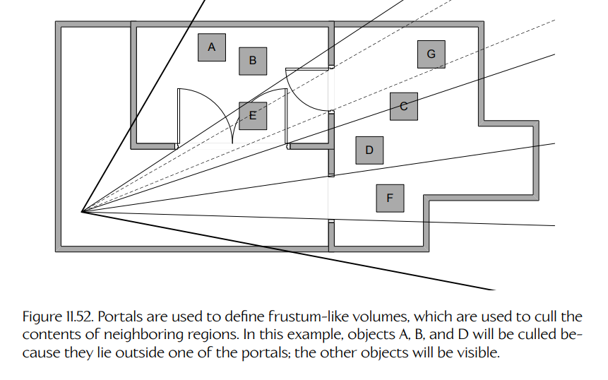
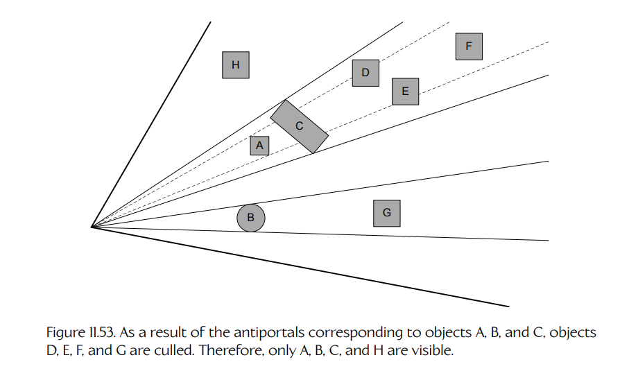
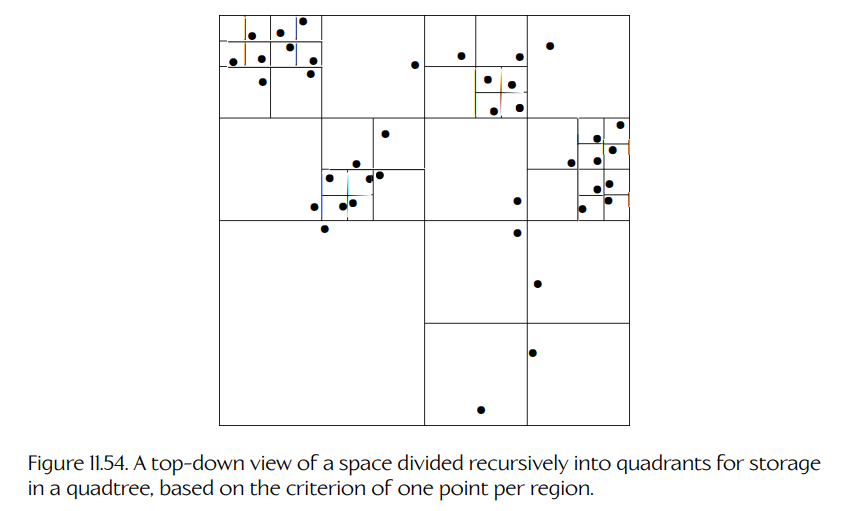
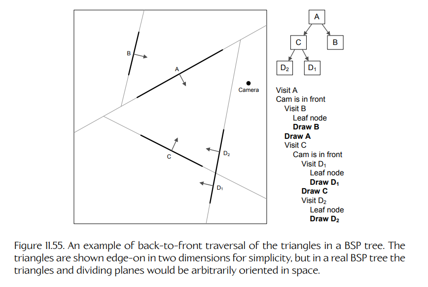

## 11.5 管线管理：应用层

现在我们已经理解了 GPU 的工作方式，就可以讨论负责驱动 GPU 的管线阶段——**应用层**（application layer）。图形栈的这一层有三个角色：

1. **剔除与可见性判定**（culling and visibility determination）。只有可见的对象（或至少可能可见的对象）才应该被提交给 GPU，否则我们会浪费宝贵资源去处理那些永远不会被看到的三角形。

2. **向 GPU 提交几何体以供渲染**（submitting geometry to the GPU for rendering）。子网格-材质对（submesh-material pairs）会通过诸如 `DrawIndexedPrimitive()`（DirectX）或 `glDrawArrays()`（OpenGL）这样的渲染调用发送给 GPU，或者通过直接构造 GPU 命令列表来提交。为了获得最佳渲染性能，几何体可能会被排序。如果场景需要以多 pass 方式渲染，几何体也可能被提交多次。

3. **控制着色器参数和渲染状态**（controlling shader parameters and render state）。通过常量寄存器传递给着色器的 uniform 参数，会由应用程序以逐图元方式配置。此外，应用程序还必须设置非可编程管线阶段的所有可配置参数，以确保每个图元都能被正确渲染。

在接下来的小节中，我们将简要探讨应用层如何执行这些任务。

### 11.5.1 剔除与可见性判定

最便宜的三角形就是那些你根本不绘制的三角形。因此，在把对象提交给 GPU 之前，从场景中**剔除**（cull）那些不会对最终渲染图像产生贡献的对象非常重要。构造可见网格实例列表的过程称为**可见性判定**（visibility determination）。

#### 11.5.1.1 背面剔除

最简单的剔除形式是**背面剔除**（backface culling）。这意味着丢弃任何不朝向摄像机的三角形。三角形的**绕序**（winding order）是引擎用来判断三角形朝向的方式。当我们沿着选定的绕序遍历顶点时，面法线 $\mathbf{n}$ 会指向我们右手的方向；按照约定，面法线指向三角形的“正面”一侧。背面剔除通过计算三角形面法线与视线向量 $\mathbf{v}$ 之间的点积来工作。当 $\mathbf{n} \cdot \mathbf{v} \ge 0$ 时，该三角形被认为是背向的。

大多数图形 API 都提供了一种基于绕序剔除背向三角形的方法。例如，DirectX 11 默认将顺时针绕序视为三角形的正面；如果我们把 Direct3D 中的剔除模式参数（`D3D11_RASTERIZER_DESC` 结构体的成员）设置为 `D3D11_CULL_FRONT`，那么背向三角形就不会被绘制；如果设置为 `D3D11_CULL_BACK`，那么正向三角形就不会被绘制。

我们也可以提交单面或双面三角形进行渲染。双面三角形只是不会进行背面剔除的三角形——无论哪一侧朝向摄像机，它都会被绘制。在 DirectX 中，这可以通过把剔除模式设置为 `D3D11_CULL_NONE` 来实现。

#### 11.5.1.2 视锥体剔除

在**视锥体剔除**（frustum culling）中，所有完全位于视锥体之外的对象都会从渲染列表中排除。给定一个候选网格实例，我们可以通过在对象的**包围体**（bounding volume）与六个视锥体平面之间执行一些简单测试，来判断它是否位于视锥体内。包围体通常是球体，因为球体特别容易剔除（不过也可以使用其他体积，例如轴对齐包围盒）。要剔除一个球体，我们可以把每个视锥体平面向外移动一个等于球体半径的距离，然后判断球心位于每个修改后平面的哪一侧。如果球体被发现位于所有六个修改后平面的正面一侧，那么该球体就在视锥体内部。

在实践中，我们并不需要真的移动视锥体平面。回忆 Equation (5.13)，从点到平面的垂直距离 $h$ 可以通过把该点代入平面方程来计算：

$$
h = ax + by + cz + d = \mathbf{n} \cdot \mathbf{P} - \mathbf{n} \cdot \mathbf{P}_0
$$

（见 Section 5.6.3）。因此，我们只需要把包围球的中心点代入每个视锥体平面的平面方程，得到每个平面 $i$ 对应的 $h_i$ 值，然后把这些 $h_i$ 值与包围球半径进行比较，就可以判断它是否位于每个平面内侧。

Section 11.5.3 中描述的场景图数据结构可以帮助优化视锥体剔除，使我们能够忽略那些包围球根本不可能接近视锥体内部的对象。

#### 11.5.1.3 遮挡与潜在可见集

即使对象完全位于视锥体内部，它们也可能彼此遮挡。把那些完全被其他对象遮挡的对象从可见列表中移除，称为**遮挡剔除**（occlusion culling）。在拥挤环境中，从地面视角观察时，对象之间可能存在大量相互遮挡，因此遮挡剔除极其重要。在较为空旷的场景中，或从上方观察场景时，遮挡可能少得多，遮挡剔除的成本可能超过其收益。

大规模环境的粗粒度遮挡剔除可以通过预计算一个**潜在可见集**（potentially visible set, PVS）来完成。对于任意给定的摄像机观察点，PVS 会列出那些可能可见的场景对象。PVS 倾向于包含那些实际上不可见的对象，而不是排除那些实际会对渲染场景产生贡献的对象。

实现 PVS 系统的一种方式，是把关卡切分成某种区域。每个区域都可以提供一份当摄像机位于该区域内时可见的其他区域列表。这些 PVS 可以由美术或游戏设计师手动指定。更常见的做法是，由一个自动化离线工具根据用户指定的区域生成 PVS。这类工具通常会从某一区域内多个随机分布的观察点渲染场景。每个区域的几何体会被颜色编码，因此可见区域列表可以通过扫描生成的帧缓冲，并统计其中出现的区域颜色来得到。由于自动化 PVS 工具并不完美，它们通常会向用户提供一种调整结果的机制，例如手动放置用于测试的观察点，或者手动指定某个区域的 PVS 中应显式包含或排除的区域列表。

#### 11.5.1.4 门户

确定场景中哪些部分可见的另一种方式是使用**门户**（portals）。在门户渲染中，游戏世界被划分为半封闭区域，这些区域通过孔洞彼此连接，例如窗户和门口。这些孔洞称为 portals。它们通常由描述其边界的多边形表示。

**Figure 11.52.** Portals 用于定义类似视锥体的体积，这些体积可用于剔除相邻区域中的内容。在这个例子中，对象 A、B 和 D 会被剔除，因为它们位于某个 portal 之外；其他对象将可见。

要使用 portals 渲染场景，我们首先渲染包含摄像机的区域。然后，对于该区域中的每个 portal，我们扩展出一个类似视锥体的体积：它由从摄像机焦点出发、穿过 portal 边界多边形每条边的平面组成。相邻区域中的内容可以用这个 portal 体积进行剔除，方式与几何体相对于摄像机视锥体进行剔除完全相同。这样可以确保只渲染相邻区域中的可见几何体。Figure 11.52 展示了这一技术。

#### 11.5.1.5 遮挡体（反门户）

如果我们把 portal 概念反过来使用，那么也可以用金字塔状体积来描述场景中由于被某个对象遮挡而**不可见**的区域。这些体积称为**遮挡体**（occlusion volumes）或 **antiportals**。要构造一个遮挡体，我们找到每个遮挡对象的轮廓边，然后从摄像机焦点出发，沿这些边向外扩展平面。我们将更远处的对象与这些遮挡体进行测试；如果它们完全位于遮挡区域内，就将其剔除。Figure 11.53 展示了这一过程。

Portals 最适合用于渲染封闭的室内环境，其中“房间”之间只有相对较少的窗户和门。在这类场景中，portals 只占摄像机视锥体总体积的相对较小百分比，因此大量位于 portals 之外的对象可以被剔除。Antiportals 最适合应用于大型室外环境，其中附近对象经常会遮挡摄像机视锥体中的大块区域。在这种情况下，antiportals 会占据摄像机视锥体总体积的相对较大百分比，从而产生大量被剔除对象。

**Figure 11.53.** 由于对象 A、B 和 C 对应的 antiportals，对象 D、E、F 和 G 被剔除。因此，只有 A、B、C 和 H 可见。

### 11.5.2 几何体排序

在 OpenGL 和 DirectX 11 及更早版本中，渲染状态设置是全局的——它们会应用于整个 GPU。如果不谨慎管理，渲染状态设置的改变可能导致巨大的性能下降。因此，我们希望尽可能少地改变渲染设置。一种实现方式是按材质对几何体进行排序。这样，我们可以先安装材质 A 的设置，渲染所有与材质 A 相关的几何体，然后再转到材质 B，依此类推。

不幸的是，按材质对几何体排序可能会对渲染性能产生负面影响，因为它会增加 **overdraw**——也就是同一个像素被多个重叠三角形填充多次的情况。当然，有些 overdraw 是必要且有用的，因为它是把透明和半透明表面正确 alpha 混合进场景的唯一方法。然而，不透明像素的 overdraw 永远是在浪费 GPU 带宽。

Early z-test 的设计目的，是在昂贵的像素着色器有机会执行之前丢弃被遮挡的片元。但为了最大限度利用 early Z，我们需要按照从前到后的顺序绘制三角形。这样，最近的三角形会一开始就填充 z-buffer，所有来自其后方更远三角形的片元都可以被迅速丢弃，几乎不会产生 overdraw。

#### 11.5.2.1 用 z 预处理遍救场

我们如何协调“需要按材质对几何体排序”和“需要按从前到后顺序渲染不透明几何体”这两个冲突需求？答案在于一种称为 **z pre-pass** 的 GPU 特性。

z pre-pass 背后的思想是把场景渲染两次：第一次尽可能高效地生成 z-buffer 内容；第二次用完整颜色信息填充帧缓冲（不过由于 z-buffer 的内容，这次不会产生 overdraw）。GPU 提供了一种特殊的双倍速度渲染模式，在这种模式中像素着色器被禁用，并且只更新 z-buffer。在这个阶段，不透明几何体可以按从前到后的顺序渲染，以最小化生成 z-buffer 内容所需的时间。然后，几何体可以重新按材质顺序排序，并以完整颜色渲染，从而用最少的状态变更获得最大的管线吞吐量。

另一种处理 overdraw 的方法，是使用一种特殊的“扩展深度缓冲”，称为**可见性缓冲**（visibility buffer）。我们将在 Sections 11.6.8 和 12.5.12.2 中更深入地讨论 visibility buffer。

### 11.5.3 场景图

如今的游戏世界可能非常大。大多数场景中的几何体并不位于摄像机视锥体内，因此显式地对所有这些对象执行视锥体剔除通常极其浪费。相反，我们希望设计一种数据结构来管理场景中的所有几何体，使我们能够在执行详细视锥体剔除之前，迅速丢弃远离摄像机视锥体的大块世界区域。理想情况下，这种数据结构还应帮助我们对场景中的几何体排序，例如为了 z pre-pass 按从前到后顺序排序，或为了全色渲染按材质顺序排序。

这种数据结构通常称为**场景图**（scene graph），这个名称源自电影渲染引擎和 Maya 等 DCC 工具中常用的图状数据结构。然而，游戏中的 scene graph 并不一定真的是一个图；事实上，所选择的数据结构通常是某种树（当然，树是图的一种特例）。大多数这类数据结构背后的基本思想，是以一种方式划分三维空间，使我们能够轻松丢弃不与视锥体相交的区域，而无需对其中所有单个对象执行视锥体剔除。例子包括四叉树和八叉树、BSP 树、kd-tree 以及空间哈希技术。

#### 11.5.3.1 四叉树与八叉树

**四叉树**（quadtree）会递归地把空间划分为象限。每一级递归都由四叉树中的一个节点表示，该节点有四个子节点，每个子节点对应一个象限。这些象限通常由竖直方向的轴对齐平面分隔，因此象限是正方形或矩形。不过，有些四叉树也会使用任意形状区域来细分空间。

**Figure 11.54.** 一个空间的俯视图，该空间基于“每个区域一个点”的准则被递归划分为象限，以便存储在四叉树中。

四叉树可以用于存储和组织几乎任何空间分布数据。在渲染引擎语境中，为了高效进行视锥体剔除，四叉树常用于存储可渲染图元，例如网格实例、地形几何体的子区域，或大型静态网格中的单个三角形。可渲染图元存储在树的叶节点中，我们通常希望每个叶区域中的图元数量大致均匀。这可以通过根据某一区域内图元数量决定继续细分还是终止细分来实现。

为了判断哪些图元在摄像机视锥体内可见，我们从根节点遍历到叶节点，检查每个区域是否与视锥体相交。如果某个给定象限不与视锥体相交，那么我们就知道它的任何子区域也不会相交，因此可以停止遍历该树分支。这使我们能够比线性搜索更快地查找潜在可见图元（通常是 $O(\log n)$ 时间）。Figure 11.54 展示了一个空间四叉树划分示例。

**八叉树**（octree）是四叉树的三维等价物，它会在每一级递归中把空间划分为八个子区域。八叉树的区域通常是立方体或长方体，但一般而言也可以是任意形状的三维区域。

#### 11.5.3.2 BSP 树

**二叉空间划分树**（binary space partitioning tree, BSP tree）会递归地把空间一分为二，直到每个半空间内的对象满足某些预定义标准（很像四叉树把空间划分为象限）。BSP 树有许多用途，包括碰撞检测和构造实体几何；它最著名的应用则是作为一种提升 3D 图形中视锥体剔除和几何体排序性能的方法。**kd-tree** 是 BSP tree 概念在 $k$ 维空间中的推广。

在渲染语境中，BSP tree 在每一级递归中用一个平面划分空间。划分平面可以是轴对齐的，但更常见的是，每次划分都对应场景中某个单独三角形所在的平面。所有其他三角形随后都会被分类为位于该平面的正面一侧或背面一侧。任何与划分平面相交的三角形本身都会被拆分成新的三角形，使每个三角形要么完全位于平面前方，要么完全位于平面后方，要么与该平面共面。结果是一棵二叉树，其中每个内部节点都有一个划分平面以及一个或多个三角形，叶节点中也包含三角形。

BSP tree 可用于视锥体剔除，其方式与四叉树、八叉树或包围球树非常相似。不过，如果按照上面描述的方式由单个三角形生成 BSP tree，它也可以用于把三角形排序为严格的从后到前或从前到后顺序。这对于早期 3D 游戏（如 *Doom*）尤其重要，因为它们没有 z-buffer，因此不得不使用画家算法（即从后往前渲染场景）来确保正确的三角形间遮挡关系。

给定 3D 空间中的摄像机视点，一个从后到前排序算法会从根节点开始遍历树。在每个节点，我们检查视点位于该节点划分平面的前方还是后方。如果摄像机位于某节点平面的前方，就先访问该节点的后侧子节点，然后绘制与其划分平面共面的所有三角形，最后访问其前侧子节点。类似地，当摄像机视点位于某节点划分平面后方时，我们先访问该节点的前侧子节点，然后绘制与该节点平面共面的三角形，最后访问其后侧子节点。这种遍历方案确保最远离摄像机的三角形会先于较近的三角形被访问，因此会得到从后到前的排序。由于该算法会遍历场景中的所有三角形，因此遍历顺序与摄像机朝向无关。为了只遍历可见三角形，还需要一个额外的视锥体剔除步骤。Figure 11.55 展示了一个简单的 BSP tree，以及给定摄像机位置下将执行的树遍历。

**Figure 11.55.** BSP tree 中三角形从后到前遍历的示例。为简单起见，图中以二维方式从边缘方向显示三角形；但在真实 BSP tree 中，三角形和划分平面会在空间中具有任意朝向。

BSP tree 生成和使用算法的完整介绍超出了本书范围。关于 BSP tree 的更多细节，见 [262]。

#### 11.5.3.3 包围体层次结构

就像四叉树或八叉树把空间划分为（通常是）矩形区域一样，**包围体层次结构**（bounding volume hierarchy, BVH）会以层次方式把空间划分为子区域。包围体层次结构将在 Section 12.6.5.2 的光线追踪语境中详细讨论，但 BVH 也可以作为基于光栅化渲染引擎的场景图。
