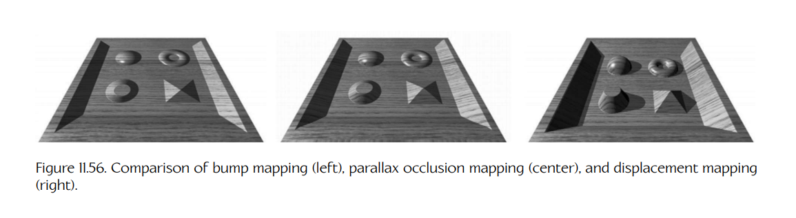
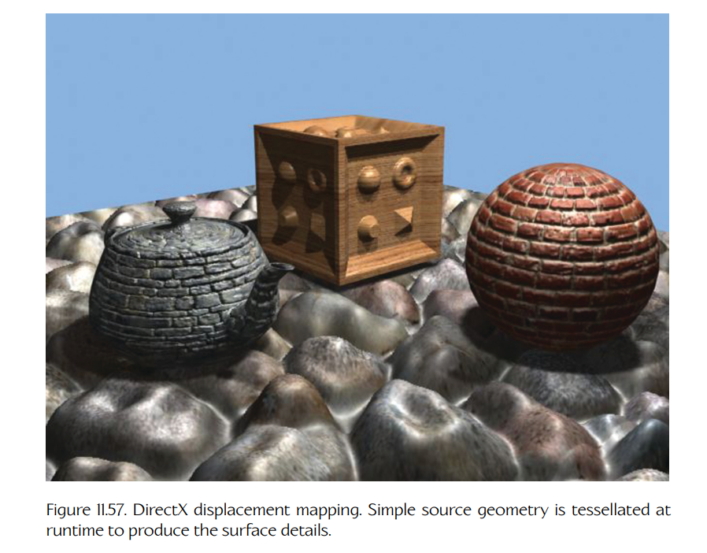
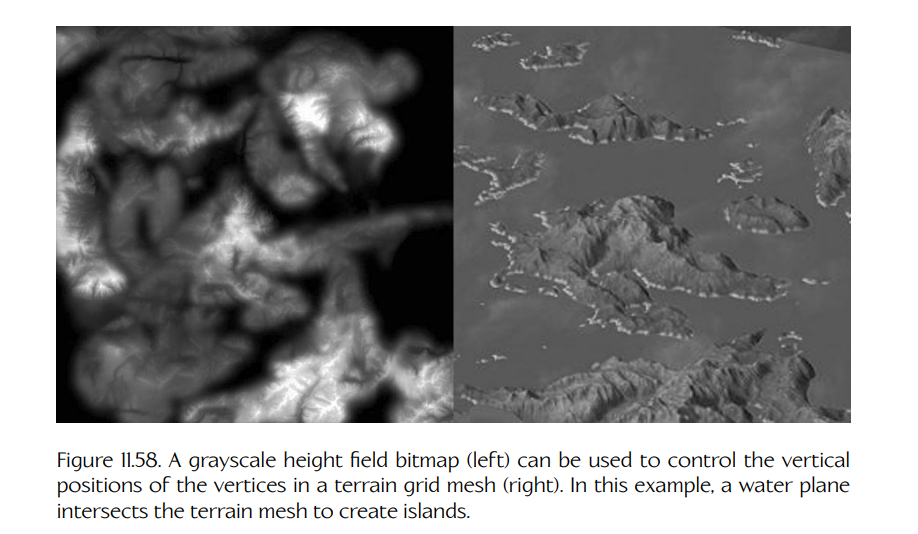
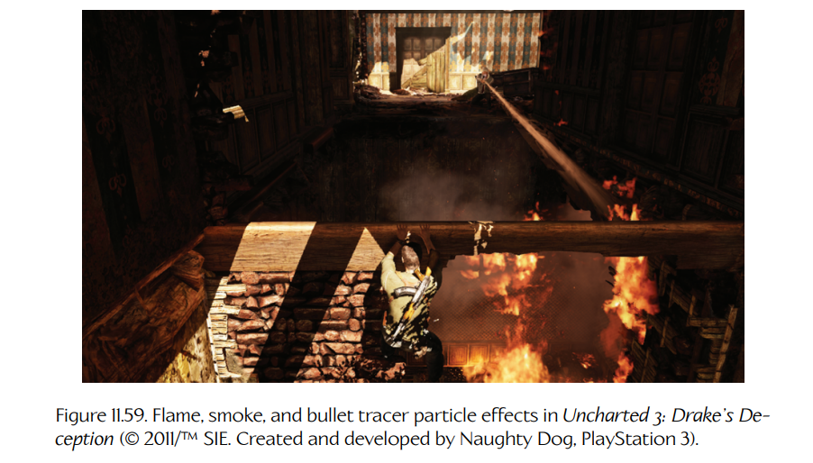
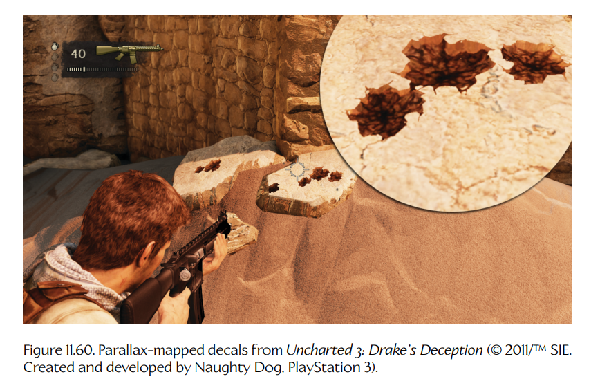
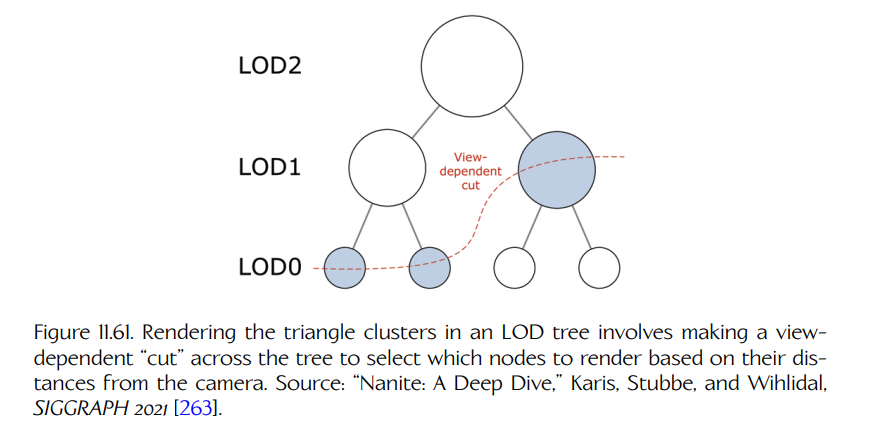
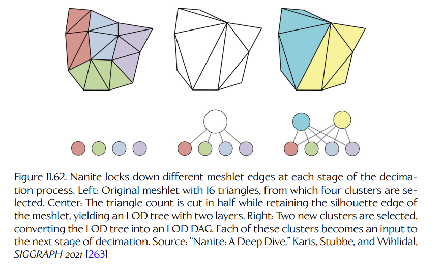

## 11.6 几何处理与其他视觉效果

通过在运行时动态操纵场景中的几何体，可以实现许多有趣的视觉效果。几何处理可以在顶点着色器、外壳着色器与域着色器，以及/或者几何着色器中执行。像素着色器也可以实现一些效果，让观察者看起来像是几何体被操纵过，但实际上并没有。在本节中，我们将探讨若干常见的几何处理类型，以及可以通过它们实现的视觉效果。

### 11.6.1 蒙皮

动画角色是 3D 游戏中的常见元素。这些角色可能看起来像机器人，但很多时候它们旨在表现为生物或类人生物，具有柔软且富有弹性的皮肤，会随着角色肌肉带动骨骼运动而拉伸和变形。在电子游戏中，这种效果是通过把骨骼的运动建模为一组刚性骨骼，然后将三角形网格**绑定**（binding）到骨骼上来实现的。绑定会为每个顶点指定骨骼中的哪些关节会影响它，以及影响比例是多少。顶点着色器会把骨骼关节的位置与逐顶点蒙皮信息结合起来，从而使顶点发生变形，看起来像是跟随骨骼运动。这种技术称为**蒙皮**（skinning）。我们将在 Chapter 13 中详细讨论蒙皮。

### 11.6.2 高度图：凹凸、视差与位移映射

顾名思义，**高度图**（heightmap）会编码三角形表面之上或之下理想表面的高度。高度图通常编码为灰度图像，因为每个纹素只需要一个高度值。高度图可用于**凹凸映射**（bump mapping）、**视差遮挡映射**（parallax occlusion mapping）和**位移映射**（displacement mapping）——这三种技术都可以让平面表面看起来具有高度变化。

在 bump mapping 中，高度图被用作一种廉价方式来生成表面法线。这项技术主要用于 3D 图形早期；如今，大多数游戏引擎会把表面法线信息显式存储在 **normal map** 中，而不是从高度图中计算法线。

Parallax occlusion mapping 使用 heightmap 中的信息，在渲染平坦表面时人为调整所使用的纹理坐标，使该表面看起来包含会随着摄像机移动而半正确变化的表面细节。（这项技术曾被 Naughty Dog 用于制作 *Uncharted* 系列游戏中的弹痕贴花。）

Displacement mapping（也称为 relief mapping）则会通过真正细分表面多边形并将其挤出，产生真实的表面细节；它同样使用 heightmap 来决定每个顶点应位移多少。这会产生最有说服力的效果——它能够正确地自遮挡和自阴影——因为真实几何体被生成出来了。Figure 11.56 比较了 bump mapping、parallax mapping 和 displacement mapping。

**Figure 11.56.** Bump mapping（左）、parallax occlusion mapping（中）和 displacement mapping（右）的比较。

**Figure 11.57.** DirectX 位移映射。简单源几何体会在运行时被细分，以生成表面细节。

Figure 11.57 展示了一个在 DirectX 中实现 displacement mapping 的示例。

### 11.6.3 地形

**地形系统**（terrain system）的目标是建模地球表面，并提供一种画布，让其他静态和动态元素可以布置在其上。地形有时会在 Maya 之类的软件包中显式建模。但如果玩家能够看到很远的距离，我们通常希望有某种动态细分或其他细节层次（LOD）系统。我们可能还需要限制表示超大型室外区域所需的数据量。

**高度场地形**（height field terrain）是建模大型地形区域的一种流行选择。由于高度场通常存储在灰度纹理图中，数据大小可以保持相对较小。在大多数基于高度场的地形系统中，水平面（$y = 0$）会被细分为规则网格模式，而地形顶点的高度通过采样高度场纹理来确定。单位面积内的三角形数量可以根据与摄像机的距离而变化，从而允许远处显示大尺度特征，同时又允许附近地形表现出大量细节。Figure 11.58 展示了一个通过高度场位图定义的地形示例。

**Figure 11.58.** 灰度高度场位图（左）可用于控制地形网格中顶点的垂直位置（右）。在这个例子中，一个水面与地形网格相交，从而形成岛屿。

地形系统通常提供专门工具，用于“绘制”高度场本身，雕刻出道路、河流等地形特征。地形系统中的纹理映射通常是多种纹理之间的混合。这允许美术人员通过暴露某个纹理层来“绘制”草地、泥土、砾石和其他地形特征。这些层可以相互交叉混合，以提供平滑的纹理过渡。一些地形工具还允许切除地形中的部分区域，以便以常规网格几何体的形式插入建筑、壕沟和其他特殊地形特征。地形创作工具有时会直接集成到游戏世界编辑器中，而在其他引擎中，它们也可能是独立工具。

当然，高度场地形只是游戏中建模地球表面的众多选项之一。关于地形渲染的更多信息，见 [9, Sections 4.16 through 4.19] 和 [10, Section 4.2]。

### 11.6.4 基于卡片的效果

到目前为止，我们讨论的图形管线主要负责渲染三维实体对象。许多专门的渲染系统通常会叠加在这条管线之上，负责渲染诸如粒子效果、贴花（表示弹孔、裂缝、划痕和其他表面细节的小型几何叠层）、头发和毛发、雨或雪、水以及其他特殊视觉效果等视觉元素。还可以应用全屏后处理效果，包括暗角（降低屏幕边缘的亮度和饱和度）、运动模糊、景深模糊、人工/增强色彩处理等。最后，游戏菜单系统和抬头显示器（HUD）通常通过在屏幕空间中渲染文字以及其他二维或三维图形，并将其叠加到三维场景之上来实现。

深入介绍这些引擎系统超出了本书范围。在接下来的小节中，我们将简要概览这些渲染系统，并指出更多信息的方向。

### 11.6.5 粒子效果

**粒子渲染系统**（particle rendering system）关注的是渲染烟雾、火花、火焰等无定形对象。这些称为**粒子效果**（particle effects）。粒子效果区别于其他可渲染几何体的关键特征如下：

- 它由**数量非常大的相对简单几何片段**组成——最常见的是称为 **quads** 的简单卡片，每个 quad 由两个三角形组成。
- 几何体通常是**面向摄像机的**（camera-facing，即 billboarded），这意味着引擎必须采取措施，确保每个 quad 的面法线始终直接指向摄像机焦点。
- 它的材质几乎总是**半透明**（semitransparent）或**透射**（translucent）的。因此，粒子效果具有一些严格的**渲染顺序**约束，而这些约束并不适用于场景中大多数不透明对象。
- 粒子会以丰富多样的方式进行动画。它们的位置、方向、大小（缩放）、纹理坐标以及许多着色器参数都会逐帧变化。这些变化可以由手工制作的动画曲线定义，也可以通过过程化方法定义。
- 粒子通常会不断地被**生成和销毁**（spawned and killed）。粒子发射器是世界中的一个逻辑实体，它会以某个用户指定的速率创建粒子；粒子会在碰到预定义死亡平面时、达到用户定义寿命时，或根据其他用户指定标准而被销毁。

粒子效果也可以使用常规三角形网格几何体和适当的着色器进行渲染。然而，由于上面列出的独特特征，在真实生产级游戏引擎中，总是会使用专门的粒子效果动画与渲染系统来实现它们。Figure 11.59 展示了几个粒子效果示例。

**Figure 11.59.** *Uncharted 3: Drake’s Deception* 中的火焰、烟雾和曳光弹粒子效果（© 2011/TM SIE。由 Naughty Dog 创建并开发，PlayStation 3）。

粒子系统的设计与实现是一个非常丰富的话题，足以单独写成一本书。关于粒子系统的更多信息，见 [2, Section 10.7]、[17, Section 20.5]、[12, Section 13.7] 和 [13, Section 4.1.2]。

### 11.6.6 贴花

**贴花**（decal）是一小块相对较小的几何体，它叠加在场景中的常规几何体之上，使表面的视觉外观能够动态修改。例子包括弹孔、脚印、划痕、裂缝等。

现代引擎最常使用的方法，是把 decal 建模为一个沿射线投射到场景中的矩形区域。这会在 3D 空间中产生一个矩形棱柱。该棱柱首先相交的任何表面都会成为 decal 的表面。被相交几何体的三角形会被提取出来，并被 decal 投影棱柱的四个边界平面裁剪。生成的三角形会通过为每个顶点生成适当的纹理坐标，映射上期望的 decal 纹理。然后，这些带纹理映射的三角形会被渲染到常规场景之上，通常还会使用 parallax mapping 给予它们深度错觉，并添加轻微的 z-bias（通常通过稍微移动近平面来实现），使它们不会与其覆盖的几何体发生 z-fighting。其结果就是弹孔、划痕或其他表面修改的外观。Figure 11.60 展示了一些弹孔 decal。

**Figure 11.60.** *Uncharted 3: Drake’s Deception* 中的 parallax-mapped decals（© 2011/TM SIE。由 Naughty Dog 创建并开发，PlayStation 3）。

关于创建和渲染 decals 的更多信息，见 [10, Section 4.8] 和 [36, Section 9.2]。

### 11.6.7 水面

如今，水体渲染器在游戏中非常常见。水有许多不同类型，包括海洋、水池、河流、瀑布、喷泉、水柱、水坑和潮湿的实体表面。每种水通常都需要一些专门的渲染技术。有些还需要动态运动模拟。大型水体可能需要动态细分或其他类似于地形系统所采用的 LOD 方法。

水系统有时会与游戏的刚体动力学系统交互（浮力、水柱施加的力等），也会与玩法交互（湿滑表面、游泳机制、潜水机制、乘坐垂直水柱等）。水效果通常由不同的渲染技术和子系统组合而成。例如，瀑布可能会使用专门的水着色器、滚动纹理、底部水雾粒子效果、类似 decal 的泡沫叠层，等等。如今的游戏提供了一些相当惊人的水效果，而对实时流体动力学等技术的活跃研究，也有望在未来几年中让水模拟变得更加丰富和真实。关于水体渲染和模拟技术的更多信息，见 [2, Sections 9.3, 9.5, and 9.6]、[16] 和 [9, Sections 2.6 and 5.11]。

### 11.6.8 虚拟化几何体与 Nanite

在理想世界中，我们会允许美术人员创建由数百万个三角形构成的高细节几何体；我们会拥有无限 VRAM 来加载所有这些细节几何体；并且我们会以足够高的效率渲染这些高细节场景，从而以交互式帧率生成照片级真实图像。但现实当然是，每个渲染引擎都必须在几何细节、渲染效率和内存消耗之间做出权衡。

#### 11.6.8.1 使用 LOD 管理预算

正如我们在 Section 11.3.6.8 中学到的，管理几何细节、内存消耗和渲染效率的一种流行方法，是为场景中的 3D 模型创建细节层次（LODs）。这项技术利用了这样一个事实：透视缩短会让远处对象在屏幕上占据更少空间，因此比靠近摄像机的对象需要更少几何细节。

给定一个高分辨率源资产（我们称之为 LOD0），我们可以生成一串低分辨率 LOD。这通常由资产构建管线中的**减面工具**（decimation tool）自动完成。为了生成链中的 LOD$(n + 1)$，我们取 LOD$n$ 网格，并以谨慎方式折叠三角形边，生成一个多边形数量更少的网格；如果做得好，它会尽可能保留前一层的形状和轮廓。我们会持续这个过程，直到生成期望数量的 LOD。结果通常是一串 3 到 10 个 LOD，每个 LOD 都带有一个相关距离范围，表示它应该在什么距离下被选择用于渲染。利用我们在 Chapter 7 中讨论的数据流送原则，我们只需要把实际可见的 3D 模型加载到 VRAM 中。如果我们更有野心，甚至可以根据需要将单个 LOD 流入或流出 VRAM，以进一步解决内存预算问题。

尽管这种“传统”LOD 方法有很多优点，但它也有一些显著缺点。美术团队需要非常清楚多边形数量、内存，以及渲染场景所需 draw calls 数量方面的预算（后者又与构成场景的唯一材质和着色器数量有关）。LOD 距离范围可能需要手动指定或调整。如果提供的 LOD 太少，用户很可能会看到模型在从一个 LOD 切换到下一个 LOD 时发生“跳变”；但如果提供太多 LOD，内存预算又可能迅速超支。

#### 11.6.8.2 从虚拟纹理到虚拟化几何体

在 Section 11.3.14.8 中，我们了解了**虚拟纹理**（virtual textures）。虚拟纹理背后的思想是，把大型高细节 mipmapped 纹理拆分成更小的 tiles，然后在任意给定帧中，只把实际渲染所需的 tiles 和 mip levels 加载到 VRAM 中。

一种称为**虚拟化几何体**（virtualized geometry）的技术将这些相同原则应用到 3D 几何体上。虚拟化几何体背后的思想已经使用了相当长时间，但直到 Unreal Engine 5 的渲染系统 **Nanite** 由 Brian Karis、Rune Stubbe、Graham Wihlidal 以及其他渲染工程师开发出来，才出现了能够利用 GPU 的高效实时实现。自 Nanite 于 2020 年首次亮相以来，其他游戏团队也为自己的引擎开发了类似技术。在本节中，我们将专门关注 Nanite，但许多相同原则也被用于其他支持虚拟化几何体的引擎中。

#### 11.6.8.3 LOD 链与 LOD 树

简单的 **LOD chain** 只是一个网格列表，其中每个网格的多边形数量都低于链中前一个网格。这种方法适用于小型 3D 模型，但对于地形、建筑、大型宇宙飞船等大型几何体则会失效。问题在于，一个非常大的网格的某些部分可能靠近摄像机，而该网格的其他部分则非常远。理想情况下，我们希望把这样一个大型几何模型拆分成一棵子网格树，使我们能够为各个子网格独立选择合适的 LOD。

在 **LOD tree** 中，原始高分辨率源资产会被拆分成小型三角形簇。可以选择这些簇，使任何单个簇都不超过例如 128 个三角形。这些簇将形成 LOD tree 的叶节点。然后，我们可以选择一小组相邻簇，并将它们组合成一个低分辨率网格，同样使用结果网格不应超过 128 个三角形的启发式规则。我们可以把这个新网格插入树中，作为被选簇的父节点。这个过程会不断重复，向 LOD tree 中添加越来越多层，直到根节点成为一个低分辨率网格，它包含不超过 128 个三角形，并作为整个原始模型的近似。

为了渲染 LOD tree，我们会基于节点到摄像机的距离，在树上做一次“切割”（cut），选择将要渲染的节点。Figure 11.61 展示了这一点。目标是选择尽可能低分辨率的树节点，使得对于任意一个被渲染节点，如果我们选择它的子节点，用户也无法察觉差异。换句话说，我们希望选择这样的树节点：其中的三角形每个大约只有**一个像素大小**。这个规则会产生与渲染所有叶节点（也就是渲染原始电影级资产）在视觉上几乎不可区分的结果：一旦三角形达到像素大小，使用更小的三角形也不会进一步提升渲染图像质量。

**Figure 11.61.** 渲染 LOD tree 中的三角形簇时，需要根据它们到摄像机的距离，在树上做一次与视角相关的“切割”，以选择哪些节点用于渲染。来源：“Nanite: A Deep Dive,” Karis, Stubbe, and Wihlidal, *SIGGRAPH 2021* [263]。

#### 11.6.8.4 LOD 树中的裂缝

简单 LOD tree 的问题在于，当我们通过折叠边来构建树的下一层时，网格簇之间可能会形成裂缝。解决这一问题的一种方式，是在减面过程中“锁定”每个簇外部的三角形边。例如，如果我们在 LOD$(n)$ 有四个簇，它们会退化成 LOD$(n + 1)$ 的一个单一簇，那么通过锁定外部边，我们可以保证父簇的轮廓与四个子簇的轮廓相同。

这种方法听起来很有希望，但实际上很快就会失效。如果我们“锁定”叶簇的外部边，那么这意味着父节点必须共享相同的外部边，祖父节点、曾祖父节点等也都必须如此。结果是，高分辨率细节倾向于沿着这些边“聚集”，从而降低减面过程的效率，甚至达到无法实际使用的程度。

#### 11.6.8.5 Nanite 的解决方案：LOD 图

使 Nanite 的虚拟化几何体高效且实用的关键洞见，是在构建 LOD tree 的每个新层时“锁定”一组**不同**的边。从最高分辨率源网格开始，我们把它拆分成每个最多由 128 个三角形构成的簇，然后选择一组 $N$ 个相邻簇。我们“锁定”该组的外部边，并应用边折叠减面，创建一个新的网格：它的三角形数量减半，但轮廓与原来的 $N$ 个簇相同。通常，这会得到一棵具有一个父节点和 $N$ 个子节点的 LOD tree。但我们再进一步，把父节点拆分成 $N/2$ 个新簇。这样做会使 LOD tree 变成一个 **LOD graph**，因为这 $N$ 个子簇最终会拥有不止一个父簇。Figure 11.62 展示了这一过程。从技术上讲，我们通过这个算法生成的图称为**有向无环图**（directed acyclic graph, DAG），因为节点之间的连接具有方向（父节点和子节点之间有区别），并且连接中没有“循环”。

**Figure 11.62.** Nanite 在减面过程的每个阶段锁定不同的 meshlet 边。左：原始 meshlet 具有 16 个三角形，从中选择了四个簇。中：三角形数量减半，同时保留 meshlet 的轮廓边，得到一个两层 LOD tree。右：选择两个新簇，把 LOD tree 转换成 LOD DAG。每个这样的簇都会成为下一阶段减面的输入。来源：“Nanite: A Deep Dive,” Karis, Stubbe, and Wihlidal, *SIGGRAPH 2021* [263]。

在运行时，我们可以像渲染 LOD tree 那样，通过在图中做一次“cut”来渲染 LOD DAG。Nanite 使用一种巧妙的算法，确保网格簇组在做 LOD 决策时独立于网格中的其他组，从而允许该算法在 GPU 上并行运行。

#### 11.6.8.6 Nanite 渲染的其他方面

Unreal 的 Nanite 渲染引擎除了虚拟化几何体和 LOD DAG 之外，还有很多移动部件。详细讨论超出了本书范围，但我们将在下面列举其中一些关键方面。若要了解更多内容，我强烈建议阅读题为 “Nanite: A Deep Dive” 的白皮书，见 [263]。

- Nanite 使用**层次化 z-buffer**（hierarchical z buffer，也称为 HiZ 或 HZB）来判断 DAG 中哪些三角形簇可见。层次化 z-buffer 本质上是一个 mipmapped depth buffer。与常规 mipmapping 一样，每个 mip level 都是前一级大小的一半，这意味着给定 mip level 的每个像素表示前一级中的四个像素组成的 quad。在每个 mip level 中，像素会存储其下方前一 mip level 中四个像素的**最大**深度。为了使用 HiZ buffer 进行遮挡剔除，我们会计算每个三角形簇的屏幕空间边界，然后把其包围体（球体或 AABB）的最小深度，与最低的 HiZ mip level 进行测试；这个 mip level 中，该簇的屏幕空间边界会小于 $4 \times 4$ 像素块。这样，我们就可以对每个簇只进行一次深度缓冲纹理采样来完成剔除。

- 基于 HiZ buffer 的深度剔除算法存在一点“鸡生蛋、蛋生鸡”的问题：为了判断哪些簇需要绘制，我们需要对 HiZ depth buffer 进行测试；但为了生成 HiZ depth buffer，我们又需要绘制这些簇。为了解决这个问题，Nanite 使用两 pass 的遮挡剔除算法。在第一个 pass 中，它会重新绘制上一帧可见的那些簇，以构建当前帧的 HiZ buffer。然后，它会用这个 HiZ buffer 测试其余簇，以判断当前帧中哪些上一帧不可见的内容应该被绘制。

- Nanite 使用**可见性缓冲**（visibility buffer）来有效地将**可见性问题**与**光照问题**解耦。HiZ 剔除技术会生成 visibility buffer，而 visibility buffer 本身包含每个像素的深度，以及该像素由哪个对象 ID 和哪个三角形 ID 光栅化而来。这有点像执行 depth pre-pass（Section 11.5.2.1），只不过 visibility buffer 既像 depth buffer，又像一个“廉价 G-buffer”，只存储足以在二次光照 pass 中查找相关材质信息的数据。

- 因为 Nanite 选择三角形簇进行渲染的方式，会使每个三角形大约只有一个像素大小，所以如果用 GPU 的硬件光栅器来光栅化这些三角形，就会变得低效。这是因为硬件光栅器针对渲染大三角形进行了优化。在 Section 11.3.10.1 中，我们说过大多数 GPU 会以称为 quads 的 $2 \times 2$ 像素批次来光栅化三角形。这样做是为了让 GPU 能够高效计算相邻像素深度之间的 **first differences**，用作三角形**梯度**（相对于摄像机的斜率）的近似。这些梯度在**纹理过滤**中起着关键作用。然而，当三角形本身大约只有一个像素大小时，我们最终会为每个单像素三角形渲染一个 $2 \times 2$ 像素 quad，这非常低效。因此，像 Nanite 这样的渲染引擎会使用在 GPU 上以 compute job 运行的**软件光栅化**（software rasterization）来光栅化微小三角形。关于使用 compute shaders 实现软件三角形光栅化的深入讨论，见 [264]。