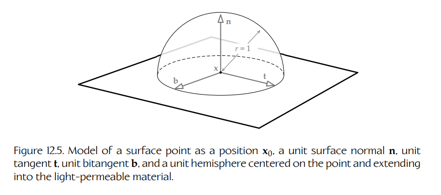
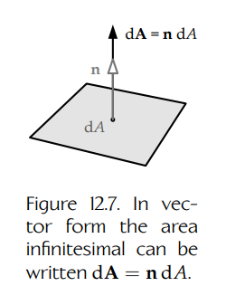

## 12.2 辐射度量学与光传输理论

光的行为可以由多种数学模型来描述，这些模型的复杂度和物理准确性逐步提高。最简单的理论称为**几何光学**（geometric optics）或**射线光学**（ray optics）。它将光建模为运动粒子的流，或者建模为理想化的射线。几何模型可以扩展，用于解释那些由光的波动性质引起的行为，如衍射和干涉；这称为**波动光学**（wave optics）。进一步扩展后，我们可以通过考虑光的电磁方面来涵盖光的更多属性，如偏振；这称为**电磁光学**（electromagnetic optics）。关于光物理行为最完整的理论还会解释荧光和磷光等效应，这称为**量子光学**（quantum optics）。这些相互重叠的光行为理论可以用 Figure 12.2 所示的维恩图来表示。在 3D 计算机图形学领域，我们主要关注最简单的理论：几何光学。

几何光学是一个很宽泛的主题。它包含了对光如何在空间中传播，以及光如何与物质相互作用的描述——这称为**光传输**（light transport）物理。它还可以建模眼睛或摄像机的透镜如何聚焦光线（这称为**透镜光学**，lens optics），以及眼睛或摄像机内部的传感器如何测量入射光（这称为**辐射度量学**，radiometry）。当我们调整辐射度量学的数学形式，以考虑人类如何**感知**光时，它就称为**光度学**（photometry）。为了计算渲染 3D 场景中的光照，我们会结合使用所有这些理论，以及在 Chapter 11 中学过的颜色理论。

![Figure 12.2. The various overlapping theories of light’s behavior can be visualized as a Venn diagram. Geometric optics is the simplest theory; it is the one used by most 3D rendering engines. Source: “Efficient Monte Carlo Methods for Light Transport in Scattering Media,” Wojciech Jarosz [266].](../../assets/images/volume-02/chapter-12/figure-12-2-overlapping-theories-of-light-behavior.png)

**Figure 12.2.** 光行为的各种相互重叠理论可以表示为一个维恩图。几何光学是最简单的理论，也是大多数 3D 渲染引擎使用的理论。来源：“Efficient Monte Carlo Methods for Light Transport in Scattering Media,” Wojciech Jarosz [266]。

### 12.2.1 光传输模型概览

由于光会在非参与介质中沿直线路径传播，因此我们可以构建一个实用的光传输模型：将一个光子的整体路径拆分为一系列直线“路段”（legs），每个路段都表示为连接两个不同表面点的线段。随后，光照计算只需要在这些表面点处进行。（如果要解释光信号在穿过参与介质的路段时，其能量内容和光谱分布如何发生变化，则需要更高级的计算。参与介质的讨论超出了本书范围，不过 [3] 对该主题进行了很好的处理。）

在 [Section 11.2.3.1](../chapter-11/README.md#11231-radiant-power) 中，我们学过光子携带能量，而**辐射功率**（radiant power）是对单位时间内光能量的度量。在任意给定表面点处进行光照计算，本质上就是确定在给定从所有方向入射到该表面点的所有辐射功率时，有多少辐射功率会沿某个特定方向**出射**（exitant）。不过，正如我们将在后续小节中看到的，这些计算并不直接以功率为对象；相反，它们使用从功率派生出来的辐射度量量，例如**辐射通量密度**（radiant flux density，在入射光语境中也称为**辐照度**，irradiance），以及**辐射亮度**（radiance，即沿一条出射射线传输了多少光功率的度量）。渲染引擎会在每个表面交点处重复这些计算，直到确定虚拟成像表面上每个传感器会测得的辐射亮度。Figures 12.3 和 12.4 展示了这一光传输模型的概览。

**Figure 12.3.** 光传输理论建模了光功率如何沿一系列直线“路段”从光源传输到摄像机。在击中成像表面之前只从一个表面反弹一次的光子，称为沿直接光路径传播；发生多次反弹的光子，则称为沿间接路径传播。

**Figure 12.4.** 我们在光传播旅程中各个“路段”之间的反弹点处求解光照问题：在已知来自所有可能入射方向的入射光功率（称为 irradiance，辐照度）的情况下，计算沿给定方向 $\Psi$ 出射的光功率（称为 radiance，辐射亮度）。

#### 12.2.1.1 使用正则表达式标记光路径

我们可以使用一种简单的正则表达式语法来描述光沿某条特定路径，在光源与眼睛（或摄像机）之间发生的相互作用。为了构造这些表达式，我们会使用以下符号：

- $L$：光源。
- $D$：光在表面点处发生的一次漫反射（或散射）。
- $G$：光在表面点处发生的一次半漫反射或光泽反射。
- $S$：光在表面点处发生的一次镜面反射。
- $E$：眼睛或摄像机中的某个传感器接收到光。

我们还会使用上标 $*$ 表示表达式中前一项出现零次或多次，并使用上标 $+$ 表示前一项出现一次或多次。例如，若要描述一条从光源发射开始，并在到达眼睛之前至少从一个表面发生漫反射的路径，可以写作 $LD^+E$。若要描述一条光路径：先发生漫反射，然后像从镜子反射那样发生镜面反射并直接进入眼睛，可以写作 $LDSE$。

所有可能的光路径都可以用表达式 $L(D|G|S)^*E$ 概括。其中，形式为 $L(D|G|S)E$ 或 $LE$ 的路径表示**直接照明**（direct illumination），而所有其他可能的光路径（形式为 $L(D|G|S)^+E$ 的路径）表示**间接照明**（indirect illumination）。正如我们将在 [Section 12.6.1](#1261) 中看到的，辐射度方法只能处理形式为 $LD^*E$ 的光路径。

### 12.2.2 用于光照的表面点模型

在辐射度量学中，用于描述场景的理想化表面被假定为数学上**连续**（continuous）的。（真实世界对象通常确实存在自然的不连续性，比如桌子的边缘，但暂时我们会忽略这类硬边。）连续表面的好处在于，不管它在宏观尺度上弯曲得多么厉害，只要放大得足够多，它最终总会退化为一个平面。（这也是为什么地球表面在局部看来是平的，尽管它在整体上是一个球体……当然，地平论者可能会不同意！）回忆 [Section 5.2.4.7](../chapter-05/README.md#5247) 中的内容，平面可以通过方程 $\mathbf{n}\cdot(\mathbf{x}-\mathbf{x}_0)=0$ 进行解析描述，其中 $\mathbf{x}_0$ 是平面上的任意一点，单位向量 $\mathbf{n}$ 垂直于该平面。因此，我们可以将任意表面上的单个点建模为位置 $\mathbf{x}_0$ 和单位表面法线 $\mathbf{n}$，并认为其周围存在一个很小的平面表面区域。

#### 12.2.2.1 切线空间与单位半球

有时，在一个表面点处定义一个完整的坐标系是很有用的：在单位法线 $\mathbf{n}$ 的基础上，再添加两个相互垂直的单位向量 $\mathbf{t}$ 和 $\mathbf{b}$，它们分别称为**切线**（tangent）和**副切线**（bitangent，有时也会令人困惑地称为 binormal）。这个坐标空间称为**切线空间**（tangent space）。

我们还会发现，想象一个以该表面点为中心、半径 $r=1$ 的球体是很有用的。在不透明对象表面上，这个球体的一半位于表面之上（在空气或其他可透光材料中），另一半位于表面之下（在不透明材料内部）。我们通常主要关心位于表面上方的半球，不过在建模折射和次表面散射时，下方半球也会变得相关。因此，$\mathbf{n}$ 的方向被假定为指向远离不透明材料并进入可透光材料的方向。Figure 12.5 展示了这一表面点模型。

### 12.2.3 光线

我们可以使用**射线**（ray），在数学上建模单个光子穿过真空或透明介质时的路径。射线的**参数方程**（parametric equation）为：

$$
\mathbf{x}(t)=\mathbf{x}_0+t\mathbf{u},
$$

其中，$\mathbf{x}_0$ 是射线的原点，$\mathbf{u}$ 是指向射线方向的单位向量，$t$ 是一个标量参数，用来描述我们位于射线上的哪个位置。当 $t=0$ 时，我们位于射线原点，因此 $\mathbf{x}(0)=\mathbf{x}_0$；当 $t>0$ 时，我们位于射线上的某个点，该点距离原点为 $t$。

**Figure 12.5.** 将一个表面点建模为位置 $\mathbf{x}_0$、单位表面法线 $\mathbf{n}$、单位切线 $\mathbf{t}$、单位副切线 $\mathbf{b}$，以及一个以该点为中心并延伸到可透光材料中的单位半球。

我们可以把光子穿过场景时的“路段”理解为绘制在表面点之间的线段。线段实际上只是一条**有界射线**（bounded ray）。这意味着在射线的参数方程中，参数 $t$ 被限制在 $t=0$ 和 $t=d$ 之间，其中 $d$ 是由该线段连接的两个表面点之间的距离。

#### 12.2.3.1 射线方向的表示

在射线的参数方程中，射线的**方向**由单位向量 $\mathbf{u}$ 表示，并使用笛卡尔坐标表达。射线方向也可以使用**球坐标**（spherical coordinates）中的一对角度来表示。这些角度告诉我们如何将切线空间中的法线向量 $\mathbf{n}$ 变换为射线的方向向量 $\mathbf{u}$。**极角**（polar angle）$\theta$ 描述的是围绕切线空间 $y$ 轴对法线向量进行旋转，使其从竖直方向倾斜开来。[^1] **方位角**（azimuthal angle）$\varphi$ 描述的是围绕法线方向（即切线空间 $z$ 轴）对这个新的倾斜向量进行旋转，以对齐到所需的射线方向 $\mathbf{u}$。Figure 12.6 展示了球坐标。

在文献中，常见做法是使用简写符号 $\Theta$ 来表示一对角度 $(\theta,\varphi)$，用以描述一条光线的方向。有些书和文章会避免在这里使用向量记号，因为这个量在严格数学意义上并不是一个向量。不过在本书中，我们会使用向量记号 $\Theta$ 来提醒自己：这个量不是标量，而是一对角度的简写。这样，我们就有了两种方式来描述一条射线的方向：一种是在笛卡尔坐标中使用三维单位方向向量 $\mathbf{u}$，另一种是在球坐标中使用二维的类向量量 $\Theta$。

[^1]: 我们这里使用的是球坐标的所谓**物理约定**（physics convention），其中 $\theta$ 表示法线偏离竖直方向的旋转角。注意不要将其与另一种**数学约定**（mathematics convention）混淆，在后者中 $\theta$ 表示围绕法线的旋转。

![Figure 12.6. A ray direction emanating from a surface point can be expressed in spherical coordinates and written as Θ = (θ, φ). You can think of this rotation as operating on a vector of length r that initially points from the origin upwards along the z axis. This vector is first rotated by θ radians about the y axis to tilt it away from z. It is then rotated by φ radians about the z axis to bring it into its final orientation. The radial component r is taken to be unity and ignored when describing a ray direction.](../../assets/images/volume-02/chapter-12/figure-12-6-ray-direction-spherical-coordinates.png)

**Figure 12.6.** 从表面点出射的射线方向可以用球坐标表示，并写作 $\Theta=(\theta,\varphi)$。可以将这种旋转理解为作用在一个长度为 $r$、最初从原点沿 $z$ 轴向上指向的向量上。该向量首先绕 $y$ 轴旋转 $\theta$ 弧度，使其偏离 $z$ 轴；然后绕 $z$ 轴旋转 $\varphi$ 弧度，使其达到最终方向。在描述射线方向时，径向分量 $r$ 取为 1，并被忽略。

你可能会疑惑，一个三维向量 $\mathbf{u}$ 如何能够被二维量 $\Theta$ 替代而不丢失任何信息。原因在于 $\mathbf{u}$ 并不是任意向量，而是一个单位向量。单位向量只有两个**自由度**（degrees of freedom），因为它的长度被约束为 1，从而失去了一个自由度。因此，单位方向向量 $\mathbf{u}$ 和球面方向 $\Theta$ 都具有两个自由度。在本书和其他计算机图形学文献中，你会看到这两种表示方式被交替使用。

### 12.2.4 辐射通量密度与坡印廷向量

光波传播的方向同时垂直于电场 $\mathbf{E}$ 和磁场 $\mathbf{B}$。这个方向可以由一个称为**坡印廷向量**（Poynting vector）的向量来描述。它以最早推导出该向量的人命名，不过你也可以简单地把它想象成一个沿光传播方向“指向”（pointing）的向量。坡印廷向量通常记作 $\mathbf{S}$，定义如下：

$$
\mathbf{S}=\frac{1}{\mu_0}\mathbf{E}\times\mathbf{B},
$$

其中 $\mu_0$ 是自由空间磁导率。

坡印廷向量的大小 $S=|\mathbf{S}|$ 描述了电磁场的**辐射通量密度**（radiant flux density）。通量密度定义为**单位面积上的功率**。回忆 [Section 11.2.3.1](../chapter-11/README.md#11231-radiant-power) 中的内容，**辐射功率**是光源单位时间内发射的能量。因此，我们可以将辐射通量密度理解为：照射到某个表面上的光，在单位时间、单位面积上传递的能量。不过，辐射通量密度也可以用于量化从表面反射出去的光子流，或者由表面自身发射出来的光子流。一般而言，辐射通量密度可以用于量化穿过任何二维表面区域的任意光子流。

为了计算辐射通量密度，让我们想象一束光子流照射到一个像网球场一样的平坦表面上。暂时假设太阳正好位于头顶正上方——我们的网球场恰好位于赤道上，并且时间是春分或秋分当天的正午——因此这些光子以直角击中网球场表面。现在想象用粉笔在地面上画一个小正方形，其每条边长为 $\Delta x$ 米。这个粉笔正方形的面积为 $\Delta A=\Delta x^2$。辐射通量密度（即坡印廷向量大小 $S$）等于照射到网球场上的阳光辐射功率除以这个正方形的面积：

$$
S=\frac{\Delta\Phi}{\Delta x^2}=\frac{\Delta\Phi}{\Delta A}.
\tag{12.1}
$$

因此，辐射通量密度的单位为 $\mathrm{W}/\mathrm{m}^2=\mathrm{J}\cdot\mathrm{s}^{-1}\cdot\mathrm{m}^{-2}$。

我们在 Equation (12.1) 中计算出的，其实是整个小粉笔正方形上的**平均**辐射通量密度。我们也可以通过令这个小正方形的尺寸 $\Delta x$ 缩小到 0，来定义单个点处的辐射通量密度。这等价于令面积元素 $\Delta A$ 趋近于 0。这样做使我们能够将辐射通量密度 $S$ 表示为功率关于面积的**导数**：

$$
S=\lim_{\Delta x\to 0}\frac{\Delta\Phi}{\Delta x^2}
=\lim_{\Delta A\to 0}\frac{\Delta\Phi}{\Delta A}
=\frac{\mathrm{d}\Phi}{\mathrm{d}A}.
$$

不同于单变量微积分中的普通导数，这个导数既不表示斜率，也不表示切线。相反，它是一种来自多变量微积分分支的特殊导数，该分支称为**向量分析**（vector analysis）或**向量微积分**（vector calculus）。向量分析定义了如何在三维空间中的向量场上求导和计算积分。量 $\mathrm{d}A$ 称为**面积微元**（area infinitesimal）或**面积元素**（area element）。它可以被理解为任意无限小的面积——虽然在这个例子中我们将它建模为一个正方形，但只要其面积在极限中趋近于 0，它的实际形状并不重要。

#### Flux 与 Flux Density

在物理学中，任意量的单位面积流动通常称为**通量**（flux）。这个词来自拉丁语中表示“流动”的词。不过，正如 [Section 11.2.3.1](../chapter-11/README.md#11231-radiant-power) 中提到的，术语 **radiant flux** 有时会与 **radiant power** 交替使用。这会造成很多混淆，因为 radiant power 的单位是瓦特，而不是瓦特每平方米！

为了避免混淆，通常会使用术语 **radiant flux density** 来明确表示我们讨论的是电磁波的单位面积功率。本书将完全避免使用术语 “radiant flux”。

#### 12.2.4.1 从通量密度计算辐射功率

我们已经学过如何通过对表面面积求导来计算光信号的辐射通量密度。我们也可以反过来，在给定辐射通量密度以及某个表面的形状和总面积信息时，计算光信号的总功率。由于我们是在“撤销”一次导数，因此该计算采取积分形式：

$$
\Phi=\int_A S\,\mathrm{d}A.
$$

这个积分中的下标 $A$ 表示我们是在某个预定义形状的整个表面积上进行积分。例如，从点光源发出的功率可以通过在包围该光源的单位球表面上计算这个积分得到。

在这样的有限表面上求积分，是向量分析中的另一个概念。这里我们不会给出严格定义，但直观上可以将其理解为：将表面划分为许多小面积片，每个面积片的面积为 $\mathrm{d}A$，然后把每个面积片的面积乘以垂直穿过它的辐射通量密度，最后将它们全部相加。当我们把这些小面积元素的数量增加到无穷多，同时将每个元素的面积缩小到 0 时，这个离散求和就变成了连续积分。

#### 12.2.4.2 辐射通量密度向量场

辐射通量密度可以被看作一个**向量场**（vector field）——一个定义在三维空间中每个点上的函数，其值同时具有大小和方向。因此，它可以写作 $\mathbf{S}(\mathbf{x})$，其中 $\mathbf{x}$ 是我们计算辐射通量密度的位置。

只有当所讨论的量在空间中的每一个点处都具有唯一且良好定义的大小和方向时，谈论向量场才真正有意义。但是，我们在日常生活中遇到的光是大量光子的混合体，这些光子会同时沿各种不同方向传播！在空间中的任意给定点处，有些光子可能直接来自某个光源，而另一些光子可能是由附近物体反射而来的。因此，辐射通量向量场似乎并不会在空间中每个点处都具有一个单一且良好定义的方向。于是我们有理由问：把辐射通量密度作为一个向量场来讨论，到底是否合理？

这个问题的答案是：可以，但有一些限制。确实，一般来说，我们不能为每个空间点指定一个单独的辐射通量密度向量。不过幸运的是，在几何光学中，我们从来不会试图一次性测量来自所有光源的光功率。相反，我们会隔离来自特定光源的单条光线，分别计算每条光线的功率贡献，然后将结果相加得到总功率。每一条光线都对应一个唯一的坡印廷向量和一个良好定义的通量密度场。正是这种将光分解为独立射线的可分性，使得光线追踪能够成立。

#### 12.2.4.3 掠射角下的辐射通量密度

到目前为止，我们将辐射通量密度定义为**垂直于表面**流过的单位面积功率。换句话说，我们假设坡印廷向量 $\mathbf{S}$ 与表面法线 $\mathbf{n}$ 对齐。但如果光子流的方向并不垂直于表面，会发生什么？在很多教材中，你会看到这种情况通过将通量密度乘以光子流方向与表面法线之间夹角 $\theta$ 的余弦来处理，如下所示：

$$
\Phi=\int_A S\cos\theta\,\mathrm{d}A.
\tag{12.2}
$$

余弦项之所以出现，是因为面积微元 $\mathrm{d}A$ 必须投影到光传播方向上，才能获得垂直于光子流的面积。投影可以使用点积来计算。毕竟，通量密度是一个向量场，而不是标量。因此，我们取导数中那个趋近于 0 的小面积元素，并将其重新定义为一个向量 $\mathrm{d}\mathbf{A}$，其大小为 $\mathrm{d}A$，方向取为表面法线方向（$\mathrm{d}\mathbf{A}=\mathbf{n}\,\mathrm{d}A$）。然后我们对它们之间的点积进行积分。这样就能正确处理光子流的掠射角。

$$
\Phi=\int_A \mathbf{S}(\mathbf{x})\cdot\mathrm{d}\mathbf{A}.
$$

**Figure 12.7.** 面积微元的向量形式可以写作 $\mathrm{d}\mathbf{A}=\mathbf{n}\,\mathrm{d}A$。

面积元素的向量形式如 Figure 12.7 所示。

在文献中，有时会看到符号 $\mathrm{d}A_\perp$ 被用来代替 $\cos\theta\,\mathrm{d}A$，表示投影面积元素。投影面积 $\mathrm{d}A_\perp$ 可以通过表面法线 $\mathbf{n}$ 与用笛卡尔单位向量 $\mathbf{u}$ 表示的光线方向之间的点积来计算，而不是使用球面方向 $\Theta$。使用这种记号，我们可以写成：

$$
\mathrm{d}A_\perp=(\mathbf{n}\cdot\mathbf{u})\,\mathrm{d}A=\cos\theta\,\mathrm{d}A,
$$

$$
\Phi=\int_A S\,\mathrm{d}A_\perp.
$$

#### 12.2.4.4 辐照度、辐射出射度与辐射度

一般而言，辐射通量密度由符号 $S$ 或向量场 $\mathbf{S}(\mathbf{x})$ 表示。不过在辐射度量学语境中，辐射通量密度会根据光子是朝向表面运动还是远离表面运动，被赋予特殊名称，并使用特殊的数学符号：

- 当光**入射**（incident）到表面上时，我们使用术语 **irradiance**（辐照度）表示辐射通量密度，并为它分配符号 $E$。

- 同样，当光从表面**出射**（exitant）——无论是由表面发射，还是由表面反射——时，辐射通量密度称为 **radiant exitance**（辐射出射度），并分配符号 $M$。

- 辐射出射度有时也称为 **radiosity**（辐射度），并赋予符号 $B$。不过，“radiosity” 这个术语通常只用于描述光的漫发射或漫反射——它通常不用于镜面反射语境。我们将在 [Sections 12.4.3.1](#12431) 和 [12.4.3.3](#12433) 中进一步讨论漫反射和镜面反射。

正如你可能预期的，辐照度、辐射出射度和辐射度的方程都与辐射通量密度 $S$ 的一般方程完全相同：

$$
S=E=M=B=\frac{\mathrm{d}\Phi}{\mathrm{d}A}.
$$

这些量之间唯一的区别是语境——所讨论的光是在开放空间中传播，是入射到某个表面上，还是从某个表面出射。

#### 12.2.4.5 辐射通量密度随距离衰减

当我们增大光源与被照亮表面之间的距离时，该表面上的辐照度会按照**平方反比定律**（inverse square law）下降。更一般地说，辐射通量密度、辐照度和辐射度都会随着到光源距离的平方反比而下降。为了理解原因，考虑一个理想化的点光源。这样的光源会从单个源点向所有方向径向发射光子。现在想象构造一个以该点为中心、半径为 $r$ 的假想球体。如果点光源发出恒定辐射功率 $\Phi$，那么我们可以将球面上的辐射通量密度计算为总功率除以球的面积（这也可以理解为在整个球面上进行积分）。由于球的表面积为 $4\pi r^2$，我们可以写成：

$$
S=\frac{\Phi}{4\pi r^2}=\left(\frac{\Phi}{4\pi}\right)\frac{1}{r^2}.
$$

这个方程告诉我们，如果增大球体半径，或者更一般地说，如果增大某个表面与任意光源之间的距离，则辐射通量密度、辐照度或辐射出射度/辐射度都会按 $1/r^2$ 的比例下降。

### 12.2.5 辐射亮度

让我们考虑一条被摄像机中的光传感器接收的单条光线（或者被视网膜上的视杆细胞或视锥细胞接收的单条光线）。除非我们正直接盯着某个光源，否则这条光线很可能是从场景中的某个表面反射而来的。为了测量光传感器接收到的功率，我们首先通过对面积求一阶导数来计算反射表面上的辐照度。接下来，我们计算该表面将反射出的辐射出射度（出射通量密度），这个过程将在 [Section 12.3.2](#1232) 中深入讨论。最后，我们需要计算有多少辐射出射度正沿着指向传感器的那一条射线传播。

沿一条无限细的光线传播的辐射通量量称为**辐射亮度**（radiance）。它是最重要的辐射度量量，因为它正是我们眼睛和摄像机中的光传感器实际测量的东西。我们可以直观地将辐射亮度理解为一个二阶导数：它是单位面积、并且“单位方向”上的辐射功率。为了精确理解辐射亮度是什么，以及“单位方向”这个数学上并不严谨的短语到底是什么意思，我们需要先打下一些基础。

#### 12.2.5.1 立体角

我们很容易理解射线如何描述单个光子的直线路径。我们也可以将一条射线看作一个非常细的光锥（就像手电筒发出的光束），并在光锥横截面积趋近于 0 的极限下，用它描述许多光子沿同一条特定射线的流动。

为了取这个极限，我们需要精确定义光锥横截面积的含义。再次考虑我们的表面点模型：它由以某个表面点 $\mathbf{x}_0$ 为中心的球体和表面法线 $\mathbf{n}$ 构成。现在想象一个锥形体积，其尖端位于点 $\mathbf{x}_0$，中心线指向方向 $\Theta$。这个体积与球体的交集看起来像一个圆形弯曲端盖。这个端盖的面积就是我们要寻找的横截面积。它的面积与一个称为**立体角**（solid angle）的量直接相关。

立体角是二维角的三维等价物，所以我们先回顾一下 2D 角的定义。想象一个半径为 $r$ 的圆，以及一条从其中心向任意方向向外指向的射线。我们可以把 $x$ 轴与这条射线之间形成的角 $\theta$ 理解为截取了一段圆弧。圆上任意弧的长度为 $s=\theta r$。当角度是完整的 $2\pi$ 弧度时，这就变成了圆周长方程：$C=2\pi r$。角度 $\theta$ 可以定义为圆弧长度 $s$ 与圆半径 $r$ 之间的比值：

$$
\theta=\frac{s}{r}.
$$

当 $r=1$ 时，圆弧长度 $s$ 正好等于 $\theta$。以弧度度量的角是无量纲的，因为它被定义为一个一维弧长和一个一维半径之间的比值。

类似地，立体角通常记作 $\omega$，可以理解为球面上任意连续表面片面积与该球半径平方之间的比值。由圆锥与球体相交形成的弯曲端盖，就是这种表面片的一个例子。但该表面片可以具有任意形状。立体角只取决于该表面片面积与球半径平方之间的比值：

$$
\omega=\frac{A}{r^2}.
\tag{12.3}
$$

立体角使用一种称为**球面度**（steradian）的无量纲单位来度量，缩写为 sr。球面度与弧度一样是无量纲的，因为它是两个相同维度的量之间的比值（面积与半径的平方）。由 Equation 12.3 可知，某个特定立体角所截取的面积为 $A=\omega r^2$。整个球体的表面积为 $4\pi r^2$，因此最大的可能立体角，即截取整个球面的立体角，为 $\omega_{\max}=4\pi\ \mathrm{sr}$。二维角与立体角之间的对应关系如 Figure 12.8 所示。

**Figure 12.8.** 二维角 $\theta$ 表示该角在单位圆上截取的弧长。类似地，三维立体角 $\omega$ 表示该角在单位球上截取的面积。定义该立体角时所围绕的中心方向标记为 $\Theta$。

另一种直观理解立体角的方式，是把它看作对象的**表观大小**（apparent size）。你手里的一个苹果，看起来会比房间另一头厨房台面上的苹果更大。这等价于说，你手里的苹果所张成的立体角，比台面上苹果所张成的立体角更大。这引出了一个有趣的观察：在日全食期间，我们能够看到太阳日冕像一圈光环一样围绕月亮，这在宇宙中是一种罕见现象——它之所以只在地球上可能发生，是因为月亮所张成的立体角，纯粹由于巧合，几乎与太阳所张成的立体角完全相同！

#### 12.2.5.2 辐射亮度的定义

现在，我们已经可以完整理解什么是 **radiance**（辐射亮度），以及“单位方向上的辐射出射度”是什么意思了。辐射亮度实际上是在某个特定方向上，**单位立体角内的辐射通量密度**。给定一个功率为 $\Phi$ 的光源，以及方向为 $\Theta$ 的一条光线，我们可以根据辐射出射度 $M$ 计算其辐射亮度 $L$：

$$
L=\frac{\mathrm{d}M}{\mathrm{d}\omega_{\Theta}}.
$$

由于辐射出射度 $M$ 只是辐射功率 $\Phi$ 关于垂直于光子传播方向的面积的导数，因此我们可以将辐射亮度写成一个二阶导数：

$$
L=\frac{\mathrm{d}^2\Phi}{\mathrm{d}A_{\perp}\,\mathrm{d}\omega_{\Theta}}.
$$

辐射亮度的单位是每平方米每球面度的瓦特，即 $\mathrm{W}\cdot\mathrm{m}^{-2}\cdot\mathrm{sr}^{-1}$。

和计算辐照度或辐射出射度时一样，面积微元 $\mathrm{d}A_{\perp}$ 取为垂直于光传播方向。如果我们改用垂直于表面的面积微元，那么和前面一样，必须引入光方向与表面法线之间夹角 $\theta$ 的余弦项：

$$
L=\frac{\mathrm{d}^2\Phi}{\cos\theta\,\mathrm{d}A\,\mathrm{d}\omega_{\Theta}}.
\tag{12.4}
$$

辐射亮度是一个有五个参数的函数：一般来说，它同时随表面位置 $\mathbf{x}=(x,y,z)$ 和入射或出射方向 $\Theta=(\theta,\varphi)$ 变化。因此，我们可以将辐射亮度写作函数 $L(x,y,z,\theta,\varphi)$ 或 $L(\mathbf{x},\Theta)$。不过，追踪我们讨论的是表面点处的入射辐射亮度，还是从该点出射的辐射亮度，通常非常重要。因此，在本书中，我们会用箭头替代逗号，使用记号 $L(\mathbf{x}\leftarrow\Theta)$ 表示入射辐射亮度，使用 $L(\mathbf{x}\rightarrow\Theta)$ 表示出射辐射亮度。

有时，我们也会讨论从点 $\mathbf{x}_1$ 传输到点 $\mathbf{x}_2$ 的辐射亮度，此时会写作 $L(\mathbf{x}_1\rightarrow\mathbf{x}_2)$。在这种形式下，方向向量 $\Theta$ 是隐含的，并且可以由这两个点计算得到，因此它不再作为函数参数出现。

#### 12.2.5.3 无穷小立体角

在 Equation (12.4) 中，量 $\mathrm{d}\omega_{\Theta}$ 表示一个以方向 $\Theta$ 为中心的无穷小立体角。毫不意外，这个量称为**无穷小立体角**（infinitesimal solid angle），有时也称为**立体角元素**（solid angle element）。下标提醒我们，这个立体角微元只有在某个特定方向附近才有意义——也就是我们感兴趣的光线方向。它类似于前面在定义辐射通量密度、辐照度和辐射出射度时使用的无穷小面积元素 $\mathrm{d}A$。

需要强调的是，每一个无穷小立体角 $\mathrm{d}\omega_{\Theta}$ 都不可避免地绑定到一个射线方向 $\Theta$。同样，方向 $\Theta$ 上任意一条无穷窄射线，都可以被看作是一个以该方向为中心的立体角 $\mathrm{d}\omega_{\Theta}$ 在其趋近于 0 时的极限。

#### 记号变化

在文献中，你会看到关于微分立体角 $\mathrm{d}\omega_{\Theta}$ 的各种记号。有些文本只使用 $\mathrm{d}\omega$，并隐含地认为这个无穷小量是在某条指向特定方向的射线附近取得的。你也可能看到大写字母 $\mathrm{d}\Omega$ 被用来替代小写形式。还有一些文献会把无穷小立体角表示为向量，例如 $\mathrm{d}\boldsymbol{\omega}$、$\mathrm{d}\vec{\omega}$、$\mathrm{d}\ell$ 或 $\mathrm{d}\mathbf{l}$。

在本书中，我们已经说明，射线方向既可以用球坐标表示（这种情况下通常使用符号 $\Theta$ 和 $\Psi$），也可以用笛卡尔坐标中的单位向量表示（这种情况下，我们使用符号 $\mathbf{u}$ 表示任意方向，使用 $\boldsymbol{\ell}$ 表示指向光源的单位向量，使用 $\mathbf{v}$ 表示指向摄像机或“观察者”的单位向量）。有些文本使用笛卡尔单位向量 $\boldsymbol{\omega}$ 或 $\vec{\omega}$ 表示光线方向，然后将该射线方向上的无穷小立体角写作 $\mathrm{d}\omega$ 或 $\mathrm{d}\vec{\omega}$。这与我们在微分面积 $\mathrm{d}\mathbf{A}$ 上使用向量记号来表示其与表面法线相关联的方式很相似。

将微分立体角 $\mathrm{d}\omega$ 或微分面积 $\mathrm{d}A$ 当作单位向量来处理可能会有些令人困惑，因为我们讨论的是一个**标量**趋近于 0 的极限（立体角或面积），它被投影到一个由单位向量定义的方向上——而不是方向向量本身趋近于 0。最好将这种记号理解为：一个趋近于 0 的标量量，乘以一个始终保持单位长度的常量单位方向向量（$\mathrm{d}\mathbf{A}=\mathbf{n}\,\mathrm{d}A_{\perp}$，$\mathrm{d}\boldsymbol{\omega}=\mathbf{u}\,\mathrm{d}\omega_{\mathbf{u}}$）。在阅读更多有关辐射度量学和光传输的内容时，需要牢记这些记号变化，以及它们在对面积或立体角求导时所带来的细微含义。

#### 12.2.5.4 由辐射亮度计算其他辐射度量量

在 [Section 12.2.4.1](#12241) 中，我们看到可以通过在有限面积上积分辐射通量密度、辐照度或辐射出射度来计算功率。我们也可以通过积分辐射亮度来计算入射功率或出射功率。由于辐射亮度是一个二阶导数，因此需要进行两次积分才能回到功率。例如，表面点处的出射功率可以表示如下：

$$
\Phi=\int_A\int_{\Omega}L(\mathbf{x}\rightarrow\Theta)\,\mathrm{d}\omega_{\Theta}\,\mathrm{d}A_{\perp}.
$$

其中，内层积分在半球上计算，外层积分在有限表面积 $A$ 上计算。这里的符号 $\mathrm{d}\omega_{\Theta}$ 同样表示点 $\mathbf{x}$ 处、沿出射射线 $\Theta$ 方向的无穷小立体角，而 $\mathrm{d}A_{\perp}$ 是投影到垂直于出射射线的平面上的面积微元。

和前面一样，我们可以用 $\cos\theta\,\mathrm{d}A$ 替代 $\mathrm{d}A_{\perp}$，得到：

$$
\Phi=\int_A\int_{\Omega}L(\mathbf{x}\rightarrow\Theta)\cos\theta\,\mathrm{d}\omega_{\Theta}\,\mathrm{d}A,
$$

其中 $\theta$ 是出射射线 $\Theta$ 与点 $\mathbf{x}$ 处表面法线 $\mathbf{n}$ 之间的夹角。

我们也可以直接从某个表面点处的辐射亮度，通过在半球上积分，计算该点的辐照度和辐射出射度：

$$
E(\mathbf{x})=\int_{\Omega}L(\mathbf{x}\leftarrow\Theta)\cos\theta\,\mathrm{d}\omega_{\Theta},
$$

$$
M(\mathbf{x})=B(\mathbf{x})=\int_{\Omega}L(\mathbf{x}\rightarrow\Theta)\cos\theta\,\mathrm{d}\omega_{\Theta}.
\tag{12.5}
$$

#### 余弦项的归属

这些方程中的余弦项可以用两种方式理解。它可以归属于面积微元，此时它将面积元素投影到垂直于射线的平面上：$\mathrm{d}A_{\perp}=\cos\theta\,\mathrm{d}A$。它也可以归属于无穷小立体角，此时它计算的是投影立体角 $\mathrm{d}\omega_{\Theta\perp}=\cos\theta\,\mathrm{d}\omega_{\Theta}$。无论我们把它理解为绑定到面积元素，还是绑定到立体角元素，余弦项都必须出现在这些积分中。

#### 球坐标中的无穷小立体角

半球上的积分可以写成对球坐标中两个角度分量 $\theta$ 和 $\varphi$ 的二重积分。例如，Equation (12.5) 可以重写为：

$$
E(\mathbf{x})=\int_0^{2\pi}\int_0^{\pi/2}L(\mathbf{x}\leftarrow\Theta)\cos\theta\sin\theta\,\mathrm{d}\theta\,\mathrm{d}\varphi.
\tag{12.6}
$$

正如我们在 [Section 12.2.3.1](#12231) 中学到的，$\theta$ 是**极角**，描述法线与所讨论方向之间的夹角；$\varphi$ 是**方位角**，表示围绕法线的旋转角。无穷小量 $\mathrm{d}\theta$ 需要乘以 $\sin\theta$，因为我们试图将球面划分为**等面积**的小片。在球坐标中，当极角接近 0 度（即方向非常接近法线）时，方位角 $\Delta\varphi$ 的一个小变化会得到非常窄的切片；而当极角接近 90 度（即方向接近表面）时，同样的方位角变化会得到更宽的切片。$\sin\theta$ 因子正是用来校正这一点的。

这一结果意味着，我们可以将任意无穷小立体角写成无穷小极角和方位角的形式：

$$
\mathrm{d}\omega_{\Theta}=\sin\theta\,\mathrm{d}\theta\,\mathrm{d}\varphi.
\tag{12.7}
$$

#### 12.2.5.5 辐射亮度的性质

对于 3D 渲染而言，辐射亮度是我们最关心的辐射度量量，因为它正是真实世界中眼睛和摄像机测量的量。它也是与物体**外观**（appearance）关系最密切的量。

辐射亮度也是一个很方便使用的量，因为当光子穿过真空或完全透明介质时，它沿直线路径保持**不变**（invariant）。换句话说，不同于辐射通量密度及其相关量——辐照度和辐射出射度，辐射亮度不会随距离衰减。这就是为什么一个物体朝我们靠近或远离我们时，其外观不会改变。例如，一个苹果在你手里时，看起来和它放在厨房另一端台面上时一样红、一样亮（假设厨房照明是均匀的）。当然，如果光路上存在像雾这样的参与介质阻碍光线传播，情况就不同了——辐射亮度的不变性只适用于真空或完全透明的材料内部。

辐射亮度沿线性路径保持不变这一性质来自能量守恒。到达 $\mathbf{x}_2$ 的功率必须等于离开 $\mathbf{x}_1$ 的功率。关于辐射亮度沿线性路径保持不变的完整证明超出了本书范围，但其要点是：用点 $\mathbf{x}_1$ 处定义的面积微元和立体角微元计算离开第一个点的微分功率，将它与点 $\mathbf{x}_2$ 处用面积微元和立体角微元表述的微分功率相等，然后认识到两端的微元乘积和余弦项必须彼此相等。完整证明可参见 [11] 的 Section 2.3.3。

辐射亮度沿直线路径保持不变还意味着，我们可以反转一条光线的方向，而不会影响其沿线传播的辐射亮度。换句话说，$L(\mathbf{x}_1\rightarrow\mathbf{x}_2)=L(\mathbf{x}_1\leftarrow\mathbf{x}_2)$。辐射亮度的这一性质称为 **Helmholtz reciprocity**（亥姆霍兹互易性）。正是辐射亮度的这一性质使得**反向光线追踪**（backward ray tracing）成为可能；更多细节见 [Section 12.6.3.2](#12632)。

### 12.2.6 辐射强度

类似于辐射通量密度、辐照度和辐射出射度都是单位面积上的辐射功率度量，一个称为**辐射强度**（radiant intensity）的量用于度量某个特定方向 $\Theta$ 上单位立体角内的辐射功率：

$$
I=\frac{\mathrm{d}\Phi}{\mathrm{d}\omega_{\Theta}}.
\tag{12.8}
$$

正如我们可以通过在指定有限面积上积分辐射亮度来计算辐射通量密度、辐照度、辐射出射度或辐射度一样，我们也可以通过在有限立体角上积分辐射亮度来计算辐射强度：

$$
I(\mathbf{x})=\int_A L(\mathbf{x}\leftrightarrow\Theta)\cos\theta\,\mathrm{d}A.
\tag{12.9}
$$

辐射强度的单位是瓦特每球面度（$\mathrm{W}/\mathrm{sr}$）。

辐射强度主要用于描述光源在某个特定方向上发出的功率。大多数时候，渲染程序员更关心辐照度/辐射出射度，而不是辐射强度。当然，对渲染程序员来说，最有用的量仍然是辐射亮度，因为它是眼睛和摄像机中的光传感器所测量的量。

### 12.2.7 延伸阅读

关于辐射度量学和光传输理论的更多内容，可以查阅以下优秀的在线论文：[267]、[268]、[269] 和 [266]。