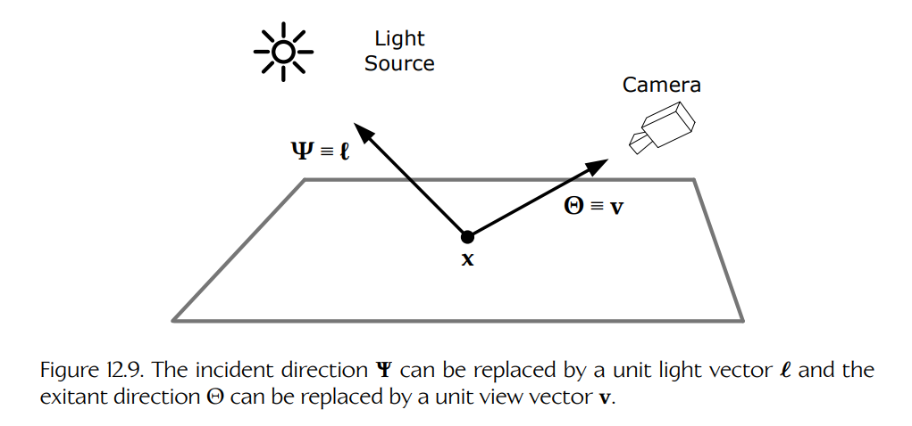
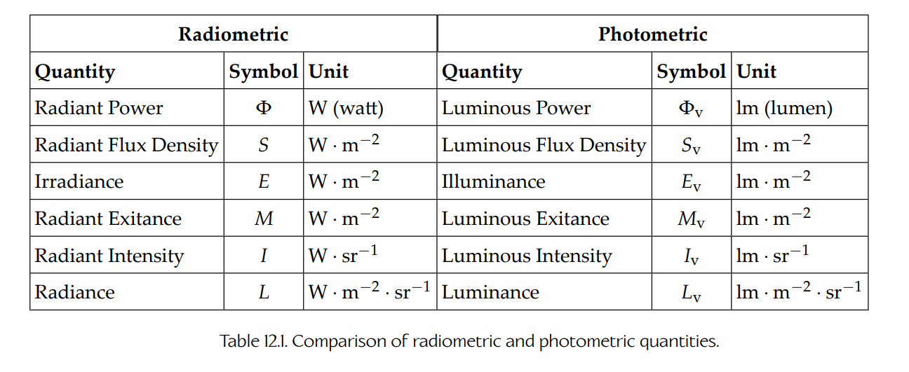

## 12.3 渲染方程

当光从表面反射或散射时，只有在完美镜面反射体（如镜子）这一特殊情况下，出射辐射亮度才会等于入射辐射亮度。在所有其他情况下，入射光会经历吸收、透射与折射，以及/或者反射与散射的某种组合，从而产生与入射辐射亮度显著不同的出射辐射亮度。自发光表面还会向总出射辐射亮度中加入额外的辐射功率。渲染引擎需要考虑所有这些能量传输过程，才能正确计算最终会被虚拟摄像机成像面上传感器接收到的辐射亮度。

用于描述入射辐射亮度与出射辐射亮度之间关系的方程称为**渲染方程**（rendering equation）。它由两组计算机图形学研究者在 1986 年独立提出：David Immel 等人与 James Kajiya。渲染方程是一个线性积分方程：说它是线性的，是因为它只涉及乘积与求和；说它是积分方程，是因为它要求我们在有限立体角上对辐射亮度进行积分。

### 12.3.1 渲染方程的推导

从本质上说，渲染方程其实相当简单。它说明：在表面点 $\mathbf{x}$ 处，沿方向 $\Theta$ 的总出射辐射亮度 $L$，等于该表面自身沿该方向发射的辐射亮度 $L_e$，加上该表面沿该方向反射出的辐射亮度 $L_r$：

$$
L(\mathbf{x} \to \Theta) = L_e(\mathbf{x} \to \Theta) + L_r(\mathbf{x} \to \Theta).
\tag{12.10}
$$

真正变得复杂的是反射辐射亮度 $L_r(\mathbf{x} \to \Theta)$ 的计算。当入射光与物体表面或两个透光介质之间的界面发生相互作用时，它可能被吸收、折射、镜面反射或散射。由于这种相互作用十分复杂，来自几乎任意方向的入射辐射亮度都有可能最终被反射到我们关注的方向 $\Theta$ 上，因此我们必须考虑来自每一个可能方向的入射光。这意味着我们需要在半球上对入射辐射亮度进行积分。我们可以先粗略写出反射辐射亮度计算的大致形式：

$$
L_r(\mathbf{x} \to \Theta) \approx \int_{\Omega} F \, L(\mathbf{x} \leftarrow \Psi) \, d\omega_{\Psi},
\tag{12.11}
$$

其中，$F$ 是某种“神奇”因子，用于描述光与表面相互作用的具体方式；而这种相互作用又取决于界面两侧材料的属性。

这个积分是在表面点 $\mathbf{x}$ 处的半球上计算的，积分变量是沿单条入射光线方向 $\Psi$ 取得的立体角无穷小 $d\omega_{\Psi}$。这个积分表示这样一个过程：考虑整个半球内每一个可能的入射光方向 $\Psi$，将每条入射光线上的入射辐射亮度乘以这个神奇因子 $F$，再乘以立体角无穷小 $d\omega_{\Psi}$，然后把所有结果相加，并取立体角无穷小趋近于零时的极限。

通常情况下，在半球上积分辐射亮度（单位为 $\mathrm{W} \cdot \mathrm{m}^{-2} \cdot \mathrm{sr}^{-1}$）会得到辐照度（单位为 $\mathrm{W} \cdot \mathrm{m}^{-2}$），这是因为乘上了立体角无穷小（单位为 $\mathrm{sr}$）。但上面的积分却要从输入辐射亮度得到输出辐射亮度。这意味着因子 $F$ 必须具有 $\mathrm{sr}^{-1}$ 的单位。

### 12.3.2 双向反射分布函数（BRDF）

为了用数学上精确的方式确定这个神奇因子 $F$，我们定义一个相关函数 $f_r(\mathbf{x}, \Psi \to \Theta)$。粗略地说，这个函数会把表面点 $\mathbf{x}$ 处来自方向 $\Psi$ 的入射辐照度，转换为方向 $\Theta$ 上的出射或反射辐射亮度。这个函数称为**双向反射分布函数**（bidirectional reflectance distribution function），简称 **BRDF**。说它是“双向”的，是因为光线方向具有可逆性（Helmholtz 互易性），这一点已经在 Section 12.2.5.5 中讨论过。说它是“反射函数”，是因为它建模的是光子如何从表面反射或散射。说它是“分布函数”，是因为它建模的是：对于给定入射方向，出射光线如何分布在半球上。

需要强调的是，BRDF 并不会直接把入射辐照度转换为反射辐射亮度；一般而言，必须对半球上所有入射方向进行积分，才能得到一个出射辐射亮度值。此外，BRDF 只能建模简单反射，即入射光子在表面上的单个点“弹开”的情形，而不能建模光子进入表面下方、又从另一个点重新射出的情况。我们将在 Section 12.3.2.1 中简单介绍一些更高级的双向分布函数。

BRDF 可以表示为反射辐射亮度 $L_r(\mathbf{x} \to \Theta)$ 对单点 $\mathbf{x}$ 处、来自方向 $\Psi$ 的入射辐照度 $E(\mathbf{x} \leftarrow \Psi)$ 的导数：

$$
f_r(\mathbf{x}, \Psi \to \Theta) =
\frac{dL_r(\mathbf{x} \to \Theta)}
{dE(\mathbf{x} \leftarrow \Psi)}.
\tag{12.12}
$$

整理这个方程，可以得到：

$$
dL_r(\mathbf{x} \to \Theta) =
f_r(\mathbf{x}, \Psi \to \Theta) \, dE(\mathbf{x} \leftarrow \Psi).
$$

如果接着在半球上对这个表达式进行积分，就可以得到我们要求的反射辐射亮度：

$$
L_r(\mathbf{x} \to \Theta) =
\int_{\Omega}
f_r(\mathbf{x}, \Psi \to \Theta) \, dE(\mathbf{x} \leftarrow \Psi).
$$

查阅 Equation (12.5)，可以回忆起辐照度可由辐射亮度计算得到：

$$
E(\mathbf{x}) =
\int_{\Omega}
L(\mathbf{x} \leftarrow \Psi) \cos\theta \, d\omega_{\Psi},
$$

因此，辐照度无穷小 $dE$ 可以简单地通过去掉积分写成：

$$
dE(\mathbf{x} \leftarrow \Psi) =
L(\mathbf{x} \leftarrow \Psi) \cos\theta \, d\omega_{\Psi}.
$$

将 $dE$ 的表达式代入后，就得到了反射辐射亮度方程的最终形式：

$$
L_r(\mathbf{x} \to \Theta) =
\int_{\Omega}
f_r(\mathbf{x}, \Psi \to \Theta)
L(\mathbf{x} \leftarrow \Psi)
\cos\theta \, d\omega_{\Psi}.
\tag{12.13}
$$

如果将这个方程与 Equation (12.11) 中的粗略形式进行比较，可以发现二者完全一致。因此，我们的“神奇”因子 $F$ 实际上就是 BRDF 乘以入射光线与表面法线之间夹角的余弦：

$$
F = f_r(\mathbf{x}, \Psi \to \Theta)\cos\theta.
$$

余弦项 $\cos\theta$ 的出现源于辐照度无穷小 $dE$ 的计算。它有时也写作 $\cos(\mathbf{n}, \Psi)$，以强调它是表面点 $\mathbf{x}$ 处表面法线与入射光线方向之间夹角的余弦。

将 Equation (12.13) 中的反射辐射亮度代回 Equation (12.10) 给出的渲染方程简化形式，我们得到完整的渲染方程：

$$
L(\mathbf{x} \to \Theta) =
L_e(\mathbf{x} \to \Theta) +
\int_{\Omega}
f_r(\mathbf{x}, \Psi \to \Theta)
L(\mathbf{x} \leftarrow \Psi)
\cos\theta \, d\omega_{\Psi}.
\tag{12.14}
$$

#### 12.3.2.1 广义双向分布函数（BxDF）

Equation (12.14) 中出现的函数 $f_r$ 有许多不同形式，其复杂度取决于它试图建模的具体物理现象。在最简单的情况下，$f_r$ 建模的是表面上单个点处的直接反射，此时它称为**双向反射分布函数**（bidirectional reflectance distribution function），即 BRDF。然而，函数 $f_r$ 也可以建模入射光子与表面之间更复杂的相互作用。例如，当 $f_r$ 建模的是光穿过透光界面并发生折射时，它称为**双向透射分布函数**（bidirectional transmittance distribution function），即 BTDF。当 $f_r$ 建模的是次表面散射，即光子从表面某一点进入、又从另一点离开表面时，它称为**双向次表面散射反射分布函数**（bidirectional subsurface scattering reflectance distribution function），即 BSSRDF。当具体函数类型并不重要时，我们有时会把函数 $f_r$ 统称为 BxDF。

一般而言，函数 $f_r$ 在物体表面的每个点上都会略有变化，因此我们把它写作位置 $\mathbf{x}$ 的函数。这种变化来自现实世界中大多数材料都是非均质的。不过，在计算机图形学中，我们常常假设材料是均质的，也就是说，可以忽略 $f_r$ 对位置的依赖，并从记号中去掉 $\mathbf{x}$。严格地说，依赖位置的 BxDF 称为**空间变化 BxDF**（spatially varying BxDF），即 SVBxDF；而不带 “SV” 前缀的 BxDF 则是空间不变的。不过，大多数图形程序员和图形学文本都会比较宽泛地使用 BxDF 这个术语，同时指代空间变化和空间不变的分布函数。

一般来说，BxDF 是**各向异性**（anisotropic）的，这意味着它会随绕表面法线的旋转而变化。不过，许多真实材料是**各向同性**（isotropic）的，也就是说，它们在绕法线旋转时保持不变。如果我们把一个各向同性材料样本放在转盘上，它的外观不会随着旋转而改变。

为了使任何 BxDF 在物理上真实，它必须满足以下要求：

- 它必须严格非负：$f_r(\mathbf{x}, \ell \to \mathbf{v}) \ge 0$。
- 它必须满足 Helmholtz 互易性：$f_r(\mathbf{x}, \ell \to \mathbf{v}) = f_r(\mathbf{x}, \mathbf{v} \to \ell)$。
- 它必须满足能量守恒。

能量守恒意味着，从表面出射的辐射功率不能大于入射功率，除非该表面本身会发光。BxDF 的**反射率** $\rho$ 告诉我们有百分之多少的入射光能量会被反射。它可用于测试能量守恒：如果它小于或等于 1（小于或等于 100%），则该 BxDF 是能量守恒的；但如果它大于 1（大于 100%），则出射能量超过入射能量，该 BxDF 就不满足能量守恒。这可以用数学形式表示如下：

$$
\forall \ell :
\left(
\rho =
\int_{\Omega}
f_r(\mathbf{x}, \ell \to \mathbf{v})
(\mathbf{n} \cdot \mathbf{v})
\, d\omega_{\mathbf{v}}
\right)
\le 1.
$$

记号 $\forall \ell$（读作“for all $\ell$”）表示这个关系必须对所有可能的入射光方向都成立。

### 12.3.3 渲染方程的其他形式

渲染方程可以写成许多不同形式。有些形式只是所用记号的细节不同；有些形式用单位向量而不是极角来表达方向；还有一些形式使用面积而不是立体角。表达渲染方程的各种形式很多，这可能会让刚接触全局光照的渲染程序员感到困惑。在接下来的几节中，我们会讨论渲染方程的一些替代形式，并说明这些形式其实都是在用略有不同的方式表达完全相同的概念。

**Figure 12.9.** 入射方向 $\Psi$ 可以替换为单位光照向量 $\ell$，出射方向 $\Theta$ 可以替换为单位视线向量 $\mathbf{v}$。

#### 12.3.3.1 渲染方程的向量形式

渲染方程通过在点 $\mathbf{x}$ 处的半球上对所有入射辐射亮度进行积分，来计算出射辐射亮度。在最简单的直接光照情况下，出射方向 $\Theta$ 指向摄像机或“观察者”，入射方向 $\Psi$ 指向光源。因此，习惯上会把渲染方程改写为单位向量形式，而不是用球坐标中的角度来表示方向，并将出射**视线向量**（view vector）命名为 $\mathbf{v}$，将入射**光照向量**（light vector）命名为 $\ell$（手写小写 ell）。需要记住的一点是，按照惯例，这两个向量都被定义为从表面点 $\mathbf{x}$ 指向外部。这对于视线向量来说很直观，因为它指向光子流动方向；但对于光照向量来说有些反直觉，因为它指向的是与光子传播方向相反的方向。向量 $\mathbf{v}$（方向 $\Theta$ 上的单位向量）和 $\ell$（方向 $\Psi$ 上的单位向量）如 Figure 12.9 所示。

用这两个单位向量重写渲染方程，并注意到 $\cos\theta = \cos(\mathbf{n}, \Psi) = (\mathbf{n} \cdot \ell)$，可得：

$$
L(\mathbf{x} \to \mathbf{v}) =
L_e(\mathbf{x} \to \mathbf{v}) +
\int_{\Omega}
f_r(\mathbf{x}, \ell \to \mathbf{v})
L(\mathbf{x} \leftarrow \ell)
(\mathbf{n} \cdot \ell)^+
\, d\omega_{\ell}.
\tag{12.15}
$$

可以看到，余弦项被写成了带加号上标的形式；这提醒我们，如果余弦值为负，就要将其钳制为零。这样做的效果是，只包含从上半球接近表面的照明。另一种写法是使用 `saturate(n · ℓ)`，这里参考的是饱和算术（saturation arithmetic）这一概念 [270]。HLSL 等着色语言通常会提供名为 `sat()` 或 `saturate()` 的内置函数来执行这种钳制操作。

这种形式可能更易读，也不那么费脑，因为大多数游戏程序员更习惯使用单位方向向量，而不是球坐标中的方向。只需要记住，大写 $L$ 表示辐射亮度，而小写 $\ell$ 表示单位光照向量。

同样重要的是要记住，$\ell$ 并不总是指向光源的方向，$\mathbf{v}$ 也不总是指向观察者的方向；一般来说，$\ell$ 表示点 $\mathbf{x}$ 处任意入射光线的方向，而 $\mathbf{v}$ 表示点 $\mathbf{x}$ 处任意出射光线的方向，无论这个点位于场景中的什么位置。

#### 12.3.3.2 文献中的渲染方程

在计算机图形学文献中，你会看到渲染方程以各种各样的形式出现，并使用各种各样的数学符号。我们来把其中几种与本书使用的形式进行比较，只是为了说明它们本质上都是同一个方程。

在本书中，我们把渲染方程表示如下（这里重复 Equation (12.14)）：

$$
L(\mathbf{x} \to \Theta) =
L_e(\mathbf{x} \to \Theta) +
\int_{\Omega}
f_r(\mathbf{x}, \Psi \to \Theta)
L(\mathbf{x} \leftarrow \Psi)
\cos\theta \, d\omega_{\Psi}.
$$

本书所使用的记号受到了 [11] 中渲染方程表述方式的启发。

在 [3] 中，渲染方程写作：

$$
L_i(\mathbf{c}, -\mathbf{v}) =
L_e(\mathbf{p}, \mathbf{v}) +
\int_{\mathbf{l} \in \Omega}
f(\mathbf{l}, \mathbf{v})
L_i(\mathbf{p}, \mathbf{l})
(\mathbf{n} \cdot \mathbf{l}) \, d\mathbf{l}.
$$

这个形式与本书中的 Equation (12.15) 几乎完全相同，只有一些表面上的差别。方程左侧计算的是 $L_i(\mathbf{c}, -\mathbf{v})$，即摄像机成像面上点 $\mathbf{c}$ 处的入射辐射亮度；这与测量离摄像机最近、并且与目标图像传感器有直接视线关系的表面点 $\mathbf{p}$ 处的出射辐射亮度是同一件事。（本书把这个表面点称为 $\mathbf{x}$。）单位方向向量 $\mathbf{v}$ 指向成像面；由于方向向量按照惯例总是指向离开表面的方向，所以这里它被取反。立体角无穷小写作 $d\mathbf{l}$，而不是本书中使用的 $d\omega_{\Psi}$ 或 $d\omega_{\ell}$。

Kajiya 的原始论文 [28] 用如下方式表达渲染方程：

$$
I(x, x') =
g(x, x')
\left[
\epsilon(x, x') +
\int_S
\rho(x, x', x'') I(x', x'') \, dx''
\right].
$$

这里，光传输被视为场景表面上若干选定点 $x$、$x'$ 和 $x''$ 之间的入射或出射关系。（Kajiya 没有使用向量记号来表示点。）项 $g(x, x')$ 用于描述表面之间的几何关系，$\epsilon(x, x')$ 用于描述表面发射的任何光，而 $\rho(x, x', x'')$ 则起到类似 BRDF 的作用。这个形式没有使用“辐射亮度”这个术语，而是用 Kajiya 所称的“传输强度”（transport intensity，也就是方程中的 $I$）来表达；它是功率对面积求二阶导数得到的量。换句话说，传输强度就是源点处单位面积、目标点处单位面积上的辐射功率。不过，正如下一节将看到的，Kajiya 的传输强度与辐射亮度起到的作用完全相同。

#### 12.3.3.3 渲染方程的面积形式

在表面积上积分与在立体角上积分具有相同效果，因此我们可以看到 Kajiya 的形式与本书所用形式之间存在一种间接对应关系。在 [11] 中，Dutré 等人给出了他们自己的渲染方程面积形式，而不是立体角形式。按照本书的约定稍作调整后，它看起来如下：

$$
L(\mathbf{x} \to \mathbf{v}) =
L_e(\mathbf{x} \to \mathbf{v})
+
\int_A
f_r(\mathbf{x}, \ell \to \mathbf{v})
L(\mathbf{y} \to -\ell)
V(\mathbf{x}, \mathbf{y})
G(\mathbf{x}, \mathbf{y})
\, dA_{\mathbf{y}}.
\tag{12.16}
$$

在这个形式中，$\mathbf{x}$ 仍然是我们希望计算其出射辐射亮度的表面点，但引入了第二个表面点 $\mathbf{y}$，用于表示某条入射光线的来源。积分是在场景中所有表面 $A$ 上进行的，因此 $\mathbf{y}$ 在积分过程中不断变化，而 $\mathbf{x}$ 保持固定。$V(\mathbf{x}, \mathbf{y})$ 是**可见性函数**（visibility function），当 $\mathbf{x}$ 与 $\mathbf{y}$ 之间存在直接视线时，其值为 1，否则为 0。类似于 Kajiya 的形式，$G(\mathbf{x}, \mathbf{y})$ 是一个**几何项**（geometry term），用于考虑每个表面的余弦项以及二者之间的距离 $r_{xy}$。它定义如下：

$$
G(\mathbf{x}, \mathbf{y}) =
\frac{
(\mathbf{n}_{\mathbf{x}} \cdot \ell)
(\mathbf{n}_{\mathbf{y}} \cdot -\ell)
}
{r_{xy}^{2}}.
\tag{12.17}
$$

#### 光线投射函数

渲染方程的面积形式构成了一类 3D 渲染技术的基础，这类技术称为**辐射度方法**（radiosity methods）。它对于基于**光线追踪**（ray tracing）的渲染引擎也有实际用途，因为点 $\mathbf{y}$ 可以通过从 $\mathbf{x}$ 沿方向 $\ell$ 向场景中投射一条光线来找到。通常会定义一个**光线投射函数**（ray-casting function）$\mathbf{R}(\mathbf{x}, \ell)$，它返回沿方向 $\ell$ 的光线所相交的、离 $\mathbf{x}$ 最近的点，从而可以写成 $\mathbf{y} = \mathbf{R}(\mathbf{x}, \ell)$。我们将在 Section 12.6.3 中更深入地讨论光线追踪的理论与实践。

#### 面积形式的单位分析

敏锐的读者可能会注意到，Equation (12.16) 的单位似乎对不上。在立体角形式中，我们通过对一些项求积分来计算反射辐射亮度；每一项看起来都是辐射亮度 $L$ 乘以 BRDF $f_r$，再乘以立体角 $d\omega$。这些单位可以很好地相互抵消，因为 $f_r$ 的单位是 $\mathrm{sr}^{-1}$，可以抵消单位为 $\mathrm{sr}$ 的 $d\omega$。但面积形式中积分号内的表达式看起来像是辐射亮度 $L$ 乘以 BRDF $f_r$，再乘以面积 $dA$。难道 $f_r dA$ 的单位不会变成 $\mathrm{sr}^{-1} \cdot \mathrm{m}^{2}$，从而无法抵消吗？面积项实际上会被来自 $G(\mathbf{x}, \mathbf{y})$ 的 $1 / r_{xy}^{2}$ 抵消，所以这部分是有帮助的。但这似乎仍然留下了一个无法抵消的 $\mathrm{sr}^{-1}$ 项。

幸运的是，渲染方程面积形式中的单位实际上是成立的。原因与 $G$ 项最初的推导方式有关。它实际上来自这样一个事实：立体角形式中的立体角无穷小可以写成面积比值（无单位）再乘以余弦或点积（同样无单位）：

$$
d\omega_{\ell} =
d\omega_{\mathbf{x} \leftarrow dA_{\mathbf{y}}}
=
(\mathbf{n}_{\mathbf{y}} \cdot -\ell)
\frac{dA_{\mathbf{y}}}{r_{xy}^{2}}.
$$

换句话说，当无穷小面积 $dA_{\mathbf{y}}$ 与 $G(\mathbf{x}, \mathbf{y})$ 相乘时，它最终具有立体角（$\mathrm{sr}$）的单位，而 BRDF 仍然具有 $\mathrm{sr}^{-1}$ 的单位，所以所有单位会以同样的方式相互抵消。

### 12.3.4 光度学渲染方程

到目前为止，我们关注的是**辐射度量学量**（radiometric quantities）的理论与数学，例如辐射功率、辐照度和辐射亮度。然而，渲染引擎还需要考虑人类感知，所以我们真正需要计算的是对应的**光度学量**（photometric quantities）。正如 Section 11.2.3.4 中提到的，辐射功率在光度学中的对应量称为**光功率**（luminous power）。它被定义为辐射功率乘以一条曲线 $V(\lambda)$，该曲线建模了人眼对不同波长的敏感度。辐射功率的单位是瓦特，而光功率的单位是流明。1 流明被定义为在人眼最大敏感波长（$\lambda = 555 \ \mathrm{nm}$）处 683 瓦功率所对应的光功率。

**Table 12.1.** 辐射度量学量与光度学量的比较。

Table 12.1 展示了我们已经讨论过的辐射度量学量及其光度学对应量之间的关系。虽然渲染方程计算的是辐射亮度，但渲染引擎实际计算的是亮度。只要输入、输出和中间值都使用基于流明而不是瓦特的单位，数学形式就完全相同。

到目前为止，我们一直忽略了波长对渲染方程的影响。完整形式的渲染方程会把波长 $\lambda$ 作为额外参数加入到函数中，例如 $f_r(\lambda, \mathbf{x}, \ell \to \mathbf{v})$ 和 $L(\lambda, \mathbf{x} \to \mathbf{v})$。不过，由于人类视觉感知基于三刺激响应，而且这些分量的行为大致是线性的，因此我们也可以通过把每个辐射度量学或光度学方程拆分成一组三个方程来得到物理上合理的结果（虽然不是严格正确），每个颜色通道对应一个方程。改写为光度学形式并拆分成三个颜色分量后，渲染方程如下所示：

$$
L_{v|R}(\mathbf{x} \to \mathbf{v}) =
L_{v,e|R}(\mathbf{x} \to \mathbf{v})
+
\int_{\Omega}
f_{r|R}(\mathbf{x}, \ell \to \mathbf{v})
L_{v|R}(\mathbf{x} \leftarrow \ell)
(\mathbf{n} \cdot \ell)^+
\, d\omega_{\ell},
$$

$$
L_{v|G}(\mathbf{x} \to \mathbf{v}) =
L_{v,e|G}(\mathbf{x} \to \mathbf{v})
+
\int_{\Omega}
f_{r|G}(\mathbf{x}, \ell \to \mathbf{v})
L_{v|G}(\mathbf{x} \leftarrow \ell)
(\mathbf{n} \cdot \ell)^+
\, d\omega_{\ell},
$$

$$
L_{v|B}(\mathbf{x} \to \mathbf{v}) =
L_{v,e|B}(\mathbf{x} \to \mathbf{v})
+
\int_{\Omega}
f_{r|B}(\mathbf{x}, \ell \to \mathbf{v})
L_{v|B}(\mathbf{x} \leftarrow \ell)
(\mathbf{n} \cdot \ell)^+
\, d\omega_{\ell}.
$$

为了让记号更简洁，我们也可以直接扩展光度学渲染方程，使其使用由 R、G、B 三个颜色分量组成的向量，而不是笛卡尔空间分量。为了区分 RGB 向量和笛卡尔向量，我们将使用粗体无衬线字体。例如，$\mathbf{L}_v$ 表示 RGB 亮度，而 $\mathbf{n}$ 则表示以笛卡尔坐标表达的单位法线向量。使用这种记号，可以把三个渲染方程简洁地写成如下向量形式：

$$
\mathbf{L}_v(\mathbf{x} \to \mathbf{v}) =
\mathbf{L}_{v,e}(\mathbf{x} \to \mathbf{v}) +
\int_{\Omega}
\mathbf{f}_r(\mathbf{x}, \ell \to \mathbf{v})
\mathbf{L}_v(\mathbf{x} \leftarrow \ell)
(\mathbf{n} \cdot \ell)^+
\, d\omega_{\ell}.
\tag{12.18}
$$

#### 12.3.4.1 操作颜色向量

Equation (12.18) 右侧的量 $\mathbf{L}_v = (L_{v|R}, L_{v|G}, L_{v|B})$，就是我们在图形编程中传统上所理解的 $(R, G, B)$ “颜色值”。亮度（辐射亮度的光度学对应量）是渲染引擎在生成图像时写入帧缓冲像素的量，而使用 sRGB 颜色编码系统对这些值进行编码，可以以符合感知的方式捕获亮度。

像 $\mathbf{L}_v$ 这样的颜色在某种程度上可以像数学意义上的向量一样操作。两个颜色可以按向量方式相加以产生新的颜色——这对应于现实世界中多个光源的功率线性相加。颜色向量也可以乘以标量，以增加或降低其亮度。不过，颜色向量的大小并不是它的整体亮度。回忆一下，SIE xyY 颜色系统用颜色的 $x$ 与 $y$ 分量编码色度（chromaticity），用 $Y$ 分量编码亮度（感知亮度）。由于 sRGB 色彩空间的定义方式，颜色 $\mathbf{C} = (R, G, B)$ 的灰度亮度实际上是：

$$
Y = 0.212639R + 0.715169G + 0.072192B,
$$

而不是像人们可能预期的那样，用向量长度 $|\mathbf{C}| = (R^2 + G^2 + B^2)^{1/2}$ 表示。

此外，与笛卡尔空间向量不同，颜色向量的分量绝不能为负；为了在物理上合理，颜色必须位于颜色空间的第一卦限中。颜色分量可以大于 1；这在执行**高动态范围**（high dynamic range, HDR）光照计算时很有用。但当颜色最终写入用于显示的帧缓冲像素时，它们必须经过**色调映射**（tone mapped）或被钳制到 $[0, 1]$ 范围内。

同样，我们绝不会计算两个颜色向量之间的点积或叉积。在乘法颜色时，我们使用逐分量乘法，这在技术上称为 **Hadamard 积**（Hadamard product）。有些文本会使用如下记号：

$$
\mathbf{L}_v =
(\mathbf{C} \otimes \mathbf{E}_v)
(\mathbf{n} \cdot \ell)^+,
$$

表示 RGB 三元组 $\mathbf{C}$ 与 RGB 三元组 $\mathbf{E}_v$ 逐分量相乘，然后得到的 RGB 三元组再乘以饱和余弦项 $(\mathbf{n} \cdot \ell)^+$。本书将省略 $\otimes$ 符号。只需要记住，乘法 RGB 三元组时，乘法总是逐分量进行的。

需要指出的是，乘法颜色向量严格来说并不完全正确，因为有色光信号中的能量是连续分布在可见光谱上的（如 Section 11.2.3.2 所述）。物理上正确的颜色乘法方式，是计算它们的**光谱功率分布**（spectral power distributions, SPD）的乘积，然后再把得到的 SPD 转换回 sRGB 空间。但这样做并不现实；幸运的是，颜色向量逐分量相乘所带来的精度损失可以忽略不计。

有些文本会比较宽泛地使用符号 $\mathbf{C}$ 来表示光度学计算中的各种类似颜色的量。这可能会有些令人困惑，因为我们容易忘记哪些量是辐射亮度/亮度，哪些量是辐照度/照度，哪些量只是类似 BRDF 这样的缩放因子。在本书中，当相关颜色向量实际包含单位为 $\mathrm{lm} \cdot \mathrm{m}^{-2} \cdot \mathrm{sr}^{-1}$ 的 RGB 亮度分量时，我们会使用符号 $\mathbf{L}_v$。类似地，当讨论 RGB 分量单位为 $\mathrm{lm} \cdot \mathrm{m}^{-2}$ 的辐照度颜色向量时，我们会使用 $\mathbf{E}_v$。只有在讨论一个无量纲颜色向量，且它的作用是缩放另一个本身为亮度或照度的颜色向量的亮度时，我们才会使用通用符号 $\mathbf{C}$。当这个缩放因子就是 BRDF 本身时，如果强调 BRDF 的波长依赖性很重要，我们会使用向量函数 $\mathbf{f}_r$；如果为了简洁而忽略 BRDF 的波长依赖性，则使用标量函数 $f_r$。