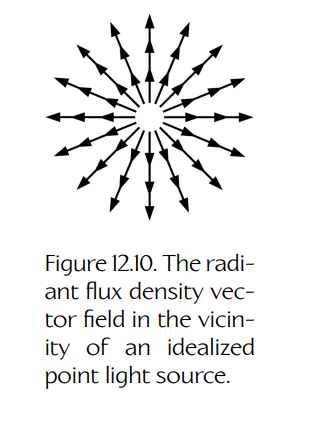
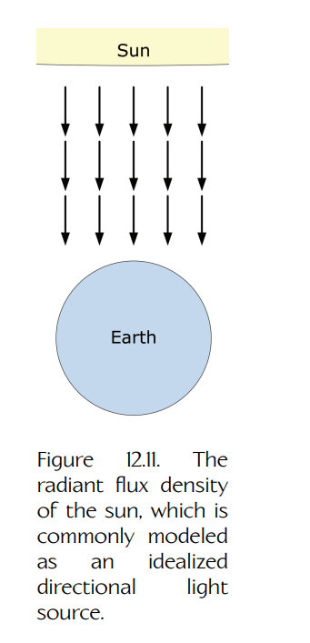
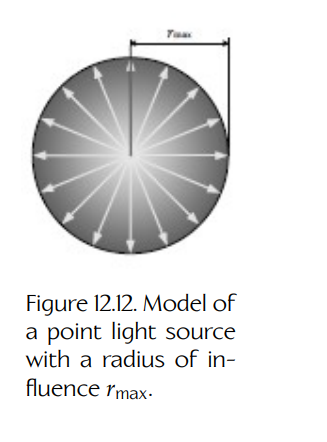
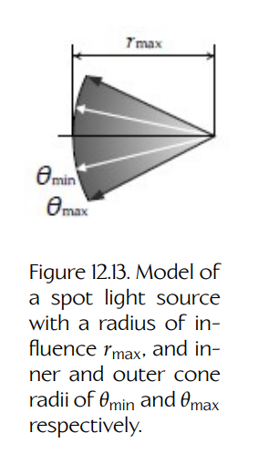
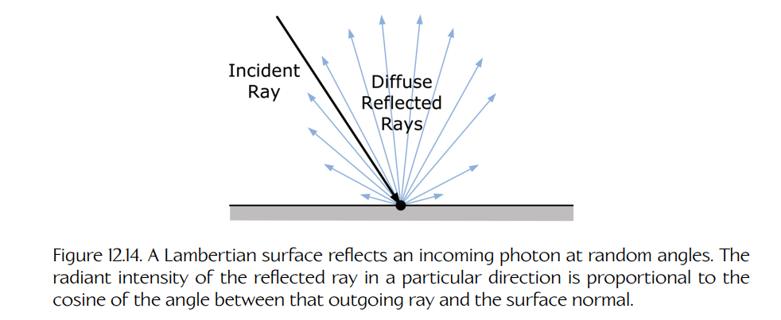
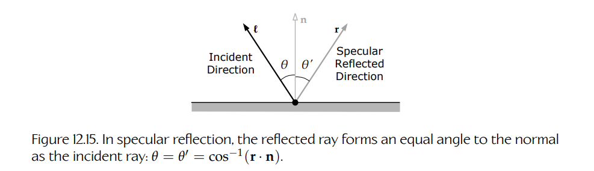
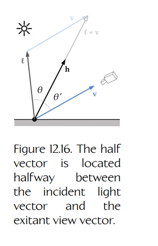
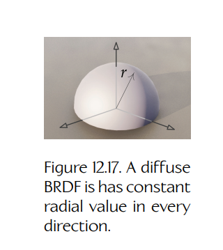
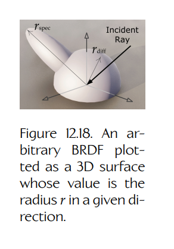
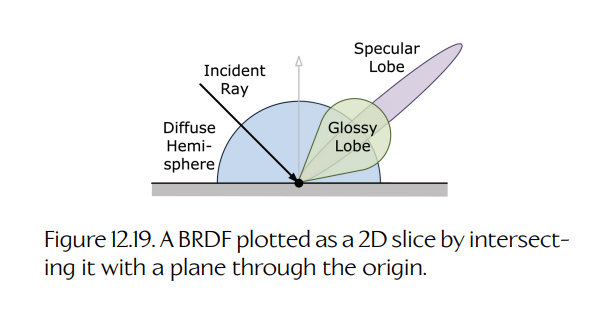

## 12.4 着色方程

渲染方程是一种简洁且理论上正确的方式，用于概括光传输的物理过程，以及渲染照片级真实图像所需的辐射度量学与光度学知识。遗憾的是，渲染方程中的积分没有闭式解。

如果思考一下我们在点 $\mathbf{x}$ 处计算反射辐射亮度时究竟发生了什么，就会发现我们基本上是在把入射到该点的所有辐照度加总起来。但这些入射辐照度来自哪里呢？其中一部分当然直接来自光源——这种情况相当直接。但另一部分光则是在场景中以复杂方式多次反弹之后，先从另一个点 $\mathbf{y}$ 反射，最终到达 $\mathbf{x}$。因此，我们不仅需要对每一个可能的入射角求解渲染方程中的积分——或者在使用面积形式时，对整个场景中每一个点 $\mathbf{y}$ 求解积分——还需要递归地对所有这些点 $\mathbf{y}$ 继续应用渲染方程，并无限重复下去。更进一步，点 $\mathbf{y}$ 处的一部分辐照度甚至可能又来自 $\mathbf{x}$，从而使递归变成循环！因此，解析地求解渲染方程在实践中完全不可行。

在 Section 12.6.3 中，我们将讨论一些用数值方法计算渲染方程积分的实际做法。不过，如果做出一些简化假设，我们实际上可以把积分转换成一个简单求和，从而让渲染方程的求解变得更容易处理。渲染方程的这种简化形式称为**着色方程**（shading equation）。

着色方程无法生成照片级真实结果，因为它没有以物理真实的方式考虑间接光照。它也无法处理面积光源，因此自身无法产生柔和阴影。但着色方程能够产生视觉上可信的图像。更重要的是，着色方程是一个容易理解的例子，展示了渲染方程背后的理论如何在实时渲染引擎中投入实际使用。

### 12.4.1 着色方程的推导

为了推导着色方程，我们需要做出两个简化假设。第一个假设是：场景只包含理想化的点光源和方向光源——我们不会尝试建模面积光源。第二个假设是：间接光照要么可以被忽略，要么可以被粗略近似。我们的着色方程不会尝试以物理真实的方式建模间接光照。

Equation (12.18) 给出了渲染方程的光度学形式。为了便于参考，这里再重复一次。由于渲染方程总是在某个表面点处逐点求值，因此我们可以从记号中去掉表面点 $\mathbf{x}$，让表达更简洁一些。

$$
\mathbf{L}_v(\mathbf{v}) =
\mathbf{L}_{v,e}(\mathbf{v}) +
\int_{\Omega}
\mathbf{f}_r(\ell \to \mathbf{v})
\mathbf{L}_v(\ell)
(\mathbf{n} \cdot \ell)^+
\, d\omega_{\ell}.
$$

渲染方程是由 Equation (12.12) 推导而来的，Equation (12.12) 将 BRDF 定义为反射亮度对入射照度的导数 $dL/dE$。我们在半球上对它积分，得到了积分号内部的项 $\mathbf{f}_r(\ell \to \mathbf{v}) \mathbf{L}_v(\ell)(\mathbf{n} \cdot \ell)^+ d\omega_{\ell}$。

我们的第一个简化假设是：只使用理想化的点光源和方向光源。这类理想化光源的一个好处是，在任意给定表面点 $\mathbf{x}$ 处，每个光源都只有一个入射光方向 $\ell_k$。这意味着我们不再需要针对每个光源在半球上积分，因此可以把 BRDF 用非微分形式写成：

$$
\mathbf{f}_r(\ell_k \to \mathbf{v}) =
\frac{
\mathbf{L}_{v,k}(\mathbf{v})
}{
\mathbf{E}_{v,k}(\mathbf{n} \cdot \ell_k)^+
}.
\tag{12.19}
$$

$\mathbf{L}_{v,k}(\mathbf{v})$ 是由于第 $k$ 个光源产生的照度 $\mathbf{E}_{v,k}$ 而沿方向 $\mathbf{v}$ 反射出的出射亮度。余弦项 $(\mathbf{n} \cdot \ell_k)^+$ 确保我们取的是垂直于光源 $\ell_k$ 传播方向的照度。

我们可以重排 Equation (12.19)，从而分离出单个光源沿摄像机方向产生的反射亮度：

$$
\mathbf{L}_{v,k}(\mathbf{v}) =
\mathbf{f}_r(\ell_k \to \mathbf{v}) \mathbf{E}_{v,k}
(\mathbf{n} \cdot \ell_k)^+.
$$

为了得到总反射亮度，我们只需要把由 $n$ 个光源反射产生的所有 $\mathbf{L}_{v,k}(\mathbf{v})$ 相加即可。这意味着 Equation (12.18) 中的积分已经变成了对光源的求和。我们的第一个简化假设还意味着不存在面积光源，因此自发光项 $\mathbf{L}_{v,e}(\mathbf{v})$ 消失。为了替代自发光项，并与第二个简化假设保持一致，我们会加入一个项来概括场景中的所有间接光照；这个项称为**环境光项**（ambient term），记作 $\mathbf{L}_{v,amb}$。最终得到的简化渲染方程如下所示。我们将其称为**着色方程**：

$$
\mathbf{L}_v(\mathbf{v}) =
\mathbf{L}_{v,amb} +
\sum_{k=1}^{n}
\mathbf{f}_r(\ell_k \to \mathbf{v})
\mathbf{E}_{v,k}
(\mathbf{n} \cdot \ell_k)^+.
\tag{12.20}
$$

这里需要小心：亮度和照度中的下标 “$v$” 只是表示它们是“视觉”或光度学量；这个下标用于将它们与对应的辐射度量学量区分开来。不要把它和单位向量 $\mathbf{v}$ 混淆，后者表示从表面出射或离开表面的光子流方向。

#### 12.4.1.1 环境光项

在现实中，间接光照是光子在到达摄像机之前，从多个表面随机反弹形成的结果。一般来说，它在整个场景中都会变化，不过通常变化比较缓慢。我们可以把环境光建模为位置和方向的低频函数 $\mathbf{L}_{amb}(\mathbf{x}, \ell)$，而不是一个常量亮度，从而考虑这种变化。其中一种做法是把环境光编码到一种特殊纹理中，这种纹理称为**立方体贴图**（cube map）或**环境贴图**（environment map）。我们将在 Section 12.5.2.1 中讨论环境映射。不过，低频间接光照模型无法解释表面细节和自遮蔽效果，因此通常会在方程中加入另一个间接项，用于建模**环境光遮蔽**（ambient occlusion）。我们将在 Section 12.5.7 中更深入地讨论环境光遮蔽。

### 12.4.2 建模理想化光源

理想化光源有两种基本类型：

- **单向光源**（unidirectional light source，也常简称为**方向光**，directional light）是一种相对于被照亮场景尺寸而言大小近似无限的面积光源，因此所有发射出的光线彼此平行。阳光经常被建模为方向光源。
- **全向光源**（omnidirectional light source，也称为**点光源**，point light）是一种尺寸近似为零的面积光源，因此所有发射出的光线都从一个点径向向外传播。小灯泡和 LED 经常被建模为理想化点光源。

任意理想化光源的描述都由三个分量组成：空间中的位置 $\mathbf{y}_k$、单位方向向量 $\ell_k$，以及照度 $\mathbf{E}_{v,k}$。从实际角度看，位置分量只对点光源真正有意义，但方向光也可以被看成拥有一个位置——只不过这个位置在无限远处。

**Figure 12.10.** 理想化点光源附近的辐射通量密度向量场。

**Figure 12.11.** 太阳的辐射通量密度，通常被建模为理想化方向光源。

Figures 12.10 和 12.11 分别展示了点光源和方向光源所产生的辐射通量密度向量场 $\mathbf{S}(\mathbf{x})$。点光源的向量场从 $\mathbf{y}_k$ 向所有方向径向外扩展。方向光源的向量场在空间中处处平行且恒定。平行向量场可以看作点光源位置 $\mathbf{y}_k$ 被移到无穷远处时的极限情况。

太阳经常被建模为方向光源。实际上，它是一个面积远大于地球直径的面积光源。从太阳表面发射出的光子会沿随机方向飞出，因此你可能会认为它会产生一个本质上随机且混杂的向量场。然而，太阳距离我们非常远——远到只有那些大致平行于连接两个天体中心的直线传播的光子，才能真正抵达地球表面。因此，尽管太阳是一个巨大的面积光源，但它在地球上的辐射通量向量场表现得就像一个位于无限远处、无穷小的点光源。（另一种证明这种说法的方式是：尽管太阳尺寸巨大，但由于它离我们极其遥远，所以它在天空中张成的立体角其实相当小。）

当点光源或方向光源发出的辐射通量向量场与表面点 $\mathbf{x}$ 相交时，光的单位方向向量 $\ell_k$ 被定义为指向离开表面的方向，因此它的方向与光子流动方向相反：

$$
\ell_k(\mathbf{x}) =
-
\frac{\mathbf{S}(\mathbf{x})}
{|\mathbf{S}(\mathbf{x})|}.
$$

量 $\mathbf{E}_{v,k}$ 表示第 $k$ 个光源在一个白色、完全漫反射、且垂直于出射光子方向放置的表面上所产生的照度。照度是辐照度的光度学对应量，因此它的单位是勒克斯，即每平方米流明。我们把照度写成向量，是为了提醒自己它具有红、绿、蓝三个分量。量 $\mathbf{E}_{v,k}$ 就是渲染程序员谈论“第 $k$ 个光源的颜色”时实际所指的东西。

#### 12.4.2.1 方向光模型

方向光会产生一个在整个空间中恒定的向量场，因此对于方向光源有：

$$
\ell_k(\mathbf{x})_{\text{directional}} =
\ell_k = \text{constant}.
$$

方向光的照度在空间中也处处恒定，因此：

$$
\mathbf{E}_{v,k}(\mathbf{x})_{\text{directional}} =
\mathbf{E}_{v,k} = \text{constant}.
$$

#### 12.4.2.2 点光源模型

点光源的方向向量会由于其径向向量场而在整个场景中连续变化。但在任意给定表面点 $\mathbf{x}$ 处，光的单位方向向量是固定的，并且指向光源，因此：

$$
\ell_k(\mathbf{x})_{\text{point}} =
\frac{\mathbf{y}_k - \mathbf{x}}
{|\mathbf{y}_k - \mathbf{x}|},
$$

其中 $\mathbf{y}_k$ 是点光源的位置。

如 Section 12.2.4.5 所讨论的，点光源的照度会按照平方反比定律衰减。我们需要记住把这种衰减考虑进去，因此：

$$
\mathbf{E}_{v,k}(\mathbf{x})_{\text{point}} =
\frac{\Phi_{v,k}}
{r_{xy}^{2}},
$$

其中 $\Phi_{v,k}$ 是第 $k$ 个点光源的光功率，$r_{xy}$ 是 $\mathbf{x}$ 与光源位置 $\mathbf{y}_k$ 之间的距离。

由于平方反比衰减非常快，点光源的照度在超过某个半径 $r_{\max}$ 后几乎降为零；我们称这个半径为它的**影响球**（sphere of influence）。大多数渲染引擎只会把点光源效果应用到落在其影响球内的表面上，这提供了显著的优化。Figure 12.12 展示了一个点光源模型。

**Figure 12.12.** 具有影响半径 $r_{\max}$ 的点光源模型。

#### 12.4.2.3 聚光灯模型

**聚光灯**（spot light）的行为类似于一个点光源，但它的光线被限制在锥形区域中，例如手持手电筒。通常会用内角和外角两个锥角来指定聚光灯。在内锥内部，光被认为处于完整强度。随着角度从内锥增大到外锥，强度会逐渐衰减；超过外锥后，强度被认为是零。聚光灯被建模为位置 $\mathbf{y}$、随距离衰减的照度 $\mathbf{E}_{v,k}$、中心方向向量 $\mathbf{u}$、影响球半径 $r_{\max}$，以及内锥角和外锥角 $\theta_{\min}$ 与 $\theta_{\max}$。Figure 12.13 展示了一个聚光灯源。

**Figure 12.13.** 聚光灯光源模型，具有影响半径 $r_{\max}$，以及分别为 $\theta_{\min}$ 和 $\theta_{\max}$ 的内外锥半径。

#### 12.4.2.4 理想化光源的照度

Equation (12.20) 使用符号 $\mathbf{E}_{v,k}$ 表示第 $k$ 个光源的照度，而不管该光源是方向光源还是点光源/聚光灯。这里的假设是：对于任意点光源，$\Phi_{v,k}$ 随距离产生的衰减已经预先计算完成。

### 12.4.3 用于着色的 BRDF

在接下来的小节中，我们将讨论几种通常与着色方程结合使用的简单 BRDF。这些 BRDF 过于简单，无法产生照片级真实结果，但它们很适合生成屏幕上可信的受光场景，较早期的游戏也曾完全依赖这些 BRDF。当然，今天的照片级真实渲染引擎会使用更高级的 BRDF 模型，但理解简单 BRDF 仍然是掌握相关概念的绝佳方式。

#### 12.4.3.1 漫反射 Lambert 反射

给定一条具有一定功率的入射光线，一个完全漫反射材料会根据 **Lambert 余弦定律**（Lambert’s cosine law）把这部分功率均匀散射到所有方向。以这种方式反射的材料称为 **Lambertian** 材料。它的 BRDF 可以理解为把一条入射光线转换成整个半球上的出射光线。

Lambert 余弦定律说明，某一方向上的反射光线辐射强度与该出射光线和表面法线之间夹角的余弦成正比。因此，反射光在接近垂直于表面的方向上具有最大强度（当 $\mathbf{n} \cdot \ell \approx 1$ 时），并且会在方向接近平行于表面时衰减为零（当 $\mathbf{n} \cdot \ell \to 0$ 时）。Figure 12.14 展示了 Lambert 反射。

**Figure 12.14.** Lambertian 表面会以随机角度反射入射光子。某一方向上反射光线的辐射强度与该出射光线和表面法线之间夹角的余弦成正比。

正如我们从渲染方程的推导中看到的，Lambert 反射中的余弦项其实并不是漫反射材料的固有属性。它的出现是因为辐射通量密度、辐照度和辐射出射度都被定义为垂直于光传播方向的单位面积上的辐射功率。因此，Lambertian 材料的 BRDF 只是一个常量。它实际上并不包含余弦项，所以“Lambert 余弦定律”这个名称在某种程度上容易造成误解。

我们可以把漫反射（Lambertian）材料的 BRDF 写成：

$$
\mathbf{f}_r(\mathbf{x}, \ell_k \to \mathbf{v})_{\text{lambertian}}
=
\mathbf{f}_{diff},
\tag{12.21}
$$

其中 $\mathbf{f}_{diff}$ 只是一个常量 $(R,G,B)$ 值。这个常量本身并不真正是一个“颜色”。它仍然是一个 BRDF，单位是 $\mathrm{sr}^{-1}$，而不是亮度单位。它只作为逐分量缩放值，对来自每个光源的入射亮度进行缩放。

常量 Lambertian BRDF $\mathbf{f}_{diff}$ 是表面点 $\mathbf{x}$ 的属性，因此它与光源无关，可以从求和符号中提出。对于 Lambertian 表面，着色方程因此简化为：

$$
\mathbf{L}_v(\mathbf{v}) =
\mathbf{L}_{v,amb} +
\mathbf{f}_{diff}
\sum_{k=1}^{n}
\mathbf{E}_{v,k}
(\mathbf{n} \cdot \ell_k)^+.
\tag{12.22}
$$

#### 12.4.3.2 漫反射材料颜色与反照率

真实材料不会反射它们接收到的全部光线。它们会吸收某些波长并反射其他波长，从而形成材料的外观颜色。材料的**反射率**（reflectance）$\rho(\ell)$ 描述了它在方向 $\ell$ 上会反射每个波长的多少光。对于漫反射材料，反射率对所有入射方向都是常量，因此 $\rho(\ell)_{\text{diffuse}} = \text{constant} = \mathbf{C}_{diff}$。我们可以把 $\mathbf{C}_{diff}$ 看作一个 RGB 颜色缩放因子，用于捕获材料的“固有颜色”。这里再次使用粗体无衬线字体，是为了提醒我们这些量是 RGB 三元组，而不是标量或普通向量。反射率通常也称为表面的**反照率**（albedo）。

一般来说，表面的反射率取决于入射光方向 $\ell$，并且它被定义为半球上的积分：

$$
\rho(\ell) =
\int_{\Omega}
\mathbf{f}_r(\ell \to \mathbf{v})
(\mathbf{n} \cdot \mathbf{v})
\, d\omega_{\mathbf{v}}.
$$

对于 Lambertian 表面，BRDF 是常量，因此可以提出积分号：

$$
\rho(\ell) =
\mathbf{f}_r(\ell \to \mathbf{v})
\int_{\Omega}
(\mathbf{n} \cdot \mathbf{v})
\, d\omega_{\mathbf{v}},
$$

$$
=
\mathbf{f}_{diff}
\int_{\Omega}
\cos\theta_{\mathbf{v}}
\, d\omega_{\mathbf{v}}.
$$

Equation (12.7) 告诉我们，任意微分立体角都可以用其球坐标表示：$d\omega_{\mathbf{v}} = \sin\theta \, d\theta \, d\varphi$。对半球的积分于是可以写成如下双重积分：

$$
\rho(\ell) =
\mathbf{f}_{diff}
\int_{0}^{2\pi}
\int_{0}^{\pi/2}
\cos\theta \sin\theta
\, d\theta \, d\varphi.
$$

如果计算这个双重积分，它的值就是常量 $\pi$：

$$
\rho(\ell) = \mathbf{f}_{diff}\pi.
$$

因此，我们可以把 Lambertian BRDF 写成：

$$
\mathbf{f}_{diff} =
\frac{\rho(\ell)}{\pi}
=
\frac{\mathbf{C}_{diff}}{\pi}.
\tag{12.23}
$$

常见做法是把 $1/\pi$ 因子合并进表面的漫反射颜色中，并称其为 $\mathbf{C}'_{diff}$。如果这样做，我们就可以说 Lambertian 表面的 BRDF 等于它的漫反射颜色：$\mathbf{f}_{diff} = \mathbf{C}'_{diff}$。只需要记住，这个漫反射颜色实际上是 BRDF，而不是反射率。若要把它转换回反射率，就必须乘以 $\pi$：

$$
\mathbf{C}_{diff} =
\pi \mathbf{C}'_{diff}
=
\pi \mathbf{f}_{diff}.
\tag{12.24}
$$

因此，对于 Lambertian 表面上的任意点，我们的着色方程变为：

$$
\mathbf{L}_v(\mathbf{v}) =
\mathbf{L}_{v,amb} +
\frac{\mathbf{C}_{diff}}{\pi}
\sum_{k=1}^{n}
\mathbf{E}_{v,k}
(\mathbf{n} \cdot \ell_k)^+,
$$

$$
=
\mathbf{L}_{v,amb} +
\mathbf{C}'_{diff}
\sum_{k=1}^{n}
\mathbf{E}_{v,k}
(\mathbf{n} \cdot \ell_k)^+.
\tag{12.25}
$$

**Figure 12.15.** 在镜面反射中，反射光线与法线形成的角度等于入射光线与法线形成的角度：$\theta = \theta' = \cos^{-1}(\mathbf{r} \cdot \mathbf{n})$。

#### 12.4.3.3 镜面反射

镜面反射遵循**反射定律**（law of reflection），如 Figure 12.15 所示。该定律说明，光线的入射角等于反射角。更准确地说，考虑单位向量 $\ell$，它从表面指向光源。（光子在撞击表面之前的传播方向因此是 $-\ell$。）设单位向量 $\mathbf{r}$ 表示光子反射后的传播方向。光线的入射角为 $\theta = \cos^{-1}(\mathbf{n} \cdot \ell)$，其中 $\mathbf{n}$ 是撞击点处的表面法线。反射定律说明，它必须等于反射角 $\theta = \theta' = \cos^{-1}(\mathbf{r} \cdot \mathbf{n})$。因此，反射向量必须为：

$$
\mathbf{r} =
2(\mathbf{n} \cdot \ell)\mathbf{n} - \ell.
$$

推导过程留给读者作为练习。（提示：把 $\ell$ 分解为平行于 $\mathbf{n}$ 和垂直于 $\mathbf{n}$ 的分量，然后用这些分量表示 $\mathbf{r}$ 并化简。）

镜子和抛光金属都是近乎完美的镜面反射体。完美镜面反射体的 BRDF 在除反射方向 $\mathbf{r}$ 外的所有地方都为零。我们经常把这类材料的颜色描述为银色，但银色其实根本不是一种颜色：银色物体实际上只是一个在整个表面上以镜面方式反射光线的白色物体。换句话说，完美镜面反射体具有反射率 $\rho = (1,1,1)$，并且它的 BRDF 与表面位置无关。

当然，完美镜面反射体非常少见。大多数材料至少会吸收一部分入射光能量，而且会对不同入射波长产生不同吸收。此外，大多数材料并不是完美镜面反射体——它们的 BRDF 通常同时具有漫反射分量和镜面反射分量，而且镜面反射分量本身也会有一定扩散，而不是只在 $\mathbf{r}$ 方向上非零。真实材料在漫反射和镜面反射时吸收光能的方式也往往不同。因此，我们通常把材料的反射率拆成两个分量 $\mathbf{C}_{diff}$ 和 $\mathbf{C}_{spec}$。

#### 12.4.3.4 Phong BRDF

同时表现出漫反射和镜面反射的材料，其 BRDF 可以用几种不同方式建模。这些模型都不是物理准确的，但可以作为合理近似。也许最简单的镜面材料近似 BRDF 模型称为 **Phong 模型**。它最初由 Phong 于 1975 年提出，原始形式如下：

$$
\mathbf{f}_r(\mathbf{x}, \ell_k \to \mathbf{v})_{\text{phong}}
=
\frac{\mathbf{C}_{diff}}{\pi}
+
\frac{\mathbf{C}_{spec}(\mathbf{r} \cdot \mathbf{v})^{\alpha}}
{\pi(\mathbf{n} \cdot \ell)}.
\tag{12.26}
$$

其中指数 $\alpha$ 表示表面的光滑度——$\alpha$ 越高，镜面高光越紧凑、越集中。

这个 BRDF 有一些缺点，其中最重要的是它不满足能量守恒，也不满足 Helmholtz 互易性。原始 Phong BRDF 的这些限制可以通过去掉对 $\mathbf{n} \cdot \ell$ 的除法，并乘以一个归一化因子来克服，从而确保 $\mathbf{C}_{spec}$ 可以被视为反射率。在这种形式下，它称为**改进 Phong BRDF**：

$$
\mathbf{f}_r(\mathbf{x}, \ell_k \to \mathbf{v})_{\text{phong}}
=
\frac{\mathbf{C}_{diff}}{\pi}
+
\frac{\alpha + 2}{2\pi}
\mathbf{C}_{spec}
(\mathbf{r} \cdot \mathbf{v})^{\alpha}.
\tag{12.27}
$$

#### 12.4.3.5 Blinn-Phong BRDF

Phong BRDF 依赖向量 $\mathbf{r}$，它表示入射光向量 $\ell$ 关于法线 $\mathbf{n}$ 的反射向量。在 BRDF 中使用反射向量会导致一些不理想的视觉伪影。例如，当以掠射角观察平面表面时，镜面高光不会以视觉上合理的方式拉长。1977 年，Blinn 引入了一种新的镜面 BRDF 模型，它并不基于反射向量 $\mathbf{r}$，而是基于“半程向量” $\mathbf{h}$。顾名思义，半程向量会把入射光向量 $\ell$ 和出射视线向量 $\mathbf{v}$ 之间的角度平分。半程向量的一个好处是，我们完全不需要计算反射向量——只需要由两个输入向量 $\ell$ 和 $\mathbf{v}$ 直接计算即可：

$$
\mathbf{h} =
\frac{\ell + \mathbf{v}}
{|\ell + \mathbf{v}|}.
$$

半程向量的另一个理想性质是，它自然来自基于微表面的高级次表面散射 BRDF 推导，因此在 Blinn 的改进镜面 BRDF 中使用它具有物理真实理论基础。Figure 12.16 展示了半程向量。

**Figure 12.16.** 半程向量位于入射光向量与出射视线向量之间的中间方向。

Blinn 改进后的镜面 BRDF 称为 **Blinn-Phong 模型**。它的数学形式如下：

$$
\mathbf{f}_r(\mathbf{x}, \ell_k \to \mathbf{v})_{\text{blinn-phong}}
=
\frac{\mathbf{C}_{diff}}{\pi}
+
\frac{\alpha + 8}{8\pi}
\mathbf{C}_{spec}
(\mathbf{n} \cdot \mathbf{h}_k)^{\alpha}.
\tag{12.28}
$$

其中 $(\alpha + 8)/8\pi$ 项同样是一个归一化因子，其推导超出了本书范围。可参见 [2] 的 Section 7.6 了解更深入的细节。

与漫反射情况类似，$(\alpha + 8)/8\pi$ 项常常通过取 $\alpha \approx 0$ 被简化为 $1/\pi$，然后合并进“镜面颜色”材料 $\mathbf{C}'_{spec} = \mathbf{C}_{spec}/\pi$ 中。在这种形式下，Blinn-Phong BRDF 可以写作：

$$
\mathbf{f}_r(\mathbf{x}, \ell_k \to \mathbf{v})_{\text{blinn-phong}}
=
\mathbf{C}'_{diff}
+
\mathbf{C}'_{spec}
(\mathbf{n} \cdot \mathbf{h}_k)^{\alpha}.
\tag{12.29}
$$

这是许多渲染文本中会引用，并且被写入许多真实渲染引擎中的 Blinn-Phong BRDF 形式。

将 Blinn-Phong BRDF 应用于我们的着色方程，可得：

$$
\mathbf{L}_v(\mathbf{v}) =
\mathbf{L}_{v,amb} +
\sum_{k=1}^{n}
\left(
\mathbf{C}'_{diff}
+
\mathbf{C}'_{spec}
(\mathbf{n} \cdot \mathbf{h}_k)^{\alpha}
\right)
\mathbf{E}_{v,k}
(\mathbf{n} \cdot \ell_k)^+.
\tag{12.30}
$$

**Blinn-Phong 与改进 Blinn-Phong。**

有些文本会把 Blinn-Phong 着色方程写成如下形式：

$$
\mathbf{L}_v(\mathbf{v}) =
\mathbf{L}_{v,amb} +
\sum_{k=1}^{n}
\left(
\mathbf{C}'_{diff}
(\mathbf{n} \cdot \ell_k)^+
+
\mathbf{C}'_{spec}
(\mathbf{n} \cdot \mathbf{h}_k)^{\alpha}
\right)
\mathbf{E}_{v,k}.
$$

注意，这里的余弦项 $(\mathbf{n} \cdot \ell_k)^+$ 被移动了位置，使其只作用于 BRDF 的漫反射分量。这说明使用的是**未改进的 Blinn-Phong BRDF**。

当 Phong 最初提出他的光照模型时，它包含因子 $1/(\mathbf{n} \cdot \ell_k)$，其效果是只从渲染方程的镜面分量中抵消掉余弦项。但正如在 Section 12.4.3.4 中提到的，这种除法和随后的抵消会使 BRDF 的镜面分量不满足能量守恒。改进 Phong 与 Blinn-Phong BRDF 去掉了对 $(\mathbf{n} \cdot \ell_k)$ 的除法，使得来自渲染方程的余弦项同时作用于漫反射分量和镜面反射分量。这里的差别相当微妙。基本上，Blinn-Phong 光照模型是一个早于现代基于辐射度量学方法的“小技巧”，因此无论是否把 $(\mathbf{n} \cdot \ell_k)^+$ 余弦项包含在模型的镜面部分中，它都不是 100% 物理正确的。

#### 12.4.3.6 BRDF 图

Figure 12.17 展示了漫反射材料的 BRDF 图。它看起来像一个简单半球，因为漫反射 BRDF 的大小在每个方向上都是常量。Figure 12.18 展示了一个镜面反射体的 BRDF，其中半球部分来自反射的漫反射分量，而拉长的镜面瓣来自镜面反射分量。

**Figure 12.17.** 漫反射 BRDF 在每个方向上都具有恒定的径向值。

**Figure 12.18.** 一个任意 BRDF 被绘制为 3D 表面，其在给定方向上的值就是半径 $r$。

我们可以用这种方式绘制任意 BRDF $\mathbf{f}_r(\mathbf{x}, \ell \to \mathbf{v})$：将它转换为球坐标形式 $\mathbf{f}_r(\mathbf{x}, \Theta) = \mathbf{f}_r(\mathbf{x}, \theta, \varphi)$，并把点 $\mathbf{x}$ 作为原点。球坐标的极角和方位角 $\theta$ 与 $\varphi$ 是自变量，而球坐标的径向分量 $r$ 表示函数 $\mathbf{f}_r = |\mathbf{f}_r(\mathbf{x}, \theta, \varphi)|$ 在给定方向上的因变量或“值”。

需要记住的是，BRDF 图描述的是：在给定一条入射光方向 $\ell$ 的情况下，每一个可能出射方向上的反射亮度强度。如果我们把 $\ell$ 在整个半球上旋转，BRDF 图的形状也会随之变化。因此，BRDF 图实际上只是完整 BRDF 针对单个入射方向的一张“快照”。

绘制 BRDF 有很多方法。一种方法是把它绘制成三维图形，就像 Figures 12.17 和 12.18 中那样。另一种方法是只绘制 BRDF 的 2D 投影——换句话说，我们想象一个以某个感兴趣方向 $\theta_0$ 穿过原点的平面，然后绘制 BRDF 在这个平面“切片”中的样子。Figure 12.19 展示了这种方法。另一种常用方法是把每个 BRDF 都绘制成一个球体或半球体，但用颜色编码径向分量。例如，在 BRDF 大小 $r$ 很低的位置，球体可能是蓝色；中间值为绿色和黄色；最大值为红色。Figure 12.20 展示了这种方法。

**Figure 12.19.** 通过用穿过原点的平面截取 BRDF，可以将其绘制为 2D 切片。

![Figure 12.20. A BRDF plotted as a hemisphere with color coding. Blue represents radial values near zero and red represents maximal values. Source: [271]](../../assets/images/volume-02/chapter-12/figure-12-20-brdf-hemisphere-color-coding.png)

**Figure 12.20.** 用颜色编码绘制成半球形式的 BRDF。蓝色表示接近零的径向值，红色表示最大值。来源：[271]。

### 12.4.4 Fresnel 反射率：透射与折射

到目前为止，我们讨论的是光从不透明物体表面反射的情况，也就是从不透光表面反射。当光子穿过两个透光材料之间的界面时，一般而言，一部分入射光会被反射，一部分会被透射。透射光子的传播方向会发生弯折，这个过程称为**折射**（refraction）。一般来说，发生在两个透光材料界面上的反射和折射组合称为 **Fresnel 反射率**（Fresnel reflectance，读作 freh-nel）。

折射之所以发生，是因为光在不同透光材料中传播时会以不同程度减速。光在某种给定材料中减速的程度由该材料的**绝对折射率**（absolute index of refraction）描述，它定义为真空中的光速 $c$ 与该材料中的光速 $v$ 之间的比值。折射率通常用字母 $n$ 表示，因此可以写成 $n = c/v$。

光在两个材料界面处弯折的程度由 **Snell 定律**描述。该定律说明，界面两侧入射角 $\theta_i$ 和透射角 $\theta_t$ 的正弦比，与光在两种材料中的速度比成正比。它也可以表示为两种材料绝对折射率的反比：

$$
\frac{\sin\theta_i}{\sin\theta_t}
=
\frac{v_1}{v_2}
=
\frac{n_2}{n_1}
=
n_{21}.
$$

其中 $n_1$ 是界面入射侧材料的折射率，$n_2$ 是透射侧材料的折射率，$n_{21}$ 是界面处的**相对折射率**（relative index of refraction）。

辐射能量是守恒的，这意味着任何没有被反射的入射能量，要么会被透射并折射，要么会被吸收。假设没有吸收，将被反射的入射辐射亮度（或亮度）比例由 Fresnel 反射率因子 $\rho_F(\theta_i)$ 描述，它依赖入射角。反射辐射亮度 $L_r$ 和透射辐射亮度 $L_t$ 可以用 Fresnel 反射率和入射辐射亮度 $L_i$ 表示如下：

$$
L_r =
\rho_F(\theta_i)L_i
$$

$$
L_t =
(1 - \rho_F(\theta_i))
\frac{\sin^2\theta_i}{\sin^2\theta_t}
L_i.
$$

平方正弦比的出现，是由于入射光线和透射光线在投影面积与立体角上的差异。

#### 12.4.4.1 全内反射

当光子穿过两个透光介质之间的界面时，有时会被反射而不是折射，但这只会发生在特定入射角下。这称为**全内反射**（total internal reflection）。它之所以发生，是因为透射角 $\theta_t$ 会随光子的入射角 $\theta_i$ 变化。当入射角垂直于界面时（$\theta_i = 0$），光线会完全透射，不发生任何弯折（$\theta_t = \theta_i = 0$）。随着入射角增大，弯折也会越来越明显。如果相对折射率足够极端，最终会达到一个临界角，此时折射光线会变得平行于界面。超过这个临界角后，光线实际上会反射回源介质，而不是折射进入目标介质。折射和全内反射如 Figure 12.21 所示。

**Figure 12.21.** 当光穿过折射率分别为 $n_1$ 和 $n_2$ 的材料界面时，其路径会发生部分折射（弯折）和部分反射。当入射角超过临界角 $\theta_c$ 时，会发生全内反射。

#### 12.4.4.2 次表面散射

如果目标介质是完全透明的，透射光子会一路穿过介质，并从另一侧射出。然而，如果目标介质是参与介质，那么光子很可能会在材料内部多次散射。如果这种随机散射以足够极端的角度偏转光子，一部分入射光子就会被反射回源介质。这称为**次表面散射**（subsurface scattering）。

#### 12.4.4.3 BTDF 与 BSSRDF

存在一些双向分布函数，可以分别建模两个透光材料之间界面上的 Fresnel 透射、次表面散射，或者二者兼有。这些函数分别称为**双向透射分布函数**（bidirectional transmittance distribution function, BTDF）和**双向次表面散射反射分布函数**（bidirectional subsurface scattering reflectance distribution function, BSSRDF）。这类函数超出了本书范围，但你可以在 [2]、[3]、[11] 以及其他资料中找到一些常见 BTDF 的推导和描述。
