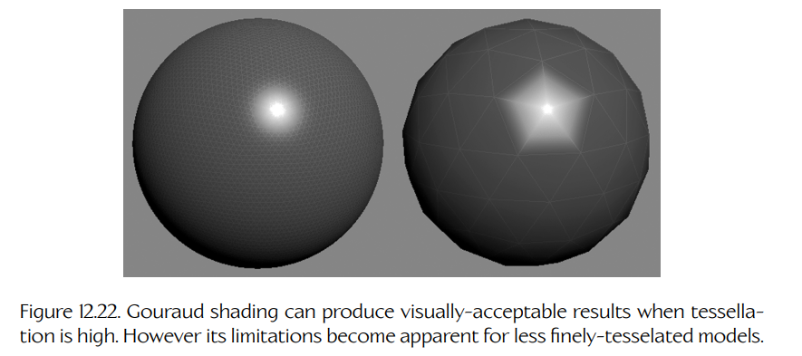
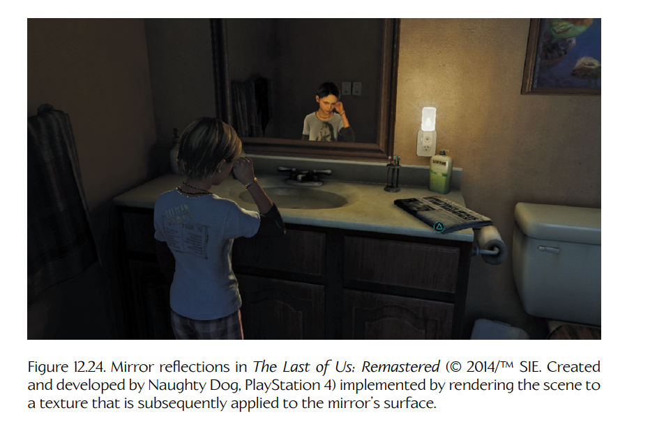
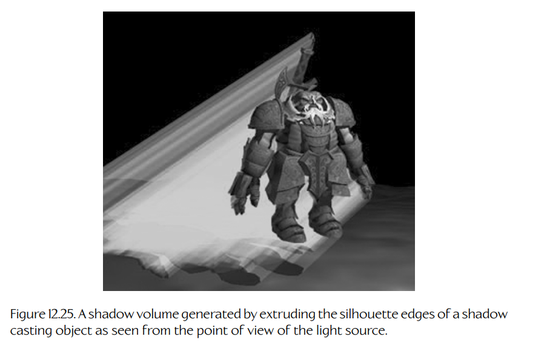
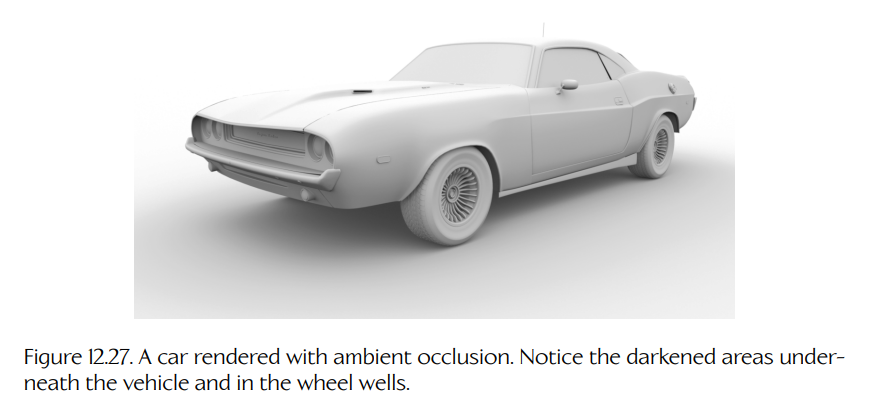
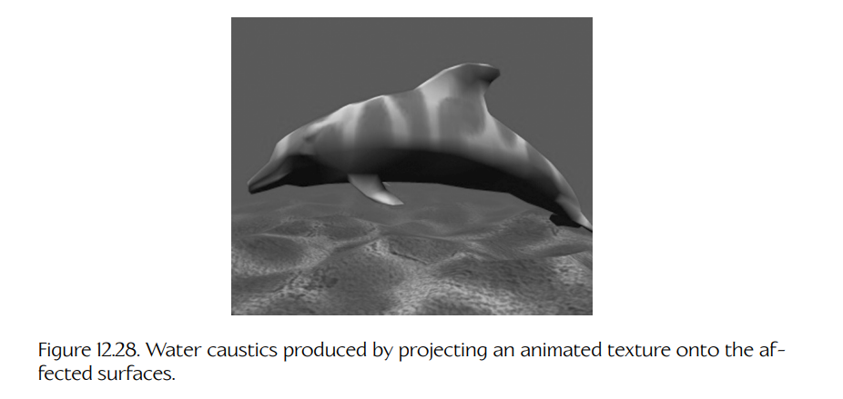

## 12.5 使用三角形光栅化计算光照

现在我们已经理解了 BRDF、渲染方程，以及它的简化版本——**着色方程**（shading equation）的基本原理，就可以开始讨论在渲染场景的过程中计算光照的实际问题了。正如 Section 11.1.2 所讨论的，渲染引擎根据其解决光照问题的方式，大致可以分为三类：基于辐射度的引擎、光线/路径追踪器，以及基于光栅化的引擎。

大多数实时 3D 渲染引擎都是**基于光栅化**（rasterization-based）的引擎。这意味着它们使用带深度缓冲的三角形光栅化来解决可见性问题。这类引擎通常使用运行在 GPU 上的流水线式图形架构，并通过 DirectX、OpenGL、Vulkan 或 Metal 等标准化图形 API 进行控制。

理论上，即使是基于光栅化的引擎，也可以通过投射光线或追踪光路来计算光照，就像基于光线追踪的引擎那样。但光线追踪是一种昂贵操作，难以并行化，而且对缓存并不友好。因此，大多数基于光栅化的引擎会把自己限制在不需要投射光线、可以在像素着色器中完成的光照计算上。不过，随着 GPU 加速光线追踪的出现，一些基于光栅化的引擎现在会把光线投射与传统像素着色器光照结合使用；这类引擎有时被称为**混合引擎**（hybrid engines）。

在本节中，我们将讨论基于光栅化的引擎通常执行光照计算的各种方式。在 Section 12.6 中，我们将转向使用随机光线追踪和路径追踪来求解光照问题。

### 12.5.1 简单局部光照

为场景打光最简单、成本最低的方式，就是利用**着色方程**。回忆一下，着色方程对我们施加了两个约束：第一个约束是，光源必须是理想化点光源或方向光源（不允许使用面积光源）；第二个约束是，间接光照无法以物理正确的方式考虑。间接光照只能通过着色方程中的一个常量环境光项进行粗略近似。应用着色方程时，我们通常还会做出另一个假设：场景中的所有空白空间都填充着真空或洁净空气。换句话说，在多数情况下，我们会忽略场景中**参与介质**（participating media）的影响。（透明物体、烟雾以及其他参与介质通常会使用 alpha 混合、基于卡片的粒子效果等各种“技巧”来渲染，而不是以物理真实的方式计算光照。）

Blinn-Phong 形式的着色方程已经在 Equation (12.30) 中给出，这里为了便于参考再次列出：

$$
\mathbf{L}_v(\mathbf{v}) =
\mathbf{L}_{v,amb} +
\sum_{k=1}^{n}
\left(
\mathbf{C}'_{diff}
+
\mathbf{C}'_{spec}(\mathbf{n} \cdot \mathbf{h}_k)^\alpha
\right)
\mathbf{E}_{v,k}
(\mathbf{n} \cdot \ell_k)^+.
$$



**Figure 12.22.** 当细分程度较高时，Gouraud 着色可以产生视觉上可接受的结果。然而，对于细分不够精细的模型，它的局限性会变得明显。

着色方程可以应用于场景中任意一个对虚拟摄像机**直接可见**的表面点 $\mathbf{x}$。今天的大多数游戏引擎都会在像素着色器中应用该方程，从而保证输出图像中的每个像素都能被正确照亮。

较早期的引擎会通过“偷工减料”来节省开销：它们只在网格三角形的**顶点**处计算光照。每个三角形内部像素的颜色，则是在光栅化过程中通过在三角形表面上插值顶点颜色属性得到的。这种基于插值的光照技术称为 **Gouraud 着色**（Gouraud shading）。如果网格被高度细分，那么逐顶点光照结合 Gouraud 着色可以产生相当不错的效果。然而，当三角形较大时，对着色方程结果进行线性插值的缺点会变得非常刺眼，如 Figure 12.22 所示。

最早期的 3D 渲染引擎甚至负担不起逐顶点光照，只能为场景中的每个**三角形**执行一次非常简单的光照计算——这种计算完全忽略镜面反射，而且通常只考虑单个光源。这种技术称为**平面着色**（flat shading），其结果是每个三角形都用单一颜色绘制，如 Figure 12.23 所示。平面着色可以产生图像，让观众大致感知三维形体；有时也会有意用它来让物体呈现计算机渲染感，但除此之外，在今天的游戏引擎中已经不太常用。

![Figure 12.23. Flat shading computes lighting once per triangle and fills the entire triangle with the resulting color. In this render, lighting is actually computed once per rectangular quad, each of which is comprised of two coplanar triangles. Source: [272]](../../assets/images/volume-02/chapter-12/figure-12-23-flat-shading-once-per-triangle.png)

**Figure 12.23.** 平面着色为每个三角形只计算一次光照，并用所得颜色填充整个三角形。在该渲染图中，光照实际上是按每个矩形四边形计算一次，而每个四边形由两个共面的三角形组成。来源：[272]。

#### 12.5.1.1 着色方程如何产生像素颜色

着色方程说明，从表面点 $\mathbf{x}$ 沿方向 $\mathbf{v}$ 反射出的亮度 $\mathbf{L}_v$，只是一个近似环境光项与来自 $n$ 个光源的反射亮度之和。在这种语境中，视线向量 $\mathbf{v}$ 通常被取为指向摄像机焦点，不过着色方程也可以告诉我们 $\mathbf{x}$ 会向任意给定方向反射多少光。

来自第 $k$ 个光源的反射亮度，是通过将该光源的入射照度 $\mathbf{E}_{v,k}$（也就是通常所说的光源“颜色”）乘以一个 BRDF 得到的。这个 BRDF 由漫反射和镜面反射项组成，也就是通常所说的表面漫反射“颜色”和镜面反射“颜色”。此外，我们还必须对每个光源乘以余弦项 $(\mathbf{n} \cdot \ell_k)^+$。（上标 $+$ 提醒我们使用**饱和**操作，将任何负的点积钳制为零。这样做是合适的，因为我们希望忽略那些指向表面内部而不是离开表面的方向向量。）

由于我们只在与摄像机焦点存在直接视线的表面点处应用着色方程，并且忽略参与介质，因此点 $\mathbf{x}$ 处的出射亮度 $\mathbf{L}_v(\mathbf{v})$ 恰好等于会入射到虚拟摄像机某个光传感器上的亮度。这意味着，$\mathbf{L}_v(\mathbf{v})$ 可以直接用作那个与表面点 $\mathbf{x}$ 存在直接视线的像素颜色。

#### 12.5.1.2 应用着色方程时的实际问题

应用着色方程时，我们假设表面法线 $\mathbf{n}$、表面的漫反射率和镜面反射率（分别为 $\mathbf{C}'_{diff}$ 和 $\mathbf{C}'_{spec}$），以及表面材质的镜面指数 $\alpha$ 都是已知的。在实践中，漫反射率通常通过采样纹理贴图来确定。由于我们读取的是漫反射颜色，这类纹理贴图在技术上称为**漫反射贴图**（diffuse map），也称为**反照率贴图**（albedo map）。

镜面反射率可以在网格顶点处指定，并在光栅化过程中跨三角形插值；也可以通过采样另一种称为**镜面指数贴图**（specular power map）的纹理来确定。镜面指数通常作为表面材质描述的一部分来指定。

点 $\mathbf{x}$ 处的法线向量可以定义为该点所在三角形的面法线，也可以通过插值顶点法线来确定，还可以通过采样**法线贴图**（normal map）纹理得到。

视线方向向量 $\mathbf{v}$ 可以通过将摄像机焦点与表面点 $\mathbf{x}$ 之间的差向量归一化来轻松计算。同样，光照方向向量 $\ell_k$ 可以通过将每个光源位置 $\mathbf{y}_k$ 与表面点 $\mathbf{x}$ 之间的差向量归一化来计算。一旦这些向量已知，我们就可以通过平均法线向量与光照方向向量来计算半程向量 $\mathbf{h}_k$。具体来说，只需把两个向量相加，然后对结果归一化即可。

#### 12.5.1.3 Blinn-Phong 光照的像素着色器示例

下面是一个像素着色器示例，它应用我们已经讨论过的概念，计算一个由单个方向“太阳光”和多个点光源照亮的像素颜色。首先，我们定义一些由引擎传递给着色器的常量：

```hlsl
SamplerState DefaultSampler : register(s0);
Texture2D DiffuseTexture : register(t0);

struct PointLight
{
    float3 lightColor;
    float3 position;
    float innerRadius;
    float outerRadius;
    bool isEnabled;
};

cbuffer PerCameraConstants : register(b0)
{
    float4x4 c_viewProj;
    float3 c_cameraPosition;
};

cbuffer MaterialConstants : register(b2)
{
    float3 c_materialColorDiff;
    float3 c_materialColorSpec;
    float c_specularPower;
};

cbuffer LightingConstants : register(b3)
{
    float4 c_ambientColor;
    float3 c_sunColor;
    float3 c_sunDirection;
    PointLight c_pointLight[MAX_POINT_LIGHTS];
};
```

接下来，我们定义一个 HLSL 函数，用于在任意表面点处计算 Blinn-Phong 着色方程：

```hlsl
float4 BlinnPhong(float3 surfacePoint, float3 surfaceNormal)
{
    float3 toCameraDir
        = normalize(c_cameraPosition - surfacePoint);

    // Ambient lighting
    float4 luminance
        = c_ambientColor
        * float4(c_materialColorDiff, 1.0f);

    // Sunlight (a directional light)
    {
        float3 toSunDir = -c_sunDirection;
        float3 halfDir = normalize(toCameraDir + toSunDir);

        // diffuse term
        float diffuseMagnitude
            = saturate(dot(toSunDir, surfaceNormal));
        float3 diffuseLuminance
            = c_materialColorDiff
            * c_sunColor
            * diffuseMagnitude;
        luminance += float4(diffuseLuminance, 1.0f);

        // specular term
        float nDotH = dot(surfaceNormal, halfDir);
        float specularMagnitude
            = saturate(pow(nDotH, c_specularPower));
        float3 specularLuminance
            = c_materialColorSpec
            * c_sunColor
            * specularMagnitude;
        luminance += float4(specularLuminance, 1.0f);
    }

    // Point lights
    for (int i = 0; i < MAX_POINT_LIGHTS; i++)
    {
        if (c_pointLight[i].isEnabled)
        {
            float3 toLight
                = c_pointLight[i].position - surfacePoint;
            float3 toLightDir = normalize(toLight);
            float3 halfDir = normalize(toCameraDir + toLightDir);

            float distMagnitude = smoothstep(
                c_pointLight[i].outerRadius,
                c_pointLight[i].innerRadius,
                length(toLight));

            // diffuse term
            float diffuseMagnitude
                = saturate(dot(toLightDir, surfaceNormal));
            float3 diffuseLuminance
                = c_materialColorDiff
                * c_pointLight[i].lightColor
                * diffuseMagnitude
                * distMagnitude;
            luminance += float4(diffuseLuminance, 1.0f);

            // specular term
            float nDotH = dot(surfaceNormal, halfDir);
            float specularMagnitude
                = saturate(pow(nDotH, c_specularPower));

            float3 specularLuminance
                = c_materialColorSpec
                * c_pointLight[i].lightColor
                * specularMagnitude
                * distMagnitude;
            luminance += float4(specularLuminance, 1.0f);
        }
    }

    return float4(luminance.xyz, 1.0f);
}
```

最后，我们可以在像素着色器中使用这个 Blinn-Phong 函数：

```hlsl
float4 PixelShaderBlinnPhong(VOut pIn) : SV_TARGET
{
    // renomalize the normal (due to interpolation)
    pIn.normal = normalize(pIn.normal);

    float4 lightingColor
        = BlinnPhong(pIn.position, pIn.normal);
    float4 textureColor
        = DiffuseTexture.Sample(DefaultSampler,
                                pIn.uv);

    return textureColor * pIn.color * lightingColor;
}
```

### 12.5.2 基于图像的光照

简单应用着色方程可以得到相当真实的场景。但这是一种**局部光照模型**（local illumination model），因此它本身无法产生照片级真实结果。基于光栅化的渲染引擎会使用大量技术，试图至少考虑场景中的一部分间接光照，并接近真正的全局光照模型。其中一些技术大量使用预计算和/或动态生成的图像数据，通常以二维纹理贴图的形式存在。这些技术称为**基于图像的光照**（image-based lighting）算法。

#### 12.5.2.1 环境映射

**环境贴图**（environment map）看起来像是一张从场景中某个物体视角拍摄的环境全景照片，覆盖水平方向完整 360 度，并覆盖垂直方向 180 度或 360 度。环境贴图可以看作对物体周围整体光照环境的描述。它通常用于以较低成本建模反射和间接光照。

最常见的两种格式是**球面环境贴图**（spherical environment maps）和**立方体环境贴图**（cubic environment maps）。球面贴图看起来像是用鱼眼镜头拍摄的照片，并且在处理时仿佛它被映射到一个以被渲染物体为中心、半径无限大的球体内侧。球面贴图的问题在于，它使用球坐标寻址。在赤道附近，水平和垂直方向都有充足分辨率。然而，当垂直（方位）角接近竖直方向时，纹理沿水平（天顶）轴的分辨率会下降到单个 texel。立方体贴图就是为避免这个问题而设计的。

立方体贴图看起来像是由六个主方向（上、下、左、右、前、后）拍摄的照片拼接而成的合成照片。在渲染过程中，立方体贴图会被当作映射到一个位于无限远、以被渲染物体为中心的盒子的六个内表面上。

为了读取物体表面某点 $\mathbf{P}$ 对应的环境贴图 texel，我们从摄像机向点 $\mathbf{P}$ 发出一条射线，并围绕点 $\mathbf{P}$ 处的表面法线反射它。反射射线会被跟随，直到它与环境贴图的球体或立方体相交。这个交点处的 texel 值会在为点 $\mathbf{P}$ 着色时使用。

### 12.5.3 静态光照与烘焙

最快的光照计算，就是根本不做光照计算。因此，只要可能，光照就会离线完成。我们可以在网格顶点处预计算 Phong 反射，并把结果存储为漫反射顶点颜色属性。也可以逐像素预计算光照，并把结果存储在一种称为**光照贴图**（light map）的纹理贴图中。运行时，光照贴图纹理会被投射到场景中的物体上，以确定光照对这些物体的影响。

你可能会疑惑：为什么不直接把光照信息烘焙进场景中的漫反射纹理呢？这里有几个原因。首先，漫反射纹理贴图通常会在整个场景中被平铺和/或重复使用，因此把光照烘焙进去并不实用。其次，场景中的每个光源通常都会生成一张单独的光照贴图；这让我们只需要把相关光照贴图应用到每一块被渲染的几何体上。保持光照贴图相互分离，也意味着光照贴图可以使用不同于漫反射纹理贴图的分辨率，而且通常更低。最后，“纯粹的”光照贴图通常比包含漫反射颜色信息的贴图更容易压缩。

### 12.5.4 动态光照与光照探针

光照贴图存储的是场景表面上的预计算光照信息。由于它们离线计算，光照贴图可以在运行时以很低成本实现高质量光照。然而，光照贴图无法编码场景中实体物体之间空白空间里的光照信息。这意味着光照贴图只能应用到静态物体上，例如地形、建筑物或其他不可移动物体。动态物体的光照必须用另一种方式处理。

当然，我们可以对静态几何体使用光照贴图，然后在运行时对动态物体执行一个大幅简化版本的光照计算。但这可能导致动态物体无法很好地融入场景——观察者通常能看出移动物体上的光照与背景光照不匹配。理想情况下，我们希望有一种方式，把用于静态几何体的同样高质量光照也应用到动态物体上。

**光照探针**（light probes）是这个问题的一种可能解决方案。在这种方法中，我们会在场景空白空间中的一组网格点上执行昂贵的高质量离线光照计算。运行时，我们可以从每个动态物体附近的少量探针中查找光照信息，从而兼得两方面优点——以较低运行时成本获得较高质量光照。

光照探针的一个问题是，它们有时会产生不合理结果。例如，物体可能会从一个位于封闭门另一侧的光照探针接收到光线。为了解决这个问题，必须额外判断从每个动态物体的视角来看哪些探针是“可见的”。关于光照探针的更多信息，可参见 [273]。

### 12.5.5 反射

当光从高度镜面反射（光亮）的表面反弹，并在该表面中产生场景另一部分的图像时，就会出现反射。在围绕光线追踪构建的引擎中，反射会从模拟中“免费”得到。在基于光栅化的引擎中，反射可以通过多种方式实现。环境贴图用于在光亮物体表面上产生周围环境的一般反射。镜子等平面上的直接反射，可以通过把摄像机位置关于反射平面进行镜像，然后从该反射视角将场景渲染到一张纹理中来实现。随后，这张纹理会在第二个 pass 中应用到反射表面上（见 Figure 12.24）。



**Figure 12.24.** 《The Last of Us: Remastered》（© 2014/™ SIE，由 Naughty Dog 开发，PlayStation 4）中的镜面反射，通过先将场景渲染到纹理中，再把该纹理应用到镜面表面来实现。

### 12.5.6 阴影

当一个表面阻挡了光的路径时，就会产生**阴影**。理想点光源产生的阴影会很锐利，但在真实世界中，阴影边缘是模糊的；这称为**半影**（penumbra）。半影之所以产生，是因为真实光源具有一定面积，因此会产生以不同角度掠过物体边缘的光线。

最常见的两种阴影渲染技术是**阴影体**（shadow volumes）和**阴影贴图**（shadow maps）。下面将简要介绍二者。在这两种技术中，场景中的物体通常会被分为三类：投射阴影的物体、接收阴影的物体，以及在渲染阴影时完全被排除在考虑之外的物体。同样，光源也会被标记，以指示它们是否应该生成阴影。这一重要优化会限制需要处理的光源-物体组合数量，从而生成场景中的阴影。

#### 阴影体

在阴影体技术中，每个阴影投射物都会从产生阴影的光源视角观察，并识别出该投射物的**轮廓边**（silhouette edges）。这些边会沿着从光源发出的光线方向被挤出。结果会形成一块新的几何体，用于描述被该阴影投射物遮蔽的空间体积。如 Figure 12.25 所示。



**Figure 12.25.** 从光源视角观察阴影投射物，并沿其轮廓边挤出后生成的阴影体。

阴影体通过使用一种特殊的全屏缓冲区来生成阴影，这种缓冲区称为**模板缓冲区**（stencil buffer）。该缓冲区为屏幕上的每个像素存储一个整数值。渲染可以根据模板缓冲区中的值进行遮罩——例如，我们可以配置 GPU，使其只渲染对应模板值非零的片元。此外，也可以配置 GPU，让被渲染的几何体以各种有用方式更新模板缓冲区中的值。

为了渲染阴影，首先会绘制一次场景，在帧缓冲中生成无阴影图像，同时生成准确的 z-buffer。随后清空模板缓冲区，使每个像素都包含零。接着，从摄像机视角渲染每个阴影体，并使正面三角形将模板缓冲区中的值加一，背面三角形将其减一。在屏幕上阴影体完全没有出现的区域，模板缓冲区像素当然仍为零。在阴影体正面和背面都可见的位置，模板缓冲区中也会保留零，因为正面会使模板值加一，而背面又会使其减一。在阴影体背面被“真实”场景几何体遮挡的区域，模板值会变成一。这告诉我们屏幕上哪些像素处在阴影中。因此，我们可以在第三个 pass 中渲染阴影，只需把那些模板缓冲区值非零的屏幕区域变暗即可。

#### 阴影贴图

阴影贴图技术本质上是从光源视角而非摄像机视角执行的逐片元深度测试。场景分两步渲染：首先，从光源视角渲染场景，并把深度缓冲区内容保存下来，从而生成一张**阴影贴图**（shadow map）纹理。其次，正常渲染场景，并使用阴影贴图判断每个片元是否处于阴影中。对于场景中的每个片元，阴影贴图会告诉我们光线是否被某个更接近光源的几何体遮挡；这与 z-buffer 告诉我们某个片元是否被更接近摄像机的三角形遮挡的方式完全相同。

阴影贴图只包含深度信息——每个 texel 记录它距离光源有多远。因此，阴影贴图通常使用硬件的双速 z-only 模式来渲染（因为我们关心的只有深度信息）。对于点光源，渲染阴影贴图时使用透视投影；对于方向光源，则使用正交投影。

为了使用阴影贴图渲染场景，我们像往常一样从摄像机视角绘制场景。对于每个三角形的每个顶点，我们会计算其在**光源空间**（light space）中的位置，也就是第一步生成阴影贴图时所使用的同一个“视图空间”。这些光源空间坐标可以像其他顶点属性一样在三角形上插值。这样即可得到每个片元在光源空间中的位置。为了判断某个片元是否处于阴影中，我们将该片元的光源空间 $(x, y)$ 坐标转换为阴影贴图中的纹理坐标 $(u, v)$。然后，把片元的光源空间 z 坐标与阴影深度贴图中对应 texel 存储的深度进行比较。如果片元的光源空间 z 值比阴影贴图中的 texel 更远离光源，那么它必然被某个更接近光源的几何体遮挡，因此处于阴影中。相反，如果片元的光源空间 z 值比阴影贴图中的 texel 更接近光源，那么它没有被遮挡，也就不在阴影中。根据这些信息，可以相应调整片元颜色。阴影贴图流程如 Figure 12.26 所示。


**Figure 12.26.** 最左图是一张阴影贴图，即从某个特定光源视角渲染得到的 z-buffer 内容。中间图中，光源空间深度测试失败的位置为黑色（片元处于阴影中），测试成功的位置为白色（片元不在阴影中）。最右图展示了最终带阴影渲染的场景。

### 12.5.7 环境光遮蔽

**环境光遮蔽**（ambient occlusion）是一种用于建模**接触阴影**（contact shadows）的技术，即场景只由环境光照亮时产生的柔和阴影。实际上，环境光遮蔽描述的是表面上每个点从整体上看对光有多“可达”。例如，一段管道的内部比外部更不容易接收到环境光。如果这段管道被放在阴天的室外，它的内部通常会比外部更暗。

Figure 12.27 展示了环境光遮蔽如何在汽车下方、轮拱内部以及车身面板之间的缝隙处产生阴影。环境光遮蔽是在表面上的某个点处测量的：以该点为中心构造一个半径非常大的半球，并判断从该点出发有多少比例的半球面积是可见的。对于静态物体，它可以离线预计算，因为环境光遮蔽与观察方向和入射光方向无关。它通常存储在纹理贴图中，该贴图记录表面上每个 texel 的环境光遮蔽程度。



**Figure 12.27.** 使用环境光遮蔽渲染的汽车。注意车底和轮拱内部变暗的区域。

环境光遮蔽也可以作为后处理效果实时计算。在这种情况下，该技术称为**屏幕空间环境光遮蔽**（screen space ambient occlusion, SSAO）。在这种方法中，场景首先在不考虑环境光遮蔽的情况下被渲染出来。然后绘制一个全屏四边形，以便在最终渲染图像的每个像素上调用像素着色器。对于每个像素，SSAO 着色器会读取该像素自身以及邻近像素的深度和表面法线（通过读取深度缓冲和 G-buffer，见 Section 12.5.12），并用这些信息近似计算该像素被遮蔽的程度。随后，遮蔽因子会被用来把像素适当变暗。该技术的暴力实现需要比较数百个相邻像素的深度，但通过随机采样数量更少的邻近像素，可以降低开销。通常会预先生成一个 $N \times N$ 的采样核，并在每个像素处随机旋转该采样核，以高效地对邻近深度和法线进行随机采样。SSAO 可以产生视觉上可信的结果，但它当然只是对真实 AO 的近似，而且容易产生 banding 等伪影。关于 SSAO 的更多信息，可参见 [274] 和 [275]。

### 12.5.8 焦散

**焦散**（caustics）是由水或抛光金属等非常光亮表面的强烈反射或折射产生的明亮镜面高光。当反射表面移动时，例如水面，焦散效果会在其落到的表面上闪烁并“游动”。可以通过把一张包含半随机明亮高光的（可能是动画的）纹理投射到受影响表面上来生成焦散效果。Figure 12.28 展示了这种技术的一个例子。



**Figure 12.28.** 通过将动画纹理投射到受影响表面上产生的水面焦散。

### 12.5.9 次表面散射

当光从表面的一个点进入，在表面下方发生散射，然后从表面上的另一个点重新射出时，我们称这种现象为**次表面散射**（subsurface scattering）。这种现象会产生人类皮肤、蜡和大理石雕像等材质的“温暖光泽”（例如 Figure 12.29）。次表面散射由 BRDF 的一种更高级变体（见 Section 12.4.3.4）描述，称为 BSSRDF（bidirectional surface scattering reflectance distribution function，**双向表面散射反射分布函数**）。


**Figure 12.29.** 左图是不使用次表面散射渲染的龙（即使用 BRDF 光照模型）；右图是使用次表面散射渲染的同一条龙（即使用 BSSRDF 模型）。图像由弗吉尼亚大学 Rui Wang 渲染。

次表面散射可以用多种方式模拟。基于深度图的次表面散射会渲染一张阴影贴图（见 Section 12.5.6），但它不是用来判断哪些像素处于阴影中，而是用来测量一束光要穿过遮挡物体到达另一侧需要走多远。随后，物体的阴影侧会被赋予一个人为的漫反射光照项，其强度与光线为了从物体另一侧射出而经过的距离成反比。这会使物体在光源相反的一侧显得略微发光，但只会在物体相对较薄的位置出现。关于次表面散射技术的更多信息，可参见 [276]。

### 12.5.10 自发光物体

场景中的某些表面本身就是光源。例如手电筒、发光水晶球、火箭发动机喷出的火焰等。发光表面可以使用**自发光纹理贴图**（emissive texture map）来建模——这种纹理的颜色始终处于满强度，不受周围光照环境影响。这样的纹理可用于定义霓虹灯招牌、汽车前灯等。

有些自发光物体需要结合多种技术来渲染。例如，一个手电筒可以这样渲染：当你正对光束观察时，使用自发光纹理；使用一个共置的聚光灯向场景中投射光线；用一个黄色半透明网格模拟光锥；用一些始终面向摄像机的透明卡片模拟镜头光晕（如果引擎支持 HDR 光照，也可以使用 bloom 效果）；再用投射纹理生成手电筒照亮表面时产生的焦散效果。《Luigi’s Mansion》中的手电筒就是这种效果组合的优秀示例，如 Figure 12.30 所示。


**Figure 12.30.** 任天堂 Wii 游戏《Luigi’s Mansion》中的手电筒由大量视觉效果组成，包括用于光束的半透明几何锥体、向场景投射光线的动态聚光灯、镜头上的自发光纹理，以及用于镜头光晕的面向摄像机卡片。

### 12.5.11 预计算辐射传输

为了渲染照片级真实场景，我们希望在逐像素光照计算中使用更高级的 BRDF。然而，大多数这类反射模型在运行时使用成本过高，且/或需要一些信息，而这些信息在没有光线追踪的基于光栅化的引擎中并不容易获得。**预计算辐射传输**（precomputed radiance transfer, PRT）是一种尝试解决这个问题的技术。

我们在 Section 12.3.2 中学到，给定来自所有可能入射方向的辐照度（或照度）信息，BRDF 可用于求出某个表面点沿特定方向出射的辐射亮度（或亮度）。PRT 背后的思路是：离线计算所需 BRDF，并把结果存储成一种可在光栅化期间使用的格式。

一般来说，BRDF 是定义在以该点为中心的半球上的复杂函数。为了让 PRT 技术在实践中可行，需要用紧凑表示来表示这个函数。常见做法是把出射亮度（辐射亮度的光度学对应量）存储为若干入射照度的线性组合，并用某种高效格式编码，例如一系列球谐函数或小波。这本质上相当于把一个简单标量函数 $f(x)$ 编码为平移和缩放正弦波的线性组合的三维版本。

PRT 的细节远远超出本书范围。更多信息可参见 [277]。DirectX SDK 中提供了一个展示 PRT 光照技术的 DirectX 示例程序，更多细节可参见 [278]。

### 12.5.12 延迟渲染

在传统的基于三角形光栅化的渲染中，也称为**前向渲染**（forward rendering），所有光照和着色计算都会在世界空间、视图空间或切线空间中的三角形片元上执行。这种技术的问题在于它本质上效率不高。首先，我们可能会做很多不必要的工作。我们对三角形顶点进行着色，却只在光栅化阶段发现整个三角形都被 z-test 深度剔除了。早期 z-test 有助于消除不必要的像素着色器求值，但这仍然不完美。更进一步，为了处理包含大量光源的复杂场景，我们最终会产生大量不同版本的顶点着色器和像素着色器——这些版本用于处理不同数量的光源、不同类型的光源、不同数量的蒙皮权重等。

#### 12.5.12.1 G-buffer

**延迟渲染**（deferred rendering）是一种替代着色场景的方式，可以解决上述许多问题。在延迟渲染中，大多数光照计算在屏幕空间而不是视图空间中完成。我们会高效渲染场景，而不必担心光照。在这个阶段中，我们把之后照亮像素所需的全部信息存储到一个“深”帧缓冲中，这个缓冲称为 **G-buffer** 或 **geometry buffer**。一旦场景被完整渲染出来，我们就利用 G-buffer 中的信息执行光照和着色计算。这通常比视图空间光照高效得多，可以避免着色器变体的膨胀，并且能相对容易地渲染一些非常令人满意的效果。

G-buffer 在物理上可以实现为一组缓冲区，但从概念上看，它是一个单一帧缓冲，其中每个屏幕像素都存储了关于场景中物体的光照和表面属性的一组丰富信息。典型 G-buffer 可能包含以下逐像素属性：深度、视图空间或世界空间中的表面法线、漫反射颜色、镜面指数，甚至预计算辐射传输（PRT）系数。来自 Guerrilla Games 的《Killzone 2》截图序列（Figure 12.31）展示了 G-buffer 的一些典型组成部分。

关于延迟渲染的深入讨论超出了本书范围，但 Guerrilla Games 的团队曾就该主题准备过一份优秀演示，可见 [279]。


**Figure 12.31.** Guerrilla Games 的《Killzone 2》截图，展示了延迟渲染中使用的 G-buffer 的一些典型组成部分。上方图像是最终渲染图。下方从左上开始顺时针依次为：反照率（漫反射）颜色、深度、视图空间法线、屏幕空间 2D 运动向量（用于运动模糊）、镜面指数和镜面强度。

#### 12.5.12.2 可见性缓冲

G-buffer 思路的一种变体是使用一种称为**三角形可见性缓冲**（triangle visibility buffer）的帧缓冲图像平面，用于存储原始场景几何体中的哪个三角形贡献了每个光栅化像素的信息。该信息可以在屏幕空间光照计算期间使用，从而为每个被渲染三角形查找丰富的材质描述。可见性缓冲形式的延迟渲染往往更加节省内存，尤其适合高分辨率显示模式。关于可见性缓冲的更多信息，可参见 Wolfgang Engel 关于该主题的论文：[280]。

#### 12.5.12.3 光照预处理 Pass

使用 G-buffer 方法时，场景会先渲染一次，以构建存储在 G-buffer 中的丰富材质数据集；随后，对于每个光源，我们处理光照并把结果累积到最终帧缓冲中。**光照预处理**（light pre-pass）技术则分三个阶段运行：首先绘制场景几何体，并把最少的信息逐像素存储到一个更小版本的 G-buffer 中。（通常在这个 pass 中只存储深度、法线和镜面指数。）接着，像之前一样处理每个光源，但把光照计算结果存储到离屏渲染目标中。最后，再次渲染几何体，使用前向渲染风格，但从离屏渲染目标中查找光照信息。光照预处理方法有时会被选择，因为它需要的内存带宽更低（由于 G-buffer 小得多），而且更容易支持大量不同材质。不过，它需要两次绘制 pass 而不是一次，在顶点数量很大的场景中可能代价过高。关于光照预处理技术的更多信息，可参见 Insomniac 在 GDC 2009 上的演讲 “Pre-lighting in Resistance 2”，见 [281]。关于传统 G-buffer 技术与光照预处理的比较，可参见 [282]。

#### 12.5.12.4 Forward+

在前向渲染中，一组光源列表会被传递给图形流水线。每个光源通常由一个球形或锥形体积包围，在该体积之外，光照强度已经衰减到足够低，可以被忽略。然而，为了照亮每个光栅化片元，我们仍然必须遍历场景中的所有光源，只为了判断哪些光源会影响当前片元。我们可以先剔除那些影响体积完全不与视锥体相交的光源，从而稍微优化这一过程。不过，在渲染每个片元时，我们仍然必须遍历一个潜在很大的光源列表。

**Forward+** 技术（也称为**分块渲染**，tiled rendering，或**聚簇前向渲染**，clustered forward rendering）通过把屏幕划分为规则网格来解决这个问题。每个网格单元都会预先测试哪些光源会影响它，并把结果存储到一个二维缓冲中，该缓冲的尺寸与规则网格匹配。在前向渲染过程中，像素着色器可以检查当前片元位于哪个网格单元内。然后，它只需要遍历会影响该网格单元的那些光源，从而大幅降低测试不可能影响片元颜色的光源所带来的开销。这项技术允许场景高效渲染几乎无限数量的光源。关于 Forward+ 光照技术的更多信息，可参见 [283]。

### 12.5.13 天空、云和体积效果

游戏世界中的天空需要包含丰富细节，但从技术上讲，它距离摄像机极其遥远。因此，我们无法按照它真实存在的方式对其建模，而必须转向各种专门的渲染技术。

一种简单方法是在渲染任何 3D 几何体之前，先用天空纹理填充帧缓冲。天空纹理应以大约 1:1 的 texel-to-pixel 比例渲染，使其分辨率大致或完全等于屏幕分辨率。天空纹理可以旋转和滚动，以对应游戏中摄像机的运动。在渲染天空时，我们需要确保把帧缓冲中所有像素的深度都设置为最大可能深度值。这保证了 3D 场景元素总会排序到天空之上。街机游戏《Hydro Thunder》正是以这种方式渲染天空的。

在现代游戏平台上，由于像素着色成本可能很高，天空渲染通常会在场景其余部分渲染完成之后执行。首先，将 z-buffer 清除为最大 z 值。然后渲染场景。最后渲染天空，并启用 z-test，关闭 z 写入，同时使用比最大值小一的 z-test 值。这样会使天空只在未被地形、建筑和树木等更近物体遮挡的位置绘制。最后绘制天空可以确保天空像素着色器只在尽可能少的屏幕像素上运行。

对于玩家可以朝任意方向看的游戏，我们可以使用**天空穹顶**（sky dome）或**天空盒**（sky box）。穹顶或盒子会以摄像机当前位置为中心进行渲染，因此无论摄像机在游戏世界中移动到哪里，它都看起来位于无穷远处。与天空纹理方法一样，天空盒或天空穹顶会在任何其他 3D 几何体之前渲染，并且在渲染天空时，帧缓冲中所有像素都会被设置为最大 z 值。这意味着穹顶或盒子相对于场景中其他物体而言实际上可以非常小。它的尺寸无关紧要，只要它在被绘制时能够填充整个帧即可。关于天空渲染的更多信息，可参见 [2, Section 10.3] 和 [49, page 253]。

#### 12.5.13.1 体积光照与光线步进

像《Horizon Zero Dawn: Forbidden West》和《Red Dead Redemption 2》这样的现代开放世界游戏，只会把天空盒用于星星和月亮等地外物体，以及远处的稀薄云层。大气和低层云通常会以**体积方式**（volumetrically）渲染，然后再与天空盒和场景其余部分合成。体积渲染对于在一天中不同时间程序化生成视觉上准确的天空尤其有用，因为输入是固定的大气属性，不依赖太阳角度。三维云和动态天气条件也可以通过体积技术建模。

**体积渲染**（volumetric rendering）是一种考虑光与**参与介质**相互作用的方式。它通过一种称为**光线步进**（ray marching）的技术工作。给定一条穿过参与介质（如多云天空）的长射线，光线步进会把这条射线切分成较短的线段，并在射线上的每个中间点处计算一个采样函数。

这里需要强调的是，光线步进可以与基于光栅化的渲染结合使用，也就是在像素着色器中执行它。这可以看作迈向完全光线追踪场景渲染的“中间步骤”（我们将在 Section 12.6 中探讨这种技术）。当然，光线步进也可以用于完整随机光线追踪实现中，以考虑参与介质。

#### 12.5.13.2 体积大气

空气分子、气溶胶、云、雾、烟等大气粒子都是参与介质的例子。穿过大气并最终抵达摄像机的阳光会表现出三种行为：

1. 它可以被**吸收**（absorbed）；
2. 它可以发生**外散射**（out-scattered），这意味着一部分原本会与摄像机相交的入射光子改变方向，从而错过摄像机；
3. 它可以发生**内散射**（in-scattered），这意味着一部分原本不会撞到摄像机的光子被偏转向摄像机。

内散射和外散射共同构成了一个称为**消光**（extinction）的因素。消光之后剩余入射光与总入射光之间的比值称为**透射率**（transmittance）。我们可以把它理解为介质的 “alpha”。大气散射是**各向异性**（anisotropic）的，也就是说，它会根据观察角度的不同而表现不同。它由一个**相函数**（phase function）建模，该函数在精神上类似于我们推导渲染方程和着色方程时使用的 BRDF。

为了渲染一个直接看向天空的像素，我们会反向追踪光子的路径——从摄像机焦点出发，考虑一条穿过当前像素并继续穿过大气、朝外太空延伸的射线。如果没有内散射，这条朝向天空的射线永远不会击中任何东西，像素就会是黑色的，就像在观看没有星星的夜空一样。内散射使天空在白天呈现蓝色，并在黄昏时呈现橙色和紫色：

- 空气分子负责产生 **Rayleigh 散射**（Rayleigh scattering），它对较短波长（蓝色）的散射和吸收强于较长波长（绿色和红色）。这会导致白天蓝光在较高半球角范围内扩散，而当光线必须穿过更长大气路径时，日落在较低角度处呈现偏红色调。
- 气溶胶负责产生 **Mie 散射**（Mie scattering），它对波长的依赖较弱，并具有很强的前向散射效应，使太阳圆盘显得非常突出。Mie 散射也是云的一个性质，并且会在朝太阳方向观察云时产生所谓的银边效果。
- 臭氧负责黄昏时头顶天空的蓝色扩散。

如果只使用天空盒，我们会通过沿朝向天空的射线方向采样天空盒纹理，来确定每个天空像素的颜色。但如果要以体积方式为一个看向天空的像素计算光照，我们会把它的朝天射线划分为多个线段。在每一步中，我们都会计算内散射给最终将被该像素接收的辐射亮度增加了多少，并把这个贡献加入大气透射率中。

$$
\mathbf{C}_{final} = T\mathbf{C}_{base} + \mathbf{C}_{in}
$$

其中，$T$ 是大气的透射率，$\mathbf{C}_{base}$ 表示如果不考虑散射或透射率时像素会接收到的“基线”光照（通常从天空盒中采样），$\mathbf{C}_{in}$ 是内散射光的强度和颜色。

#### 12.5.13.3 体积云

云具有不规则形状，因此通常不会用解析方式表示。云可以通过手工制作的 2D 纹理与程序化 3D 噪声结合建模。另一种方法是使用手工制作的体素网格来建模云。随后，我们会建立某种从这些体积信息到世界空间的映射，并将其分配到云层的固定高度范围中。

云会在着色器中通过对每个屏幕像素执行光线步进来渲染，就像渲染天空时一样。这涉及从每个像素向屏幕中投射一条射线，并在射线上的每一步采样体积云模型。光线步进成本很高，因此每帧每个像素通常只能使用非常有限的采样数量。出于这个原因，通常会使用一种**时间采样**（temporal sampling）技术：跨多个帧收集样本，并把它们混合在一起，以生成最终图像。