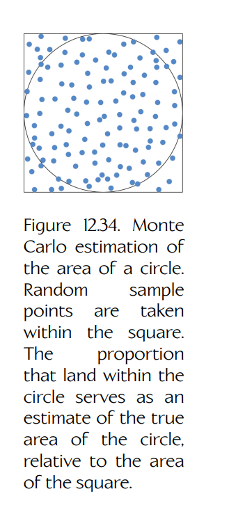
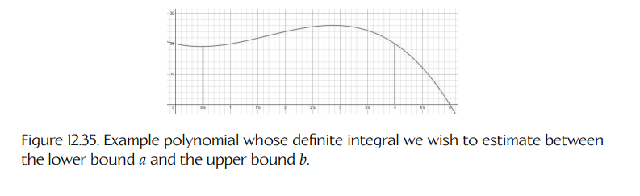
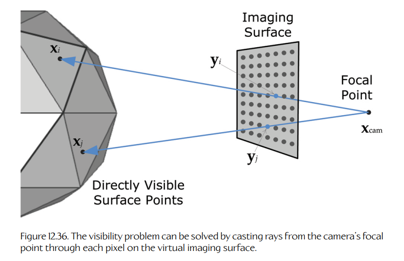
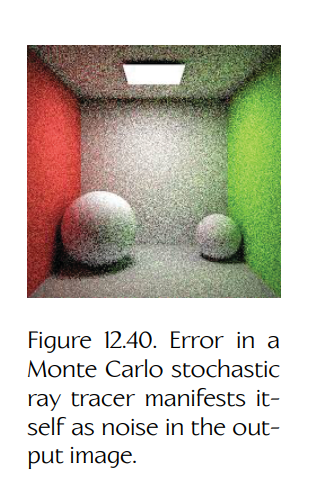

## 12.6 使用随机光线追踪计算光照

在 Section 12.4 中我们说过，渲染方程不存在闭式解；为绕开这个问题，我们做了一些简化假设，使得渲染方程中对半球的积分可以转换为对有限数量理想化光源的简单求和。然而，这些假设会严重限制我们渲染照片级真实场景的能力。若要真正求解渲染方程，就需要某种形式的**数值积分**（numerical integration，也称为 **numerical quadrature**）。已有若干算法可用于求解渲染方程中的积分。这些算法大致可以分为两类：**有限元方法**（finite element methods）和**随机方法**（stochastic methods，也称为 statistical methods）。

一般来说，**有限元方法**会把一个问题分解为由许多有限大小的小片组成的拼块；这些小片足够小，因此可以假设被积函数在每个元素上近似为常数。这样就可以把无法直接求解的积分转换为可处理的求和。在几何光学和辐射度量学的语境中，有限元方法称为**辐射度方法**（radiosity methods），因为它们会把场景中的每个表面划分为有限面积，然后求解每个表面元素上的辐射度（radiosity，即 radiant exitance）。

**随机方法**通过在积分域内的随机采样点上计算被积函数来数值求解积分，并利用概率论保证：随着样本数量增加，这些随机样本的平均值会收敛到积分的真实值。在本章中，我们将考察渲染中最常用的随机数值积分方法，即 **Monte Carlo 估计器**（Monte Carlo estimator）。当应用于几何光学和辐射度量学时，Monte Carlo 方法本质上就是在场景中投射随机射线，以估计虚拟摄像机成像表面上的光传感器会接收到的辐射亮度（或其光度学对应物：亮度）。因此，这一主题也会自然引出对基于**光线追踪**（ray tracing）的各种渲染形式的讨论。

### 12.6.1 辐射度方法

3D 渲染中的辐射度方法最初是从用于求解辐射传热问题的有限元方法中借鉴而来的。这种方法的基本思想是：将场景中的所有表面划分为大量称为**面片**（patches）的小型有限元素，从而以一种**视点无关**（view-independent）的方式求解整个场景表面上的**光照问题**。一旦每个面片的辐射度信息计算完成，就可以通过传统三角形光栅化或光线追踪技术来求解**可见性问题**，从某一特定视点生成场景图像。Figure 12.32 展示了使用理想化光源与着色方程生成的图像，和使用辐射度方法渲染的图像之间在照片级真实感上的差异。

辐射度方法基于一个假设：所有表面都是完美 Lambertian 表面，因此它们的辐射度是视点无关的。这意味着辐射度方法只能处理 $LD^*E$ 类型的光路；如 Section 12.2.1.1 所述，这是表示光路从光源（$L$）开始，经过零次或多次漫反射散射（$D^*$），最后到达眼睛（$E$）的简写。因此，仅靠辐射度方法无法模拟镜面反射或硬阴影。

这种方法特别适合静态场景和移动摄像机，因为光照可以只计算一次，然后在摄像机移动时逐帧重复使用。但是，场景几何中的任何变化，包括移动物体的出现，都需要重新计算辐射度，因此它并不适合动态场景。不过，辐射度方法在游戏行业中常常作为混合渲染方法的一部分使用。例如，**预计算辐射亮度传输**（precomputed radiance transfer，PRT，见 Section 12.5.11）会在离线阶段计算场景中离散点的光照（此时其高成本可以接受），然后在运行时使用这些预计算的辐射亮度信息。**光照贴图**（light mapping，Section 12.5.3）是另一个受辐射度方法启发的预计算光照例子。在光照贴图中，包含预计算光照结果的纹理贴图会离线生成，并被投射到场景表面上，使这些表面呈现受光照影响后的外观。

![Figure 12.32. Left: A scene rendered using manually authored idealized light sources. Right: The same scene rendered using radiosity methods, authored with only a single area light located outside the window. Source: [284].](../../assets/images/volume-02/chapter-12/figure-12-32-direct-illumination-versus-radiosity.png)

**Figure 12.32.** 左图：使用手工设置的理想化光源渲染的场景。右图：同一场景使用辐射度方法渲染，只在窗外设置了一个单一区域光源。来源：[284]。

#### 12.6.1.1 辐射度算法概览

辐射度渲染算法首先会把场景几何划分为大量小而几何形状简单的面片，如三角形或四边形。对于场景中的每一对面片，都需要确定一个**形状因子**（view factor），用来描述这两个面片之间具有无遮挡视线的程度。这些形状因子会用于一个线性方程组中，该方程组基于与渲染方程推导相同的原理建立。求解该方程组即可得到每个表面面片 $i$ 的辐射度 $B_i$。

渲染方程的面积形式由 Equation (12.16) 给出。为了方便参考，这里再次列出：

$$
L(\mathbf{x} \rightarrow \mathbf{v}) = L_e(\mathbf{x} \rightarrow \mathbf{v})
+ \int_A f_r(\mathbf{x}, \ell \rightarrow \mathbf{v})\,L(\mathbf{y} \rightarrow -\ell)\,V(\mathbf{x},\mathbf{y})\,G(\mathbf{x},\mathbf{y})\,dA_y.
$$

如果假设场景完全由 Lambertian（漫反射）表面组成，就可以把这个方程改写为辐射度形式，并将常数漫反射 BRDF 提到积分外：

$$
B(\mathbf{x}) = B_e(\mathbf{x}) + f_{\mathrm{diff}}(\mathbf{x}) \int_A V(\mathbf{x},\mathbf{y})\,G(\mathbf{x},\mathbf{y})\,B(\mathbf{y})\,dA_y,
$$

其中：

- $B(\mathbf{x})$ 是我们希望求解的面片辐射度（位于场景中的点 $\mathbf{x}$）；
- $B_e(\mathbf{x})$ 是该面片的自发光辐射度（只有当该面片恰好是自发光表面时才非零）；
- $f_{\mathrm{diff}}(\mathbf{x})$ 是表面的漫反射率，也可以用 RGB 光度学形式写作 $(\mathbf{C}_{\mathrm{diff}} / \pi)$；
- $V(\mathbf{x},\mathbf{y})G(\mathbf{x},\mathbf{y})$ 是描述位于 $\mathbf{x}$ 的面片能多好地“看到”远处位于 $\mathbf{y}$ 的面片的形状因子，通常更简洁地写作 $F_{xy}$；
- $B(\mathbf{y})$ 是远处面片 $\mathbf{y}$ 的辐射度；
- $dA_y$ 是远处面片的面积微元。

由于场景已经被划分为足够小的有限面片，使得我们可以假设辐射度在每个面片上为常数，因此积分变为求和：

$$
B_i = B_{e,i} + f_{\mathrm{diff},i} \sum_{j=1}^{n} F_{ji}B_j,
$$

其中 $i$ 和 $j$ 是面片索引。

形状因子 $F_{ji}$ 可以通过多种方式计算。一种方法是将辐射度量学中通常用于推导方程的单位半球转换为一个**单位半立方体**（unit hemicube）——也就是以相关表面元素为中心的立方体上半部分。随后，将半立方体划分为若干方形“像素”，并把远处的面片 $j$ 投影到半立方体的像素上，从而确定每个面片有多大比例对第 $i$ 个表面面片“可见”。

由于每个面片 $i$ 的辐射度都依赖于整个场景中其他所有面片 $j$ 的辐射度，这一个方程会变成一个必须求解的巨大线性方程组。它通常通过迭代求解。在**收集方法**（gathering approach）中，每次迭代都会通过从其他面片 $j$ 收集辐射度来更新某个面片 $i$ 的辐射度。这个过程是一种称为 **Gauss-Seidel 松弛法**（Gauss-Seidel relaxation）的通用方法的例子。

另一种方法是在每次迭代中计算所有面片的辐射度。这称为**发射方法**（shooting method），因为它不是从其他面片收集辐射度来更新面片 $i$，而是把面片 $i$ 的辐射度向外“发射”到所有其他面片。这种方法是一种称为 **Southwell 松弛法**（Southwell relaxation）的通用方法的例子。它很适合**渐进细化**（progressive refinement）：每次迭代后都生成一张输出图像，并且随着光路中越来越多次反弹被有效纳入考虑，图像质量也越来越高。渐进细化如 Figure 12.33 所示。

![Figure 12.33. Progressive refinement of an image generated with radiosity methods. Source: [284].](../../assets/images/volume-02/chapter-12/figure-12-33-progressive-refinement-radiosity-methods.png)

**Figure 12.33.** 使用辐射度方法生成图像时的渐进细化过程。来源：[284]。

#### 12.6.1.2 关于辐射度的延伸阅读

辐射度是一个宽广而深刻的主题。本章只是浅尝辄止。若想进一步了解辐射度，可以从网上一些简洁的介绍材料入手。若要进一步深入，可参见 [11]、[2] 和 [3]。

### 12.6.2 蒙特卡洛积分

除了渲染方程本身之外，Kajiya 对计算机图形学领域最大的贡献之一，是证明了**随机方法**可以用来近似半球积分的值。一般来说，随机积分（也称为统计积分）使用随机数来近似积分的真实值。这类技术统称为 **Monte Carlo 积分方法**（Monte Carlo integration methods），名称来源于摩纳哥的 Monte Carlo Casino。

Monte Carlo 积分可用于近似各种应用中的大量积分。具体到光照问题，Monte Carlo 积分会在半球上按随机方向发射大量射线，使用渲染方程中的被积函数计算每条射线对应的出射亮度，并用适当因子缩放每个结果，最后将它们相加。也许令人意外的是，如果这个过程执行正确，这个求和结果就会是积分真实值的良好近似。此外，由于 Monte Carlo 积分的定义方式，随着样本数量不断增加（也就是射线投射数量增加），这个和会保证收敛到积分的真实值。

#### 12.6.2.1 直观示例：估计圆的面积

为了理解其原理，我们来看一个直观例子。假设要计算半径为 $r$ 的圆的面积。我们可以在圆外画一个宽高均为 $2r$ 的正方形，并在这个正方形内随机选择 2D 点。如果统计实际落在圆内的随机点总数，并除以投射的随机点总数，就能得到圆的真实面积 $\pi r^2$ 与正方形面积 $4r^2$ 之间比值的粗略近似。这个想法如 Figure 12.34 所示。

**Figure 12.34.** 使用 Monte Carlo 方法估计圆的面积。随机采样点取自正方形内部。落在圆内的点所占比例，可以作为圆的真实面积相对于正方形面积的估计。

#### 12.6.2.2 蒙特卡洛估计器

**Monte Carlo 估计器**（Monte Carlo estimator）是一个精心构造的随机样本求和，其期望值会随着样本数量增加而收敛到积分的真实值。为了感受它是如何工作的，可以想象我们要计算如下积分：

$$
Y = \int_a^b y(x)\,dx
\tag{12.31}
$$

**Figure 12.35.** 一个示例多项式，我们希望估计它在下界 $a$ 和上界 $b$ 之间的定积分。

为了便于讨论，假设 $y(x) = -x^3 + 5x^2 - 4x + 20$，积分上下界为 $a = 0.5$ 到 $b = 4$。Equation (12.31) 中定积分的值（本例中为 80.974）就是 $x = a$ 到 $x = b$ 之间**曲线下方的面积**。该函数绘制在 Figure 12.35 中。阴影区域即定积分的值。

现在，想象我们在区间 $[a,b]$ 中完全随机地选择一个值 $X$。如果计算函数在 $X$ 处的值，并乘以我们希望积分的区间宽度，就会得到一个矩形面积：宽度为 $(b-a)$，高度为 $y(X)$。这个面积可以看作对 $a$ 和 $b$ 之间曲线下面积的一个非常粗糙的近似：

$$
Y \approx (b-a)y(X), \quad X \in [a,b]
$$

接着重复这个过程多次，选择 $N$ 个随机值 $X_i$，并对结果取平均。我们得到的量称为 Equation (12.31) 中定积分的 **Monte Carlo 估计器**：

$$
\langle Y^N \rangle = (b-a)\frac{1}{N}\sum_{i=1}^{N} y(X_i).
\tag{12.32}
$$

Monte Carlo 估计器使用尖括号表示。尖括号中的上标 $N$ 不是指数，而只是表示用于生成该估计器的样本数量的简写。

#### 12.6.2.3 概率论简要回顾

为了更好地理解 Monte Carlo 估计器，我们需要从概率论角度考察它。为此，最好先回顾一些概率论基础。

**随机变量**（random variable）$X$ 是一个把数值分配给某个随机过程的函数。随机过程的结果可能是**连续的**（continuous），如教室中学生的身高；也可能是**离散的**（discrete），如掷一个六面骰子的可能结果。连续变量的可能值称为位于其**定义域**（domain）或**样本空间**（sample space）中。例如，描述学生身高的随机变量的定义域是 $X_{\text{height}} \in \mathbb{R}$。我们也可能希望把它的定义域限制在某个合理人体身高范围内的最小值和最大值之间，即 $X_{\text{height}} \in [X_{\min}, X_{\max}]$。对于表示六面骰子掷出结果的离散随机变量，其定义域是一组离散值：$X_{\text{die}} \in \{1,2,3,4,5,6\}$。

随机变量 $X$ 的**累积分布函数**（cumulative distribution function，CDF）是一个函数 $F_X(x)$，其在 $x$ 处的值给出随机变量 $X$ 小于或等于某个特定值 $x$ 的概率：

$$
F_X(x) = Pr\{X \le x\}.
$$

记号 $Pr\{\text{event}\}$ 表示某事件发生的概率。概率总是在 0 和 1 之间，分别对应 0% 和 100% 的可能性。累积分布函数在随机变量定义域的下端为零（因为随机变量低于其最小可能值的概率为 0%），随后**单调**（monotonically）增加，直到在定义域上端达到 1（因为随机变量小于或等于其最大可能值的概率为 100%）。严格数学意义上，$\lim_{x\to-\infty}F_X(x)=0$ 且 $\lim_{x\to\infty}F_X(x)=1$。

任意给定 CDF 的导数称为其**概率密度函数**（probability density function，PDF），记作 $p_X(x)$。PDF 的值表示随机变量取某个特定值的概率，因此 $p_X(x)=Pr\{X=x\}$。CDF 可以通过从负无穷到 $x$ 对 PDF 积分来恢复：

$$
p_X(x)=\frac{dF_X(x)}{dx};
$$

$$
F_X(x)=\int_{-\infty}^{x} p_X(u)\,du.
$$

随机变量 $X$ 的**期望值**（expected value）记作 $E[X]$。期望值是随机变量可能取值的**均值**或**平均值**。一般来说，这个平均值必须由每种结果的概率进行**加权**。

$$
E[X] = \sum_{i=1}^{N} p_iX_i,
$$

其中 $p_i$ 是结果 $i$ 的概率。

**均匀分布**（uniformly distributed）的随机变量是指所有结果都等概率出现的随机变量。在这种情况下，所有结果的概率都是 $p_i = 1/N$，于是得到我们更熟悉的均值或平均公式：

$$
E[X] = \frac{1}{N}\sum_{i=1}^{N} X_i.
$$

我们也可以求随机变量的连续函数 $Y = y(X)$ 的期望值。求和会变成积分，单个概率 $p_i$ 会变成 PDF $p_X(x)$：

$$
E[Y] = \int_{\Omega} y(x)p_X(x)\,dx.
\tag{12.33}
$$

其中 $\Omega$ 表示随机函数的定义域，我们在该定义域上积分以求期望值 $E[Y]$。

随机变量的**方差**（variance）$\sigma$ 是其**标准差**（standard deviation）的平方。它可以用期望值表示如下：

$$
\sigma^2[Y] = E[Y^2] - E[Y]^2.
\tag{12.34}
$$

我们将在后续小节看到，降低 Monte Carlo 积分器的方差可以帮助它更快收敛。

#### 12.6.2.4 广义蒙特卡洛估计器

Equation (12.32) 中的 $(b-a)$ 项，其实就是 $X_i$ 等于区间 $[a,b]$ 中任意特定值的概率的倒数。因此，我们可以用 $1/p_X(X_i)$ 替换它，其中函数 $p_X$ 是描述我们选择随机样本这一过程的**概率密度函数**（PDF）。这给出了 Monte Carlo 估计器的一般形式：

$$
\langle Y^N \rangle = \frac{1}{N}\sum_{i=1}^{N}\frac{y(X_i)}{p_X(X_i)}.
\tag{12.35}
$$

#### 12.6.2.5 蒙特卡洛估计器的期望值

Equation (12.35) 中给出的 Monte Carlo 估计器是一个随机变量的函数，因此它本身也是一个随机变量。这意味着我们可以计算它的期望值：

$$
E[\langle F^N\rangle] =
E\left[
(b-a)\frac{1}{N}\sum_{i=1}^{N} y(X_i)
\right],
$$

$$
= (b-a)\frac{1}{N}\sum_{i=1}^{N} E[y(X_i)].
$$

第二步成立，是因为期望值具有两个有用性质：

- $E[aY] = aE[Y]$：缩放后的随机变量的期望值等于缩放后的期望值；
- $E[\sum Y_i] = \sum E[Y_i]$：求和的期望值等于期望值之和。

使用 Equation (12.33)，可写为：

$$
E[\langle F^N\rangle] = (b-a)\frac{1}{N}\sum_{i=1}^{N}\int_a^b y(x)p_X(x)\,dx,
$$

但 $X_i$ 等于 $x$ 的概率为 $p_X(x)=1/(b-a)$，它会抵消 $(b-a)$ 项，因此该表达式可以简化为：

$$
E[\langle F^N\rangle] =
\frac{1}{N}\sum_{i=1}^{N}\int_a^b y(x)\,dx,
$$

$$
= \int_a^b y(x)\,dx.
$$

这个推导说明，Monte Carlo 估计器的期望值正好就是我们想要计算的积分值。希望这个略显冗长的推导能让我们相信：Monte Carlo 积分确实有效！

#### 12.6.2.6 高维蒙特卡洛估计器

我们已经看到，Monte Carlo 估计器可以用于近似单变量函数的积分。但 Monte Carlo 估计器真正优秀的地方在于，它也可以用来近似如下形式的 $n$ 维积分：

$$
\mathbf{Y} = \int_{\Omega}\mathbf{y}(\mathbf{x})\,d\mathbf{x}
\tag{12.36}
$$

其中 $\mathbf{x}$、$d\mathbf{x}$、$\mathbf{y}$ 和 $\mathbf{Y}$ 都是 $n$ 维向量，$\Omega$ 是我们进行积分的定义域。渲染方程中出现的积分就属于这种形式（可以用二维无穷小立体角 $d\omega_\Theta$ 表示，也可以用二维无穷小面积 $dA$ 表示）。不过，渲染方程的实际维数远高于二维，因为光传输具有递归性质——一个光子在到达摄像机中的光传感器之前可能反弹很多次，并且任何场景中都有大量光子四处飞行。从理论上讲，光传输问题的维度实际上是无限的！实践中，我们会人为限制问题的维度，使其变得可处理。

#### 12.6.2.7 蒙特卡洛方差与误差

Monte Carlo 估计器的方差与样本数量 $N$ 的平方根倒数成正比：

$$
\sigma[\langle F^N\rangle] \propto \frac{1}{\sqrt{N}}.
$$

无论积分的维度是多少，这一点都成立。方差是我们试图近似的积分估计值与其真实值之间**误差**（error）的度量。Monte Carlo 估计器的**收敛速度**（convergence rate）由样本数量 $N$ 增加时方差下降到零的速度决定。由于方差正比于 $1/\sqrt{N}$，这意味着若要把误差减半，就需要将样本数量增加到四倍。这个收敛速度并不算好，但大多数其他数值积分方法的收敛速度都依赖于问题维度。因此，对于高维问题，Monte Carlo 估计器的方差与维度无关这一事实，使它成为更优选择。

在下一节中，我们将讨论一组称为**光线追踪方法**（ray tracing methods）的渲染技术。这些方法中有许多都会使用 Monte Carlo 估计器来计算直接光照和间接光照。我们将从 Section 12.6.3.5 开始探讨 Monte Carlo 积分如何应用于渲染。

### 12.6.3 光线追踪

术语 **ray tracing** 指的是一大类 3D 渲染技术，它们全部通过投射射线来同时求解**可见性问题**和**光照问题**（如 Section 11.1 中所定义）。使用光线投射技术求解光照问题有许多不同方法，每种方法都有优缺点。首先，我们会考察两种最简单的方法。这两种方法只考虑场景中的**直接光照**。一旦对光线追踪渲染引擎的工作方式有了感觉，我们就会把讨论扩展到**间接光照**。在那部分讨论中，我们会使用 Section 12.6.2 中学到的 Monte Carlo 估计器。不过，在深入光照问题之前，我们先简要看一下如何通过投射射线来求解可见性问题。

#### 12.6.3.1 通过投射射线求解可见性问题

我们可以从摄像机焦点出发，穿过虚拟摄像机成像平面上的每个像素来投射射线，从而求解可见性问题。每条射线首先相交的表面，就是通过该像素对摄像机可见的最近表面点。这些射线通常称为**眼射线**（eye rays）。如果输出图像由 $M$ 个像素组成，每个像素用下标 $j$ 标记，那么穿过每个像素投射眼射线后，会得到一组表面点 $\{x_j\}$，其中 $j \in [1,M]$。

一旦找到了通过每个像素可见的表面点，就可以对每个点求解光照问题，从而计算出真实世界摄像机在观看我们的虚拟场景时会记录的亮度（辐射亮度的光度学对应物）。这些颜色会被写入输出图像的帧缓冲中。光照问题可以使用简单着色方程在每个可见表面点上求解，也可以通过投射更多射线、使用 Monte Carlo 积分对每个点 $x_j$ 处的照度进行采样来求解。使用光线投射求解可见性问题如 Figure 12.36 所示。

**Figure 12.36.** 可以通过从摄像机焦点出发、穿过虚拟成像表面上的每个像素投射射线来求解可见性问题。

#### 12.6.3.2 反向与正向光线追踪

从摄像机向外投射射线进入场景的技术称为**反向光线追踪**（backwards ray tracing），因为我们投射的射线方向与真实世界中光子的传播方向相反。也可以沿**正向**（forward direction）执行光线追踪，即从光源向外投射**光线**（light rays），沿它们在场景中反弹的路径前进，并记录那些碰巧与虚拟摄像机成像表面相交的光路的亮度。正向光线追踪有时称为 **light tracing**。它很少单独用于渲染场景，因为它天生效率极低：从光源投射出去的大多数射线永远不会击中摄像机的成像表面，导致大量工作被浪费。不过，反向和正向光线追踪常常结合在一种称为**双向路径追踪**（bidirectional path tracing）的技术中使用。我们将在 Section 12.6.4.4 中更深入地讨论该技术。

#### 12.6.3.3 使用眼射线进行简单直接光照

在光线追踪引擎中，求解光照问题最简单的方法，是把 Blinn-Phong **着色方程**（Equation (12.30)）应用到通过每个像素 $j$ 投射眼射线所找到的一组可见表面点 $\{x_j\}$ 上。如果这样做，就必须接受我们为推导着色方程所做的两个简化假设：第一，只使用理想化光源；第二，只考虑直接光照（泛用环境光项除外）。

算法很简单：对于每个像素可见点 $x_j$，通过对所有 $N$ 个理想化光源求和来应用着色方程，然后把得到的亮度值写入输出图像的像素中，任务就完成了。为了方便参考，这里再次列出 Blinn-Phong 着色方程：

$$
\mathbf{L}_v(x_j \rightarrow \mathbf{v}) =
\mathbf{L}_{v,\mathrm{amb}} +
\sum_{k=1}^{n} V(x_j,y_k)
\left(
\mathbf{C}'_{\mathrm{diff}} +
\mathbf{C}'_{\mathrm{spec}}(\mathbf{n}_j \cdot \mathbf{h}_k)^\alpha
\right)
\mathbf{E}_{v,k}(\mathbf{n}_j \cdot \ell_k)^+.
$$

在这个方程中，$\mathbf{n}_j$ 是点 $x_j$ 处的表面法线。单位向量 $\ell_k$ 描述从点 $x_j$ 指向第 $k$ 个光源的方向，$\mathbf{E}_{v,k}$ 是光源 $k$ 在该表面处产生的照度，$\mathbf{C}'_{\mathrm{diff}}$ 和 $\mathbf{C}'_{\mathrm{spec}}$ 分别是该表面的漫反射率和镜面反射率（预先除以了 $\pi$）。

上面的着色方程中显式加入了一个**可见性项**（visibility term）$V(x_j,y_k)$。当第 $k$ 个光源的位置 $y_k$ 与点 $x_j$ 之间存在直接视线时，该函数返回 1；否则返回 0。这相当于跳过那些会让点 $x_j$ 处于阴影中的光源。

我们可以通过向每个光源投射**阴影射线**（shadow rays）来实现 $V(x_j,y_k)$。如果阴影射线在击中其他任何东西之前先击中光源，那么就把该光源纳入求和；否则跳过它。阴影射线可以用 Section 12.3.3.3 中引入的**光线投射函数** $R(\mathbf{x},\ell)$ 来进行数学描述。它返回从 $\mathbf{x}$ 出发、沿方向 $\ell$ 的射线所相交的最近点。形式上，我们可以把 $V(x_j,y_k)$ 写成：

$$
V(x_j,y_k)=
\begin{cases}
1 & \text{if } R(x_j,\ell_k)=y_k,\\
0 & \text{otherwise.}
\end{cases}
$$

和之前一样，$y_k$ 是第 $k$ 个光源的位置，$\ell_k$ 是从 $x_j$ 指向 $y_k$ 的单位向量。

这里需要注意，眼射线有时也称为**主射线**（primary rays），因为它们最先被投射。类似地，阴影射线通常称为**次级射线**（secondary rays），因为它们是在找到感兴趣表面点之后投射的。不过，眼射线并不是唯一可以投射的主射线，阴影射线也不是唯一的次级射线。我们将在后续小节中讨论其他类型的主射线和次级射线。

#### 12.6.3.4 简单 Fresnel 反射率

在 Section 12.4.4 中我们学到，当光跨越两个透光介质之间的界面时，它可能被部分反射，也可能被部分透射。这称为 **Fresnel 反射率**（Fresnel reflectance）。被透射光子的路径会通过称为**折射**（refraction）的过程发生弯曲。我们可以扩展简单光线追踪器，使其支持 Fresnel 反射率：对于任何落在透明或半透明材质上的可见表面点 $x_j$，额外投射次级射线。照常向每个光源 $k$ 投射一条阴影射线，但除此之外，我们还会向透光材料内部投射一条**透射射线**（transmission ray），并确保让它的路径弯曲以考虑折射。当这条射线从透光物体的另一侧射出时，会产生另一个表面点 $x_t$，我们可以在该点再次应用着色方程。我们在 $x_t$ 处计算出的任何亮度都会被加到 $x_j$ 处的出射亮度中，并使用 Fresnel 反射率因子 $\rho_F$ 对两者进行正确混合。Figure 12.37 展示了如何用光线追踪来考虑 Fresnel 反射与透射。

**Figure 12.37.** 主眼射线从焦点出发穿过每个像素传感器，并找到它与场景几何的交点。从每个表面交点 $x_j$ 出发，会向每个光源投射一条次级阴影射线，以计算可见性项 $V(x_j,y_k)$。如果 $x_j$ 处的表面是透光的，还会在折射弯曲后向材料内部投射另一条称为透射射线的次级射线。

#### 12.6.3.5 使用随机光线追踪计算直接光照

在光线投射引擎中使用着色方程，会把我们限制在只能使用理想化光源。如果想放宽这个限制并在场景中包含区域光，就需要放弃着色方程，改用渲染方程。我们可以使用 Monte Carlo 估计器来计算渲染方程中的积分。这种方法称为**随机光线追踪**（stochastic ray tracing），因为它使用沿随机方向投射的射线。

渲染方程的光度学形式出现在 Equation (12.18) 中。为了方便参考，这里再次列出：

$$
\mathbf{L}_v(\mathbf{x}\rightarrow\mathbf{v}) =
\mathbf{L}_{v,e}(\mathbf{x}\rightarrow\mathbf{v}) +
\mathbf{L}_{v,r}(\mathbf{x}\rightarrow\mathbf{v}),
$$

$$
= \mathbf{L}_{v,e}(\mathbf{x}\rightarrow\mathbf{v}) +
\int_{\Omega}
\mathbf{f}_r(\mathbf{x},\ell\rightarrow\mathbf{v})
\mathbf{L}_v(\mathbf{x}\leftarrow\ell)
(\mathbf{n}_x\cdot\ell)\,d\omega_\ell.
$$

其中，$\mathbf{L}_{v,r}(\mathbf{v})$ 是通过积分计算出的方向 $\mathbf{v}$ 上的反射辐射亮度。

让我们使用 Monte Carlo 估计器来近似方向 $\mathbf{v}$ 上、摄像机可见表面点 $\mathbf{x}$ 处的 $\mathbf{L}_{v,r}(\mathbf{v})$。暂时假设这个方向向量从 $\mathbf{x}$ 指向虚拟摄像机成像表面上的某个传感器。不过，正如 Section 12.6.3.7 中将看到的，Monte Carlo 积分也可以递归执行，在这种情况下 $\mathbf{v}$ 有时会指向另一个表面点，而不是指向摄像机。

$$
\langle \mathbf{L}_{v,r}(\mathbf{x}\rightarrow\mathbf{v}) \rangle =
\frac{1}{N}\sum_{i=1}^{N}
\frac{
\mathbf{f}_r(\mathbf{x},\ell_i\rightarrow\mathbf{v})
\mathbf{L}_v(\mathbf{x}\leftarrow\ell_i)
(\mathbf{n}_x\cdot\ell_i)
}{
p(\ell_i)
}.
\tag{12.37}
$$

Monte Carlo 估计器要求我们选择 $N$ 个随机方向 $\ell_i$，每个方向都从 $\mathbf{x}$ 向外发出，并把表面 BRDF $\mathbf{f}_r(\mathbf{x},\ell_i\rightarrow\mathbf{v})$ 应用于来自该方向的入射辐射亮度。我们会将求和中的每个结果除以概率密度函数 $p(\ell_i)$，该函数描述选中这个特定方向向量 $\ell_i$ 的概率。（我们将在 Section 12.6.3.6 回到如何根据特定概率密度函数 $p$ 选择随机射线方向的问题。）这个和近似于积分的真实值，并且随着样本数量 $N$ 增加，近似会越来越好。该过程如 Figure 12.38 所示。

方程中除点 $\mathbf{x}$ 处的入射辐射亮度 $\mathbf{L}_v(\mathbf{x}\leftarrow\ell_i)$ 外，其他所有量都是已知量。为了找到它，我们可以利用 Helmholtz 互易性：点 $\mathbf{x}$ 处的入射辐射亮度，等于沿 $\ell_i$ 方向的射线上的某个其他表面点 $y_i$ 处的出射辐射亮度。为了找到点 $y_i$，我们可以再次使用光线投射函数 $R(\mathbf{x},\ell_i)$。因此，可以将 $\mathbf{x}$ 处的入射辐射亮度替换为来自 $y_i$ 的出射辐射亮度：

**Figure 12.38.** 对表面点 $\mathbf{x}$ 处的反射辐射亮度积分执行 Monte Carlo 积分时，需要选择 $N$ 个随机射线方向 $\ell_i$，计算每个被选中方向上的反射辐射亮度，除以选中该方向向量的概率，并将所有结果相加。

$$
\mathbf{L}_v(\mathbf{x}\leftarrow\ell_i)
=
\mathbf{L}_v(y_i\rightarrow-\ell_i),
$$

$$
=
\mathbf{L}_v(R(\mathbf{x},\ell_i)\rightarrow-\ell_i).
$$

由于方向向量总是指向**离开**某个表面的方向，因此我们在点 $y_i$ 处取反了方向向量 $\ell_i$。

如果 $y_i$ 落在非自发光表面上，那么暂时可以假设它对最终图像的贡献为零，并令 $\mathbf{L}_v(y_i\rightarrow-\ell_i)=0$。然而，当 $y_i=R(\mathbf{x},\ell_i)$ 恰好落在一个**自发光表面**（区域光）上时，$\mathbf{L}_v(\mathbf{x}\leftarrow\ell_i)$ 就是一个已知量。这样，我们就成功地完全消除了方程中的唯一未知量，使其成为一种实际可用的渲染方程求解方式。

假设非自发光表面上的 $\mathbf{L}_v(y_i\rightarrow-\ell_i)=0$，实际上等价于只建模场景中的**直接光照**。使用 Section 12.2.1.1 中的正则表达式语法，可以说这种方法只考虑形如 $L(D|G|S)E$ 的光路。换句话说，我们只考虑了那些从光源发出、在单个表面点上反射或散射一次，然后直接进入眼睛（即虚拟摄像机）的光子。通过更高级的技术，我们还可以考虑场景中的**间接光照**，从而得到真正照片级真实的渲染结果。我们将从 Section 12.6.3.7 开始探讨其中一些方法。

#### 12.6.3.6 选择随机射线

在 Section 12.6.3.5 中，我们略过了一些重要细节：如何随机选择次级射线的方向，以及如何构造合适的概率分布函数 $p(\ell)$。最简单的方法是选择在表面点 $\mathbf{x}$ 处的半球上**均匀分布**（uniformly distributed）的次级射线。事实证明，这不是最高效的方法，但它很适合作为相关概念的入门。

在点 $\mathbf{x}$ 处选择随机方向射线，等价于在以 $\mathbf{x}$ 为中心的单位半球表面上选择随机点。因此，使用球坐标处理这项任务最方便。可能有人会认为，可以直接使用均匀分布分别随机选择两个球坐标角 $\theta \in [0,2\pi)$ 和 $\varphi \in [0,\pi/2)$。但这并不会使点在半球上均匀分布。

回忆 Section 12.2.5.4 中无穷小立体角 $d\omega_\Theta = \sin\theta\,d\theta\,d\varphi$。正弦项修正了这样一个事实：当极角 $\theta$ 与表面法线非常接近时，方位角 $\varphi$ 的变化所覆盖的弧长，比当极角 $\theta$ 几乎平行于表面时要小。因此，为了在半球上均匀选择随机点，我们首先选择两个均匀分布的随机变量 $u \in [0,1)$ 和 $v \in [0,1)$，然后按如下方式将它们转换为球坐标：

$$
\theta = 2\pi u,
$$

$$
\varphi = \cos^{-1}v.
\tag{12.38}
$$

反余弦确保方位角 $\varphi$ 是均匀分布的——某种意义上，它“抵消”了无穷小立体角 $d\omega_\Theta$ 定义中出现的正弦项的影响。

Monte Carlo 估计器要求我们用每个样本除以与我们选择随机射线方式对应的概率密度函数 $p(\ell)$。那么，在半球上使用均匀分布射线时，应该使用什么概率密度函数呢？由于分布是均匀的，可以知道概率密度必须是常数值——没有任何方向比其他方向更优先。换句话说，$p(\ell)=p=\text{constant}$。同时，我们知道任意概率密度函数在其整个定义域上的积分必须等于 1——也就是说，所有可能结果的概率总和必须为 100%。因此，我们需要一个常数值 $p$，使其在半球上积分后得到 1：

$$
\int_{\Omega} p\,d\omega_\Theta
=
\int_{0}^{2\pi}\int_{0}^{\pi/2} p\sin\theta\,d\theta\,d\varphi,
$$

$$
=
p\int_{0}^{2\pi}\int_{0}^{\pi/2}\sin\theta\,d\theta\,d\varphi,
$$

$$
=
p\cdot 2\pi = 1.
$$

正如推导 Equation (12.23) 时所见，上述二重积分的值为 $2\pi$。因此，我们的概率密度函数 $p(\ell)$ 就是常数 $p = 1/2\pi$。

#### 12.6.3.7 间接光照：递归光线追踪

在 Section 12.6.3.5 中呈现的简单形式中，反向光线追踪只考虑直接光照。为了获得真正照片级真实的结果，还需要考虑**间接光照**——即至少在一个其他表面上反弹过一次后才朝摄像机反射的光。（用我们的正则表达式记法表示，就是希望考虑形如 $L(D|G|S)^*E$ 的光路。）间接光照会使带红色地毯的房间中的白墙略显温暖，因为墙面吸收了一部分来自地面的红色间接光。

我们可以通过使用一种递归形式的反向光线追踪算法来考虑间接光照，它的名字也恰如其分地称为**递归光线追踪**（recursive ray tracing）。做法与普通反向光线追踪类似：投射主射线，找到所有摄像机可见表面点 $\{x_j\}$。在每个可见表面点处，我们再次随机投射次级阴影射线。对于那些与区域光相交的阴影射线，我们像之前一样使用 Monte Carlo 估计器计算反射亮度。然而，我们不再假设与非自发光表面相交的阴影射线满足 $\mathbf{L}_v(y_i\rightarrow-\ell_i)=0$。相反，我们会在这些点上递归应用整个算法，把非自发光点视为反弹光的发射者（这是物理正确的做法）。第一轮迭代中投射的每条阴影射线（并且未命中光源的射线）都会变成一条新的主射线。理解递归光线追踪的另一种方式是：在每一层递归中，我们把非自发光表面点 $y_i$ 看作位于某台虚构摄像机中的虚拟光传感器，然后把它感知到的亮度应用到最终结果中。

只计算场景中直接光照时投射的主射线，可以视为一棵深度为 1 的扁平树：摄像机焦点是深度 $d=0$ 的根节点，每个可见表面点 $x_j$ 是深度 $d=1$ 的树节点。当通过递归光线追踪计算间接光照时，这棵树可以变得任意深。这个思想如 Figure 12.39 所示。

**Figure 12.39.** 左图：用于直接光照的射线树深度为 $d=1$。右图：用于间接光照的射线树可以具有任意深度。深度为 $i$ 的每条次级射线都会在递归的深度 $i+1$ 处变成一条主射线。（图中没有展示所有分支。）

**递归光线追踪的停止条件。**

递归光线追踪显然会很快变得非常昂贵。事实上，如果不以某种方式停止递归，它就会变成一个**无限昂贵**的算法！至少，我们需要引入某种**停止条件**（stopping condition），使递归在有限时间后终止。更理想的是，我们希望选择一种不会给最终渲染图像引入**偏差**（bias）的停止条件。

有偏图像是指相对于我们追求的理想照片级真实结果出现偏离的图像：它纳入了太多不重要的光路，同时对更重要的光路表示不足，甚至完全忽略。例如，想象一个简单场景，其中有一个立方体，并且其正上方有一个单一光源。如果我们从立方体顶部表面随机投射射线，而大多数射线都完全错过了光源，那么得到的图像会显示一个顶部几乎为黑色的立方体，尽管它本应被非常明亮地照亮。

一种朴素的停止条件是在固定深度 $d=d_{\max}$ 后停止递归。然而，这会倾向于给渲染图像带来偏差，因为最重要的光路并不总是最短的光路。相反，可以使用一种带有些许“病态”命名的技术 **Russian Roulette** 来无偏地停止递归。关于该技术的完整推导，可参见 [11] 的 Section 5.3.2；直观来说，它相当于为投射的每条射线引入一个**吸收概率**（absorption probability）。实际上，我们会为每条次级射线掷一次骰子；如果结果小于某个阈值 $P$，就允许递归继续；否则终止递归，就好像该光线被表面吸收了一样。为了不影响 Monte Carlo 积分器的期望值，需要把被积函数按 $1/P$ 缩放，并且也把最终结果乘以 $1/P$，以考虑吸收概率。

### 12.6.4 降低方差

在 Section 12.6.2.7 对 Monte Carlo 估计器的讨论中，我们指出其近似误差与样本数量 $N$ 的平方根倒数成正比。这意味着若要把误差减半，就需要将样本数量增加到四倍。这不是一个很理想的收敛速度。Monte Carlo 光线追踪器中的误差表现为最终图像中的**噪声**（noise）。这如 Figure 12.40 所示。

事实证明，Monte Carlo 估计器的方差等于输入给它的随机样本的方差。用数学形式表示为：

$$
\sigma[\langle F^N\rangle] = \frac{\sigma_{\text{samples}}}{\sqrt{N}}.
$$

因此，与其增加我们投射的次级射线数量 $N$，另一种降低 Monte Carlo 积分总体误差的方法，是**降低样本本身的方差**（$\sigma_{\text{samples}}$）。这可以通过谨慎选择随机射线方向来实现。用概率论的语言来说，这意味着选择一个倾向于降低样本方差的概率分布函数（PDF），从而降低估计器本身的方差。

**Figure 12.40.** Monte Carlo 随机光线追踪器中的误差会表现为输出图像中的噪声。

#### 12.6.4.1 重要性采样

在 Equation (12.35) 中，Monte Carlo 求和中的每一项都是被积函数 $y$ 与概率分布函数 $p$ 之间的比值。为了说明方便，这里再次列出该方程：

$$
\langle Y^N\rangle = \frac{1}{N}\sum_{i=1}^{N}\frac{y(X_i)}{p(X_i)}.
$$

如果选择一个与 $y$ 完全匹配的 PDF $p$，那么求和中的每个样本都会等于 1。这意味着样本方差——也就是估计器本身的误差——将为零！然而，Monte Carlo 积分的核心目的就是近似 $y$，因此我们不可能**预先**知道它，也就不能直接把它用作 $p$ 函数。不过，我们可以利用对场景、BRDF 和光源位置的了解，构造一种随机采样策略，使 $p$ 看起来与函数 $y$ 的形状**相当接近**。这种降低方差的方法称为**重要性采样**（importance sampling）。

一种简单的重要性采样形式使用与 **Lambertian 余弦定律**（Lambertian cosine law）匹配的 PDF。直观上这是合理的：Lambertian 反射在掠射角处产生接近零的反射率；反射亮度在接近表面法线的方向上通常最亮。因此，如果把次级射线主要集中在法线周围，就可以用相同数量的射线得到更低误差。当使用余弦形状的 PDF 时，那些被我们省略的射线方向本来也几乎不会产生亮度。这种方法称为**余弦采样**（cosine sampling），其 PDF 可写为：

$$
p(\ell)=\frac{\cos(\mathbf{n},\ell)}{\pi}=\frac{\mathbf{n}\cdot\ell}{\pi}.
$$

另一种重要性采样形式是在特定“有趣”方向上投射次级射线。例如，我们可以为每个光源沿完美镜面反射路径投射一条射线，并沿完美折射透射路径再投射一条射线。

在光线追踪器中还有许多其他降低方差的方法。接下来的几节会简要介绍其中几种最常见的主要方法。更多细节可参见 [11] 的 Section 7.12。

#### 12.6.4.2 多重重要性采样

**多重重要性采样**（multiple importance sampling）的核心思想是：应用不止一种重要性采样策略，每一种策略本身都相当不错，并以一种保留各自优势的方式将它们组合起来。关于多重重要性采样的精彩讨论可参见 [285]。

#### 12.6.4.3 路径追踪

Section 12.6.3.7 中给出的递归光线追踪算法是一种蛮力方法，具有大量递归。我们会穿过每个像素投射主眼射线，然后对每条主射线投射大量随机分布在半球上的次级射线，只为了让这些次级射线在下一层递归中再次变成主射线。这个算法的运行时间显然会很快爆炸！

一种大幅减少所需射线数量的方法，是意识到在射线与表面的每个交点处，我们其实不需要投射足够多的次级射线来让出射辐射亮度完全收敛。毕竟我们已经在使用 Monte Carlo 积分，也就是说，我们是在收集随机样本，并依赖随着样本越来越多、误差会减小这一事实。那么为什么不在每个交点只选择一条次级射线呢？我们可以将递归重复某个次数 $B$，直到构建出一条从像素开始、在终止前从 $B$ 个表面点反弹的单条分段线性路径。递归可以在投射的射线“找到”某个光源时停止，也可以在 Russian Roulette 终止规则告诉我们停止时停止。对于构造出的每条长度为 $B$ 的分段线性路径，都可以计算一次 Monte Carlo 估计器的迭代。如果重复这个过程大量次数，结果仍然会收敛到每个像素应接收的正确辐射亮度。这种方法称为**路径追踪**（path tracing），以区别于其蛮力光线追踪对应方法；它如 Figure 12.41 所示。

路径追踪是一个宽广而深刻的主题，其细节超出了本章范围。更多信息可参见 [48] 的 Section 13.2。

**Figure 12.41.** 左图：递归光线追踪会通过递归构造一棵非常深且非常宽的射线树。右图：在路径追踪中，Monte Carlo 估计器的每次迭代都作用于一条从像素向场景中延伸、随机生成的分段线性路径。

#### 12.6.4.4 双向路径追踪

虽然**反向路径追踪**（backwards path tracing）在效率上很高，因为它只投射那些最终会对最终图像像素产生贡献的主射线，但它在处理某些类别的视觉效果时可能会遇到困难，例如光泽高光、漫反射互反射以及焦散。这些问题产生的原因在于，反向路径追踪本质上是一种搜索算法——它试图在场景中找到会直接或间接影响最终图像外观的光源。这个搜索过程可能无法找到所有重要的光路径。

路径追踪也可以沿**正向**执行，即从光源向场景中投射主射线。然而它会遇到相反的问题：它本质上也是一种搜索算法，试图找到摄像机，并且无法保证所选择的光路径最终会终止在某个像素传感器上。

**双向路径追踪**（bidirectional path tracing）是一种试图兼具两者优点的算法：它同时构造一条**眼路径**（eye path，反向）和一条**光路径**（light path，正向），然后将这两条子路径连接成一条完整的光路径，用来表示一个光子从光源到虚拟摄像机某个像素的可能旅程。

反向随机眼追踪和正向随机光追踪是一对**对偶算法**（dual algorithms）：二者都试图求解同一个光传输问题，但求解方向相反。（这是由于 Helmholtz 互易性成立。）在反向路径追踪中，光源是辐射亮度 $L$ 的源，而这些辐射亮度由虚拟摄像机中的像素收集。在正向路径追踪中，像素则是一种称为**重要性**（importance）的量的源，而该量实际上由光源收集。重要性通常用符号 $W$ 表示，可以看作辐射亮度的对偶量。它描述了场景中的某个表面对最终输出图像外观的贡献程度。正向路径追踪使用一种对偶形式的渲染方程，其形式与本章已经介绍过的方程基本相同，只是将辐射亮度 $L$ 替换为重要性 $W$。

在双向路径追踪中，每条完整光路径由两条子路径组成：一条眼路径和一条光路径。我们可以调整路径中眼射线与光射线的比例，使某些视觉效果更容易被采样到。例如，光泽镜面反射最适合由主要包含反向（眼）射线的路径来捕获，而焦散则最适合由主要包含正向（光）射线的路径来捕获。对双向路径追踪的详细讨论已经超出了本书范围，但希望以上内容能让你对其工作方式有一个大致认识。该主题在 [11] 的 Section 7.3 中有深入介绍。

#### 12.6.4.5 Metropolis 光传输

**Metropolis 光传输**（Metropolis light transport，MLT）是重要性采样思想在路径追踪中的一种应用，用于降低路径追踪的方差。对于常规路径追踪中生成的每一条分段线性路径，MLT 会对该路径生成随机的**扰动**（perturbations）。这些扰动后的路径会根据某种启发式规则被接受或拒绝，该规则用于评估新路径对最终图像产生有意义贡献的可能性。从某种意义上说，MLT 会先找到重要的光路径，然后探测其**邻近路径**，以试图增强最终结果的质量。

对 MLT 的完整讨论超出了本书范围，但可以阅读 [11] 的 Section 7.4、[48] 的 Section 13.4，以及介绍该技术的斯坦福大学研究论文 [286]。

### 12.6.5 光线追踪中的实际问题

在编写基于射线或路径追踪的渲染引擎时，会出现许多实际问题。下面几节将简要讨论这些问题。

#### 12.6.5.1 降噪

在 Section 12.6.4 中，我们描述了 Monte Carlo 估计器中的误差如何在最终图像中表现为噪声（如 Figure 12.40 所示）。我们也介绍了若干有助于降低估计器方差的方法，这意味着我们只需要更少的 Monte Carlo 迭代，就能使积分收敛。随着迭代次数增加，由随机路径追踪生成的图像可以看起来更少噪声。（关于这一主题，可以参见 [287] 中的视频。）然而，除非愿意花费大量时间来渲染每一帧，否则光线追踪图像中总会至少存在**一些**误差，因此也会存在一些噪声。如果渲染器需要以交互式帧率运行，那么每帧可用的射线投射预算通常很小，这意味着光线追踪图像会非常嘈杂。

显著改善有噪声光线追踪图像外观的一种方式，是运行一个减少噪声的后处理步骤。这类方法统称为**降噪方法**（denoising methods）。有噪声的光线追踪图像通常由零散的像素构成，其中一些像素正确捕获了场景亮度，而许多像素则过亮或过暗。早期降噪算法使用启发式方法，并将多种方法结合起来，试图对光线追踪图像中的亮度进行插值，从而减少噪声。这些方法利用场景本身的信息，例如映射到表面的反照率纹理，为降噪算法提供额外信息。大量研究与开发工作已经投入到这些算法中，其效果也可以非常出色。GPU 制造商现在提供了多种降噪软件库。NVIDIA 的 Real-Time Denoisers（NRD）[288] 和 AMD 的 FidelityFX™ [289] 是两个流行示例。

近年来，**机器学习**（machine learning，ML）——现代**人工智能**（artificial intelligence，AI）技术的关键组成部分——也被应用到降噪问题中，并取得了高质量结果。在这些方法中，会构造一个**卷积神经网络**（convolutional neural network，CNN），并使用大量图像对进行训练——每个图像对由一张有噪声图像及其干净版本组成。训练好的神经网络随后可以用于对新图像进行降噪。关于基于 ML 的降噪效果示例，可参见 [290]。

一些现代 GPU 支持用于以交互式帧率运行神经网络的专用硬件。例如，NVIDIA 提供了 OptiX™ AI Denoiser，它运行在 NVIDIA Volta GPU 微架构中引入的 **tensor cores** 上。这些专用 GPU 核心被设计用于极高效地执行神经网络所需的高维矩阵乘法（称为**张量乘法**，tensor multiplications）。Tensor cores 通过实现融合乘加指令来完成这一任务，这些指令作用于低精度或混合精度浮点数据格式。Tensor cores 以较低精度换取更高速度和更高并行度；这使得它们比通用计算（CUDA）核心更适合运行神经网络。

对 ML 和非 ML 降噪算法的深入讨论超出了本章范围，但可以在网上阅读更多内容。下面列出几个入门资源：

- [291]：“Denoising with Kernel Prediction and Asymmetric Loss Functions,” Thijs Vogels et al.
- [292]：“Making Waves,” written by Leif Pedersen, edited by Mike Seymour.
- [293]：“Machine-Learning denoising for Pixar movies.”
- [294]：“Deep Learning on Image Denoising: An overview,” Chunwei Tian et al.

#### 12.6.5.2 射线投射效率

射线追踪和路径追踪算法出了名地昂贵。每次投射一条射线时，都必须在场景中搜索其与场景几何体的最早交点。实践中，这相当于测试每条射线与单个几何图元（通常是三角形）的相交情况，按照交点到射线原点的距离对相交三角形进行排序，最后选择最近的交点。

当今游戏中的典型场景由数量极大的三角形组成（数量级可达数百万）。即使在 1440p 分辨率下每个像素只投射一条射线，也会生成超过三百万条射线；并且根据我们愿意容忍的噪声程度，可能还需要每个像素投射远不止一条射线。如果采用暴力方法，就需要让每一条射线与场景中的每一个三角形进行测试，导致射线-三角形相交测试总数达到万亿级！单个射线-三角形相交测试本身并不便宜。此外，试图对场景中的每一个三角形数据进行访问，并且每条射线访问一次，会极其不利于缓存。因此，使用这种暴力方法几乎不可能达到交互式帧率。

**提升效率的方法。**

降低射线投射成本有三种方式：可以尝试降低射线相交测试本身的成本；也可以尝试大幅减少需要执行的相交测试总数（同时仍然得到正确答案）；最后，还可以尝试利用彼此接近且几乎平行的射线之间的**相干性**（coherence）。

**减少射线数量。**

首先可以寻找在投射更少总射线数量的同时仍保持可接受图像质量的方法。前文已经讨论过多种方式，包括使用路径追踪而不是暴力射线追踪技术、multiple importance sampling、Metropolis 光传输，以及其他降低方差的方法。将三角形光栅化与射线追踪结合起来的混合渲染技术，在实时 3D 渲染中也很常见，这可以进一步减少每帧投射的射线数量。

**包围体层次结构。**

为了降低相交测试的成本，可以用一个更简单的几何形状将每个三角形包裹起来，该形状完全包围三角形，并且可以更快地进行相交测试。这种形状称为**包围体**（bounding volume，BV）。这样，只有当 BV 测试通过时，才继续执行更昂贵的射线-三角形测试。球体和**轴对齐包围盒**（axis-aligned bounding boxes，AABB）是常用的包围体选择。

为了进一步提高射线投射效率，通常会将这些 BV 组织成一种称为**包围体层次结构**（bounding volume hierarchy，BVH）的树。每一小块几何体周围的 BV 构成树的叶子节点。然后，我们将固定数量的相邻 BV 收集在一起，在树中创建一个父节点。这个过程递归重复，直到所有图元都被收集到一个包围整个场景的总 BV 之下。

**投射到 BVH 中。**

要将一条射线投射到 BVH 中，需要从根节点开始，测试射线是否与该节点的 BV 相交；如果测试通过，就访问其每一个子节点并重复这一过程。只有 BV 测试通过的子树会被访问。这个过程持续进行，直到到达叶节点，此时才执行更昂贵的射线-三角形相交测试。

暴力射线投射算法的成本（时间复杂度）为 $O(RT)$，其中 $R$ 是投射的射线数量，$T$ 是场景中的三角形数量。通过使用 BVH，这一复杂度可以降低到 $O(R \log T)$。再加上射线-BV 测试通常比射线-三角形测试便宜得多，因此可以显著降低光线追踪的总体成本。

BVH 的有效性受多种因素控制。我们希望选择能够紧密包围几何体的包围体，同时也要确保这些包围体具有较小的内存占用，并且能被射线快速测试。还需要确保 BVH 中每一棵子树都覆盖尽可能小的体积。换言之，树中每个节点的子节点应该尽可能彼此靠近，并且兄弟节点之间的重叠应尽量最小。树还应该保持平衡，使树遍历的每一步都能剪除场景几何体中的尽可能大部分。在构建 BVH 时，需要在树的度（每个节点的子节点数量）与树的高度（从根到叶的层数）之间做出权衡。

**硬件光线追踪加速结构。**

如 Section 11.4.6.3 中所述，当今许多高端 GPU 都支持硬件光线追踪，DirectX 12 和 Vulkan 等图形 API 也允许程序员访问这些功能。硬件辅助光线追踪的核心组成部分之一，是使用一种**加速结构**（acceleration structure，AS）。在底层，这种数据结构被实现为包围体层次结构（BVH），但暴露给图形程序员的只有两层：**顶层加速结构**（top-level acceleration structure，TLAS）和**底层加速结构**（bottom-level acceleration structure，BLAS）。通常，每个 BLAS 对应场景中的一个或多个 3D 模型。这些模型会被**实例化**（instanced）来构建场景。例如，一个城市街景中可能有一个垃圾桶模型被实例化 100 次。BLAS 引用原始三角形数据，这些数据被组织为 GPU 就绪的顶点缓冲和索引缓冲。每个 TLAS 包含多个 BLAS 实例（通常最多到某个预定义容量），每个实例通过一个变换矩阵定位在 3D 空间中。

#### 12.6.5.3 光线追踪延伸阅读

射线追踪和路径追踪是非常宽泛且深入的主题。本节只是浅尝辄止。你可以在 [11]、[48]、[2] 和 [3] 等书中阅读更多关于光线追踪的内容。网上也有大量资料。一个很好的起点是 Peter Shirley、Trevor David Black 和 Steve Hollasch 编写的 *Ray Tracing in One Weekend*，可在此处找到：[295]。
